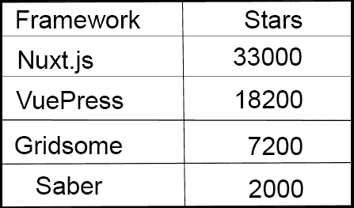
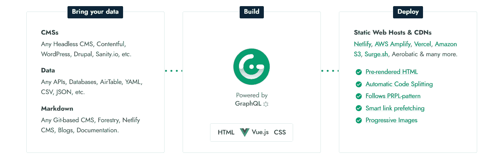
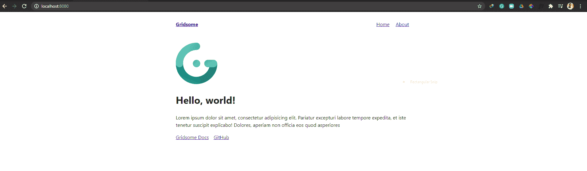
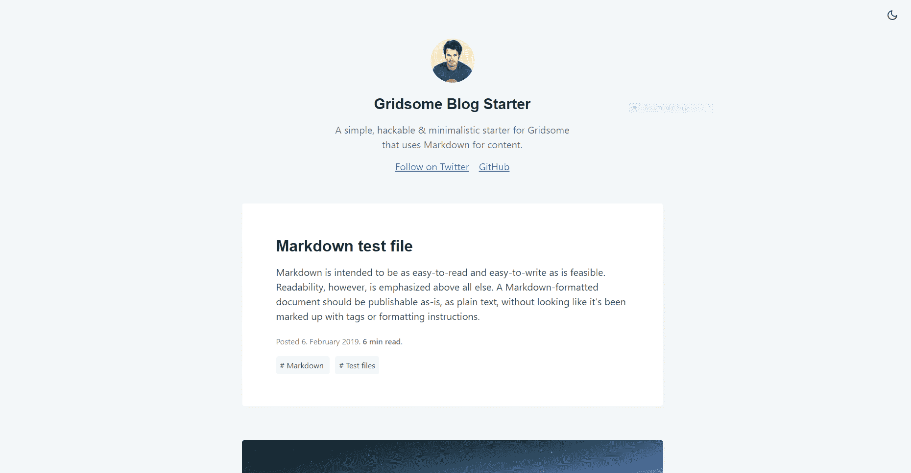
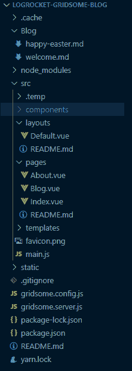
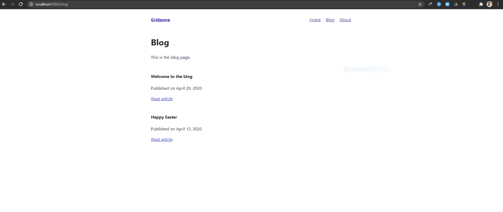
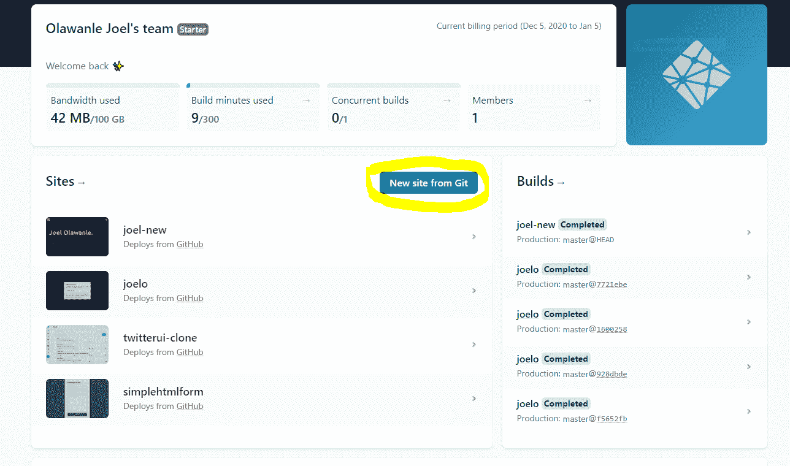
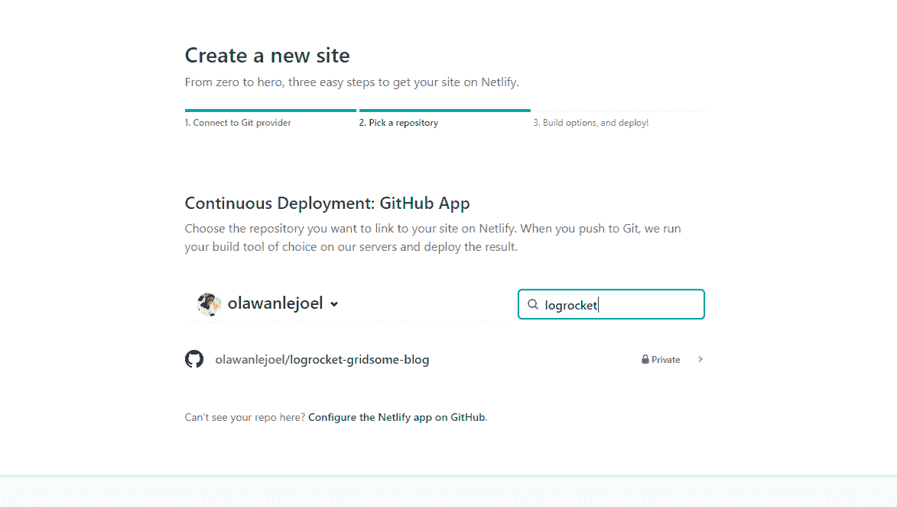
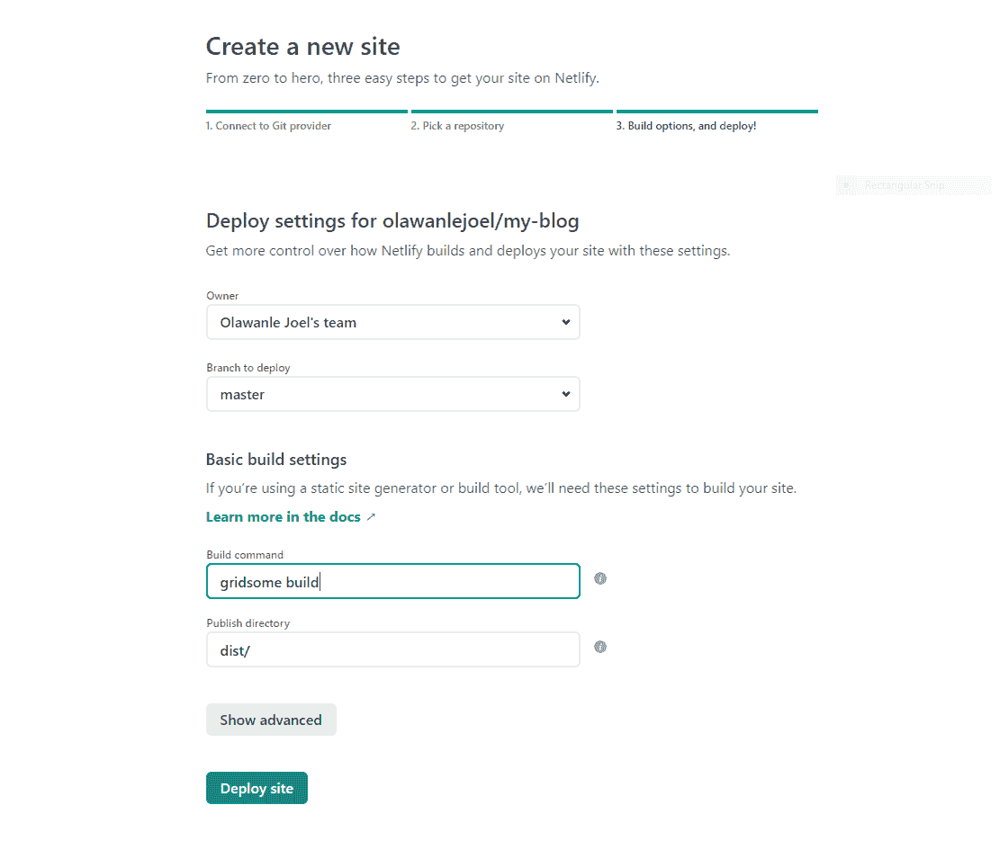

# Gridsome 入门

> 原文：<https://blog.logrocket.com/getting-started-with-gridsome/>

## 快速小结

每当您的单页面应用程序遇到性能问题时，您可以考虑使用静态站点生成器来减轻一些性能负担。有数百个静态站点生成器，Gridsome 是最受欢迎的一个，在 Github 上有超过 7000 颗星。Gridsome 当然值得详细看看，那就开始吧。

## 介绍

在本文中，我们将进一步了解 Gridsome:它是如何工作的，如何开始，如何使用 Gridsome 创建默认情况下快速的[网站和应用程序，最后，学习如何用 GraphQL 获取 markdown 内容。](https://gridsome.org/docs/fast-by-default/)

本教程是专门为那些想开始使用 Gridsome 并且已经使用了 [Vue.js](https://vuejs.org/) 的开发者准备的。在本教程结束时，您将理解如何利用 Gridsome 的许多功能——以及一些“陷阱”和需要记住的事情。

要开始使用 Gridsome，您需要确保安装了以下工具:

> 为了确认您已经安装了 Node，您可以在终端中运行`node --version`

*   npm(与 Node 一起包装)或[纱线](https://yarnpkg.com/en/docs/install)
*   基本了解如何使用[终端](https://www.linode.com/docs/tools-reference/tools/using-the-terminal/)
*   HTML、CSS 和 Vue.js 的基础知识

知道 GraphQL 如何工作是一个优势，尽管他们的文档中有很多例子可以快速查看。

## 为什么是 Gridsome？

Gridsome 是一个免费开源的 Vue 驱动的静态站点生成器(SSG ),用于构建快速、现代化的网站和应用程序

作为一个快速提醒，静态站点生成器自动构建个人 HTML 页面，并准备好这些页面提供给用户——访问/使用你的网站或应用程序的人。SSG 通过基于原始数据(例如，Markdown)和一组模板构建成熟的静态 HTML 页面来实现这一点。

Gridsome 利用 GraphQL 从不同来源获取数据，然后动态生成页面。

Gridsome 提供了一些现成的有用特性。Gridsome 在 [JAMStack](https://jamstack.org/) 之上运行良好。像大多数静态站点生成器一样，它支持 Markdown 和 headless CMS。最终产品是一个包含静态 HTML 文件的文件夹，您可以将其部署到任何地方。你可以把它放在服务器上的`/public_html`文件夹中，或者部署到 CDN 上。

Gridsome 还提供自动路由**。**您在`/src/pages`文件夹中创建的 Vue 组件会自动映射到一个带有`vue-router`的新页面，而无需您做任何事情。例如，如果你想为你的博客创建一个“关于”页面，你只需要创建一个名为`/src/pages/About.vue`的新文件，你的网站上就会自动出现一个[http://localhost:8080/About](http://localhost:8080/about)页面。这与 [Nuxt](https://nuxtjs.org/) 和 [Gatsby](https://www.gatsbyjs.org/) 的工作方式非常相似；它们有一个已定义的文件夹，其中的组件被映射到路由器中的页面，因此您不需要配置它们。

此外，Gridsome 还提供代码分割和资产优化。在 Vue 应用中，当你创建一个到另一个页面的内部链接时，你使用`<router-link>`。对于 Gridsome，您可以使用`<g-link>`来代替。它使用您可能熟悉的相同参数，但除此之外，它还通过预取当前视图中作为链接引用的资源和页面，在后台提供页面的视口内预取。您需要谨慎使用这个特性，因为它可能会给用户带来性能开销，因为他们可能永远不会真正使用这些页面和资产，但是它可以加快简单页面的体验。

Gridsome 还有一个内置的`<g-image>`组件，可以输出优化的压缩图像。它还可以在开发过程中实时调整大小和裁剪。它的工作原理类似于一个``元素，但是`<g-image>`也会生成一个原始图像的压缩模糊版本作为占位符。因此，当用户的浏览器最终从服务器接收到图像时，它会用实际的图像替换占位符。

## Gridsome 和其他静态站点生成器



考虑到有很多其他 Vue.js SSGs，如 Nuxt.js、 [VuePress](https://github.com/vuejs/vuepress) 和 [saber](https://github.com/saberland/saber) ，值得探索 Gridsome 何时使用有意义，何时没有意义。与 React 中的 Gatsby 类似，Gridsome 是一个数据驱动的框架，它使用 GraphQL 层来检索内容，并从中动态生成页面。虽然它还没有像 Nuxt.js 和 VuePress 那样成熟，但 Gridsome 有一些独特的功能，值得您在下一个项目中探索。

### Gridsome vs Nuxt.js vs VuePress

Nuxt.js 绝对是一个更完整的框架，Gridsome 能做的几乎都能做。然而，与使用 Apollo 配置的 Nuxt.js 相比，使用 Gridsome 可以将 GraphQL 数据层中的数据查询到任何页面、模板或组件中，而无需使用模块。

如果您计划构建一个大规模的应用程序，其中处理认证更适合服务器端，那么 Nuxt.js 可能是一个更好的选择。

如果你想建立一个漂亮、快速、搜索引擎友好的文档网站，并想使用 Markdown 和 markdown-it 及其广泛的生态系统，VuePress 是一个不错的选择。

如果你想用一个无头 CMS 连接你的站点，构建一个 JAMstack 项目，Gridsome 更强大。我认为 GraphQL 数据层使用起来非常方便和简单，因为它允许您从数据源构建静态内容。在这种情况下，Gridsome 是最好的选择。

## 入门指南



Source: Gridsome website

Gridsome 从 CMSs(任何无头 CMS，Contentful，WordPress，Drupal，Sanity.io 等)这样的数据源获取数据。)、本地文件或外部 API，并将数据存储在本地数据库中。GraphQL 作为一个集中式数据管理系统，让您能够在 Vue 组件中提取和使用数据。

然后，你可以将整个网站或应用部署到 CDN，如 [Netlify](https://gridsome.org/docs/deploy-to-netlify/) 、 [AWS Amplify](https://gridsome.org/docs/deploy-to-amplify/) 或 [Vercel](https://gridsome.org/docs/deploy-to-vercel/) 。一个 Gridsome 站点可以在不中断的情况下处理数千到数百万次点击，并且没有昂贵的服务器成本。

## 装置

一旦您确定已经在计算机上设置了 Node 和 npm 或 Yarn，现在就可以开始安装 Gridsome 了。如前所述，建议使用 Grisome 时了解如何使用终端。

第一步是安装 Gridsome CLI 工具:

*   使用纱线:`yarn global add @gridsome/cli`
*   使用 npm: `npm install --global @gridsome/cli`

您现在可以开始创建您的第一个 Gridsome 项目了！🎉

1.  运行`gridsome create first-gridsome-site`创建一个新项目
2.  用`cd first-gridsome-site`进入项目目录
3.  运行`gridsome develop`以在`[http://localhost:8080](http://localhost:8080)`启动本地开发服务器

现在，您可以在浏览器上启动开发服务器:



## 目录结构

下面是一个基本 Gridsome 项目的结构:

```
.
├── package.json
├── gridsome.config.js
├── gridsome.server.js
├── static/
└── src/
    ├── main.js
    ├── index.html
    ├── App.vue
    ├── layouts/
    │   └── Default.vue
    ├── pages/
    │   ├── Index.vue
    │   └── Blog.vue
    └── templates/
        └── BlogPost.vue 
```

根目录由 5 个主要文件和文件夹组成。

1.  `package.json`是存储项目所有依赖项的地方
2.  `gridsome.config.js`作为 Gridsome 站点的配置文件，您可以在其中配置插件
3.  `gridsome.server.js`是可选的，用于挂接 Gridsome 服务器的各个部分
4.  在构建期间，`/static directory`中的所有文件将被直接复制到`dist`。例如，`/static/robots.txt`将位于[https://yoursite.com/robots.txt](https://yoursite.com/robots.txt)
5.  大多数代码都在这里。在这个文件夹中，我们有:

`main.js`，导入全局样式和脚本。这个文件包含所有的应用程序配置，这样它就可以将应用程序的其他部分插入 Gridsome API。

`layouts/`，其组件用于换行。布局应该包含页眉、页脚或侧边栏等组件，这些组件将在整个网站中使用。所有布局组件都位于`src/layouts`文件夹中，并应指示为全局组件或每页导入。

## 使用布局

### 使布局全局化

如果您不想将布局导入每个单独的页面或模板，您可以创建全局布局。为此，转到`src/main.js`并导入您的布局文件。然后在导出函数中使布局全局化。

例如:

```
 import Layout from '~/layouts/Default.vue'

export default function (Vue, { head, router, isServer }) {
  Vue.component('Layout', Layout)
} 
```

现在，您可以在 Gridsome 项目中的任何地方使用`<Layout>`,而无需将其导入到每个页面:

```
<template>
  <layout>

  </layout>
</template> 
```

### 将布局导入特定页面

在某种情况下，某个布局并不适用于所有页面(例如，如果该布局包含 navbar，而您不希望它出现在登录和注册页面上)，那么您必须将这样的布局只导入到您需要的页面。

创建布局后，您需要将其导入到页面和模板中。这是在`<script>`标签中完成的:

```
 <template>
  <navLayout>
    Add page content here
  </navLayout>
</template>

<script> import navLayout from '~/layouts/navLayout.vue'

export default {
  components: {
    navLayout
  } } </script> 
```

每个布局都需要一个`<slot>`组件。这是来自页面和模板的内容将被插入的地方。布局可以有[个多槽](https://gridsome.org/docs/layouts/#multiple-content-slots):

```
 <template>
  <div>
    <header />
    <slot></slot> 
    <footer />
  </div>
</template> 
```

`pages/`目录中的每个组件都成为网站上的一个页面。每个页面都将根据`.vue`文件的位置获得它的路径。例如，`src/pages/Index.vue`将成为`homepage/`，而`src/pages/Blog.vue`将成为`localhost:8080/blog`或`example.com/blog`，它们将被渲染为博客页面。

`templates/`用于 GraphQL 集合的单帖子视图。要添加模板，创建一个与 GraphQL 集合同名的`.vue`文件到`src/templates`。

* * *

### 更多来自 LogRocket 的精彩文章:

* * *

如果你正在导入一个外部数据源，比如来自 WordPress 博客的文章，到你的项目中，每个文章将在这个目录中寻找一个组件作为它的模板。组件文件的名称必须与 GraphQL 模式中的节点类型相匹配。

### Gridsome 入门网站

Gridsome starter 站点是预先构建的项目，任何人都可以用来构建自己的网站。Gridsome 有 40 个+ [starter sites](https://gridsome.org/starters/) ，横跨 Markdown、Strapi、WordPress、Auth0 等众多平台。为了这篇文章，我将安装[官方 Gridsome 博客启动器](https://gridsome.org/starters/gridsome-blog-starter/)。

Gridsome Blog Starter 是一个简单的、可修改的、极简主义的 grid some Starter，它对内容使用 Markdown。它还具有暗/亮模式功能。

这是你的网站安装这个入门网站后的样子——[https://gridsome-starter-blog.netlify.com/](https://gridsome-starter-blog.netlify.com/)

### 安装步骤

首先安装 Gridsome CLI 工具:`npm install --global @gridsome/cli`。

如果不确定有没有，可以用`gridsome -v`确认是否已经安装了 Gridsome CLI。

接下来，安装入门网站:

1.  输入`gridsome create my-blog [https://github.com/gridsome/gridsome-starter-blog.git](https://github.com/gridsome/gridsome-starter-blog.git)`
2.  运行`cd my-blog`进入项目目录
3.  运行`gridsome develop`以在`[http://localhost:8080](http://localhost:8080)`启动本地开发服务器

恭喜，我们现在已经建立了一个 stater 站点，可以根据我们自己的口味进行修改！*🎉*

请访问`[http://localhost:8080](http://localhost:8080)`进入该网站:



现在，您可以打开 vsCode 或您喜欢的代码编辑器，根据您的喜好调整该站点。例如，您可以创建一个新的主页，将此页面转换为博客，并将其用作您的作品集网站。

## Gridsome 插件

插件支持附加的功能，这些功能可以绑定到你的 Gridsome 应用上。Gridsome 有一个蓬勃发展的插件生态系统，可以与许多东西进行复杂的集成。这些通常是使用 npm 安装的 JavaScript 库，然后根据项目需求进行配置。

在写的时候，Gridsome 有 194 个插件，你可以在这里访问[。要安装任何 Gridsome 插件，可以使用 npm 或 Yarn。](https://gridsome.org/plugins/)

> 任何以`@gridsome/`开头的插件都意味着它是 Gridsome 创建者的官方插件。要安装一个插件，你所要做的就是访问通用插件页面，搜索想要的插件，然后按照安装步骤操作。

## 建立一个获取降价内容的博客

使用 Markdown 构建博客的第一步是创建和设置一个 Gridsome 项目，如前面使用`gridsome create gridsome-blog`所解释的。

在本教程中，我将使用两个插件:

1.  [`@gridsome/source-filesystem`](https://gridsome.org/plugins/@gridsome/source-filesystem) 插件，用于将文件转换成可以用组件中的 GraphQL 获取的内容
2.  [`@gridsome/transformer remark`](https://gridsome.org/plugins/@gridsome/transformer-remark) ，一个带备注的网格降价转换器

### 降价

Markdown 是一种轻量级的标记语言，可以用来为纯文本文档添加格式元素。由约翰·格鲁伯于 2004 年创建的 Markdown 现在是世界上最流行的标记语言之一。Markdown 几乎可以用于任何东西，比如[网站、文档、笔记、书籍、演示文稿、电子邮件和技术文档。](https://www.markdownguide.org/getting-started/#websites)

### 安装插件

如前所述，您可以使用 Yarn 或 npm 来安装插件。让我们使用 npm 同时安装这两个组件，如下所示:

```
npm i -S @gridsome/source-filesystem @gridsome/transformer-remark 
```

一旦安装成功，您将需要在`gridsome.config.js`文件中配置`@gridsome/source-filesystem`插件。这就是为什么 Gridsome 会查找`blog`文件夹，并添加所有待查询的帖子:

```
// gridsome.config.js

module.exports = {
  siteName: 'Gridsome',
  plugins: [
    {
      use: '@gridsome/source-filesystem',
      options: {
        typeName: 'BlogPost',
        path: './blog/**/*.md',
      },
    },
  ],
  templates: {
    BlogPost: '/blog/:title',
  },
}; 
```

以上配置就是我们设置`source-filesystem`插件所需要的。

*   `typeName`是 GraphQL 的类型和模板名

> `src/templates`中的`.vue`文件必须与`typeName`相匹配，才能拥有它的模板。

*   `path`是我们将在帖子/博客中消费的降价内容的位置
*   `templates.BlogPost`是每个帖子将遵循的路线，即`localhost:8080/blog/new-post`

所以这不会变得太复杂，让我们创建我们的降价文件/帖子。这些将作为虚拟博客帖子。首先，创建包含我们博客文章的`blog`文件夹:

`blog/welcome.md`

```
---
title: 'Welcome to the blog'
date: 2020-04-20
---

This is the first post in this brand new blog.
Of course we have all the power of Markdown here,
so we can make things **bold** or _italic_. 
```

`blog/happy-easter.md`

```
---
title: 'Happy Easter'
date: 2020-04-12
---

As it turns out I'm writing this on Easter,
so why not include a picture of a easter egg here.

!\[easter egg\](https://images.unsplash.com/photo-1457301353672-324d6d14f471?ixlib=rb-1.2.1&ixid=eyJhcHBfaWQiOjEyMDd9&auto=format&fit=crop&w=500&q=80) 
```

为了避免混淆，下面是我的文件和文件夹结构的样子:



每当您修改`gridsome.config.js`文件或添加新的博客文章时，您都需要点击(Ctrl + c)来重启 Gridsome 开发服务器，这样它就会获得新的配置和您刚刚创建的文件。

### 使用 GraphQL 查询数据

在 Gridsome 中，有很多方法可以将数据放入您的站点，但是一种非常流行和简单的方法是通过 GraphQL。既然我们已经设置了插件并创建了虚拟帖子，让我们来看看 GraphQL 操场。

数据可以从 GraphQL 数据层查询到任何页面、模板或组件中。在 pages &模板中添加一个`<page-query>`块，或者在组件中添加一个`<static-query>`块。

运行`gridsome develop`并导航到[http://localhost:8080/_ _ _ 探索](http://localhost:8080/___explore):

```
 query {
  posts: allBlogPost {
    edges {
      node {
        id
        title
        date (format: "MMMM D, YYYY")
        path
      }
    }
  }
} 
```

当您单击大的**播放**按钮时，我们会得到下面的结果，显示我们作为 Markdown 文件创建的两篇博客文章现在可以通过 GraphQL 端点获得:

```
{
  "data": {
    "posts": {
      "edges": [
        {
          "node": {
            "id": "46ea6f212d1378a5dcc360216e17dbc4",
            "title": "Welcome to the blog",
            "date": "April 20, 2020",
            "path": "/blog/welcome-to-the-blog/"
          }
        },
        {
          "node": {
            "id": "54c8892e9cf791f134c7ace95dcbcf5e",
            "title": "Happy Easter",
            "date": "April 12, 2020",
            "path": "/blog/happy-easter/"
          }
        }
      ]
    }
  }
} 
```

下一步是在组件或页面中查询和显示数据。之前，我们在 pages 文件夹中创建了一个文件`Blog.vue`。现在我们有了一些内容，让我们把它添加到页面上。

让我们在`src/components/`中创建一个组件`BlogPostList`，使我们的项目更容易维护和测试。在`BlogPostList.vue`文件中，使用下面的代码:

```
// src/components/BlogPostList.vue

<template>
  <div class="post-list">
    <article class="post" v-for="post in posts" :key="post.node.id">
      <h4>{{post.node.title}}</h4>
      <p>Published on {{post.node.date}}</p>
      <g-link :to="post.node.path">Read article</g-link>
    </article>
  </div>
</template>

<script> export default {
  props: ['posts']
} </script>

<style> .post-list {
  margin-top: 12px;
}

.post {
  padding: 12px 0;
} </style> 
```

这个文件只是接收来自`Blog.vue`文件的数据作为道具，我们将在这个文件中获取我们的博客文章。

我们将使用`<page-query>`从 GraphQL 端点获取博客文章列表，因为它是一个页面:

```
// src/pages/Blog.vue

<template>
  <Layout>
    <h1>Blog</h1>
    <p>This is the blog page.</p>

    <BlogPostList :posts="$page.posts.edges"/>
  </Layout>
</template>

<script> import BlogPostList from '~/components/BlogPostList.vue';

export default {
  metaInfo: {
    title: 'Blog'
  },
  components: {
    BlogPostList
  } } </script>

<page-query>
query {
  posts: allBlogPost {
    edges {
      node {
        id
        title
        date (format: "MMMM D, YYYY")
        path
      } }
  }
}
</page-query> 
```

现在，当您通过`[http://localhost:8081/blog/](http://localhost:8081/blog/)`访问博客页面时，我们应该会看到博客文章列表:



### 创建文章页面

现在是时候创建一个帖子页面了。在这一点上，如果你试图点击每篇文章下面的**阅读文章**链接，它会把你带到一个 404 错误页面。这是因为我们还没有为每篇博客文章创建一个页面。

> 404 页面可以[轻松定制](https://gridsome.org/docs/pages/#custom-404-page)。

提醒一下，`typeName`是 GraphQL 的类型和模板名，`src/templates`中的`.vue`文件必须与`typeName`匹配才能拥有模板。

要为集合中的节点创建单个页面(在本例中，集合是`BlogPost`)，让我们创建一个新文件`src/templates/BlogPost.vue`，在这里我们定义博客文章的外观。

我们将需要再次添加一个页面查询来从 GraphQL 端点获取文章本身，这一次我们还需要字段`content`,因为它包含 HTML 格式的文章正文:

```
// src/templates/BlogPost.vue

<template>
  <Layout>
    <article>
      <header>
      <h2>{{$page.post.title}}</h2>
      <p>Published on {{$page.post.date}}</p>

      <p><i>{{$page.post.timeToRead}}min to read</i></p>
      </header>

      <main class="content" v-html="$page.post.content"></main>
    </article>
  </Layout>
</template>

<style> article > header {
  text-align: center;
}

.content {
  margin-top: 48px;
} </style>

<page-query>
query Post ($path: String!) {
   post: blogPost (path: $path) {
    id
    title
    date (format: "MMMM D, YYYY")
    timeToRead
    content
  }
}
</page-query> 
```

有了这些，我们就可以创建一个博客，获取降价内容和文件作为帖子。在这里，您可以随意添加额外的内容和功能到您的网站。

> 你可以在这里找到我的源代码

## 构建学生档案网站

在本教程中，我将使用`[gridsome/source-faker](https://gridsome.org/plugins/@gridsome/source-faker)`插件来获取站点数据。将使用 GraphQL 查询这些数据。

### 安装插件

如前所述，您可以使用 yarn 或 npm 来运行此安装:

```
yarn add @gridsome/source-faker 
```

或者

```
npm install @gridsome/source-faker 
```

安装完成后，下一步是在`gridsome.config.js`中注册插件:

```
export default {
  plugins: [
    {
      use: '@gridsome/source-faker',
      options: {
        numNodes: 100
      }
    }
  ]
} 
```

### 使用 TailwindCSS 进行样式设置

为了使这个网站有吸引力，我将使用 TailwindCSS。在 Gridsome 中有许多[选项](https://tailwindcss.com/docs/installation)可以用来安装 TailwindCSS，但我将使用他们的 CDN。

在`main.js`文件中，我们将添加头部元数据，然后包含外部 CSS/CDN 链接:

```
import DefaultLayout from '~/layouts/Default.vue'
export default function (Vue, { router, head, isClient }) {

  Vue.component('Layout', DefaultLayout)
   head.link.push({
    rel: 'stylesheet',
    href: 'https://unpkg.com/[[email protected]](/cdn-cgi/l/email-protection)^2/dist/tailwind.min.css'
  })
} 
```

### 创建个人资料页面和链接

成功设置插件和 TailwindCSS 后，下一步是创建一个新页面，然后在我们的默认布局中链接它:


创建新页面后，转到`layouts/Default.vue`将这个新链接包含在导航栏中，要知道`Default.vue`出现在所有页面上，因为它用于包装页面组件:

```
<template>
  <div class="layout">
    <header class="header">
      <strong>
        <g-link to="/">{{ $static.metadata.siteName }}</g-link>
      </strong>
      <nav class="nav">
        <g-link class="nav__link" to="/">Home</g-link>
        <g-link class="nav__link" to="/profile/">Profile</g-link>
        <g-link class="nav__link" to="/about/">About</g-link>
      </nav>
    </header>
    <slot />
  </div>
</template> 
```

为了确保新页面使用了`defualt.vue`，我们需要用`main.js`中给它的名字包装我们的代码，如前所述，这个名字在`layout`中。

### 使用 GraphQL 查询数据

我们在本文前面已经讨论过这个主题[，](#GraphQL),所以你可以继续学习这部分教程。你可以在这里找到我的[源代码](https://github.com/olawanlejoel/student-profile)，还有这里的[直播站点。](https://xenodochial-tesla-f43309.netlify.app/profile/)

## 实时部署

使用 Gridsome 时，部署站点的最佳方式是利用 GitHub 之类的 Git 服务，然后连接一个部署服务(Netlify、AWS Amplify、Vercel、Github Pages、Surge.sh 等)。)从选定的存储库中构建您的站点。其中一些服务(例如 Vercel 和 Surge.sh)允许您从终端部署静态 Gridsome 站点。

Gridsome 附带了一组用于开发和生产目的的有用命令:

| 命令 | 描述 |
| --- | --- |
| 创造 | 脚手架工具，使您能够使用`gridsome create my-app`在几秒钟内创建 Gridsome 应用程序 |
| 发展 | 在 [http://localhost:8080/](http://localhost:8080/) 启动一个本地开发服务器，使用`gridsome develop`进行热重装 |
| 建设 | 该命令使用`gridsome build`在项目的`dist`目录中生成一个静态站点 |
| 探索 | 要启动 [GraphQL 游乐场](https://github.com/prisma/graphql-playground)并探索您的模式或数据，请转到`[http://localhost:8080/___explore](http://localhost:8080/___explore)` |
| 信息 | 使用`gridsome info`输出关于本地环境的信息 |

### 部署到网络

使用 Netlify 部署您的项目或网站需要两件主要的事情:

1.  GitHub 账户
2.  一个 [Netlify](https://netlify.com/) 账户(您可以使用您的 GitHub 详细信息在 Netlify 上注册)

如果你有一个 GitHub 和一个 Netlify 账户，那么你可以通过 Git 把你的代码推送到 GitHub。

推送至 GitHub 后，通过 netlify.com 访问您的 Netlify 仪表盘并登录:



登录后，您现在可以点击 Git 中的**新站点按钮，然后**选择 GitHub** 作为 Git 提供者，在那里托管您站点的源代码以进行持续部署:**



您现在可以搜索存储库，这样您就可以开始部署您的网站，如上图所示。



为 Gridsome 添加构建命令(`gridsome build`)。部署可能需要一些时间，但一旦完成，您就可以通过 Netlify 为您生成的链接访问您的站点。

运行`gridsome build`命令后，还可以通过使用生成的`dist`文件夹来使用[网络删除](https://app.netlify.com/drop)。

### FTP 部署

FTP 代表文件传输协议，它是计算机通过互联网将文件从一个系统传输到另一个系统时遵循的一组规则。要通过 FTP 在传统主机上托管您的 Gridsome 站点，您需要通过运行项目文件夹中的`gridsome build`从终端手动构建您的项目，以便在您生成的站点所在的位置生成一个`dist`文件夹。

生成的文件夹现在可以上传到任何 FTP。

## 结论

随着静态站点生成器越来越受欢迎，您必须能够理解如何使用像 Gridsome 这样的 SSG 来轻松地构建静态网站，从而向您的用户交付内容。

本文只是对 Gridsome 的一个介绍。你可以查看 Gridsome 官方文档，在这里了解更多[。](https://gridsome.org/docs/)

要了解更多关于 Gridsome 的信息，您可以查看以下链接:

如果你有任何问题，你可以把它们留在评论区，我很乐意回答每一个问题！感谢阅读！

## 资源

使用 [LogRocket](https://lp.logrocket.com/blg/signup) 消除传统错误报告的干扰

## [LogRocket](https://lp.logrocket.com/blg/signup) 是一个数字体验分析解决方案，它可以保护您免受数百个假阳性错误警报的影响，只针对几个真正重要的项目。LogRocket 会告诉您应用程序中实际影响用户的最具影响力的 bug 和 UX 问题。

[](https://lp.logrocket.com/blg/signup)

然后，使用具有深层技术遥测的会话重放来确切地查看用户看到了什么以及是什么导致了问题，就像你在他们身后看一样。

LogRocket 自动聚合客户端错误、JS 异常、前端性能指标和用户交互。然后 LogRocket 使用机器学习来告诉你哪些问题正在影响大多数用户，并提供你需要修复它的上下文。

关注重要的 bug—[今天就试试 LogRocket】。](https://lp.logrocket.com/blg/signup-issue-free)

Focus on the bugs that matter — [try LogRocket today](https://lp.logrocket.com/blg/signup-issue-free).