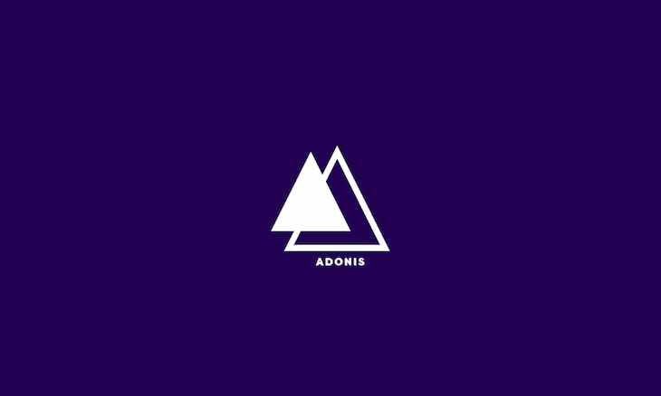
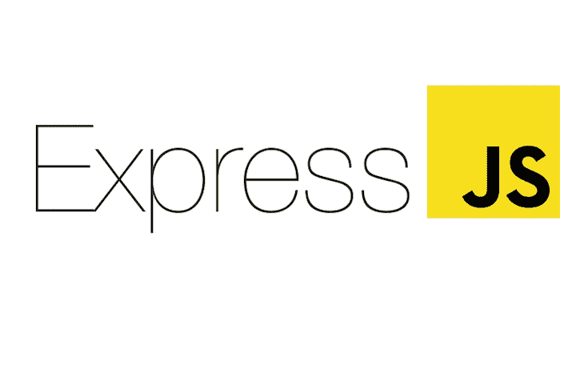
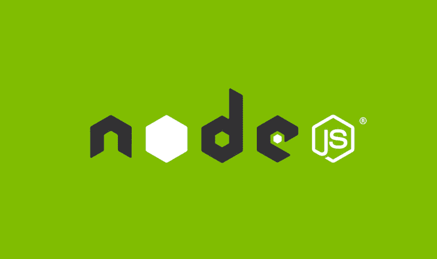
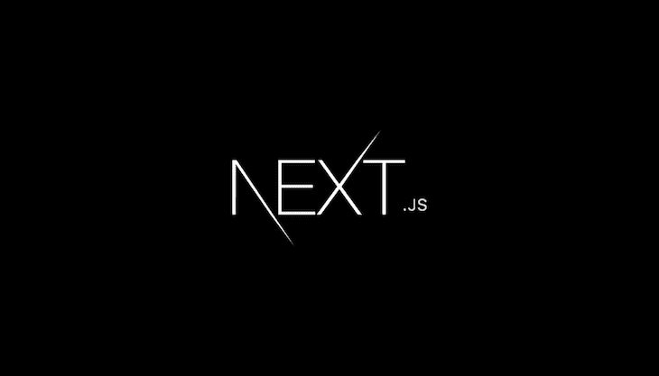

# PHP 开发人员 JavaScript 入门

> 原文：<https://blog.logrocket.com/getting-started-with-javascript-for-php-developers/>

看完标题后，您一定想知道，“为什么您首先要从 PHP 迁移到 JavaScript 呢？为什么写一篇关于它的文章很重要？”嗯，作为一名 PHP 开发人员，从 PHP 转换到 JavaScript 对我来说是一个重大的转变——也是一个困难的转变。

我必须找到一个我能与之相关的 JavaScript 框架 AdonisJs 就是一个例子，因为它和 Laravel 有相同的 MVC(模型、视图、控制器)架构。从那以后，我逐渐转向其他框架，研究语法并适应 PHP 和 JavaScript 之间的巨大差异。

我开始使用 JavaScript 的一个重要原因是因为我想提高我的前端技能。该语言还支持客户端编程，JavaScript 生态系统是迄今为止最大的生态系统之一——如果使用正确的关键字，您可以找到任何事情的任何解决方案。([栈溢出](https://stackoverflow.com/)仍然是我解决问题的主要来源😂。)

## 那么为什么是 JavaScript 呢？为什么不是其他语言呢？

所以一开始，我有很多其他选择，从 Ruby 和 Python 到 Swift 等等。但是我选择 JavaScript 的主要原因是它的灵活性、与 JSON 格式的简单交互，当然还有它的 DOM 操作能力。它广泛的使用案例也很吸引人——比如构建 web、移动和桌面应用程序，创建 3D 游戏，以及其他不胜枚举的应用。

与 PHP 不同，JavaScript 支持构建移动、web 和桌面应用程序，它之所以能有效地做到这一点，是因为它允许开发人员插入如此多的外部文件，这些文件以异步方式工作，为您提供最佳结果。

JavaScript 社区是另一个重要原因。它是广泛而活跃的，你基本上可以选择任何编程模式并得到你所需要的支持。比如你是一个严格的程序员吗？你可以用打字稿工作。我可以继续讲这些理由，但让我们长话短说。

## 使用 JavaScript 的优势

JavaScript 是作为符合 ECMAScript 规范的客户端编程语言而构建的。它遵循与每种高级编程语言相同的基本原理，包括数组、循环、语句、函数和构成语言的其他构件。借助 JavaScript，借助 Node.js 和 Deno，您可以构建前端和后端应用程序。

使用 JavaScript 作为后端开发人员有很多好处，包括灵活性、可用性和大量可供选择的框架。但可以说最引人注目的优势是它的社区——更不用说就业机会了。

### 体系结构

JavaScript 支持多种应用程序架构，这取决于您想要构建的应用程序的类型。JavaScript 应用程序架构的范围从 MVC 到同构、SPA、多页面应用程序等等。PHP 围绕 MVC 架构，真的突破不了。

### 表演

JavaScript 有一个事件驱动、单线程、非阻塞的 I/O 执行模型。这种模型由事件循环和节点聚类来保证。Node.js 的异步特性使其能够同时运行整个代码库，而无需等待某些功能被执行。

PHP 的特点是多线程、阻塞 I/O 执行模型。与 JavaScript 不同，PHP 是同步的；这仅仅意味着如果第一行代码没有完成，下一行代码就不能执行。

### 可用性

当你刚开始使用 JavaScript 时，你首先注意到的是它的可用性。JavaScript 语法的简单性使得采用任何 JavaScript 框架都很容易，只要您了解该语言的基础知识。JavaScript 还具有高度的可维护性，并支持大量的包，这使得它能够更有效地交付世界级的应用程序。

### 灵活性

JavaScript 是一种全栈应用程序语言，允许开发人员构建 web、移动和桌面应用程序，而无需依赖外部 API 或另一种语言来呈现前端。另一方面，PHP 是严格意义上的后端语言，根本无法与 JavaScript 提供的灵活性相媲美。

### 应用程序兼容性

JavaScript 支持专用的服务器托管，这允许它运行大规模的软件应用程序、3D 游戏和其他令人惊叹的东西。

PHP 是一种通用编程语言，主要用于构建动态 web 应用程序。PHP 更喜欢内容管理应用程序。

首先，JavaScript 是 GitHub 上最流行的语言。它拥有最强大、最活跃的开发人员社区之一，并在全球范围内被世界上每一个活跃的网络公司所使用。

PHP 也有一个非常大的社区，但是多年来，新开发人员更倾向于运行在 JavaScript 上的框架，而不是 PHP。

### 语言交叉编译

许多语言可以在 JavaScript 中交叉编译和翻译，比如 Java、C#、Lisp，甚至 BASIC。最重要的是，JavaScript 为喜欢严格编程的开发人员提供了像 TypeScript 和 CoffeeScript 这样的超集。

## PHP 开发人员的最佳 JavaScript 后端框架

作为第一次尝试 JavaScript 的 PHP 开发人员，了解在您轻松使用 JavaScript 时会对哪些框架感到熟悉是很重要的。要做出决定，你必须考虑:

*   哪些框架支持您习惯的架构？
*   有哪些数据库连接和配置？
*   框架是支持前端应用内渲染还是使用 API 与前端通信？
*   维护和扩展您用这个框架构建的应用程序有多容易？

为了让这个决定变得简单一点，我推荐以下几个 JavaScript 框架。这些框架使用不同的编程方法，它们的架构也各不相同。但是根据你的申请类型，他们是我推荐的选择。

我从 AdonisJs 开始，因为它支持 Laravel 流行的 MVC 架构。AdonisJs 是一个 JavaScript 框架，用于编写微服务和构建样板应用程序。

它从 Laravel 获得灵感，并遵循相同的编程模式，包括使用提供者和依赖注入来组织代码。就连 Adonis.js 的文件目录也和 Laravel 类似，如果你是 Laravel 开发者，这是最好的入门框架。

AdonisJs 在构建 API 方面非常有效，它是一个轻量级的应用程序，所以它不需要大量的存储空间或配置来启动它。它还支持一系列数据库，如 MySQL(PHP 以使用 MySQL 而闻名)、SQLite、Redis 等。

Express.js 是一个最小且灵活的 Node.js web 应用程序框架，为 web 和移动应用程序提供了一组强大的功能。它也是为构建单页面、多页面和混合 web 应用程序而设计的。随着时间的推移，它已经成为 Node 的标准服务器框架。

Express 充分体现了服务器端编程，与 MongoDB 高度兼容，但如果不是真正熟悉 Mongo，也可以与 MySQL 等其他数据库配合使用。虽然 Express 支持构建前端应用程序，但是强烈建议在构建 API 时使用它。

像 AdonisJs 一样，Express 支持 MVC 架构，但也对其他模式开放——选择权在你。

是的，Node.js 也可以被视为后端框架，尽管它是一个全栈应用程序框架。

Node.js 是基于 Chrome 的 V8 JavaScript 引擎构建的 JavaScript 运行时。Node 使用事件驱动的非阻塞 I/O 模型，这使它变得轻量级和高效。作为异步事件驱动的 JavaScript 运行时，Node.js 旨在构建可伸缩的网络应用。

Node.js 的另一个优点是，其他框架，如 Adonis.js、Express.js 和许多其他框架都是基于 Node.js 构建的。所以，是的，您可以使用 Node.js 构建一个全新的框架，根据您的口味和您自己的架构进行配置。

Next.js 是一个全栈的 web 应用框架，它真正模糊了后端和前端之间的界限。Next.js 是客户端预渲染的 [React](https://reactjs.org/) app，用户可以查看并与之交互，可以认为是前端。

同时，它还处理服务器端渲染和 API 路由，可以执行服务器端代码和访问数据库中的数据——因此，它可以被视为后端。

Next.js 还支持 TypeScript，它使用了 onorepo 架构，将所有的配置和测试文件存储在一个地方，允许原子提交，并且通常将所有隔离的代码部分保存在一个存储库中。

## 结论

作为开发人员，很难决定使用哪种框架或语言来构建应用程序。它总是取决于用例，我不是来为你做决定的。我只是分享我的观点和我开始使用 JavaScript 构建我的应用程序的原因。不要误解我——我喜欢 PHP，但我更喜欢 JavaScript。我希望这篇文章能让你在决定使用什么和什么时候使用时有所启发。

## 您是否添加了新的 JS 库来提高性能或构建新特性？如果他们反其道而行之呢？

毫无疑问，前端变得越来越复杂。当您向应用程序添加新的 JavaScript 库和其他依赖项时，您将需要更多的可见性，以确保您的用户不会遇到未知的问题。

LogRocket 是一个前端应用程序监控解决方案，可以让您回放 JavaScript 错误，就像它们发生在您自己的浏览器中一样，这样您就可以更有效地对错误做出反应。

[https://logrocket.com/signup/](https://lp.logrocket.com/blg/javascript-signup)

[LogRocket](https://lp.logrocket.com/blg/javascript-signup) 可以与任何应用程序完美配合，不管是什么框架，并且有插件可以记录来自 Redux、Vuex 和@ngrx/store 的额外上下文。您可以汇总并报告问题发生时应用程序的状态，而不是猜测问题发生的原因。LogRocket 还可以监控应用的性能，报告客户端 CPU 负载、客户端内存使用等指标。

自信地构建— [开始免费监控](https://lp.logrocket.com/blg/javascript-signup)。