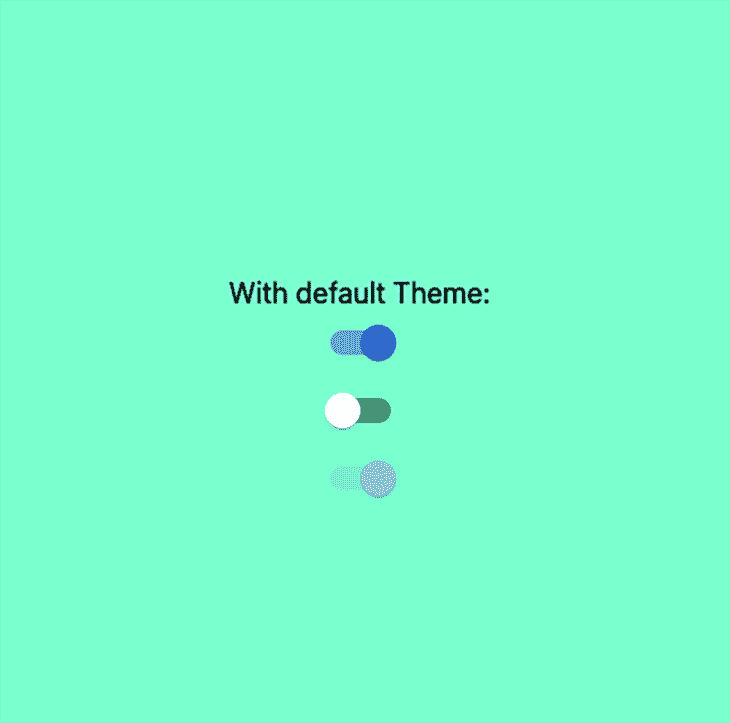
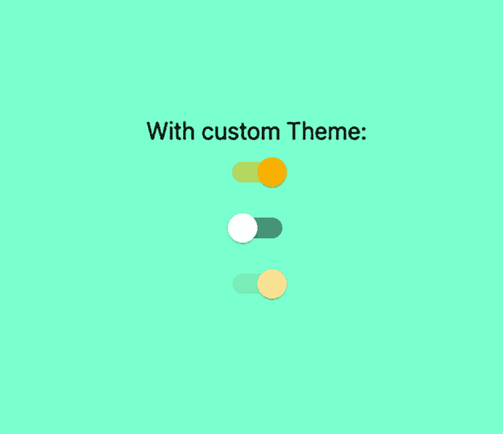

# MUI 和 Next.js 入门

> 原文：<https://blog.logrocket.com/getting-started-with-mui-and-next-js/>

无论是在商业还是私人环境中，尽快开始你的项目可能是 web 开发中一个非常重要的因素。这就是像 Next.js 这样的框架和像 MUI 这样的库如此受欢迎和有用的原因。

在这篇博文中，我们将通过以下几个部分来介绍使用 MUI 设置 Next.js 的过程:

在我们看一下具体的设置之前，让我先解释一下什么是 Next.js 和 MUI，以及为什么这个设置与在其他场景中使用 MUI 不同。

### 什么是梅？

MUI(以前的 Material UI)是一个非常完善的组件库，它实现了 Google 的材质设计系统。这个库是开源的，因此是完全可定制的。开箱即用，MUI 提供了生产就绪的组件，如按钮、警报、菜单、表格等等。

查看 MUI 的[文档](https://mui.com/material-ui/getting-started/overview/)以了解他们所提供的内容。

### Next.js 是什么？

Next.js 是一个非常流行的使用 React 开发全功能 web 应用的框架。Next.js 不仅从你那里获得关于项目配置的一切，还提供数据获取和[路由](https://blog.logrocket.com/what-you-need-know-new-next-js-router/)等问题的解决方案。

## Next.js 和 MUI 的组合有什么特别之处？

Next.js 如此受欢迎的另一个原因是，它允许你预渲染 web 应用程序的每一页。因此，Next.js 将在服务器端预先生成 HTML，而不是让 JavaScript 在客户端完成所有这些工作。这种行为通常会提高性能和 SEO。

然而，当与 MUI 结合使用时，服务器端渲染给我们带来了一些挑战。即使 MUI 被设计成在服务器端呈现，开发人员也需要确保该功能被正确集成——而这正是这篇博客文章的目的。

一般来说，在服务器端渲染 CSS 并不是绝对必要的。但是如果你不在你的服务器响应中包含样式，而让 CSS 由客户端注入，那么 [FOUC](https://en.wikipedia.org/wiki/Flash_of_unstyled_content) (闪烁)的风险就会存在。

## 入门指南

为了更好地理解，我建议掌握 JavaScript、React 和 Next.js 的基础知识(尤其是像服务器端渲染这样的原则)会有所帮助。

这篇博文的源代码可以在[这里](https://github.com/kevintomas1995/logrocket-mui-nextjs)找到。

为了开始，让我们创建一个新的 Next.js 项目。为此，切换到您想要存储项目的目录并运行:

```
npx [email protected]
```

在这个过程中，您将被要求命名您的项目。在这里选择你喜欢的任何东西。之后，使用以下内容进入您的项目:

```
cd <project-name>
```

关于设置还有一件事要做，那就是安装必要的软件包。

```
npm install @mui/material @emotion/react @emotion/server
```

你会注意到我们从名为 [Emotion](https://emotion.sh/docs/introduction) 的库中安装包。简而言之，Emotion 是一个允许用 JavaScript 编写 CSS 的库，在最新版本的 MUI (5)中用于创建样式。

安装完所有包后，继续启动 Next.js 应用程序:

```
npm run dev
```

## 创建您的自定义主题

在我们定制主题之前，我们可以清理我们的项目。你可以删除`pages`目录中的`API`目录，因为在这篇文章中我们不会实现任何 API 路由。

其次，用下面的 CSS 替换`styles` 目录下的`Home.module.css` 文件中的所有样式:

```
.container {
 padding: 0 2rem;
 display: flex;
 flex-direction: column;
 justify-content: center;
 align-items: center;
 height: 100vh;
 background-color: aquamarine;
}
```

现在，跳到您的`pages`目录中的`index.js` 文件，并用以下代码替换代码:

```
import styles from "../styles/Home.module.css";
import Switch from "@mui/material/Switch";

const label = { inputProps: { "aria-label": "Switch demo" } };

export default function Home() {
 return (
   <div className={styles.container}>
     <div>
       <span>With default Theme:</span>
     </div>
     <Switch {...label} defaultChecked />
     <Switch {...label} />
     <Switch {...label} disabled defaultChecked />
   </div>
 );
}
```

正如你在上面的代码中看到的，我们导入了一个 [`Switch`组件](https://mui.com/material-ui/react-switch/)，我们在三种不同的状态下使用了它三次。你的网页应该是这样的:



此时，服务器端还没有呈现样式。尽管如此，我们的页面看起来像我们想要的那样，很可能你不会注意到任何闪烁。

但是，如果页面变得更加复杂和广泛，闪烁的可能性就会增加。

### 实现自定义主题

接下来，让我们实际实现我们的自定义主题。为此，您需要在项目的根级别创建一个新目录。在我的例子中，我在该目录中将其命名为`utils**.**` ，创建一个名为`theme.js`的文件并添加以下代码:

```
import { createTheme } from "@mui/material/styles";

export const theme = createTheme({
 palette: {
   primary: {
     main: "#fcba03",
   },
 },
});
```

这个文件将允许你覆盖 MUI 的默认主题设置。为了简单起见，我们只将主色盘改为橙色。

为了实际应用这些更改，我们需要告诉我们的网页使用这个自定义主题。这是在`pages` 目录下的`_app.js` 文件中完成的:

```
import "../styles/globals.css";
import { ThemeProvider } from "@mui/material";
import { theme } from "../utils/theme";

function MyApp({ Component, pageProps }) {
 return (
   <ThemeProvider theme={theme}>
     <Component {...pageProps} />
   </ThemeProvider>
 );
}

export default MyApp;
```

这里唯一需要调整的是用一个`ThemeProvider` 组件包装我们的组件，并将我们的自定义主题传递给它。这个`ThemeProvider` 组件将处理我们的主题到我们的应用程序的注入。

现在，我们的页面应该是这样的:

id= "添加服务器端渲染样式">添加服务器端渲染样式

为了最终添加服务器端呈现的 CSS，我们需要添加/定制三个最终文件。

首先，在`utils` 目录中创建一个名为`createEmotionCache.js`的新文件。

```
import createCache from "@emotion/cache";

export default function createEmotionCache() {
 return createCache({ key: "css", prepend: true });
}
```

这个 [`createEmotionCache`函数](https://emotion.sh/docs/@emotion/cache)确保 Emotion 的默认设置将被替换为我们的自定义样式，并且这些信息将在客户端和服务器端进行配置。prepend 选项被设置为`true`，这将导致我们的自定义样式首先被加载。

在下一步中，我们将首先在客户端的`pages` 目录中的`_app.js` 文件中提供这个缓存:

```
import "../styles/globals.css";
import { ThemeProvider } from "@mui/material";
import { theme } from "../utils/theme";
import createEmotionCache from "../utils/createEmotionCache";
import { CacheProvider } from "@emotion/react";

const clientSideEmotionCache = createEmotionCache();

function MyApp({
 Component,
 emotionCache = clientSideEmotionCache,
 pageProps,
}) {
 return (
   <CacheProvider value={emotionCache}>
     <ThemeProvider theme={theme}>
       <Component {...pageProps} />
     </ThemeProvider>
   </CacheProvider>
 );
}

export default MyApp;
```

在上面代码片段的第一行，我们用刚刚定义的函数创建了客户端缓存。之后，我们需要做的就是将我们的组件包装在一个`CacheProvider`中，以便为我们的组件提供样式。

最后，我们需要找出一种方法来告诉服务器端在页面/响应被发送到客户端之前正确地呈现样式。这将在一个定制的`[_document.js](https://nextjs.org/docs/advanced-features/custom-document)`文件中完成，我们需要将它添加到`pages` 目录中。目的是将我们的风格添加到页面的`<head>`标签中。向新创建的`_document.js`文件添加以下代码:

```
import * as React from "react";
import Document, { Html, Head, Main, NextScript } from "next/document";
import createEmotionServer from "@emotion/server/create-instance";
import createEmotionCache from "../utils/createEmotionCache";

export default class MyDocument extends Document {
 render() {
   return (
     <Html lang="en">
       <Head>
         {this.props.emotionStyleTags}
       </Head>
       <body>
         <Main />
         <NextScript />
       </body>
     </Html>
   );
 }
}

MyDocument.getInitialProps = async (ctx) => {
 const originalRenderPage = ctx.renderPage;

 const cache = createEmotionCache();
 const { extractCriticalToChunks } = createEmotionServer(cache);

 ctx.renderPage = () =>
   originalRenderPage({
     enhanceApp: (App) =>
       function EnhanceApp(props) {
         return <App emotionCache={cache} {...props} />;
       },
   });

 const initialProps = await Document.getInitialProps(ctx);

 const emotionStyles = extractCriticalToChunks(initialProps.html);
 const emotionStyleTags = emotionStyles.styles.map((style) => (
   <style
     data-emotion={`${style.key} ${style.ids.join(" ")}`}
     key={style.key}
     dangerouslySetInnerHTML={{ __html: style.css }}
   />
 ));

 return {
   ...initialProps,
   emotionStyleTags,
 };
};
```

上面代码片段中的代码只能在服务器端运行。尽管 [`getInitialProps`函数](https://nextjs.org/docs/api-reference/data-fetching/get-initial-props)也可以在客户端使用，但是这段代码不会在客户端执行。这是因为 Next.js 被配置为这个`_document.js`文件只在服务器上呈现。

如果你看一下`getInitialProps`函数的顶部，你会注意到我们在客户端使用了相同的`createEmotionCache` 函数。然后将这个缓存作为`emotionCache`道具传递给`ctx.renderPage`函数中的`App`组件。

我们要仔细研究的最后一件事是`emotionStyleTags`，它可以在我们的`getInitialProps`函数的`return`语句的代码片段的底部找到。

最后，`emotionStyleTags` 是一个 JSX 元素的数组；分别是样式标签。这些样式标签是基于这行代码创建的:

```
const emotionStyles = extractCriticalToChunks(initialProps.html);

```

这段代码是我们从情感中获取风格的地方。

最后，我们用下面这行代码将`emotionStyleTags` 添加到`<Head>` 组件中:

```
<Head>
   {this.props.emotionStyleTags}
</Head>

```

## 结论

正如你在这篇博文中看到的，结合 MUI 设置 Next.js 可能有点困难。但考虑到这种组合的优势，权衡还是相当不错的。如果你想马上开始，请随意用这篇博文中的代码克隆[回购](https://github.com/kevintomas1995/logrocket-mui-nextjs)。

## [LogRocket](https://lp.logrocket.com/blg/nextjs-signup) :全面了解生产 Next.js 应用

调试下一个应用程序可能会很困难，尤其是当用户遇到难以重现的问题时。如果您对监视和跟踪状态、自动显示 JavaScript 错误、跟踪缓慢的网络请求和组件加载时间感兴趣，

[try LogRocket](https://lp.logrocket.com/blg/nextjs-signup)

.

[](https://lp.logrocket.com/blg/nextjs-signup)[](https://lp.logrocket.com/blg/nextjs-signup)

LogRocket 就像是网络和移动应用的 DVR，记录下你的 Next.js 应用上发生的一切。您可以汇总并报告问题发生时应用程序的状态，而不是猜测问题发生的原因。LogRocket 还可以监控应用程序的性能，报告客户端 CPU 负载、客户端内存使用等指标。

LogRocket Redux 中间件包为您的用户会话增加了一层额外的可见性。LogRocket 记录 Redux 存储中的所有操作和状态。

让您调试 Next.js 应用的方式现代化— [开始免费监控](https://lp.logrocket.com/blg/nextjs-signup)。