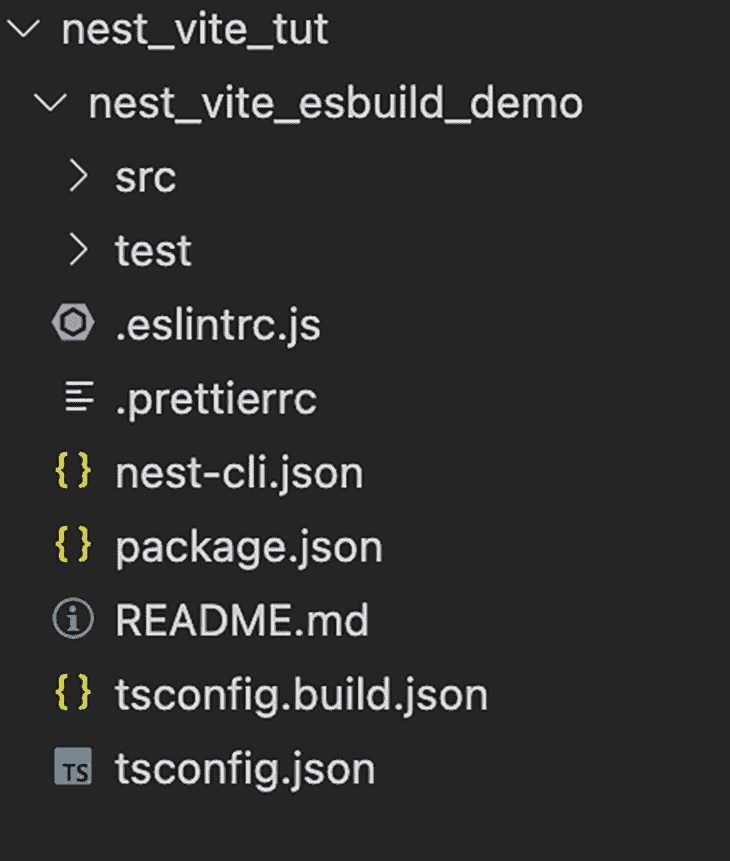
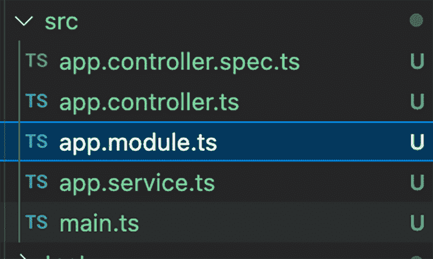
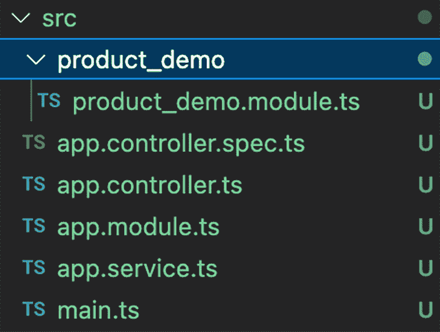
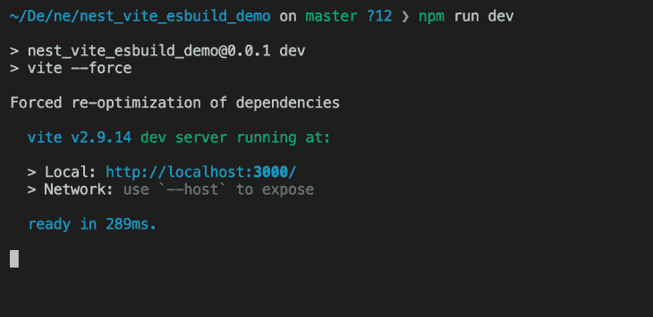
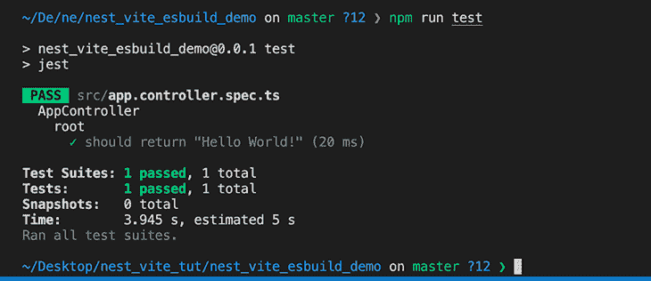
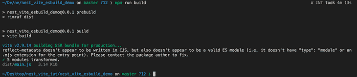

# NestJS、Vite 和 esbuild 入门

> 原文：<https://blog.logrocket.com/getting-started-with-nestjs-vite-esbuild/>

## 介绍

在本文中，我们将了解 NestJS、Vite 和 esbuild 他们如何一起工作；以及如何配置一个 NestJS 应用程序，以便将其他两个工具作为依赖项来使用。在这个过程中，我们将学习如何在现实生活场景中使用它们，它们的主要特性和用例。

*向前跳转:*

## 什么是 NestJS？

[NestJS](https://docs.nestjs.com/) 是一个 Node.js 框架，用于构建高效且可伸缩的企业服务器端/后端应用。根据文档，它支持 JavaScript 和 TypeScript 的所有最新 ECMAScript 版本。

NestJS 结合了众所周知的 OOP、函数式编程和函数式反应式编程的编程概念和哲学，以解决后端应用程序设计中的架构挑战，这些应用程序是可伸缩的、可维护的、易于测试的，并且不是紧密耦合在一起的。

尽管 NestJS 是[平台独立的](https://docs.nestjs.com/first-steps#platform)，并且如果为它编写了绑定，可以使用任何 Node.js 库，但 NestJS 默认使用 Express 作为依赖项，并且也可以配置为使用 Fastify。通过公开的 API 和其他第三方模块轻松配置框架，使得开发人员可以非常容易地根据具体情况定制框架。

## Vite 是什么？

Vite 是一个构建工具，具有 T2 的许多特性，主要是近乎即时的开发服务器启动时间。它利用浏览器中引入的本地 es 模块和用编译成本地代码的语言编写的工具，来解决使用[以前的构建工具](https://blog.logrocket.com/webpack-or-esbuild-why-not-both/) (webpack、Parcel 等)的问题。)与性能有关。

Vite 首先将应用程序中的模块分为两类，依赖关系和源代码，因为依赖关系在开发过程中很少改变。Vite 使用 [esbuild](https://esbuild.github.io/) 预先捆绑了这些依赖项。对于可能需要转换的源代码(CSS、JSX 等)。)，Vite 通过本地 ESM 将它们提供给浏览器。

当浏览器请求源代码时，Vite 根据需要转换并加载它们，浏览器可以使用基于路由的[代码分割和条件动态导入](https://blog.logrocket.com/dynamic-imports-code-splitting-next-js/)来捆绑所需的代码，这使得这个过程非常快。

## 什么是 esbuild？

esbuild 是一个用 Go 编写的速度极快的 JavaScript bundler，它利用 Go 的并行性和将源代码转换成机器码的能力。除其他外，其特点包括:

*   巨大的插件支持
*   迷你机
*   类型脚本和 JSX 支持
*   ES2015 和 CommonJS 模块都支持
*   摇树能力

## 安装和配置 NestJS 应用程序

既然我们已经在较高的层次上了解了 NestJS、Vite 和 esbuild，那么让我们继续通过配置 NestJS 应用程序来了解它们是如何协同工作的，以便将 Vite 和 esbuild 用作依赖项。在这个过程中，我们将学习如何在现实生活场景中使用它们，它们的主要特性和主要用例。

要开始使用 NestJS，请先安装 CLI，它会引导启动代码。对于那些不熟悉 NestJS 的人来说，这是一个特别好的选择。

另一个选择是[从 GitHub 克隆启动器 repo](https://github.com/nestjs/typescript-starter) 。注意，要安装 starter 项目的 JavaScript 风格，我们可以[克隆这个 repo](https://github.com/nestjs/javascript-starter) ，但是您需要 Babel 来编译普通的 JavaScript。

出于我们的目的，我们将继续安装 CLI。运行以下命令:

```
npm i -g @nestjs/cli

```

安装完 CLI 后，我们可以继续创建一个新的 Nest 项目:

```
nest new nest_vite_esbuild_demo

```

运行该命令的输出如下所示:

```
nest new nest_vite_esbuild_demo                                                                                 took 24s
⚡  We will scaffold your app in a few seconds..

CREATE nest_vite_esbuild_demo/.eslintrc.js (665 bytes)
CREATE nest_vite_esbuild_demo/.prettierrc (51 bytes)
CREATE nest_vite_esbuild_demo/README.md (3340 bytes)
CREATE nest_vite_esbuild_demo/nest-cli.json (118 bytes)
CREATE nest_vite_esbuild_demo/package.json (2007 bytes)
CREATE nest_vite_esbuild_demo/tsconfig.build.json (97 bytes)
CREATE nest_vite_esbuild_demo/tsconfig.json (546 bytes)
CREATE nest_vite_esbuild_demo/src/app.controller.spec.ts (617 bytes)
CREATE nest_vite_esbuild_demo/src/app.controller.ts (274 bytes)
CREATE nest_vite_esbuild_demo/src/app.module.ts (249 bytes)
CREATE nest_vite_esbuild_demo/src/app.service.ts (142 bytes)
CREATE nest_vite_esbuild_demo/src/main.ts (208 bytes)
CREATE nest_vite_esbuild_demo/test/app.e2e-spec.ts (630 bytes)
CREATE nest_vite_esbuild_demo/test/jest-e2e.json (183 bytes)

? Which package manager would you ❤️  to use? (Use arrow keys)
❯ npm 
  yarn 
  pnpm 

```

确保你的机器上安装了最新的 Node.js 版本(除了 v13，它[不支持](https://github.com/nestjs/nest/issues/4870))。

从上面我们可以看到，项目目录中已经填充了 Nest 的核心文件、依赖项和基本模块。遵循这些步骤并选择您所选择的包管理器。在这篇文章中，我们使用了 npm。安装结束时的文件夹结构如下所示。



The folder structure for scaffolding our NestJS app

接下来，我们可以通过运行以下命令导航到该文件夹。

```
cd nest_vite_esbuild_demo

```

然后，继续开始这个项目:

```
npm run start

```

运行该命令的输出如下所示。

```
npm run start                  

> [email protected] start
> nest start

[Nest] 33031  - 08/08/2022, 3:22:16 AM     LOG [NestFactory] Starting Nest application...
[Nest] 33031  - 08/08/2022, 3:22:16 AM     LOG [InstanceLoader] AppModule dependencies initialized +48ms
[Nest] 33031  - 08/08/2022, 3:22:16 AM     LOG [RoutesResolver] AppController {/}: +8ms
[Nest] 33031  - 08/08/2022, 3:22:16 AM     LOG [RouterExplorer] Mapped {/, GET} route +3ms
[Nest] 33031  - 08/08/2022, 3:22:16 AM     LOG [NestApplication] Nest application successfully started +8ms

```

作为上述方法的替代方法，我们也可以在开发模式下启动我们的应用程序，通过运行下面的命令来观察文件更改、重新编译构建，并重新加载 dev 服务器:

```
npm run start:dev

```

然后，在浏览器中导航至 [`http://localhost:3000/`](http://localhost:3000/) 。此外，我们还可以手动安装 NestJS 的核心依赖项。在这个设置中，我们可以按照自己的意愿设置项目结构，只需运行下面的命令。

```
npm i --save @nestjs/core @nestjs/common reflect-metadata

```

## 探索 NestJS 样板文件

当我们导航到项目文件夹中的`src`目录时，我们可以看到为我们创建的默认文件。我们有:

1.  `app.controller.ts`文件，它用一条路径表示我们的处理程序
2.  `app.service.ts`文件，它处理与方法或实用函数相关的任何事情，以保持控制器的苗条
3.  `app.module`文件，它处理应用程序的基本模块(一种构造应用程序组件的方式)
4.  `app.controller.spec.ts`文件，处理测试我们的控制器逻辑
5.  `main.ts`文件，它是我们应用程序的入口点，使用核心`NestFactory`函数创建一个嵌套应用程序实例



The default files in our `src` directory

NestJS 鼓励开发人员尽可能保持他们的应用程序架构模块化，源目录中的每个目录代表一个模块。每个嵌套应用程序必须至少有一个模块，一个根模块，这是构建应用程序图的起点。

例如，我们可以运行以下命令来创建一个新模块:

```
nest g module product_demo

```



Our new product demo module in the `src` directory

从上面可以看出，我们已经创建了一个`product_demo`模块。然后，我们可以继续创建其他需要的文件——`controller`和`services`——并将`product_demo`模块导入到应用基础模块中。

关于 NestJS 基础和特性的更多信息，我们可以参考文档，包括[测试](https://docs.nestjs.com/fundamentals/testing)、[提供者](https://docs.nestjs.com/providers)、[生命周期事件](https://docs.nestjs.com/fundamentals/lifecycle-events)、[装饰者](https://docs.nestjs.com/custom-decorators)、[中间件](https://docs.nestjs.com/middleware)、[模块](https://docs.nestjs.com/modules)等。，以掌握框架。接下来，让我们继续在我们的 NestJS 应用程序上设置 Vite 和 esbuild。

## 用 NestJS 安装 Vite 和 esbuild

Vite 是基于插件的，还带有一个优化良好的快速构建过程，这可以极大地提高您的整体开发效率和体验。它还支持现成的 TypeScript。

现在，让我们将 Vite 集成到我们的 NestJS 后端应用程序中。我们将通过插件安装 Vite，它运行一个带有热模块替换的节点开发服务器。

作为开发依赖项运行下面的命令。

```
npm install vite vite-plugin-node -D

```

接下来，在我们的项目目录的根目录中，我们可以创建`vite.config.ts`文件，它配置我们的项目来使用插件。让我们看看下面这个文件的内容。

```
import { defineConfig } from 'vite';
import { VitePluginNode } from 'vite-plugin-node';
export default defineConfig({
  // ...vite configures
  server: {
    // vite server configs, for details see \[vite doc\](https://vitejs.dev/config/#server-host)
    port: 3000
  },
  plugins: [
    ...VitePluginNode({
      // Nodejs native Request adapter
      // currently this plugin support 'express', 'nest', 'koa' and 'fastify' out of box,
      // you can also pass a function if you are using other frameworks, see Custom Adapter section
      adapter: 'nest',
      // tell the plugin where is your project entry
      appPath: './src/main.ts',
      // Optional, default: 'viteNodeApp'
      // the name of named export of you app from the appPath file
      exportName: 'viteNodeApp',
      // Optional, default: 'esbuild'
      // The TypeScript compiler you want to use
      // by default this plugin is using vite default ts compiler which is esbuild
      // 'swc' compiler is supported to use as well for frameworks
      // like Nestjs (esbuild dont support 'emitDecoratorMetadata' yet)
      // you need to INSTALL `@swc/core` as dev dependency if you want to use swc
      tsCompiler: 'esbuild',
    })
  ],
  optimizeDeps: {
    // Vite does not work well with optionnal dependencies,
    // mark them as ignored for now
    exclude: [
        '@nestjs/microservices',
        '@nestjs/websockets',
        'cache-manager',
        'class-transformer',
        'class-validator',
        'fastify-swagger',
      ],
  },
});

```

接下来，我们需要更新我们的应用服务器文件(`main.ts`)的入口点，以导出名为`viteNodeApp`(在上面的 Vite config `exportName`字段中)或我们在上面的 Vite config 文件中配置的任何其他名称的应用。见下文。

```
import { NestFactory } from '@nestjs/core';
import { AppModule } from './app.module';
if (import.meta.env.PROD) {
  async function bootstrap() {
    const app = await NestFactory.create(AppModule);
    await app.listen(3000);
  }
  bootstrap();
}

export const viteNodeApp = NestFactory.create(AppModule);

```

接下来，在我们的`package.json`文件中，我们可以继续添加一个 npm 脚本，用常规的`npm run dev`命令运行开发服务器:

```
"scripts": {
  "dev": "vite"
}

```

正如我们前面提到的，Vite 附带了一个开发服务器，它通过本地 ESM 提供我们的源文件。当我们在整个设置完成后使用`npm run dev`命令在 Vite dev 服务器上运行我们的应用程序时，我们会看到下面的输出。



The output after running the `npm run dev` command

为了确保一切仍按预期运行，用`npm run test`命令运行测试套件，我们可以看到下面的输出。



The output after running the `npm run test` command

该插件还使用 Vite 的服务器端渲染模式来构建我们的应用程序。为了利用这个特性，我们可以继续向我们的`package.json`文件添加一个构建脚本(使用 Vite 而不是 Nest 来构建我们的应用程序):

```
"scripts": {
  "build": "vite build"
},

```

`vite build`命令将我们的代码与 [Rollup](https://rollupjs.org/) 捆绑在一起，并为我们的生产环境提供高度优化的资产。当我们在整个设置完成后通过运行`npm run build`命令用 Vite 构建我们的应用程序时，我们可以看到下面的输出。



The output after running the `npm run build` command

如前所述，Vite 利用 esbuild 将 TypeScript 转换成 JavaScript。这是一个非常快速的编译过程——它甚至可以比常规的 TypeScript 编译器快 20 倍，HMR 更新可以在 50 毫秒内反映在浏览器中。

使用 Vite 插件( [vite-plugin-node](https://github.com/axe-me/vite-plugin-node) )的一个好处是，我们可以选择使用 esbuild 或 swc 来编译我们的类型脚本文件，尽管在本文中我们只使用了 esbuild。

## 结论

在这篇文章中，我们学习了如何使用 NestJS、Vite 和 esbuild。正如我们所看到的，NestJS 有一种有趣的、相当新的方法来构建 Node.js 应用程序，其哲学围绕着 OOP、FP 和 FRP。从长远来看，这些改进极大地提高了开发人员的时间和生产力，因为我们不必担心如何设计我们的模块和组件。NestJS 为我们解决了这个问题，并提出了每个文件夹一个模块的模式。我们还可以使用 TypeScript 的强大功能来编写我们的后端代码。

另一方面，Vite 在构建工具领域处于一个全新的水平。它出现在 NodeJS 生态系统中流行的基于 JS 的捆绑器和构建工具需要在性能方面得到提升的时候。Vite 使用与 webpack 和 package 完全不同的方法将我们的代码编译成本机代码。据我们所知，它使用浏览器和本机 ESM 进行捆绑。

总之，我们将这些令人敬畏的技术结合起来，构建了一个简单的样板后端，可以作为下一个 NestJS 项目的起点。

## 使用 [LogRocket](https://lp.logrocket.com/blg/signup) 消除传统错误报告的干扰

[](https://lp.logrocket.com/blg/signup)

[LogRocket](https://lp.logrocket.com/blg/signup) 是一个数字体验分析解决方案，它可以保护您免受数百个假阳性错误警报的影响，只针对几个真正重要的项目。LogRocket 会告诉您应用程序中实际影响用户的最具影响力的 bug 和 UX 问题。

然后，使用具有深层技术遥测的会话重放来确切地查看用户看到了什么以及是什么导致了问题，就像你在他们身后看一样。

LogRocket 自动聚合客户端错误、JS 异常、前端性能指标和用户交互。然后 LogRocket 使用机器学习来告诉你哪些问题正在影响大多数用户，并提供你需要修复它的上下文。

关注重要的 bug—[今天就试试 LogRocket】。](https://lp.logrocket.com/blg/signup-issue-free)