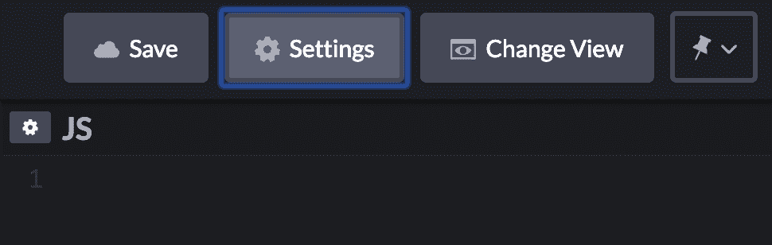
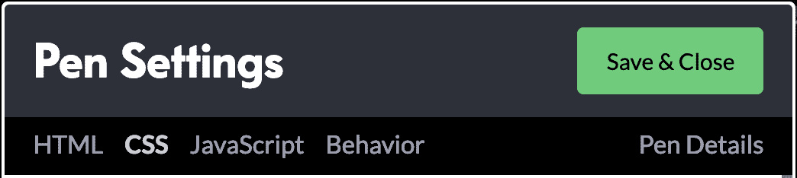
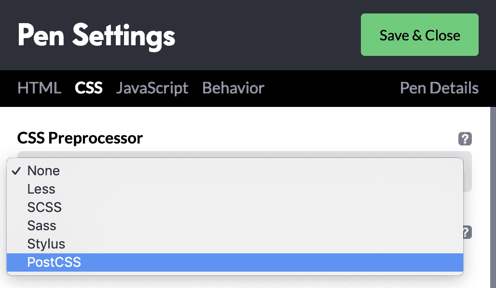
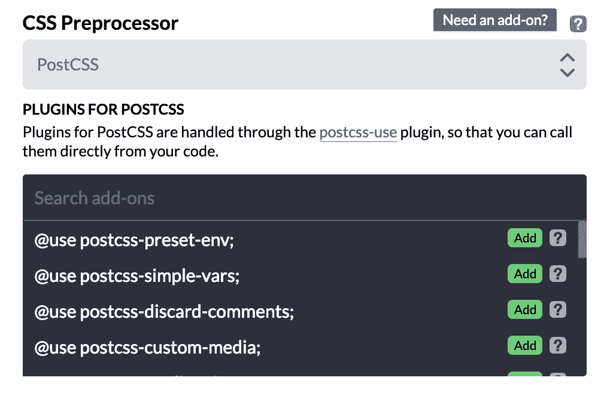
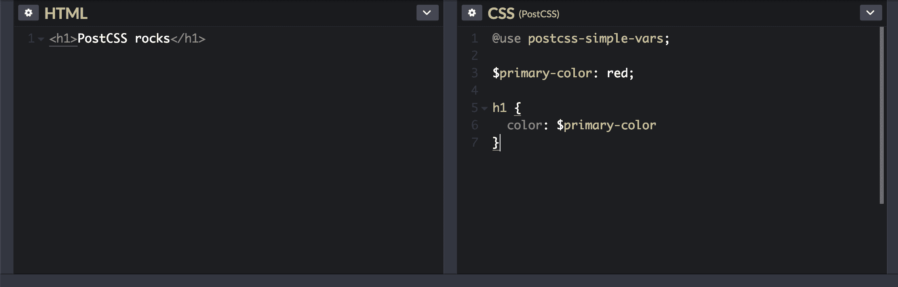

# PostCSS 入门

> 原文：<https://blog.logrocket.com/getting-started-with-postcss-in-2019-484262a4d725/>


如果您曾经想在代码中尝试新的、实验性的或非标准的 CSS 属性，那么您知道浏览器供应商要求您添加前缀以使它们工作，直到它们完全标准化。

```
.some-element {
 box-sizing: border-box;
 -webkit-box-sizing: border-box;  // chrome, safari prefix
 -moz-box-sizing: border-box;     // firefox
 -o-box-sizing: border-box;       // old opera versions
 -ms-box-sizing: border-box;      // IE, Microsoft Edge
}
```

您必须监视不同的 CSS 属性，以了解浏览器供应商何时开始支持它们，此时您可以删除相应的前缀。

谢天谢地，现在我们有了[自动修复程序](https://github.com/postcss/autoprefixer)。这是一个来自 [npm](https://www.npmjs.com/) 的 CLI 工具，它扫描你的代码，并使用来自[我可以使用吗](https://caniuse.com)的值将供应商前缀添加到 CSS 规则中。Autoprefixer 是众多 PostCSS 插件中的一个，它抓住了 PostCSS 的精髓。

### 到底什么是 PostCSS？

PostCSS 是一个用 JavaScript 插件转换 CSS 的工具。它通过其广泛的[插件生态系统](https://www.postcss.parts/)提供功能来帮助改善你的 CSS 编写体验。你可以选择你需要的插件，甚至为自己写一个定制的。

一般来说，PostCSS 插件允许你像平常一样编写普通的 CSS，一旦被调用，它们会扫描代码来执行所需的转换。

但是，请注意，有些 PostCSS 插件并不转换普通的 CSS，而是基于类似 Sass 的语法进行操作。一个例子是 [PostCSS 简单变量](https://github.com/postcss/postcss-simple-vars)插件，它允许您实现可以在整个代码中重用的变量(就像在 Sass 中一样),如下所示。

```
$color-brand: darkgrey;
$font-size: 1em;
body {
 color: $color-brand;
 font-size: $font-size;
}
```

这个特性在这个时候不是特别相关，因为 */CSS variables/* 已经作为 CSS 中的一个固有特性发布了，PostCSS 可以将最新的 CSSNext 语法转换成旧浏览器可以理解的友好 CSS。

[](https://logrocket.com/signup/)

### 为什么使用 PostCSS？

让我们通过 PostCSS 插件的强大功能来看看它的一些用例。

#### 自动修复

如前所述，Autoprefixer 插件将使用 Can I Use 中的值向 CSS 属性添加供应商前缀。这减少了代码中的混乱，提高了可读性。例如，此输入:

```
:fullscreen {
}
```

给出以下输出:

```
:-webkit-:full-screen {}
:-moz-:full-screen {}
:full-screen {}
```

#### 使用浏览器理解的 CSSNext 特性

使用 [PostCSS Preset Env](https://github.com/csstools/postcss-preset-env) 插件，您可以编写未来的 CSS 语法，插件将通过制定必要的 polyfill 将其转换为浏览器可以理解的 CSS。例如，此输入:

```
@custom-media --med (width <= 50rem);
```

```
@media (--med) {
  a { 
    &:hover {
      color: color-mod(black alpha(54%));
    }
  }
}
```

给出以下输出:

```
@media (max-width: 50rem) {
  a:hover  { 
    color: rgba(0, 0, 0, 0.54);
  }
}
```

#### 避免 CSS 中的错误

stylelint 插件指出你的 CSS 代码中的错误。它支持最新的 CSS 语法。例如，此输入:

```
a { 
  color: #d3;
}
```

给出以下输出:

```
app.css
2:10 Invalid hex color
```

#### 使用本地范围的 CSS 类名

使用 [CSS 模块](https://github.com/css-modules/css-modules)插件，你可以编写局部作用于组件的 CSS，这意味着无论你的 CSS 类名有多普通，它们之间都不会有任何冲突。例如，此输入:

```
.name {
  color: grey;
}
```

给出以下输出:

```
.Logo__name__SVK0g {
  color: gray;
}
```

#### 创建令人惊叹的网格

[LostGrid](https://github.com/peterramsing/lost) 插件使用 *calc()* 根据你定义的分数创建网格，而不需要传递很多选项。例如，此输入:

```
div {
  lost-column: 1/3 
}
```

给出以下输出:

```
div {
  width: calc(99.9% * 1/3 -  
  (30px - 30px * 1/3)); 
}
div:nth-child(1n) {
  float: left; 
  margin-right: 30px; 
  clear: none; 
}
div:last-child {
  margin-right: 0; 
}
div:nth-child(3n) {
  margin-right: 0; 
  float: right; 
}
div:nth-child(3n + 1) {
  clear: both; 
}
```

### PostCSS、Sass 和 Less 之间的区别

postscs 可以做和 Sass、Less、Stylus 等预处理程序一样的工作，但是 postscs 是模块化的，而且以我的经验来看，速度更快。

PostCSS 和 CSS 预处理程序的主要区别在于你可以选择你需要的特性。Sass 和 Less 为您提供了许多您可能使用也可能不使用的特性，并且您无法扩展这些特性。

如果你想在当前堆栈中保留 Sass、Less 或 Stylus，但仍想让 PostCSS 执行 Sass 不能执行的其他功能(例如，自动修复或林挺)，[本文](https://webdesign.tutsplus.com/tutorials/using-postcss-together-with-sass-stylus-or-less--cms-24591)详细介绍了如何做。

还有像 [PostCSS Sass](https://www.npmjs.com/package/postcss-sass) 和 [PreCSS](https://github.com/jonathantneal/precss) 这样的 PostCSS 插件，本质上是 Sass 的完全替代。这意味着你可以用 PostCSS 编写你自己的预处理器。

### 使用 Codepen 快速 PostCSS 设置

首先登录 Codepen.io，并执行以下步骤:

1.  创建新钢笔。
2.  点击窗口顶部的**设置**，显示设置面板。



3.从顶部选项卡中选择 **CSS** 以显示 CSS 设置。



4.选择 **CSS 处理器**下拉菜单，然后从下拉菜单中选择**邮政 CSS** 。



5.点击**需要一个附加组件吗？**显示出来的徽章。将显示一个插件列表，您可以从中搜索并选择所需的插件。让我们**添加**这个 **postcss-simple-vars** 插件来试验变量。选择**保存&关闭**。



回到 CSS 窗口，你会注意到插件已经被引用使用。我们现在可以自由访问它的所有功能。

```
@use postcss-simple-vars;
```

在 CSS 窗口中使用变量插入 HTML 和 CSS 示例:



#### 演示

见 [笔真简单 PostCSS 例](https://codepen.io/emmyyusufu/pen/ywLLeK/)由伊曼纽尔·优素福( [@emmyyusufu](https://codepen.io/emmyyusufu) )
上[笔码](https://codepen.io)。

其他设置方法

### 使用 [Gulp](https://github.com/postcss/postcss#gulp) 、 [Webpack](https://github.com/postcss/postcss#webpack) 或[package](https://github.com/postcss/postcss#parcel)等构建工具有[几种方式](https://github.com/postcss/postcss#usage)来设置 PostCSS。在这篇文章中，我将重点介绍如何使用 [PostCSS CLI](https://github.com/postcss/postcss-cli) 。

### PostCSS CLI

安装了 **npm** 后，在命令行上运行以下命令:

#### 或者用**纱**:

您还可以使用 npm 向项目添加插件。例如:

```
npm install -g postcss-cli
```

在我们的项目中，我们通常可以这样用 PostCSS 插件来转换 CSS:

```
yarn global add postcss-cli
```

上面的命令将运行 Autoprefixer 遍历包含在 */css/* 文件夹中的所有文件，并将转换后的 css 输出到 *main.css* 中。您还可以通过将别名添加到您的 *package.json* 文件中的**脚本**来使用别名运行命令:

```
yarn add --dev autoprefixer postcss-nested postcss-cli
```

创建 React 应用程序和 Vue

```
postcss --use autoprefixer -o main.css css/*.css
```

值得一提的是，搭建的 React 和 Vue 项目如 [Create React App](https://reactjs.org/blog/2018/10/01/create-react-app-v2.html) 和 [VueCLI](https://cli.vuejs.org/guide/css.html#postcss) 在内部使用 PostCSS。还要注意，内部 PostCSS 是用几个精选插件设置的；你可以用[更多配置](https://github.com/facebook/create-react-app/issues/5843#issuecomment-439662008)添加更多插件。

```
{
...
"scripts": {
 "start": "node index.js",
 "postcss": "postcss --use autoprefixer -o main.css css/*.css"
  }
...
}
```

#### 结论

PostCSS 是一个非常有用的工具，已经存在一段时间了。它鼓励你编写更多的普通 CSS，并允许你使用或编写自己的强大插件来转换它。学习这个工具，或者至少更加了解它的用途，会在 2019 年改善你的前端工作流程。

### 如果你想更深入地研究 PostCSS，我强烈推荐这个[教程系列](https://webdesign.tutsplus.com/series/postcss-deep-dive--cms-889)。感谢阅读🙏。

你的前端是否占用了用户的 CPU？

随着 web 前端变得越来越复杂，资源贪婪的特性对浏览器的要求越来越高。如果您对监控和跟踪生产环境中所有用户的客户端 CPU 使用、内存使用等感兴趣，

## .

LogRocket 就像是网络和移动应用的 DVR，记录你的网络应用或网站上发生的一切。您可以汇总和报告关键的前端性能指标，重放用户会话和应用程序状态，记录网络请求，并自动显示所有错误，而不是猜测问题发生的原因。

[try LogRocket](https://lp.logrocket.com/blg/css-signup)

现代化您调试 web 和移动应用的方式— [开始免费监控](https://lp.logrocket.com/blg/css-signup)。

[](https://lp.logrocket.com/blg/css-signup)[https://logrocket.com/signup/](https://lp.logrocket.com/blg/css-signup)

[LogRocket](https://lp.logrocket.com/blg/css-signup) is like a DVR for web and mobile apps, recording everything that happens in your web app or site. Instead of guessing why problems happen, you can aggregate and report on key frontend performance metrics, replay user sessions along with application state, log network requests, and automatically surface all errors.

Modernize how you debug web and mobile apps — [Start monitoring for free](https://lp.logrocket.com/blg/css-signup).