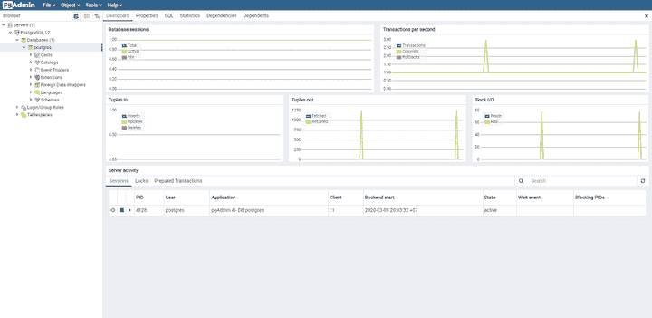

# 在 React app - LogRocket 博客中开始使用 Postgres

> 原文：<https://blog.logrocket.com/getting-started-with-postgres-in-your-react-app/>

前端开发人员通常不需要理解接收、记录和删除信息的过程。这是后端开发人员的工作。

也就是说，前端开发人员有足够的理由学习后端编程和数据库交互。例如:

*   您将从其他前端开发人员中脱颖而出，因为您将知道您的应用程序作为一个整体是如何工作的
*   您将能够在应用程序的正面和背面工作
*   你可以晋升为全栈开发者，承担更大的角色，拿更高的薪水
*   前端和后端编程知识——以及设计可扩展系统和构建可靠的应用程序架构——是成为技术领导者的必要条件

在本教程中，我们将演示如何使用 Express 和 Node.js 创建一个小应用程序，该应用程序可以根据收到的 HTTP 请求记录和删除 PostgreSQL 数据库中的信息。然后，我们将创建一个简单的 React 应用程序来测试和查看整个应用程序如何从前到后流动。

我假设您了解 React 应用程序的工作方式，并且熟悉前端 JavaScript HTTP 请求。我们不会讨论在与数据库交互之前如何验证数据。相反，我们将重点展示如何将来自接口的请求记录到数据库中。

我为这个教程发布了一个 [GitHub repo](https://github.com/nsebhastian/react-node-postgres) ，这样你就可以在遇到问题时比较你的代码。现在让我们运行数据库。

## 设置 PostgreSQL

[PostgreSQL](https://www.postgresql.org/) ，或 Postgres，是一个关系数据库管理系统，号称是世界上最先进的开源关系数据库。它自 1996 年以来一直得到维护，并以可靠和强大而闻名。

从[下载并安装 PosgreSQL](https://www.postgresql.org/download/) 开始。它支持所有主要的操作系统，因此请为您的计算机选择正确的操作系统，并按照说明设置数据库。安装向导将提示您输入超级用户密码。请确保您记住了该密码；稍后您将需要它来登录。

安装完成后，您可以通过使用 [pgAdmin](https://www.pgadmin.org/) 来访问您的数据库，这是一个与 PostgreSQL 一起自动安装的图形界面工具数据库管理。

打开后，pgAdmin 会要求您输入密码才能登录。下面是新安装的 PostgreSQL 数据库的概述。



## 创建 Postgres 数据库

为了更好地理解 SQL 语言，我们需要从终端创建一个数据库和表。

要从终端访问 PostgreSQL，使用带有选项`-d`的命令`psql`来选择想要访问的数据库，使用`-U`来选择用户。如果终端回复说没有找到`psql`命令，您很可能需要将 Postgres `bin/`和`lib/`目录添加到您的系统路径中。

```
psql -d postgres -U postgres

```

您将被要求输入密码。使用您之前创建的密码。登录后，通过添加密码为“root”的登录权限来创建一个新用户

```
CREATE ROLE my_user WITH LOGIN PASSWORD 'root';

```

用户只是一个拥有登录权限的角色。现在您已经有了一个，通过发出`ALTER ROLE [role name] CREATEDB`语法授予它创建数据库的权限。

```
ALTER ROLE my_user CREATEDB;

```

使用`\q`命令从超级用户`postgres`注销并以`my_user`的身份登录。

```
\q
psql -d postgres -U my_user 

```

现在您回到了里面，创建一个名为`my_database`的新数据库。

```
CREATE DATABASE my_database;

```

您可能想知道，为什么我们不能使用默认的`postgres`用户来创建数据库呢？这是因为默认用户是超级用户，这意味着它可以访问数据库中的所有内容。根据 Postgres [文档](https://www.postgresql.org/docs/12/sql-createrole.html)，“超级用户身份是危险的，应该只在真正需要的时候使用。”

基于 SQL 的数据库将数据存储在表中。现在您已经有了一个数据库，让我们创建一个简单的表来记录您的数据。

```
CREATE TABLE merchants( id SERIAL PRIMARY KEY, name VARCHAR(30), email VARCHAR(30) );

```

一个数据库可以有多个表，但是在本教程中我们使用一个表就可以了。如果您想检查创建的数据库和表，您可以分别使用命令`\list`和`\dt`。您可能会看到更多或更少的行，但是只要您有数据库和之前创建的表，您的表应该如下所示:

```
my_database=> \list
          List of databases
 Name        |  Owner   | Encoding
 my_database | my_user  | UTF8     
 postgres    | postgres | UTF8     
 template0   | postgres | UTF8     
 template1   | postgres | UTF8     

my_database=> \dt
          List of relations
 Schema |   Name    | Type  |  Owner
--------+-----------+-------+---------
 public | merchants | table | my_user

```

现在有了一个可以插入数据的表。让我们接下来做那件事。

## 基本 SQL 查询

Postgres 是一个基于 SQL 的系统，这意味着你需要使用 SQL 语言来存储和操作它的数据。让我们探索四个可以使用 SQL 查询的基本例子。

### 1.选择查询

要从一个表中检索数据，使用`SELECT`键，后跟要检索的列名和表名。

```
SELECT id, name, email from merchants;

```

要检索表中的所有列，只需使用`SELECT *`。

```
SELECT * from merchants;

```

### 2.插入查询

要向表中插入新数据，请使用关键字`INSERT`，后跟表名、列名和值。

```
INSERT INTO merchants (name, email) VALUES ('john', '[email protected]');

```

### 3.删除查询

您可以使用`DELETE`关键字从表格中删除一行。

* * *

### 更多来自 LogRocket 的精彩文章:

* * *

```
DELETE from merchants WHERE id = 1;

```

当使用删除查询时，不要忘记用`WHERE`关键字指定要删除的行。否则，您将删除该表中的所有行。

### 4.更新查询

要更新某一行，可以使用`UPDATE`关键字。

```
UPDATE merchants SET name = 'jake', email = '[email protected]' WHERE id = 1;

```

现在您已经知道了如何操作表中的数据，让我们来看看如何连接数据库以作出反应。

## 用 Node.js 和 Express 创建 API 服务器

要将 React 应用程序与 PostgreSQL 数据库连接起来，必须首先创建一个可以处理 HTTP 请求的 API 服务器。让我们用 NodeJS 和 Express 建立一个简单的。

使用以下命令从终端创建一个新目录并设置一个新的 npm 包。

```
mkdir node-postgres && cd node-postgres
npm init

```

你可以随意填写你的包裹信息，但这里有一个我的`package.json`的例子:

```
{
  "name": "node-postgres",
  "version": "1.0.0",
  "description": "Learn how NodeJS and Express can interact with PostgreSQL",
  "main": "index.js",
  "license": "ISC"
}

```

接下来，安装所需的软件包。

```
npm i express pg

```

Express 是一个极简的 web 框架，您可以使用它在 Node.js 技术的基础上编写 web 应用程序，而`node-postgres(pg)`是一个客户端库，它使 Node.js 应用程序能够与 PostgreSQL 进行通信。

一旦两者都安装完毕，创建一个包含以下内容的`index.js`文件。

```
const express = require('express')
const app = express()
const port = 3001

app.get('/', (req, res) => {
  res.status(200).send('Hello World!');
})

app.listen(port, () => {
  console.log(`App running on port ${port}.`)
})

```

在同一个目录中打开您的终端并运行`node index.js`。您的节点应用程序将在端口 3001 上运行，因此打开浏览器并导航到 [http://localhost:3001](http://localhost:3001) 。你会看到“你好，世界！”浏览器中显示的文本。

现在，您已经拥有了编写 API 所需的一切。

## 让 NodeJS 与 Postgres 交谈

`pg`库允许您的节点应用程序与 Postgres 对话，所以您需要首先导入它。创建一个名为`merchant_model.js`的新文件，并输入以下代码。

```
const Pool = require('pg').Pool
const pool = new Pool({
  user: 'my_user',
  host: 'localhost',
  database: 'my_database',
  password: 'root',
  port: 5432,
});

```

请注意，在生产环境中，不建议像上面示例中那样输入用户、主机、数据库、密码和端口等凭据。为了简化教程，我们将把它保存在这个文件中。

上面创建的池对象将允许您查询它所连接的数据库。让我们创建三个查询来利用这个池。这些查询将被放在一个函数中，您可以从您的`index.js`中调用这个函数。

```
const getMerchants = () => {
  return new Promise(function(resolve, reject) {
    pool.query('SELECT * FROM merchants ORDER BY id ASC', (error, results) => {
      if (error) {
        reject(error)
      }
      resolve(results.rows);
    })
  }) 
}
const createMerchant = (body) => {
  return new Promise(function(resolve, reject) {
    const { name, email } = body
    pool.query('INSERT INTO merchants (name, email) VALUES ($1, $2) RETURNING *', [name, email], (error, results) => {
      if (error) {
        reject(error)
      }
      resolve(`A new merchant has been added added: ${results.rows[0]}`)
    })
  })
}
const deleteMerchant = () => {
  return new Promise(function(resolve, reject) {
    const id = parseInt(request.params.id)
    pool.query('DELETE FROM merchants WHERE id = $1', [id], (error, results) => {
      if (error) {
        reject(error)
      }
      resolve(`Merchant deleted with ID: ${id}`)
    })
  })
}

module.exports = {
  getMerchants,
  createMerchant,
  deleteMerchant,
}

```

上面的代码将处理并导出`getMerchants`、`createMerchant`和`deleteMerchant`函数。现在是时候更新您的`index.js`文件并使用这些函数了。

```
const express = require('express')
const app = express()
const port = 3001

const merchant_model = require('./merchant_model')

app.use(express.json())
app.use(function (req, res, next) {
  res.setHeader('Access-Control-Allow-Origin', 'http://localhost:3000');
  res.setHeader('Access-Control-Allow-Methods', 'GET,POST,PUT,DELETE,OPTIONS');
  res.setHeader('Access-Control-Allow-Headers', 'Content-Type, Access-Control-Allow-Headers');
  next();
});

app.get('/', (req, res) => {
  merchant_model.getMerchants()
  .then(response => {
    res.status(200).send(response);
  })
  .catch(error => {
    res.status(500).send(error);
  })
})

app.post('/merchants', (req, res) => {
  merchant_model.createMerchant(req.body)
  .then(response => {
    res.status(200).send(response);
  })
  .catch(error => {
    res.status(500).send(error);
  })
})

app.delete('/merchants/:id', (req, res) => {
  merchant_model.deleteMerchant(req.params.id)
  .then(response => {
    res.status(200).send(response);
  })
  .catch(error => {
    res.status(500).send(error);
  })
})
app.listen(port, () => {
  console.log(`App running on port ${port}.`)
})

```

现在您的应用程序有三个可以接受请求的 HTTP 路由。编写第 7 行的代码是为了让 Express 可以接受带有 JSON 有效负载的传入请求。为了允许 React 对这个应用程序的请求，我还添加了`Access-Control-Allow-Origin`、`Access-Control-Allow-Methods`和`Access-Control-Allow-Headers`的标题。

## 创建您的 React 应用程序

您的 API 已经准备好服务和处理请求。现在是时候创建一个 React 应用程序来发送请求了。

让我们用`create-react-app`命令引导 React 应用程序。

```
npx create-react-app react-postgres

```

在你的 React app 目录中，你可以删除`src/`目录中的所有内容。

现在让我们从头开始编写一个简单的 React 应用程序。

首先，用以下内容创建一个`App.js`文件。

```
import React, {useState, useEffect} from 'react';
function App() {
  const [merchants, setMerchants] = useState(false);
  useEffect(() => {
    getMerchant();
  }, []);
  function getMerchant() {
    fetch('http://localhost:3001')
      .then(response => {
        return response.text();
      })
      .then(data => {
        setMerchants(data);
      });
  }
  function createMerchant() {
    let name = prompt('Enter merchant name');
    let email = prompt('Enter merchant email');
    fetch('http://localhost:3001/merchants', {
      method: 'POST',
      headers: {
        'Content-Type': 'application/json',
      },
      body: JSON.stringify({name, email}),
    })
      .then(response => {
        return response.text();
      })
      .then(data => {
        alert(data);
        getMerchant();
      });
  }
  function deleteMerchant() {
    let id = prompt('Enter merchant id');
    fetch(`http://localhost:3001/merchants/${id}`, {
      method: 'DELETE',
    })
      .then(response => {
        return response.text();
      })
      .then(data => {
        alert(data);
        getMerchant();
      });
  }
  return (
    <div>
      {merchants ? merchants : 'There is no merchant data available'}
      <br />
      <button onClick={createMerchant}>Add merchant</button>
      <br />
      <button onClick={deleteMerchant}>Delete merchant</button>
    </div>
  );
}
export default App;

```

这个 React 应用程序将向您创建的 Express 服务器发送请求。它有两个按钮来添加和删除商家。函数`getMerchant`将从服务器获取商户数据，并将结果设置为`merchant`状态。

当您点击按钮时，`createMerchant`和`deleteMerchant`将分别启动添加和删除商户的流程。

最后，创建一个`index.js`文件并呈现`App`组件。

```
import React from 'react';
import ReactDOM from 'react-dom';
import App from './App';

ReactDOM.render(<App />, document.getElementById('root'));

```

现在用`npm start`运行你的 React 应用。您可以测试并查看从 React 应用程序收集的数据是如何记录到 PostgreSQL 中的。我将把`UPDATE`查询的实现留给您作为练习。

## 结论

现在，您已经知道如何安装 PostgreSQL 数据库，创建数据库和表，并构建一个最小的 API 作为 React 应用程序和数据库之间的桥梁。我们创建了一个如何将 Postgres 与 React 一起使用的端到端示例，并演示了当您从 React 应用程序发送这些 HTTP 请求时会发生什么。

本教程远非后端编程的完整指南，但它足以帮助您开始理解后端是如何工作的。

如果您发现任何错误或无法从应用程序中插入数据，您可以从[这个 repo](https://github.com/nsebhastian/react-node-postgres) 中克隆完整的源代码，并将 repo 中的代码与您的示例进行比较。

## 使用 LogRocket 消除传统反应错误报告的噪音

[LogRocket](https://lp.logrocket.com/blg/react-signup-issue-free)

是一款 React analytics 解决方案，可保护您免受数百个误报错误警报的影响，只针对少数真正重要的项目。LogRocket 告诉您 React 应用程序中实际影响用户的最具影响力的 bug 和 UX 问题。

[ ](https://lp.logrocket.com/blg/react-signup-general) [  ](https://lp.logrocket.com/blg/react-signup-general) [LogRocket](https://lp.logrocket.com/blg/react-signup-issue-free)

自动聚合客户端错误、反应错误边界、还原状态、缓慢的组件加载时间、JS 异常、前端性能指标和用户交互。然后，LogRocket 使用机器学习来通知您影响大多数用户的最具影响力的问题，并提供您修复它所需的上下文。

关注重要的 React bug—[今天就试试 LogRocket】。](https://lp.logrocket.com/blg/react-signup-issue-free)