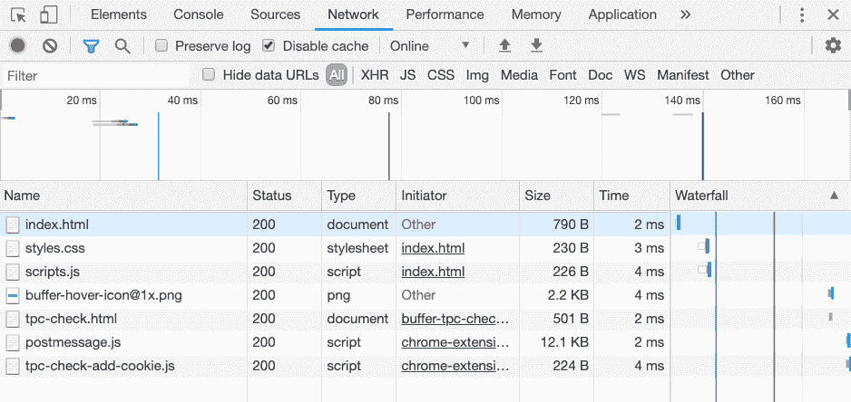
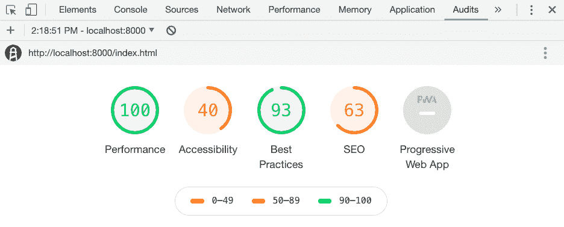
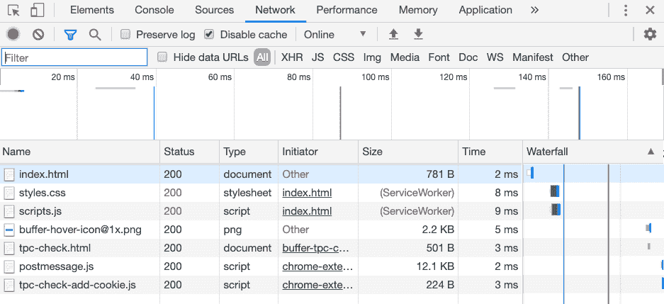

# 通过 Workbox 和服务工作者开始使用渐进式 web 应用程序

> 原文：<https://blog.logrocket.com/getting-started-with-progressive-web-applications-through-workbox-and-service-workers/>

渐进式 web 应用程序由许多因素组成，无论是具有移动友好的用户体验(UX)，具有本机桌面和移动 API 集成，还是能够在没有互联网连接的情况下使用应用程序。

在本教程中，我们将探索如何通过使用从 [Workbox](https://developers.google.com/web/tools/workbox) 生成的服务工人来使 web 应用程序离线工作，该工具旨在使缓存变得非常容易。

如果你以前从未接触过服务人员，它是浏览器在后台运行的脚本，可以实现不需要网页或任何用户交互的功能。问题是服务工作者可能很难设计，即使他们的 API 并不难使用。这是因为您必须考虑许多场景，例如缓存过期、更新等等。这就是为什么像 [Workbox](https://developers.google.com/web/tools/workbox) 这样的框架对开发有如此大的好处。

如果你是一个 Hugo 开发者，像我一样，你可能记得我写了一篇教程，演示了如何让一个静态生成的网站 PWA 友好。这很好，但是这一次我们想让这个过程更通用一些，这样它就可以在 Hugo 场景之外使用。

 [https://www.youtube.com/embed/dGWoffJcFhg?version=3&rel=1&showsearch=0&showinfo=1&iv_load_policy=1&fs=1&hl=en-US&autohide=2&wmode=transparent](https://www.youtube.com/embed/dGWoffJcFhg?version=3&rel=1&showsearch=0&showinfo=1&iv_load_policy=1&fs=1&hl=en-US&autohide=2&wmode=transparent)

视频

## 用 HTML、CSS 和 JavaScript 构建网站

让我们创建一个简单的网站，了解正在发生的事情以及为什么服务人员帮助我们，而不仅仅是为了能够将我们的应用程序称为 PWA。

几乎每个网站都会有 HTML、CSS 和 JavaScript 文件，所以让我们从这些开始着手吧。在你电脑的某个地方，用 index.html 文件、styles.css 文件和 scripts.js 文件创建一个新文件夹。

在 scripts.js 文件中，添加以下代码:

```
console.log("HELLO WORLD!");
```

这肯定不是你见过的最复杂的脚本，但是到时候它会证明我们的观点。我们只想说我们的应用程序中有一个单独的 JavaScript 文件。同样，将以下内容添加到项目的 styles.css 文件中:

```
body { margin: 0; }
h1 { margin: 0; }
```

同样，复杂性不是本教程的目标。目标是展示服务人员如何为我们的项目增加价值，以及您应该如何让他们参与进来。让我们通过创建一个包含脚本和样式的 HTML 文件来完成这个非常基础的项目。打开项目的 index.html 文件，包括以下内容:

```
<!DOCTYPE html>
<html>
    <head>
        <link rel="stylesheet" href="styles.css" />
    </head>
    <body>
        <div>
            <h1>Hello World!</h1>
        </div>
        <script src="scripts.js"></script>
    </body>
</html>
```

如果我们愿意，我们可以打开我们的 HTML 文件，看到一个完全可以接受的网站。为了尽早设置好，我们不能仅仅从文件系统中打开我们的文件来查看运行中的东西。我们将需要为我们的项目提供服务，要么使用 Python 或 Caddy 之类的工具，要么将我们的应用程序发布到托管提供商。

如果您使用的是 macOS 或 Linux，或者在 Windows 电脑上安装了 Python，您可以执行以下操作:

```
python -m SimpleHTTPServer
```

上面的命令将在[http://localhost:8000/index . html](http://localhost:8000/index.html)为我们的应用程序提供服务，这对于本例来说是完美的。

现在我们有了一个简单的 web 应用程序，让我们打开 Chrome Inspector，假设您使用的是 Google Chrome。如果您浏览到“网络”选项卡，您会看到类似下图的内容:



Chrome Inspector network info

虽然不是特别大，也不是特别慢，但是必须获取 HTML、CSS 和 JavaScript 资源。每个用户的每个请求都会获取这些资源。如果你在看一个真实的生产 web 应用程序，这可能会增加高达 MB 的下载量和几秒钟的时间，这在 web 世界中是不好的，尤其是在通过蜂窝信号的移动设备上。

你可以通过进入 Chrome 浏览器的“审计”标签来进一步评估。



Chrome Inspector audit info

你会发现这个应用程序没有被评为一个进步的网络应用程序，当你检查原因时，它缺少了一些东西，离线功能就是其中之一。虽然我们对构建 100% PWA 等级的应用程序不太感兴趣，但我们确实关心服务人员和离线方面。这比告诉人们我们的网站是 PWA 更有帮助。

因此，让我们从使用 Workbox 格式的服务工作者添加缓存策略开始。

## 使用 Workbox 定义缓存策略

Workbox 可以有多种用途，但首先是作为服务人员的运行时替代品。为了了解它是如何工作的，让我们创建一个 sw.js 文件来表示我们的服务人员。

```
importScripts("https://storage.googleapis.com/workbox-cdn/releases/4.3.1/workbox-sw.js");

workbox.routing.registerRoute(
    /\.(?:css|js)$/,
    new workbox.strategies.StaleWhileRevalidate({
        "cacheName": "assets",
        plugins: [
            new workbox.expiration.Plugin({
                maxEntries: 1000,
                maxAgeSeconds: 31536000
            })
        ]
    })
);

workbox.routing.registerRoute(
    /\.(?:png|jpg|jpeg|gif|bmp|webp|svg|ico)$/,
    new workbox.strategies.CacheFirst({
        "cacheName": "images",
        plugins: [
            new workbox.expiration.Plugin({
                maxEntries: 1000,
                maxAgeSeconds: 31536000
            })
        ]
    })
);
```

上面的 JavaScript 代表了一个用 Workbox 创建的服务工作者。上面的代码中主要发生了两件事，它可能会根据您的业务需求而改变。发生的两件事是取决于文件的两种不同的缓存策略。

对于 JavaScript 和 CSS 文件，使用`StaleWhileRevalidate`策略。这意味着资产将总是被获取，然后被缓存，除非互联网不可用，此时使用缓存的版本。对于映像正在使用的`CacheFirst`策略，将一直使用缓存版本，直到该缓存版本过期或被手动从缓存中清除。

同样，你需要为你的业务需求选择策略。不止存在`StaleWhileRevalidate`和`CacheFirst`策略。

要激活这个服务人员，我们可以编辑我们的**index.html**文件，如下所示:

```
<!DOCTYPE html>
<html>
    <head>
        <link rel="stylesheet" href="styles.css" />
    </head>
    <body>
        <div>
            <h1>Hello World!</h1>
        </div>
        <script src="scripts.js"></script>
        <script>
            if ("serviceWorker" in navigator) {
                window.addEventListener("load", () => {
                    navigator.serviceWorker.register("sw.js").then(swReg => { }).catch(err => {
                        console.error('Service Worker Error', err);
                    });
                });
            }
        </script>
    </body>
</html>
```

请注意，sw.js 文件现在正由 web 应用程序注册。如果我们重新加载浏览器，并进入 Chrome 浏览器的网络选项卡，情况应该会略有不同。



Chrome Inspector service worker

这一次，JavaScript 和 CSS 文件通过服务工作器从缓存中加载。对于这个例子，请求时间的节省可能并不明显，但是对于大小接近 MB 的文件，从缓存中加载除了使应用程序脱机兼容之外，还会显著提高应用程序的速度。

那么我们如何改进这个过程呢？

## 使用工具箱构建策略预先缓存资产

使用 Workbox 并不是特别困难，但是我们可以做一些改变，不仅改进流程，还改进功能。

* * *

### 更多来自 LogRocket 的精彩文章:

* * *

假设我们想在网站首次加载时缓存我们的资源，而不是按需缓存。我们需要想出一个预缓存策略。最好的方法是通过 Workbox 构建配置，可以用 Node.js 来执行，或者在 Hugo 的[示例中，通过 Gulp 来执行。](https://www.thepolyglotdeveloper.com/2019/03/service-workers-workbox-hugo-static-generated-site/)

继续在您的项目中创建一个新的 generator.js 文件。在我们打开它之前，我们需要配置我们的项目来使用 Node.js，这意味着获取我们的依赖项。假设您安装了 Node.js，执行以下命令:

```
npm init -y
npm install workbox-build --save-dev
```

要明确的是，这些都是开发依赖。您的 web 应用程序不需要使用 Node.js

依赖项就绪后，打开项目的 generator.js 文件，并包含以下内容:

```
const workbox = require("workbox-build");

workbox.generateSW({
    cacheId: "example",
    globDirectory: "./",
    globPatterns: [
        "**/*.{css,js}"
    ],
    globIgnores: [
        "node_modules/**/*",
        "**/gulpfile.js",
        "**/sw.js"
    ],
    swDest: "./sw.js",
    runtimeCaching: [
        {
            urlPattern: /\.(?:html|htm|xml)$/,
            handler: "staleWhileRevalidate",
            options: {
                cacheName: "markup",
                expiration: {
                    maxAgeSeconds: 60 * 60 * 24 * 7,
                },
            },
        }
    ],
});
```

所以让我们看看这个生成器脚本中发生了什么，从看起来最熟悉的部分`runtimeCaching`开始。

在`runtimeCaching`中，我们为任何给定的文件类型定义策略。在这种情况下，我们为 HTML 或 XML 文件定义了一个策略，但是我们可以很容易地包含更多。我们没有在运行时缓存 JavaScript 和 CSS 等资产，而是选择预缓存这些资产。要预缓存资源，应该将其添加到`globPatterns`数组中。为了消除缓存开发依赖项的风险，我们可以向`globIgnores`数组添加资源。

应该谨慎使用预缓存，因为它会在应用程序加载后立即发生。如果你试图预先缓存太多或者非常大的文件，用户体验会很糟糕。相反，只预先缓存那些能给用户带来最佳体验的资源。

如果您执行`node generator.js`,它应该会向您的项目添加一个 sw.js 文件。这个文件看起来类似于手动创建的服务工作器，只是现在它定义了预缓存。

## 结论

我们刚刚看了如何缓存 web 应用程序资源，不仅提高 web 应用程序的性能，而且使它可以脱机使用。服务人员是开发完全兼容的渐进式 web 应用程序(PWA)的第一步，而像 Workbox 这样的框架使开发变得非常容易。

虽然我们没有使用像推送通知这样的本地 API 来创建 PWA，但我们仍然致力于构建一个像 Google Chrome 这样的浏览器能够识别的 PWA。

## 使用 [LogRocket](https://lp.logrocket.com/blg/signup) 消除传统错误报告的干扰

[](https://lp.logrocket.com/blg/signup)

[LogRocket](https://lp.logrocket.com/blg/signup) 是一个数字体验分析解决方案，它可以保护您免受数百个假阳性错误警报的影响，只针对几个真正重要的项目。LogRocket 会告诉您应用程序中实际影响用户的最具影响力的 bug 和 UX 问题。

然后，使用具有深层技术遥测的会话重放来确切地查看用户看到了什么以及是什么导致了问题，就像你在他们身后看一样。

LogRocket 自动聚合客户端错误、JS 异常、前端性能指标和用户交互。然后 LogRocket 使用机器学习来告诉你哪些问题正在影响大多数用户，并提供你需要修复它的上下文。

关注重要的 bug—[今天就试试 LogRocket】。](https://lp.logrocket.com/blg/signup-issue-free)