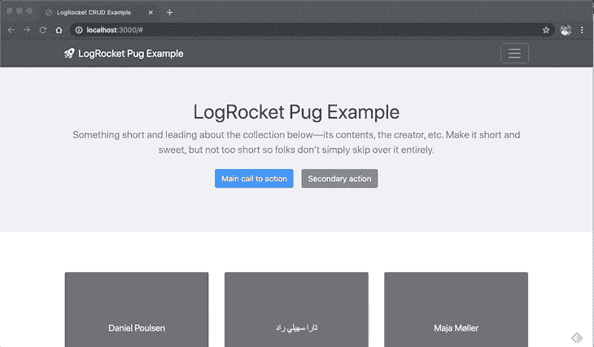
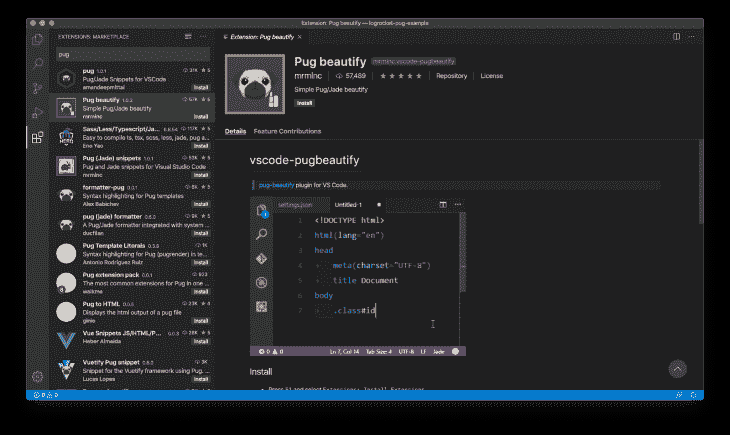
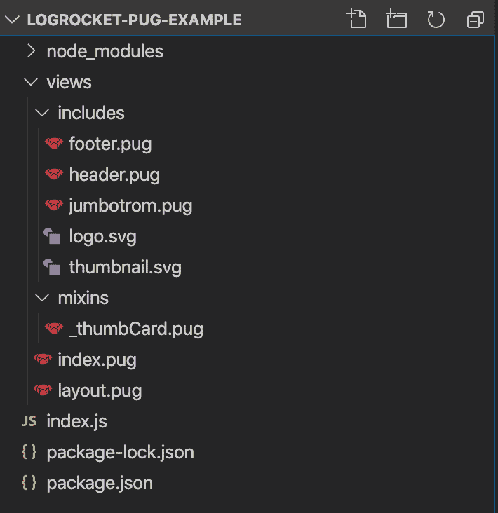

# Pug - LogRocket 博客入门

> 原文：<https://blog.logrocket.com/getting-started-with-pug/>

为我们的网页创建模板的时候到了。HTML 就是用许多不同的工具和框架将静态内容变成动态内容。

即使是静态网站，也很难重用整个网站都一样的页面。在许多情况下，使用服务器端机制是必要的。

有了 Pug，重用页面片段就容易多了。

[Pug](https://pugjs.org/) 是一个受 HTML 影响很大的高性能模板引擎，用 JavaScript 为 Node.js 和浏览器实现。但是也有其他语言如 Java、Python、Ruby 等的移植。

它简单、快速、灵活，语法简单，不仅简化了 HTML 代码的创建，还简化了代码的重用。如果你熟悉 Node.js，那简直是小菜一碟。

在本文中，我们将向您展示 Pug 是如何工作的。我们不打算关注它的选项、设置和属性:为此，我们已经有了很棒的[官方文档](https://pugjs.org/api/getting-started.html)。相反，我们将从头开始创建自己的模板，看看它在实践中是如何工作的。

要推断风格，让我们把它交给 [Bootstrap](https://getbootstrap.com/) 的力量。到本文结束时，目标是获得以下内容:



Final example.

这个设计取自官方 Bootstrap 的一个例子(一个[专辑的例子](https://getbootstrap.com/docs/4.4/examples/album/))。我们将重建相同的结构和设计，但只在帕格。

数据将从[随机用户生成 API](https://randomuser.me/) 中获取，这是一个用于生成随机用户数据的免费 API。就像 Lorem Ipsum，但是对人来说。当你不想建立一个完整的 API 结构只用于测试或采样时，这是非常有用的。

这个结构基本上由一个 Express 服务器组成，它在 Node.js 中托管我们的 localhost 应用程序，而这个应用程序只有一个路由。这个路径将重定向到我们的 Pug 模板，它将装载最终的 HTML 输出。

在您继续之前，我建议您检查这个引导示例页面的完整源代码，这样您就可以将每个标签和 CSS 样式与相应的 Pug 样式相匹配。

## 设置

本教程的设置非常简单:我们只需要 [Node.js](https://nodejs.org/en/) 和 npm(已经包含在 Node 中)。

如果您使用 Visual Studio 代码作为 IDE，我建议您安装 [Pug 美化](https://marketplace.visualstudio.com/items?itemName=mrmlnc.vscode-pugbeautify)插件，因为它在代码高亮显示和代码片段生成方面非常有用。



Installing Pug beautify plugin in vscode.

在您选择的文件夹中，运行以下命令:

```
npm init -y
npm install express pug axios
```

第一个将使用`package.json`初始化我们的文件夹，第二个将安装所需的 npm 依赖项。

我们将利用 [axios](https://github.com/axios/axios) 作为对`Random User API`的请求的 HTTP 客户端。它很健壮，很容易使用。

现在，让我们保证您的文件夹和文件结构与我的相匹配，以避免进一步的错误。

它应该是这样的:



Project file and folders.

文件夹是放置与 Pug 相关的所有东西的地方。在你成功安装 Pug 美化插件后，每个 Pug 文件，也以扩展名`.pug`结尾，将会有一个图标正确地标识它。

当我们需要将最终页面的各个部分分解成“可包含内容”时,`includes`文件夹会很有用。任何 Pug 文件都可以包含在这些文件中。然而，哈巴狗并不是唯一能做到这一点的动物。您可以包括图像、HTML 文件和任何其他类型的文件。

这个`mixins`文件夹很有趣，因为它存储了 [Pug mixins](https://pugjs.org/language/mixins.html) 。Pug mixins 允许你创建可重复使用的 Pug 块。它们基本上是外部 JavaScript 函数，可以将参数作为参数，并在 Pug 文件中的任何地方重用。

它们在模板列表元素中非常有用，比如`ul`和`ol`或者`tables`。在这里，我们将使用它们来迭代用户，并挂载用户的每张卡。

## 卡片混合

先说卡 mixin。具体来说就是`_thumbCard.pug`文件。在继续编写代码之前，看一下[随机用户 API 输出](https://randomuser.me/api/?results=2)，这样你就可以看到我们将在这个 mixin 中处理的 JSON。

将以下代码放在那里:

```
mixin thumbCard(user)
  .col-md-4
    .card.mb-4.shadow-sm
      svg.bd-placeholder-img.card-img-top&attributes({"width": "100%"}, {"height": "225"}, {"focusable": "false"}, {"role": "img"})
        title #{user.name.first} #{user.name.last}
        rect(width="100%" height="100%" fill="#55595c")
        text(x="50%" y="50%" fill="#eceeef" dy=".3em") #{user.name.first} #{user.name.last}
      .card-body
        .card-text #{user.location.street.number} #{user.location.street.name}
        .card-text #{user.location.city}, #{user.location.state} #{user.location.postcode}
        .card-text.mb-4 #{user.location.country}
        .d-flex.justify-content-between.align-items-center
          .btn-group
            button.btn.btn-sm.btn-outline-secondary View
            button.btn.btn-sm.btn-outline-secondary Edit
          small.text-muted 9 mins
```

每个 mixin 都以保留字`mixin`开头。它类似于一个 JavaScript 函数，这个函数接收一个用户作为参数。

该模板遵循一行一个元素(一个 HTML 元素)的规则。当然，缩进也很重要(两个空格)。

每一个 Pug 模板行必须以你想要添加的 HTML 元素的类型开始。如果你不通知它，引擎会创建一个`div`。每个元素的属性必须放在声明之后。

比如“`.col-md-4`”对应这个元素的 CSS 类。CSS 类前面有一个点，id 前面有一个 *#* ，就像我们通常映射 CSS 一样。

每一级缩进都是一个新的内部元素。看看最后一个代码清单中的`svg`元素。在 CSS 声明之后，我们有了`&attributes()`。这是在 Pug 中映射 HTML 属性的可能方法之一。随后的`rect`和`text`元素展示了另一种方法(在括号内)。

`#{}`操作符是 Pug 绑定操作符，即如何将 JavaScript 对象注入 Pug 模板。

注意，我们利用这个特性来打印用户的名和姓，以及下面的位置。您也可以放置纯文本(参见`View`和`Edit`按钮)。

### 包括

现在我们将进入内容。让我们从`header.pug`文件开始:

```
header
  .collapse.bg-dark#navbarHeader
    .container
      .row
        .col-sm-8.col-md-7.py-4
          h4.text-white Hidden Content
          p.text-muted Add some information about the album below, the author, or any other background context. Make it a few sentences long so folks can pick up some informative tidbits. Then, link them off to some social networking sites or contact information.
        .col-sm-4.offset-md-1.py-4
          h4.text-white Contact
          ul.list-unstyled
            li
              a.text-white(href='#') Facebook
            li
              a.text-white(href='#') Twitter
            li
              a.text-white(href='#') Instagram
  nav.navbar.navbar-dark.bg-dark.shadow-sm
    .container.d-flex.justify-content-between
      a.navbar-brand.d-flex.align-items-center
        //- Including the svg logo
        include logo.svg
        strong LogRocket Pug Example
      button.navbar-toggler.collapsed&attributes({'data-toggle': 'collapse'}, {'data-target': '#navbarHeader'})
        span.navbar-toggler-icon
```

这里我们有一个类似的组成。您会看到代码有点冗长，特别是因为我们试图模拟与 Bootstrap 完全相同的设计，Bootstrap 使用了许多 CSS 类。

这里要特别注意`href`链接声明。如果你不把它们放在那里，Pug 会生成除了内部文本之外的任何链接。Bootstrap 不适合这种缺乏链接的情况。

在代码中，您可以看到我们通过保留字`include`包含了第一个外部文件`logo.svg`(您可以在本文末尾的 GitHub 链接中找到它)。

让我们转到另一个包含文件`footer.pug`。代码如下:

```
footer.text-muted
  .container
    p.float-right
      a(href="#") Back to top
    p Album example is © Bootstrap, but please download and customize it for yourself!
    p New to Bootstrap? #[a(href="https://getbootstrap.com/") Visit the homepage] or read our #[a(href="https://getbootstrap.com/docs/4.4/getting-started/introduction/") getting started guide].
```

这里唯一的新东西是使用了[帕格插值](https://pugjs.org/language/interpolation.html)。Pug 为几种插值需求提供了操作符。您可以插入转义和未转义的字符串，以及标记。

在我们的示例中，我们需要放置一个包含 HTML 元素、纯文本和 HTML 元素的序列，所有这些都在同一行中。为此，我们有必要使用`#[]`操作符，将新的 HTML 元素内容包装在其中。简单吧？

让我们去看最后一个帕格包含文件，`jumbotron.pug`:

```
section.jumbotron.text-center
    .container
        h1 LogRocket Pug Example
        p.lead.text-muted Something short and leading about the collection below—its contents, the creator, etc. Make it short and sweet, but not too short so folks don’t simply skip over it entirely.
        p
          a.btn.btn-primary.m-2(href="#") Main call to action
          a.btn.btn-secondary.m-2(href="#") Secondary action
```

接下来，让我们构建`layout.pug`文件。内容如下:

```
doctype html
html
  head
    title LogRocket Pug Example
    link(rel='stylesheet' href='https://getbootstrap.com/docs/4.4/dist/css/bootstrap.min.css')
    style.
      .bd-placeholder-img {
        font-size: 1.125rem;
        text-anchor: middle;
        -webkit-user-select: none;
        -moz-user-select: none;
        -ms-user-select: none;
        user-select: none;
      }

      footer {
        padding-top: 3rem;
        padding-bottom: 3rem;
      }

      footer p {
        margin-bottom: .25rem;
      }

      @media (min-width: 768px) {
        .bd-placeholder-img-lg {
          font-size: 3.5rem;
        }
      }

  body
    include includes/header.pug

    main#main
      include includes/jumbotron.pug

      block content

    include includes/footer.pug

    script(src='https://code.jquery.com/jquery-3.4.1.slim.min.js')
    script(src='https://getbootstrap.com/docs/4.4/dist/js/bootstrap.bundle.min.js')
```

请注意我们是如何导入外部 CSS 和 JavaScript 文件的。非常类似于 HTML 中通常的做法。

要在 Pug 中插入内联 CSS 样式，您需要首先插入`style`片段。然后，后面的所有内容都被视为 CSS。

在主体中，我们包括头文件、超大屏幕文件和页脚文件。但是请注意，我们还插入了块内容。

Pug 支持模板继承。模板继承通过关键字`block`和`extends`工作。在模板中，`block`只是 Pug 的一个“块”,子模板可以替换它。

这个过程是递归的。

换句话说，`index.pug`是主文件，它将从`layout.pug`扩展而来，而后者又包含其他 Pug 文件来组合自己。

看看`index.pug`的内容:

```
extends layout.pug
include mixins/_thumbCard

block content
  .album.py-5.bg-light
    .container
      .row
        each user in users
          +thumbCard(user)
```

第一行陈述了我们刚才所说的内容。这里，我们也在迭代`users`的列表(这个对象必须被注入到`index.js`文件中)。也是在这里，我们调用我们创建的 mixin，在迭代过程中传递每个用户。

最后，我们有了`index.js`内容:

```
const express = require("express");
const axios = require("axios");
const app = express();

app.set("view engine", "pug");

app.get("/", async (req, res) => {
  const query = await axios.get("https://randomuser.me/api/?results=9");
  res.render("index", { users: query.data.results });
});

const PORT = 3000;
app.listen(PORT, () => {
  console.log(`Listening on port ${PORT}...`);
});
```

这里没有什么特别的:只是设置了一个 Express 服务器和默认路由，该默认路由依次调用随机用户 JSON。

结果必须作为`render()`函数中的第二个参数。另外，要覆盖默认的视图引擎，您必须设置视图引擎(在我们的例子中，`pug`)。

这就是了。要进行测试，通过`node index.js`命令运行应用程序，并在 [http://localhost:3000/](http://localhost:3000/) 地址检查结果。

## 结论

你可以在这里找到这个项目[的最终源代码。](https://github.com/diogosouza/logrocket-pug-example)

我希望你觉得这很有用。在实践中，学习 Pug 或其他任何东西都比仅仅阅读随机术语要好。

官方文档和 StackOverFlow 的论坛也是增加你的 Pug 知识和经验的很好的选择。

本质上，Pug 非常容易使用。一旦你理解了模板化的动态过程，它就会顺利进行。一定要把你的整个模板想象成几个小块的组合，这些小块可以有其他嵌套的小块，以此类推。

编码快乐！

## 200 只显示器出现故障，生产中网络请求缓慢

部署基于节点的 web 应用程序或网站是容易的部分。确保您的节点实例继续为您的应用程序提供资源是事情变得更加困难的地方。如果您对确保对后端或第三方服务的请求成功感兴趣，

[try LogRocket](https://lp.logrocket.com/blg/node-signup)

.

[](https://lp.logrocket.com/blg/node-signup)[https://logrocket.com/signup/](https://lp.logrocket.com/blg/node-signup)

LogRocket 就像是网络和移动应用程序的 DVR，记录下用户与你的应用程序交互时发生的一切。您可以汇总并报告有问题的网络请求，以快速了解根本原因，而不是猜测问题发生的原因。

LogRocket 检测您的应用程序以记录基线性能计时，如页面加载时间、到达第一个字节的时间、慢速网络请求，还记录 Redux、NgRx 和 Vuex 操作/状态。

[Start monitoring for free](https://lp.logrocket.com/blg/node-signup)

.