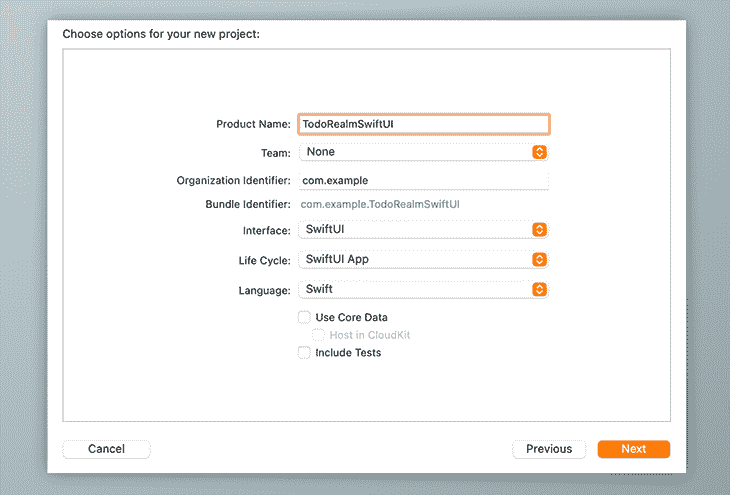
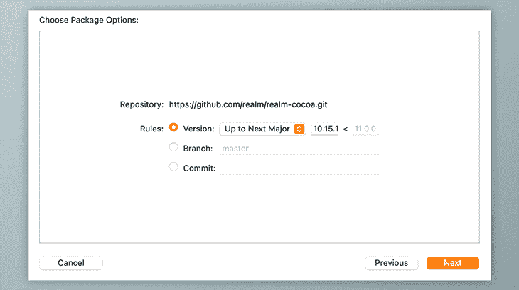
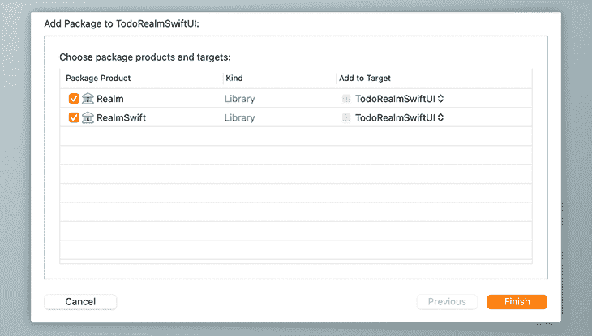
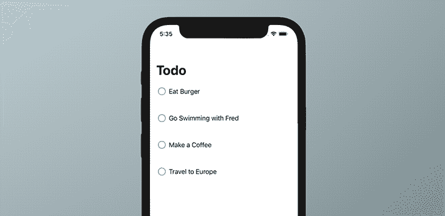
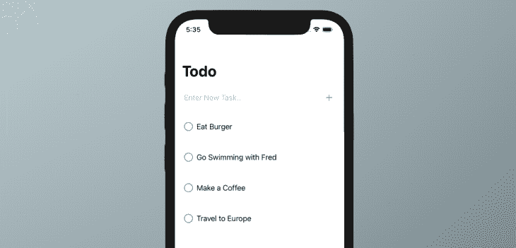
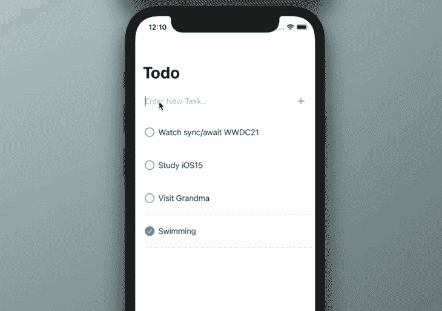
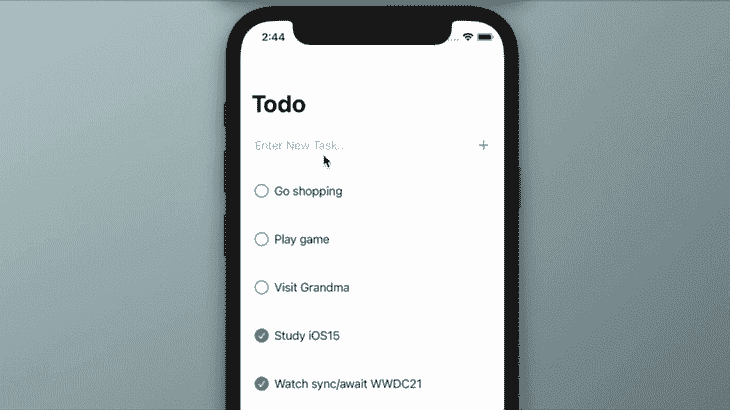
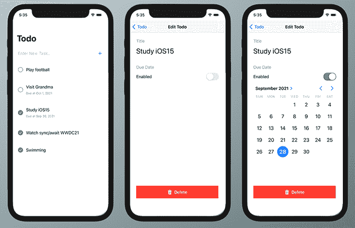

# RealmSwift 入门

> 原文：<https://blog.logrocket.com/getting-started-with-realmswift/>

## 概观

数据持久性是所有应用程序都应该具备的一个重要特性，以便保存重要数据，例如快速加载的最新提要、用户偏好和服务器关键信息。为了避免丢失数据和提供不一致的体验，正确管理本地数据至关重要。

在本文中，我们将学习如何使用 Realm 作为 SwiftUI 的数据持久性引擎，以简单的方式管理 iOS 应用程序中的数据。

我们将创建具有以下功能的待办事项应用:

*   使用 [SwiftUI](https://developer.apple.com/xcode/swiftui/) 和[组合](https://developer.apple.com/documentation/combine)根据数据变化自动刷新待办事项列表
*   列出、存储、编辑和删除领域本地数据库中的任务
*   使用领域迁移修改模式

请注意，本教程使用的是 Xcode 12、Swift v5 和 iOS 14。

## 为什么是境界？

在我们开始开发之前，让我们来看看你将从使用 [Realm](https://github.com/realm/realm-cocoa) 中获益的主要原因。

*   具有面向对象数据模型的轻量级移动数据库——不需要 ORM！
*   易于使用——您将花费更少的时间来设置领域、编写查询、创建嵌套对象等。
*   通过[全面的文档](https://docs.mongodb.com/realm/sdk/)和广泛的社区支持轻松学习
*   对多平台的支持使得跨平台同步数据库结构变得更加容易

## 设置您的 SwiftUI 项目

打开 Xcode 并创建一个新的 SwiftUI 项目。



## 安装领域 SDK

在 Xcode 菜单中，进入**文件** > **Swift 包** > **添加包依赖**，输入领域库 URL，如下图所示。

```
https://github.com/realm/realm-cocoa

```

点击下一个的**，将重定向到该屏幕。这个包的最新版本是 v10.15.1。**



在该屏幕中，检查**领域**和**现实空间**包。



## 创建待办事项模型

让我们用`Identifiable`协议创建一个叫做**任务**的待办事项模型。

```
struct Task: Identifiable {
    var id: String
    var title: String
    var completed: Bool = false
    var completedAt: Date = Date()
}

```

## 创建主列表视图

在本节中，我们将创建一个列表视图和可重用项目视图。

### TaskRowView

添加一个名为`TaskRowView`的新 SwiftUI `View`文件，并用下面的代码更新它。

```
struct TaskRowView: View {
    // 1
    let task: Task
    var body: some View {
        // 2
        HStack(spacing: 8) {
            Button(action: {
                // mark complete action
            }) {
                Image(systemName: task.completed ? "checkmark.circle.fill" : "circle")
                    .resizable()
                    .frame(width: 20, height: 20)
                    .foregroundColor(task.completed ? Color.green : Color.gray)
            }
            Text(task.title)
                .foregroundColor(.black)
            Spacer()
        }
        .padding(EdgeInsets(top: 16, leading: 20, bottom: 16, trailing: 20))
    }
}

```

下面是上面写的代码的细节:

1.  `task`是视图初始化时需要的视图依赖数据。
2.  该视图包含一个用于标记任务完成状态的`Button`和一个用于任务标题的`Text`，它们在水平堆栈中进行管理。

## 创建任务列表视图

在这个项目中，我将使用`LazyVStack`和`ScrollView`。 [LazyVStack](https://developer.apple.com/documentation/swiftui/lazyvstack) 仅适用于 iOS v14 及以上版本，但被认为是列表项目的最佳 SwiftUI 组件之一。

最初，在与 Realm 集成之前，我们将使用样本待办事项数据。

创建一个名为`TaskListView`的新文件来显示待办事项列表。

```
struct TaskListView: View {
    // 1
    private var mockTasks = [
        Task(id: "001", title: "Eat Burger"),
        Task(id: "002", title: "Go Swimming with Fred"),
        Task(id: "003", title: "Make a Coffee"),
        Task(id: "004", title: "Travel to Europe"),
    ]
    var body: some View {
        ScrollView {
            LazyVStack (alignment: .leading) {
                // 2
                ForEach(mockTasks, id: \.id) { task in
                    // 3
                    TaskRowView(task: task)
                    Divider().padding(.leading, 20)
                }
                .animation(.default)
            }
        }
    }
}

```

下面是我们在上面写的详细内容:

1.  如您所见，在我们与 Realm 数据库集成之前，使用了一些模拟数据。
2.  在`ForEach`闭包中调用`TaskRowView`来显示每个`mockTasks`项目
3.  最后，我们将`task`对象传递给`TaskRowView`。

### 更新`ContentView`

一旦我们完成了这两个与任务相关的视图的创建，我们需要更新主`ContentView`文件以包含`NavigationView`和新创建的`TaskListView`。下面的代码还将添加一个导航标题。

```
struct ContentView: View {
    var body: some View {
        NavigationView {
            TaskListView()
            .navigationTitle("Todo")
            .navigationBarTitleDisplayMode(.automatic)
        }
    }
}

```

现在，如果我们尝试运行该项目，它将显示类似于下面的输出。



太好了，我们已经为主待办事项列表创建了一个视图。现在，让我们在列表中添加一个简单的表单，使我们能够动态地添加更多的任务。

## 用`AddTaskView`添加新任务

创建一个名为`AddTaskView`的新`view`文件，并用下面的代码更新它。

```
struct AddTaskView: View {
    // 1
    @State private var taskTitle: String = ""
    var body: some View {
        HStack(spacing: 12) {
            // 2
            TextField("Enter New Task..", text: $taskTitle)
            // 3
            Button(action: handleSubmit) {
                Image(systemName: "plus")
            }
        }
        .padding(20)
    }

    private func handleSubmit() {
        // some action
    }
}

```

以下是对该视图中添加的每个要点的解释:

1.  属性的包装器用于接收每次更改的更新。
2.  然后，我们添加了`TextField`视图，使用户能够添加新文本，并使用`$`符号将其与`taskTitle`变量绑定。
3.  然后将`handleSubmit`作为动作处理函数添加到`Button`视图中，我们将在下一节中将其与数据插入过程集成。

创建表单后，我们需要更新`ContentView`。在`ContentView`内增加一个`VStack`，同时包含`AddTaskView`和`TaskListView`。

```
struct ContentView: View {
    var body: some View {
        NavigationView {
            VStack {
                AddTaskView()
                TaskListView()
            }
            .navigationTitle("Todo")
            .navigationBarTitleDisplayMode(.automatic)
        }
    }
}

```

如果我们再次运行项目，输出将在列表上方显示新添加的表单。



## 创建领域模型

一个[领域模型](https://docs.mongodb.com/realm-legacy/docs/swift/latest/#models)是一个常规的 Swift 类，它子类化领域`Object`协议，并使创建的对象符合领域数据库模式。领域对象将自动保存为领域数据库中的一个表，其中包含所有已定义的属性。它还具有其他特性，如实时查询、反应式事件处理程序和实时数据更新。

以下是可在领域模型中使用的受支持的 Swift 数据类型:

*   `String`
*   `Data`
*   `Int`
*   `Double`
*   `Float`
*   `Bool`
*   `Date`

### 创建`TaskObject`领域模型

首先，我们将创建另一个名为`TaskObject`的领域模型。

现在，我们有两种型号，`Task`和`TaskObject`。领域`TaskObject`只与领域对象[协议](https://blog.logrocket.com/understanding-protocols-in-swift/)和数据库通信，而`Task`类从领域`object`获取数据并与 Swift 视图通信。然后，您可以通过任务类对数据进行更改，以便在应用程序的其他区域使用。`Task`模型用于显示将来具有格式化、编码和解码等特性的数据，而`TaskObject`是专门为 Realm 数据模型创建的。

创建一个名为`TaskObject`的新文件，它继承了领域`Object`类。请注意，领域模型中的每个属性都应该与`@Persisted`包装器一起使用，以将每个属性标记为领域模型的一部分，这些属性将在读写操作期间得到相应的处理。

```
import Foundation
import RealmSwift

class TaskObject: Object {
    @Persisted(primaryKey: true) var id: ObjectId
    @Persisted var title: String
    @Persisted var completed: Bool = false
    @Persisted var completedAt: Date = Date()
}

```

然后，用定制的`init(taskObject:)`函数更新`Task`模型，以支持与 Realm 对象的快速数据映射。

```
struct Task: Identifiable {
    var id: String
    var title: String
    var completed: Bool = false
    var completedAt: Date = Date()

    init(taskObject: taskObject) {
        self.id = taskObject.id.stringValue
        self.title = taskObject.title
        self.completed = taskObject.completed
        self.completedAt = taskObject.completedAt
    }
}

```

## 创建任务视图模型

视图模型来支持我们新创建的视图和领域数据库之间的通信。最初，我们将关注如何插入新任务并获得所有任务的列表。

创建一个名为`TaskViewModel`的新文件，并添加以下代码。

```
// 1
import Foundation
import Combine
import RealmSwift

// 2
final class TaskViewModel: ObservableObject {
    // 3
    @Published var tasks: [Task] = []
    // 4
    private var token: NotificationToken?

    init() {
        setupObserver()
    }

    deinit {
        token?.invalidate()
    }
    // 5
    private func setupObserver() {
        do {
            let realm = try Realm()
            let results = realm.objects(TaskObject.self)

            token = results.observe({ [weak self] changes in
                // 6
                self?.tasks = results.map(Task.init)
                    .sorted(by: { $0.completedAt > $1.completedAt })
                    .sorted(by: { !$0.completed && $1.completed })
            })
        } catch let error {
            print(error.localizedDescription)
        }
    }
    // 7
    func addTask(title: String) {
        let taskObject = TaskObject(value: [
            "title": title,
            "completed": false
        ])
        do {
            let realm = try Realm()
            try realm.write {
                realm.add(taskObject)
            }
        } catch let error {
            print(error.localizedDescription)
        }
    }
    // 8
    func markComplete(id: String, completed: Bool) {
        do {
            let realm = try Realm()
            let objectId = try ObjectId(string: id)
            let task = realm.object(ofType: TaskObject.self, forPrimaryKey: objectId)
            try realm.write {
                task?.completed = completed
                task?.completedAt = Date()
            }
        } catch let error {
            print(error.localizedDescription)
        }
    }
}

```

下面是对上面代码中添加的每个要点的解释:

1.  还有两个额外的框架需要导入，`Combine`和`RealmSwift`。Combine 是一个管理异步事件的强大的 Swift API，并且是原生 iOS 框架的一部分，因此我们可以将它们导入到我们的项目中，而不需要任何安装。为了使用 RealmSwift 的函数访问领域数据库，还需要 RealmSwift。
2.  视图模型是 [`ObservableObject`协议](https://developer.apple.com/documentation/combine/observableobject)的子类，这将对视图产生重要的变化。
3.  `tasks`正在使用`@Published`包装器使订阅者的视图能够在它的值更新时接收更新。
4.  `token`是一个拥有`observer`对象的领域`NotificationToken`。
5.  `setupObserver()`主要是设置一个观察者来观察`TaskObject`列表上的任何变化，比如添加、更新和删除操作。
6.  每次`tasks`变量发生变化时，它都会通知所有的订阅者视图。结果将首先按未完成的任务排序，然后按已完成的任务排序。
7.  然后我们添加了一个名为`addTask()`的函数，它允许我们创建新的对象来存储在领域数据库中。
8.  然后，我们添加了另一个函数`markComplete()`，通过给定的主键(任务 ID)来改变`TaskObject`的完成状态。

## 更新主列表并添加表单

完成模型后，我们需要更新`TaskListView`和`AddTaskView`。

### 更新任务列表视图

在`ForEach`参数中，我们现在将传递从领域数据库获取的动态数据`tasks`。我们不必编写额外的函数来保持数据最新，因为一旦视图从视图模型接收到更新，它就会自动重新加载自己。

```
struct TaskListView: View {
    @EnvironmentObject private var viewModel: TaskViewModel
    var body: some View {
        ScrollView {
            LazyVStack (alignment: .leading) {
                ForEach(viewModel.tasks, id: \.id) { task in
                    TaskRowView(task: task)
                    Divider().padding(.leading, 20)
                }
                .animation(.default)
            }
        }
    }
}

```

### 添加任务视图

在本节中，我们通过调用视图模型`addTask`函数来完成`handleSubmit`函数。

```
struct AddTaskView: View {
    @State private var taskTitle: String = ""
    @EnvironmentObject private var viewModel: TaskViewModel

    var body: some View {
        HStack(spacing: 12) {
            TextField("Enter New Task..", text: $taskTitle)
            Button(action: handleSubmit) {
                Image(systemName: "plus")
            }
        }
        .padding(20)
    }

    private func handleSubmit() {
        viewModel.addTask(title: taskTitle)
        taskTitle = ""
    }
}

```

### `@EnvironmentObject`包装

[环境对象](https://developer.apple.com/documentation/swiftui/environmentobject)是 SwiftUI 中的一个强大特性，它可以在多个视图中自动保存对单个共享对象的更改。

正如我们在`TaskListView`和`AddTaskView`视图中看到的，我们需要使用`@EnvironmentObject`包装器来观察`TaskViewModel`中可能发生的任何变化。

为了使环境对象在视图中可用，我们需要使用`environmentObject()`传递对象。在这种情况下，我们需要更新`TodoRealmSwiftUIApp`中的`App`文件。

```
@main
struct TodoRealmSwiftUIApp: App {
    var body: some Scene {
        WindowGroup {
            ContentView().environmentObject(TaskViewModel())
        }
    }
}

```

### 更新 TaskRowView

让我们用更新按钮操作，以便能够更新任务完成状态。这个观点有两个重要的变化。

1.  用`@EnvironmentObject`包装器添加`viewModel`
2.  在`Button`闭包内，调用 viewModel 的`markComplete`方法来更新任务状态

```
struct TaskRowView: View {
    let task: Task
    // 1
    @EnvironmentObject private var viewModel: TaskViewModel
    var body: some View {
        HStack(spacing: 12) {
            Button(action: {
                // 2
                viewModel.markComplete(id: task.id, completed: !task.completed)
            }) {
                Image(systemName: task.completed ? "checkmark.circle.fill" : "circle")
                    .resizable()
                    .frame(width: 20, height: 20)
                    .foregroundColor(task.completed ? Color.green : Color.gray)
            }
            VStack(alignment: .leading, spacing: 8) {
                Text(task.title)
                    .foregroundColor(.black)
                if !task.formattedDate.isEmpty {
                    Text(task.formattedDate)
                        .foregroundColor(.gray)
                        .font(.caption)
                }
            }
            Spacer()

        }
        .padding(EdgeInsets(top: 16, leading: 20, bottom: 16, trailing: 20))
    }
}
```

太棒了，现在主列表已经完全集成到服务器数据库中了。让我们运行这个项目，尝试添加一些任务，并将其中一些任务标记为完成或未完成。



## 任务详细信息视图

在本节中，我们将添加一个视图来显示列表中每个任务的详细信息。我们还将在这个新视图中添加编辑和删除功能。

创建一个名为`TaskView`的新文件，并用下面的代码更新它。

```
import SwiftUI

struct TaskView: View {
    // 1
    @EnvironmentObject private var viewModel: TaskViewModel
    // 2
    @Environment(\.presentationMode) var presentationMode: Binding<PresentationMode>
    @State private var taskTitle: String = ""
    // 3
    let task: Task

    var body: some View {
        VStack(alignment: .leading, spacing: 24) {
            // 4
            VStack(alignment: .leading, spacing: 4) {
                Text("Title")
                    .foregroundColor(Color.gray)
                TextField("Enter title..", text: $taskTitle)
                    .font(.largeTitle)
                Divider()
            }
            // 5
            Button(action: deleteAction) {
                HStack {
                    Image(systemName: "trash.fill")
                    Text("Delete")
                }
                .foregroundColor(Color.red)
            }
            Spacer()
        }
        .navigationBarTitle("Edit Todo", displayMode: .inline)
        .padding(24)
        .onAppear(perform: {
            taskTitle = task.title
        })
        // 6
        .onDisappear(perform: updateTask)
    }

    private func updateTask() {
        viewModel.updateTitle(id: task.id, newTitle: taskTitle)
    }

    private func deleteAction() {
        viewModel.remove(id: task.id)
        presentationMode.wrappedValue.dismiss()
    }
}

```

以下是对上述代码中添加的每个要点的详细解释:

1.  在这段代码中，我们使用了`TaskViewModel`作为`EnvironmentObject`变量来访问共享视图模型。
2.  然后，我们使用`presentationMode`以编程方式关闭视图。
3.  在初始化过程中，`task`被添加为依赖模型
4.  `T``extField`是为了让我们能够编辑任务的标题。
5.  然后，我们添加了一个删除按钮来从领域数据库中删除任务
6.  最后，一旦用户离开视图，就调用`updateTask`来保存数据。

## 更新视图模型

接下来，用删除和更新功能更新`TaskViewModel`。

```
func remove(id: String) {
    do {
        let realm = try Realm()
        let objectId = try ObjectId(string: id)
        if let task = realm.object(ofType: TaskObject.self, forPrimaryKey: objectId) {
            try realm.write {
                realm.delete(task)
            }
        }
    } catch let error {
        print(error.localizedDescription)
    }
}

func updateTitle(id: String, newTitle: String) {
    do {
        let realm = try Realm()
        let objectId = try ObjectId(string: id)
        let task = realm.object(ofType: TaskObject.self, forPrimaryKey: objectId)
        try realm.write {
            task?.title = newTitle
        }
    } catch let error {
        print(error.localizedDescription)
    }
}

```

## 向`TaskListView`项添加导航

最后，用`NavigationLink`更新`TaskListView`中的项目视图，这样无论何时用户点击该行，它都会导航到细节视图。

```
NavigationLink (destination: TaskView(task: task)) {
    TaskRowView(task: task)
}

```



太好了。我们已经成功地实现了所有的 CRUD 操作。

## 模式迁移

当我们希望以下列方式修改数据库模式时，迁移变得非常重要:

1.  添加新属性或字段
2.  更改属性数据类型
3.  重命名属性
4.  更新属性默认值

在下面的示例中，我们将添加一个名为“截止日期”的新任务字段。我们将需要对我们的视图和模型进行小的更新更改。

## 将到期日字段添加到我们的视图和模型中

向`TaskObject`和`Task`模型中添加一个名为`dueDate`的新字段，该字段具有可选的`Date`类型。

**`TaskObject`模型**
我们将创建一个新的 TaskObject 模型，同上。

```
class TaskObject: Object {
    @Persisted(primaryKey: true) var id: ObjectId
    @Persisted var title: String
    @Persisted var completed: Bool = false
    @Persisted var completedAt: Date = Date()
    // New property
    @Persisted var dueDate: Date? = nil
}

```

**`Task`模型**
在下面更新的代码中，我们将添加一个新的属性(`dueDate`)，用于格式化日期的计算变量，并更新`init`函数。

```
struct Task: Identifiable {
    var id: String
    var title: String
    var completed: Bool = false
    var completedAt: Date = Date()
    // New property
    var dueDate: Date? = nil

    init(taskObject: TaskObject) {
        self.id = taskObject.id.stringValue
        self.title = taskObject.title
        self.completed = taskObject.completed
        self.completedAt = taskObject.completedAt
        // Also map the new property
        self.dueDate = taskObject.dueDate
    }

    var formattedDate: String {
        if let date = dueDate {
            let format = "MMM d, y"
            let dateFormatter = DateFormatter()
            dateFormatter.dateFormat = format
            return "Due at " + dateFormatter.string(from: date)
        }
        return ""
    }
}

```

### 更新任务视图模型

然后，更新视图模型，将到期日期值存储在`update()`函数中。

```
func update(id: String, newTitle: String, dueDate: Date?) {
        do {
            let realm = try Realm()
            let objectId = try ObjectId(string: id)
            let task = realm.object(ofType: TaskObject.self, forPrimaryKey: objectId)
            try realm.write {
                task?.title = newTitle
                // Update due date value (Optional value)
                task?.dueDate = dueDate
            }
        } catch let error {
            print(error.localizedDescription)
        }
    }

```

### 需要迁移错误

提醒一下，每次用户添加或更新新属性时，都需要进行迁移。让我们尝试在迁移之前运行项目，以查看 Xcode 日志中的错误输出，这将从异常处理程序中捕获。

```
Migration is required due to the following errors:
- Property 'TaskObject.dueDate' has been added.

```

## 设置迁移

默认的模式版本是`1`，所以我们必须在配置中将模式改为`2`。

用这段代码添加或更新您的`AppDelegate`文件。在`configMigration`函数中，我们已经为`2`指定了模式版本。

```
import UIKit
import RealmSwift

class AppDelegate: NSObject, UIApplicationDelegate {
    func application(_ application: UIApplication, didFinishLaunchingWithOptions launchOptions: [UIApplication.LaunchOptionsKey : Any]? = nil) -> Bool {
        configMigration()
        return true
    }

    private func configMigration() {
        // perform migration if necessary
        let config = Realm.Configuration(
            schemaVersion: 2,
            migrationBlock: { migration, oldSchemaVersion in
                // additional process such as rename, combine fields and link to other object
            })
        Realm.Configuration.defaultConfiguration = config
    }
}

```

还要确保包括`AppDelegate`适配器。

```
import SwiftUI

@main
struct TodoRealmSwiftUIApp: App {
    @UIApplicationDelegateAdaptor(AppDelegate.self) var appDelegate
    ...
}

```

现在，一切都应该正常工作。运行该项目，结果将类似于下面的截图。



## 项目已完成

恭喜你！我们已经使用 Realm 和 SwiftUI 完成了待办事项应用程序的构建。完整的源代码可以从我的 GitHub 库下载。你可能想尝试在你的未来实施 Realm[Swift 项目](https://blog.logrocket.com/tag/swift/)。

感谢阅读和快乐编码！

## 使用 [LogRocket](https://lp.logrocket.com/blg/signup) 消除传统错误报告的干扰

[](https://lp.logrocket.com/blg/signup)

[LogRocket](https://lp.logrocket.com/blg/signup) 是一个数字体验分析解决方案，它可以保护您免受数百个假阳性错误警报的影响，只针对几个真正重要的项目。LogRocket 会告诉您应用程序中实际影响用户的最具影响力的 bug 和 UX 问题。

然后，使用具有深层技术遥测的会话重放来确切地查看用户看到了什么以及是什么导致了问题，就像你在他们身后看一样。

LogRocket 自动聚合客户端错误、JS 异常、前端性能指标和用户交互。然后 LogRocket 使用机器学习来告诉你哪些问题正在影响大多数用户，并提供你需要修复它的上下文。

关注重要的 bug—[今天就试试 LogRocket】。](https://lp.logrocket.com/blg/signup-issue-free)