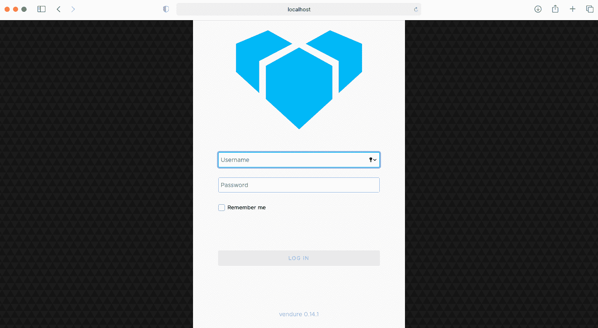
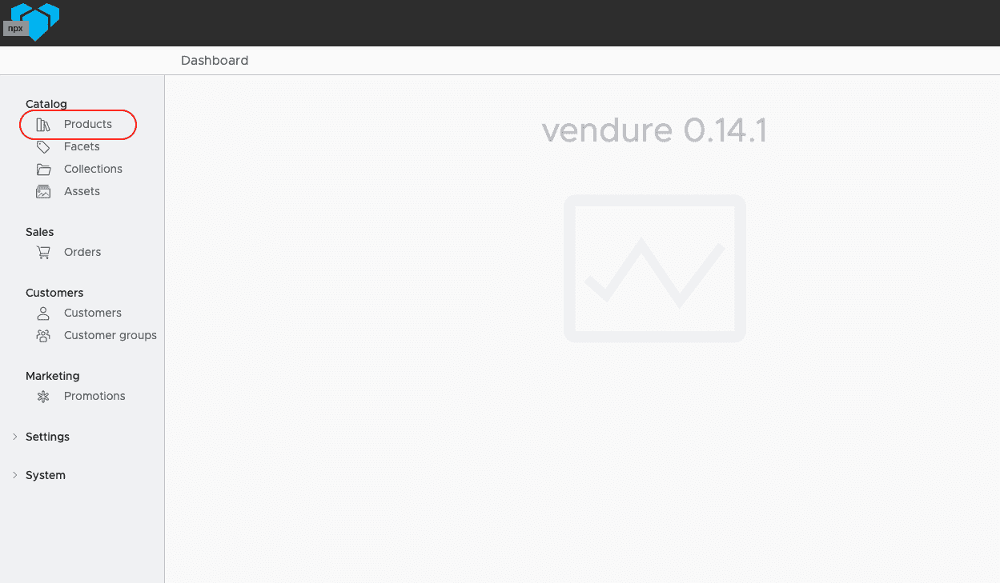
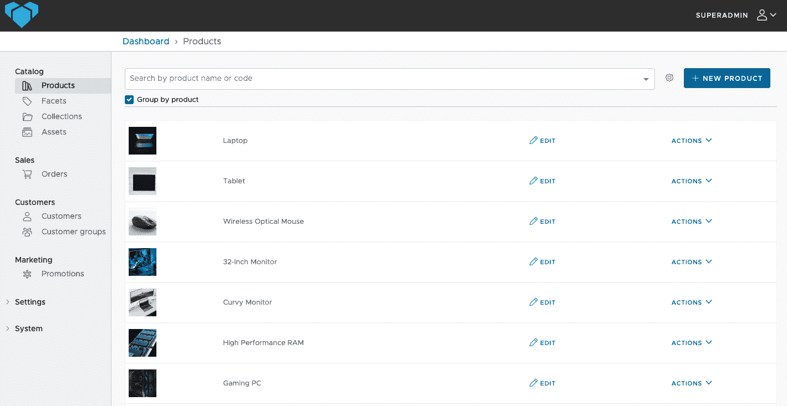
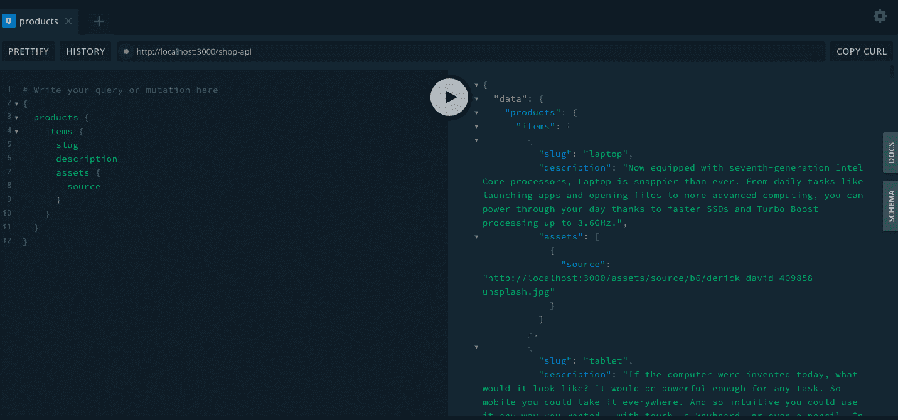
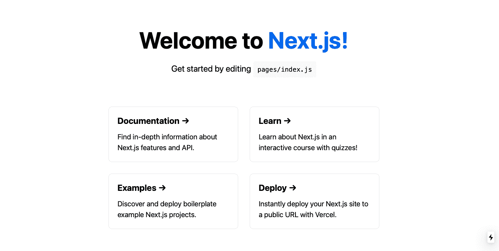
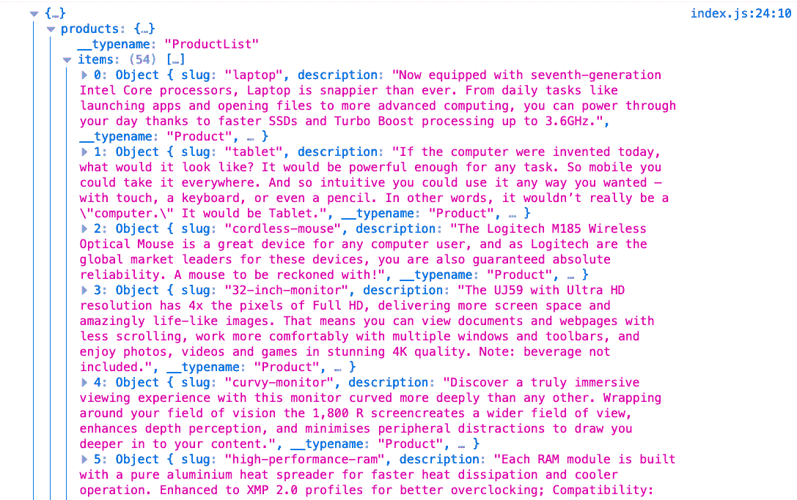
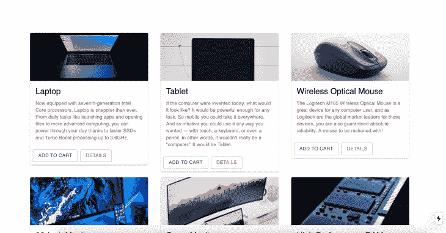
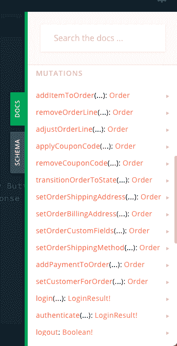
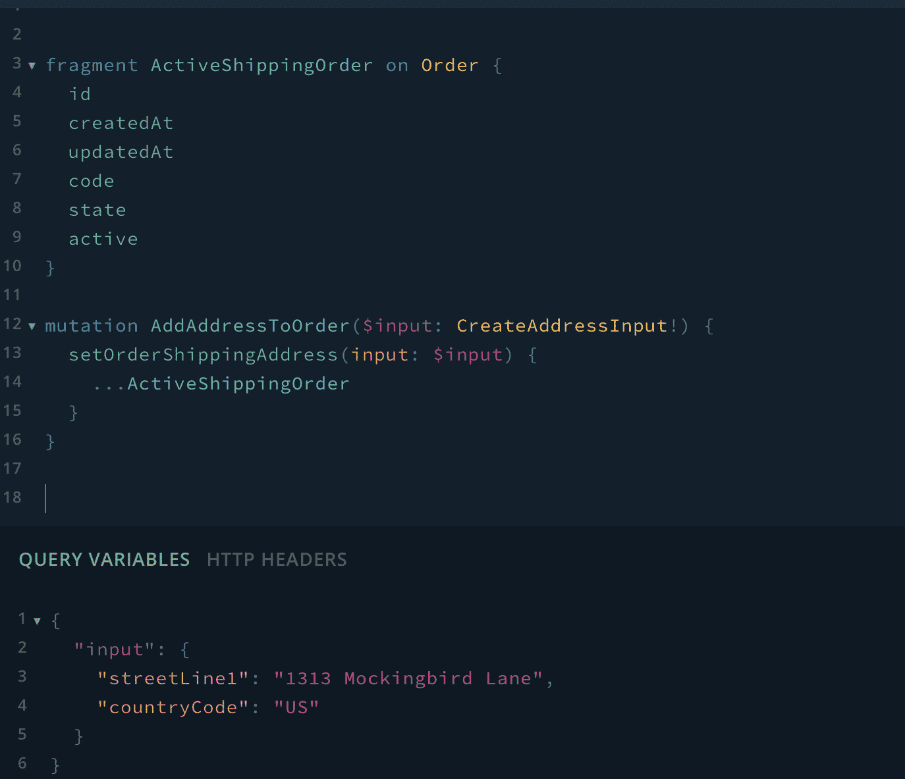

# Vendure - LogRocket 博客入门

> 原文：<https://blog.logrocket.com/getting-started-with-vendure/>

## Vendure 是什么？

Vendure 是一个用 TypeScript 和 Node.js 构建的无头电子商务框架。

## vendre 功能

*   产品和变体
*   库存管理
*   支付提供商集成
*   运输提供商集成

## “无头”是什么意思？

您可能听说过“API 优先”或“无头”这样的术语。综上所述，它提供了你的内容(博文、产品等。)作为 API 上的数据。这提供了很大的灵活性，因为它允许您使用自己选择的技术堆栈。相比之下，传统的 CMS(内容管理系统)需要您安装一个软件，并让您使用特定的技术子集。

## 简单介绍一下我们的技术选择

在本教程中，我将使用 Next.js、GraphQL 和 Apollo 客户端。以下是关于每一个的一些信息:

*   next . js——一个 React 框架，提供零配置、静态生成、服务器端呈现和文件系统路由等等
*   [GraphQL](https://graphql.org/) —一种 API 的查询语言。在查询中，您描述了您想要的数据类型，它就返回这样的数据。仅此而已。GraphQL 提供了多种特性，包括能够在单个请求中获得多个资源、类型系统等等！
*   [Apollo Client](https://www.apollographql.com/docs/react/) —一个状态管理库，使您能够使用 GraphQL 管理远程和本地数据。它允许我们在自动更新 UI 的同时获取、缓存和修改我们的应用程序。一些特性包括声明性数据获取，能够使用现代的 React 特性(比如钩子)，并且它是通用兼容的

## 风险投资入门

### 要求:

*   [Node.js v10.13.0](https://nodejs.org/en/blog/release/v10.13.0/) 或以上版本
*   [NPM v5.2](https://docs.npmjs.com/cli/version) 以上或[纱 v0.25](https://classic.yarnpkg.com/en/docs/cli/version/) 以上
*   如果在 Windows 上，请确保安装了如下窗口构建工具:
    *   `npm install --global --production windows-build-tools`

```
# NPM
npx @vendure/create name-of-your-app
# Yarn
yarn create @vendure my-app
```

这将运行 [Vendure Create](https://github.com/vendure-ecommerce/vendure/tree/master/packages/create) ,并询问您一些关于您的项目的问题。为此，我选择不使用 TypeScript，而选择 SQLite 作为数据库。如果您只想测试 Vendure，Vendure 建议您使用 SQLite，因为它不需要任何外部要求。

## 在本地运行

安装完成后，`cd`(更改目录)进入你的项目并运行以下命令:

```
npm run start
```

运行该命令后，让我们转到[http://localhost:3000/admin/](http://localhost:3000/admin/)以管理员身份登录并添加/查看我们的产品。



使用您在安装过程中创建的管理员用户名和密码登录。如果您忘记了这些是什么，在文本编辑器中打开应用程序，进入`src > vendure-config.js`文件，在`authOptions`下，您应该会看到您的用户名和密码。

登录后，您应该会看到仪表板。现在让我们添加一些产品。

## 创建我们的商店

在仪表盘的目录下，点击`Products`:



如果您选择了用数据填充的选项，那么它应该看起来像这样:



如果没有，那么继续点击显示`New Product`的按钮并填写信息。

## 将 Next.js & GraphQL 与 Vendure 集成

首先，我们来看看数据。为此，请访问 http://localhost:3000/shop-api。

这将打开 GraphQL playground，在这里可以查看所有可用的查询和变化。



## 设置 Next.js

```
npx create-next-app
# or
yarn create next-app
```

安装完成后，当您尝试运行命令`npm run dev`时，您将在终端中得到一个错误，提示“端口 3000 已经在使用中”

在文本编辑器中打开您的项目，进入`package.json`文件，在`scripts > dev`下添加以下内容:

```
next -p 8080
```

现在回到终端，运行以下命令:

```
npm run dev
```

转到 [localhost:8080](http://localhost:8080/) ，您应该会看到:



## 设置 Apollo 客户端

让我们安装 GraphQL 和 Apollo 所需的一切:

```
npm i apollo-boost graphql react-apollo @apollo/react-hooks -S
```

我们将使用`next-with-apollo`，它是 Next.js 的高阶组件:

```
npm install next-with-apollo
# or with yarn:
yarn add next-with-apollo
```

在项目的根目录下，创建一个名为`lib`的文件夹和一个名为`apollo.js`的文件，并添加以下内容:

```
lib > apollo.js

import withApollo from 'next-with-apollo';
import ApolloClient, { InMemoryCache } from 'apollo-boost';
import { ApolloProvider } from '@apollo/react-hooks';

export default withApollo(
  ({ initialState }) => {
    return new ApolloClient({
      uri: '<http://localhost:3000/shop-api>',
      cache: new InMemoryCache().restore(initialState || {})
    });
  },
  {
    render: ({ Page, props }) => {
      return (
        <ApolloProvider client={props.apollo}>
          <Page {...props} />
        </ApolloProvider>
      );
    }
  }
);
```

现在，我们需要将整个应用程序包装在 Apollo 的高阶组件中。在`pages`中，进入`_app.js`并添加以下内容:

```
import '../styles/globals.css';
import withApollo from '../lib/apollo';
function MyApp({ Component, pageProps }) {
  return <Component {...pageProps} />;
}
export default withApollo(MyApp);
```

有了这个，我们现在可以查询我们所有的产品。在`pages` > `index.js`文件中，删除内容，并添加以下内容:

```
pages > index.js

import Head from 'next/head';
import styles from '../styles/Home.module.css';

import gql from 'graphql-tag';
import { useQuery } from '@apollo/react-hooks';

const QUERY = gql`
  {
    products {
      items {
        slug
        description
        assets {
          source
        }
      }
    }
  }
`;

function Home() {
  const { loading, data } = useQuery(QUERY);
  console.log(data);
  return <div className={styles.container}>home</div>;
}

export default Home;
```

在浏览器的控制台中，您应该会看到如下所示的内容:



## 添加 CSS 和构建商店主页

在本教程中，我将使用[材质-UI](https://material-ui.com) 。让我们继续安装:

```
# NPM
npm install @material-ui/core
# Yarn
yarn add @material-ui/core
```

在项目的根目录下，创建一个名为`components`的文件夹，并添加一个名为`ProductCard.js`的文件。

这将允许我们使用材料 UI 组件和我们自己的样式表来集中一切。

添加以下内容:

```
import styles from '../styles/ProductCard.module.css';

import { makeStyles } from '@material-ui/core/styles';
import Card from '@material-ui/core/Card';
import CardActionArea from '@material-ui/core/CardActionArea';
import CardActions from '@material-ui/core/CardActions';
import CardContent from '@material-ui/core/CardContent';
import CardMedia from '@material-ui/core/CardMedia';
import Button from '@material-ui/core/Button';
import Typography from '@material-ui/core/Typography';
```

这将控制材质 UI 组件的 CSS。这里我们定义了卡片组件中图像的最大宽度和高度:

```
const useStyles = makeStyles({
  root: {
    maxWidth: 345,
  },
  media: {
    height: 140,
  },
});
```

这里我们正在析构通过`pages > index.js`中的`Home`组件传入的名为`data`的道具:

```
function ProductCard({ data }) {
  const classes = useStyles();
  const { items } = data.products;
  . . .
}
```

在这里，我们循环遍历我们的 items 数组并创建我们的产品卡，在其中我们传递图像 URL、产品名称等。，到我们的材质 UI 组件:

```
return (
    <section className={styles.container}>
      {items.map((item) => {
        const imgUrl = item.assets[0].source;

        return (
          <div key={item.slug}>
            <Card className={classes.root}>
              <CardActionArea>
                <CardMedia
                  className={classes.media}
                  image={imgUrl}
                  title={item.slug}
                />
                <CardContent>
                  <Typography gutterBottom variant='h5' component='h2'>
                    {item.name}
                  </Typography>
                  <Typography
                    variant='body2'
                    color='textSecondary'
                    component='p'
                  >
                    {item.description}
                  </Typography>
                </CardContent>
              </CardActionArea>
              <CardActions>
                <Button variant='outlined' color='primary'>
                  Add To Cart
                </Button>
                <Button variant='outlined' color='secondary'>
                  Details
                </Button>
              </CardActions>
            </Card>
          </div>
        );
      })}
    </section>
  );

export default ProductCard;
```

现在，让我们把我们的产品卡放在中间，使它具有响应性。在`styles`文件夹中，创建一个名为`ProductCard.module.css`的文件，并添加以下内容:

```
styles > ProductCard.module.css

.container {
  display: grid;
  grid-template-columns: repeat(auto-fit, minmax(300px, 1fr));
  grid-gap: 1rem;
}
```

如果您保存它，它现在应该看起来像这样:



## 构建我们的购物车/结账流程

GraphQL 很酷的一点是，它不仅允许我们查询数据，还允许我们更新数据。我们可以用一种叫做突变的东西来做到这一点。在 Apollo 客户机中，我们将使用`useMutation`钩子来更新我们的数据，并获得加载状态、错误和成功状态。

为了使用它，我们提供了一个 GraphQL 查询的`useMutation`钩子，然后它返回下面的两个:

*   一个可以调用来执行变异的变异函数
*   反映变异执行的当前状态的对象

如果我们返回到[http://localhost:3000/shop-API](http://localhost:3000/shop-api)并点击`DOCS` > `Mutations`，您可以看到所有可用的变体:



首先，我将看看`addItemToOrder`突变，开始构建我们的结账流程。

在 GraphQL playground 中，打开一个新的选项卡并粘贴以下变体:

```
mutation {
  addItemToOrder(productVariantId: 3 quantity: 1) {
    lines {
      productVariant {
        id
        name
      }
      unitPrice
      quantity
      totalPrice
    }
  }
}
```

这将使产品成为活动订单。如果我们查询`activeOrder`，我们应该会看到最近添加的产品:

```
{
  activeOrder {
    // Details you want to see
  }
}
```

现在，让我们看看运输以及如何使用`setOrderShippingAddress`突变:

```
fragment ActiveShippingOrder on Order {
  id
  createdAt
  updatedAt
  code
  state
  active
}

mutation AddAddressToOrder($input: CreateAddressInput!) {
  setOrderShippingAddress(input: $input) {
    ...ActiveShippingOrder
  }
}
```

片段就像一个函数，它是可重用的逻辑。在`ActiveShippingOrder`中，我们定义了当我们调用`setOrderShippingAddress`函数时我们想要返回什么数据。在`AddAddressToOrder`变异中，我们创建了一个名为`input`的查询变量，并将其传递给我们的`setOrderShippingAddress`函数。然后，在 query variables 选项卡中，我只传入一个带有两个必需参数的对象。输入参数只需要街道地址和国家代码。要查看完整的参数列表，可在`DOCS > setOrderShippingAddress > input`查看。



要查看结果，您需要将一个产品添加到活动订单状态。为此，您可以在 GraphQL playground 中打开一个新选项卡，编写`addItemToOrder`变异，然后返回到`setOrderShippingAddress`变异并运行它，您应该会看到以下内容:


如果您没有将产品添加到活动订单状态，那么当您尝试运行您的`setOrderShippingAddress`变异时，它将返回 null。

最后，我们来看看付款。为此，我们将使用`addPaymentToOrder`突变:

```
mutation {
 addPaymentToOrder(method: "", metadata: {})
}
```

> 注意:

*   > `method:` —该字段对应`PaymentMethodHandler`

    的`code`属性
*   > `metadata:` —该字段应该包含作为“元数据”参数传递给指定的`PaymentMethodHandler`的`createPayment()`方法的任意数据。例如，它可以包含支付提供商生成的支付 ID 和其他数据

在 Next.js 中，我们可以使用`useMutation`钩子来应用我们的突变。例如，让我们尝试添加一个产品。首先，我们定义突变`gql`:

```
const ORDER_FRAGMENT = gql`
  fragment ActiveOrder on Order {
    id
    code
    state
    total
    currencyCode
    lines {
      id
      productVariant {
        id
        name
        currencyCode
      }
      unitPriceWithTax
      quantity
      totalPrice
      featuredAsset {
        id
        preview
      }
    }
  }
`;
const ADD_TO_CART = gql`
  mutation AddItemToOrder($productVariantId: ID!, $quantity: Int!) {
    addItemToOrder(productVariantId: $productVariantId, quantity: $quantity) {
      ...ActiveOrder
    }
  }
  ${ORDER_FRAGMENT}
`;
```

类似于 GraphQL playground，我们使用查询变量将其传递给我们的`addItemToOrder`变异，并使用`ActiveOrder`片段来定义我们想要返回的数据。

此外，我们还需要一个查询来获取所有活动订单，我们来定义一下:

```
const GET_ACTIVE_ORDER = gql`
  {
    activeOrder {
      ...ActiveOrder
    }
  }
  ${ORDER_FRAGMENT}
`;
```

现在，我们将两个`gql`都传递给我们的`useMutation`钩子:

```
const [addItemToOrder] = useMutation(ADD_TO_CART, {
    update: (cache, mutationResult) => {
      const { activeOrder } = cache.readQuery({
        query: GET_ACTIVE_ORDER,
      });
      cache.writeQuery({
        query: GET_ACTIVE_ORDER,
        data: {
          activeOrder: mutationResult.data.addItemToOrder,
        },
      });
    },
  });
```

我们希望能够更新我们的查询，以便当我们试图查询`GET_ACTIVE_ORDER`时，它不会返回 null。为此，您可以向`useMutation`钩子提供第二个参数。`update`属性接受一个带有两个参数的方法来获取缓存和结果。我们将在缓存上使用一个名为`writeQuery`的方法，它将把来自`mutationResults`的结果添加到我们的`GET_ACTIVE_ORDER`查询中。

现在，我们可以在一个`onClick`处理程序上调用`addItemToOrder`函数。这可以在用户点击“添加到购物车”按钮时使用。它会将我们选择的产品移动到活动状态，然后我们可以查询所有活动订单。

要添加一个送货地址，它类似于`addItemToOrder`过程，其中您将`gql`传递给`useMutation`钩子，然后传递给`onSubmit`处理程序。然后，您可以将表单中的数据传递给变异函数。

要添加支付，类似于`addItemToOrder`流程，您可以使用`addPaymentToOrder`变体，这取决于您想要如何处理支付，也就是说，如果您想要使用 Stripe 或其他服务，那么您可以在方法参数中进行配置。

## 如何部署

本质上，Vendure 应用程序只是一个 Node.js 应用程序，它可以部署在任何支持 Node.js 的地方。

如果您想在服务器上运行这篇文章，并使用 nginx 作为反向代理将请求定向到您的 Vendure 应用程序，那么文档推荐这篇文章。

## 结论

总之，Vendure 为成为下一个现代的基于 GraphQL 的电子商务框架提供了另一个视角。它是分离的和灵活的，这意味着它选择关注开发人员的生产力和定制的便利性。虽然它仍处于测试阶段，但 Vendure 提供了广泛的开箱即用功能，如客人结账、内置管理界面、与支付和运输提供商的集成等等。对于任何需要启动和运行电子商务网站的小型企业来说，这是一个完美的选择。

## [LogRocket](https://lp.logrocket.com/blg/ecommerce-signup) :看看用户为什么不完成你的电子商务流程中的一个步骤的技术和 UX 原因。

[](https://lp.logrocket.com/blg/ecommerce-signup)

LogRocket 就像是一个网络和移动应用程序和网站的 DVR，记录你的电子商务应用程序上发生的一切。LogRocket 没有猜测用户不转化的原因，而是主动揭示了阻止你转化的根本原因，比如 JavaScript 错误或死点击。LogRocket 还可以监控应用的性能，报告客户端 CPU 负载、客户端内存使用等指标。

开始主动监控您的电子商务应用程序— [免费试用](https://lp.logrocket.com/blg/ecommerce-signup)。

## 您是否添加了新的 JS 库来提高性能或构建新特性？如果他们反其道而行之呢？

毫无疑问，前端变得越来越复杂。当您向应用程序添加新的 JavaScript 库和其他依赖项时，您将需要更多的可见性，以确保您的用户不会遇到未知的问题。

LogRocket 是一个前端应用程序监控解决方案，可以让您回放 JavaScript 错误，就像它们发生在您自己的浏览器中一样，这样您就可以更有效地对错误做出反应。

[](https://lp.logrocket.com/blg/javascript-signup)[https://logrocket.com/signup/](https://lp.logrocket.com/blg/javascript-signup)

[LogRocket](https://lp.logrocket.com/blg/javascript-signup) 可以与任何应用程序完美配合，不管是什么框架，并且有插件可以记录来自 Redux、Vuex 和@ngrx/store 的额外上下文。您可以汇总并报告问题发生时应用程序的状态，而不是猜测问题发生的原因。LogRocket 还可以监控应用的性能，报告客户端 CPU 负载、客户端内存使用等指标。

自信地构建— [开始免费监控](https://lp.logrocket.com/blg/javascript-signup)。