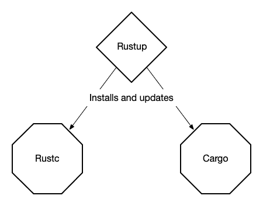
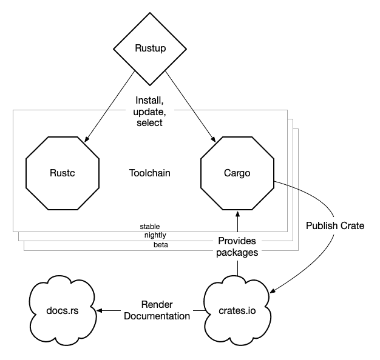
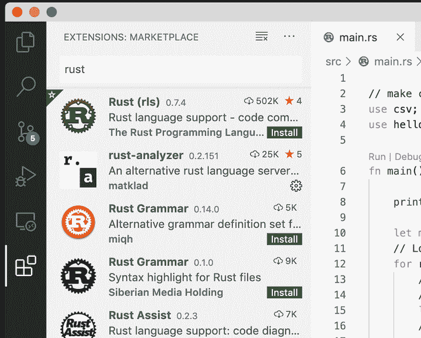
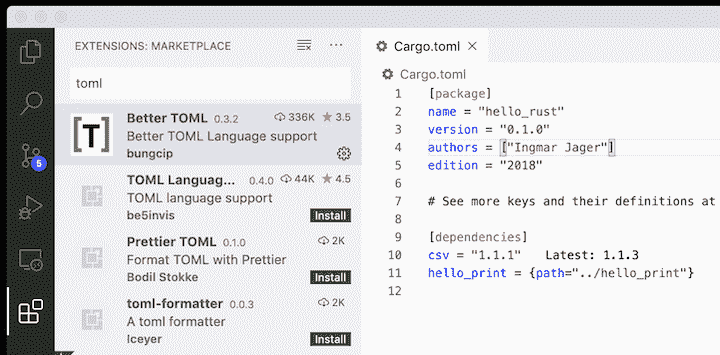

# 快速了解 Rust 

> 原文：<https://blog.logrocket.com/getting-up-to-speed-with-rust/>

Rust 不像其他语言。它比 Python 或 JavaScript 更难掌握，而且它引入了需要不同思维方式的新概念。尽管听起来令人生畏，但无论你在职业生涯的哪个阶段，学习 Rust 都是值得的，因为它会让你更擅长用其他编程语言编写。

本指南旨在帮助您浏览 Rust 生态系统并设置您的开发环境。这样，当你熟悉这种具有挑战性的语言时，你就少了一件担心的事情。

## 安装铁锈

此安装适用于 MacOS 和 linux 用户。如果要在 Windows 上安装铁锈，参见[其他铁锈安装方法](https://forge.rust-lang.org/infra/other-installation-methods.html#other-rust-installation-methods)。

Rustup 是一个程序，你可以用它来安装 Rust，或者升级到一个新的版本，或者降级到一个旧的版本。它相当于安装 Python 版本的`pyenv`和节点版本的`nvm`和`n`，除了它是 Rust 项目的官方部分。

您应该首先访问 [https://sh.rustup.rs](https://sh.rustup.rs) 来检查您将在您的计算机上运行的 bash 脚本。完成后，打开终端并运行以下命令。

```
curl --proto '=https' --tlsv1.2 -sSf https://sh.rustup.rs | sh

```

回答`1`继续默认安装。完成后，运行`source $HOME/.cargo/env`或启动一个新的终端，使`rustup`命令可用。

让我们用`rustup --version`来测试安装。

除了`rustup`，默认安装还会安装`cargo`和`rustc`。



`cargo`是 Rust 生态系统的瑞士军刀，很像 JavaScript 项目的`npm`。它用于安装依赖项和管理项目的构建、测试、运行和发布。`cargo`安装 Rust 包，这些包被称为 crates，*来自 crates.io，该语言的包注册表，但也来自 git 或本地目录。

`rustc`是实际的 Rust 编译器。尽管它是工具链中最基本的部分，但在 Rust 项目中，你并不需要经常处理它。大多数时候，`rustc`是由`cargo build`或`cargo run`命令间接调用的。

您可以运行`rustup show`来了解当前 Rust 设置的概况。

```
➜  rustup --version
rustup 1.21.1 (7832b2ebe 2019-12-20)
➜  rustup show
Default host: x86_64-apple-darwin
rustup home:  /Users/ijager/.rustup

stable-x86_64-apple-darwin (default)
rustc 1.43.0 (4fb7144ed 2020-04-20)
➜  cargo --version
cargo 1.43.0 (3532cf738 2020-03-17)

```

### 切换到夜间 Rust

Rust 每六周发布一次新的更新。这些更新包括新的语言特性、新的语法和修复。如果您想更快地尝试新的语言特性，最新的更新几乎每天都可以通过每夜的构建获得。使选择某一天的铁锈生成变得容易。

以下命令将在每夜安装最新的。

```
➜  rustup toolchain install nightly
➜  rustup toolchain list
stable-x86_64-apple-darwin (default)
nightly-x86_64-apple-darwin

```

现在你有两个 Rust 版本:稳定版和夜间版。但是，默认情况下仍然选择稳定。要选择夜间编译器，请更改默认值。

```
➜  rustup default nightly
➜  rustc --version
rustc 1.44.0-nightly (b2e36e6c2 2020-04-22)

```

如果您需要特定的夜间版本:

```
➜  rustup install nightly-2020-02-20
➜  rustup toolchain list
stable-x86_64-apple-darwin
nightly-2020-02-20-x86_64-apple-darwin
nightly-x86_64-apple-darwin (default)
➜  rustup default nightly-2020-02-20
➜  rustc --version
rustc 1.43.0-nightly (7760cd0fb 2020-02-19)

```

这给了我们最接近的版本，从 2 月 19 日开始。

要删除特定的工具链，只需运行:

```
rustup uninstall nightly-2020-02-20

```

不要忘记再次选择工具链。

```
rustup default stable

```

下面是 Rust 工具链和生态系统的简单概述。



工具链包括以下内容。

*   `rustup`工具链安装器
*   `rustc` rust 编译器
*   `cargo`包管理器
*   `crates.io`包存储库
*   板条箱文件

## 你好，拉斯特

多亏了 Cargo，在 Rust 中制作一个“Hello，World”的例子几乎太容易了。使用`cargo new`启动一个名为`hello_rust`的新项目。

```
➜  cargo new hello_rust
      Created binary (application) `hello_rust` package

```

这个命令创建了一个准备好的新项目。我们来测试一下。

* * *

### 更多来自 LogRocket 的精彩文章:

* * *

```
➜  cd hello_rust
➜  cargo run   
  Compiling hello_rust v0.1.0 (/Users/ijager/hello_rust)    
   Finished dev [unoptimized + debuginfo] target(s) in 1.22s     
    Running `target/debug/hello_rust`
Hello, world!

```

在`src/main.rs`中将`'world'`改为`'rust'`，看看你是否真的在编译和运行这个程序。

```
// src/main.rs
fn main() {
    println!("Hello, rust!");
}

```

当然，您也可以在单独的步骤中构建和运行它。

```
➜ cargo build   
   Compiling hello_rust v0.1.0 (/Users/ingmar/dev/rust/hello_rust)
    Finished dev [unoptimized + debuginfo] target(s) in 0.18s
➜ ./target/debug/hello_rust
Hello, rust!

```

### 添加依赖关系

除了`main.rs`，`cargo`在创建项目时也会生成`Cargo.toml`。这就是铁锈的`package.json`。它描述了当前包及其依赖项。

```
[package]
name = "hello_rust"
version = "0.1.0"
authors = ["Ingmar Jager"]
edition = "2018"
# See more keys and their definitions at https://doc.rust-lang.org/cargo/reference/manifest.html

[dependencies]

```

我们的标准“Hello，World”应用程序还没有任何依赖关系。让我们加上 [`csv`板条箱](https://crates.io/crates/csv)。

```
[dependencies]
csv = "1.1.3"

```

接下来，从`csv`板条箱自述文件页面向`main.rs`添加一段代码。它从`stdin`读取`csv`数据并打印解析后的输出。

```
// make csv crate available
use csv;

fn main() {
    println!("Hello, rust!!");

    let mut rdr = csv::Reader::from_reader(std::io::stdin());
    // Loop over each record.
    for result in rdr.records() {
        // An error may occur, so abort the program in an unfriendly way.
        // We will make this more friendly later!
        let record = result.expect("a CSV record");
        // Print a debug version of the record.
        println!("{:?}", record);
    }
}

```

您可以通过将一个两行的`csv`字符串(header + data)直接插入`cargo run`来轻松测试它。

```
➜ echo "City, Country\nDelft,The Netherlands" | cargo run   
    Finished dev [unoptimized + debuginfo] target(s) in 0.01s
     Running `target/debug/hello_rust`
Hello, rust!!
StringRecord(["Delft", "The Netherlands"])

```

## 本地依赖性

你不会总是包括来自 crates.io 的板条箱。有时，板条箱将是本地的，例如当测试你自己的库板条箱时。

使用`cargo`制作一个名为`hello_print`的库箱。

```
➜ cargo new hello_print --lib
     Created library `csvprint` package
➜ tree csvprint
csvprint
├── Cargo.toml
└── src
    └── lib.rs

```

用`lib.rs`而不是`main.rs`创建一个库。为此，添加一个简单的函数，对它的参数说“hello”。

```
//lib.rs

pub fn print_hello(something: &str) {
    println!("Hello, {}!", something);
}

```

接下来，将您的新图书馆箱添加到您的`hello_rust`应用程序的`Cargo.toml`中。为此，您可以使用相对路径。

```
# Cargo.toml

[dependencies]
csv = "1.1.3"
hello_print = {path="../hello_print"}

```

最后，在`main.rs`中，导入库并调用其 API 中唯一的函数。

```
// make csv crate available
use csv;
// import the print_hello function from the hello_print crate
use hello_print::print_hello;

fn main() {
    print_hello("from");
    let mut rdr = csv::Reader::from_reader(std::io::stdin());
    // Loop over each record.
    for result in rdr.records() {
        // An error may occur, so abort the program in an unfriendly way.
        // We will make this more friendly later!
        let record = result.expect("a CSV record");
        // Print a debug version of the record.
        println!("{:?}", record);
    }
}

```

注意:用`use hello_print::print_hello;`导入是明智的，这样可以调用`print_hello("from");`而不是`hello_print::print_hello("from")`。

```
➜ echo "city, country\nDelft, The Netherlands" | cargo run                                                        
   Compiling hello_rust v0.1.0 (/Users/ingmar/dev/rust/hello_rust)
    Finished dev [unoptimized + debuginfo] target(s) in 0.40s
     Running `target/debug/hello_rust`
Hello, from
StringRecord(["Delft", " The Netherlands"])

```

## VSCode 中的 Rust

社区正在努力让使用 Rust 的软件开发变得更加容易和方便。一些编辑器有可用的扩展和插件，但是官方只支持那些用于 VSCode 的。

### 语法突出显示和代码完成

对于语法突出显示和自动完成，两个最有希望的选项是`Rust Language Service (RLS)`和`rust-analyzer`。有趣的是，它们在引擎盖下以完全不同的方式工作。



`rust-analyzer`更有希望成为`RLS`的接班人。上个月刚刚宣布了`rust-analyzer` 的[首版。它仍在大量开发中，尚未针对所有用例进行优化。但是对于小项目，已经推荐了。](https://rust-analyzer.github.io/blog/2020/04/20/first-release.html)

为什么不亲自尝试一下呢？从扩展市场安装它们非常容易。

### TOML 语言支持

Better TOML 是一个 VSCode 扩展，你可以安装它来提高使用`Cargo.toml`的效率。除了语法突出显示，它还为您的依赖项建议了更新的可用版本，这非常有用。



我希望这个指南能帮助你跟上 Rust 的发展。要想更深入地了解这门语言，我推荐你去看看《Rust》[的书](https://doc.rust-lang.org/book/)并通过例子跟随 [Rust。更好的是，今天就开始写你自己的项目吧！](https://doc.rust-lang.org/stable/rust-by-example/)

## [log rocket](https://lp.logrocket.com/blg/rust-signup):Rust 应用的 web 前端的全面可见性

调试 Rust 应用程序可能很困难，尤其是当用户遇到难以重现的问题时。如果您对监控和跟踪 Rust 应用程序的性能、自动显示错误、跟踪缓慢的网络请求和加载时间感兴趣，

[try LogRocket](https://lp.logrocket.com/blg/rust-signup)

.

[](https://lp.logrocket.com/blg/rust-signup)

LogRocket 就像是网络和移动应用程序的 DVR，记录你的 Rust 应用程序上发生的一切。您可以汇总并报告问题发生时应用程序的状态，而不是猜测问题发生的原因。LogRocket 还可以监控应用的性能，报告客户端 CPU 负载、客户端内存使用等指标。

现代化调试 Rust 应用的方式— [开始免费监控](https://lp.logrocket.com/blg/rust-signup)。