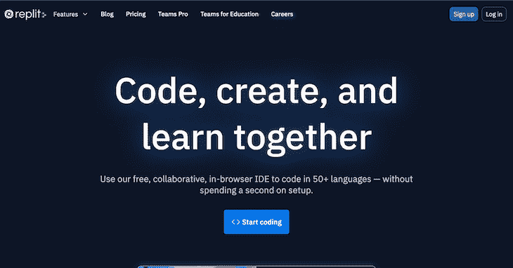
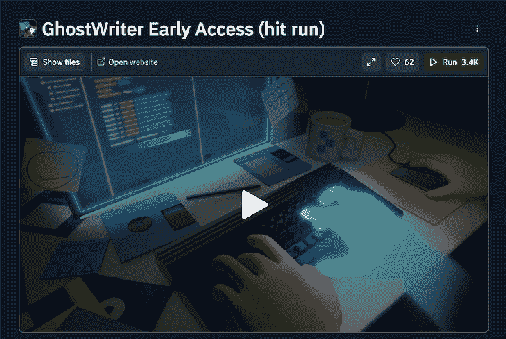
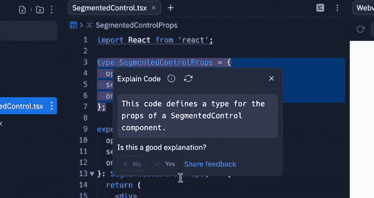

# 探索 Ghostwriter，一个 GitHub Copilot 替代品

> 原文：<https://blog.logrocket.com/ghostwriter-github-copilot-alternative/>

自人工智能(AI)出现以来，不同领域的开发者针对各种用例对其进行了探索；2021 年 10 月，GitHub 发布了 [Copilot AI 工具](https://blog.logrocket.com/building-github-copilot-app/)，附带 IDE 扩展，用于代码自动完成。自首次亮相以来，Copilot 因其有效性而广受欢迎。

Replit 是最受欢迎的在线 IDE 之一，2022 年 9 月，它宣布[增加了对人工智能模式](https://blog.replit.com/ai)的支持，该模式将现代人工智能融入其 IDE 功能中。在其他旨在提高生产力的功能中，AI 模式包括一个机器学习功能的结对程序员来完成您的代码。

在本文中，我们将探索 [Replit 的 Ghostwriter](https://replit.com/site/ghostwriter) ，讨论它的特性，并学习如何在 REPLs 中使用 Ghostwriter。我们还将 Ghostwriter 与其他一些代码生成工具进行比较。

*向前跳转:*

## 什么是代笔人？

Ghostwriter 是一个人工智能引擎，可以根据你的操作推荐代码，帮助你自动完成代码。与 Ghostwriter 一起工作的体验类似于 [Replit 的多人模式](https://docs.replit.com/programming-ide/workspace-features/multiplayer)，然而，你作为一个双人程序员与 AI 合作，推荐适合你用例的代码。

据传，Ghostwriter 的速度是 GitHub 的 Copilot AI 的两倍多，在提高速度和生产率的同时，减少了 web 开发的许多麻烦。作为 Replit AI 模式的一部分，Ghostwriter 于 2022 年 10 月 31 日公开发售。和 Copilot 一样， [Ghostwriter 是一项付费服务](https://replit.com/pricing)。

## Ghostwriter 是如何工作的？

Ghostwriter 通过分析您用该语言编写的前几行代码和您安装的软件包等，为您的后续代码提供建议。

Replit 基于 [Salesforce 的 Codegen](https://github.com/salesforce/CodeGen) 构建了 Ghostwriter，使用 [Nvidia 的 FasterTransformer](https://github.com/NVIDIA/FasterTransformer) 和 [Triton server](https://github.com/triton-inference-server/server) 进行高度优化的解码器，以及 Codegen 模型的知识提炼过程，从 20 亿个参数到更快的 10 亿个参数的模型。

## 代笔人的特征

Ghostwriter 类似于许多其他编程 AI 应用程序，其中一些我们将在后面讨论。但是，它提供了一些你在其他人工智能工具中找不到的改进和特性。以下是 Ghostwriter 允许您在代码复制器中使用的一些功能。

### 代码建议和自动完成

Ghostwriter 建议为您的代码和函数自动补全，以一种简单和交互式的方式加快开发，类似于使用常规的结对编程工具。

### 代码生成

使用 Ghostwriter，您可以生成代码行、函数、文件和程序。Replit 在 2022 年 6 月推出了[“生成代码”](https://blog.replit.com/generate-code)功能，其特点是一个 AI 可以从你的 word 规范中生成代码。通过 Ghostwriter，你可以描述程序的行为或功能，人工智能会为你的应用程序开发返回代码。

### 代码解释

由 OpenAI 的 codex 提供支持，Replit 提供了一个用于代码解释的**解释代码**按钮:

在您的编辑器中选择代码，然后选择 **Explain Code** 特性，它提供了对您指定的代码行、函数或代码的任何其他部分的解释。

### 语义搜索

语义搜索是 Replit 的 AI 模式中最有用的功能之一。使用语义搜索，您可以输入代码查询并检索与您的查询匹配的代码结果。它从流行的开源存储库中返回代码片段的多个结果，您可以在您的项目中使用这些结果。

## 为什么要用代笔？

Ghostwriter 和其他 AI 模式功能是 Replit 多年来最重要的升级，尤其是为了快速开发。有了 Ghostwriter 作为你的搭档程序员，你最终会减少你的开发时间。

Ghostwriter 的代码解释功能促进了团队之间的协作，因为您可以轻松地使用它来检查代码功能，而无需处理通信的麻烦。

Replit 不从 AI 模式特性中分享你的代码，Ghostwriter 只是一个代码推荐工具。因此，您可以将 AI 用于关键目的。Replit 只要求反馈，所以它可以为你和其他用户改善人工智能。根据您的 REPL 的许可，您保留您的复制权利。

## Ghostwriter 的下一步是什么？

在撰写本文时，Ghostwriter 作为 Replit 人工智能模式的一部分可供公众使用，这意味着无论许可证如何，你都可以在你的任何 REPLs 中使用它。

Replit 旨在改进 Ghostwriter 的功能，以提高生产力和工作流程。学习新概念、代码分析等功能将在 AI 模式中可用。在未来，Ghostwriter 还将包括权重的训练后量化，激活到`int8`精度，优化内核以减少延迟，并最终提高模型精度。

Replit 还计划让 Ghostwriter 采用自回归语言模型来提高交互性，并进一步训练 LLM(大型语言模型)，对用户反馈、测试准确性和运行时错误等功能进行深度强化学习。

## 代笔人的替代品

### 副驾驶员

和 Ghostwriter 一样， [Copilot 支持自动代码补全](https://blog.logrocket.com/building-github-copilot-app/)。它有一个类似于 Replit 的 Codegen 的特性，可以根据特定的查询生成代码。这两个工具都支持使用 OpenAI 的 codex 进行代码生成和代码解释，但是，每个工具都有不同的特性。

Copilot 支持额外的功能，如单元测试和生成复杂的算法来匹配约定和上下文，然而，Ghostwriter 不支持。Ghostwriter 只在 Replit 的编辑器上可用，不像 Copilot 在很多 ide 和编辑器上都有，从 VS 代码到所有 JetBrains IDEs，包括 WebStorm，GoLand 等。

### 斯塔克上尉

从 React 到 Angular 和 Vue， [Captain Stack](https://github.com/hieunc229/copilot-clone) 是一个 VS 代码扩展，提供代码建议以提高开发人员的代码效率和生产力。

Captain Stack 提供了基于支持的技术堆栈的上下文感知代码建议、建议的内联文档以及对 TypeScript 和 JSX 的支持。

Stack 队长入门很容易；你需要在你的电脑上安装 [VS 代码](https://code.visualstudio.com/)。你可以从 VS 代码市场[安装扩展](https://marketplace.visualstudio.com/items?itemName=captainstack.captain-stack)，它会在你输入时自动提供建议。

您可以从扩展设置页面自定义 Captain Stack，以使用您首选的技术堆栈，并启用或禁用某些工具功能。

### 微软智能代码

[微软 IntelliCode](https://visualstudio.microsoft.com/services/intellicode/) 是一款 AI 辅助开发工具，在微软的 Visual Studio IDE 和 Visual Studio 代码编辑器中提供智能建议和代码完成。IntelliCode 使用机器学习来掌握代码库的模式和结构，并为给定的上下文建议适当的代码片段和 API 方法。

为了提高生产率和减少代码错误，IntelliCode 在开发过程中提供了上下文感知建议。它还通过突出潜在问题和建议代码改进来帮助代码评审。

要使用 IntelliCode 扩展，您需要安装 [Visual Studio](https://visualstudio.microsoft.com/) 或 Visual Studio 代码。IntelliCode 提供代码风格实施、基于模型的代码分析、协作开发和有用的上下文感知建议。

### 你完成了我

[YouCompleteMe](https://github.com/ycm-core/YouCompleteMe) (YCM)是一个快速的、【as-you-type】[代码完成工具，用于 Vim 编辑器](https://blog.logrocket.com/using-vim-go-development/)，可以与各种编程语言一起工作，包括 C、C++、Python、Java、Rust、Go，以及其他语言的通用语言服务器协议实现。

YCM 使用来自代码库的信息从语义上提供准确的完成建议。它很容易与其他 Vim 插件集成，从而增强了开发工作流程。

开始使用 YCM 很容易。首先，您需要按照 GitHub 页面上的说明安装插件。然后，您需要通过编辑项目目录中的`.ycm_extra_conf.py`文件来为您的特定环境配置 YCM。

### 小报

[TabNine](https://www.tabnine.com/) 是一个 AI 驱动的代码自动完成工具，支持多种编程语言和环境。它支持各种编程语言，包括 C++、Python、JavaScript、Java 和 Go。它还支持各种文本编辑器和 ide，如 VS Code、Sublime Text、IntelliJ IDEA 等等。

TabNine 的一些关键特性包括语义代码自动完成、对多种编程语言的支持、可定制的设置和配置以及离线支持。

### 代码智能

Code Intelligence by Sourcegraph 是一个代码搜索和导航工具，可以帮助您理解和导航大型代码库。它使用高级代码分析和索引技术来提供跨多种语言(如 Go、SQL、JavaScript、Kotlin、C++、PHP、Python、Ruby 和 TypeScript)以及 JetBrains IDEs、Visual Studio、Visual Studio Code、Jenkins 等环境的强大代码搜索和导航功能。

Code Intelligence 支持多种代码托管平台，如 GitHub、GitLab、Bitbucket 和自托管代码库，以及内联文档、类型信息和用于代码审查和拉请求的代码智能。

要开始使用代码智能，你可以在网站上注册免费试用[，并安装](https://www.code-intelligence.com/?utm_term=code%20intelligence&utm_campaign=Fuzzing_page&utm_source=adwords&utm_medium=ppc&hsa_acc=1156374742&hsa_cam=17807504786&hsa_grp=145632688482&hsa_ad=638411854494&hsa_src=g&hsa_tgt=kwd-414436943231&hsa_kw=code%20intelligence&hsa_mt=b&hsa_net=adwords&hsa_ver=3&mtm_campaign=Fuzzing%20-%20Technology%20page%20(Search)&mtm_cid=17807504786&mtm_kwd=code%20intelligence&mtm_source=googleAds&mtm_medium=cpc&mtm_content=638411854494&gclid=CjwKCAiA2rOeBhAsEiwA2Pl7Q1dqd1XbY-1JzdTWXC6sKalkB102VMJD3kSkBhcyI0k2ioxvifQLWhoCLysQAvD_BwE) [Sourcegraph 浏览器扩展](https://docs.sourcegraph.com/@campaigns-new-flow/user/code_intelligence)。对于更高级的特性，您可以将 Sourcegraph 与您的代码托管平台集成，并开始使用它进行代码审查和拉请求。

| 代码完成 | 有效性 | 代码生成 | 其他功能 | Replit 代笔人 |
| --- | --- | --- | --- | --- |
| 是 | 雷普利特 | 是 | GitHub 副驾驶 | 是 |
| VS 代码、JetBrains IDEs 等等 | 是 | 测试和复杂算法生成 | 斯塔克上尉 | 是 |
| VS 代码 | 不 | 微软智能代码 | 是 | VS 代码和 Visual Studio |
| 不 | 代码智能 | 不 | JetBrains IDEs、Visual Studio、Visual Studio 代码等等 | 不 |
| 理解和导航大型代码库 | 泰伯宁 | 是 | JetBrains 编辑器、精彩的文本、VS 代码等等 | 不 |
| TabNine | 你完成了我 | 是 | 精力 | 不 |
| 结论 | 在本文中，我们探讨了 Replit 的 Ghostwriter 的特性，这是一个帮助代码自动完成的人工智能引擎。我们也考虑了一些 Ghostwriter 的替代品，包括 GitHub 的 Copilot、Captain Stack、Microsoft Intellicode、Code Intelligence by Sourcegraph、TabNine 和 YouCompleteMe。 | Ghostwriter 只在 Replit 上可用，所以你可以在使用 Replit 时使用 AI，在使用你最喜欢的 IDE 应用时选择 Copilot。希望本文能让您更好地了解哪种代码生成工具适合您的项目。编码快乐！ | 使用 [LogRocket](https://lp.logrocket.com/blg/signup) 消除传统错误报告的干扰 | [LogRocket](https://lp.logrocket.com/blg/signup) 是一个数字体验分析解决方案，它可以保护您免受数百个假阳性错误警报的影响，只针对几个真正重要的项目。LogRocket 会告诉您应用程序中实际影响用户的最具影响力的 bug 和 UX 问题。 |

## 然后，使用具有深层技术遥测的会话重放来确切地查看用户看到了什么以及是什么导致了问题，就像你在他们身后看一样。

LogRocket 自动聚合客户端错误、JS 异常、前端性能指标和用户交互。然后 LogRocket 使用机器学习来告诉你哪些问题正在影响大多数用户，并提供你需要修复它的上下文。

关注重要的 bug—[今天就试试 LogRocket】。](https://lp.logrocket.com/blg/signup-issue-free)

## Cut through the noise of traditional error reporting with [LogRocket](https://lp.logrocket.com/blg/signup)

[LogRocket](https://lp.logrocket.com/blg/signup) is a digital experience analytics solution that shields you from the hundreds of false-positive errors alerts to just a few truly important items. LogRocket tells you the most impactful bugs and UX issues actually impacting users in your applications.

Then, use session replay with deep technical telemetry to see exactly what the user saw and what caused the problem, as if you were looking over their shoulder.

LogRocket automatically aggregates client side errors, JS exceptions, frontend performance metrics, and user interactions. Then LogRocket uses machine learning to tell you which problems are affecting the most users and provides the context you need to fix it.

Focus on the bugs that matter — [try LogRocket today](https://lp.logrocket.com/blg/signup-issue-free).