# Git 策略:协作、共享和维护工作历史

> 原文：<https://blog.logrocket.com/git-strategies-collaborate-share-maintain-working-history/>

随着元宇宙(一个实时 3D 世界的广阔网络，用户可以作为虚拟人物进行互动，建立货币，销售商品和服务)的推出，在线产品和服务将它带到了一个新的水平。

因此，开发人员越来越依赖于 Git 这样的工具，Git 是一个令人惊叹的版本控制系统，它让我们能够组织我们的工作、代码库、协作、工作历史等等。随着 GitHub、GitLab 和 Bitbucket 的引入，我们甚至可以在云中托管我们的代码库，供我们团队的其他人访问，自动化部署并使其更加容易。

既然我们知道使用 Git 对我们的日常任务很重要，我们还需要遵循某种计划或策略来设置和使用 Git，确保团队的一致性和无 bug 的特性部署。

在本文中，我们将介绍以下四种设置和使用 Git 的策略:

1.  [GitHub 流量](#github-flow)
2.  [Gitflow](#gitflow)
3.  [Gitlab 流程](#gitlab-flow)
4.  [OneFlow](#oneflow)

我们开始吧！

## GitHub 流

GitHub 流程不依赖于发布，所以我们可以随时发布我们的功能和错误修复。

在这个策略中，我们有一个主要分支，我称之为`master`。当我们想要开发一个新的特性时，我会从`master`分支创建一个新的`feature`分支，在那个`feature`分支上工作，最后将那些变更推送到那个`feature`分支。

然后，我在 GitHub 上创建一个对`master`的拉请求，并将这个拉请求合并到`master`分支中。最后，我会将这些更改推送到远程的`master`分支。

概略地说，该策略如下:


让我们从实践和视觉两方面来看一下这些步骤。首先，让我们创建一个项目文件夹，并用下面的命令将该文件夹初始化为一个`git`项目:

```
mkdir github-flow
git init

```

上面的命令会自动为您创建一个`master`分支。现在，在那个名为`index.js`的`master`分支中创建一个文件:

```
touch index.js

```

在`index.js`中，粘贴以下代码:

```
console.log("github flow");

```

现在将这些更改添加、提交并推送到 GitHub 上的远程`master`分支:

```
git add -A
git commit -m "initial commit"
git push origin master

```

现在，让我们用下面的命令从`master`创建一个`feature`分支:

```
git checkout -b feature/header

```

目前，我们的战略图表如下所示:

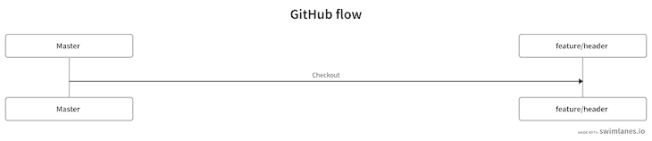

让我们对我们的`index.js`文件做一些修改。在`index.js`文件中，粘贴以下代码:

```
console.log('feature branch');

```

现在，提交这些更改:

```
git commit -am "feature changes"

```

目前，我们处于图表中的以下步骤:

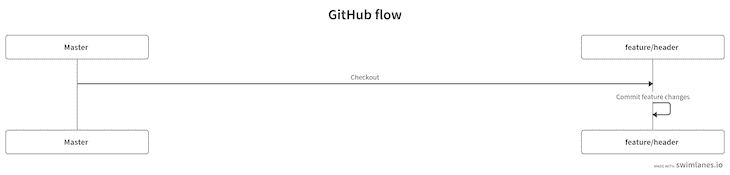

现在，将这些更改推送到远程`feature`分支:

```
git push origin feature/header

```

运行上面的命令后，我们的图表如下所示:

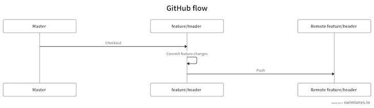

现在，让我们创建一个拉请求。我们可以用两种方法中的一种来实现，要么在 GitHub 上，要么在命令行上。让我们使用第二种方法。使用下面的命令创建一个拉请求:

```
gh pr create

```

现在，我们的图表如下所示:

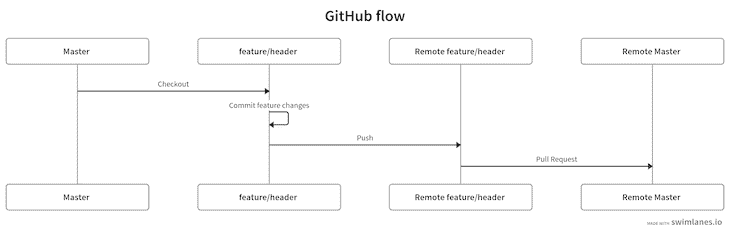

将拉请求合并到`master`,如下所示:

```
gh pr merge

```

到目前为止，我们已经完成了图表中的以下步骤:

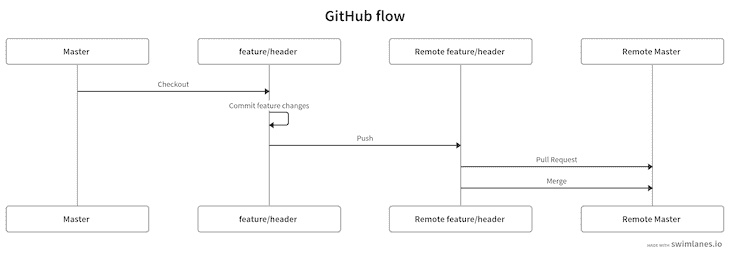

现在，我们可以使用下面的命令将最新的变更从远程`master`分支拉到本地`master`分支:

```
git checkout master
git pull origin master

```

我们最终的工作流程如下:

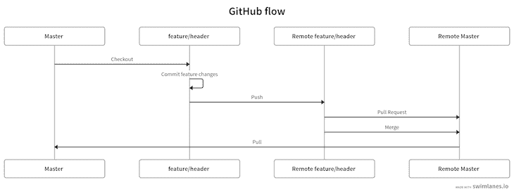

## Gitflow

[Gitflow](https://www.atlassian.com/git/tutorials/comparing-workflows/gitflow-workflow) 工作流程是关于发布的。它还介绍了两个主要分支，我们将保持更新，但它主要侧重于特性分支。

尽管这是一个较老的工作流程，可能被一些人认为已经过时，但在行业层面上，Gitflow 策略仍然非常普遍。

如前所述，Gitflow 策略有两个主要分支，`master`和`develop`。我们将使这两个都保持最新，并从`develop`分支创建`feature`分支。一旦我们完成了`feature`分支，我们将把那个分支合并到`develop`分支。

当我们想要发布特性时，我们创建一个`release`分支，将其合并到`master`分支中，然后将这些更改推送到远程`master`分支进行部署。

下图展示了 Gitflow 策略:


让我们试着一步一步地实施这个策略。首先，让我们创建一个名为`gitflow`的新项目文件夹，并将`cd`放入其中:

```
mkdir gitflow
cd gitflow

```

为了使用 Gitflow，我们将使用`git flow`工具来简化我们的生活，减少我们通常必须用来实现这个流的 git 命令的数量。

如果您的机器上尚未安装 Gitflow，现在可以使用 Homebrew 进行安装:

```
brew install git-flow

```

安装 Gitflow 后，执行以下命令将项目文件夹初始化为`git`和`git flow`项目:

```
git flow init

```

上面的命令将创建两个分支，`master`和`develop`。默认情况下，我们在`develop`分公司。到目前为止，我们处于图表中的以下步骤:

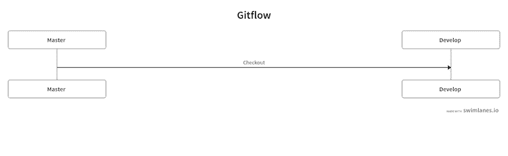

现在，让我们用下面的命令创建一个`feature`分支:

```
git flow feature start header

```

上面的命令将创建一个名为`header`的新特征分支。现在，我们的图表如下:

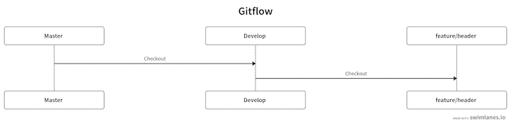

现在，我们可以实现我们想要的任何改变。让我们创建一个新文件:

```
touch index.js

```

打开该文件，并将下面的代码粘贴到其中:

```
console.log('header branch');

```

现在，添加并提交这些更改:

```
git add -A
git commit -am "index file created"
```

在我们的图表中，我们已经完成了以下步骤:

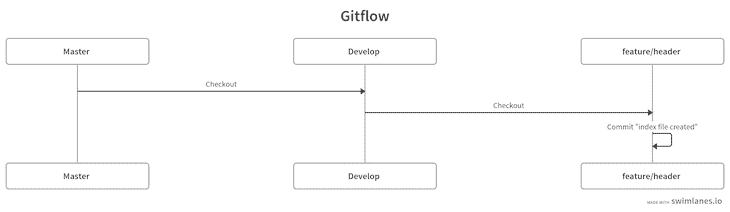

现在，`feature`分支完成了。我们将使用下面的`git flow`命令将`feature/header`分支合并到`develop`分支中:

```
git flow feature finish feature/header

```

上面的命令将把`feature/header`分支合并到`develop`分支中。我们可以这样表示:

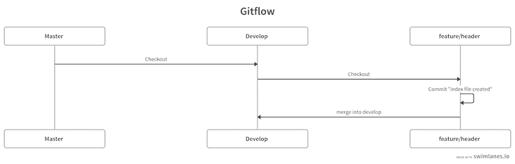

现在，我们可以将这个新特性发布到产品中。我们必须创建一个名为`release`的包含版本号的新分支，如下所示:

```
git flow release start 1.0.0

```

上面的命令将创建一个新的`release/1.0.0`分支，如果需要的话，我们可以在这里做一些小的修改。在我们的图表中，我们已经完成了以下步骤:

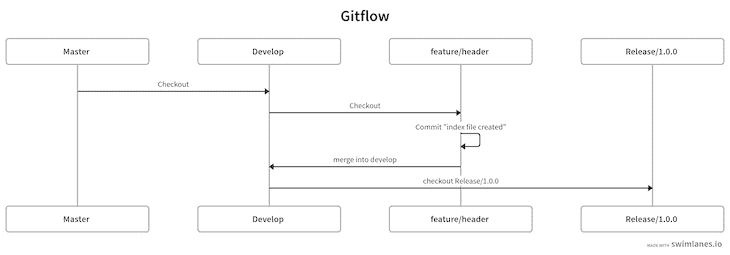

让我们用下面的命令完成这个`release/1.0.0`分支:

```
git flow release finish '1.0.0'

```

上面的命令将我们的`release`分支与`develop`和`master`分支合并，我们将被自动检查到`master`分支。至此，我们已经得出了图表的结论:

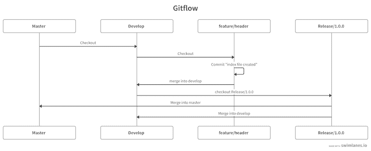

现在我们已经完成了 Gitflow 策略，让我们继续 GitLab 流。

## GitLab Flow

有时候，您无法控制应用程序中的发布。例如，iOS 应用程序通过 App Store 进行验证。对于这些类型的应用程序来说， [GitLab Flow](https://docs.gitlab.com/ee/topics/gitlab_flow.html) 工作流程非常适合遵循。

与 GitHub 流相比，我们倾向于在 GitLab 流中有更多的分支，即`master`、`pre-production`和`production`分支，以及`feature`分支。

我们从一个`master`分支创建`feature`分支。一旦`feature`分支完成，我们将为`master`分支创建一个合并请求。然后，我们将`master`合并到`pre-production`中来测试所有的用例。一旦测试通过，我们将`pre-production`合并到`production`，使其广泛可用:

下图描述了此工作流程:


我们来试试吧！首先，使用下面的命令创建一个新文件夹，并将`cd`放入该文件夹:

```
mkdir gitlabflow
cd gitlabflow 

```

让我们用下面的命令将这个文件夹初始化为一个 Git 项目:

```
git init

```

上面的命令会自动创建一个名为`master`的分支。现在，从`master`分支创建两个分支`pre-production`和`production`:

```
git checkout -b pre-production
git checkout master
git checkout -b production
git checkout master

```

在我们的图表中，我们已经完成了以下步骤:

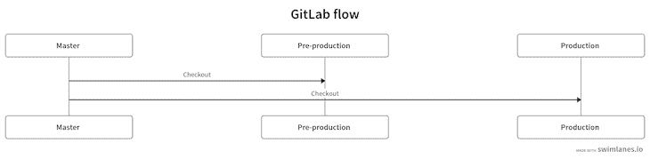

设置好主分支后，让我们用下面的命令从`master`分支创建一个特征分支:

```
git checkout -b feature/header

```

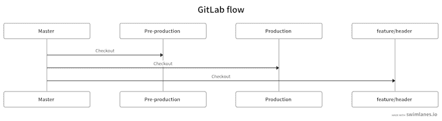

现在，创建一个名为`index.js`的文件:

```
touch index.js 

```

打开`index.js`并将下面的代码粘贴到其中:

```
console.log("gitlab flow");

```

现在，添加、提交这些更改，并将其推入远程`feature`分支，如下所示:

```
git add -Add
git commit -m "initial commit"
git push origin feature/branch

```

到目前为止，我们处于图表中的以下位置:

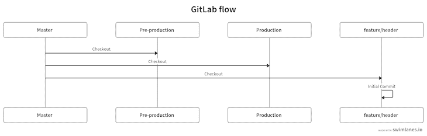

现在，转到 GitLab 并在`master`中创建一个合并请求。按下**绿色的合并按钮**，将请求合并到`master`:

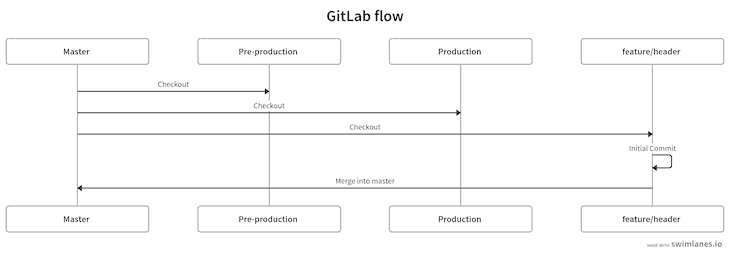

完成之后，是时候将合并请求发布到`pre-production`分支中了。去`master`分支，拉最新变化。然后，检查`pre-production`分支，并将`master`合并到`pre-production`中进行测试:

```
git checkout master 
git pull
git checkout pre-production
git merge master
git push origin pre-production

```

上述步骤如下图所示:

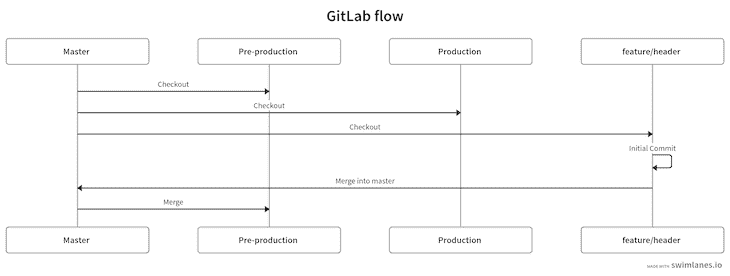

为了将其发布到生产中，我们将把`pre-production`分支合并到`production`:

```
git checkout production 
git merge pre-production
git push origin production

```

概略地说，上述步骤可以演示如下:


## OneFlow

[OneFlow 战略](https://github.com/Oneflow-Inc/oneflow)通常有一个主要分支。它可以有更多，但是为了简单起见，它通常使用一个分支来发布。从这个`master`分支创建`feature`分支。

OneFlow 是作为 Gitflow 工作流的替代方案引入的。在 OneFlow 战略中，有一个主要分支，我们将其命名为`master`分支。特性分支也是这个策略的核心。因此，我们将从名为`feature/header`的`master`分支创建一个新的`feature`分支。一旦我们完成了特性分支，我们将把`feature`分支合并到`master`。

整个策略如下所示:


让我们切实执行这一战略。首先，让我们创建一个项目文件夹，并将`cd`放入该文件夹:

```
mkdir oneflow
cd oneflow

```

让我们将这个文件夹初始化为 Git 存储库:

```
git init

```

默认情况下，上面的命令将创建一个`master`分支，我们将停留在该分支中。现在，我们将创建一个`feature`分支:

```
git checkout -b feature/header

```

到目前为止，该过程可以描述如下:

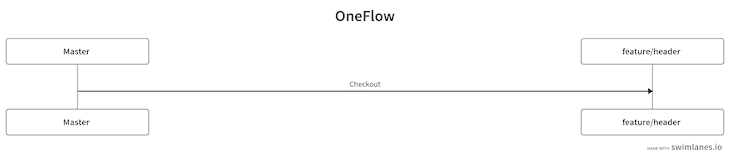

现在，让我们用下面的命令创建一个`index.js`文件:

```
touch index.js

```

打开`index.js`文件并粘贴以下代码:

```
console.log("OneFlow");

```

最后，添加并提交这些更改:

```
git add -A
git commit -m "Initial commit"

```

我们已经完成了图表中的以下步骤:

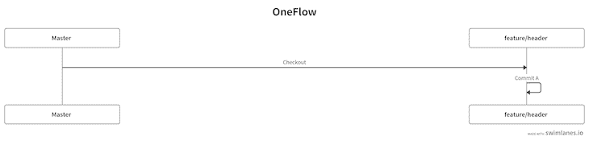

现在，我们完成了`feature`分支。因此，我将把它合并到`master`分支中:

```
git checkout master
git merge feature/header

```

该策略的完整工作流程如下:

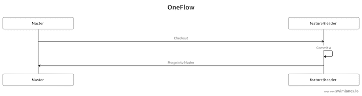

## 结论

在本文中，我们回顾了四种不同的 Git 工作流，您可以使用它们通过自动化来简化团队的部署。虽然这些策略中的每一种都被广泛使用，但最佳选择将取决于您独特的使用案例。如果您想要随时发布变更的灵活性，那么我可能会推荐 GitHub 流策略。如果你发布的是 iOS 应用，我建议你使用 GitLab 流程。在做出任何决定之前，请务必阅读本文中的信息以及每篇文章的文档。

我希望你喜欢这篇文章，如果你有任何问题，一定要留下评论。

## 使用 [LogRocket](https://lp.logrocket.com/blg/signup) 消除传统错误报告的干扰

[](https://lp.logrocket.com/blg/signup)

[LogRocket](https://lp.logrocket.com/blg/signup) 是一个数字体验分析解决方案，它可以保护您免受数百个假阳性错误警报的影响，只针对几个真正重要的项目。LogRocket 会告诉您应用程序中实际影响用户的最具影响力的 bug 和 UX 问题。

然后，使用具有深层技术遥测的会话重放来确切地查看用户看到了什么以及是什么导致了问题，就像你在他们身后看一样。

LogRocket 自动聚合客户端错误、JS 异常、前端性能指标和用户交互。然后 LogRocket 使用机器学习来告诉你哪些问题正在影响大多数用户，并提供你需要修复它的上下文。

关注重要的 bug—[今天就试试 LogRocket】。](https://lp.logrocket.com/blg/signup-issue-free)