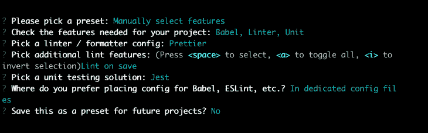
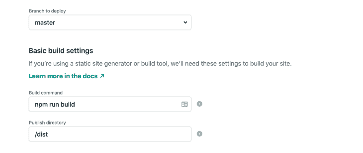
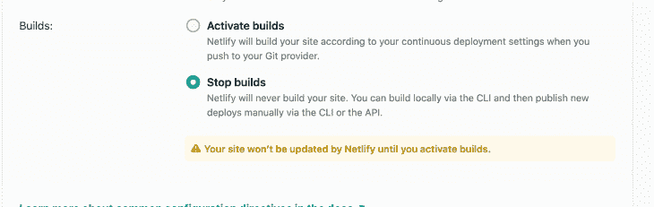
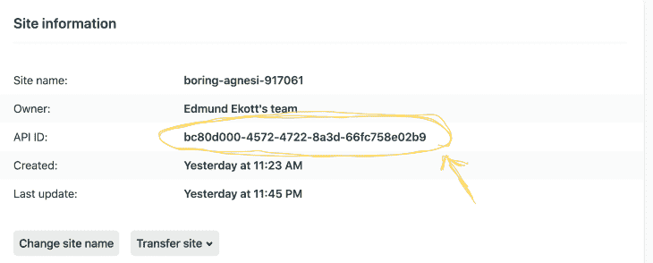
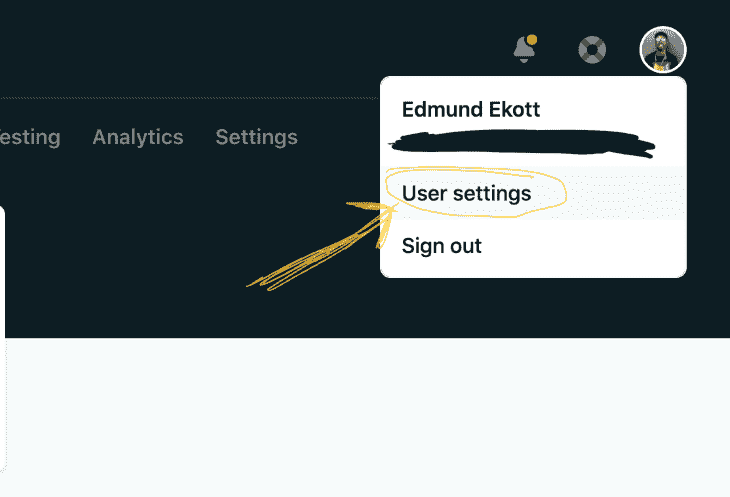
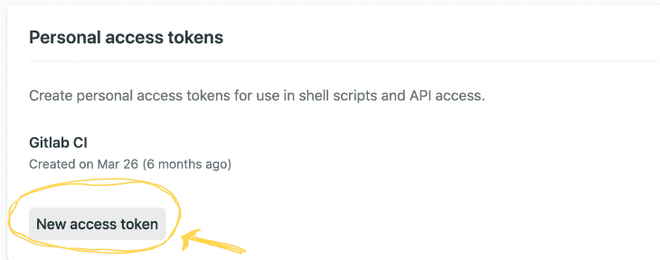
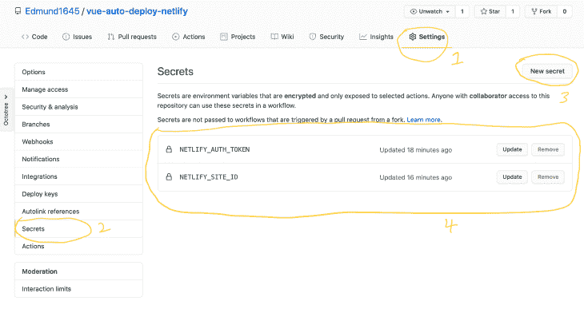
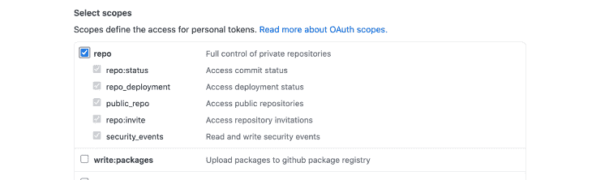
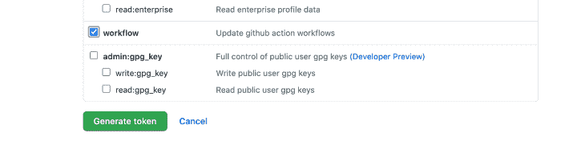
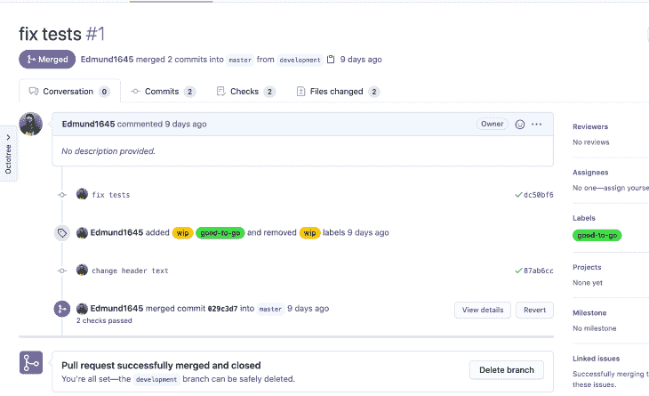

# GitHub Actions:如何自动部署你的应用程序

> 原文：<https://blog.logrocket.com/github-actions-how-to-autodeploy-your-app/>

如果您曾经使用过一个不断发布变更和修复错误的应用程序，那么您就会知道在将一个拉请求合并到您的生产分支之前，等待预览版本和测试运行是多么痛苦。

在本教程中，我们将向您展示如何使用 [GitHub 动作](https://github.com/features/actions)来自动化该过程。我们将构建一个样例 Vue.js 应用程序，编写一些测试，然后推送到我们的远程存储库。我们将触发一个操作来运行我们的测试和任何其他检查，然后在所有检查通过时自动合并到生产分支。这将触发生产构建[网络寿命](https://blog.logrocket.com/firebase-vs-netlify-which-one-is-right-for-you/)。

我们将详细介绍以下内容:

## 什么是 GitHub 动作？

GitHub 动作是您在存储库中创建的指令，用于自动化项目中的某些过程。GitHub 动作使您能够直接从 GitHub 构建、测试和部署您的代码。

2019 年 11 月发布的 [GitHub Actions 将自己](https://github.blog/2019-08-08-github-actions-now-supports-ci-cd/)标榜为“GitHub 上因果的 API。”它使您能够基于指定的事件(如推送、新发布、问题创建等)自动化工作流。—并将这些工作流放在一个存储库中，以便您可以共享、重用和派生您的软件开发实践。

## 什么是 Netlify？

Netlify 是一个用于自动化现代 web 项目的静态部署平台。它的特性包括持续部署、无服务器表单处理、AWS Lambda 支持等等。

Netlify 通过三个快速步骤让您的 web 应用程序变得简单:

1.  连接您的仓库
2.  配置您的生成设置
3.  部署您的站点

## 构建 Vue.js 应用程序

首先，我们将使用 [Vue CLI](https://blog.logrocket.com/getting-started-with-the-new-vue-cli-3-43bcbe1ae759/) 搭建应用程序。

我们不会过多关注 Vue.js 如何工作，或者如何测试 Vue 应用。要想更深入地了解，请查看我们关于用 Vue 测试库测试 Vue 组件的教程[。](https://blog.logrocket.com/testing-vue-components-with-vue-testing-library/)

使用以下命令安装 Vue CLI:

```
npm install -g @vue/cli # for NPM
yarn add global @vue/cli # for yarn

```

通过运行`vue create auto-deploy`并选择以下选项，使用 Vue CLI 创建一个新项目:



在代码编辑器中打开项目文件夹，删除`/src/components/HelloWorld.vue`组件。对于这个演示，我们将使用`/src/App.vue`组件构建一个简单的待办事项应用程序并为其编写测试。

在`App.vue`文件中，用下面的代码片段替换文件的内容:

```
<template>
  <div id="app">
    
    <h1>Todo app</h1>
    <div id="add-todos">
      <input v-model="task" type="text" class="task-input" />
      <button class="add-task-button" @click="addTask">Add Task</button>
    </div>
    <div id="todos">
      <ul>
        <li v-for="(todo, index) in todos" :key="index" class="todo-item">
          <span>{{ todo }}</span>
          <button class="delete-task-button" @click="deleteTask(todo)">Delete</button>
        </li>
      </ul>
    </div>
  </div>
</template>

<script>
export default {
  name: "App",
  data() {
    return {
      task: "",
      todos: []
    };
  },
  methods: {
    addTask() {
      if (this.task !== "") {
        this.todos.push(this.task);
        this.task = "";
      }
    },
    deleteTask(todoItem) {
      this.todos = this.todos.filter(item => item !== todoItem);
    }
  }
};
</script>

<style>
#app {
  font-family: Avenir, Helvetica, Arial, sans-serif;
  -webkit-font-smoothing: antialiased;
  -moz-osx-font-smoothing: grayscale;
  text-align: center;
  color: #2c3e50;
  margin-top: 60px;
  padding: 20px;
  max-width: 500px;
  margin: auto;
}
.task-input {
  margin-right: 10px;
}
.todo-item {
  display: flex;
  justify-content: space-between;
  padding: 10px 20px;
  border: 1px solid #b9b9b9;
  margin-top: 4px;
}
</style>

```

上面的代码片段是一个基本的待办事项应用程序，来自组件中的初始内容。当你在浏览器中访问`localhost:8080`时，你的应用应该是这样的:


现在，您可以添加和删除待办事项。

## 在 Vue.js 中设置单元测试

因为我们在创建项目时选择了单元测试选项，所以 Vue CLI 会自动为我们设置配置并安装一个名为`[vue-test-utils](https://vue-test-utils.vuejs.org/)`的包。这个板条箱提供了类似于 Vue 中 API 的实用功能。我们可以使用这些实用函数与组件进行交互。

如果您查看根文件夹中的`package.json`文件，您应该在`scripts`键下看到这个命令:

```
"test:unit": "vue-cli-service test:unit"

```

这是运行我们的单元测试的命令。如果您此时尝试运行该命令，您将在终端中看到一个预先编写好的测试运行。这是为了确保一切工作正常，我们的测试配置是正确的。

现在，我们将删除`/tests/`文件夹，并在项目的根目录下创建一个名为`__tests__`的新文件夹。Jest 检查两个文件夹中的测试规范:`/tests/unit`和`__tests__`。都是喜好问题。对于本教程，我们将使用`__tests__`文件夹。

在新创建的文件夹中创建一个`App.spec.js`文件，并添加以下代码:

```
import { mount } from "@vue/test-utils";
import App from "@/App.vue";
describe("App.vue", () => {
  it("should add a task when button is clicked", async () => {
    const wrapper = mount(App);
    const task = "Do laundry";
    wrapper.find("input.task-input").setValue(task);
    await wrapper.find("button.add-task-button").trigger("click");
    expect(wrapper.vm.$data.todos.indexOf(task)).toBeGreaterThan(-1);
  });
  it("should render the tasks", () => {
    const todos = ["pick up groceries", "buy guitar pick"];
    const wrapper = mount(App, {
      data() {
        return {
          todos
        };
      }
    });
    expect(wrapper.find("div#todos>ul").text()).toContain(todos[0]);
  });
  it("should delete a task when the delete button is clicked", async () => {
    const todos = ["Order pizza for dinner"];
    const wrapper = mount(App, {
      data() {
        return {
          todos
        };
      }
    });
    await wrapper.find("button.delete-task-button").trigger("click");
    expect(wrapper.vm.$data.todos.indexOf(todos[0])).toEqual(-1);
  });
});

```

上面的代码是一个测试套件，用来确保我们的组件完全按照我们想要的方式运行。我们验证了添加新任务和删除任务是可行的，并且任务实际上呈现在页面上。

现在我们已经启动并运行了包含测试的应用程序，让我们在 Netlify 上部署我们的新应用程序，这样我们就可以从 GitHub Actions 设置部署。

一定要在 GitHub 上为你的应用创建一个新的资源库，并推送代码。在本指南的其余部分，我们将使用 GitHub。

## 使用 GitHub 操作部署到 Netlify

进入官方网站创建一个账户，然后登录。

在你的仪表盘上，点击 Git 的**新站点**按钮，将你的 GitHub 账户连接到 Netlify。

为您的新应用程序选择存储库，并使用下图中的相同配置:



点击**部署站点**按钮，等待您的应用程序准备就绪。

您可以使用 Netlify 自动生成的链接打开您的应用程序。

## 使用 Github 操作准备部署

Netlify 提供了开箱即用的自动部署特性，但我们不想使用它；我们希望 GitHub Actions 在运行测试后代表我们处理部署。在某些情况下，您可能不希望在那个时刻部署更改—例如，如果某个功能仍在开发中，还没有准备好推出。

我们希望阻止 Netlify 在推送时自动构建和部署我们的应用程序，因为 Netlify 会在构建成功时进行部署。我们还想在我们的测试中考虑这个因素，所以我们将使用 GitHub 动作来完成这个任务。

### 禁用 Netlify 上的生成

第一步是停止在 Netlify 上构建。为此，请转到**您站点的设置>构建&部署>持续部署**。点击**构建设置**部分下的**编辑设置**按钮，停止构建:



### 在 GitHub 上配置网络秘密

现在我们已经禁用了 Netlify 上的构建，我们需要设置 Netlify 提供给我们的一些密钥。这些密钥将允许我们在 Netlify 之外部署我们的站点。

我们需要的两个主要密钥是个人访问令牌和我们新创建的站点的 API ID。

该站点的 API ID 位于**您的站点设置>常规>站点详情**下:



你需要注意这一点，因为我们将复制并粘贴到 GitHub 上的应用库。别担心，很安全——你会看到的。

接下来，我们将生成一个个人访问令牌。请遵循以下步骤。

转到您帐户的设置。



在**应用>个人访问令牌**下，创建一个新的访问令牌，并给它一个描述性的名称。请确保在离开页面之前复制令牌。



令牌仅显示一次。如果你忘记复制它们，你将不得不创建新的。

打开你的应用程序库，导航到**设置>秘密**，创建两个秘密。第一个，`NETLIFY_AUTH_TOKEN`用于您刚刚复制的个人访问令牌。第二个是`NETLIFY_SITE_ID`，用于您站点的 API ID，它位于您站点的信息下面。



你的秘密应该看起来像上面的截图。您还会注意到，这些秘密的值永远不会公开，对它们的访问也是有限的。

是时候设置 GitHub Actions 来为我们构建、测试和部署我们的 Vue.js 应用程序了。

## 如何使用 GitHub 动作

为了展示如何使用 GitHub 动作，我们将创建两个工作流。第一个将运行对`master`分支的 pull 请求，并构建、测试和合并代码到 master。第二个将在对`master`分支的提交上运行，以构建、测试和部署我们的应用程序。

我之所以将工作流分开，是因为在某些情况下，您可能希望将提交从本地机器直接推送到主分支——热修复程序等等。无论我们做什么，我们都要确保不打破任何东西。

### 创建自动部署工作流

在您的代码编辑器中，在您的项目的根文件夹中创建一个目录结构，如下所示:`.github/workflows/`，并在`/workflows`文件夹中添加一个名为`autodeploy.yml`的文件。

复制下面的片段并粘贴到`autodeploy.yml`文件中:

```
name: Auto Deploy
on:
  push:
    branches: [master] # run on pushes to master
jobs:
  build-and-test:
    runs-on: ubuntu-latest
    steps:
      - uses: actions/[email protected] # setup the repository in the runner
      - name: Setup Node.js # setup Node.js in the runner
        uses: actions/[email protected]
        with:
          node-version: '12'
      - uses: actions/[email protected]
        with:
          path: ~/.npm
          key: ${{ runner.os }}-node-${{ hashFiles('**/package-lock.json') }}
          restore-keys: ${{ runner.os }}-node-
      - run: npm ci # install dependencies
      - run: npm run build --if-present # build the project
      - run: npm run test:unit # run the tests
      # deploy site to netlify using secrets created on repository
      - uses: netlify/actions/[email protected] 
        env:
          NETLIFY_AUTH_TOKEN: ${{ secrets.NETLIFY_AUTH_TOKEN }}
          NETLIFY_SITE_ID: ${{ secrets.NETLIFY_SITE_ID }}
        with:
          args: deploy --dir=dist --prod
          secrets: '["NETLIFY_AUTH_TOKEN", "NETLIFY_SITE_ID"]'

```

在上面的工作流文件中，我们创建了一个作业`build-and-test`,其中包含一组要遵循的顺序步骤:

1.  在 runner 中设置我们的存储库
2.  在流道中设置 [Node.js v12](https://blog.logrocket.com/es-modules-in-node-js-12-from-experimental-to-release/)
3.  检查是否有任何有效的缓存依赖项(以减少执行时间)
4.  安装任何新的依赖项
5.  尝试构建应用程序
6.  尝试运行测试
7.  如果前两步成功，使用我们生成并存储在存储库中的秘密令牌将应用部署到 Netlify

将更改提交并推送到 GitHub，然后导航到存储库的 **Actions** 选项卡。您应该会看到工作流正在运行。完成后，您可以在 Netlify 上检查您站点的仪表板，以确定部署是否成功发布。

### 创建自动合并工作流

构建这个工作流不像前一个那样简单，因为我们必须考虑何时自动合并请求，何时不合并。

在我们开始创建工作流文件之前，我们需要在我们的存储库上再创建一个秘密，以授予 action 代表我们发出请求的权限。为此，我们需要 GitHub 上的个人访问令牌。

点击[这个链接](https://github.com/settings/tokens)直接进入你的 GitHub 账户上的访问令牌页面，点击“生成新令牌”按钮，给它一个描述性的注释，比如“自动合并”。

在**范围**部分，只选择 repo 和 workflow 范围。





点击**生成令牌**按钮，在离开页面前复制令牌。

在你的应用库中添加一个名为`PERSONAL_TOKEN`的新秘密，并返回到你的代码编辑器。

在`/workflows`文件夹中，创建一个名为`automerge.yml`的文件，并粘贴以下代码片段的内容:

```
name: Auto Merge
on:
  pull_request:
    branches: [master] # run on pull requests to master branch
jobs:
  build-and-test:
    runs-on: ubuntu-latest
    steps:
      - uses: actions/[email protected] # setup repository in runner
      - name: Setup Node.js # setup Node.js un runner
        uses: actions/[email protected]
        with:
          node-version: '12'
      - uses: actions/[email protected]
        with:
          path: ~/.npm
          key: ${{ runner.os }}-node-${{ hashFiles('**/package-lock.json') }}
          restore-keys: ${{ runner.os }}-node-
      - run: npm ci # install dependencies
      - run: npm run build --if-present # build project
      - run: npm run test:unit # run tests
  mergepal-merge: # merge when build and testing is successful
    runs-on: ubuntu-latest
    needs:
      - build-and-test
    steps:
      - uses: actions/[email protected]
      - uses: maxkomarychev/[email protected]
        with:
          token: ${{secrets.PERSONAL_TOKEN}}

```

现在，我们已经成功地创建了自动合并拉请求的工作流，我们需要设置一些适当的条件，以便一切都按预期工作。

在你的应用的根文件夹中创建一个名为`.mergepal.yml`的文件，并粘贴以下代码片段:

```
whitelist:
  - good-to-go
blacklist:
  - wip
method: merge #available options "merge" | "squash" | "rebase"

```

我们刚刚创建的文件是`[mergepal](https://github.com/marketplace/actions/merge-pal)`的配置文件，这是我们添加到工作流中的一个可重用操作。配置决定了何时以及如何合并拉取请求。

*   `whitelist`可用于在 GitHub 上列出一些标签，这些标签将导致我们的拉取请求自动合并
*   在`blacklist`选项下添加的标签将阻止拉取请求被自动合并
*   `method`使您能够为 pull 请求指定合并方法，就像在 GitHub 上一样

## 将您的存储库推送到 GitHub

还有两件事要做:在 GitHub 上创建新标签，并将本地存储库推送到 GitHub。

转到存储库的 **Pull requests** 选项卡，创建一个新表，如下所示:


最后一步是返回代码编辑器，将项目推送到 GitHub 存储库。应该已经触发了自动部署工作流。

为了测试 automerge，在本地创建一个新的分支，并将这个分支推送到 GitHub。创建一个拉取请求，并在提交前测试设置一个新创建的标签。

以下是工作流程的屏幕截图:



你可以在 [GitHub](https://github.com/Edmund1645/vue-auto-deploy-netlify) 上访问这个库。

## 像用户一样体验您的 Vue 应用

调试 Vue.js 应用程序可能会很困难，尤其是当用户会话期间有几十个(如果不是几百个)突变时。如果您对监视和跟踪生产中所有用户的 Vue 突变感兴趣，

[try LogRocket](https://lp.logrocket.com/blg/vue-signup)

.

[](https://lp.logrocket.com/blg/vue-signup)[https://logrocket.com/signup/](https://lp.logrocket.com/blg/vue-signup)

LogRocket 就像是网络和移动应用程序的 DVR，记录你的 Vue 应用程序中发生的一切，包括网络请求、JavaScript 错误、性能问题等等。您可以汇总并报告问题发生时应用程序的状态，而不是猜测问题发生的原因。

LogRocket Vuex 插件将 Vuex 突变记录到 LogRocket 控制台，为您提供导致错误的环境，以及出现问题时应用程序的状态。

现代化您调试 Vue 应用的方式- [开始免费监控](https://lp.logrocket.com/blg/vue-signup)。