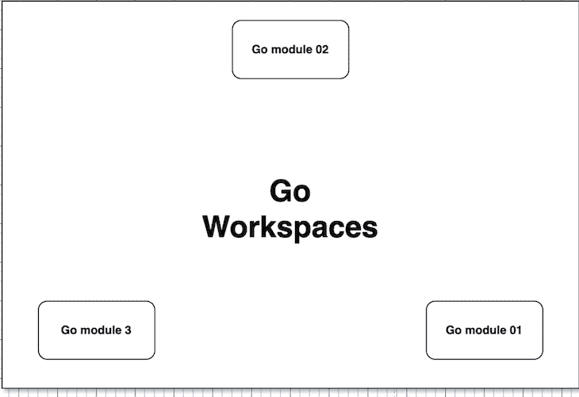
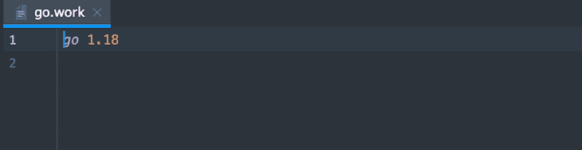
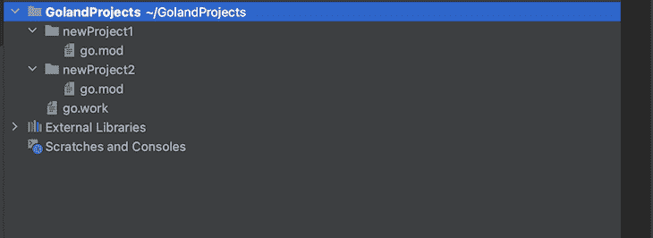
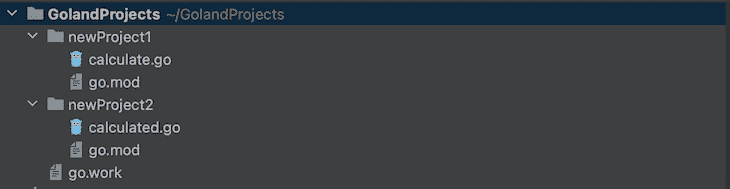

# 利用 Go 工作区进行多模块本地开发

> 原文：<https://blog.logrocket.com/go-workspaces-multi-module-local-development/>

[Go](https://blog.logrocket.com/tag/go/) 编程语言是为开发人员的生产力和易用性而准备的。从语言开始很容易，用 Go 的标准库[构建完整的应用](https://blog.logrocket.com/getting-started-with-go-for-frontend-developers/)。Go 也是向后兼容的，并且升级了语言以防止破坏现有的代码。

Go v1.11 发布的一个令人兴奋的特性是引入了 Go 模块。最后，Go 开发者有了一个简单的版本化和包管理的选择。

现在，Go v1.18 引入了 Go work spaces——这一特性使得使用多个 Go 模块比以往任何时候都更容易。这包括版本控制，而无需在解决依赖关系时为工作区中的每个模块编辑 Go 模块文件。

在本文中，我们将探讨什么是 Go 工作区，以及您可以使用工作区特性探索的各种用例。在我们开始之前，确保你已经掌握了[围棋](https://blog.logrocket.com/full-stack-bud-go/)、[设置围棋项目](https://blog.logrocket.com/flat-structure-vs-layered-architecture-structuring-your-go-app/)和[围棋模块](https://go.dev/blog/using-go-modules)的工作知识。您还需要在您的机器上安装 [Go v1.18](https://go.dev/dl/) 或更高版本。

*向前跳转:*

## 什么是 Go 工作区？



[Go 工作区](https://go.dev/ref/mod#workspaces)使用一个`go.work`文件，通过一个 Go 模块文件，提供同时使用多个 Go 模块作为主模块的功能。`go.work`文件覆盖了`go.mod`文件，因此您不必担心修改初始文件来处理各种模块。

在 Go 工作空间出现之前，Go 开发人员可以选择使用不同的 Go 模块(`go.mod`)文件创建多个 Go 模块，并编辑这些文件以进行更改，或者使用`replace`目录在`go.mod`中进行更改。这很麻烦，尤其是随着项目规模的增加。

Go 工作区为从事多个 Go 项目的开发人员提供了生产力提升，并允许您初始化 Go 工作区以同时处理多个模块。当工具处理`go.mod`文件变更时，你得到更简单的工作流程和 [monorepos](https://blog.logrocket.com/managing-full-stack-monorepo-pnpm/) 。这一改变让您可以专注于为您不同的用例编写与多个模块一起工作的代码。

## Go 工作区入门

首先，您需要为 Go 中的多模块本地开发初始化一个 Go 工作区。从那里，您可以指定添加到工作区的模块，并将这些模块作为一个单元来使用。

您可以使用`init`命令初始化 Go 工作区。初始化后，`init`命令将一个工作区文件(`go.work`)写入根目录。您可以将路径指定为`init`命令的可选参数，或者让 Go 工具创建一个空的工作空间:

```
go work init

```



在初始化一个空的工作空间文件后，您可以使用带有 Go modules 文件的`use`指令将模块添加到工作空间:

```
use (
        ./newProject1
        ./newProject2
)

```

如果您正在使用的模块已经存在并被初始化，您可以通过将它们全部指定为`init`命令的可选参数来添加它们:

```
mkdir newProject1 && cd newProject1 && go mod init newProject1 
mkdir newProject2 && cd newProject2 && go mod init newProject2

```

上面的代码是用`mod init`创建和初始化两个 Go 模块的 CLI 命令:

```
go work init newProject1 newProject2

```



上面的命令将模块添加到工作区，自动更新`use`:


`go.work`文件语法与`go.mod`文件相同，具有相似的指令。`go`指令指定了项目的 Go 版本。`use`指令将模块添加到相对于`go.mod`文件路径的工作空间中的模块中。您可以使用`replace`指令将指定模块版本的内容替换为您指定的替代版本。

## 使用 Go 工作区处理多个模块

Go 提供了用于工作空间和工作空间中的模块的`edit`、`use`和`sync`命令。

您可以使用`use`命令向您的工作区添加新模块。如果包在本地，则`use`命令修改`go.work`文件并将模块(包)添加到`use`指令中:

```
go work use ./filePath

```

`sync`命令将构建列表(工作区中依赖模块的版本)同步到工作区模块:

```
go work sync

```

`edit`命令提供了一个命令行界面，用于编辑当前目录和父目录中的 Go 工作区文件:

```
go work edit

```

> 注意:只有 edit 命令可以访问工作区文件(没有模块)。

您可以使用带有`edit`的`-fmt`标志来重新格式化 Go workspace 文件:

```
go work edit -fmt

```

## 在程序中实现 Go 工作区

Go workspaces 的目标是多模块本地开发。在本教程中，您将在同一工作区的另一个模块中本地访问外部模块中的函数。

运行下面的代码，在您的机器上创建并初始化一个带有两个 Go 模块的 Go 工作区。这些命令还在模块中创建 Go 文件:

```
go work init
mkdir newProject1 && cd newProject1 && go mod init newProject1 && touch calculate.go
cd ..
mkdir newProject2 && cd newProject2 && go mod init newProject2 && touch calculated.go

```



`newProject1`模块将包含一个`newProject2`模块可以在开发中访问和互操作的函数。

下面是带有`use`指令的`workspace`文件，指定这两个模块是工作空间的一部分:

```
use (
        ./newProject1
        ./newProject2

)

```

将这些代码添加到指定的包中，以从`newProject2 main`功能访问`newProject1`功能:

```
// newProject1

package newProject1

func Calculate(x, y int) int {
        return x + y
}

```

上面的代码返回两个整数的和。由于模块(`newProject1`)是 Go 工作区的一部分，您应该能够从另一个模块(`newProject2`)访问该功能:

```
// newProject2

package main

import (
        "fmt"
        "newProject1"
)

func main() {
        fmt.Println(newProject1.Calculate(3, 4))
}

```

上面的代码导入了`newProject1`模块并访问了`Calculate`函数。下面是运行`newProject2`包的主函数的结果:

```
go run ./newProject2

```


## Go 工作区的更多使用案例

Go workspaces 是一个相对较新的特性，开发人员寻求新的方法和用例来将其整合到他们的项目中。

以下是 Go 工作区的一些使用案例:

### 开源合作

Go workspaces 可以促进 Go 开发者之间的开源合作，因为你可以无缝地使用多个模块。这对于大型项目来说非常方便，因为项目之间的切换和互操作变得更加容易。

### 版本控制和发布

Go 工作区的一个用例是版本控制。Go workspaces 使同时构建不同的版本和功能变得更加容易，同时在不破坏现有代码的情况下同步包之间的依赖关系。

## 结论

您已经了解了 Go 工作空间、功能、如何使用 Go 工作空间简化项目中的工作流程，以及工作空间的使用案例。

Go workspaces 与许多其他备受期待的功能一起发布，从[模糊化](https://go.dev/doc/tutorial/fuzz)到[泛型](https://blog.logrocket.com/go-generics-past-designs-present-release-features/)以及跨机器的性能改进。Go 作者不断努力改进语言，最近发布了 Go v1.19。

## 使用 [LogRocket](https://lp.logrocket.com/blg/signup) 消除传统错误报告的干扰

[](https://lp.logrocket.com/blg/signup)

[LogRocket](https://lp.logrocket.com/blg/signup) 是一个数字体验分析解决方案，它可以保护您免受数百个假阳性错误警报的影响，只针对几个真正重要的项目。LogRocket 会告诉您应用程序中实际影响用户的最具影响力的 bug 和 UX 问题。

然后，使用具有深层技术遥测的会话重放来确切地查看用户看到了什么以及是什么导致了问题，就像你在他们身后看一样。

LogRocket 自动聚合客户端错误、JS 异常、前端性能指标和用户交互。然后 LogRocket 使用机器学习来告诉你哪些问题正在影响大多数用户，并提供你需要修复它的上下文。

关注重要的 bug—[今天就试试 LogRocket】。](https://lp.logrocket.com/blg/signup-issue-free)