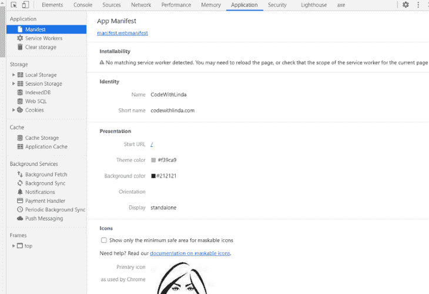
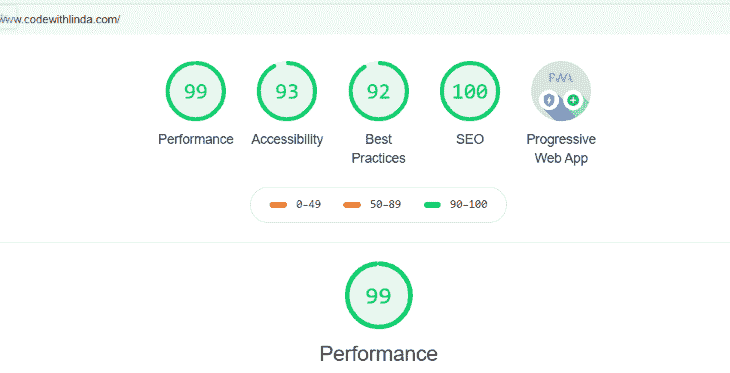

# 在盖茨比博客中下线

> 原文：<https://blog.logrocket.com/going-offline-in-gatsby/>

使用 Gatsby 进行构建意味着自动为您处理大量安装所需的繁重工作，因此您可以专注于为 UI 编写代码。然而，Gatsby 并不支持离线功能，也不支持通常所说的即开即用的渐进式网络应用(PWAs)。

PWA 是任何可以在没有互联网连接的情况下完全或部分导航的网站，可以安装在设备上，就像一个本地应用程序一样，只需通过浏览器即可。一个场所要符合 PWA 的资格，必须满足三个基准标准。总之，它:

*   必须有一个清单文件
*   使用服务工作者缓存资源和拦截网络请求
*   必须经由 HTTPS 送达

在这篇文章中，我将详细介绍我是如何将我的 Gatsby powered [网站](https://www.codewithlinda.com/)转换成 PWA 的，以及你如何做同样的事情。


## 步骤 1:添加清单

清单是一个 JSON 文件，指示浏览器使您的网站可安装，并启用“添加到主屏幕”功能。它还描述了您的站点在设备上安装时的行为。在清单文件中，您将定义应用程序的名称、图标和基本 URL 等内容，当应用程序从设备的主屏幕启动时，应该导航到这些内容。

和几乎所有事情一样，Gatsby 提供了一个插件来简化这个过程。

要开始，请安装插件:

```
npm install gatsby-plugin-manifest
```

然后，在`gatsby-config.js`文件中添加并配置插件:

```
plugins: [
    {
      resolve: `gatsby-plugin-manifest`,
      options: {
        name: `CodeWithLinda`,
        short_name: `CodeWithLinda`,
        start_url: `/`,
        background_color: `#212121`,
        theme_color: `#f39ca9`,
        display: `standalone`,
        icon: `src/images/icon.png`
      },
    },
  ],

```

让我解释一下配置属性:

*   `name`–当您的网站作为应用程序从浏览器安装时显示的名称
*   `short_name`–显示在用户主屏幕、启动器或其他空间有限的地方的名称
*   `start_url`–告诉浏览器从设备主屏幕启动应用程序时导航到哪个 URL。把它想象成你的主页网址
*   `background_color`–首次在手机上启动应用程序时，闪屏上使用的颜色
*   `theme_color`–从主屏幕启动应用程序时浏览器工具栏的颜色
*   `display`–指定应用程序启动时浏览器用户界面的显示方式。选项包括全屏、独立、最小用户界面和浏览器
*   `icon`–不同设备尺寸的不同尺寸图标阵列。这些图标用于主屏幕、应用程序启动器、任务切换器、闪屏等等。Gatsby 提供了默认的 512×512，它会自动为其他屏幕生成其他尺寸

为了测试和验证清单设置是否正确，您需要重启 dev 服务器。为此，用`Ctrl/Cmd + C`关闭端口，然后重新运行`gatsby develop`。使用 Chrome 开发工具的应用程序面板中的清单窗格来确认:



如您所见，正在检测清单。

## 步骤 2:添加服务人员的离线支持

服务工作者只是浏览器运行的 JavaScript 文件，其主要目的是使用浏览器的缓存存储来缓存网站的资源，然后在用户请求时拦截网络请求以从浏览器的缓存中获取这些资源。这使得你的网站即使没有互联网连接也可以导航。

就像 manifest 插件一样，Gatsby 有一个添加服务工作者的插件，它使用 [Workbox Build](https://developers.google.com/web/tools/workbox/modules/workbox-build) 为站点创建一个服务工作者，然后将服务工作者加载到客户端。

开始吧。安装插件:

```
npm install gatsby-plugin-offline
```

然后，在您的`gatsby config.js`文件中添加并配置插件:

```
plugins: [
{
  resolve: `gatsby-plugin-offline`,
  options: {
    precachePages: [`/`, `/blog/*`],
  },
},
]

```

`precachePages`允许您指定一个页面数组，其资源应由服务工作者预先缓存。在上面的代码示例中，我预缓存了主页和所有 URL 以/blog/开头的页面。这包括博客页面和所有个人博客文章。

对于大多数用例，这就是您需要的所有配置。

确保在您的`gastby-config.js`文件中，在`gatsby-plugin-manfest`之后配置`gatsby-plugin-offline`。这确保了离线插件也能够缓存创建的清单文件。

你不能在开发模式下测试服务人员。通过运行`gatsby build`和`gatsby serve`来测试、构建和服务您的网站。



如您所见，将网站转换为 PWA 不仅提高了性能指标，还提高了最佳实践指标。

有一个警告，服务人员可以成为一个可怕的快乐。尽管它旨在改善 UX，但如果处理不当，它可能会因为其[更新问题](https://redfin.engineering/service-workers-break-the-browsers-refresh-button-by-default-here-s-why-56f9417694)而成为坏 UX 的来源。

在 Gatsby 中，当您对项目进行更改和部署时，会生成具有唯一文件名的新文件。这将导致服务工作者文件更新。但是，浏览器仅在三种情况下查找对服务工作者文件的更新，用户重新加载页面，用户导航到另一个页面，或者在上次更新后至少 24 小时内的每次访问时定期进行。在[服务工作者生命周期](https://bitsofco.de/the-service-worker-lifecycle/)之后，如果浏览器在这些活动中找到更新的服务工作者，它就开始安装它。成功安装后，更新的服务人员不会立即激活，而是会等到由当前服务人员控制的所有其他选项卡都关闭后再激活。

这意味着，如果我们的访问者忘记了我们网站已经打开的标签，或者没有偶尔关闭和重新打开您的网站，服务人员可能永远不会更新，用户将停留在旧版本的网站上。作为解决方案，`gatsby-plugin-offline` [工具箱配置](https://www.gatsbyjs.com/plugins/gatsby-plugin-offline/)将服务人员的[跳过等待](https://developer.mozilla.org/en-US/docs/Web/API/ServiceWorkerGlobalScope/skipWaiting)设置为真。这可以确保新的服务人员在安装完成后立即被激活，而无需等待。通过这种方式，用户可以尽快获得我们网站的最新更新。

现在唯一的问题是，一旦新的服务工作者被激活，Gatsby 将在路由改变时启动完整的站点重载。如果用户在网站上执行一个操作——比如填表，他们可能不得不重新开始。这是坏 UX。

我们可以通过推迟`skipWaiting`来改进我们的服务人员更新流程，然后显示一个更新按钮或横幅，用户可以点击它来启动重新加载，并在他们方便的时候将站点更新到最新的更改。Jakub Ziebikiewicz 写了一个[非常简单易懂的指南](https://www.ziebikiewicz.com/adding-update-button-to-gatsby-app)，告诉你如何使用他的[服务-工作-更新](https://www.npmjs.com/package/service-worker-updater) npm 包来做这件事。还有其他的推迟策略，你可以在这里阅读。

此外，如果出于某种原因，您不想使用`gatsby-offline-plugin`，您可以通过向静态文件夹添加一个`sw.js`，然后在您的`gatsby-browser.js`文件中注册服务工作者，来编写您自己的定制服务工作者:

```
//in gatsby-browser.js

export const registerServiceWorker = () => true

```

## 第三步:通过 HTTPS 服务

在开发过程中，您可以访问并测试本地主机上的服务人员，但是为了让访问者可以访问，您必须通过 HTTPS 而不是 HTTP 来服务您的站点。这是因为服务人员有能力拦截网络请求并更改响应，从而使通信通道容易受到"[中间人](https://us.norton.com/internetsecurity-wifi-what-is-a-man-in-the-middle-attack.html)"攻击。通过 HTTPS 为服务人员提供服务可以确保通信信道是安全的，并且在通过网络的过程中不会被篡改。

如果你在 GitHub pages 或 Netlify 上托管你的站点，那么 HTTPS 是默认启用的。另外，根据你的主机提供商，你可以使用免费的[让我们加密](https://letsencrypt.org/getting-started/) SSL 证书[如果你的主机提供商支持的话](https://community.letsencrypt.org/t/web-hosting-who-support-lets-encrypt/6920)或者购买一个 SSL 证书并与你的主机提供商一起配置它。你可以通过谷歌搜索找到你需要知道的一切。

## 结论

给网站添加离线功能并不是必须的，但它可以提高网站的性能，也可以提升访问者的体验，这样当他们使用低带宽设备(如手机)或在没有信号接收的地方(如地下隧道、电梯或飞机)时，仍然可以访问网站的全部或部分内容。

关于服务人员，如果你使用任何定制的更新流程，我很乐意在评论中听到。在那之前，继续建造伟大的东西！

## 使用 [LogRocket](https://lp.logrocket.com/blg/signup) 消除传统错误报告的干扰

[](https://lp.logrocket.com/blg/signup)

[LogRocket](https://lp.logrocket.com/blg/signup) 是一个数字体验分析解决方案，它可以保护您免受数百个假阳性错误警报的影响，只针对几个真正重要的项目。LogRocket 会告诉您应用程序中实际影响用户的最具影响力的 bug 和 UX 问题。

然后，使用具有深层技术遥测的会话重放来确切地查看用户看到了什么以及是什么导致了问题，就像你在他们身后看一样。

LogRocket 自动聚合客户端错误、JS 异常、前端性能指标和用户交互。然后 LogRocket 使用机器学习来告诉你哪些问题正在影响大多数用户，并提供你需要修复它的上下文。

关注重要的 bug—[今天就试试 LogRocket】。](https://lp.logrocket.com/blg/signup-issue-free)