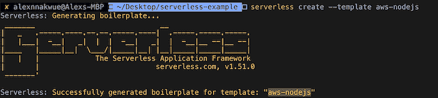
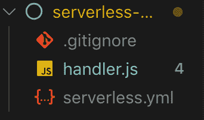
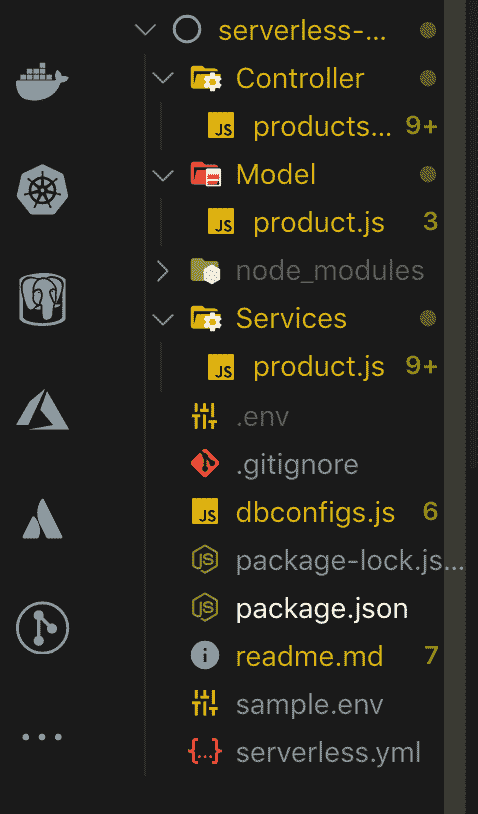
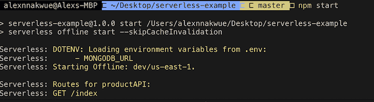
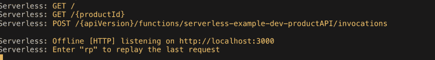
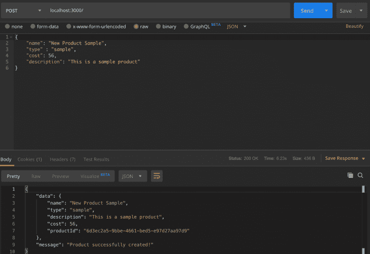

# 使用 Node.js 应用程序实现无服务器化

> 原文：<https://blog.logrocket.com/going-serverless-node-js-apps/>

***编者按:**这篇文章于 2021 年 8 月更新，包括了 Node 的最新版本和无服务器化的额外好处。*

大多数 web 应用程序运行在高维护的服务器上。如今，软件工程团队有专门的开发运维/基础设施工程师来帮助管理、供应和维护这些服务器。由于这种设置的相关挑战，推动替代解决方案成为必要。[无服务器堆栈](https://www.serverless.com/)在这方面大放异彩。

## 什么是无服务器堆栈？

作为一个框架，我们可以构建微服务和全栈应用，将任何规模的组织从大型服务器设置、维护和配置的配置过程中解放出来。

为你消耗的确切资源付费听起来如何？作为一个框架，无服务器的美妙之处在于，你只需为运行整个基础设施所需的资源支付等量的费用，而且开销和成本都大大降低了。

无服务器代码是由事件发生触发或运行的无状态功能，例如网络事件(HTTP 请求/响应循环)。对于无服务器应用程序，绑定到特定事件的函数上下文必须在这些事件完成之前运行。

这里的想法是，状态不会在多个或不同的函数调用或上下文中保持不变。此外，由函数调用触发的每一个新事件都在一个新的容器实例中处理，自动触发。

不要担心，当我们充实我们的应用程序时，我们将理解这一点。

## 无服务器的优势

对于无服务器应用程序，一段代码——通常是一个[λ函数](https://docs.aws.amazon.com/lambda/latest/dg/env_variables.html)——根据触发的事件类型来执行。当这种情况发生时，资源被动态分配以服务于这些事件。

在这种情况下，资源分配主要与传入或并发事件或请求的数量相关。这完全由云提供商(AWS、GCP、Azure 等)决定并随后处理/提供。)提供这些服务。

> 注意:无服务器框架是独立于供应商的，因为它支持大多数流行的云服务提供商。

无服务器应用程序的一些优势包括:

*   基于无服务器的应用程序根据处理服务请求所需的资源数量按需扩展，因此当流量突然激增时，不必担心崩溃
*   并发请求在新的容器实例中触发
*   我们会处理安全更新或补丁
*   其他所有技术细节都由相关的云提供商处理，因此，作为工程师，我们可以将更多精力放在核心应用维护和功能实现上
*   通过单一命令加快部署周期，`sls deploy`
*   无服务器为云基础设施提供了一种抽象
*   最重要的是，为消耗的确切资源付费，因为服务器管理是代表我们进行的

对于专业帐户的其他好处，我们可以在此处查看此参考资料[的链接。](https://www.serverless.com/pro/)

对于开发人员来说，无服务器框架允许他们更少地关注管理任务，而更多地关注为用户创造商业价值。对于组织来说，无服务器堆栈将使新的创新更快地进入市场。

由于无服务器应用程序的无状态特性，它们可能会遇到导致超时问题的冷启动。这是因为函数运行在具有不同或变化的上下文或环境的隔离容器中(被拒绝或被事件触发)。因此，应用程序最初可能会经历较低的响应时间、吞吐量和延迟。

冷启动类似于在原地长时间闲置后启动车辆。冷启动的问题与用于服务请求的网络的延迟、云服务提供商、执行或运行一段代码(即使是优化较差的代码)所需的功能包的大小等有关。

要解决这些问题，有办法让我们的机能保持温暖。例如，我们可以缓存事件调用，通常是通过让容器实例运行一段时间。此外，我们可以利用像 [serverless-webpack](https://www.npmjs.com/package/serverless-webpack) 这样的开源库来应对这些挑战。webpack 有助于捆绑和优化我们的功能，使它们变得轻量级。

在本教程中，我们将构建一个无服务器、基于微服务的应用程序。不过，在我们开始之前，让我们看一下我们需要在机器上安装的需求或工具。

## 使用 Node.js 实现无服务器的先决条件

为了轻松地学习本教程，我们应该:

*   在我们的机器上安装节点和 npm
*   具备使用命令行的基本知识

要开始使用无服务器开发，我们必须安装 CLI，以便运行特定于无服务器的命令。要安装它，我们可以运行:

```
 $ npm install serverless -g
```

在本教程的前面，我们解释了无服务器代码是如何作为无状态函数执行的。看看下面的例子:

```
const handlerFunction = (event, context, callback) => {
// handle business logic code here based on the kind of request
// handle callback here 
callback(error, result)
}
module.exports = handlerFunction;
```

让我们回顾一下上面的无服务器功能是如何执行的。`handlerFunction const`是我们的无服务器函数的名称。

`event`对象是我们函数的一个参数，它代表了关于触发我们函数并导致它开始执行一段代码的事件类型的信息。

`context`对象包含关于我们的函数将在其上执行的环境的信息(注意，这通常由云提供商代表我们来处理)。

最后，`callback`函数负责返回响应或错误对象，通常基于用户事件发出的请求。

请注意，在本教程中，还有其他重要的步骤和设置过程我们不打算介绍，因为它们不是我们的主要关注点。然而，当我们处理基于无服务器应用程序的部署时，了解它们是非常重要的。它们包括:

*   创建 AWS 账户——要创建一个免费账户，你可以点击这个[链接](https://aws.amazon.com)
*   为用户角色/策略设置身份和访问管理(IAM)
*   配置 AWS CLI
*   配置我们可能需要的其他 AWS 服务，比如数据库等等

正如我们在上面看到的，我们特别提到 AWS 作为我们的云服务提供商，这意味着我们将利用 [AWS lambda 函数](https://aws.amazon.com/lambda/)和 [API 网关](https://aws.amazon.com/api-gateway/)来创建我们的后端 API。

还要注意，对于上面的用例，我们同样可以使用 [Azure](https://azure.microsoft.com/en-us/services/functions/) 或 [GCP](https://cloud.google.com/functions/) 。

## 构建基于微服务的无服务器应用

正如我们前面提到的，让我们从建立本地发展开始。如果我们以前没有在全局范围内安装无服务器 CLI，我们现在可以这样做:

```
 $ npm i serverless -g
```

我们可以将无服务器作为独立的二进制文件安装在 windows 和 macOS/Linux 上。

无服务器帮助我们作为工程师处理困难的部分。我们所要做的就是用任何支持无服务器实现的语言编写架构良好的代码作为无状态函数。

现在开始，我们可以创建一个新目录，并将其命名为`serveless-example`:

```
 $ mkdir serverless-example
 $ cd serverless-example
```

我们还可以设置由相关云提供商提供的其他服务，如数据库、存储机制和其他必要的配置。在本教程中，我们将使用 MongoDB，因为我们可能已经很熟悉它了。

此外，我们将使用 [serverless-http](https://www.npmjs.com/package/serverless-http) 包来设置我们的 API。这个包充当中间件，处理 Node.js 应用程序和 API 网关细节之间的接口，因此我们的 API 看起来类似于 Express 应用程序。

继续，让我们引导一个无服务器的样板应用程序。我们可以通过在终端上运行以下简单命令来实现这一点:

```
serverless create --template aws-nodejs
```

我们将获得如下输出，模板文件如下所示:



Figure 1: Output after running the serverless create –template command.



Figure 2: Folder hierarchy after running the above command.

看看启动器生成的文件，`serverless.yml`文件用于配置我们的整个应用程序——我们打算添加的服务类型，以及如何为我们的应用程序配置到我们的路由和控制器的路径。`handler.js`文件包含将被部署到我们的云提供商以运行我们的代码逻辑的实际功能。

> **提示:**我们可以从命令行运行`serverless help`命令来查看可用命令的列表及其各自的描述。

继续，让我们开始充实我们的应用程序。运行`npm init`命令生成一个`package.json`文件，然后我们将开始添加其他依赖项。

我们将从安装[无服务器离线](https://www.npmjs.com/package/serverless-offline)插件开始。这个包在本地反映了 API 网关的环境，将帮助我们在工作时快速测试我们的应用程序。重要的是要确保它已安装并列在我们的无服务器配置文件的“插件”部分。

我们还应该继续安装`serverless-dotenv`插件，我们将使用它来设置我们的环境变量。

要将它们作为开发依赖项安装，我们可以运行:

```
npm i serverless-offline serverless-dotenv --save-dev
```

安装完成后，我们可以继续将它们添加到我们的`serverless.yml`文件中。

```
Plugins:
         - serverless-offline
         - serverless-dotenv-plugin

```

现在让我们安装应用程序所需的其他包。我们将安装 body-parser，Mongoose，Express，serverless-http 和 UUID。我们可以通过运行以下命令来实现:

```
npm i body-parser mongoose express uuid serverless-http --save
```

安装过程结束后，我们的`package.json`文件应该如下所示:

```
{
  "name": "serverless-example",
  "version": "1.0.0",
  "description": "Serverless Example for LogRocket Blog",
  "main": "handler.js",
  "scripts": {
    "start": "serverless offline start --skipCacheInvalidation",
    "deploy": "sls deploy -v"
  },
  "dependencies": {
    "body-parser": "^1.19.0",
    "express": "^4.17.1",
    "mongoose": "^5.7.9",
    "serverless-http": "^2.3.0",
    "uuid": "^3.3.3"
  },
  "author": "Alexander Nnakwue",
  "license": "MIT",
  "devDependencies": {
    "serverless-offline": "^5.12.0",
    "serverless-dotenv-plugin": "^2.1.1"
  }
}
```

现在让我们创建所有我们需要的文件夹和文件。对于基于微服务的应用程序，我们可以创建`Model`、`Controller`和`Services`目录。之后，我们可以在这些目录中创建各自的文件。请注意，我们将构建一个产品 API 来演示如何在 Node.js 中构建一个基于无服务器微服务的应用程序。

要创建这些文件夹，我们可以运行以下命令:

```
mkdir Controller Services Model
```

之后，我们可以浏览目录并创建各自的文件名为`products.js`的文件。之后，我们可以创建我们的`.env`文件来存储我们的环境变量。最后，我们可以继续创建数据库配置文件，该文件将包含到运行在我们机器上的本地 mongo 实例的数据库连接。在本教程中，我们使用 Mongoose 作为 ORM 来连接 MongoDB。

以下是我们完成后的文件夹结构:



Figure 3: Our current folder structure.

现在我们可以开始写一些代码了。在`[dbConfigs.js](https://github.com/firebase007/Serverless-example/blob/master/dbconfigs.js)`文件中，我们将展示如何在本地连接到数据库实例。

```
const mongoose = require('mongoose');
require("dotenv").config();
mongoose.Promise = global.Promise;

const connectToDatabase = async () => {
  let isConnected;
  if (isConnected) {
    console.log('using existing database connection');
    return Promise.resolve();
  }

  console.log('using new database connection');
  const database = await mongoose.connect(process.env.MONGODB_URL, {useNewUrlParser: true});
  isConnected = database.connections[0].readyState;
  // return isConnected;
};

module.exports = connectToDatabase;
```

正如我们前面提到的，我们使用 mongoose 在本地[连接到我们的 MongoDB](https://github.com/Automattic/mongoose#connecting-to-mongodb) 。此外，我们通过使用`dotenv`包来访问 MongoDB 连接字符串。为了看看我们的`MONGODB_URL`的格式，我们可以检查一下`[sample.env](https://github.com/firebase007/Serverless-example/blob/master/sample.env)`文件。

之后，我们可以继续在`Model`目录中设置我们的产品模式。让我们来看看`[product.js](https://github.com/firebase007/Serverless-example/blob/master/Model/product.js)`文件:

```
const mongoose = require("mongoose");
const ProductSchema = new mongoose.Schema (
  {
    name: {type: String},
    type: {type: String},
    cost: {type: Number},
    description: {type: String},
    productId: { type: String },
  },
  {timestamps: true}
); 

const ProductModel = mongoose.model("product", ProductSchema);
module.exports = ProductModel;
```

之后，我们可以继续在`Services`目录中创建`[product.js](https://github.com/firebase007/Serverless-example/blob/master/Services/product.js)`文件。这里的逻辑将包含我们的`Model`如何与数据库对话——基本上，它如何处理 CRUD 操作。让我们仔细看看该文件的内容:

```
const Product = require('../Model/product');

module.exports = {
async createProduct (product) {
  let result = await Product.create(product);
  if(result) {
    return {
      data: product,
      message: "Product successfully created!"
};
  }
return "Error creating new product"
},

async getAllProduct()  {
  let product = await Product.find();
  if(product)  return product;
  return "Error fetching products from db"
},

async getProductById(productId)  {
  let product = await Product.findOne(productId);
  if(product) return product;
  return "Error fetching product from db";
},
};
```

在上面的文件中，我们已经处理了与数据库的所有交互。我们调用了`[create](https://docs.mongodb.com/manual/reference/command/create/)`、`[find](https://docs.mongodb.com/manual/reference/method/db.collection.find/)`和`[findOne](https://docs.mongodb.com/manual/reference/method/db.collection.findOne)` MongoDB 方法来与之交互。

最后，我们可以进入最重要的部分:`Controller`文件，它处理我们应用程序的核心逻辑。它基本上处理我们的函数是如何被调用的。以下是`[Controller/product.js](https://github.com/firebase007/Serverless-example/blob/master/Controller/products.js)`文件的内容:

```
const serverless = require('serverless-http');
const express = require('express');
const app = express();
const bodyParser = require('body-parser');
const uuid = require('uuid/v4');

const dbConnection = require('../dbConfigs');
const ProductService = require('../Services/product');

app.use(bodyParser.json());
app.use(bodyParser.urlencoded({ extended: true }));

//  base url to test our API
app.get('/index', async (req, res) => {
   await res.send("<h3>Welcome to the Product API for LogRocket Blog serverless Example!!</h3>")
})

//  function for creating a new product
app.post('/', async (req, res) => {
  try {
   await dbConnection();
   const data  = req.body;
   const {name, type, description, cost} = data;
 if(!data) {
     return "Please pass all required fields!"
  }
   const dataToSave = {name,type,description,cost,productId:uuid()};
   let createProduct =  await ProductService.createProduct(dataToSave);
   if (createProduct) {
     return res.status(200).send(
       createProduct
    )
   }
  } catch (error) {
    //  handle errors here
    console.log(error, "error!!");
  }
})

//  function for getting all products
app.get('/', async (req, res) => {
try {
    await dbConnection();
    const allProducts = await ProductService.getAllProduct();
    if (allProducts) {
      return res.status(200).send({
        data: allProducts
      })
    }
  } catch (error) {
     //  handle errors here
     console.log(error, "error!!");
  }
})

//  function for getting a  product by Id
app.get('/:productId/', async (req, res) => {
  try {
    await dbConnection();
    const {productId} = req.params;
    const getProduct = await ProductService.getProductById({productId});
    if(getProduct) {
      return res.status(200).send({
        data: getProduct
      })
    }
  } catch (error) {
     //  handle errors here
     console.log(error, "error!!");
  }
});

module.exports.handler = serverless(app);
```

我们导入所有必要的依赖项，比如`serverless-http`包，它允许我们像普通的 Express 应用程序一样设置我们的无服务器应用程序。当然我们也导入了我们的快递包，开了一个快递 app。

之后，我们导入我们的数据库连接和我们的`Services`文件。这个文件处理创建一个新产品，从数据库中获取所有产品，并通过产品的`Id`获取产品。在最后一行中，我们可以看到如何用无服务器 http 包包装我们的 Express 应用程序。

最后，我们的`[serverless.yml](https://github.com/firebase007/Serverless-example/blob/master/serverless.yml)`文件在完成后应该是这样的:

```
# Welcome to Serverless!
service: serverless-example
app: product-api

provider:
  name: aws
  runtime: nodejs14.17.4
  stage: dev
  region: us-east-1

functions:
  productAPI:
    handler: Controller/products.handler
    events:
        - http:
            path: /index
            method: get
        - http:
            path: /
            method: post
        - http:
            path: /
            method: get
        - http:
            path: /{productId}
            method: get

plugins:
  - serverless-offline
  - serverless-dotenv-plugin
```

我们已经配置了我们的应用程序和所需的服务或插件，但请注意，在较大的应用程序中，我们可能需要考虑添加其他额外的服务。查看`functions`配置，我们可以看到我们如何能够获得对我们的控制器文件的引用，并且还设置了所有正确的路由路径。

> 注意:为了利用无服务器架构，我们可以设置每个路由由不同的 lambda 函数处理。在这种情况下，我们可以直观地看到每条路由被调用了多少次，每条路由特有的错误，它们运行所花费的时间，以及通过使这些路由更快我们可以节省多少。

现在我们已经完成了整个设置，让我们启动我们的应用程序并测试我们的 API。为此，我们可以在终端中运行`npm start`。当我们这样做时，我们得到以下输出:





Figure 4: Showing the output when we run the npm start command.

在这里，我们可以看到所有的路由和 env 变量都显示在我们的终端上。现在我们可以继续测试我们的 API 了。在本教程中，我们将使用 POSTMAN 来测试。让我们创造一个新产品。



顺便说一句，我们可以继续创造更多的产品，并尝试其他端点。上述教程的代码库可以在 GitHub 上找到[。](https://github.com/firebase007/Serverless-example)

## 结论

无服务器应用程序将会继续存在。我们所要做的就是用一个简单的命令来编写和部署我们的功能，并且它们是活动的。尽管本教程中没有涉及其他一些预配置选项，但我们已经能够利用无服务器技术成功构建一个最小的、可扩展的基于微服务的应用程序。

虽然还有其他构建无服务器应用程序的方法，但是我们这里的方法的优点是，我们可以快速地将旧的 express 应用程序转换为无服务器应用程序，因为我们非常熟悉我们项目的当前结构。

一定要试试这个设置，如果你有任何问题或反馈，请在下面的评论区告诉我。谢谢大家！

## 200 只显示器出现故障，生产中网络请求缓慢

部署基于节点的 web 应用程序或网站是容易的部分。确保您的节点实例继续为您的应用程序提供资源是事情变得更加困难的地方。如果您对确保对后端或第三方服务的请求成功感兴趣，

[try LogRocket](https://lp.logrocket.com/blg/node-signup)

.

[](https://lp.logrocket.com/blg/node-signup)[https://logrocket.com/signup/](https://lp.logrocket.com/blg/node-signup)

LogRocket 就像是网络和移动应用程序的 DVR，记录下用户与你的应用程序交互时发生的一切。您可以汇总并报告有问题的网络请求，以快速了解根本原因，而不是猜测问题发生的原因。

LogRocket 检测您的应用程序以记录基线性能计时，如页面加载时间、到达第一个字节的时间、慢速网络请求，还记录 Redux、NgRx 和 Vuex 操作/状态。

[Start monitoring for free](https://lp.logrocket.com/blg/node-signup)

.