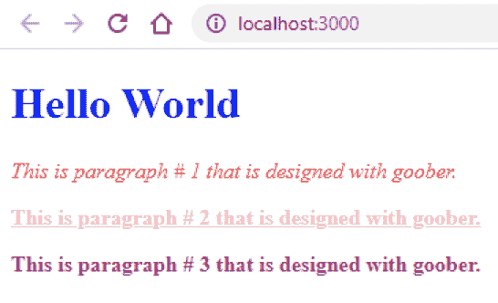

# Goober:一个轻量级的 CSS-in-JS 解决方案

> 原文：<https://blog.logrocket.com/goober-a-lightweight-css-in-js-solution/>

CSS 最初被创建来设计整个网页的样式。但是，随着时间的推移，网站的复杂性增加了，这使得管理设计变得非常困难。CSS 没有任何模块的概念，通过它我们可以把代码分成独立的块。

甚至 JavaScript 最初也没有模块。但是，随着时间的推移，web 开发已经发生了显著的变化。我们现在使用 React 和 Vue.js 等基于组件的库来设计 web 应用的前端。它强调了 CSS 需要一个类似的解决方案。但是，标准 CSS 不提供任何编程概念。所以，我们使用一个叫做 CSS-in-JS 的解决方案。

有一些流行的 CSS-in-JS 库，比如 [emotion](https://github.com/emotion-js/emotion) 和 [styled-components](https://github.com/styled-components/styled-components) 。但是，它们的主要问题是占用大约 10KB 到 20KB 的空间。正如你可能知道的，大量的文件会对页面加载时间产生很大的影响，从而影响网站在搜索引擎中的排名。因此，[克里斯蒂安·博特](https://cristianbote.com/)创造了一个轻量级的替代品，[古伯](https://github.com/cristianbote/goober)。它占用不到 1KB 的空间，这使它成为高性能站点的首选。

### goober 的特点

*   goober 吸引开发者的主要特征是它的大小。它的轻量级内存不到 1KB，这使它从其他 CSS-in-JS 解决方案中脱颖而出
*   它旨在与普通 JavaScript 及其前端库/框架一起工作，如 React、Vue.js、Angular、Svelte 等。
*   支持服务器端呈现
*   社区规模不断扩大，约有 24 名活跃贡献者
*   自定义 CSS 属性的不同方法。例如，通过向 CSS 标记的模板提供道具，或者通过将 CSS 与 JSON 一起使用。这里，需要注意的一件重要事情是，使用 JSON/Object 编写 CSS 代码可以显著减小包的大小
*   能够指定一个目标节点来附加样式标签
*   它允许我们将整个文档和特定部分的代码分开
*   轻松重用代码
*   goober 有一个叫做`keyframes`的方法，使我们能够跨组件重用动画
*   它有一个[巴别塔插件](https://www.npmjs.com/package/babel-plugin-transform-goober)，将类似`styled.tag`的代码转换成 goober 可以理解的格式，类似 styled(“标签”)
*   使用官方插件将 goober 和 Gatsby 集成在一起
*   能够解析 CSS 代码
*   goober 用伪选择器嵌套了规则。它甚至有嵌套的样式组件
*   它使我们能够扩展样式。例如，我们可以用另一组 CSS 规则覆盖，或者使用“as”prop
*   支持媒体查询(@media)和关键帧(@keyframes)
*   goober 的一个有趣特性是它带有智能(懒惰)客户端水合功能
*   有帮助的 [autoprefixer](https://www.npmjs.com/package/goober-autoprefixer) 确保 CSS 代码可以在所有的网络浏览器上工作。这种功能也称为供应商前缀。goober 背后的团队已经创建了一个单独的包来处理自动前缀

## 基准

自成立以来，goober 已经见证了来自开发者社区的重大调整。它鼓励 goober 背后的贡献者对其受欢迎的竞争对手进行性能比较。

于是，他们选择了[古柏](https://github.com/cristianbote/goober)、[情感](https://github.com/emotion-js/emotion)和[风格组件](https://github.com/styled-components/styled-components)。然后，[对每个库执行 85 个样本，找出完成任务平均需要多少时间](https://github.com/cristianbote/goober/blob/master/benchmarks/perf.js)。

[基准测试结果](https://github.com/cristianbote/goober#ssr-1)相当惊人:

*   处理的样式组件 **21，469 操作/秒**
*   goober 每秒处理了 **39，348 次运算**
*   情感处理速度**46504 次/秒**

显然，这里的赢家是情感库。但是，需要注意的一点是，emotion 和 styled-components 都有完善的 API，并且都有 200 多个贡献者。然而，goober 是 CSS-in-JS 库中的新竞争者。尽管如此，它在速度上击败了风格化组件，与情感库相比也不相上下。

## goober、emotion 和 styled-components 之间的比较

在为 goober 编写任何代码之前，让我们将其与它的流行竞争对手进行比较(即情感和风格化组件)。它会回答你的问题“我为什么要用 goober？”

| **特性** | 古伯 | **情感** | **样式化组件** |
| --- | --- | --- | --- |
| 标记的模板文字 | 是 | 是 | 是 |
| 作文 | 是 | 是 | 是 |
| 全局样式 | 是 | 是 | 是 |
| 主题支持 | 是 | 是 | 是 |
| 媒体查询 | 是 | 是 | 是 |
| 嵌套选择器 | 是 | 是 | 是 |
| 附加道具 | 是 | 是 | 是 |
| 服务器端渲染 | 是 | 是 | 是 |
| 平均每秒操作数 | 39,348 | 46,504 | 21,469 |
| 库大小 | 小于 1kB | 大约 11kB | 约 12kB |
| 贡献者人数 | 24 | 211 | 283 |

在上表中，您可以看到所有三个 CSS-in-JS 库都有共同的特性。但是，它们的实现方式决定了库的性能。情感比这两者都要快，但 goober 的小足迹可能会给它的用户带来优势。

## goober 入门

让我们使用脸书的 create-react-app 项目快速设置一个 React 应用程序。为此，请遵循以下步骤。

首先，在“my-app”文件夹中创建项目:

```
npx create-react-app my-app
```

然后在文件夹内移动:

```
cd my-app
```

现在，我们需要安装 goober 库:

```
npm install goober
```

此时，我们已经准备好编写代码来集成 goober 和 React。我们将从创建一个包含一个标题和三个段落的简单网页开始。

标题样式非常简单，因为我们直接以`<h1>`标签为目标。然而，对于段落，我们将一次性定义所有的公共代码。然后，对每个段落分别进行扩展。将以下代码粘贴到 src/index.js 中:

```
import React from "react";
import ReactDOM from "react-dom";
import { styled, setup } from "goober";

setup(React.createElement);

const Title = styled("h1")`
  font-weight: bold;
  color: #00f;
`;

const P = styled("p")`
  font-weight: bold;
`;

const P1 = styled(P)`
  color: #f00;
  font-style: italic;
  font-weight: normal;
`;

const P2 = styled(P)`
  color: pink;
  text-decoration: underline;
`;

const P3 = styled(P)`
  color: #bb0276;
`;

function App() {
  return (
    <div className="App">
      <Title>Hello World</Title>

      <P1>This is paragraph # 1 that is designed with goober.</P1>

      <P2>This is paragraph # 2 that is designed with goober.</P2>

      <P3>This is paragraph # 3 that is designed with goober.</P3>
    </div>
  );
}

const rootElement = document.getElementById("root");
ReactDOM.render(<App />, rootElement);
```

现在，您可以通过在控制台窗口中执行以下命令来测试此代码:

```
npm start
```

大概是这样的:


### 上述代码的解释

首先，我们导入了所需的包`React`、`ReactDOM`和`goober`，以使一切正常工作。然后我们必须在开始时调用一次`setup()`方法。需要注意的是，在使用`styled()`功能之前，必须调用`setup()`。

之后，我们将使用带标签的模板文字为标题和段落创建不同的 CSS 规则。

## 用道具定制风格

在 goober 中自定义样式有不同的方法。其中之一就是使用道具。基本上，我们使用 props 设置所需的值，并在所需的`styled()`函数的模板中访问它们。

例如:

```
const Title = styled('h1')`
  color: ${props => props.textColor};
  font-size: 3rem;
`;

function App() {
  return (
    <div className="App">
      <Title textColor="red">Hello World</Title>
    </div>
  );
}
```

## 上述代码的解释

在这里，您可以看到我们添加了名为`textColor`的道具，并为其赋值“red”。然后，我们使用 styled()函数的模板文本中的 props 将值赋给 CSS 的“color”属性。

## 全局样式

goober 打包了一个名为`glob`的函数。它用于指定将应用于整个文档的全局样式。这在网页设计中非常有用，不同的元素之间有很多相同的代码。

例如，glob 函数非常适合包含将在整个网页上使用的任何外部字体。大多数人甚至用它来编写“CSS 重置”规则。首先，我们需要从 goober 导入`glob`。像这样:

```
glob`
  body {
    margin: 0;
  }
`;
```

## 缺少 styled.tag

如果您曾经使用过样式组件库，那么您可能会熟悉它的`styled.tag`功能。它在使用 CSS-in-JS 解决方案的开发人员中非常流行。

goober 默认不支持这种格式。但是，贡献者和团队开发了一个[巴别塔插件](https://www.npmjs.com/package/babel-plugin-transform-goober)。这个插件用于将所有的 styled.tag 引用转换成 goober 可以理解的格式。

## 结论

goober 开发背后的主要思想是为流行的 CSS-in-JS 库(如 emotion 和 styled-components)引入一个轻量级的替代方案。因此，您应该在以下场景中使用它:

*   当您希望网页加载速度更快时
*   您的网站流量很大(即每月有数百万用户)。例如新闻网站、博客、SaaS 应用或社交媒体网络等。这是因为 goober 的大小不到 1 kB，所以与竞争对手相比，它不会消耗太多带宽

我没有发现 goober 的任何明显缺点，因为该团队在提供其竞争对手拥有的几乎所有功能方面确实做得很好。并且都使用非常小的代码库。

## 使用 [LogRocket](https://lp.logrocket.com/blg/signup) 消除传统错误报告的干扰

[](https://lp.logrocket.com/blg/signup)

[LogRocket](https://lp.logrocket.com/blg/signup) 是一个数字体验分析解决方案，它可以保护您免受数百个假阳性错误警报的影响，只针对几个真正重要的项目。LogRocket 会告诉您应用程序中实际影响用户的最具影响力的 bug 和 UX 问题。

然后，使用具有深层技术遥测的会话重放来确切地查看用户看到了什么以及是什么导致了问题，就像你在他们身后看一样。

LogRocket 自动聚合客户端错误、JS 异常、前端性能指标和用户交互。然后 LogRocket 使用机器学习来告诉你哪些问题正在影响大多数用户，并提供你需要修复它的上下文。

关注重要的 bug—[今天就试试 LogRocket】。](https://lp.logrocket.com/blg/signup-issue-free)