# 使用谷歌地图在 Flutter 应用程序中添加地图

> 原文：<https://blog.logrocket.com/google-maps-flutter/>

***编者按**:本帖更新于 2022 年 9 月 23 日。*

我无法想象没有谷歌地图的生活会是什么样子。我们用它来做任何事情，从寻找到目的地的方向，到搜索附近的餐馆或加油站，到放大和缩小地图来查看地球上任何位置的街景。

将谷歌地图添加到你的手机应用程序中可以为你的用户打开一个全新的世界——真的。在本教程中，我们将向您展示如何使用官方插件将谷歌地图集成到您的 Flutter 应用程序中。

以下是我们将要介绍的内容:

## 在 Google 云平台中创建项目

第一步是在谷歌开发者控制台创建一个项目。这是必需的，因为你需要 API 来将谷歌地图集成到你的应用中。

前往[谷歌开发者控制台](https://console.developers.google.com/)，点击已经选定的项目。

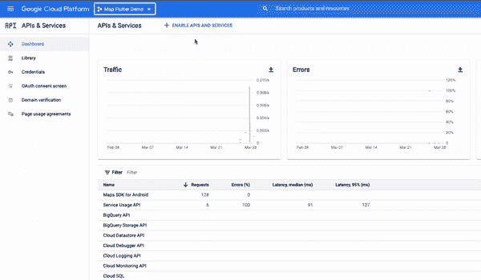

点击**新建项目**并输入详细信息。

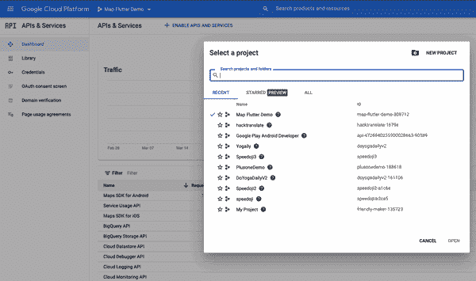

再次单击当前项目名称，您应该会在列表中看到您创建的新项目。

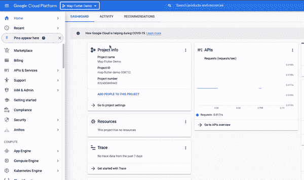

## 启用地图 API

一旦创建了项目，您必须为 Android 和 iOS 启用 Maps API SDK。

1.  点击左侧的**库**菜单
2.  搜索“地图 SDK”
3.  点击**iOS 版地图 SDK**然后点击**启用**
4.  点击**安卓地图 SDK**然后点击**启用**

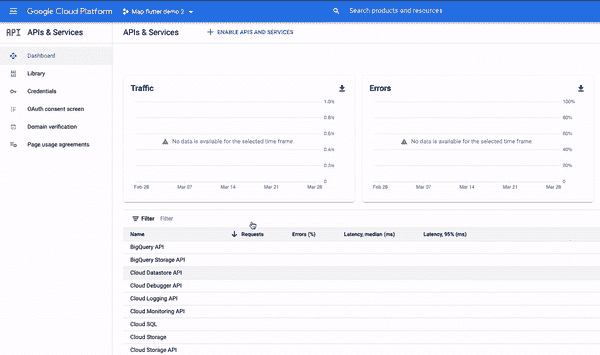

## 生成和限制 API 密钥

值得注意的是，对谷歌地图 API 的访问不是免费的。因此，您必须为它创建一组 API 密钥，并限制它的权限，以减少未经授权使用的机会。下面是生成密钥的方法。

1.  点击**凭证左侧的**菜单
2.  点击 **+创建凭证**按钮
3.  选择 **API 键**选项

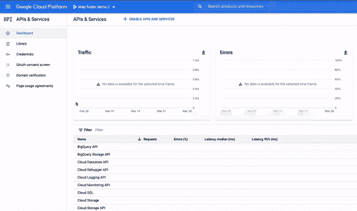

如果您的目标是两个平台，那么您应该获得两个 API 键，以便能够更好地跟踪它们。

创建 API 键之后，我强烈建议实现一些限制。例如，如果您愿意将 API 键仅用于地图，那么您应该只允许地图服务使用它。

有两种类型的限制:

1.  应用程序限制使您能够定义哪种类型的应用程序应该可以访问此密钥(即 Android 或 iOS)。您可以选择适当的选项，以确保您创建的密钥仅适用于该特定平台
2.  API 限制使您能够选择使用该键可以访问哪些服务。如果只是为了地图，您应该从列表中选择 Maps API

## 在 Flutter 应用程序(Android)中添加谷歌地图

为了能够通过您在上一节中创建的 API 密钥在应用程序中使用谷歌地图，您必须按照下面的说明进行复制和粘贴。

首先，打开您的 Flutter 项目并导航到这个位置的文件:`android/app/src/main/AndroidManifest.xml`。

接下来，粘贴以下代码:

```
<application ...
    <meta-data android:name="com.google.android.geo.API_KEY"
               android:value="YOUR KEY HERE"/>

```

用您创建的 API 键替换值`"YOUR KEY HERE"`。然后，添加位置权限。

现在,`AndroidManifest.xml`文件应该是这样的:

```
<manifest xmlns:android="http://schemas.android.com/apk/res/android"
    package="com.pinkesh.google_maps_flutter">

    <uses-permission android:name="android.permission.ACCESS_FINE_LOCATION"/>
    <uses-permission android:name="android.permission.ACCESS_COARSE_LOCATION" />

    <application
        android:label="google_maps_flutter"
        android:icon="@mipmap/ic_launcher">

       <!-- TODO: Add your API key here -->
       <meta-data android:name="com.google.android.geo.API_KEY"
           android:value="YOUR KEY HERE"/>

        <activity>...</activity>
    </application>
</manifest>

```

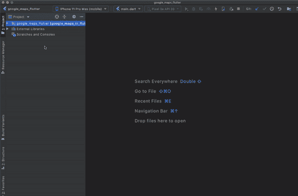

## 在 Flutter (iOS)中添加谷歌地图

在 iOS 设备的 Flutter 应用程序中运行谷歌地图的步骤与 Android 类似。

首先，在应用委托`ios/Runner/AppDelegate.swift`中指定您的 API 密钥

然后，在顶部编写`import` `GoogleMaps`语句，避免 iOS 构建问题。

该文件应该如下所示:

```
import UIKit
import Flutter
import GoogleMaps
@UIApplicationMain
@objc class AppDelegate: FlutterAppDelegate {
override func application(
_ application: UIApplication,
didFinishLaunchingWithOptions launchOptions: [UIApplication.LaunchOptionsKey: Any]?
) -> Bool {
GeneratedPluginRegistrant.register(with: self)
GMSServices.provideAPIKey("YOUR-KEY")
return super.application(application, didFinishLaunchingWithOptions: launchOptions)
}
}

```

接下来，打开 Xcode 并在`info.plist`文件中添加位置权限:

```
<key>NSLocationWhenInUseUsageDescription</key>
<string>The app needs location permission</string>

```

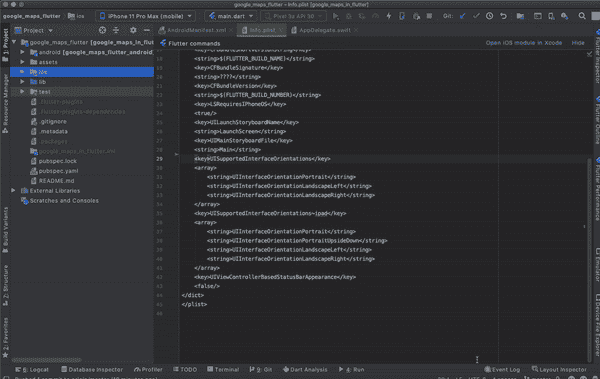

完成下面概述的步骤后，你将能够在 Flutter 应用程序的屏幕上看到谷歌地图。

首先，将`[google_maps_flutter](https://pub.dev/packages/google_maps_flutter)`插件添加到`pubspec.yaml`文件中。

```
dependencies:
  flutter:
    sdk: flutter
  cupertino_icons: 1.0.0
  google_maps_flutter: ^2.0.1

```

接下来，将`GoogleMap`小部件放入您的 Dart 文件中。

```
GoogleMap(
      initialCameraPosition: _kInitialPosition,
    ),

```

`GoogleMap`被赋予了一个`_kInitialPosition`，它保存了加载时地图上显示的默认位置。

```
static final LatLng _kMapCenter =
    LatLng(19.018255973653343, 72.84793849278007);

static final CameraPosition _kInitialPosition =
    CameraPosition(target: _kMapCenter, zoom: 11.0, tilt: 0, bearing: 0);

```

下面是显示地图的最少代码:

```
import 'package:flutter/material.dart';
import 'package:google_maps_flutter/google_maps_flutter.dart';

class SimpleMap extends StatefulWidget {
  @override
  _SimpleMapState createState() =&gt; _SimpleMapState();
}

class _SimpleMapState extends State&lt;SimpleMap&gt; {
  static final LatLng _kMapCenter =
      LatLng(19.018255973653343, 72.84793849278007);

  static final CameraPosition _kInitialPosition =
      CameraPosition(target: _kMapCenter, zoom: 11.0, tilt: 0, bearing: 0);

  @override
  Widget build(BuildContext context) {
    return Scaffold(
      appBar: AppBar(
        title: Text('Google Maps Demo'),
      ),
      body: GoogleMap(
        initialCameraPosition: _kInitialPosition,
      ),
    );
  }
}

```

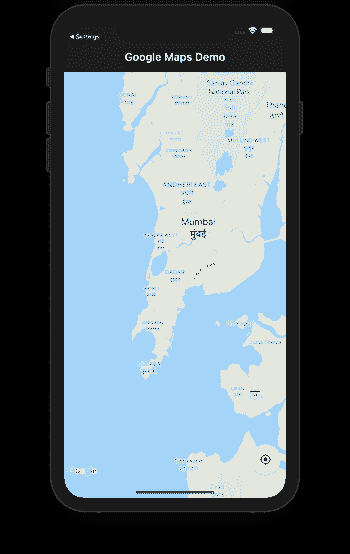

如果您没有正确查看地图和/或收到类似于`Cannot enable mylocation layer as location permissions are not granted`的错误，您可以尝试执行以下操作之一:

1.  确保您已经请求了访问设备位置的适当权限。需要将以下权限添加到清单文件:

    ```
    <uses-permission android:name="android.permission.ACCESS_FINE_LOCATION"/> <uses-permission android:name="android.permission.ACCESS_COARSE_LOCATION" />
    ```

2.  如果用户拒绝，编写再次请求权限的逻辑。如果他们选择了权限对话框上的“不再询问”选项，编写逻辑来通知他们没有位置权限应用程序将无法工作
3.  检查谷歌云控制台上是否启用了地图 SDK

## 颤振中的样式贴图

如果您正在开发一款特别时尚的产品，并且希望您的地图反映您品牌的外观和感觉，您可以自定义地图。

在本例中，我们将尝试按照以下步骤创建一个类似于优步的地图样式:

1.  转到[这个网站](https://mapstyle.withgoogle.com/)
2.  选择银色主题
3.  点击调整**地标**和**标签**
4.  恢复公园颜色
5.  点击**完成**
6.  点击**复制 JSON** 按钮

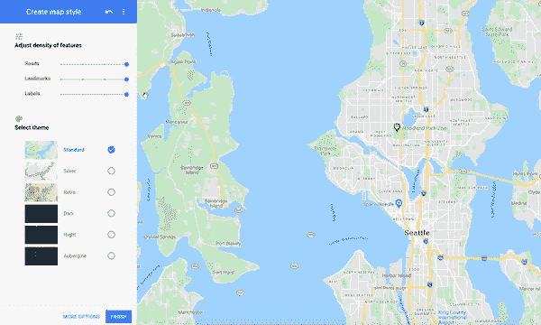

现在有了地图样式，你可以把它放在应用程序中，让插件使用它。

首先，在 app 的根目录下创建一个`assets`文件夹。

接下来，在其中创建一个`map_style.json`文件，并粘贴您复制的代码片段。

在`pubspec.yaml`文件中添加一个引用:

```
assets:
 - map_style.json

```

通过`GoogleMapController`将新样式载入地图。更新后的代码应该如下所示:

```
import 'package:flutter/material.dart';
import 'package:google_maps_flutter/google_maps_flutter.dart';

class SimpleMap extends StatefulWidget {
  @override
  _SimpleMapState createState() =&gt; _SimpleMapState();
}

class _SimpleMapState extends State&lt;SimpleMap&gt; {
  static final LatLng _kMapCenter =
      LatLng(19.018255973653343, 72.84793849278007);

  static final CameraPosition _kInitialPosition =
      CameraPosition(target: _kMapCenter, zoom: 11.0, tilt: 0, bearing: 0);

  GoogleMapController _controller;

  Future&lt;void&gt; onMapCreated(GoogleMapController controller) async {
    _controller = controller;
    String value = await DefaultAssetBundle.of(context)
        .loadString('assets/map_style.json');
    _controller.setMapStyle(value);
  }

  @override
  Widget build(BuildContext context) {
    return Scaffold(
      appBar: AppBar(
        title: Text('Google Maps Demo'),
      ),
      body: GoogleMap(
        initialCameraPosition: _kInitialPosition,
        onMapCreated: onMapCreated,
      ),
    );
  }
}
onMapCreated is a callback that’s called when the map is ready to use. It provides the GoogleMapController, which is really helpful for performing certain actions on the map. For this example, we used it to set the map style via the _controller.setMapStyle(value); method.

```

以下是输出:


`GoogleMap`小部件给你很大的灵活性来修改地图。让我们探索一些方法来做到这一点。

### 更改地图类型

有各种类型的地图可用，包括卫星，地形和混合。您可以简单地将所需的类型设置为小部件的`mapType`属性:

```
GoogleMap(
  initialCameraPosition: _kInitialPosition,
  onMapCreated: onMapCreated,
  mapType: MapType.satellite,
);

```

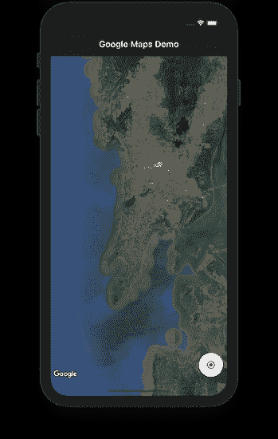

### 启用我的位置按钮

默认情况下，地图将显示小部件的`initialCameraPosition`参数中提供的位置(或者您以编程方式提供给地图的任何其他位置)。如果用户想回到他们的位置，设置`myLocationEnabled`为`true`就可以了。

当设备静止时，屏幕上会出现一个小蓝点，如果设备在移动，屏幕上会出现一个人字形。

```
GoogleMap(
  initialCameraPosition: _kInitialPosition,
  onMapCreated: onMapCreated,
  myLocationEnabled: true,
);

```

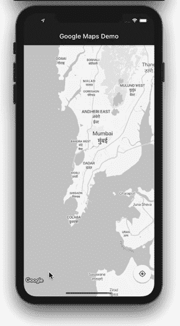

人们经常想知道“我如何在 Flutter 中更改我在谷歌地图上的位置？”这个问题的答案是，你不能在 Flutter 中更改你在谷歌地图上的位置。您的位置由您在地球上的地理位置通过 GPS 计算确定，除非您的设备移动到新的位置，否则无法修改。

如果您想更改“我的位置”按钮的位置，您可以创建一个浮动操作按钮(FAB)来替换股票“我的位置”按钮，并将其放置在屏幕上您想要的任何位置。您只需要编写当单击按钮时，将地图的摄像机对准您的位置的逻辑。逻辑可能是这样的:

```
void _currentLocation() async {

    // Create a map controller
    final GoogleMapController controller = await _controller.future;
    LocationData currentLocation;
    var location = new Location();
    try {
        // Find and store your location in a variable
        currentLocation = await location.getLocation();
    } on Exception {
        currentLocation = null;
    }

    // Move the map camera to the found location using the controller
    controller.animateCamera(CameraUpdate.newCameraPosition(
        CameraPosition(
            bearing: 0,
            target: LatLng(currentLocation.latitude, currentLocation.longitude),
            zoom: 17.0,
        ),
    ));
}

```

### 在地图上创建标记

标记是显示特定位置的好方法。

要查看如何在地图上创建标记，请参考以下代码:

```
Set<Marker> _createMarker() {
  return {
    Marker(
        markerId: MarkerId("marker_1"),
        position: _kMapCenter,
        infoWindow: InfoWindow(title: 'Marker 1'),
        rotation: 90),
    Marker(
      markerId: MarkerId("marker_2"),
      position: LatLng(18.997962200185533, 72.8379758747611),
    ),
  };
}

```

集合中的每个标记都需要一些参数，这些参数有助于传递信息。第一个标记被赋予了`infowindow`，它显示了它的 ID(你可以在这里写任何东西来描述这个地方)和一个 90 度的`rotation`。当你在同一个地方有多个标记时,`rotation`参数非常有用——例如，在一个塔上有多个蜂窝天线。

```
GoogleMap(
  initialCameraPosition: _kInitialPosition,
  onMapCreated: onMapCreated,
  markers: _createMarker(),
);

```

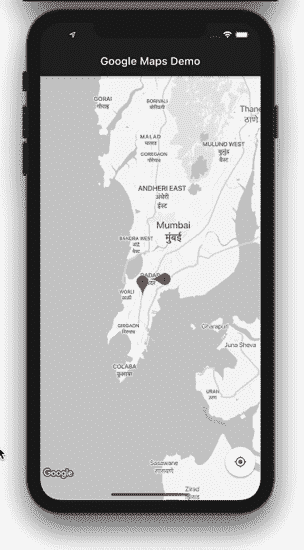

### 启用流量模式

只需将`trafficEnabled`的值设置为`true`即可开启流量模式。

```
GoogleMap(
  initialCameraPosition: _kInitialPosition,
  onMapCreated: onMapCreated,
  trafficEnabled: true,
);

```

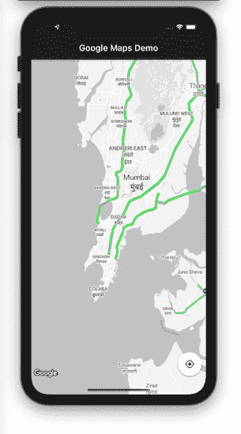

## 显示地图列表

假设您想要通过显示标记来显示地图列表，以帮助用户定位卫星办公室、其他医院等。

首先，创建一个 [`GridView`](https://api.flutter.dev/flutter/widgets/GridView-class.html) 来显示 Google Maps 小部件列表。可以设置`initialCameraPosition` *。*将`liteModeEnabled`设置为`true`。这会创建一个您无法与之互动的地图图像:

```
GridView.count(
  crossAxisCount: 2,
  crossAxisSpacing: 8,
  mainAxisSpacing: 8,
  // Generate 100 widgets that display their index in the List.
  children: List.generate(10, (index) {
    return Center(
      child: GoogleMap(
        initialCameraPosition: _kInitialPosition,
        markers: _createMarker(),
        liteModeEnabled: true,
      ),
    );
  }),
)

```

创建一组标记，并确保为其分配了不同的位置。

```
Set<Marker> _createMarker() {
  return {
    Marker(
        markerId: MarkerId("marker_1"),
        position: _kMapCenter),
    Marker(
      markerId: MarkerId("marker_2"),
      position: LatLng(18.997962200185533, 72.8379758747611),
    ),
  };
}

```

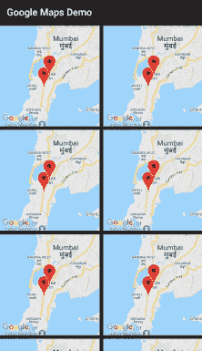

在撰写本文时，该功能仅适用于 Android。

## 拍摄您所在位置的快照

能够拍摄你所在位置的快照，并快速与他人分享你的旅程，这是一个非常酷的功能。

首先，在你的应用程序中创建一个按钮。只需点击一个按钮，`_controller.takeSnapshot()`方法就会为您完成剩下的魔术。

```
FloatingActionButton(
  onPressed: () async {
    final imageBytes = await _controller.takeSnapshot();
    setState(() {
      _imageBytes = imageBytes;
    });
  },
  child: Icon(Icons.fullscreen),
)

```

接下来，创建一个小部件来显示快照:

```
Container(
  decoration: BoxDecoration(color: Colors.blueGrey[50]),
  height: 150,
  width: 120,
  child: _imageBytes != null ? Image.memory(_imageBytes) : null,
)

```

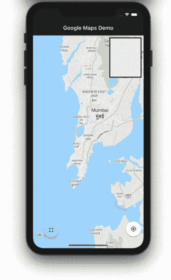

就是这样！完整代码可以在 [GitHub](https://github.com/pinkeshdarji/google_maps_flutter) 上找到。

## 结论

在本教程中，我们展示了如何将谷歌地图集成到您的 Flutter 应用程序中，并探索了一些定制地图外观的方法。我们介绍了如何在 Flutter 应用程序中启用 Maps API、生成和限制 API 键，以及设置、样式和修改地图。

将谷歌地图功能添加到您的应用程序中，开启了一个无限可能的世界。有了这些基础知识，您就可以开始在您的 Flutter 应用程序中构建基于位置的功能和交互式地图了。

## 使用 [LogRocket](https://lp.logrocket.com/blg/signup) 消除传统错误报告的干扰

[](https://lp.logrocket.com/blg/signup)

[LogRocket](https://lp.logrocket.com/blg/signup) 是一个数字体验分析解决方案，它可以保护您免受数百个假阳性错误警报的影响，只针对几个真正重要的项目。LogRocket 会告诉您应用程序中实际影响用户的最具影响力的 bug 和 UX 问题。

然后，使用具有深层技术遥测的会话重放来确切地查看用户看到了什么以及是什么导致了问题，就像你在他们身后看一样。

LogRocket 自动聚合客户端错误、JS 异常、前端性能指标和用户交互。然后 LogRocket 使用机器学习来告诉你哪些问题正在影响大多数用户，并提供你需要修复它的上下文。

关注重要的 bug—[今天就试试 LogRocket】。](https://lp.logrocket.com/blg/signup-issue-free)

## 使用 [LogRocket](https://lp.logrocket.com/blg/signup) 消除传统错误报告的干扰

[](https://lp.logrocket.com/blg/signup)

[LogRocket](https://lp.logrocket.com/blg/signup) 是一个数字体验分析解决方案，它可以保护您免受数百个假阳性错误警报的影响，只针对几个真正重要的项目。LogRocket 会告诉您应用程序中实际影响用户的最具影响力的 bug 和 UX 问题。

然后，使用具有深层技术遥测的会话重放来确切地查看用户看到了什么以及是什么导致了问题，就像你在他们身后看一样。

LogRocket 自动聚合客户端错误、JS 异常、前端性能指标和用户交互。然后 LogRocket 使用机器学习来告诉你哪些问题正在影响大多数用户，并提供你需要修复它的上下文。

关注重要的 bug—[今天就试试 LogRocket】。](https://lp.logrocket.com/blg/signup-issue-free)