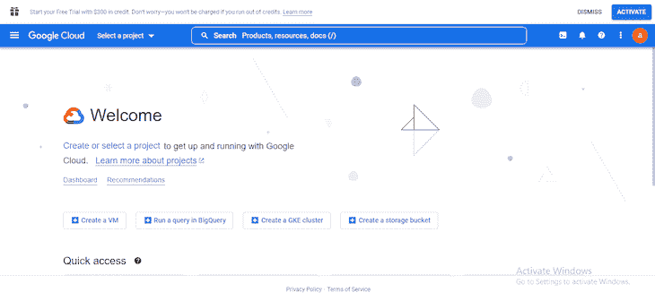
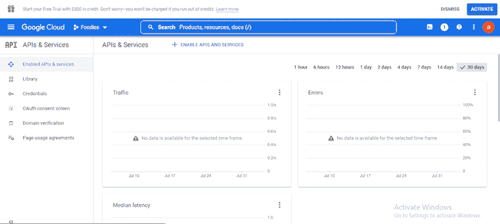
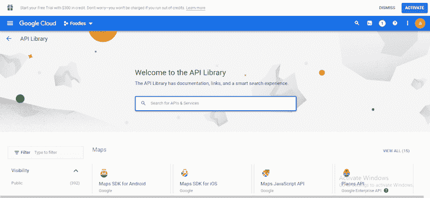
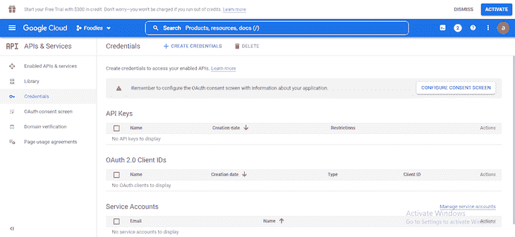
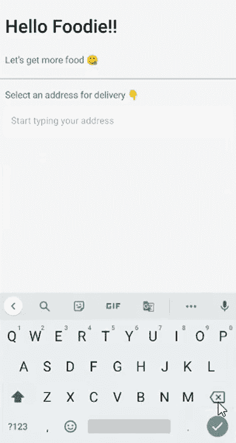
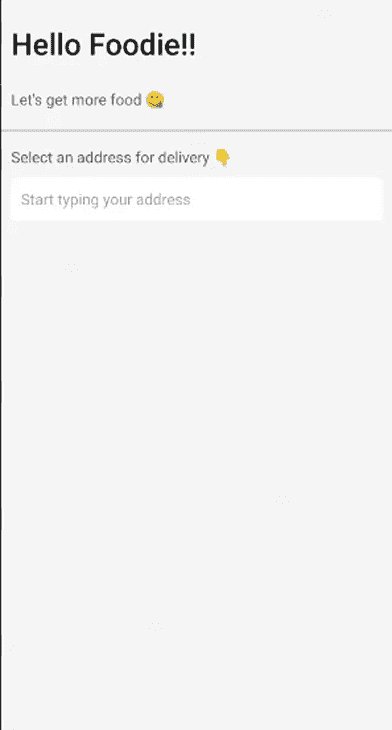
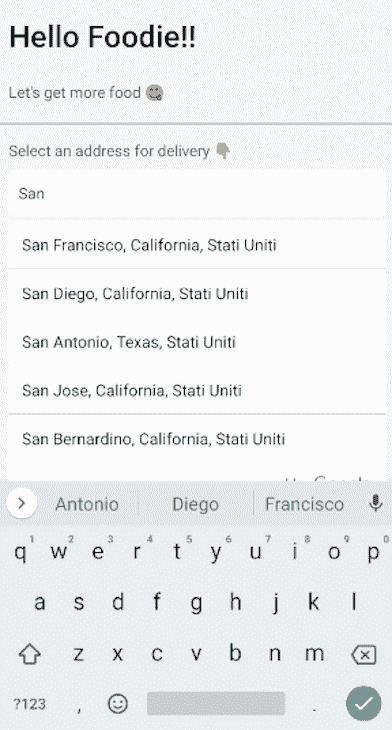

# 在 React Native 中使用 Google Places 自动完成组件

> 原文：<https://blog.logrocket.com/google-places-autocomplete-components-react-native/>

谷歌为访问其地图服务提供了大量 API，其中之一是 [Places API](https://developers.google.com/maps/documentation/places/web-service/overview) 。Places API 主要为您提供使用 HTTP 请求的位置信息。你可以得到你需要的关于当地地址、城镇、城市、地区、餐馆或任何其他地方的所有信息，包括它的坐标。

Places API 包含了大量的特性，比如返回与搜索字符串相关的地点列表，提供一个地点的照片等等。它最常用和最需要的特性之一是自动完成服务。

使用 autocomplete 服务，Google 可以通过 API 自动填写被搜索地点的地址或名称。因此，例如，当您的用户键入他们想要点餐的餐馆名称时，您可以根据他们键入的内容向他们提供建议。

在本文中，我们将了解如何在 React Native 中使用自动完成服务。然而，我们不必直接使用位置 API，因为[一个名为](https://www.npmjs.com/package/react-native-google-places-autocomplete) `[react-native-google-places-autocomplete](https://www.npmjs.com/package/react-native-google-places-autocomplete)`的 React 本地包可以为我们处理这些。

因此，让我们看看如何在 React 原生项目中使用`react-native-google-places-autocomplete`包，以及它的一些关键功能，以及如何定制它以适应我们的项目。我们将涵盖:

## 设置 Google Places API

`react-native-google-places-autocomplete`包只是一个访问位置 API 的媒介。如果不首先设置一个 Google Cloud 项目来使用 Places API，它将无法工作。所以，让我来告诉你如何用四个步骤来做到这一点:

1.  创建项目
2.  启用计费
3.  启用必需的 API
4.  创建 API 密钥

让我们从创建一个谷歌云项目开始。

### 创建谷歌云项目

没有谷歌云项目，我们无法使用任何谷歌 API 服务。前往[谷歌云控制台](https://console.cloud.google.com)并注册，如果你还没有。



您将进入上图所示的页面。如果您以前没有创建过项目，请点按“创建或选择项目”按钮。会立即弹出一个模态。点击右上角的“新建项目”。

将加载一个新页面，要求您输入项目的名称和位置——“位置”意味着项目应该属于哪个组织。您可以将位置保留为“无组织”,只需输入项目的名称。

最后，单击“创建”来创建项目。然后，您可以选择项目或访问[项目页面](https://console.cloud.google.com/cloud-resource-manager)查看您的项目列表。

### 为 Google Places API 启用计费

Google Places API 不是永远免费的。谷歌使用的是[现收现付定价模式](https://developers.google.com/maps/documentation/places/web-service/usage-and-billing)。但是每个月你的前两个请求都是免费的。

谷歌强制要求你在使用 Places API 之前[为你的项目启用计费](https://console.cloud.google.com/projectselector2/billing/enable)。

前往[计费页面](https://console.cloud.google.com/projectselector2/billing/enable)，选择您想要启用计费的项目。将弹出一个模式，如果您还没有，只需点击“创建计费帐户”。

按照谷歌官方指南创建一个付费账户。

### 启用必需的 API

您只需要启用 Places API 和 Geocoding API 来使用`react-native-google-places-autocomplete`包。让我们接下来做那件事。

打开您的[项目仪表板](https://console.cloud.google.com/apis/dashboard)，它应该是这样的:



如果它看起来不像上面的图片，确保侧边栏的“启用 APIs &服务”被选中。接下来点击导航栏上的“启用 API 和服务”。它会将您带到 API 库页面:



搜索“Places API”并单击结果。下一页包含关于 Places API 的信息，包括价格信息和为您的项目启用 API 的按钮。点击“启用”按钮，就可以了。

如果您尚未为项目启用计费，当您尝试启用地点 API 时，系统会提示您这样做。

之后，返回到 [API 库页面](https://console.cloud.google.com/apis/library)并启用地理编码 API。

### 创建 API 密钥

这是我们使用该软件包之前必须采取的最后一步。转到您的[API 仪表板](https://console.cloud.google.com/apis/dashboard)。在左侧栏，选择“凭证”选项。



点击顶部导航栏的“创建凭证”，然后选择“API 密钥”这将为您的项目创建一个 API 密钥。使用这个 API 密钥，您只能访问您已经启用的 API。复制 API 密钥并将其存储在安全的地方。

您可能会注意到 API 键旁边有一个警告图标。重要的是你要注意它。谷歌建议你[将你的 API 密匙](https://cloud.google.com/api-keys/docs/add-restrictions-api-keys)仅限于你的应用程序。否则，如果你不能保密你的 API 密匙，这个 API 密匙对其他任何应用程序或网站都是无用的。

这主要用于生产目的。因为我们只打算测试`react-native-google-places-autocomplete`包的特性，所以没有必要限制这个键。

## 使用`react-native-google-places-autocomplete`

npm 包提供了使用 Google Places 自动完成服务的可定制组件。

它还使用 [Places Details](https://developers.google.com/maps/documentation/places/web-service/details) 服务来提供关于搜索地点的更多细节，包括用户评论和坐标，以及用于将可读地址转换为几何坐标的[地理编码 API](https://developers.google.com/maps/documentation/geocoding/overview) ，反之亦然。

要跟随本文并查看这个包的工作情况，请设置一个 React 原生项目。

### 设置 React 本地项目

对于我们的 React Native 项目示例，我们将为美食家创建一个查找就餐地点的应用程序。我们不会经历构建应用程序的每一步，因为本文的主要焦点是展示一些如何使用`react-native-google-places-autocomplete`包的例子。

前往您的终端，运行以下命令:

```
npx react-native init Foodies
```

如果在使用上面的命令创建 React 本地项目时遇到了`[TypeError: cli.init is not a function](https://stackoverflow.com/questions/72768245/typeerror-cli-init-is-not-a-function-for-react-native)`问题，卸载全局`react-native-cli`和`react-native`。现在只重装全局`react-native`。

现在让我们安装依赖项。我们现在只需要一个依赖项:包`react-native-google-places-autocomplete`。

```
npm install react-native-google-places-autocomplete
```

该包提供了一个组件，其中包含了我们在应用程序中使用和定制 Places API 所需的一切。让我们看一个基本的例子:

```
import {GooglePlacesAutocomplete} from 'react-native-google-places-autocomplete';
import {apiKey} from './config'; // your google cloud api key

const App = () => {
  return (
    <SafeAreaView>
      <GooglePlacesAutocomplete
        placeholder="Type a place"
        query={{key: apiKey}}
      />
    </SafeAreaView>
  );
};
```

让我们回顾一下上面例子中的一些重要部分。

`GooglePlacesAutocomplete`是用户输入地名的文本输入表单。当用户输入时，一个基于用户输入内容的建议地点的模型将作为下拉菜单出现。

查询属性是唯一必需的属性；没有它的 key 属性，autocomplete 包将不能使用 Places API。您需要导入您的 API 密钥并在这里使用它。此外，不要忘记在您的云项目上启用计费，以使用地点和地理编码 API。

将敏感信息存储在 React 原生项目中并不安全。让我们讨论一下如何保护您的 API 密钥。

### 保护您的 API 密钥

非常重要的一点是，不要将 API 键存储在 React 原生项目中。任何拥有你的应用捆绑包的人都可以访问你的 API 密匙，所以这不是一个安全的存储方法。

您可以通过使用服务器存储您的 API 密钥来解决这个问题。这样，当用户打开应用程序时，您只需向服务器请求获取 API 密钥。

* * *

### 更多来自 LogRocket 的精彩文章:

* * *

还有一些措施来保护服务器中的 API 密钥。 [Brad Traversy 关于保护 API 密钥的视频](https://www.youtube.com/watch?v=ZGymN8aFsv4&t=1384s)演示了如何做到这一点。

### 处理来自 Google Places API 的响应

来自 Google Places API 的第一组响应是自动完成建议。`react-native-google-places-autocomplete`包处理这组响应，所以我们不必担心它们。

但是，用户事件还会触发其他响应。例如，当按下建议的地址时，用户的输入不会返回任何更多的建议(即未找到地点)。这些回复必须由我们来处理。

同样，autocomplete 包通过提供事件道具来处理这些响应，为我们完成了困难的部分。让我们来看一个例子:

```
const App = () => {
  return (
    <SafeAreaView>
      <GooglePlacesAutocomplete
        placeholder="Type a place"
        query={{key: apiKey}}
        fetchDetails={true}
        onPress={(data, details = null) => console.log(data, details)}
        onFail={error => console.log(error)}
        onNotFound={() => console.log('no results')}
      />
    </SafeAreaView>
  );
};
```

这些引入的新道具——`onPress`、`onFail`和`onNotFound`——至关重要。当像这样使用 Places API 的包时，您可以使用这些道具来回答如下问题:

*   当用户点击一个建议时会发生什么？
*   当搜索字符串没有结果时会发生什么？
*   当从 API 获取数据失败时会发生什么？

autocomplete 包提供了用 props 回答这些问题的方法。由我们来用自定义函数处理响应。好吧，让我们一个接一个地解决这些问题。

#### 当用户点击一个建议时会发生什么？

当用户点击一个建议时，关于所选地点的信息将作为参数传入函数，然后传入`onPress` prop。上例中的两个参数——`data`和`details`——都构成了关于地点的信息。

`data`参数返回关于地点的基本信息对象，如描述或地址名称、国家、城市和其他细节。

如果`fetchDetails`属性是`false`，那么`details`参数将返回与数据对象相同的对象。

默认情况下，`fetchDetails`属性设置为`false`，但是当设置为`true`时，`details`参数给出了包括几何图形在内的更详细的位置信息。谷歌在他们的文档中提供了一个[完整地点细节回复](https://developers.google.com/maps/documentation/places/web-service/details#PlaceDetailsResponses)的例子。

#### 当搜索字符串没有结果时会发生什么？

很有可能用户有时会键入一个搜索字符串，但没有收到任何结果。使用`onNotFound`道具，我们可以在整个项目中创造出没有结果的意识。然后，在您的应用程序中，您可以根据这个响应来处理它应该如何显示，或者应该或不应该发生什么。

例如，我们可以禁用所有其他功能(比如继续订购食物的下一步)并显示一条自定义消息，指示没有结果。

或者，如果您只想提醒用户，而不想对应用程序中其他地方缺少结果做任何特殊处理，您可以使用`[FlatList listEmptyComponent](https://reactnative.dev/docs/flatlist#listemptycomponent)` prop 在没有找到结果时提醒用户。

您可以通过传入组件或元素来实现这一点，如下所示:

```
const App = () => {
  return (
    <SafeAreaView>
      <GooglePlacesAutocomplete
        placeholder="Type a place"
        onPress={(data, details = null) => console.log(data, details)}
        query={{key: apiKey}}
        fetchDetails={true}
        onFail={error => console.log(error)}
        onNotFound={() => console.log('no results')}
        listEmptyComponent={() => (
          <View style={{flex: 1}}>
            <Text>No results were found</Text>
          </View>
        )}
      />
    </SafeAreaView>
  );
};
```

由于上面的代码，如果用户输入没有结果的内容，文本“No results found”将显示在搜索栏下。



#### 当从 API 获取数据失败时会发生什么？

从 Places API 获取数据有时也很可能导致错误。例如，Places API 可能会抛出自己的错误，因为您的 Google Cloud 项目或账单地址存在配置问题。

无论是使用地点 API 还是地理编码 API，当 API 出错时,`onFail`属性都会返回一个错误。

您可能会遇到的一个非常常见的问题是，当您的项目没有启用计费时，或者在进行必要的计费时出现其他问题。

### 使用预定义的地点进行搜索

您可以使用用户最喜欢或最常去的地方作为`GooglePlacesAutocomplete`组件的预定义地点。

预定义的地点包含一个带有该地点信息的地址。您可以选择向用户显示您想要的地址或任何名称。

如果使用预定义的位置，当用户聚焦于文本输入来搜索地址时，预定义的选项将作为自动完成建议弹出。

下面介绍如何将`Dominos Pizza`和`Chicken Republic`两个位置设置为`favorite`类型的预定义位置:

```
const App = () => {
  return (
    <SafeAreaView>
      <GooglePlacesAutocomplete
        placeholder="Type a place"
        onPress={(data, details = null) => console.log(data, details)}
        query={{key: apiKey}}
        fetchDetails={true}
        onFail={error => console.log(error)}
        onNotFound={() => console.log('no results')}
        predefinedPlaces={[
          {
            type: 'favorite',
            description: 'Dominos Pizza',
            geometry: {location: {lat: 48.8152937, lng: 2.4597668}},
          },
          {
            type: 'favorite',
            description: 'Chicken Republic',
            geometry: {location: {lat: 48.8496818, lng: 2.2940881}},
          },
        ]}
      />
    </SafeAreaView>
  );
};
```

在上面的代码中，描述是将向用户显示的名称。当选择任何预定义选项时，您为该地点创建的对象将返回该地点的`data`和`details`参数。

对象不仅限于类型、描述和几何图形。你可以添加更多关于这个地方的信息。

由于上面的代码，您应该看到这些`favorite`预定义的位置甚至在用户开始输入之前就作为建议出现了。请参见下面的结果:



### 使用自定义文本输入组件

默认情况下，`react-native-google-places-autocomplete`包使用 [React Native 的](https://blog.logrocket.com/complete-guide-textinput-react-native/) `[TextInput](https://blog.logrocket.com/complete-guide-textinput-react-native/)`组件进行文本输入。然而，您不会被包的选择所束缚

有了`textInputProps`道具，你可以使用自己选择的任何定制组件，比如来自[的`Input`React Native Elements](https://blog.logrocket.com/using-react-native-elements-a-cross-platform-ui-toolkit/)。

```
import {GooglePlacesAutocomplete} from 'react-native-google-places-autocomplete';
import {apiKey} from './config'; // your google cloud api key
import {Input} from '@rneui/themed';

const App = () => {
  return (
    <SafeAreaView>
      <GooglePlacesAutocomplete
        placeholder="Type a place"
        onPress={(data, details = null) => console.log(data, details)}
        query={{key: apiKey}}
        fetchDetails={true}
        onFail={error => console.log(error)}
        onNotFound={() => console.log('no results')}
        textInputProps={{
          InputComp: Input,
        }}
      />
    </SafeAreaView>
  );
};
```

`textInputProps`是文本输入组件的所有道具的一个对象。所以如果你用的是 React Native 的`TextInput`，你可以在这里使用它特有的道具。例如:

```
const App = () => {
  return (
    <SafeAreaView>
      <GooglePlacesAutocomplete
        placeholder="Type a place"
        onPress={(data, details = null) => console.log(data, details)}
        query={{key: apiKey}}
        fetchDetails={true}
        onFail={error => console.log(error)}
        onNotFound={() => console.log('no results')}
        textInputProps={{
          autoFocus: true,
          blurOnSubmit: false,
        }}
      />
    </SafeAreaView>
  );
};;
```

上面在 textInputProps 中使用的道具都是针对 [React Native 的](https://blog.logrocket.com/complete-guide-textinput-react-native/) `[TextInput](https://blog.logrocket.com/complete-guide-textinput-react-native/)`的。当您使用第三方库时，也会发生同样的事情。

### 设计您的`GooglePlacesAutocomplete`组件

`GooglePlacesAutocomplete`组件的[默认样式](https://github.com/FaridSafi/react-native-google-places-autocomplete#default-styles)样式良好，所以它们可能对你的应用足够了。

不过，您可以添加默认样式，使它们适合您的应用程序。您还可以完全摆脱默认样式，从头开始完全自定义样式。

`GooglePlacesAutocomplete`组件有一个 styles 属性，用于设置所有组件的样式，从文本输入到下拉列表。让我们来看看它的实际应用:

```
const App = () => {
  return (
    <SafeAreaView>
      <GooglePlacesAutocomplete
        placeholder="Type a place"
        onPress={(data, details = null) => console.log(data, details)}
        query={{key: apiKey}}
        fetchDetails={true}
        onFail={error => console.log(error)}
        onNotFound={() => console.log('no results')}
        styles={{
          container: {
            flex: 0,
          },
          description: {
            color: '#000',
            fontSize: 16,
          },
          predefinedPlacesDescription: {
            color: '#3caf50',
          },
        }}
      />
    </SafeAreaView>
  );
};
```

`styles` prop 是一个使用 React Native 的标准样式属性和值的对象。使用`styles`属性，您可以对组成`GooglePlacesAutocomplete`组件的不同部分进行样式化。

这些部分——比如文本输入、下拉容器、每个下拉元素等等——是`GooglePlacesAutocomplete`组件的子元素。例如，文本输入的样式如下所示:

```
styles={
  textInput: {
   borderColor: 'orange',
   fontSize: 20
 }
}
```

您应该尝试根据每个部分或属性的类型来设计它们的样式。例如，组件的容器是一个视图组件，因此应该将其样式化为视图组件。以下是所有[部分/属性及其元素类型](https://github.com/FaridSafi/react-native-google-places-autocomplete#styling)的列表

### 将结果局限于一个国家

可以将`react-native-google-places-autocomplete`建议中显示的搜索结果限制在一个国家。因此，只有在特定国家符合用户搜索字符串的地方才会弹出。

使用查询属性中的 component 属性指定一个国家，如下所示:

```
query={{key: apiKey, components: 'country:us'}}
```

`country:us`值仅仅表示美国。使用的是国名的缩写，而不是完整的名称。这里是受支持国家的[列表。](https://developers.google.com/maps/coverage)

使用 query prop，您还可以用不同的语言提供结果。默认语言是英语，但是使用 language 属性，您可以在其 ISO 639-1 代码中指定不同的[语言。](https://en.wikipedia.org/wiki/ISO_639-1)

```
query={{key: apiKey, components: 'country:us', language: 'it'}}
```

在上面的代码中，我们将`language`属性设置为`it`。这将提供意大利语的结果。如果您想提供其他语言的搜索结果，请查看[支持的语言及其代码列表](https://developers.google.com/maps/faq#languagesupport)。

现在，如果用户开始搜索，搜索结果将以意大利语显示，并且只显示美国境内的选项。



### 提取输入值

`react-native-google-places-autocomplete`包提供的方法之一是`getAddressText`。该方法返回用户文本输入的值。

这种方法有很多用例。例如，当搜索未知地点时，以特殊方式显示用户的输入，或者如果搜索时出现错误，则重用用户的最后输入。

要使用该包提供的任何方法，我们首先必须使用 React refs 引用`GooglePlacesAutocomplete`组件[，就像这样:](https://blog.logrocket.com/complete-guide-react-refs/)

```
const App = () => {
  const placesRef = useRef();

  const getAddress = () => {
    console.log(placesRef.current?.getAddressText());
  };

  return (
    <SafeAreaView>
      <GooglePlacesAutocomplete
        placeholder="Type a place"
        onPress={(data, details = null) => console.log(data, details)}
        query={{key: apiKey}}
        fetchDetails={true}
        onFail={error => console.log(error)}
        onNotFound={() => console.log('no results')}
        ref={placesRef}
      />
    </SafeAreaView>
  );
};
```

其他有用的方法有:

*   `setAddressText`:改变文本输入的值
*   `clear`:清除文本输入
*   `isFocused`:如果文本输入被聚焦，返回 true，否则返回 false。
*   `getCurrentLocation`:根据当前位置查询附近的地点。

接下来我们来探讨一下如何使用`getCurrentLocation`。

### 获取当前位置

`getCurrentLocation`方法根据用户的当前位置查询附近的地方。然而，这不是该软件包提供的唯一定位功能；它还可以获取用户的当前位置，就像获取一个地方的信息一样。

该软件包使用地理定位服务来查找用户的位置，并将其作为自动完成建议的一部分。选中时，将返回用户当前位置的详细信息。

为此，我们必须将`currentLocation`属性设置为`true`:

```
const App = () => {
  return (
    <SafeAreaView>
      <GooglePlacesAutocomplete
        placeholder="Type a place"
        onPress={(data, details = null) => console.log(data, details)}
        query={{key: apiKey}}
        fetchDetails={true}
        onFail={error => console.log(error)}
        onNotFound={() => console.log('no results')}
        currentLocation={true}
        currentLocationLabel="Your location!" // add a simple label
      />
    </SafeAreaView>
  );
};
```

这并不是一个全功能应用程序的全部设置。你还必须[安装一个类似](https://blog.logrocket.com/react-native-geolocation-a-complete-tutorial)`[react-native-geolocation-service](https://www.npmjs.com/package/react-native-geolocation-service)`的地理定位服务提供商。

此外，你需要要求你的用户[授予位置许可](https://www.npmjs.com/package/@react-native-community/geolocation)来使用任何带有`react-native-google-places-autocomplete`的位置服务。然而，这些具体的步骤超出了本文的范围，本文主要关注的是`react-native-google-places-autocomplete`包。

### 结论

在本文中，我们看了如何为`react-native-google-places-autocomplete`包建立一个 Google cloud 项目。我们还通过这个包的道具和方法查看了大量的功能。

例如，我们研究了处理响应、保护 API 密钥、设计`GooglePlacesAutocomplete`组件的样式、将结果限制在一个国家、用不同的语言显示结果、使用像`getAddressText`这样的方法、使用自定义文本输入组件等等。

现在，该方案并不局限于我们在此列出的内容。你可以找到更多的[道具和方法](https://github.com/FaridSafi/react-native-google-places-autocomplete#props)来帮助定制这个包，以适应你希望 Google Places API 在你的应用中的使用方式。

我希望你玩得开心。请在评论区告诉我你的想法。感谢您的阅读，祝您黑客生涯愉快。

## [LogRocket](https://lp.logrocket.com/blg/react-native-signup) :即时重现 React 原生应用中的问题。

[](https://lp.logrocket.com/blg/react-native-signup)

[LogRocket](https://lp.logrocket.com/blg/react-native-signup) 是一款 React 原生监控解决方案，可帮助您即时重现问题、确定 bug 的优先级并了解 React 原生应用的性能。

LogRocket 还可以向你展示用户是如何与你的应用程序互动的，从而帮助你提高转化率和产品使用率。LogRocket 的产品分析功能揭示了用户不完成特定流程或不采用新功能的原因。

开始主动监控您的 React 原生应用— [免费试用 LogRocket】。](https://lp.logrocket.com/blg/react-native-signup)