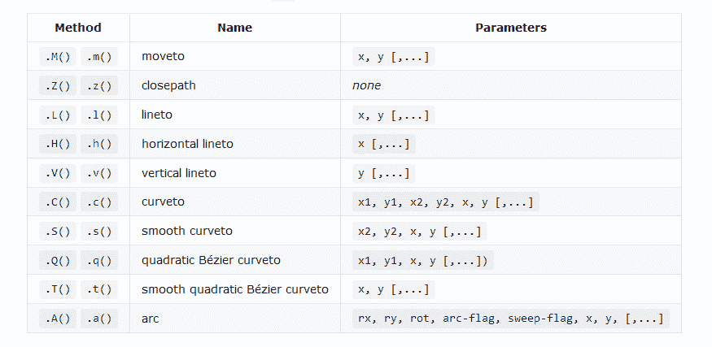

# Graphery SVG (gySVG):一个介绍性的博客

> 原文：<https://blog.logrocket.com/graphery-svg-gysvg-an-introduction/>

Graphery SVG **，**通常被称为 gySVG，是一个[小型但功能强大的库](https://www.graphery.org/svg/guide/#goal-reduce-code-complexity)，用于简化从 JavaScript 构建和操作 SVG 图形。这个库可以用在普通的 JavaScript 和框架中，比如 React、Vue、Svelte、Stencil 或 Angular。在本文中，我们将讨论 SVG 的基础知识，以及如何使用 Graphery 创建简单和复杂的形状。

## What is SVG？

SVG 代表可缩放矢量图形，用于以 XML 格式为 web 定义基于矢量的图形。

下面是一个非常简单的 SVG 示例(带绿色边框的黄色圆圈):

```
<svg width="100" height="100">
  <circle cx="50" cy="50" r="40" stroke="green" stroke-width="4" fill="yellow" />
</svg>

```

## 为什么是新的 SVG 库？

主要目标是降低代码复杂性。尽管多年来已经有了许多 SVG 库，但是仍然需要构建一个更小、更快、更接近 SVG 格式的新库。结果就是 gySVG。在以前的 SVG 库中，最小化的库大小不到 3kb；使用 gzip 时，这个值减少到 1.5 KB。Graphery SVG 也更快，只需 20 毫秒，而 SVG.js 只需 40 毫秒。

gySVG 是一个简单的库，它提供了一种简单的方法来处理 SVG，而不会影响项目的性能或规模。

## 比较普通 JavaScript 代码和 gySVG

众所周知，创建一个简单的 SVG 需要许多普通 JavaScript 代码，理解和维护起来会很困难。使用 gySVG 通过一组适合 SVG DOM 属性、特性和方法的非常简单的方法简化了代码的创建和操作。

### **用普通的 JavaScript 创建一个简单的 SVG**

```
const div = document.querySelector('#drawing');
const svg = document.createElementNS('http://www.w3.org/2000/svg', 'svg');
svg.setAttribute('width', '100%');
svg.setAttribute('height', '100%');
div.appendChild(svg);
const rect = document.createElementNS('http://www.w3.org/2000/svg', 'rect');
rect.setAttribute('x', '10');
rect.setAttribute('y', '10');
rect.setAttribute('width', '90');
rect.setAttribute('height', '90');
rect.setAttribute('fill', '#F06');
svg.appendChild(rect);

```

### **用 gySVG 创建相同的 SVG**

```
const svg = gySVG().width('100%').height('100%');
const rect = svg.add('rect').x(10).y(10).width(90).height(90).fill('#f06');
svg.attachTo('#drawing');

```

结果是一个完全有效的 SVG，可以作为 HTML DOM 的一部分无限制地使用。如您所见，这是一个简单得多的块。

### 浏览器支持

gySVG 的神奇之处在于它对代理的使用，这是 ES6 最强大的特性之一。JavaScript 的代理允许我们为每个 SVG 元素动态地创建包装器，减少库的大小，同时保持性能。

代理受以下支持:

*   Microsoft Edge 12 和更高版本
*   Firefox 18 及更高版本
*   Chrome 49 和更高版本
*   Safari 10 桌面版和移动版，等等
*   Opera 36 以及更高版本

Internet Explorer 11 不支持代理，并且不能使用聚合填充或传输填充进行集成。

## gySVG 入门

gySVG 有两种入门方法:从 CDN 加载或者用`npm`本地安装。

### 从 CDN 加载

从 CDN 加载时，使用导入模块或加载脚本版本。使用 gySVG 库最简单的方法是从我们的 CDN 服务中将其作为 ES 模块导入:

```
import gySVG from 'https://cdn.graphery.online/svg/0.1.4/module/index.js';

```

另一种简单的方法是从我们的 CDN 加载带有标签`<script>`的脚本版本:

```
<script src="https://cdn.graphery.online/svg/0.1.4/script/index.js"></script>;

```

### 使用`npm`在本地安装

`You can install the Graphery SVG library locally by `npm`:`

 ````
npm install @graphery/svg

```

如果您已经在本地安装，您将需要引用`node_modules/@graphery/svg`并使用此代码进行导入:

```
import SVG from './node_modules/@graphery/svg/index.js';

```

或者，按如下方式加载脚本:

```
<script src="./node_modules/@graphery/svg/script/index.js"></script>

```

如果您使用 webpack 或其他加载器，您可能能够在这些调用中省略`node_modules`文件夹。

## 理解 SVG 元素

函数`gySVG()`创建一个 SVG 元素，并返回一个包含 gySVG 包装器的对象。它可用于嵌套其他元素、定义其坐标系或建立其他配置参数。

```
const svg = gySVG();

```

上面的行为类似于使用 SVG HTML 标签(`<svg></svg>`)。

对于显示元素，可以使用方法`.viewBox()`来定义图形的内部画布，而方法`.width()`和`.height()`可以用来定义视口。我们将在下面的章节中更详细地讨论这些。

### `viewBox`

`.viewBox()`方法定义了 SVG 的内部位置和尺寸。它使用了四个参数:`min-x`、`min-y`、`width`、`height`。这些数字指定了在与 SVG 元素相关联的内部边界内映射的矩形。嵌套元素的所有度量都将这些维度作为参考。不带参数调用此方法将返回当前的视图框值。

**举例:**

```
const svg = gySVG().viewBox(0, 0, 100, 100);

```

### 宽度和高度

这些方法用于定义视窗，即图像在 HTML 页面中嵌入的大小。水平长度用`.width()`定义，垂直长度用`.height()`定义。

**举例:**

```
const svg = gySVG().width(100).height(100);

```

### 附加到 DOM 元素

最后，为了在 HTML 页面的 DOM 中包含 SVG，我们使用了`.attachTo()`方法，它提供了一个参数作为选择器来定位元素。结果，我们的 SVG 被插入到页面中。

**举例:**

```
const svg = gySVG().viewBox(0, 0, 100, 100).width(50).height(50);
svg.attachTo('#content')

```

在我们继续看如何使用 gySVG 创建像圆形和矩形这样的基本形状之前，我们将首先回顾如何添加嵌套元素。

### 添加嵌套元素

为了在 SVG 中添加元素，我们将使用`.add()`方法传递一个参数，该参数带有我们想要创建的元素的名称。这个方法返回一个对象，我们可以用它来设置我们已经命名的元素的所有特征(在这个例子中是`circle`)。

**举例:**

```
const svg    = gySVG().viewBox(0, 0, 100, 100).width(75).height(75);
const circle = svg.add('circle').cx(50).cy(50).r(50).fill('#f06');

```

## 使用 gySVG 创建基本形状

接下来，我们将介绍如何使用 gySVG 创建基本形状。注意，如果需要的话，SVG 文件[中的每个元素和属性都可以被动画化](https://blog.logrocket.com/web-animation-with-html-css-and-javascript/)。

### 矩形

为了创建一个矩形，我们将使用`.add('rect')`方法。`.width()`和`.height()`确定矩形的大小，而`.x()`和`.y()`将形状移动到合适的位置。所有这些值都与视图框中定义的尺寸相关。

**举例:**

```
const svg  = gySVG().viewBox(0, 0, 100, 100).width(75).height(75);
const rect = svg.add('rect').x(10).y(10).width(90).height(90).fill('#00D800');

```

`.fill()`设置形状的内部颜色，`.stroke()`设置边框颜色，`.stroke_width()`设置边框宽度。请注意，如果未指定，所有颜色都默认为黑色。

也可以通过在`.rx()`和`.ry()`中指定值来创建圆角。

### 圆

为了创建一个圆，我们将使用`.add('circle')`方法，创建一个由中心点(`.cx()`和`.cy()`)和外半径(`.r()`)定义的圆。所有这些值都是根据视图框中定义的尺寸确定的。

**举例:**

```
const svg    = gySVG().viewBox(0, 0, 100, 100).width(75).height(75);
const circle = svg.add('circle').cx(50).cy(50).r(50).fill('#0000D8');

```

`.fill()`方法设置圆形的内部颜色，而`.stroke()`方法可用于设置圆形边框颜色和`.stroke_width()`边框宽度。

**举例:**

```
const svg    = gySVG().viewBox(0, 0, 100, 100).width(75).height(75);
const circle = svg.add('circle').cx(50).cy(50).r(45)
                  .fill('#D80000').stroke('#00D800').stroke_width(10);

```

了解如何创建其他形状，如椭圆，多边形，直线等[在这里](http://graphery.org/svg/guide/03-Basic-shapes.html)。

### 路径元素

`.add('path')`方法用于创建一个 SVG 路径。此元素表示形状的轮廓。虽然所有基本形状都可以用路径元素创建，但路径元素通常是为更复杂的形状保留的。

路径信息用`.d`和一组特殊方法描述，或者直接用`.d(path_data)`描述。最简单的方法是使用`.d`方法，如`.d.M()`或`.d.L()`，然后从那里一步一步地构建路径数据。

大写字母方法用绝对项表示坐标，而小写字母方法用最近声明的坐标的相对项表示坐标。以下是`.d`中可用方法的简短列表:



Letter methods in .d.

**举例**:

在下面的代码中使用了`gySVG ()`来创建一个带有`path`元素的 SVG 心脏。

请看 [CodePen](https://codepen.io) 上 Olawanle Joel([@ olawanlejoel](https://codepen.io/olawanlejoel))
的笔[心| SVG](https://codepen.io/olawanlejoel/pen/RwGKJYe) 。

## **用 gySVG 创建渐变和图案**

在前面的例子中，我们看到了如何利用`.fill()`和`.stroke()`为 SVG 添加颜色。在这一节中，我们将考虑如何利用渐变和图案来填充形状。
我们可以用渐变和图案的方法`.url()`得到`.fill()`和`.stroke()`的值。这个方法使用伪函数`url()`返回元素的惟一 id 引用。

### 梯度

有两种类型的梯度，我们将考虑:线性和径向。

#### 线性渐变

`linearGradient`根据每个色点(`stop`)和它们之间的过渡，沿直线均匀地改变颜色。默认情况下，渐变是从左到右的；如果需要另一个角度(比如`45`，可以用`.gradientTransform(rotate(45))`。

用一个定义百分比的`.offset()`和定义该点的颜色参考的`.stop_color()`和`.stop_opacity()`来定义`stop`元素。

下面的代码是用来创建一个圆形 SVG 的线性渐变填充。

[见钢笔
线性 Grad。| Graphery SVG](https://codepen.io/olawanlejoel/pen/LYRxaxg) 作者 Olawanle Joel([@ olawanlejoel](https://codepen.io/olawanlejoel))
于 [CodePen](https://codepen.io) 。

径向梯度

#### `radialGradient`与`linearGradient`非常相似，但是在这种情况下，渐变的坐标现在是圆形的，从中心移动到边缘。

下面的代码是用来创建一个圆形 SVG 的径向渐变填充。

[见钢笔
径向 Grad。| Graphery SVG](https://codepen.io/olawanlejoel/pen/mdrRowN) 作者 Olawanle Joel([@ olawanlejoel](https://codepen.io/olawanlejoel))
于 [CodePen](https://codepen.io) 。

**图案**

`pattern`定义一个图形对象，该对象可以间隔重绘到 SVG 中。它有自己的`.viewBox()`绑定参考，大小由`.width()`和`.height()`定义。

### 宽度和高度的行为取决于`.patternUnits()`配置，默认情况下是`objectBoundingBox`。要继续，我们需要将其配置为`'userSpaceOnUse'`。在这种配置下，高度和宽度是对使用`pattern`的元素坐标系的引用。

下面的代码用于创建一个带有图案填充的圆形 SVG:

参见 [CodePen](https://codepen.io) 上 Olawanle Joel([@ olawanlejoel](https://codepen.io/olawanlejoel))
的笔 [图案| Graphery SVG](https://codepen.io/olawanlejoel/pen/PoGWLOq) 。

The code below is used to create a circle shape SVG with pattern fill:

动态形状的更多示例

除了非常适合创建基本和复杂的形状之外，gySVG 还可以用于构建更多动态元素，包括:

## 参见 [CodePen](https://codepen.io) 上的笔 [gySVG:时钟](https://codepen.io/graphery/pen/QWNqgvW)by graphery([@ graphery](https://codepen.io/graphery))
。

In addition to being great for creating basic and complex shapes, gySVG can also be used to build more dynamic elements including:

这个例子是一个非常简单的赛车游戏。点击开始按钮，看看它是如何工作的！

见笔 [赛车](https://codepen.io/graphery/pen/QWExdZP)由 graphery ( [@graphery](https://codepen.io/graphery) )
上[码笔](https://codepen.io)。

This example is a very simple car racing game. Click the start button to see how it works!

点击查看更多 gySVG 示例和文档[。](https://www.graphery.org/svg/examples/)

**结论**

在本文中，我们已经了解了如何开始使用 JavaScript 中的 Graphery SVG，包括如何使用 gySVG 创建基本和复杂的形状。查看其他图表[文档](https://www.graphery.org/svg/)或他们的快速参考[指南](https://www.graphery.org/svg/Quick-reference.html)了解更多信息。

## 使用 [LogRocket](https://lp.logrocket.com/blg/signup) 消除传统错误报告的干扰

[LogRocket](https://lp.logrocket.com/blg/signup) 是一个数字体验分析解决方案，它可以保护您免受数百个假阳性错误警报的影响，只针对几个真正重要的项目。LogRocket 会告诉您应用程序中实际影响用户的最具影响力的 bug 和 UX 问题。

## 然后，使用具有深层技术遥测的会话重放来确切地查看用户看到了什么以及是什么导致了问题，就像你在他们身后看一样。

[](https://lp.logrocket.com/blg/signup)

LogRocket 自动聚合客户端错误、JS 异常、前端性能指标和用户交互。然后 LogRocket 使用机器学习来告诉你哪些问题正在影响大多数用户，并提供你需要修复它的上下文。

关注重要的 bug—[今天就试试 LogRocket】。](https://lp.logrocket.com/blg/signup-issue-free)

LogRocket automatically aggregates client side errors, JS exceptions, frontend performance metrics, and user interactions. Then LogRocket uses machine learning to tell you which problems are affecting the most users and provides the context you need to fix it.

Focus on the bugs that matter — [try LogRocket today](https://lp.logrocket.com/blg/signup-issue-free).`