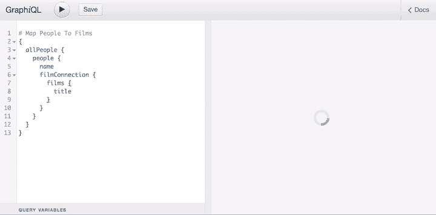

# GraphQL 指令被低估

> 原文：<https://blog.logrocket.com/graphql-directives-are-underrated/>

互联网上充斥着关于如何将 GraphQL 与其他 API 区分开来的文章，也就是 REST。他们都吹捧它强大的类型系统、优秀的开发人员体验、一流的工具，以及在模式上快速迭代的能力，所有这些都没有欠挖或过挖。这是[所有真实的](https://www.prisma.io/blog/top-5-reasons-to-use-graphql-b60cfa683511)。

但是指令呢？令人惊讶的是，关于他们的文章很少。它们在最流行的 GraphQL 服务器中的实现并不简单，这可以解释为什么指令经常被忽略。

根据[阿波罗文档](https://www.apollographql.com/docs/graphql-tools/schema-directives/#using-schema-directives):

> 本文档的大部分内容都与实现模式指令有关，其中一些示例可能看起来相当复杂。无论您拥有多少工具和最佳实践，以一种可靠的、可重用的方式实现一个重要的模式指令都是困难的。详尽的测试是必不可少的，并且推荐使用像 TypeScript 这样的类型化语言，因为有太多不同的模式类型需要考虑。

这也可能与一些流行的 GraphQL APIs 中指令的有限可用性有关。例如， [GitHub 的](https://developer.github.com/v4/public_schema/)和 [Shopify 的](https://shopify.dev/docs/admin-api/graphql/reference)公共模式都没有提供一个指令。没有多少好的例子可供开发者效仿。

指令通常不难实现；如果某个特定的 GraphQL 服务器是这种情况，很可能是因为它的架构没有按照指令进行优先排序。一些 GraphQL 服务器比其他服务器更好地支持指令。

因此，在 GraphQL 与 REST 的讨论中，指令并不总是重要的因素，这是有道理的，但这是一个遗憾，因为它们是 GraphQL 最强大的特性之一。在本教程中，我们将试图通过解释指令如何增强我们的 GraphQL APIs 来填补空白。

## 什么是指令？

简而言之，指令是一个增加其他功能的函数。使用`@`符号定义。例如，在下面的查询中，`@upperCase`指令被应用于`title`字段，将其结果转换为大写。

```
query {
  post(id: 1) {
    title
    ucTitle: title @upperCase
  }
}

```

[运行查询](https://newapi.getpop.org/graphiql/?query=query%20%7B%0A%20%20post(id%3A%201)%20%7B%0A%20%20%20%20title%0A%20%20%20%20ucTitle%3A%20title%20%40upperCase%0A%20%20%7D%0A%7D)会产生以下结果。

```
{
  "data": {
    "post": {
      "title": "Hello world!",
      "ucTitle": "HELLO WORLD!"
    }
  }
}

```

您可以考虑像面向方面编程(AOP)这样的指令，因为它们可以用于横切其他功能。例如，除了应用于`Post`的`title`字段之外，来自上面查询的`@upperCase`指令可以应用于任何类型`String`的字段，比如`User`的`name`，如[这个查询](https://newapi.getpop.org/graphiql/?edit_schema=1&query=query%20%7B%0A%20%20user(id%3A%201)%20%7B%0A%20%20%20%20name%0A%20%20%20%20ucName%3A%20name%20%40upperCase%0A%20%20%7D%0A%7D)所示。

从 AOP 的角度来考虑，指令的最佳用例是横切用例，其中的功能是通用的，可以在应用程序的不同部分重用。其中包括:

*   分析/日志/指标
*   批准
*   贮藏
*   配置默认值
*   输出操作
*   确认

也可以通过中间件在解析器中执行这些横切功能，正如 Prisma 的 [`graphql-middleware`包](https://github.com/prisma-labs/graphql-middleware)所提供的。然而，我认为指令更合适。

### 并非所有指令都是平等的

在 [GraphQL 文档](https://graphql.org/learn/queries/#directives)中还不清楚，但是有两种类型的指令:

1.  模式类型指令，在 SDL 中定义，在构建模式时执行
2.  查询类型指令，出现在查询中，在解析查询时执行

我们可以通过 GraphQL 规范中的三个保留指令来可视化它们的差异:`[@skip](http://spec.graphql.org/draft/#sec--skip)`、`[@include](http://spec.graphql.org/draft/#sec--include)`和`[@deprecated](http://spec.graphql.org/draft/#sec--deprecated)`。这些指令属于以下类型。

*   `@deprecated`是模式类型指令，用于在模式定义中将字段标记为不推荐使用
*   `@skip`和`@include`是查询类型的指令，用于决定是否在运行时执行查询的一部分

然而，规范并不称它们为查询或模式类型的指令。相反，它使用[指令位置](http://spec.graphql.org/draft/#sec-Type-System.Directives.Custom-Directives)来定义指令出现的位置。

有两组指令位置:[可执行指令位置](http://spec.graphql.org/draft/#ExecutableDirectiveLocation)(即查询类型)和[类型系统指令位置](http://spec.graphql.org/draft/#TypeSystemDirectiveLocation)(即模式类型)。然后，`@skip`和`@include`指令只能添加到`FIELD`、`FRAGMENT_SPREAD`或`INLINE_FRAGMENT`位置(即查询中的字段或片段)，而`@deprecated`可以添加到`FIELD_DEFINITION`或`ENUM_VALUE`位置(即模式中字段或枚举的定义)。

这两种类型的指令还为最终用户提供了不同级别的可见性。模式类型指令是私有的。GraphQL 模式管理员/设计者/所有者使用它们来配置模式，并且不向针对 GraphQL 端点执行查询的最终用户公开。为什么最终用户在运行查询时需要包含`@deprecated`指令？另一方面，查询类型的指令是公共的。它们被提供给最终用户以增强他们自己的定制查询。

前面我提到过 GitHub 和 Shopify 不提供指令。这意味着他们的公共模式不公开任何查询类型的指令，但它没有提到模式类型的指令，这些指令是私有的，只有他们自己的团队可以访问。为什么它们没有查询类型的指令？这可能是因为他们没有能让用户受益的令人信服的用例。他们需要的任何功能也可以在客户端应用程序中实现，而不是在 API 层实现。例如，网站可以很容易地在 JavaScript 中实现`@upperCase`指令。

似乎模式类型的指令比查询类型的指令更有用。此外，考虑到前面提到的指令用例，只有一个用例(输出操作)属于查询类型领域。所有其他的(分析/日志/度量、授权、缓存、配置默认值、验证)都是模式类型。

也就是说，模式和查询类型指令都非常有用。

## 为什么指令很重要？

让我们来看看问题的症结所在，也就是为什么我认为指令是一个极好的(并且很大程度上未被认可的)特性:它们是不受监管的。除了描述它们的语法之外，该规范没有说太多关于指令的内容，这让每个 GraphQL 服务器实现者可以自由地设计他们的架构，决定他们可以支持什么样的特性，以及他们可以变得有多强大。

事实上，指令是 GraphQL 服务器实现者和最终用户的乐园。GraphQL 服务器实现者可以开发规范目前不支持的特性，用户可以开发 GraphQL 服务器尚未实现的特性。

指令不受监管的特性是一个特征，而不是一个缺陷。为了说明指令的来源和去向，让我们停下来上一堂快速的历史课。

### 争论指令的精神

最初引入指令是为了支持`@deprecated`指令。例如，查看 GitHub 上记录的[这个问题。](https://github.com/graphql-nexus/schema/issues/53)

2019 年 11 月 4 日，维护者 tgriesser 写道:

> [……]SDL 从未打算用作构建模式的手段，而@deprecated 指令只出现在 SDL 中，因为它也可以在自省查询
> [……]
> 中表示。在编写-SDL 优先时，AST 中存在手写指令这一事实只是因为它是有效的语法，但它不一定意味着要以这种方式使用。

在脸书设计 GraphQL 的团队没有看到从那里进步的需要(大约在 2015 年)，甚至考虑完全删除指令。正如 GraphQL 的创始人之一 Lee Byron，[当时评论道](https://github.com/graphql/graphql-js/issues/41#issuecomment-120669129):

> […]我们实际上正在考虑一个从模式中完全删除指令的改变。

然后，一会儿之后的:

> 需要明确的是，指令并不是被设计成由 graphql 的用户来扩展，而是由 graphql 核心本身的未来版本来扩展。
> 
> 这就是我们考虑将它们从模式中移除的原因。这太令人困惑了，因为 schema 是 graphql 的用户定义和产生的东西，而可从代码的相同部分访问的指令看起来与其他的不一样。

指令从未被删除，GraphQL 生态系统中的不同参与者使用它们来扩展自己的功能，成为他们解决方案的基本元素。随着指令的使用越来越广泛，越来越多的人要求赋予指令一个更重要和标准化的角色。参见[2018](https://github.com/graphql/graphql-js/issues/1343#issue-321314362)的这条评论:

> [……]既然 GraphQL 生态系统已经成长，我认为我们应该考虑与第三方库的互操作性。我想到的例子是 Apollo cache control 和 Prisma，它们使用指令来提供一些元数据，以使 awesome 底层特性工作。

除了对`@skip`、`@include`和`@deprecated`的特殊使用外，不打算将指令自由合并到规范中。李·拜伦[回复](https://github.com/graphql/graphql-js/issues/1343#issuecomment-422222814)上述评论:

> 指令纯粹是 GraphQL 语言的一个特性，不是类型定义的一部分——这是因为不同的工具会以不同的方式使用和解释指令。

拜伦以此表明他没有改变在这个问题上的立场。他在 2017 年的[评论中更好地解释了这一点:](https://github.com/graphql/graphql-js/pull/746#issuecomment-301554231)

> 现在，指令纯粹是 GraphQL 语言和 IDL [“接口定义语言”，SDL 的另一个名字]的一个特性，所以没有使用 IDL 定义创建的模式不会包含指令。当用代码构建模式时，您拥有宿主编程环境的全部能力，因此指令应该是不必要的。指令是一种工具，用于提供额外的意图，供宿主编程环境稍后解释。

一方面，Lee Byron 希望将这些指令纯粹作为语言的一种构造来保存，以便在最低限度上使用。同时，部分社区希望指令在执行查询时扮演更不受限制的角色。伊凡·冈查罗夫，规范的维护者，同时也是 GraphQL for JavaScript 的参考实现`[graphql-js](https://github.com/graphql/graphql-js/)`，[解释了这两种立场之间的对比](https://github.com/graphql/graphql-js/issues/1343#issuecomment-459156658):

> 一方面，我们希望类型系统尽可能严格，以便于使用(在中间件或任何其他工具中)。另一方面，我们希望指令尽可能灵活，这样第三方开发人员就可以试验新的语法，而无需派生 GraphQL 解析器和创建新的 GraphQL 方言。

这个评论还解释了 Lee Byron 将指令描述为“提供附加意图的工具，这些意图将在以后由宿主编程环境解释”的意思如果你一开始不明白，不要担心——你并不孤单。

每个 GraphQL 服务器供应商仍然完全控制指令来支持他们自己的解决方案。

### 通过指令推进 GraphQL

指令完成了 GraphQL 的一个基本角色。尽管它们没有被自由地添加到规范中，但是指令仍然可以帮助改进 GraphQL。因为指令是不受管制的，所以实现者可以在他们认为合适的时候试验它们来解决给定的问题。如果所产生的特性变得不可或缺，并且可以从整体上使 GraphQL 受益，那么它将被考虑添加到规范中。

指令就像一个帮助 GraphQL 发展的游乐场。通过这种方式，指令提供了 GraphQL 标准化后的未来的一瞥。

要想先睹为快，看看指令在不久的将来将如何改进 GraphQL，请查看标题恰当的 talk " [一瞥 GraphQL 的未来](https://www.youtube.com/watch?v=sMTNTy_aOU0)"在这篇文章中，曾在从事 GraphQL 工作的 Robert Zhu 提供了一份关于社区目前正在制定的指令的精彩摘要。

他特别提到以下几点。

*   `[@specifiedBy](https://github.com/graphql/graphql-spec/issues/635)`将一个可选的 URI 附加到自定义标量定义上，指向一个为该标量保存额外信息(数据格式、序列化和强制规则)的文档。目前正处于[草案阶段](https://github.com/graphql/graphql-spec/blob/master/CONTRIBUTING.md#stage-2-draft)
*   `@defer`和`@stream`更快地呈现部分查询，无需等待较慢的字段进行计算(`@defer`)，并开始呈现集合中的前几个条目，而无需等待整个集合(`@stream`)。这些目前正处于[提案阶段](https://github.com/graphql/graphql-spec/blob/master/CONTRIBUTING.md#stage-1-proposal)

鉴于`@specifiedBy`解决了服务器相互通信时的不兼容问题，`@defer`和`@stream`预计将提高应用程序的性能，提供用户可以尽可能立即使用的初始响应。

指令最初是由阿波罗服务器实现的。这里有一个 GraphQL 服务器的例子，它实现了一个规范中没有的特性，并且最终变得非常有用，因此被推荐到规范中。

此外，我们还有一些 GraphQL 服务器中没有的功能，由用户通过自定义指令来实现。例如， [[RFC]平面链语法问题](https://github.com/graphql/graphql-spec/issues/174)建议合并嵌套对象的结果，如下所示:

```
{
  clients(limit: 5) {
    id
    programs: programs.shortName
  }
}

```

这将产生以下响应。

```
{
  "data": {
    "clients": [
      {
        "id": 2,
        "programs": ["ABC","DEF"]
      },
      {
        "id": 3,
        "programs": ["ABC", "XYZ"]
      }
    ]
  }
}

```

服务器仍然不支持这种行为，但它作为`[graphql-lodash](https://github.com/APIs-guru/graphql-lodash)`库的一部分是可用的，该库提供了一个指令`@_`来调整查询的响应。



该指令只是一个临时解决方案，直到提案通过流程的最后阶段(目前处于 [strawman 阶段](https://github.com/graphql/graphql-spec/blob/master/CONTRIBUTING.md#stage-0-strawman))并被添加到规范中，届时所有 GraphQL 服务器都必须满足新的语法。但是，即使这一天永远不会到来，用户也不需要等待使用该功能。

在我自己的一个项目中，我用 PHP 为我的 [GraphQL 服务器实现了一个](https://graphql-by-pop.com/) [`@export`指令](https://github.com/getpop/graphql/blob/109d194c11dd2510d0ea5ce42b88fb556397400c/src/DirectiveResolvers/ExportDirectiveResolver.php)，它将一个字段(或一组字段)的值导出到一个变量中，以便在查询中的其他地方使用。这个特性是在[【RFC】动态变量声明](https://github.com/graphql/graphql-spec/issues/583)中要求的，也是在 strawman 阶段。

当 GraphQL 服务器需要一个不属于规范的特性时，指令填补了空白。当您需要一个 GraphQL 服务器没有提供的特性时，自定义指令可以填补空白。

如何在众多可用的 GraphQL 服务器中做出选择？假设您期望您的 API 长期处于活跃的开发中，从询问以下问题开始:

*   它支持创建自定义指令吗？
*   自定义指令有多强大？

为定制指令提供强大支持的服务器将引领 GraphQL 的未来。他们能够在其他人之前实现新的特性，并成为其他人模仿的参考实现。对定制指令的支持越好，服务器就越有可能是最新的，并与最新的规范兼容。

相反，将指令作为事后想法的服务器可能会产生停滞不前且越来越难以升级的 API，这使得它们成为一项糟糕的长期投资。

## 指令不是万能的

指令并不能解决所有问题。使用它们，但不要滥用它们。

正如我提到的，指令对于扩展 GraphQL 功能非常有用，但是它们并不是最适合每种功能的工具。有些任务最好由现场解决方案来处理。对于其他人来说，指令并不能提供最优的解决方案。

让我们检查一下我在指令方面遇到的几个问题。这些例子说明了为什么指令并不像最初看起来那样像瑞士军刀——至少现在还不是。

### 为一类结果或特定字段定义指令

我用 PHP 为我自己的 [GraphQL 服务器](https://graphql-by-pop.com)生成了一个 [`@cdn`指令](https://github.com/getpop/cdn-directive/blob/master/src/DirectiveResolvers/CDNDirectiveResolver.php)，它通过用我的 CDN 中的域替换它的域来转换一个`URL`(一个自定义标量)类型。

```
query {
  user(id: 1) {
    url
    cdn: url @cdn(from: "https://newapi.getpop.org", to: "https://nextapi.getpop.org")
  }
}

```

[运行这个查询](https://newapi.getpop.org/graphiql/?edit_schema=1&query=query%20%7B%0A%20%20user(id%3A%201)%20%7B%0A%20%20%20%20url%0A%20%20%20%20cdn%3A%20url%20%40cdn(from%3A%22https%3A%2F%2Fnewapi.getpop.org%22%2C%20to%3A%22https%3A%2F%2Fnextapi.getpop.org%22)%0A%20%20%7D%0A%7D)会产生以下结果。

```
{
  "data": {
    "user": {
      "url": "https://newapi.getpop.org/author/leo/",
      "cdn": "https://nextapi.getpop.org/author/leo/"
    }
  }
}

```

这个指令只有在字段是类型`URL`时才有意义，因为模式中只有少数字段:字段`url`代表`User`，字段`Post`代表`Media`类型的`src`。

理想情况下，我希望在我的模式中定义，只有当字段属于类型`URL`或应用于白名单字段列表时，`@cdn`指令才可用。不幸的是，我所能做的就是将它的指示位置定义为`FIELD`或`FIELD_DEFINITION`，而不是哪个字段或谁的定义。

我已经看到了这个问题的一些解决方法。例如，[阿波罗](https://www.apollographql.com/docs/graphql-tools/schema-directives/#uppercasing-strings)为 [`@upper`指令](https://www.apollographql.com/docs/graphql-tools/schema-directives/#uppercasing-strings)提出了以下解决方案。

```
class UpperCaseDirective extends SchemaDirectiveVisitor {
  visitFieldDefinition(field) {
    const { resolve = defaultFieldResolver } = field;
    field.resolve = async function (...args) {
      const result = await resolve.apply(this, args);
      if (typeof result === "string") {
        return result.toUpperCase();
      }
      return result;
    };
  }
}

```

由于`@upper`指令只能应用于`String` s，Apollo 建议在应用逻辑之前验证`if (typeof result === "string") {`。这让我不寒而栗。如果你只是简单地接受每一种类型并用一些定制的逻辑来验证它，那么 GraphQL 的强类型系统又有什么意义呢？

在这种情况下，如果指令可以接收关于其指令位置的细粒度信息，GraphQL 会更好。

### 代码优先的解决方案成为二等公民

在[的前一篇文章](https://blog.logrocket.com/code-first-vs-schema-first-development-graphql/)中，我描述了创建 GraphQL 服务的模式优先(SDL 优先)和代码优先方法之间的区别。主要区别在于代码优先的方法不依赖于 SDL 来创建模式。

由于模式类型指令是 SDL 的一种构造，当没有 SDL 时，就没有这样的指令，GraphQL 服务器也就错过了大量的特性。例如，[关系](https://nexus.js.org)就是这种情况。因为这是一个代码优先的解决方案，它发现自己[无法实现对 Apollo federation](https://github.com/graphql-nexus/schema/issues/53#issuecomment-549683541) 的支持，这依赖于 SDL 上定义的一些自定义指令。

### 向模式类型指令传递输入可能会有歧义

这可能是一个例外情况，但如果您在项目中遇到这种情况，知道这一点是有好处的。

[Apollo 文档](https://www.apollographql.com/docs/graphql-tools/schema-directives/#formatting-date-strings)解释了如何实现`@date`指令，该指令从它修改的字段`today`接收可选的`format`输入作为字段参数。

```
graphql(schema, `query {
  today(format: "d mmm yyyy")
}`).then(result => {
  // Logs with the requested "d mmm yyyy" format:
  console.log(result.data.today);
});

```

问题是您可以对同一个字段应用多个指令。这些指令可能是由不同的供应商创建的——这意味着您无法控制它们——并且可能需要具有相同名称的参数。

例如，`Image`类型的`src`字段可以应用指令`@darkenColors`和`@resize`。这将相应地修改图像，将其保存在云中，并返回新图像的 URL。如果两个指令都收到一个参数`percentage`(第一个指示应用于图像的变暗量，第二个指定如何调整图像大小)，那么查询`src(percentage: "50%")`字段是不明确的。`"50%"`适用于变暗还是调整大小？

### 指令修改类型

按照上面的例子，`today`字段返回一个`Date`，当应用`@format`指令时，这个类型被转换为`String`。这种行为令人困惑，违背了强类型的思想。

我提出了这个问题的解决方案:[可组合字段](https://github.com/graphql/graphql-spec/issues/682)允许字段作为其他字段的输入。这样，如果`format`字段是`String`类型的，并且接收到一个`Date`类型的输入，它可以像`format(today, "d mmm yyyy")`一样组成一个`Date`类型的`today`字段，这类似于[这个查询](https://newapi.getpop.org/api/graphql/?query=posts(limit:5).title%7CupperCase(title())@ucTitle)，使用一个修改过的语法。然而，我的提议不太可能被批准，因为它引入了一种新的方法来解析一个字段，并且非常不鼓励突破性的改变。

## 结论

指令是 GraphQL 最有用和最有趣的特性之一，但是你不会从阅读大多数关于 GraphQL 的特别之处的博客帖子和文章中了解到这一点。指令不受重视，而且超级强大。

您的 GraphQL 服务器对指令的支持有多强？它能让你实现你梦想的所有功能吗？非常基本的功能呢？实现起来难还是容易？

每个人都可以利用相同的工具(比如 [GraphiQL](https://github.com/graphql/graphiql/) )来改善开发人员的体验并提高生产力。每个 GraphQL 服务器都支持准确获取您需要的数据，而不会出现提取不足或过度提取的情况。但是并不是每个 GraphQL 服务器都提供相同的自定义指令支持。最终，这可能是将经受住时间考验的 GraphQL 服务与那些最终将变得停滞不前并不得不从头重新构想的服务区分开来的最重要因素。

简而言之，指令不能是事后想起的。因此，在选购 GraphQL 服务器时，在考虑其他特性之前，先评估它们对定制指令的支持。

## 继续多看

本文是正在进行的关于概念化、设计和实现 GraphQL 服务器的系列文章的一部分。该系列的前几篇文章是:

1.  *[设计 GraphQL 服务器以获得最佳性能](https://blog.logrocket.com/designing-graphql-server-optimal-performance/)*
2.  *[简化 GraphQL 数据模型](https://blog.logrocket.com/simplifying-the-graphql-data-model/)*
3.  *[graph QL 中代码优先与模式优先的开发](https://blog.logrocket.com/code-first-vs-schema-first-development-graphql/)*
4.  *[加速对 GraphQL 模式的修改](https://blog.logrocket.com/speeding-up-changes-to-the-graphql-schema/)*
5.  *[graph QL 中的版本控制字段](https://blog.logrocket.com/versioning-fields-graphql/)*

## 监控生产中失败和缓慢的 GraphQL 请求

虽然 GraphQL 有一些调试请求和响应的特性，但确保 GraphQL 可靠地为您的生产应用程序提供资源是一件比较困难的事情。如果您对确保对后端或第三方服务的网络请求成功感兴趣，

[try LogRocket](https://lp.logrocket.com/blg/graphql-signup)

.

[](https://lp.logrocket.com/blg/graphql-signup)[https://logrocket.com/signup/](https://lp.logrocket.com/blg/graphql-signup)

LogRocket 就像是网络和移动应用的 DVR，记录下你网站上发生的每一件事。您可以汇总并报告有问题的 GraphQL 请求，以快速了解根本原因，而不是猜测问题发生的原因。此外，您可以跟踪 Apollo 客户机状态并检查 GraphQL 查询的键值对。

LogRocket 检测您的应用程序以记录基线性能计时，如页面加载时间、到达第一个字节的时间、慢速网络请求，还记录 Redux、NgRx 和 Vuex 操作/状态。

[Start monitoring for free](https://lp.logrocket.com/blg/graphql-signup)

.