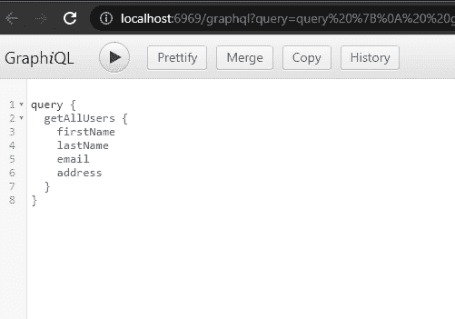
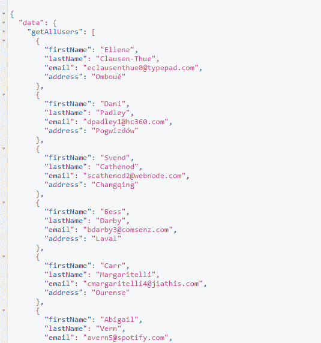
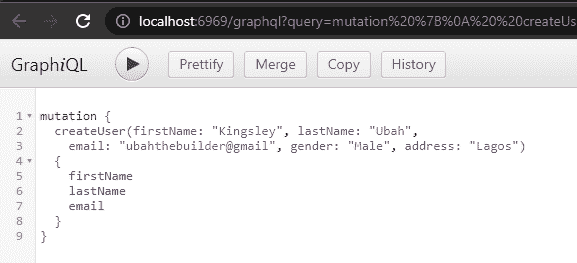
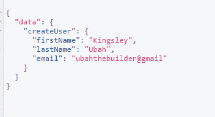

# 使用 Apollo - LogRocket 博客的 GraphQL 本地状态管理

> 原文：<https://blog.logrocket.com/graphql-local-state-management-apollo/>

GraphQL 是一种数据查询语言，它为查询 API 提供了一种灵活的方法。与 REST APIs 不同，GraphQL API 为在数据存储上执行 CRUD 操作提供了一个端点。

与 REST 方法相比，使用 GraphQL 的一大好处是灵活性。使用 GraphQL，前端开发人员可以更具体地确定 API 应该发送回什么数据，从而确保应用程序只接收所需的数据。

为了实现流畅的 graph QL-前端集成，Apollo 客户端库用于在前端应用程序中本地获取、缓存、修改和管理状态数据。

它包括内存缓存、本地状态管理、错误处理功能和一个名为 Apollo Provider 的基于 React 的视图层。

在本教程中，我们将学习如何在 Node.js 中设置 GraphQL API，以及如何在带有 Apollo 客户端的 React 应用程序中本地管理 API 中的数据。

## GraphQL 安装

如果你还没有安装 Node.js，你需要先在你的电脑上安装 node . js。

如果安装了，为您的项目创建一个文件夹，然后在其中创建一个`server`子文件夹。创建子文件夹后，将`cd`放入其中，用以下终端命令初始化一个节点项目:

```
cd graphql-apollo/server
npm init -y

```

这将在项目的服务器文件夹中生成一个`package.json`文件。

现在运行以下命令来安装软件包:

```
npm install express express graphql express-graphql

```

或者，您可以从这个 GitHub 库中获取代码来跟进。

## 在 GraphQL 中设置 ip 查询和变异

我们将围绕存储在`graphql-apollo/server/users.json`文件中的一些虚假用户数据来构建我们的应用程序。每个用户都有一个 ID、名、姓、性别和地址:

```
[{
  "id": 1,
  "firstName": "Ellene",
  "lastName": "Clausen-Thue",
  "email": "[email protected]",
  "gender": "Female",
  "address": "Omboué"
}, {
  "id": 2,
  "firstName": "Dani",
  "lastName": "Padley",
  "email": "[email protected]",
  "gender": "Male",
  "address": "Pogwizdów"
}, {
  "id": 3,
  "firstName": "Svend",
  "lastName": "Cathenod",
  "email": "[email protected]",
  "gender": "Male",
  "address": "Changqing"
}
...
]

```

请注意，您可以从 [Mockaroo 快速生成自己的数据。](https://www.mockaroo.com/)

现在，在 GraphQL 中，我们可以使用模式来指定数据库的数据类型和结构，并查看它是否由突变和查询组成。

查询是包含指定如何检索数据以及为每条记录检索哪些字段的规则的语句。而变异是指定如何在 API 上变异数据的语句(即`create`、`update`和`delete`)。

为了保持我们的项目有条理，在`graphql-apollo/server`文件夹中创建一个名为`Schemas`的新文件夹。

在`Schemas`文件夹中，创建一个名为`Types`的新文件夹，并在其中创建一个`User.js`文件，我们将在其中创建一个用户实体的类型定义:

```
const graphql = require("graphql");
const { GraphQLObjectType, GraphQLInt, GraphQLString } = graphql;

const User = new GraphQLObjectType({
  name: "User",
  fields: () => ({
    id: { type: GraphQLInt },
    firstName: { type: GraphQLString },
    lastName: { type: GraphQLString },
    email: { type: GraphQLString },
    gender: { type: GraphQLString },
    address: { type: GraphQLString },
  }),
});

module.exports = User;

```

`User`类型有一个整数类型的`id`，一个字符串类型的`name`，以此类推。我们还从`graphql`导入了各种模式类型。最后，我们导出了`User`对象，以便在需要的地方使用模式。

接下来，我们需要为我们的 API 创建所有的查询和变化。

### 创建查询

因此，在`graphql-apollo/server/Schemas`文件夹中创建一个`index.js`文件。我们将从导入 GraphQL 类型、假的`users`数据和`User`类型开始:

```
const graphql = require("graphql");
const {
  GraphQLObjectType,
  GraphQLSchema,
  GraphQLInt,
  GraphQLString,
  GraphQLList,
} = graphql;

const usersData = require("../users.json");

const UserType = require("./Types/User");

```

接下来，在导入下面，让我们创建查询:

```
const RootQuery = new GraphQLObjectType({
  name: "RootQueryType",
  fields: {
    getAllUsers: {
      type: new GraphQLList(UserType),
      args: { id: { type: GraphQLInt } },
      resolve(parent, args) {
        return userData;
      },
    },
  },
});

```

在`RootQuery`中，我们定义了获取所有用户的查询(`getAllUsers`)。在这个查询中，我们指定想要获得一个用户列表(由`type: new GraphQLList(UserType)`指定)。

属性指定了查询(`id`)中要传递的参数，函数`resolve`返回我们实际的数据源。`userData`将替换为实际生产环境中实际数据库的 URL。

### 创造突变

接下来，我们创造我们的突变:

```
const Mutation = new GraphQLObjectType({
  name: "Mutation",
  fields: {
    createUser: {
      type: User,
      args: {
        firstName: { type: GraphQLString },
        lastName: { type: GraphQLString },
        email: { type: GraphQLString },
        gender: { type: GraphQLString },
        address: { type: GraphQLString },
      },
      resolve(parent, args) {
        userData.push({
          id: userData.length + 1,
          firstName: args.firstName,
          lastName: args.lastName,
          email: args.email,
          gender: args.gender,
          address: args.address,
        });
        return args;
      },
    },
  },
});

```

这里，与前面的查询类似，我们创建了一个用于创建用户的变异查询(`createUser`)，并传入前面的模式作为其类型。

`args`包含在查询中作为参数传递的数据。在`resolve`函数中，我们将新的用户数据对象推入我们的数据存储中。注意，对于用户`id`，我们根据列表的长度自动增加值。

最后，我们必须在文件底部导出带有查询和变异的模式:

```
module.exports = new GraphQLSchema({ query: RootQuery, mutation: Mutation });

```

在下一节中，我们将创建我们的 GraphQL 服务器。

## 启动 GraphQL 服务器

要启动您的 GraphQL 服务器，进入您的`graphql-apollo/server/index.js`文件并使用以下代码:

```
const express = require("express");
const app = express();
const PORT = 6969;
const { graphqlHTTP } = require("express-graphql");
const schema = require("./Schemas/index");
const cors = require("cors");

app.use(cors());
app.use(express.json());
app.use(
  "/graphql",
  graphqlHTTP({
    schema,
    graphiql: true,
  })
);

app.listen(PORT, () => {
  console.log("Server running");
});

```

在导入`graphqlHTTP`来创建我们的 GraphQL HTTP 服务器之后，注意 [GraphQL API 只有一个端点](https://blog.logrocket.com/use-multiple-endpoints-graphql/) : `/graphql`。

作为`graphqlHTTP`的参数，我们必须传递导入的模式并将`graphiql`选项设置为`true`。后者让我们可以访问 GraphQL 图形用户界面(GUI)来测试我们的查询。

最后，我们开始在端口 6969 提供我们的 GraphQL 应用程序。

## 在 GraphiQL 中运行测试查询

GraphQL 是一个内置的 GraphQL API 测试环境，使我们能够可视化我们的 API 调用。

在前一节设置我们的 GraphQL 服务器时，我们确实将`graphilql`选项设置为`true`。这使我们能够在浏览器上使用 Graphiql UI 来运行测试查询，就像 Postman 这样的 API 测试人员一样。

要访问`qraphiql`，请在命令行上运行`node index.js`,并在您的 web 浏览器的地址栏中访问以下 URL:

```
<localhost:6969/graphql>

```

在左侧窗口中，您可以编写和执行测试查询。每个查询的结果将出现在右边的窗口中。

例如，下图显示了我们如何使用之前创建的`getAllUsers`查询来检索所有用户:



这就是结果:



我们还可以通过执行`createUser`突变向数据存储添加一个新用户:



然后，这是结果:



## 使用 Apollo 客户端将 GraphQL 连接到 React 应用程序

既然 QraphQL 后端已经设置好了，是时候创建一个 React 前端来使用我们的 GraphQL API 了。我们将使用 [Apollo 客户端库](https://blog.logrocket.com/5-graphql-clients-for-javascript-and-node-js/#apolloclient)来连接后端。

首先，让我们通过`create-react-app`安装 React:

```
npx create-react-app client

```

这将在项目根目录下创建一个名为`client`的新文件夹，其中包含前端 React 代码和模板。

接下来，我们将为前端安装 Apollo 客户端和 GraphQL:

```
npm install @apollo/client
npm install graphql

// For Mac
yard add @apollo/client graphql

```

成功安装后，我们将一些依赖项导入根组件(`graphql-apollo/client/src/App.js`):

```
import "./App.css";
import {
  ApolloClient,
  InMemoryCache,
  ApolloProvider,
  HttpLink,
  from,
} from "@apollo/client";
import { onError } from "@apollo/client/link/error";
import Users from "./Components/GetUsers";
import Form from "./Components/Form";

// [...]

```

这里，`onError`为我们提供了一种捕捉错误的方法，`inMemoryCache`支持页面缓存，`ApolloClient`将用于创建 Apollo 提供者。

我们还导入了两个尚未创建的组件，`Users`和`Form`，分别显示所有用户和创建一个新用户。

现在，我们将从`ApolloClient`创建一个新的客户端实例，并链接到 GraphQL 服务器，同时进行一些其他配置:

```
const link = from([
  errorLink,
  new HttpLink({ uri: "http://localhost:6969/graphql" }),
]);

const client = new ApolloClient({
  cache: new InMemoryCache(),
  link: link,
});

```

对于 GraphQL 错误，显示带有错误消息的警报:

```
const errorLink = onError(({ graphqlErrors, networkError }) => {
  if (graphqlErrors) {
    graphqlErrors.map(({ message, location, path }) => {
      alert(`Graphql error ${message}`);
    });
  }
});

```

现在，我们已经有了具有所有必需设置的 Apollo 客户机实例，我们可以将整个应用程序包装在 Apollo 提供程序中:

```
function App() {
  return (
    <ApolloProvider client={client}>
      {" "}
      <Users />
      <Form />
    </ApolloProvider>
  );
}

export default App;

```

这将为两个嵌套组件提供对 GraphQL API 的访问。接下来，我们将执行第一个查询来获取所有用户。

## 创建我们的前端模式(查询和突变)

既然我们的前端已经可以访问 GraphQL API，我们现在就可以创建查询和变异语句，以便在客户端代码中使用。

在您的`graphql-apollo/client/src`文件夹中，分别为您的查询和突变创建`Queries.js`和`Mutations.js`，然后使用以下代码:

```
// Queries.js
import { gql } from "@apollo/client";

export const LOAD_USERS = gql`
  query {
    getAllUsers {
      id
      firstName
      email
      gender
      address
    }
  }
`;

// Mutations.js
import { gql } from "@apollo/client";

export const CREATE_USER_MUTATION = gql`
  mutation createUser(
    $firstName: String!
    $lastName: String!
    $email: String!
    $gender: String
    $address: String
  ) {
    createUser(
      firstName: $firstName
      lastName: $lastName
      email: $email
      gender: $gender
      address: $address
    ) {
      id
    }
  }
`;

```

当向 GraphQL API 添加新用户时，`CREATE_USER_MUTATION`将在`Form`中使用。

接下来，我们将使用这些来查询 GraphQL 中的用户数据。

### 从 Apollo 客户端进行查询和显示数据

在`graphql-apollo/client/src/Users.js`组件中，让我们执行`LOAD_USERS`查询从 API 中检索所有用户:

```
import React, { useEffect, useState } from "react";
import { useQuery, gql } from "@apollo/client";
import { LOAD_USERS } from "../GraphQL/Queries";

function Users() {
  const { error, loading, data } = useQuery(LOAD_USERS);
  const [users, setUsers] = useState([]);
  useEffect(() => {
    if (data) {
      setUsers(data.getAllUsers);
    }
  }, [data]);

  return (
    <div>
      {" "}
      {users.map((val) => {
        return <h1> {val.firstName}</h1>;
      })}
    </div>
  );
}

export default GetUsers;

```

这里，`useQuery`钩子接受一个查询语句，并从 API 返回数据以及可能的错误和加载状态。然后，在`useEffect`钩子中，我们检查数据并在有变化时更新组件状态。

在模板中，我们现在可以通过映射数据来显示所有用户的名字。

接下来，我们将通过表单输入添加一个新用户来对我们的 API 进行变异。

### API 上的变异数据

让我们通过执行创建用户的突变，向我们的数据存储添加一个新用户。首先，我们进行一些导入并用空值初始化我们的`Form`组件的状态:

```
import React, { useState } from "react";
import { CREATE_USER_MUTATION } from "../GraphQL/Mutations";
import { useMutation } from "@apollo/client";

function Form() {
  const [firstName, setFirstName] = useState("");
  const [lastName, setLastName] = useState("");
  const [email, setEmail] = useState("");
  const [gender, setGender] = useState("");
  const [address, setAddress] = useState("");
  // [...]

```

然后，我们将变异查询传递给`useMutation`钩子。对于向数据存储添加新用户，返回`createUser`,对于可能的错误状态，返回`error`:

```
const [createUser, { error }] = useMutation(CREATE_USER_MUTATION);

  const addUser = () => {
    createUser({
      variables: {
        firstName: firstName,
        lastName: lastName,
        email: email,
        gender: gender,
        address: address,
      },
    });

```

最后，我们呈现表单的用户界面:

```
if (error) {
      console.log(error);
    }
  };
  return (
    <div>
      <input
        type="text"
        placeholder="First Name"
        onChange={(e) => {
          setFirstName(e.target.value);
        }}
      />
      <input
        type="text"
        placeholder="Last Name"
        onChange={(e) => {
          setLastName(e.target.value);
        }}
      />
      <input
        type="text"
        placeholder="Email"
        onChange={(e) => {
          setEmail(e.target.value);
        }}
      />
      <input
        type="text"
        placeholder="Gender"
        onChange={(e) => {
          setPassword(e.target.value);
        }}
      />
      <input
        type="text"
        placeholder="Address"
        onChange={(e) => {
          setPassword(e.target.value);
        }}
      />
      <button onClick={addUser}> Create User</button>
    </div>
  );
}

export default Form;

```

这里，当输入改变时，我们调用 setter 钩子用输入值更新组件状态。然后，当用户点击提交按钮时，我们执行`addUser`函数，这又将用户添加到数据库中。

## 结论

我希望这篇教程能帮助你更好地理解 GraphQL。现在，您应该能够在节点服务器上设置一个 [GraphQL API，为您的数据存储定义一个模式，并通过查询来创建、读取、更新和删除 API 上的数据。](https://blog.logrocket.com/creating-a-node-js-graphql-server-using-prisma-2/)

本文的最后一节将指导您使用 Apollo 客户端将 GraphQL 后端连接到 React 前端应用程序。core @apollo/client 库提供了与 React 的内置集成，使得 API 集成过程变得快速而简单。

你可以从[这个 GitHub 库](https://github.com/KingsleyUbah/graphql-apollo)中获取源代码。如果你有任何关于这个话题的问题，请在评论中告诉我。

## 监控生产中失败和缓慢的 GraphQL 请求

虽然 GraphQL 有一些调试请求和响应的特性，但确保 GraphQL 可靠地为您的生产应用程序提供资源是一件比较困难的事情。如果您对确保对后端或第三方服务的网络请求成功感兴趣，

[try LogRocket](https://lp.logrocket.com/blg/graphql-signup)

.

[](https://lp.logrocket.com/blg/graphql-signup)[https://logrocket.com/signup/](https://lp.logrocket.com/blg/graphql-signup)

LogRocket 就像是网络和移动应用的 DVR，记录下你网站上发生的每一件事。您可以汇总并报告有问题的 GraphQL 请求，以快速了解根本原因，而不是猜测问题发生的原因。此外，您可以跟踪 Apollo 客户机状态并检查 GraphQL 查询的键值对。

LogRocket 检测您的应用程序以记录基线性能计时，如页面加载时间、到达第一个字节的时间、慢速网络请求，还记录 Redux、NgRx 和 Vuex 操作/状态。

[Start monitoring for free](https://lp.logrocket.com/blg/graphql-signup)

.