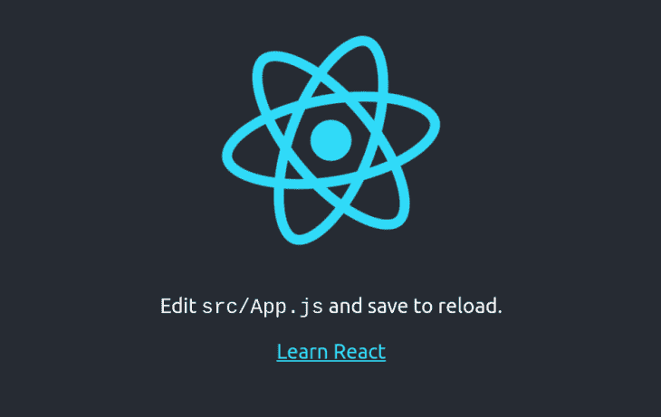
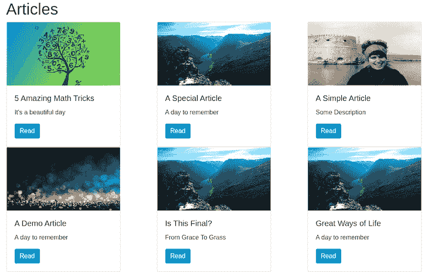

# graph QL+React for noobs-log rocket 博客

> 原文：<https://blog.logrocket.com/graphql-react-for-noobs/>

GraphQL 正在成为数据驱动应用程序的新标准。它是一种用于 API 的开源数据查询和操作语言，也是一种考虑客户机和服务器之间通信的革命性方式。

[用它自己的话说](https://graphql.org/):

> GraphQL 为 API 中的数据提供了完整且易于理解的描述，使客户能够准确地要求他们需要的东西，使 API 更容易随时间发展，并支持强大的开发工具。

在 2015 年由脸书公开发布后，它已经成为 REST API 架构的一个强有力的替代方案。

要开始在 React 应用程序中使用 GraphQL，您需要理解以下术语:

*   问题
*   突变
*   客户

## 你想要什么

在`REST` API 架构中， [GraphQL 查询](https://blog.logrocket.com/graphql-queries-in-simple-terms/)类似于`GET`请求。查询用于从 GraphQL 服务器获取或检索数据。它们决定了我们接收到的数据的结构；这意味着，作为用户，您可以请求您想要的内容以及您想要的结构。GraphQL 查询通常用大括号括起来:

```
{
  query_fields
}
```

查询字段是引用我们服务器上特定数据的关键字。这些数据的类型有 string、int、float、Boolean、ID 或 object。下面是一个 GraphQL 查询及其相应结果的示例:

```
// query
{
  article(slug: "5-amazing-math-tricks-flyingturtle") {
    title
    description
    author {
      name
      country
    }
  }
}

// result
{
  "data": {
    "article": {
      "title": "5 Amazing Math Tricks",
      "description": "here's what no one told you",
      "author": {
        "name": "Flying Turtle",
        "country": "Nigeria"
      }
    }
  }
}
```

在我们的例子中，注意结果是如何与查询具有相同的结构的。如果我们在查询中把`description`放在`title`之前，我们将以同样的顺序得到结果。第一个代码块第 3 行的`article`后面的括号包含了查询参数。对于这个查询，我们提供了 article slug 作为我们从 GraphQL 服务器中需要的特定文章的惟一标识符。

同样重要的是要注意，在我们的第一个块的第 6 行，`author`字段有一个`Object`类型。在这种情况下，我们还需要指定我们希望从对象中得到的字段——在本例中是`name`和`country`。

## GraphQL 突变

当将 GraphQL 变体与 REST API 架构进行比较时，它们类似于`PUT`、`PATCH`、`POST`和`DELETE`方法。顾名思义，变异是一种修改 GraphQL 服务器上数据的请求。它可以用来更新、插入或删除数据。

GraphQL 中突变的语法类似于`fetch`查询的语法，只是这一次，我们将在第一个花括号前添加`mutation`关键字，然后传入我们想要突变的字段及其值作为参数:

```
// mutation
mutation {
  updateArticle(slug: "5-amazing-math-tricks-flyingturtle", title: "just right") {
    title
    description
    author {
      name
      country
    }
  }
}

// result
{
  "data": {
    "article": {
      "title": "just right",
      "description": "here's what no one told you",
      "author": {
        "name": "Flying Turtle",
        "country": "Nigeria"
      }
    }
  }
}
```

如果您注意到了，我们还在变异请求中指定了返回值。这确切地告诉 GraphQL 服务器在执行我们的请求后返回给我们什么。

## GraphQL 客户端

GraphQL 客户端使我们能够向我们的 GraphQL 服务器发送 API 请求。GraphQL 客户端的一个例子是来自我们命令行的`curl`:

```
curl -X POST \
-H "Content-Type: application/json" \
-d '{"query": "graphql_query"}' \
url_to_graphql_server
```

我们还可以使用 JavaScript `fetch` API 对我们的 GraphQL 服务器进行 API 调用:

```
fetch('url_to_graphql_server', {
  method: 'POST',
  headers: { 'Content-Type': 'application/json' },
  body: JSON.stringify({query: "graphql_query"})
})
  .then(res => res.json())
  .then(data => console.log({ data }));
```

这些方法看起来很简单，但是当我们开始处理更复杂的查询、状态管理和缓存时，它们可能会变得复杂，并且可能需要大量可避免的代码。

幸运的是，有更健壮的 GraphQL 客户端，如 [Apollo](https://www.apollographql.com/docs/react/) 和 [Relay](https://facebook.github.io/relay/) ，它们被构建来处理我们的 React 应用程序中复杂的查询、缓存和有效的状态管理。

下面是 [Apollo 客户端文档](https://www.apollographql.com/docs/react/)对 Apollo 的描述:

> 阿波罗客户端是一个完整的 JavaScript 应用程序状态管理库。只需编写一个 GraphQL 查询，Apollo Client 将负责请求和缓存您的数据，并更新您的 UI。

理解 GraphQL 的最好方法是使用它。让我们通过构建一个使用 Apollo 客户端来消费 GraphQL 文章 API 的演示应用程序来了解如何将 GraphQL 与 React 结合使用。

## 使用 GraphQL 构建 react 应用程序

我们将从使用 create-react-app 引导一个新的 react 应用程序开始。如果您的终端上没有安装 create-react-app，请运行:

```
npm i -g create-react-app
```

接下来:

```
create-react-app react_graphql
```

这将在名为`react_graphql`的新目录中引导 React 应用程序。为了启动我们的应用程序，我们将从终端导航到我们的新目录并运行`npm start`:

```
cd react_graphql
npm start
```

如果你做的一切都正确，这样的页面应该会在你的浏览器中打开:



## 设置 GraphQL

要在 React 中开始使用 GraphQL，我们需要安装以下软件包:

*   `graphql`
*   `apollo-boost`，它建立了我们的 Apollo 客户端
*   `react-apollo`，它包含了为我们的 GraphQL 组件提供一个`ApolloClient`实例的`ApolloProvider`组件

让我们在终端上运行以下命令:

```
npm i -s graphql apollo-boost react-apollo
```

这将在我们的应用程序中安装这些包，并将它们添加到我们项目的依赖项中。

接下来，我们将设置应用程序来处理来自根索引文件的 GraphQL 查询。在我们的`/src/index.js`文件中，我们将从分别从`apollo-boost`和`react-apollo`包中导入`ApolloClient`和`ApolloProvider`开始。让我们用下面的代码块替换当前在`/src/index.js`文件中的内容:

```
// src/index.js
import React from 'react';
import ReactDOM from 'react-dom';
import ApolloClient from 'apollo-boost';
import { ApolloProvider } from 'react-apollo';
import App from './App';
```

接下来，我们将设置我们的 GraphQL 客户端。为此，我们将创建一个`ApolloClient`的实例，并传入一个`uri`属性。这是我们将提供 GraphQL 端点的地方:

```
// src/index.js
...
const client = new ApolloClient({
  uri: 'https://awesome-node-graphql.herokuapp.com/graphql'
})
```

出于本文的目的，我用 Node 和 Express.js 构建了一个 GraphQL 服务器(这里有一个到 [GitHub repo](https://github.com/ebenezerdon/node_graphql) 的链接)。我们将能够通过向 GraphQL API 发送查询来获取文章应用程序的数据。

现在我们已经设置了 GraphQL 客户端，让我们将它连接到 React 应用程序。我们将通过将我们的`App`组件包装在我们之前导入的`ApolloProvider`中，然后为我们的提供者提供一个`client`道具来实现这一点:

```
ReactDOM.render(
  <ApolloProvider client={client}>
    <App />
  </ApolloProvider>,
  document.getElementById('root')
);
```

我们的`/src/index.js`文件现在应该是这样的:

```
import React from 'react';
import ReactDOM from 'react-dom';
import ApolloClient from 'apollo-boost';
import { ApolloProvider } from 'react-apollo';
import App from './App';

const client = new ApolloClient({
  uri: 'https://awesome-node-graphql.herokuapp.com/graphql'
})

ReactDOM.render(
  <ApolloProvider client={client}>
    <App />
  </ApolloProvider>,
  document.getElementById('root')
);
```

## 使用查询组件获取数据

接下来，我们将使用来自`react-apollo`的`Query`组件来消费我们的 GraphQL 端点。当调用`Query`组件时，我们将传递我们的 GraphQL 查询作为它的道具。首先，让我们用下面的代码块替换我们当前在`/src/App.js`中的代码:

```
// src/App.js
import React from 'react';
import { Query } from 'react-apollo';
import { gql } from 'apollo-boost';
```

这里，我们从`react-apollo`导入了`Query`组件，从`apollo-boost`导入了`gql`。`gql`模板文字标签将 GraphQL 查询字符串解析成标准的 GraphQL 抽象语法树。让我们声明一个变量`getAllArticles`，并为它分配我们的 GraphQL 查询:

```
// src/App.js
...
const getAllArticles = gql`{
  articles {
    title
    description
    coverImageUrl
    author {
      name
      country
    }
  }
}`
```

接下来，我们将创建我们的`App`组件，并在其中从`react-apollo`调用`Query`组件。`Query`组件使用 React 的[渲染属性](https://reactjs.org/docs/render-props.html)模式，并从 Apollo 客户端返回一个包含以下属性的对象:

*   `loading`:根据请求状态返回一个布尔值
*   `error`:如果我们的请求不成功，返回一条错误消息
*   `data`:从我们的服务器返回请求的数据

让我们将下面的块添加到我们的`src/App.js`文件中:

```
// src/App.js
...
const App = () => {
  return (
    <>
      <Query query={getAllArticles}>
        {({ loading, error, data }) => {
          if (loading) return <p>Relax, it's worth the wait...</p>
          if (error) return <p>Looks like we've got a problem...</p>
        }}
      </Query>
    </>
  );
}
```

## 用获取的数据填充页面

为了用获取的数据填充页面，我们将使用 JavaScript `map`函数迭代我们的数据。我们最终的`/src/App.js`文件应该是这样的:

```
import React from 'react';
import { Query } from 'react-apollo';
import { gql } from 'apollo-boost';

const getAllArticles = gql`{
  articles {
    title
    description
    coverImageUrl
    author {
      name
      country
    }
  }
}`

const App = () => {
  return (
    <Query query={getAllArticles}>
      {({ loading, error, data }) => {
        if (loading) return <p>Relax, it's worth the wait...</p>
        if (error) return <p>Looks like we've got a problem...</p>
        return (
          <div className="container">
            <h1>Articles</h1>
            <div className="row">
              {data.articles.map(article => (
                <div className="col-sm">
                  <div className="card" style={{width: "18rem"}}>
                    
                    <div className="card-body">
                      <h5 className="card-title">{article.title}</h5>
                      <p className="card-text">{article.description}</p>
                      <button className="btn btn-primary">Read</button>
                    </div>
                  </div>
                </div>
              ))}
            </div>
          </div>
        )
      }}
    </Query>
  );
}

export default App;
```

最后，让我们将引导 CDN 添加到我们的`/public/index.html`文件中，用于我们应用程序的 CSS 样式。我们将在`<title>`标签定义之前粘贴下面的`<link>`标签:

```
    <link rel="stylesheet" href="https://stackpath.bootstrapcdn.com/bootstrap/4.1.0/css/bootstrap.min.css" 
      integrity="sha384-9gVQ4dYFwwWSjIDZnLEWnxCjeSWFphJiwGPXr1jddIhOegiu1FwO5qRGvFXOdJZ4" 
      crossorigin="anonymous">
```

当我们启动应用程序并在浏览器中导航到`localhost:3000/`时，我们应该会看到与此类似的页面:



## 结论

在本文中，我们学习了 GraphQL 的基础知识以及如何在 React 应用程序中使用它。当然，GraphQL 不会立即取代 REST 架构，因为很难在一夜之间重写所有现有的平台，但它最终会。

GraphQL 为数据驱动的应用程序解决了很多问题，包括信息的过度提取和欠提取。它使复杂的查询相对容易编写，并使客户能够准确地询问他们想要的内容。

这里有一个到 GitHub 库的[链接，用于我们的演示应用。如果你在 GraphQL 和 React 上需要任何进一步的帮助，请随时通过](https://github.com/ebenezerdon/react_graphql) [Twitter](https://twitter.com/ebenezerDN) 联系我。

## [LogRocket](https://lp.logrocket.com/blg/react-signup-general) :全面了解您的生产 React 应用

调试 React 应用程序可能很困难，尤其是当用户遇到难以重现的问题时。如果您对监视和跟踪 Redux 状态、自动显示 JavaScript 错误以及跟踪缓慢的网络请求和组件加载时间感兴趣，

[try LogRocket](https://lp.logrocket.com/blg/react-signup-general)

.

[ ](https://lp.logrocket.com/blg/react-signup-general) [](https://lp.logrocket.com/blg/react-signup-general) 

LogRocket 结合了会话回放、产品分析和错误跟踪，使软件团队能够创建理想的 web 和移动产品体验。这对你来说意味着什么？

LogRocket 不是猜测错误发生的原因，也不是要求用户提供截图和日志转储，而是让您回放问题，就像它们发生在您自己的浏览器中一样，以快速了解哪里出错了。

不再有嘈杂的警报。智能错误跟踪允许您对问题进行分类，然后从中学习。获得有影响的用户问题的通知，而不是误报。警报越少，有用的信号越多。

LogRocket Redux 中间件包为您的用户会话增加了一层额外的可见性。LogRocket 记录 Redux 存储中的所有操作和状态。

现代化您调试 React 应用的方式— [开始免费监控](https://lp.logrocket.com/blg/react-signup-general)。