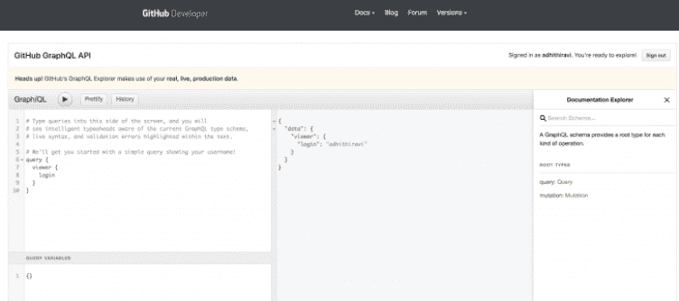
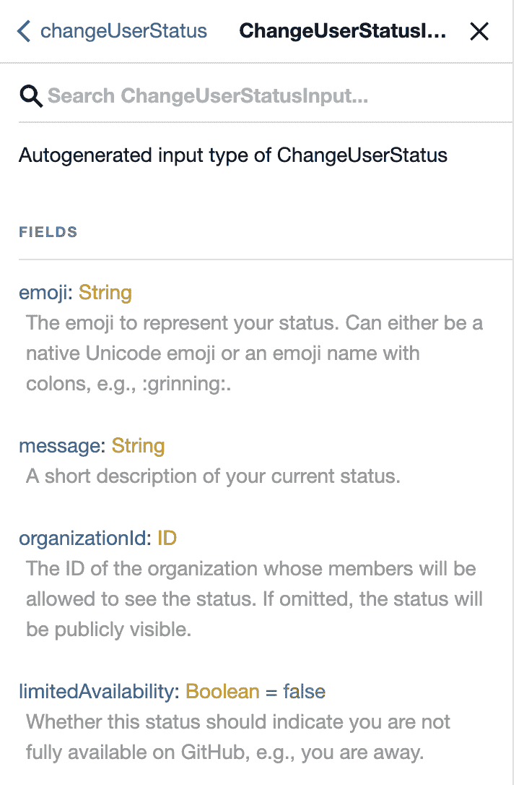

# 简单的 GraphQL 变量

> 原文：<https://blog.logrocket.com/graphql-variables-in-simple-terms/>

GraphQL 最近获得了几家公司的关注。它本质上是一种用于 API 的查询语言，提供了很好的开发体验。

在之前的博客文章中，我们学习了使用 GitHub API explorer 编写 GraphQL [查询](https://blog.logrocket.com/graphql-queries-in-simple-terms/)。如果您不确定什么是 GraphQL 查询，我建议您在开始使用 GraphQL 变量之前先阅读[这篇文章](https://blog.logrocket.com/graphql-queries-in-simple-terms/)。

GraphQL 模式可以不仅仅包含标量类型。最常用的两种类型是[查询和变异类型](https://graphql.org/learn/schema/#the-query-and-mutation-types)。要了解更多关于在 GraphQL 模式中定义类型的信息，你可以在这里阅读我们之前的文章。

## 开始使用 GitHub 的公共 API

为了演示和学习 GraphQL 变量，我将使用公众可用的 [GitHub API](https://developer.github.com/v4/) 。你可以跟着打开 https://developer.github.com/v4/explorer/的。确保您已登录 GitHub 帐户来运行查询。

GitHub explorer 是针对 API 编写和测试查询的好方法。在浏览器的左侧，您可以定义您的查询，右侧显示从服务器返回的 JSON 输出。最棒的是右边的文档浏览器。GraphQL 是自文档化的，您可以在这里浏览完整的 GraphQL 模式。



## 变量

在 GraphQL 中，您可以使用变量来重用客户端编写的带有不同参数的相同查询/变异。

首先，让我们看一个接受一些参数作为参数的查询。在这个查询中，我们将查询存储库名称和所有者 id。这个查询需要我们正在查询的存储库的名称和所有者**的名称**。

## 没有变量的查询

```
query {
  repository(name: "React", owner: "facebook") {
    name
    owner {
      id
    }
  }
}
```

## 使用变量的相同查询

现在，可以使用 GraphQL 中的变量概念编写上面的相同查询来接受动态值。客户端可以重用同一个查询来传递不同的参数(名称和所有者)。让我们看看如何使用变量来重写它。

当您开始在查询或变异中使用[变量](https://graphql.org/learn/queries/)时，需要完成三个步骤:

1.  用 **$variableName** 替换查询中的静态值
2.  将 **$variableName** 声明为查询接受的变量之一
3.  在单独的、特定于传输的(通常是 JSON)变量字典中传递 **variableName: value**

在 GraphQL explorer 中，左下方是查询变量部分:

```
 query ($name: String!, $owner: String!) {
  repository(name: $name, owner: $owner) {
    name
    owner {
      id
    }
  }
}
```

## 定义查询变量

在客户端代码中，您现在可以将不同的值作为参数传入，而不用重新构建新的查询。在 GraphQL explorer 中，您可以在标题为`Query Variables`的屏幕左下方键入查询变量:

```
{
    "name": "React",
    "owner": "facebook"
}
```

## JSON 响应

在定义了查询变量之后，现在可以运行查询来查看 JSON 的预期响应:

```
{
  "data": {
    "repository": {
      "name": "react",
      "owner": {
        "id": "MDEyOk9yZ2FuaXphdGlvbjY5NjMx"
      }
    }
  }
}
```

## 变量突变

到目前为止，我们学习了如何使用变量编写动态查询。同样的概念也适用于编写突变。让我们针对 GitHub API 编写一个变异，并使用变量值传递给变异。

我将编写一个简单的变种，来更新我在 GitHub 上的用户状态。您可以从 documentation explorer 中研究这种变异的文档。



我们将通过将参数作为变量传递来编写我们的突变。在我们的例子中，我将把`ChangeUserStatusInput`类型作为变量输入传递给变异:

```
mutation updateMyStatus($input: ChangeUserStatusInput!) {
  changeUserStatus(input: $input) {
    clientMutationId
  }
}
```

## 定义查询变量

`ChangeUserStatusInput`类型接受一个`message`参数和一个`clientMutationId`。该 ID 可以是任何唯一的数字:

```
{
  "input": {
    "message": "Writing a blog post",
    "clientMutationId": "101010101"
  }
}
```

## JSON 响应

该响应表明突变是针对`clientMutationId`执行的:

```
{
  "data": {
    "changeUserStatus": {
      "clientMutationId": "101010101"
    }
  }
}
```

## 验证发生了突变

验证突变成功发生的最好方法是查询该数据，并确保它已经在 GraphQL 服务器上更新。为了验证用户状态是否用我们编写的突变进行了更新，让我们编写一个针对服务器的查询:

```
query myStatus {
  viewer {
    status {
      message
    }
  }
}
```

## JSON 响应

这就对了。我们可以看到用户的更新状态消息。

```
{
  "data": {
    "viewer": {
      "status": {
        "message": "Writing a blog post"
      }
    }
  }
}
```


或者，我们可以通过查看我在 GitHub 上的个人资料来验证这种突变是否真的发生了。由于这些查询和变化是针对真实的生产数据编写的，我们可以通过登录 GitHub 进行验证。

你可以注意到我的状态已经更新为*“写博客”* **。**您可以尝试其他变化，也可以从实时数据中获得乐趣。

## 默认变量

GraphQL 还为我们提供了一种为变量分配默认值的方法。当没有显式定义变量值时，使用默认值。这就像一个函数在编程语言中使用默认值作为参数一样。

## 默认变量示例

让我们看一下我们的查询示例，从这篇博文的开头开始，通过名称*和所有者*来搜索存储库。我们现在用默认变量作为查询参数重写了它。**

```
query repositorySearch($name: String="react", $owner: String="facebook") {
  repository(name: $name, owner: $owner) {
    name
    owner {
      id
    }
  }
}
```

当为所有变量提供默认值时，可以调用查询而不传递任何变量。如果任何变量作为变量字典的一部分被传递，它们将覆盖缺省值。

## GraphQL 中变量的好处

**重用:**graph QL 中存在变量的原因是为了允许对不同的参数和值集重用相同的查询和变化。客户端可以只传递一组不同的变量，而不是构造一个新的查询或变异

**动态查询:**通过使用变量，GraphQL 支持可以根据传递给它的变量而变化的动态查询

**灵活性:**这也为开发人员提供了查询数据时所需的灵活性

## 结论

我希望您喜欢在本文中学习 GraphQL 变量。如果你有兴趣进一步了解 GraphQL，并对 GraphQL 有一个全面的了解，你可以在 Pluralsight 上查看我的课程 [GraphQL: The Big Picture](https://app.pluralsight.com/library/courses/graphql-big-picture/table-of-contents) 。

其他 GraphQL 文章:
[https://blog . log rocket . com/defining-types-for-your-graph QL-API/](https://blog.logrocket.com/defining-types-for-your-graphql-api/)
【https://blog.logrocket.com/graphql-fragments-explained/】
[https://blog.logrocket.com/graphql-queries-in-simple-terms/](https://blog.logrocket.com/graphql-queries-in-simple-terms/)

其他资源:
[https://graphql.org/](https://graphql.org/)
[https://graphql.org/learn/](https://graphql.org/learn/)
[https://www.graphql.com/](https://www.graphql.com/)

请在下面发表您的评论，并与您的团队和朋友分享这篇文章。稍后我会在另一篇文章中看到你。你可以在 twitter 上关注我 [@AdhithiRavi](https://twitter.com/AdhithiRavi) 了解更多更新。

## 监控生产中失败和缓慢的 GraphQL 请求

虽然 GraphQL 有一些调试请求和响应的特性，但确保 GraphQL 可靠地为您的生产应用程序提供资源是一件比较困难的事情。如果您对确保对后端或第三方服务的网络请求成功感兴趣，

[try LogRocket](https://lp.logrocket.com/blg/graphql-signup)

.

[](https://lp.logrocket.com/blg/graphql-signup)[https://logrocket.com/signup/](https://lp.logrocket.com/blg/graphql-signup)

LogRocket 就像是网络和移动应用的 DVR，记录下你网站上发生的每一件事。您可以汇总并报告有问题的 GraphQL 请求，以快速了解根本原因，而不是猜测问题发生的原因。此外，您可以跟踪 Apollo 客户机状态并检查 GraphQL 查询的键值对。

LogRocket 检测您的应用程序以记录基线性能计时，如页面加载时间、到达第一个字节的时间、慢速网络请求，还记录 Redux、NgRx 和 Vuex 操作/状态。

[Start monitoring for free](https://lp.logrocket.com/blg/graphql-signup)

.