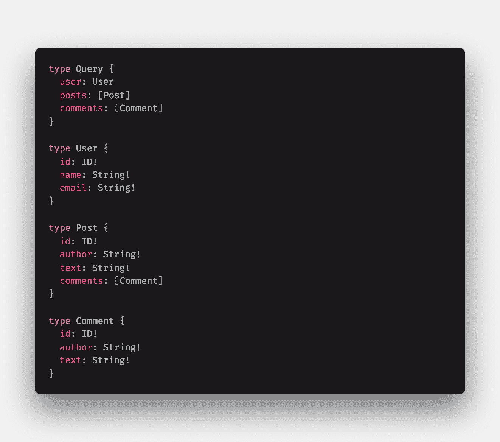
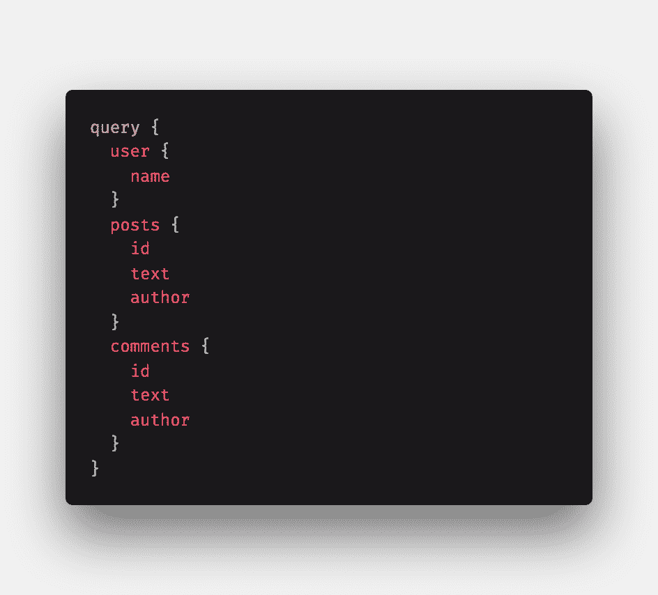
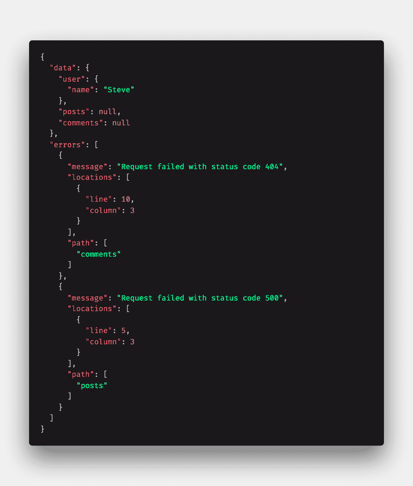

# GraphQL 与 REST:你所不知道的

> 原文：<https://blog.logrocket.com/graphql-vs-rest-what-you-didnt-know/>

## 介绍

近年来，GraphQL 已经被 API 开发人员广泛采用。GraphQL 灵活的查询语言、强类型模式、对客户端数据需求的关注、工具、社区和生态系统使其成为面向客户端的应用程序和 API 作者的绝佳选择。

开源工具和库的快速发展支持了不断增长的 GraphQL 社区，在这个阶段，GraphQL 对于前端和后端开发人员来说都是一项需要理解的重要技术。

GraphQL 通常是在与 REST 的比较中引入的，但在这一点上，这些比较非常常见，涵盖了 GraphQL 和 REST 之间的许多基本差异。本文不再重复这些观点，而是将重点放在 GraphQL 和 REST 之间一些更细微的差异上。

这里的信息应该对任何希望理解更高级主题的 GraphQL 初学者或考虑采用或迁移到 GraphQL 的团队有益。总的来说，本文将讨论三个主要话题:

1.  HTTP 语义
2.  请求错误
3.  安全影响

## REST 直接利用 HTTP

### HTTP 语义

web 服务的 REST APIs 倾向于构建在 HTTP 之上，并利用核心 HTTP 特性，例如 [HTTP 请求方法](https://developer.mozilla.org/en-US/docs/Web/HTTP/Methods)、 [HTTP 响应状态代码](https://developer.mozilla.org/en-US/docs/Web/HTTP/Status)和 [HTTP 缓存](https://developer.mozilla.org/en-US/docs/Web/HTTP/Caching)。

例如，想象一个典型的 REST API 端点`/user`。一个设计良好的 REST API 会有类似于`GET /user`、`POST /user`、`PUT /user`和`DELETE /user`的各种操作，分别对应于获取、创建、更新和删除一个用户资源。

这些语义用 HTTP 进行了标准化，并允许 API 用户从 API 获得可预测和可理解的行为。一个好的 REST API 将为它支持的各种资源重用这些语义，并且消费者应该很容易理解什么 API 请求对应于特定的资源操作。

相比之下，GraphQL 提供了三种基本的模式类型:`Query`、`Mutation`和`Subscription`。获取数据被归入查询，而突变描述了创建、更改或删除数据的操作。

然而，这些操作的实现完全取决于 GraphQL API 的作者，并且该规范对资源如何建模没有任何限制。GraphQL 的重点更多的是如何查询数据，而不是如何对资源建模。

GraphQL 服务器可能会提供一个用户查询和相关的变异，比如`updateUser`、`deleteUser`等等。但是这些名字都很主观。也许用户查询被称为`getUser`或`fetchUser`，而不仅仅是`user`。也许更新操作叫做`changeUser`甚至`putUser`。在 GraphQL API 中，这些相关的“用户”操作并没有内在的联系。

GraphQL 提供了很好的 API 文档和内置的可发现性，以及诸如模式自省和 GraphQL 接口之类的工具，但是您可以想象如何在一个具有几十或几百个已定义对象类型的 GraphQL 模式中更新一些资源是多么困难。

这比依赖 HTTP 动词(如`GET`、`PUT`和`POST`)要简单得多，这些动词都在单个资源端点上操作。再次强调，重要的是要记住，在实践中，REST APIs 经常会偏离严格遵循 HTTP，并且它并不总是像针对您正在寻找的特定操作使用特定的 HTTP 动词那样简单。

### 贮藏

REST APIs 也可以充分利用 [HTTP 缓存](https://developer.mozilla.org/en-US/docs/Web/HTTP/Caching)。通常，web 应用程序将返回带有响应数据的 HTTP 标头，这些标头向客户端提供有关如何缓存返回数据的信息。

现代浏览器附带了 HTTP 缓存实现，可以在 HTTP 层自动提供缓存。这允许应用程序缓存经常请求的资源，而无需在客户端代码中包含任何特定的逻辑。应用程序可以只查询资源，任何缓存的资源都应该立即返回。这对性能、用户体验和网络数据使用非常重要。

在 GraphQL 应用程序中，客户端请求都是 HTTP POST 请求，完全绕过了标准的 HTTP 缓存机制。正因为如此，GraphQL 客户端应用程序倾向于使用像 [Apollo](https://www.apollographql.com/) 或 [Relay](https://facebook.github.io/relay/) 这样的 GraphQL 客户端库。这些库为被查询的数据提供了一种缓存机制，这种机制依赖于被查询对象类型的全局惟一 id(更多关于 GraphQL 缓存的信息，请点击)。

这非常强大，但是需要开发人员做更多的工作才能获得缓存的全部好处。它还引入了一个新的表面错误，这可能很难跟踪和修复([一个例子](https://kamranicus.com/posts/2018-03-06-graphql-apollo-object-caching))。这种额外的复杂性可能很难理解，并且可能会增加新工程师入职时听到的声音。

## 响应错误

### 错误代码

正如 HTTP 请求使用标准化的 HTTP 动词来描述不同类型的操作一样，HTTP 提供了特定的失败代码来描述响应错误状态。例如，告诉任何开发人员一个状态代码为`401`、`404`或`500`的请求失败，他们会立即明白这意味着什么以及为什么请求失败(如果他们也知道状态代码为`418`会加分！).

此错误代码是 response 对象的一部分，可以被解析并用于以编程方式确定应用程序如何响应失败的请求。例如，`404`表示找不到资源，`401`表示用户无权执行他们请求的任何操作。

此外，每个 HTTP 请求都会明确地导致成功或失败状态。很明显，应用程序“知道”HTTP 请求的结果。

然而，在 GraphQL 中，情况完全不同。首先，GraphQL 查询可以映射到许多不同的解析函数，其中任何一个都可能失败。因此，响应可能同时部分成功，部分失败。例如，考虑这样一个 GraphQL 模式:



Sample GraphQL schema.

以及对一些数据的查询:



Sample data query.

现在，假设查询对象`user`、`posts`和`comments`有不同的解析函数，并且`posts`和`comments`的解析器由于某种原因失败了。您将会收到如下响应数据:



Partial error response.

我们来看看发生了什么！整个查询没有失败。事实上，即使`user`查询失败，您也会得到类似的失败响应。整个响应返回 HTTP 状态代码`200`；HTTP 层没有成败之分。

此外，对于 GraphQL 请求，没有整体成功或失败的感觉(除非请求与提供的模式不匹配或者存在网络错误)，因为一些对象可能被成功提取，而其他对象可能导致错误。

要开始理解请求的错误状态，您必须尝试直接解析响应数据。如果仔细观察，`errors`响应是一个对象数组，其中每个对象都包含一些关于失败的特定查询`path`的信息。

您将看到一个序列化的消息，其中包含一个原因，它只是一个字符串。确定特定查询是否失败以及失败的原因包括解析这个错误数组以及解析每个错误对象。

* * *

### 更多来自 LogRocket 的精彩文章:

* * *

您需要构建一些特定的逻辑来提取错误信息，并尝试确定失败的原因。提取状态代码或任何服务器发送的错误消息并不容易，因为 GraphQL 字符串将整个错误响应放入这个`message`字段。

与 REST API 相比，使用 GraphQL 跟踪这些不同的失败模式并为您的应用程序确定正确的结果并不简单，在 REST API 中，每个请求都有明确的成功或失败状态，如果失败，还有明确的失败原因。此外，GraphQL 仍在发展，错误处理的故事很可能会随着时间的推移而改进。

## GraphQL 安全影响

### 模式自省

GraphQL 向 API 消费者呈现了一个非常不同的 API 表面。例如，默认情况下，大多数 GraphQL 服务器实现都提供模式自省或信息性错误消息，例如:

```
"message": "Cannot query field \"login\" on type \"Mutation\". Did you mean \"loginUser\"?",
```

通过禁用自省等特性来混淆生产中的 GraphQL 模式，将使任何不良行为者更难理解如何针对您的 API 发出请求(同样，他们总是可以猜测或观察来自您的应用程序的网络流量，以理解您的 API 接受什么数据)。

这里另一个非常酷的模式是使用持久化查询，专门将应用程序使用的查询列入白名单，并将它们映射到某个哈希或键。然后，您的请求实际上提供了那个键，而不是查询名称本身。

此外，您的 GraphQL 服务器可以被设计为拒绝任何与白名单查询模式不匹配的查询。这减少了网络带宽的使用，并提高了应用程序的安全性，因为有人试图误用您的 API，从而增加了很多摩擦。关于持久化查询的更多信息，您可以在这里或者这里查看。

### 限速

通常，应用程序在每个用户、每个请求甚至每个 IP 的基础上限制 API 的速率，以控制使用并减少 DDoS 尝试或其他 API 误用。这对于传统的 REST API 来说相当简单。

但是，使用 GraphQL，您可以在一个查询中对整个 GraphQL 模式发出一个请求。或者，您可以对相同的数据发出几个较小的请求。如何有效地限制这些不同的使用模式？

GraphQL 的新兴实践是在每个对象或每个字段的基础上限制速率和/或使用查询成本/复杂性分析来实现速率限制。查询复杂性是一种静态分析查询的方法，用于确定服务器处理查询的复杂程度。

例如，在一次查询中请求几十个文档将比只查询一个文档更“复杂”。成本/复杂性可以通过查询深度、数量、限制(分页偏移量)等来衡量。这个想法是根据请求的复杂程度来限制请求的速率，而不是根据特定时间段内请求的数量。

已经有许多为此目的而设计的开源工具和库——例如，`[graphql-rate-limit](https://github.com/teamplanes/graphql-rate-limit)`、`[graphql-cost-analysis](https://github.com/pa-bru/graphql-cost-analysis)`、`[graphql-validation-complexity](https://github.com/4Catalyzer/graphql-validation-complexity)`和`[graphql-query-complexity](https://github.com/slicknode/graphql-query-complexity)`。

要了解这方面的更多信息，请看一下 [GitHub 对其公共 v4 API 的资源限制](https://developer.github.com/v4/guides/resource-limitations/)的描述，该 API 依赖于 GraphQL。这是一个非常有趣的、真实的例子，说明了这个问题是如何处理的。

### DDoS 攻击

除了查询复杂性之外，现代 web 应用程序需要认识到的一个常见安全漏洞是分布式拒绝服务(DDoS)攻击，在这种攻击中，一个不良行为者协调许多机器对一个应用程序发出大量请求，以使系统离线。

其他服务器也存在这种漏洞，但是在 GraphQL 服务器的情况下，您的 API 模式可能会暴露潜在的复杂且昂贵的查询模式，这很容易使您的系统崩溃。想象一下对某个博客的查询，该博客的评论系统允许递归地回复评论，如下所示:


A very expensive query.

并不是所有的 GraphQL 模式都会公开这样的查询，但是这种查询的计算和返回代价可能会非常高。一个坏人用一台机器就能发出几十个这样的请求，并有可能使您的系统瘫痪。

这将是一种独特而罕见的情况，但重要的是要意识到；攻击者肯定热衷于寻找这样的技巧。上面提到的方法，如通过查询成本限制速率或使用持久化查询，可以用来缓解类似这样的问题。[本文](https://blog.apollographql.com/securing-your-graphql-api-from-malicious-queries-16130a324a6b)更深入地讨论了如何保护 GraphQL 应用程序。

## 结论

GraphQL 采用了一种完全不同的 API 设计方法，带来了许多好处和优势，但也带来了独特的挑战和差异。GraphQL、REST 或任何其他方法都没有好坏之分，但它们都有自己独特的设计考虑、约束和权衡。

在这里，我们看到了 GraphQL 和 REST 之间一些更高级的差异。我们讨论了 HTTP 语义、错误处理和安全含义，REST 开发人员在采用 GraphQL 时可能会发现这些内容出乎意料。

希望本文有助于阐明 GraphQL 和 REST 之间的一些更微妙的差异，并能帮助您更好地理解在考虑任一选择时的权衡和妥协。

## 监控生产中失败和缓慢的 GraphQL 请求

虽然 GraphQL 有一些调试请求和响应的特性，但确保 GraphQL 可靠地为您的生产应用程序提供资源是一件比较困难的事情。如果您对确保对后端或第三方服务的网络请求成功感兴趣，

[try LogRocket](https://lp.logrocket.com/blg/graphql-signup)

.

[](https://lp.logrocket.com/blg/graphql-signup)[https://logrocket.com/signup/](https://lp.logrocket.com/blg/graphql-signup)

LogRocket 就像是网络和移动应用的 DVR，记录下你网站上发生的每一件事。您可以汇总并报告有问题的 GraphQL 请求，以快速了解根本原因，而不是猜测问题发生的原因。此外，您可以跟踪 Apollo 客户机状态并检查 GraphQL 查询的键值对。

LogRocket 检测您的应用程序以记录基线性能计时，如页面加载时间、到达第一个字节的时间、慢速网络请求，还记录 Redux、NgRx 和 Vuex 操作/状态。

[Start monitoring for free](https://lp.logrocket.com/blg/graphql-signup)

.