# 我们能从 GraphQLConf 2021 中学到什么

> 原文：<https://blog.logrocket.com/graphqlconf-2021-round-up/>

GraphQLConf 2021 在几周前举行，许多优秀的演讲者就 GraphQL 生态系统中正在讨论的几个热门话题发表了演讲，包括:

视频是[最近上传的](https://www.youtube.com/playlist?list=PL5SvzogSTpeGhfTmXTOv22CCHPIDoz-px)，所以我抽空全部看了一遍；选择了一些关于模式拼接、联邦、架构设计和电子商务的演讲；并在本文中对它们进行了总结。尽情享受吧！

## 模式拼接:丰富无头 GraphQL 架构中的数据

在这个视频中，Roy Derks [通过](https://www.youtube.com/watch?v=hNNB7eNL-qk&list=PL5SvzogSTpeGhfTmXTOv22CCHPIDoz-px&index=4) [`@graphql-tools/stitch`](https://www.graphql-tools.com/docs/schema-stitching/stitch-combining-schemas) 向我们展示了一个使用模式拼接的例子，并提供了一个带有演示代码的 [GitHub repo。](https://github.com/royderks/headless-schema-stitching)

模式拼接是将来自不同服务的 GraphQL 模式组合成一个统一的 GraphQL 模式的艺术。目标是产生一个网关服务，我们可以通过它访问我们公司的所有服务。

模式拼接最初是由 Apollo 引入的，但是他们决定停止它，转而支持 Apollo Federation。最近，[公会](https://the-guild.dev/)接手了这个概念，重新实现并改进了之前的设计，产生了一个解决方案，这个方案[为联邦](https://www.youtube.com/watch?v=hOdGL3DepDM)提供了相当的好处，同时提供了一种更简单的思考问题的方式。

Roy [使用模式拼接](https://blog.logrocket.com/improve-microservice-architecture-graphql-api-gateways/)来演示如何组合来自两个外部服务的数据:

1.  一个内容管理系统，在`localhost:3001`下可用(作为模拟)
2.  一个电子商务 API，在`localhost:3002`下可用(作为模拟)

这两个数据源还与来自本地 GraphQL 服务器的模式相结合，可在`localhost:3000`下获得。

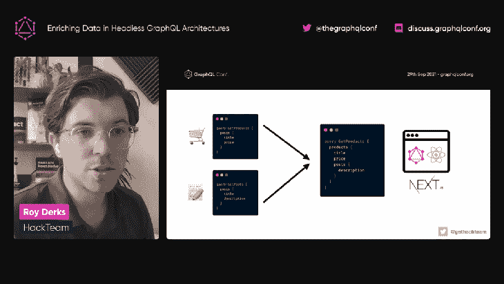

Accessing a unified GraphQL schema — Screenshot from Roy Derks’ talk

所采用的堆栈基于:

在 [`api/graphql.js`](https://github.com/royderks/headless-schema-stitching/blob/65f8f861f37440b8929ade43738691b6efe2295a/pages/api/graphql.js) 下创建一个来自 Next.js 的 API 路由，在`localhost:3000/api/graphql`下公开 GraphQL 端点。我们可以通过 GraphQL Playground 与它交互，方法是在浏览器中打开端点的 URL:

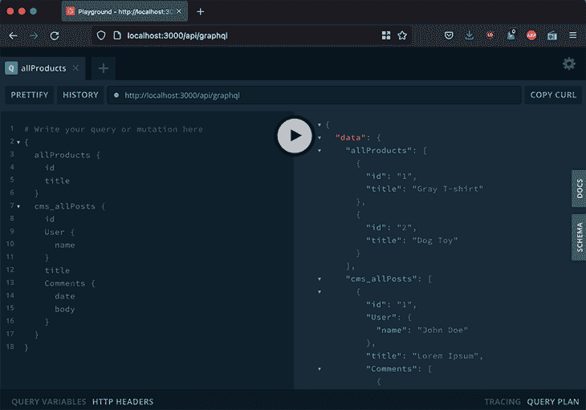

An image of the GraphQL Playground

API 路由中用于合并模式的相关代码，最简单的形式如下:

```
let localSchema = makeExecutableSchema({
    // Code here to create the local GraphQL schema
});

export default async function grapqhl(req, res) {
  // Setup subschema configurations
  const localSubschema = { schema: localSchema };

  const cmsSubschema = await createRemoteSchema({
    url: 'http://localhost:3001/graphql/'
  });

  const productsSubschema = await createRemoteSchema({
    url: 'http://localhost:3002/graphql/',
  });

  // Build the combined schema and set up the extended schema and resolver
  const schema = stitchSchemas({
    subschemas: [localSubschema, productsSubschema, cmsSubschema]
  });
}

```

这段代码使用`makeExecutableSchema`设置本地 GraphQL 模式，使用`createRemoteSchema`从`localhost:3001/graphql`和`localhost:3002/graphql`加载远程 GraphQL 模式，最后使用`stitchSchemas`将它们合并在一起。

接下来，我们需要将模式彼此关联起来，这样我们就可以通过帖子的用户 id(由外部 CMS 提供)来检索产品(由电子商务 API 提供):

```
{
  cms_allPosts { # This data comes from the CMS
    id
    User {
      name
      Products { # This data comes from the e-commerce API
        id
        title
      }
    }
  }
}

```

组合模式在`stitchSchemas`中配置:

```
// Build the combined schema and set up the extended schema and resolver
const schema = stitchSchemas({
  subschemas: [localSubschema, productsSubschema, cmsSubschema],
  typeDefs: `
    extend type Product {
      cmsMetaData: [Cms_Product]!
    }
  `,
  resolvers: {
    Product: {
      cmsMetaData: {
        selectionSet: `{ id }`,
        resolve(product, args, context, info) {
          // Get the data for the extended type from the subschema for the CMS
          return delegateToSchema({
            schema: cmsSubschema,
            operation: 'query',
            fieldName: 'cms_allProducts',
            args: { filter: { id: product.id } },
            context,
            info,
          });
        },
      },
    },
  },
});

```

最后，我们必须检查不同的模式是否在相同的类型或字段名称下公开它们的数据。例如，电子商务 API 也可能有一个名为`Post`的类型，和/或暴露在字段`allPosts`下，从而产生冲突。

避免这些冲突是通过`createRemoteSchema`的`transforms`参数实现的，它允许我们将一个模式中的类型和字段重命名为其他模式。在这种情况下，我们让 CMS 中的子模式将其类型`Post`重命名为`Cms_Post`，并将字段`allPosts`重命名为`cms_allPosts`:

```
const cmsSubschema = await createRemoteSchema({
  url: 'http://localhost:3001/graphql/',
  transforms: [
    new RenameRootFields(
      (operationName, fieldName, fieldConfig) => `cms_${fieldName}`,
    ),
    new RenameTypes((name) => `Cms_${name}`),
  ],
});

```

我们最终可以执行一个查询，从所有独立的服务中获取数据，通过一个统一的模式进行访问:

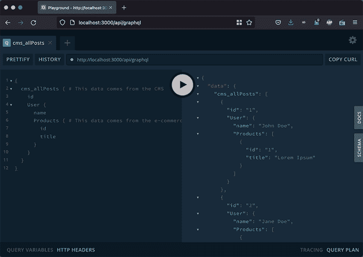

Executing a GraphQL query from a merged schema — Screenshot from Roy Derks’s talk

如前所述，如果你想[看代码为](https://github.com/royderks/headless-schema-stitching)的回购协议或者[看完整的 GraphQLConf 视频](https://www.youtube.com/watch?v=hNNB7eNL-qk&list=PL5SvzogSTpeGhfTmXTOv22CCHPIDoz-px&index=4)，这里有链接。

## 具有数据联合的 GraphQL 与基于 GraphQL 服务的联合

Tanmai Gopal 是 Hasura 的联合创始人兼首席执行官，这是一项通过 Postgres 提供实时 GraphQL APIs 的服务。

Hasura 目前正在构建他们自己的联邦版本，该版本基于与 Apollo 联邦不同的架构。在他的演讲中，坦迈向我们介绍了哈苏拉的联邦解决方案试图解决的所有挑战，以及为什么[阿波罗联邦的方法](https://blog.logrocket.com/the-what-when-why-and-how-of-federated-graphql/)无法解决这些挑战。

Tanmai 首先描述了什么是联邦，以及何时以及为什么使用联邦是合理的:

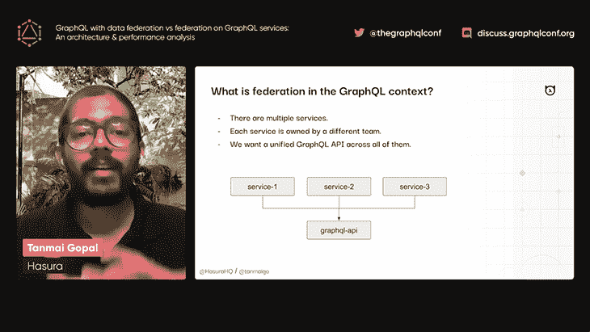

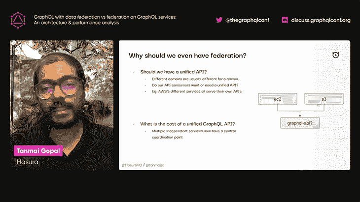

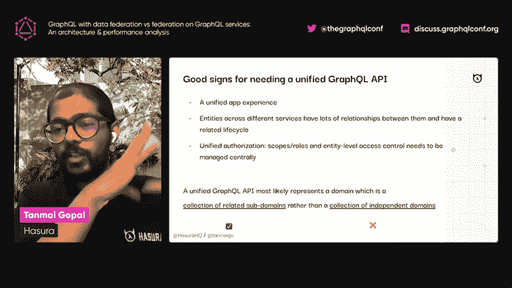

然后，Tanmai 深入探讨了关于联邦的两种不同的思考方式:

1.  GraphQL 服务的联合(Apollo 采用的方法)，让每个底层源执行它的查询部分
2.  联邦数据上的 GraphQL，它在解析查询之前集中来自不同服务的数据

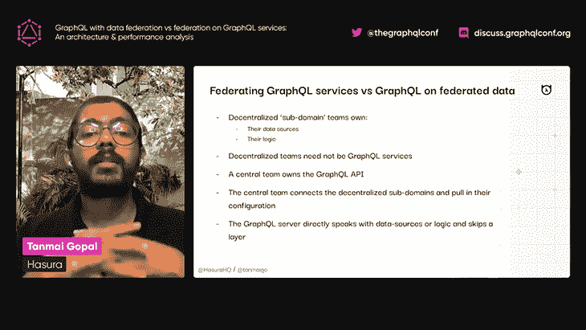

Tanmai 随后解释说，虽然这两种不同的方法产生相同的结果，但在联邦数据上使用**graph QL**方法时，性能会有相当大的提高:

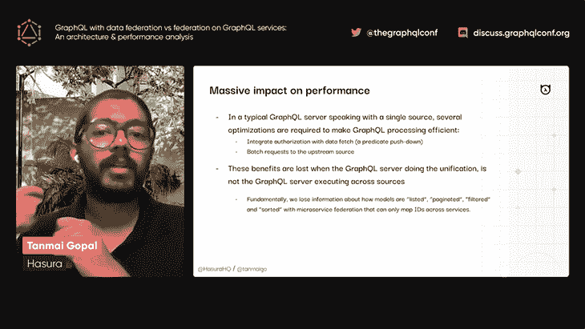

Tanmai 提供了几个示例查询来描述为什么联合 GraphQL 服务不能很好地伸缩。他强调，不同服务之间的数据聚合是无法有效完成的，因为在解决包含跨服务的跨数据库连接的复杂查询时，网关没有一个针对所有涉及子域的实体的统一上下文。

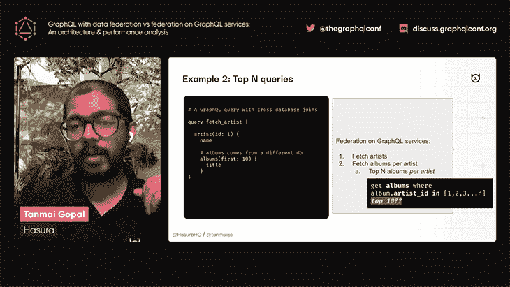

最后，Tanmai 解释说，Hasura 正在开发一个基于使用 GraphQL 和联邦数据的解决方案，它能够从不同的服务获取所有相关数据，并从一个集中的位置解析查询，而不是让每个服务解析自己的查询部分，从而为复杂的查询提供更好的性能。

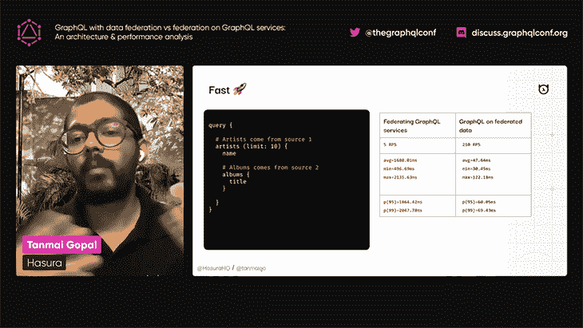

为了比较 Apollo 和 Hasura 的联合方法，我们需要再等一会儿:Tanmai 承诺这个新功能将很快推出，但没有提到具体时间。Hasura 网站也没说，目前也没有文档。目前，我们只有这次会议的报告。

然而，我认为 Hasura 的方法比 Apollo 的更具限制性，因为它很可能依赖于 Hasura 的基础设施来运行，并且它的吸引力很大程度上取决于 Hasura 的服务价格。另一方面，Apollo Federation 被设计为一种基于指令分割图的方法，因此它不需要任何外部工具或基础设施(尽管 Apollo 也提供了[托管联邦](https://www.apollographql.com/docs/federation/managed-federation/setup/)),使用 GraphQL 中预先存在的语法。

最后，应该将 Hasura 的联邦方法与 GraphQL 工具的模式拼接进行对比，正如我们在前面的演讲中看到的，后者可以以更简单的方式提供相同的结果。

[在这里看视频](https://www.youtube.com/watch?v=3ZUpIfpXx8U&list=PL5SvzogSTpeGhfTmXTOv22CCHPIDoz-px&index=6)。

## 迁移 GitHub 的全局 id

Andrew Hoglund 是 GitHub API 团队的高级软件工程师。在他的演讲中，Andrew 分享了他的团队目前如何将 [GitHub 的 GraphQL API](https://docs.github.com/en/graphql) 中的所有实体的全局标识符迁移到不同的格式，他们为什么这样做，以及他们遇到的挑战。

我们可以通过查询任何对象上的字段`id`来可视化全局 ID 的格式。例如，获取 [`leoloso/PoP`](https://github.com/leoloso/PoP) 存储库对象的 ID 可以通过这个 GraphQL 查询来完成:

```
{
  user(login: "leoloso") {
    repository(name: "PoP") {
      id
    }
  }
}

```

执行查询时，我们获得以下响应:

```
{
  "data": {
    "user": {
      "repository": {
        "id": "MDEwOlJlcG9zaXRvcnk2NjcyMTIyNw=="
      }
    }
  }
}

```

存储库对象的 ID 是`MDEwOlJlcG9zaXRvcnk2NjcyMTIyNw==`。这种格式具有以下属性:

*   它是 base64 编码的
*   包含对象类型和对象 ID
*   它应该是不透明的

解码 ID，例如通过 Bash 命令，将揭示存储的信息:

```
$ echo `echo MDEwOlJlcG9zaXRvcnk2NjcyMTIyNw== | base64 --decode`
010:Repository66721227

```

基础数据`010:Repository66721227`包括:

*   校验和
*   对象类型
*   数据库 ID

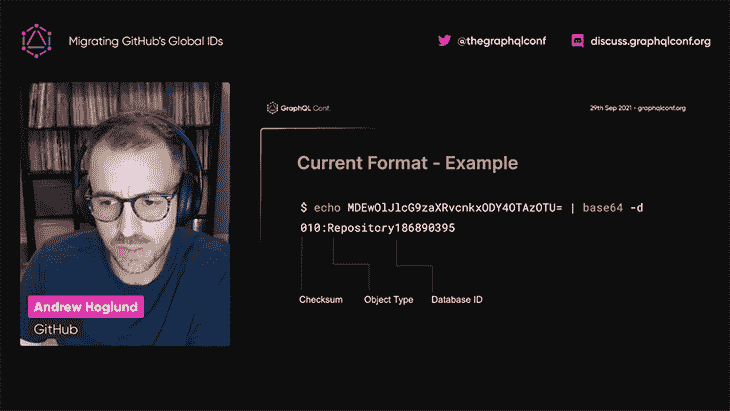

这种简单的格式最初很适合 GitHub，因为 GitHub 将其数据存储在一个数据库中。实体的全局 ID 已经提供了在数据库中定位实体和检索其数据所需的所有信息:

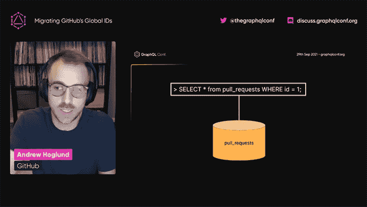

一段时间后，GitHub 使用 [Vitess](https://vitess.io/) 迁移到一个[分片数据库](https://en.wikipedia.org/wiki/Shard_(database_architecture))，这是一个数据库中数据的水平分区。数据库碎片可以提高性能，因为通过将所有数据分布在多个数据库中，每个数据库表的行数将减少，从而减少索引大小并加快搜索速度，并且不同的碎片可以放置在不同的机器上，这允许您针对不同的数据优化硬件。

当查询分片数据库时，全局 ID 格式变得不合适，即使它仍然可以用于检索数据，因为实体的数据将只存在于一个数据库中，而不存在于所有分片中，并且全局 ID 不会指示数据位于哪个数据库中。

为了定位数据，GitHub 的 GraphQL API 必须对所有数据库执行查询，其中只有一个数据库会产生匹配，这使得查询执行效率非常低:

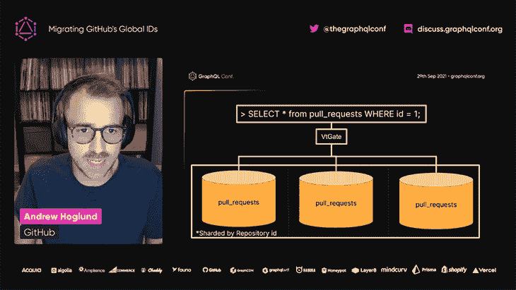

因此，GitHub API 团队决定将全局 ID 迁移到一种新的格式，这种格式还将提供包含实体数据的数据库的名称，因此可以再次有效地检索它:

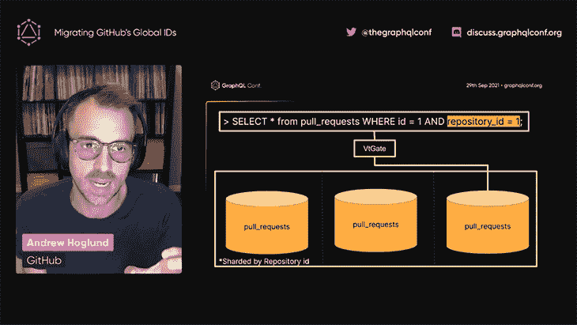

这种新格式比以前的更复杂。它由两个元素组成:

*   类型提示，指示实体的类型
*   所有权方案，包含检索该类型实体所需的数据

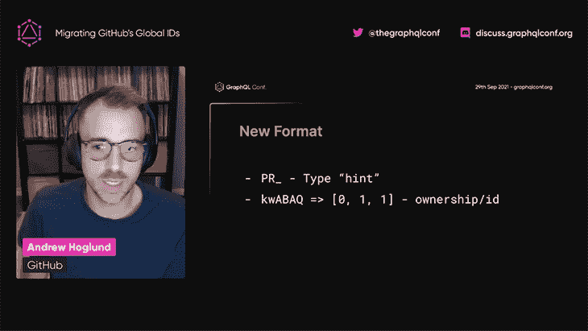

所有权方案是按实体定制的，因为不同的实体需要标识不同的数据。例如，工作流运行需要触发它的拉请求的 ID。

这种新格式运行良好，允许 GitHub 解决当前的问题并预测未来的一些问题。特别是，GitHub 最终可能会将其数据存储在多区域设置中，并且新格式还可以指示存储数据的区域的名称。

因为这种新的 ID 格式与以前的不兼容，GitHub 将需要实现一个缓慢、渐进的部署，以确保它不会中断服务。对于这项任务，GitHub 设置了一个弃用期，在此期间两种 ID 格式将共存，并创建了一些工具来帮助服务从旧格式迁移到新格式:

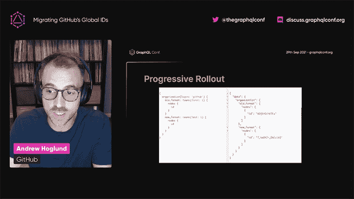

你可以[w](https://www.youtube.com/watch?v=Ogml3n3NRps&list=PL5SvzogSTpeGhfTmXTOv22CCHPIDoz-px&index=16)观看视频了解更多。

## 使用 GraphQL 支持电子商务

Stuart Guest-Smith 是 BigCommerce 的首席架构师。在[的演讲](https://www.youtube.com/watch?v=OfrZnwn4awM&list=PL5SvzogSTpeGhfTmXTOv22CCHPIDoz-px&index=18)中，Stuart 探讨了商家如何利用 GraphQL 构建高性能、可扩展和个性化的电子商务体验。

斯图尔特在演讲开始时宣称:

> 电子商务要求公司快速、灵活和个性化。GraphQL 在很大程度上使这成为可能。

电子商务服务通常会包含多个软件，其中包括:

*   企业资源规划
*   订单管理系统(OMS)
*   产品信息管理
*   客户关系管理
*   内容管理系统

GraphQL 使我们能够访问和关联来自所有这些后端系统的数据，实现了电子商务的最新趋势之一“可组合商务”:

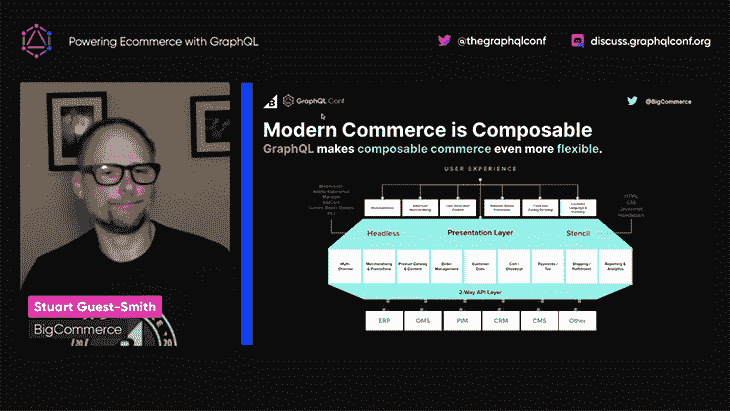

来自这些多个后端系统的数据可以通过 GraphQL API 访问到不同的前端，例如:

*   电子商务店面
*   原生移动应用
*   无头 CMS
*   无头数字体验平台(DXP)
*   自定义渐进式 Web 应用程序(PWA)店面

这种灵活性使我们能够为用户创造个性化的增强体验。

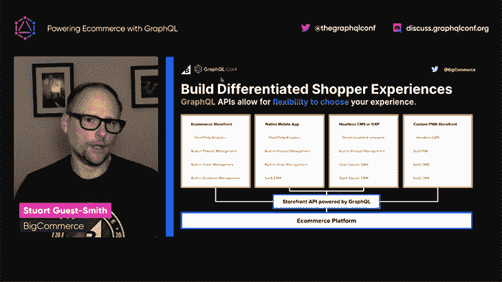

Stuart 然后解释说，GraphQL 可以通过使用 [BfF 架构模式](https://samnewman.io/patterns/architectural/bff/)作为多个电子商务后端和多个前端之间的接口，该模式旨在提供定制的后端用户体验。

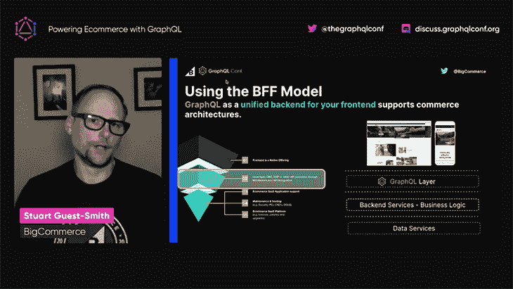

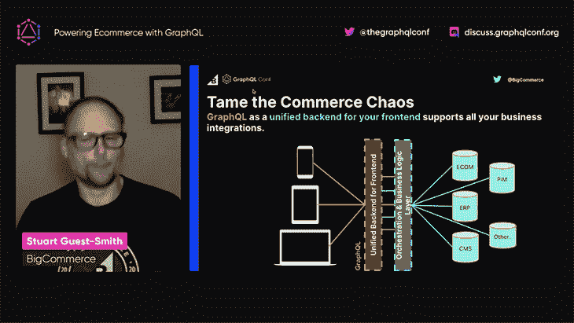

GraphQL 有助于提高性能，因为它可以只检索所需的数据，而不会出现不足或过量提取。但是除此之外，我们还必须添加一个缓存层，并管理查询的复杂性(否则会有恶意参与者执行昂贵的查询的风险，这会降低系统的速度):

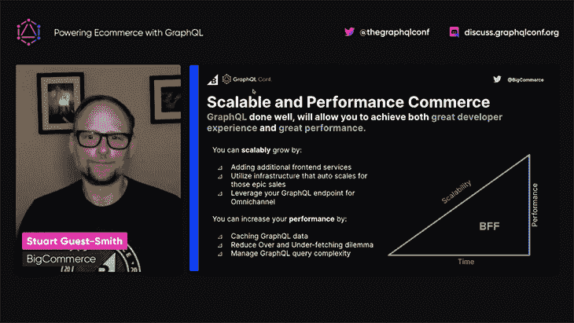

最后，Stuart 解释说，GraphQL 为电子商务带来的最重要的好处之一是客户体验的个性化:


你可以在这里观看 [完整](https://www.youtube.com/watch?v=OfrZnwn4awM&list=PL5SvzogSTpeGhfTmXTOv22CCHPIDoz-px&index=18) [视频。](https://www.youtube.com/watch?v=OfrZnwn4awM&list=PL5SvzogSTpeGhfTmXTOv22CCHPIDoz-px&index=18)

## 结论

[GraphQLConf 2021](https://graphqlconf.org/) 让我们一瞥目前正在[GraphQL 生态系统](https://blog.logrocket.com/tag/graphql)中讨论的内容，表明 GraphQL 推出五年后仍有大量开发在进行，新的方法正在被创建以满足社区的持续需求。

本文总结了四个不同的新发展:

*   Roy Derks 解释了如何使用新的`@graphql-tools/stitch`库进行模式拼接
*   Tanmai Gopal 展示了 Hasura 如何创建一个与 Apollo Federation 竞争的服务
*   Andrew Hoglund 分享了 GitHub GraphQL API 的全局 ID 格式是如何迁移到一种新格式中的，这种新格式可以支持数据库分片和多区域设置
*   Stuart Guest-Smith 解释了如何使用 BfF 模式利用 GraphQL 来实现可组合商业和个性化用户体验

即使 GraphQL 已经很成熟了，但看到新的发展正在发生，这是非常令人兴奋的！要了解还发生了什么，[查看 graphqlcof 2021](https://www.youtube.com/playlist?list=PL5SvzogSTpeGhfTmXTOv22CCHPIDoz-px)的所有视频。

## 监控生产中失败和缓慢的 GraphQL 请求

虽然 GraphQL 有一些调试请求和响应的特性，但确保 GraphQL 可靠地为您的生产应用程序提供资源是一件比较困难的事情。如果您对确保对后端或第三方服务的网络请求成功感兴趣，

[try LogRocket](https://lp.logrocket.com/blg/graphql-signup)

.

[](https://lp.logrocket.com/blg/graphql-signup)[https://logrocket.com/signup/](https://lp.logrocket.com/blg/graphql-signup)

LogRocket 就像是网络和移动应用的 DVR，记录下你网站上发生的每一件事。您可以汇总并报告有问题的 GraphQL 请求，以快速了解根本原因，而不是猜测问题发生的原因。此外，您可以跟踪 Apollo 客户机状态并检查 GraphQL 查询的键值对。

LogRocket 检测您的应用程序以记录基线性能计时，如页面加载时间、到达第一个字节的时间、慢速网络请求，还记录 Redux、NgRx 和 Vuex 操作/状态。

[Start monitoring for free](https://lp.logrocket.com/blg/graphql-signup)

.