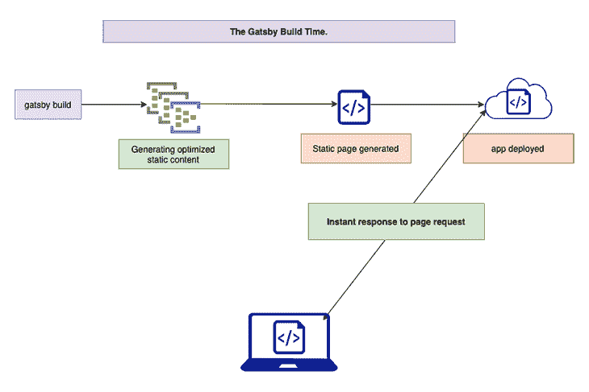

# Guess.js 和 Gatsby 站点优化

> 原文：<https://blog.logrocket.com/guess-js-gatsby-site-optimization/>

[Guess.js](https://guess-js.github.io/) 是一个库和工具的集合，使用预测分析来增强用户体验。

虽然 [Gatsby.js 开箱即可提供出色的性能优化](https://blog.logrocket.com/is-gatsby-really-that-great-e7b19c4c1c05/)，但本文将解释如何将 Guess.js 集成到 Gatsby 站点中，以提高站点效率和 UX。

## 介绍

Gatsby.js 是一个现代的基于 React 的静态站点生成器(SSG)。静态站点生成器是用于创建静态站点的发布工具。这些站点主要由包含部署到服务器的 HTML 文件和资源的文件夹组成。

尽管传统的 web 开发栈也从数据、内容和模板生成页面，但是这个过程只在用户请求页面时才开始——在请求时。每当客户请求一个页面时，就要重复构建页面，因此，随着您的站点越来越受欢迎，页面访问量越来越大，构建页面所用的时间也会增加。这对网站的性能有负面影响。

另一方面，使用 SSGs，页面构建过程在构建时完成。

通过在构建时开始页面构建，SSG 体系结构防止了页面构建随着站点页面视图的增加而持续增加(在请求时)。由于所有页面都是在构建时构建的，因此服务器在响应用户的页面请求时只需发送一个文件。使用这种方法，页面浏览量的增加不会影响你的网站的性能，最终改善用户体验。

有不同的 SSG，每种都有不同的实现方式。然而，我们上面讨论的基本原则对每一个都适用。

在本文中，我们将关注 Gatsby.js，这是一个基于 React 的 SSG，以其[速度](https://blog.logrocket.com/faster-page-load-times-with-link-prefetching/)、插件和直白而闻名。

## Gatsby.js 如何工作

### `gatsby develop`对`gatsby build`

Gatsby.js 有两个编译站点的命令，每个命令都有不同的用例。这些命令是:

1.  `gatsby develop`
2.  `gatsby build`

`gatsby develop`命令用于启动开发服务器，该服务器支持实时重载和 [Gatsby GraphiQL Explorer](https://www.gatsbyjs.com/docs/running-queries-with-graphiql/) 等功能。Gatsby Explorer 允许开发人员在运行时与 Gatsby 站点和数据浏览器进行交互。

另一方面,`gatsby build`命令应该在你完成站点开发后运行。它创建了一个具有生产就绪优化的站点版本。当运行`gatsby build`命令时，它打包您站点的配置、数据和代码。它还创建你站点的所有静态 HTML 页面，然后将[再水合](https://www.gatsbyjs.com/docs/glossary/#hydration)到 React 应用程序中。

当您运行`gatsby build`命令时，Node.js 服务器在幕后驱动整个构建过程。

在构建时，Gatsby 产生优化的静态内容(HTML、CSS、JavaScript、图像等。)通过调用服务器端 API。

### 服务器端呈现(SSR)

Gatsby 使用 Node.js 服务器从 JavaScript 模块生成静态 HTML 页面的过程被称为[服务器端呈现](https://blog.logrocket.com/prefetching-dynamic-routing-next-js/)，或 SSR。Gatsby 生成我们站点的所有静态内容(HTML 页面、图像等)。)并将该内容部署到服务器，然后可以在浏览器中请求和呈现该内容。

通过在构建时执行 SSR，Gatsby 能够提前构建您的整个站点(使用优化的数据和页面)。这极大地影响了站点的性能，因为服务器可以立即响应用户请求，而不需要在每次用户请求页面时都重复构建。

下图对此进行了详细说明:



Gatsby 站点可以即时加载，因为服务器可以通过 SSR 支持的预建页面立即响应用户请求。在下一节中，我们将看看 Gatsby 站点如何通过使用 Guess.js 实现额外的性能优化。

## 使用 Guess.js 进行性能优化

### Guess.js 是什么？

Guess.js 是一组与框架无关的工具和库，使用智能预取增强用户体验。

Guess.js 使用一种称为[预测预取](https://blog.logrocket.com/using-resource-hints-to-optimize-performance/)的技术进行智能预取。它从谷歌分析(Google Analytics)等来源获取分析数据，并使用这些数据智能地预取用户最有可能请求的资源。

假设一个站点有以下页面:主页、关于、联系我们和新闻。我们可以使用谷歌分析来确定用户从主页访问这些页面的可能性。例如，GA 可能会告诉我们，用户有 96%的机会从主页访问新闻页面，但只有 4%的机会访问联系我们页面。

在这种情况下，我们的应用程序会在用户仍在主页时预取新闻页面数据，因为用户很有可能会导航到下一个页面。另一方面，预取联系我们页面没有什么明智的理由，因为只有 4%的用户会走这条路。

当我们将 Guess.js 集成到 Gatsby 应用程序中时，它允许我们的 Gatsby 应用程序下载 Google Analytics 数据，然后使用这些数据来形成预取哪些资源的模型。

在下一节中，我们将探索如何将 Guess.js 集成到 Gatsby 站点中。

## 将 Guess.js 与 Gatsby.js 一起使用

如前所述，《盖茨比》以其直白和外挂而闻名。一如既往，将 Guess.js 集成到 Gatsby 应用程序中非常简单，只需要安装和配置另一个 Gatsby [插件](https://www.gatsbyjs.com/plugins/gatsby-plugin-guess-js/)—Gatsby-plugin-guess-js——不需要复杂的代码逻辑或 webpack 配置。

要将 Guess.js 添加到您的 Gatsby 站点，请按照以下步骤操作:

首先，通过运行以下命令安装 gatsby-plugin-guess-js 插件:

```
npm install gatsby-plugin-guess-js
```

或者:

```
yarn add gatsby-plugin-guess-js
```

然后，在您的`gatsby-config.js`中，添加插件配置，如下所示:

```
    module.exports = { 
      plugins: [
        ...
        { 
          resolve: "gatsby-plugin-guess-js", 
          options: { 
              // Find the view id in the Goggle Analytics > Admin > view settings
              GAViewID: `VIEW_ID`,
          }, 
        }
        ...
      ], 
    }

```

(如果您愿意，您可以在这里获得更高级的配置[。)](https://www.gatsbyjs.com/plugins/gatsby-plugin-guess-js/#how-to-use)

接下来，通过重新启动服务器来重建应用程序:

```
gatsby develop
```

或者，通过构建应用程序:

```
gatsby build
```

最后，如果在重建期间配置成功，将要求 Guess.js 使用您的 Google 帐户授权 Guess.js，以便访问构建预测预取模型所需的 Google Analytics 数据。

当 Guess.js 成功集成到 Gatsby 网站中时， [gatsby-plugin-guess-js](https://www.gatsbyjs.com/plugins/gatsby-plugin-guess-js/) 插件下载谷歌分析数据，以创建预测预取的模型。有了这些数据，插件会在用户最有可能访问的页面上添加`<link prefetch>`,因为网站的 HTML 页面正在生成。

当用户使用你的网站或应用程序时，插件将继续预测和预取用户最有可能访问的页面资源，从而提高你的网站性能和用户体验。

## 结论

Guess.js 是一个革命性的、与框架无关的性能优化工具。它通过机器学习和用户行为分析，为 Gatsby 网站带来了预测性预取。通过更好地理解用户的旅程，Guess.js 可以帮助你提高网站的速度和用户的整体体验。

## 使用 LogRocket 消除传统反应错误报告的噪音

[LogRocket](https://lp.logrocket.com/blg/react-signup-issue-free)

是一款 React analytics 解决方案，可保护您免受数百个误报错误警报的影响，只针对少数真正重要的项目。LogRocket 告诉您 React 应用程序中实际影响用户的最具影响力的 bug 和 UX 问题。

[ ](https://lp.logrocket.com/blg/react-signup-general) [  ](https://lp.logrocket.com/blg/react-signup-general) [LogRocket](https://lp.logrocket.com/blg/react-signup-issue-free)

自动聚合客户端错误、反应错误边界、还原状态、缓慢的组件加载时间、JS 异常、前端性能指标和用户交互。然后，LogRocket 使用机器学习来通知您影响大多数用户的最具影响力的问题，并提供您修复它所需的上下文。

关注重要的 React bug—[今天就试试 LogRocket】。](https://lp.logrocket.com/blg/react-signup-issue-free)