# 将 Google 登录添加到 React 应用的指南

> 原文：<https://blog.logrocket.com/guide-adding-google-login-react-app/>

有时候，我们只想使用一个应用程序，却没有耐心先用我们的电子邮件和密码注册和登录。我们也可能只是想尝试一下应用程序，而不想为此创建一个新帐户。

同时，应用程序的所有者需要知道他们的应用程序有多少用户，并且希望得到关于谁在使用应用程序以及如何使用的反馈。为了获得这些统计数据，他们需要用户注册他们的电子邮件。

这两种情况让用户和应用程序所有者都有点尴尬。这就是谷歌登录功能发挥重要作用的地方。

由于谷歌是世界上最受欢迎的电子邮件平台，允许用户使用谷歌登录你的 React 应用程序消除了用户和应用程序所有者之间的摩擦。用户几乎可以立即开始使用应用程序，而不必创建一个全新的帐户。

在本文中，我们将了解 Google 登录是如何工作的，以及如何使用名为`@react-oauth/google`的新 Google 身份服务 SDK 将其添加到 React 应用程序中。

*向前跳转:*

要学习本教程，您应该在本地计算机上安装 React，并熟悉如何使用它。如果您已经安装了 React，那么您应该已经安装了 Node.js、npm 和 Yarn。

## 安装将 Google 登录添加到 React 应用程序所需的包

要使用谷歌登录，我们需要安装 [`@react-oauth/google`](https://www.npmjs.com/package/@react-oauth/google) 包。这是谷歌新的身份服务 SDK 它允许我们将 Google 登录功能集成到 React 应用程序中。此外，`@react-oauth/google`允许我们获得快速安全地访问所有 Google APIs 所需的访问令牌。

但是，在我们安装并开始将 Google 登录整合到 React 应用程序之前，我们首先需要获得一个 Google 客户端 ID。

## 为您的项目获取一个 Google 客户端 ID

客户端 ID 是与帮助客户端和服务器进行 OAuth 2.0 认证的应用程序相关联的唯一标识符。

要从谷歌获取客户端 ID，请转到您的[谷歌云控制台](https://console.cloud.google.com/)并创建一个新项目。对于本文，我将该项目命名为“Google 登录”，但是您可以随意命名:

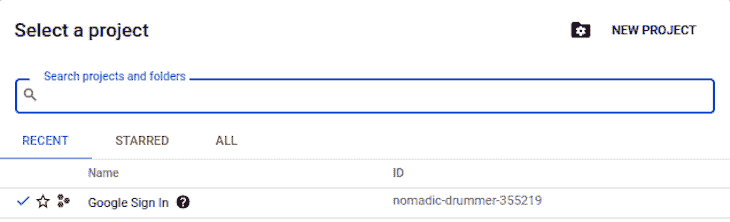

创建一个项目后，单击项目名称，您将看到一个类似下图的仪表板。您当前的项目名称应该显示在仪表板的左上角，Google Cloud 徽标旁边:

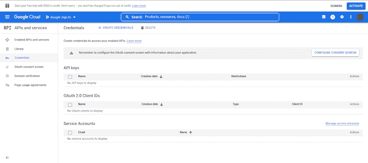

现在，让我们回顾一下在创建您的凭据之前如何配置您的同意屏幕。

## 为 React 应用程序配置 Google 登录许可屏幕

同意屏幕，顾名思义，是提示用户使用外部或第三方库登录的同意页面。这一步提醒用户，他们正在离开你的应用程序的根页面，并允许访问第三方页面。

简而言之，当您使用 OAuth 2.0 进行授权时，您的应用程序会请求用户授权来自 Google 帐户的一个或多个访问范围。访问范围包括您的应用程序允许访问的任何信息或活动，或在用户帐户上进行的任何活动。

您的应用程序向用户显示的 Google 登录许可屏幕可能包括对您的项目、其政策和请求的访问范围的简要描述。

一个简单的同意页面可能如下所示:


要为 React 应用程序配置 Google 同意页面，请转到 Google Cloud 控制台左侧菜单中的“OAuth 同意屏幕”选项卡。

进入该选项卡后，选择外部——这实际上是唯一可以选择的选项，除非您使用的是经过 Google 验证的组织或应用程序——并单击**创建**按钮创建您的同意屏幕:

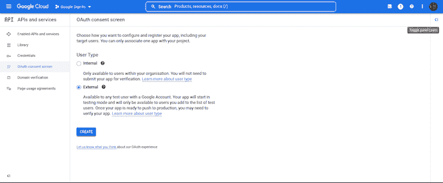

接下来，在同一个选项卡中，为您的应用程序选择一个名称和一个电子邮件地址，以便在项目发生任何更改时获得通知。您可以暂时将其他需求和选项保留为空。如果您已经准备好了详细信息，您可以根据需要在此步骤中添加它们:

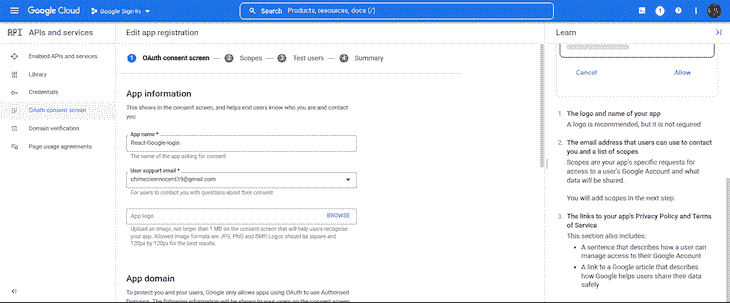

您也可以暂时跳过其余的注册部分。只需在每个部分向下滚动，点击**保存并继续**，直到完成后返回仪表板。

## 创建您的 web 客户端 ID

接下来，在左侧菜单中，单击**凭证**选项卡，转到您可以创建 web 客户端 ID 的页面。

在这个页面上，点击页面顶部的**创建凭证**，然后选择 **OAuth 客户端 ID** 选项:

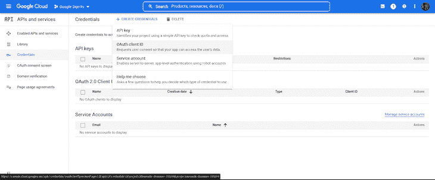

系统将提示您选择应用程序类型，如下所示。如果您正在为 React 应用程序执行这些步骤，请选择 **Web 应用程序**(因为我们在 Web 上使用 Google 客户端 ID):

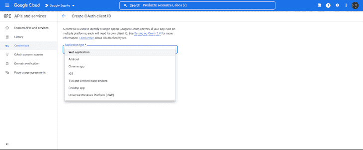

如果您将它集成到 React Native、Flutter 或 Swift 应用程序中，您可以为这两个操作系统分别选择 Android 或 iOS 选项。

接下来，我们将为我们的客户端 ID 选择一个名称。这个名称只是用来记录或定义我们正在创建的特定 ID。例如，如果我们正在创建 web、iOS 和 Android ID，我们可以在它们的命名约定中包括“Web ID”、“Android ID”、“iOS ID”等等，以区分它们。

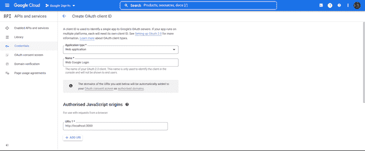

接下来，我们还将添加两种类型的 URL:授权的 JavaScript 源和授权的重定向 URL。

授权的 JavaScript 源 URL 是您的应用程序发起登录的 URL；例如，对于 React 开发人员来说是 localhost 和 localhost:3000，如果您已经托管了您的应用程序，则是您的托管 URL。

授权重定向 URL 是登录成功后 Google 将用户重定向到的链接。例如，您可能希望将用户带回到您的原始链接，或者可能将用户重定向到另一个链接。无论哪种方式，你都必须在这里包含网址。

对于授权的 JavaScript 源和授权的重定向 URL，添加本地主机 URL:[http://localhost:3000](http://localhost:3000/)和 [http://localhost](http://localhost) ，像这样:

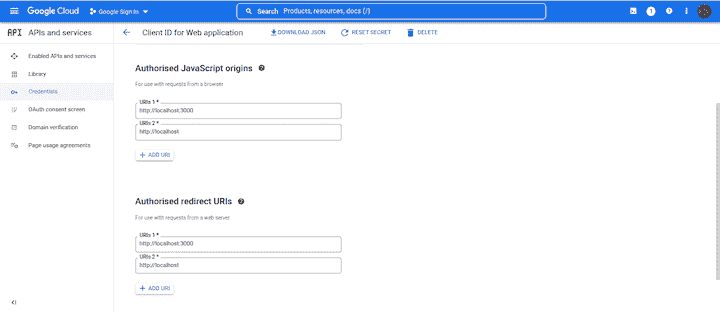

最后，点击**创建**按钮来创建您的 web 客户端 ID。您将被带回到主页，在那里您将看到您新创建的凭据。单击复制图标复制您的新 web 客户端 ID:

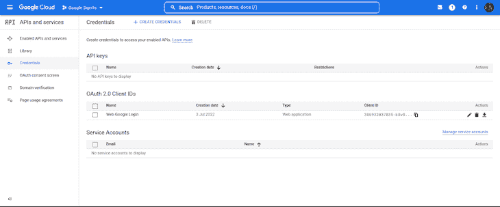

现在我们已经成功创建了 web 客户端 ID，让我们进入 React 应用程序，安装它，然后集成 Google 登录。

## 将所有这些与`@react-oauth/google`放在一起

要使用 Google 登录包，我们首先需要安装它。运行以下任一命令来安装该软件包:

```
//Npm
npm install @react-oauth/[email protected]

//Yarn
yarn add @react-oauth/[email protected]

```

安装后，我们将使用 GoogleOAuthProvider 包装我们的应用程序，然后提供我们的 Google web 客户端 ID。这是为了让我们的整个 React 应用程序可以访问一次 Google Auth Provider。

在我们的`index.js`文件中，我们将这样包装应用程序；

```
/*index.js*/

import React from 'react';
import ReactDOM from 'react-dom';
import { GoogleOAuthProvider } from '@react-oauth/google';
import App from './App';

ReactDOM.render(
    <GoogleOAuthProvider clientId="386932037035-k8v833noqjk7m4***********.apps.googleusercontent.com">
        <React.StrictMode>
            <App />
        </React.StrictMode>
    </GoogleOAuthProvider>,
    document.getElementById('root')
);

```

就像 React 中的每个安装包一样，我们必须首先导入模块，然后才能使用它。所以在你的 React 应用里面，转到`App.js`文件，复制下面的代码；

```
/*App.js*/

import React from 'react';
import { GoogleLogin } from '@react-oauth/google';

function App() {
    const responseMessage = (response) => {
        console.log(response);
    };
    const errorMessage = (error) => {
        console.log(error);
    };
    return (
        <div>
            <h2>React Google Login</h2>
            <br />
            <br />
            <GoogleLogin onSuccess={responseMessage} onError={errorMessage} />
        </div>
    )
}
export default App;

```

上面的代码是展示如何使用 Google 登录的一个非常简单的方法。我们从`@react-oauth/google`导入了`GoogleLogin`模块，并在我们的组件中调用它。接下来，我们创建了两个函数，如果登录成功，控制台将记录一个响应，如果登录不成功，控制台将记录一个错误。

您也可以将两个函数合并成一个函数，并使用条件来呈现它。

下面是我们在浏览器中测试上述代码时的样子:

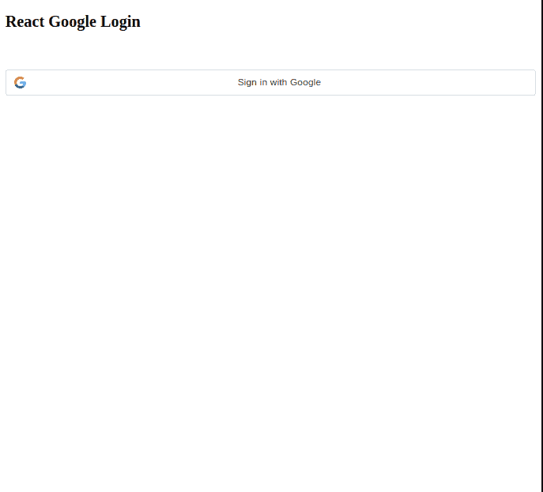

点击**使用 Google** 按钮登录，将会出现一个同意屏幕或模式，如下所示:

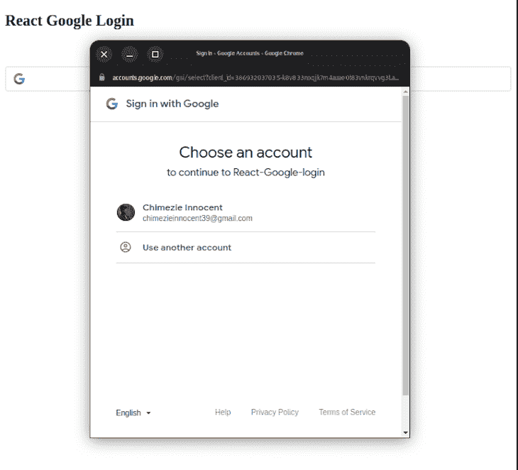

现在，我们已经看到了如何将 Google 登录添加到 React 应用程序中，让我们更进一步，获取用户的详细信息，以便在我们的应用程序中创建用户配置文件。我们只会将用户重定向到一个主页，然后获得用户的电子邮件，姓名和图像。

## 根据用户的 Google 档案在 React 应用程序中创建用户档案

将 Google login 与我们的应用程序集成在一起，可以让我们访问用户的个人资料，包括用户名、电子邮件地址、图片、`accessToken`等等。我们将使用这些信息来创建我们的用户资料。

不过，在我们的`App.js`组件中，让我们用下面的代码替换我们现有的代码:

```
/*App.js*/

import React, { useState, useEffect } from 'react';
import { googleLogout, useGoogleLogin } from '@react-oauth/google';
import axios from 'axios';

function App() {
    const [ user, setUser ] = useState([]);
    const [ profile, setProfile ] = useState([]);

    const login = useGoogleLogin({
        onSuccess: (codeResponse) => setUser(codeResponse),
        onError: (error) => console.log('Login Failed:', error)
    });

    useEffect(
        () => {
            if (user) {
                axios
                    .get(`https://www.googleapis.com/oauth2/v1/userinfo?access_token=${user.access_token}`, {
                        headers: {
                            Authorization: `Bearer ${user.access_token}`,
                            Accept: 'application/json'
                        }
                    })
                    .then((res) => {
                        setProfile(res.data);
                    })
                    .catch((err) => console.log(err));
            }
        },
        [ user ]
    );

    // log out function to log the user out of google and set the profile array to null
    const logOut = () => {
        googleLogout();
        setProfile(null);
    };

    return (
        <div>
            <h2>React Google Login</h2>
            <br />
            <br />
            {profile ? (
                <div>
                    
                    <h3>User Logged in</h3>
                    <p>Name: {profile.name}</p>
                    <p>Email Address: {profile.email}</p>
                    <br />
                    <br />
                    <button onClick={logOut}>Log out</button>
                </div>
            ) : (
                <button onClick={() => login()}>Sign in with Google 🚀 </button>
            )}
        </div>
    );
}
export default App;

```

在上面的代码中，我们从`@react-oauth/google`导入了`googleLogout`和`useGoogleLogin`。

API 允许我们使用自定义按钮登录谷歌。也就是说，如果我们不想使用`@react-oauth/google`提供的`GoogleLogin`按钮，我们可以设计我们喜欢的按钮，然后使用`useGoogleLogin` API 向我们提供的`clientId`发出登录请求。

如果请求成功，我们在`useGoogleLogin`仍然提供的`onSuccess`函数中处理它，但是如果请求失败，我们在`onFailure`函数中处理错误。

接下来，在我们的`onSuccess`函数中，我们用返回的数据设置我们的配置文件状态。这些数据包含用户的详细信息，如`google_id`、`access_token`、电子邮件、姓名等等。在用户数组发生任何变化时，我们的`useEffect`钩子将运行，并使用从 Google login 返回的访问令牌获取用户详细信息。用户是一个依赖关系，以确保在用户数组的任何变化，即从空数组到当我们从谷歌登录得到响应，`useEffect`将被监视，然后相应地触发。

最后，我们使用一个条件来改变我们的 UI:如果 profile 是`true`，UI 将向我们显示已登录用户的概要，以及他们的图像、姓名和电子邮件。如果配置文件变为空(即，当用户使用`GoogleLogout`按钮注销时)，它将向我们显示登录按钮:

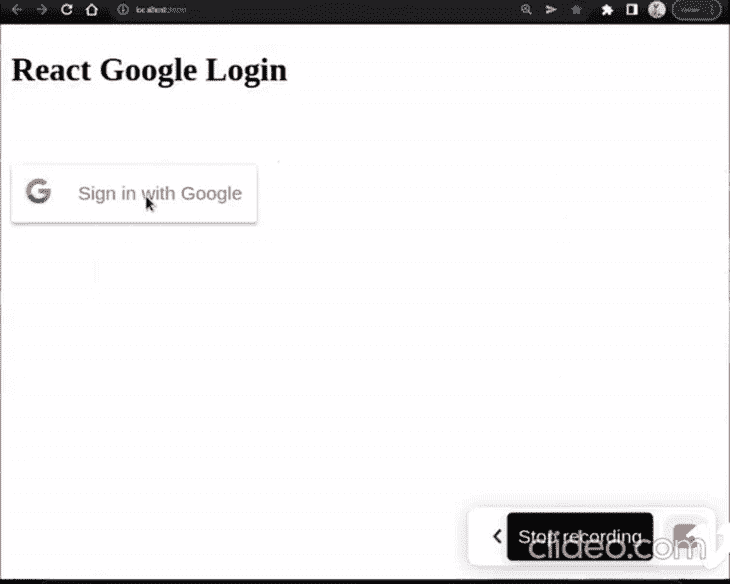

## 结论

Google 登录是我们的应用程序中包含的一个重要功能，可以节省时间并改善用户体验。添加这个特性的另一个重要原因是它的实现和使用都非常快速和简单。

在本教程中，我们回顾了如何使用`@react-oauth/google`向 React 应用程序添加 Google 登录。对于另一种方法，了解如何使用 Firebase 来处理谷歌认证和登录你的 React 应用。
我希望你觉得这篇文章既容易理解，又对你自己的项目有帮助。

## 使用 LogRocket 消除传统反应错误报告的噪音

[LogRocket](https://lp.logrocket.com/blg/react-signup-issue-free)

是一款 React analytics 解决方案，可保护您免受数百个误报错误警报的影响，只针对少数真正重要的项目。LogRocket 告诉您 React 应用程序中实际影响用户的最具影响力的 bug 和 UX 问题。

[ ](https://lp.logrocket.com/blg/react-signup-general) [  ](https://lp.logrocket.com/blg/react-signup-general) [LogRocket](https://lp.logrocket.com/blg/react-signup-issue-free)

自动聚合客户端错误、反应错误边界、还原状态、缓慢的组件加载时间、JS 异常、前端性能指标和用户交互。然后，LogRocket 使用机器学习来通知您影响大多数用户的最具影响力的问题，并提供您修复它所需的上下文。

关注重要的 React bug—[今天就试试 LogRocket】。](https://lp.logrocket.com/blg/react-signup-issue-free)