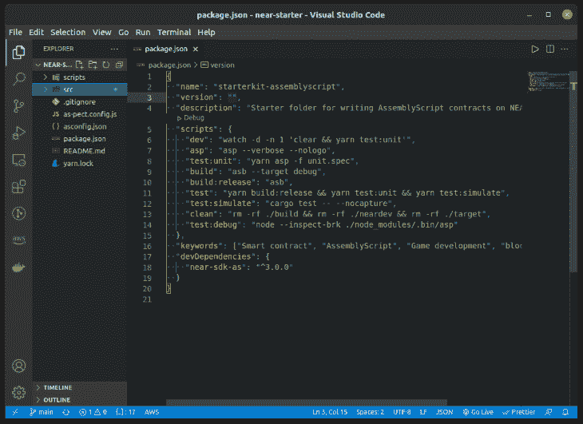

# 区块链游戏开发指南

> 原文：<https://blog.logrocket.com/guide-blockchain-game-development/>

区块链开发在过去几年中发展迅速，现在正被软件开发的各个领域所采用。从去中心化应用程序(DApps)，到去中心化财务(DeFi)软件，到 NFTs，再到 DAOs，区块链技术已经渗透到广泛的行业，并服务于许多用例。

在本教程中，我们将探索区块链游戏开发的新兴趋势。基于区块链的游戏也被称为链游戏。一旦您理解了编写智能合约并将其部署到区块链中所涉及的基本结构，您就可以使用加密领域中可用的工具来构建游戏。

我们将构建一个彩票游戏来演示游戏开发如何在区块链上进行。我们还将回顾在区块链游戏中实现交易的基本结构。然后，我们将它部署到一个 testnet 网络。

## 什么是区块链？

区块链的底层数据结构是一串链表，或唯一的“块”添加到链中的每个块都自动链接到添加的前一个块，并且前一个块也指向它的前一个块。

这个链表链本身就是一个事务列表。在将这些块添加到列表列表数据结构之前，对它们达成一致的过程是区块链给我们的关键创新:协议。该协议帮助网络决定如何将块添加到链中。

这一决策过程催生了区块链的分权性质。工作证明(PoW)、获取证明(PoS)和授权证明(PoA)是分散的机制，通过这些机制，在块被添加到链中之前，做出并同意这些决定。

通过这些区块链出现的加密货币是一种激励人们运行软件来保护这些区块链周围网络的手段。

像附近的[这样的区块链平台提供了一个加密的安全平台，用于使用](https://near.org/)[智能合约](https://blog.logrocket.com/smart-contract-programming-languages/)存储、更新和删除区块链中的数据。

## Web3 游戏开发

在区块链的上下文中，Web3 指的是在区块链上运行的分散式应用程序。这些应用程序允许任何人参与，而无需将他们的个人数据货币化。有了这些区块链所支持的编程语言的良好知识，我们就可以开始编写智能合约来构建区块链上的 DApps 游戏应用程序。

随着区块链生态系统的演变，新的范式出现了。从 De-Fi 生态系统中汲取灵感，区块链游戏生态系统也发展成了 GameFi。GameFi 也称为 [play to earn](https://coinmarketcap.com/view/play-to-earn/) ，它通过将其普通用户转变为游戏行业重大决策背后的主导力量，引入了一种新的游戏方式。

GameFi 在交易贵重物品以及通过代币和[不可替代代币](https://blog.logrocket.com/how-to-create-nfts-with-javascript/)产生额外收入方面促进了玩家拥有的经济。这意味着围绕特定游戏建立社区，这些游戏的用户可以赚取加密货币或在游戏元宇宙内(以及在游戏外)有价值的资产。

## 在区块链附近写智能合同

在本教程中，我们将通过构建一个示例游戏项目来演示如何在区块链附近构建游戏。

在这个游戏中，我们将探索如何建立代码库结构和编写在区块链附近运行的智能合同所需的编程语言。当我们全部完成后，我们将在本地环境中测试我们的应用程序，然后将我们的智能合同部署到一个 testnet。

我们将克隆一个初学者工具包代码库。这个库提供了一个基本的样板文件，当我们构建游戏的各种功能时，可以在其上编写更多的智能契约代码。

```
git clone https://github.com/IkehAkinyemi/lottery-smart-contract.git

```

成功执行上述命令后，将目录更改为`lottery-smart-contract`文件夹。您可以在任何文本编辑器中打开它；对于本教程，我们将使用 Visual Studio 代码。

从终端，在文件夹目录中运行`code .`命令。



上图显示了一个 NEAR 项目的基本文件夹结构，该项目使用 [AssemblyScript](https://www.assemblyscript.org/) 作为其智能合约。

`script`文件夹包含用于编译智能合约并将其部署到区块链的 shell 源文件。`src`包含了`lottery`文件夹，在里面我们将为我们的智能契约编写必要的代码。

剩下的文件是 AssemblyScript 需要理解在 Near 上定义的一些类型的配置文件。`near-sdk-as`库是用于在 AssemblyScript 中开发接近智能合约的包的集合。

## 如何在区块链附近建立一个彩票游戏

通过这个游戏，我们将探索使用 AssemblyScript 在区块链附近编写智能合同的一些基本概念。

运行`yarn install`或`npm install`命令来安装`near-sdk-as`库和任何必要的依赖项。

接下来，创建一个名为`assembly`的文件夹。在这个文件夹中，创建两个文件:`index.ts`和`model.ts`。`model.ts`文件包含了不同的对象类型，我们将在`index.ts`文件的整个代码中使用它们。`model.ts`文件包含以下内容:

```
import { RNG } from "near-sdk-as";

@nearBindgen
export class Lottery {
  private luckyNum: u32 = 3;

  constructor() {
    const randGen = new RNG<u32>(1, u32.MAX_VALUE);
    this.id = "LO-" + randGen.next().toString();
  }
}

```

在上面的代码中，我们定义了一个`Lottery`类型。这代表了彩票游戏类型的结构。我们将在其中定义我们希望可用的不同接口——公共接口和私有接口——就像无符号整数 private `luckyNum`变量一样。

* * *

### 更多来自 LogRocket 的精彩文章:

* * *

使用`RNG`(随机数生成器)对象，我们将游戏的`this.id`变量初始化为一个随机数。在`randGen`变量中，我们只是初始化`RNG`对象，而通过`randGen.next`函数，我们使用传递给它的种子值`<u32>(1, u32.MAX_VALUE)`生成一个随机数。

### 定义函数接口

现在让我们来定义我们游戏的`play`特性。这将包含负责在一组整数范围内生成随机数的代码片段。

```
import { RNG, logging } from "near-sdk-as";

@nearBindgen
export class Lottery {
  ...

  play(): bool {
    const randGen = new RNG<u32>(1, u32.MAX_VALUE);
    const pickNum = randGen.next();

    logging.log("You picked: " + pickedNum.toString());

    return pickedNum === this.luckyNum
  }
}

```

通过`play`函数，任何玩家都可以使用`RNG`对象调用它来生成一个随机数。然后，我们导入了`logging`对象，它让我们可以访问本地控制台上的输出值——这是我们的本地机器终端。

`play`函数返回一个`bool`值，这个`true`或`false`值是比较`pickedNum`和`this.luckyNum`的结果，以确定猜测的数字是否等于彩票游戏中定义的`luckyNum`。

接下来，我们将定义`reset`函数。顾名思义，这将使我们能够将`this.luckyNum`重置为一个新的随机数:

```
...
@nearBindgen
export class Lottery {
  ...

  reset(): string {
    const randGen = new RNG<u32>(1, u32.MAX_VALUE);
    const randNum = randGen.next();
    assert(randNum !== this.luckyNum, "Rerun this function to generate a new random luckyNum");

    this.luckyNum = randNum;
    return "The luckyNum has been reset to another number";
  }
}

```

在上面的代码中，我们生成了另一个新的随机数。使用`assert`函数，我们将其与当前的`this.luckyNum`值进行比较。

如果比较结果为`true`，那么函数的其余代码将继续执行。如果没有，函数将在该点停止，并返回断言消息`Rerun this function to generate a new random luckyNum`。

当`assert`为真时，我们将变量`this.luckyNum`赋给新生成的数字`randNum`。

### 定义`Player`对象

对于彩票游戏的每个玩家，我们将定义一个基本的类型结构。这种结构将玩家呈现在我们的游戏中。

用以下代码更新`model.ts`文件:

```
import { RNG, logging, PersistentVector, Context } from "near-sdk-as";

export type AccountID = string;

@nearBindgen
export class Lottery {
  ...
}

@nearBindgen
export class Player {
  id: AccountId;
  guesses: PersistentVector<bool>;

  constructor(isRight: bool) {
    this.id = Context.sender;
    this.guesses = new PersistorVector<bool>("g"); // choose a unique prefix per account

    this.guesses.push(isRight);
  }
}

```

`Player`对象类型包含两个接口:变量`this.id`，它是一个`AccountID`类型，和`this.guesses`，它是一个布尔值数组。

`PersistentVector`数据结构是数组数据类型。在初始化过程中，我们使用`Context`对象通过`Context.sender`函数获取这个智能契约的当前调用者。然后，我们把它赋给`this.id`。

对于`this.guesses`，我们初始化一个新的`[PersistentVector](https://near.github.io/near-sdk-as/modules/_sdk_core_assembly_collections_persistentvector_.html)`对象，并将其分配给`this.guesses`。然后，使用`PersistorVector`上可用的`push`函数接口，我们将一个新的布尔值`isRight`添加到`this.guesses`变量中。

让我们定义在下一节定义核心函数时将使用的其他类型和变量:

```
...
exsport const TxFee = u128.from("500000000000000000000000");
export const WinningPrize = u128.from("100000000000000000000000");
export const Gas: u64 = 20_000_000_000_000;

...

export const players = new PersistentMap<AccountID, Player>("p")
...

```

### 定义核心游戏功能

在`assembly`文件夹中创建一个`index.ts`文件。这是我们定义彩票游戏核心功能的地方。

在`index.ts`文件中，定义一个`pickANum`函数，如下所示:

```
import { TxFee, Lottery, Player, players } from "./model";
import { Context, u128 } from "near-sdk-as";

export function pickANum(): void {
  verifyDeposit(Context.attachedDeposit);
  const game = new Lottery();
  const guess = game.play();
  let player;

  if (players.contains(Context.sender)) {
    player = players.get(Context.sender) as Player;
    player.guesses.push(guess);
    players.set(Context.sender, player);
  } else {
    player = new Player(guess);
  }
}

function verifyDeposit(deposit: u128): void {
  assert(deposit >= TxFee, "You need 0.5 NEAR tokens to pick a number");
}

```

在上面的函数中，我们在彩票游戏的任何玩家可以调用任何调用来玩智能合约上的游戏之前，验证 0.5 的近令牌存款。这样的话，我们的玩家在玩游戏之前是要支付一定的钱的。此外，一旦玩家开始游戏，我们会在玩家数据结构中更新该玩家的个人资料。

接下来，让我们定义一个函数，该函数将通过随机生成与`luckyNum`相等的正确数字来处理支付给获胜玩家的事宜:

```
import { TxFee, Lottery, Player, players, Gas, WinningPrize } from "./model";
import { Context, u128, ContractPromiseBatch, logging } from "near-sdk-as";

function on_payout_complete(): string {
  logging.log("This winner has successfully been paid");
}

export function payout(): void {
  const player = players.get(Context.sender) as Player;

  for (let x = 0; x < players.guesses.length; x++) { 
    if (player.guesses[x] === true) {
      const to_winner = ContractPromiseBatch.create(Context.sender);
      const self = Context.contractName;

      to_winner.transfer(WinningPrize);
      to_winner
        .then(self)
        .function_call("on_payout_complete", "{}", u128.Zero, Gas)
    }
  }
}

```

上述功能帮助我们向彩票游戏的中奖者进行转账交易。使用`ContractPromiseBatch`对象，我们创建并设置一个到我们作为参数传递给`create`方法的地址的传输事务。然后，使用`transfer`函数，我们进行一次与传递给它的令牌`WinningPrize`等值的交易。

然后，使用`function_call`函数，我们调度一个函数调用，以便在事务成功发送时调用。对于这个游戏，我们打算在成功交易时调用的函数是`on_payout_complete`函数。

出于本教程的目的，我们不会专注于设置一个[近测试网](https://docs.near.org/docs/concepts/networks#testnet)或[测试网钱包](https://wallet.testnet.near.org/)，但我会鼓励你检查链接，以了解更多关于近生态系统中存在的各种网络。

在这个演示中，我们将构建我们的彩票游戏来生成二进制格式的文件`.wasm`，然后使用`near dev-deploy`命令来部署智能合约。

### 构建和部署智能合约

我们将首先使用`asb`命令构建智能契约:

```
yarn asb

```

这是`yarn asb` `--verbose` `--nologo`命令的别名命令，定义在根目录下的`package.json`文件中。

在我们成功地生成了一个包含了`build/release/`文件夹中的`lottery.wasm`文件的`build`文件夹之后，我们可以运行下面的命令来部署它:

```
near dev-deploy ./build/release/lottery.wasm 

```

这将部署智能契约，并为我们提供契约名称或 ID，我们可以使用它在前端或通过 shell 文件与之交互。

```
$ near dev-deploy ./lottery.wasm                 
Starting deployment. Account id: dev-1635968803538-35727285470528, node: https://rpc.testnet.near.org, helper: https://helper.testnet.near.org, file: ./lottery.wasm
Transaction Id 4TWTTnLEx7hpPsVMfK31DDX3gVmG4dsqoMy7sA7ypHdo
To see the transaction in the transaction explorer, please open this url in your browser

没有描述

Done deploying to dev-1635968803538-35727285470528

```

## 测试我们的区块链游戏

我已经编写了两个单元测试来确认我们的应用程序实际上是功能性的。这两个简单的测试将创建一个彩票游戏，并将变量`luckyNum`重置为一个新的随机数。

`/src/lottery/__test__`文件夹包含测试文件。使用以下命令运行测试套件:

```
$ yarn test:unit
[Describe]: Checks for creating account

 [Success]: ✔ creates a new game
 [Success]: ✔ create and reset the luckyNum of a new game

    [File]: src/lottery/__tests__/index.unit.spec.ts
  [Groups]: 2 pass, 2 total
  [Result]: ✔ PASS
[Snapshot]: 0 total, 0 added, 0 removed, 0 different
 [Summary]: 2 pass,  0 fail, 2 total
    [Time]: 19.905ms

~~~~~~~~~~~~~~~~~~~~~~~~~~~~~~~~~~~~~~~~~~~~~~~~~~~~~~~~~~~~~~~~~~~~~~~~~~~~~~~~

  [Result]: ✔ PASS
   [Files]: 1 total
  [Groups]: 2 count, 2 pass
   [Tests]: 2 pass, 0 fail, 2 total
    [Time]: 13907.01ms
Done in 14.90s.

```

## 结论

在本教程中，我们演示了如何在区块链平台上创建游戏应用程序。基于区块链的游戏既可以多人游戏，也可以单人游戏。

你也可以扩展区块链游戏的概念，在你的游戏中加入一个元宇宙——一个数字世界。在元宇宙这个世界里，玩家可以组队，创建治理，甚至创造货币作为价值交换的手段。你可以在一个数字游戏世界里铸造 NFT 或者形成 DAO。

查看附近的文档，了解如何构建一个前端来使用本教程中创建的游戏智能契约。智能合约的完整代码库可在 [GitHub](https://github.com/IkehAkinyemi/lottery-smart-contract) 上获得。

## 加入像 Bitso 和 Coinsquare 这样的组织，他们使用 LogRocket 主动监控他们的 Web3 应用

影响用户在您的应用中激活和交易的能力的客户端问题会极大地影响您的底线。如果您对监控 UX 问题、自动显示 JavaScript 错误、跟踪缓慢的网络请求和组件加载时间感兴趣，

[try LogRocket](https://lp.logrocket.com/blg/web3-signup)

.

[](https://lp.logrocket.com/blg/web3-signup)[https://logrocket.com/signup/](https://lp.logrocket.com/blg/web3-signup)

LogRocket 就像是网络和移动应用的 DVR，记录你的网络应用或网站上发生的一切。您可以汇总和报告关键的前端性能指标，重放用户会话和应用程序状态，记录网络请求，并自动显示所有错误，而不是猜测问题发生的原因。

现代化您调试 web 和移动应用的方式— [开始免费监控](https://lp.logrocket.com/blg/web3-signup)。