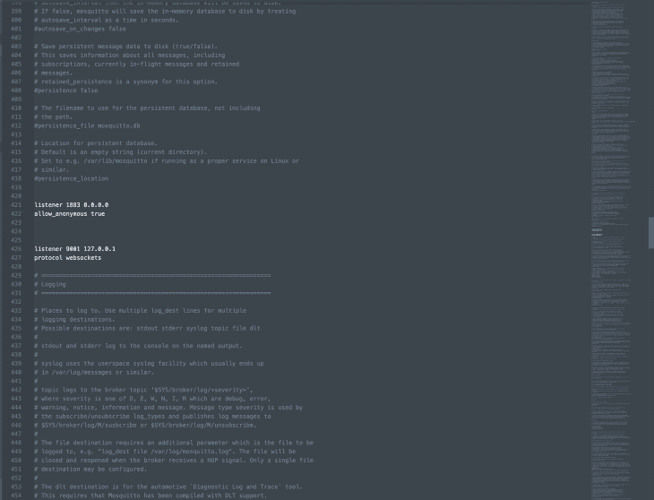
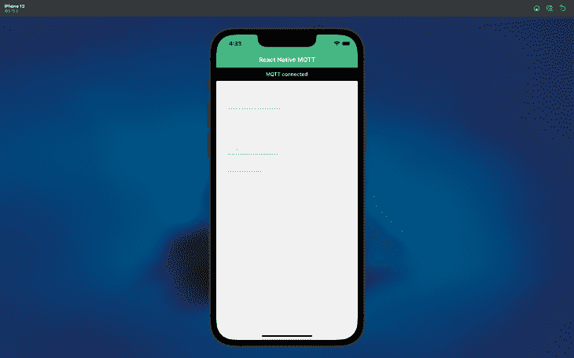
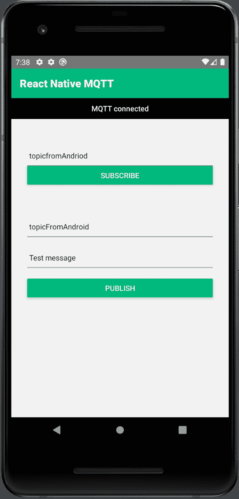
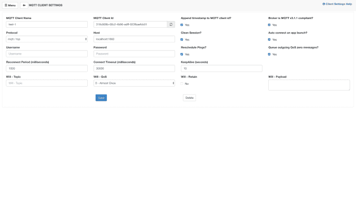
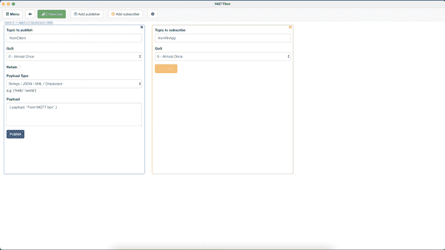
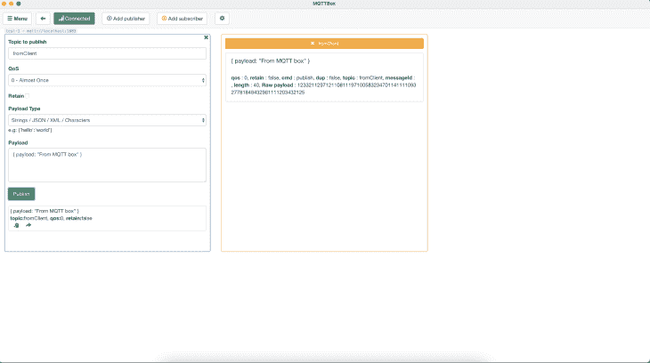
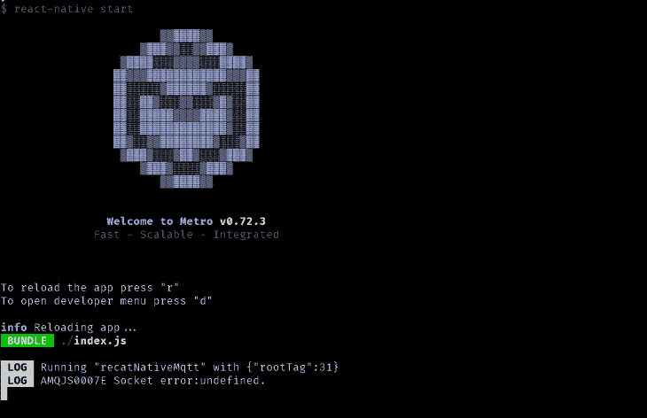
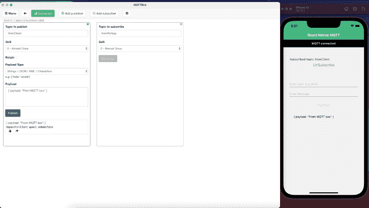
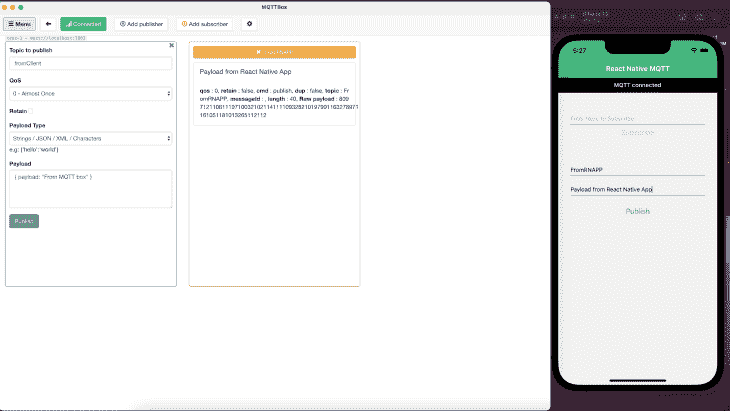
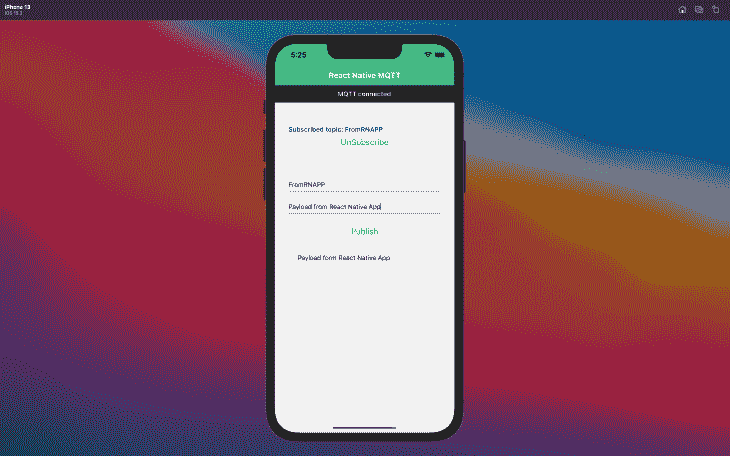

# 构建 React 原生 MQTT 消息传递应用指南

> 原文：<https://blog.logrocket.com/guide-building-react-native-mqtt-messaging-app/>

React Native 是一个基于 JavaScript 的跨平台移动应用开发框架。React 本机使用 React 为 iOS 和 Android 平台编写移动应用程序，并提供与本机应用程序相当的性能和可用性。

物联网(IoT)为许多移动应用提供了动力，React Native 在物联网应用的开发方面提供了帮助。 [MQTT](https://mqtt.org/) (消息队列遥测传输)协议促进了物联网设备之间的通信，并实现了客户端和服务器之间的双向数据交换。

在本文中，我们将演示如何设置一个 MQTT 代理，使用客户端代理向 iOS 和 Android 应用程序订阅和发布主题。我们还将展示如何配置 MQTT 并将其连接到 React 本地应用程序。

## 内容

## MQTT 是什么？

MQTT 是物联网的通用消息协议。这种实时消息协议(通常称为机器对机器协议)是一种设备通信机制，旨在实现快速数据传输。

MQTT 是一个轻量级的发布和订阅消息传输，它允许我们发送和接收消息。它有助于几个设备之间的通信。

## 设置 React 本地项目

要遵循本指南，请确保您的开发环境具有以下配置:

查看 React Native 的官方文档,了解如何在本地机器上设置 React Native 开发环境的详细说明。

使用以下命令创建 React 本地项目:

```
npx react-native init recatNativeMqtt
# navigate to project directory
cd recatNativeMqtt

```

## 添加 MQTT 库

为了将我们的应用程序连接到 MQTT，我们将使用来自 Eclipse Paho 项目的开源库[Eclipse Paho JavaScript Client](https://github.com/eclipse/paho.mqtt.javascript)与 MQTT 代理通信。 [Eclipse Paho 项目](https://projects.eclipse.org/projects/iot.paho)旨在提供一个高效、轻量级和可伸缩的消息协议解决方案。

有许多编程语言支持 Eclipse Paho。我们使用 Eclipse Paho JavaScript 客户端，因为我们的解决方案使用 React Native，这是一个基于 JavaScript 的框架。Paho JavaScript 客户机是一个基于浏览器的 MQTT 解决方案，它使用 WebSockets 连接到 MQTT 代理。

要添加 Paho JavaScript 客户端，在我们项目的根级别创建一个`lib`文件夹，创建一个`mqtt.js`文件，并将下面的[源代码](https://raw.githubusercontent.com/eclipse/paho.mqtt.javascript/master/src/paho-mqtt.js)添加到该文件中。

接下来，我们需要为 Paho JavaScript 客户机提供对本地存储的访问。我们在`lib`文件夹下创建一个`storage.js`文件，并在内存中添加一个全局`localStorage`的替代文件，如下所示:

```
const storage = {
  setItem: (key, item) => {
    storage[key] = item;
  },
  getItem: key => storage[key],
  removeItem: key => {
    delete storage[key];
  },
};
export default storage;

```

现在我们已经添加了 MQTT 库，我们需要配置 MQTT 代理；这个中介将使客户端能够进行通信。

## 配置 MQTT 代理

有几个免费的 [MQTT 代理](https://mqtt.org/software/)可供选择。对于本文，我们将使用 Eclipse [Mosquitto](https://www.mosquitto.org/) MQTT 代理，这是一个用于 MQTT 协议的开源消息代理。

在[官方文档](https://www.mosquitto.org/download/)中提供了为开发环境设置 Mosquitto 的详细下载和配置信息。配置也可以使用 Eclipse Mosquitto Docker 映像来处理，如 [Docker 的说明](https://hub.docker.com/_/eclipse-mosquitto)中所述。

Paho JavaScript 客户机需要使用一个可以在 WebSockets 和 TCP 之间转发的网关，或者一个本地支持 WebSockets 的代理。

为了使 WebSockets 能够监听端口`9001`，我们将下面的代码添加到`mosquitto.config`文件中以访问配置文件；路径位置是`/usr/local/etc/mosquitto/mosquitto.conf`:

```
listener 1883 0.0.0.0
allow_anonymous true

listener 9001 127.0.0.1
protocol websockets

```



要在开发环境中启动 Mosquitto 代理，请运行以下命令:

`/usr/local/sbin/mosquitto -c /usr/local/etc/mosquitto/mosquitto.conf`

执行这个命令后，MQTT 代理将在本地主机上运行，并开始监听端口`9001`。

接下来，运行以下命令，在 iOS 模拟器和 Android 模拟器中启动 React 本地应用程序:

```
# To start metro
yarn react-native start 

# TO start iOS simulator
yarn react-native run-ios

# To start Android emulator
yarn react-native run-android

```

如下所示，iOS 模拟器正在运行，并显示它连接到 MQTT:



Android 模拟器也在运行，并显示它连接到 MQTT，如下所示:



## 为测试配置 MQTTBox

MQTTBox 是一个免费的开源开发工具，用于监控和测试 MQTT 服务器。我们可以使用 MQTTBox 来订阅主题，并将有效负载发布到订阅的设备。MQTTBox 连接到 MQTT 代理，以便向我们的应用程序发送消息。

我们将使用 [MQTTBox chrome 扩展](https://chrome.google.com/webstore/detail/mqttbox/kaajoficamnjijhkeomgfljpicifbkaf)来测试我们的 MQTT 代理并发布消息。

下面的 MQTTBox 屏幕显示了如何将 MQTTBox 配置到本地主机:





如下所示，我们发布到同一个主题，并从 MQTTBox 订阅它，以验证我们的代理已经启动并运行:



接下来，我们将演示如何通过 MQTTBox 发布主题并从 React 本地应用程序订阅。

## 用 MQTT 发布和订阅

对于基于物联网的实现，MQTT 消息发布-订阅(或发布/订阅)模型是传统客户端-服务器模型的替代方案。一个客户端只能发布一个有效负载或消息到一个主题；它不能同时发布到多个主题。但是，如果客户端或应用程序订阅了相同的主题，这可能会被许多群组接收到。

为了实现 MQTT 发布/订阅，我们在`utils`文件夹下创建了一个`MqttClient`服务，并分配了下面的连接配置以及`onPublish`和`onSubscribe`方法:

```
/* this.client = new Paho.MQTT.Client('host',PORT, clientId);
*/
this.client = new Paho.MQTT.Client('127.0.0.1', 9001, clientId);

```

在 Android 中，`127.0.0.1` (localhost)会抛出一个`Socket error`。为避免此错误，请使用您的主机系统 IP 地址:



```
  onPublish = (topic, message) => {
    this.client.publish(topic, message);
  };

```

```
onSubscribe = (topic, callback) => {
    this.callbacks[topic] = callback;
    this.client.subscribe(topic);
  };

```

发布 MQTT 消息或有效负载的流程取决于服务质量(QoS ),或者消息将被正确传递的保证。

MQTT 支持三种 QoS 级别:

*   QoS-0:此默认级别不确保发布有效负载的交付
*   QoS-1 和 QoS-2:这些级别确保即使在设备离线或没有连接到 MQTT 时也能发送消息

当 clean session 标志为 false 时，所有消息都将保留在队列中，直到它们被发送到订阅的主题并得到确认。一旦重新连接到 MQTT，设备就会将所有排队的消息发送到订阅的主题。

在下面的例子中，主题`fromClient`在从 React 本地应用程序订阅后，从 MQTTBox 发布，并带有有效负载消息。有效负载信息显示在 iOS 应用程序中:



接下来，我们使用`fromRNAPP`主题发布来自 React 本地应用程序的消息，并使用 MQTTBox 订阅它。负载消息在 MQTTBox 中，如下所示:



现在，我们在 React 本机应用程序中发布和订阅相同的主题，一旦发布，我们就会获得有效负载消息并在应用程序中显示它:



## 在 React Native 中处理失败的消息

如果 React 本机应用程序与 MQTT 代理断开连接，发布的消息将无法传递。在这种情况下，应用程序将根据`keepaliveInterval`重试连接到代理，以接收订阅主题的排队消息。

如果应用程序没有连接或者没有接收到来自代理的 ping 消息，`keepaliveInterval`将有一个非零值。这将提示应用程序尝试连接到代理，如下所示:

```
onError = ({errorMessage}) => {
    this.isConnected = false;
    Alert.alert('Failed', 'Failed to connect to MQTT', [
      {
        text: 'Cancel',
        onPress: () => console.log('Cancel Pressed'),
        style: 'cancel',
      },
      {
        text: 'Try Again',
        onPress: () =>
          this.onConnect(this.onSuccessHandler, this.onConnectionLostHandler),
      },
    ]);
  };

```


## 结论

在本文中，我们讨论了使用 Eclipse Mosquitto MQTT 代理进行开发的 MQTT 消息传递协议设置和配置。

我们还使用 Eclipse Paho JavaScript 客户端库开发了一个 React 原生 MQTT 应用程序，并使用这个应用程序来演示订阅主题、发布消息和从服务器接收消息。

我希望你喜欢这篇文章。本文中使用的 React 原生 MQTT 应用程序的源代码可以在 [my GitHub](https://github.com/mukeshmandiwal/recatNativeMqtt) 上获得。

## [LogRocket](https://lp.logrocket.com/blg/react-native-signup) :即时重现 React 原生应用中的问题。

[](https://lp.logrocket.com/blg/react-native-signup)

[LogRocket](https://lp.logrocket.com/blg/react-native-signup) 是一款 React 原生监控解决方案，可帮助您即时重现问题、确定 bug 的优先级并了解 React 原生应用的性能。

LogRocket 还可以向你展示用户是如何与你的应用程序互动的，从而帮助你提高转化率和产品使用率。LogRocket 的产品分析功能揭示了用户不完成特定流程或不采用新功能的原因。

开始主动监控您的 React 原生应用— [免费试用 LogRocket】。](https://lp.logrocket.com/blg/react-native-signup)