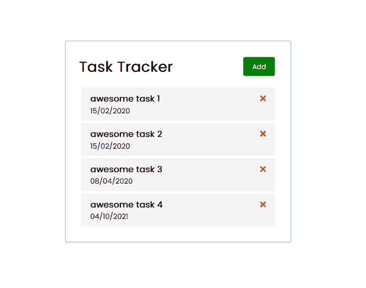
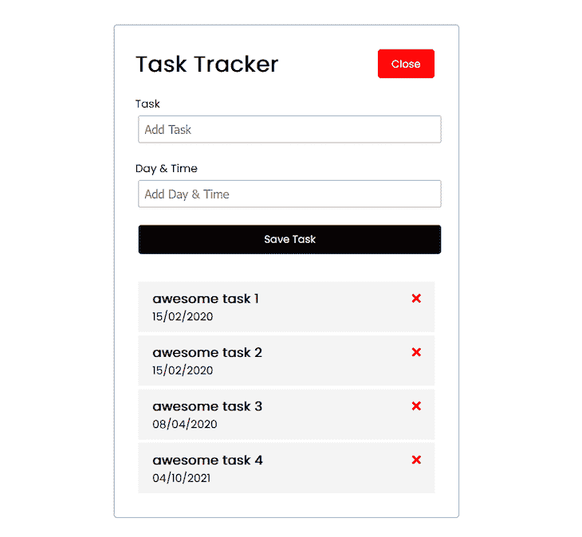

# 将角度应用程序转换为反应的指南

> 原文：<https://blog.logrocket.com/guide-converting-angular-apps-react/>

随着开发人员寻求更小更快的项目，将 Angular 应用转换为 React 已经变得很流行。它们是目前最流行的两种 JavaScript 前端框架，但是随着项目规模、功能和复杂性的增长，有必要从一个框架迁移到另一个框架。

迁移将使您的工程团队有机会将您的项目更新到现代应用程序所期望的标准，并更好地应对软件开发生命周期中不断变化的方面(主要是在维护方面)，从 Angular 迁移到 react 也不例外。

在本文中，您将了解在将 Angular 应用程序转换为 React 时应该考虑的事项、迁移策略、迁移的优点和缺点，以及您可能想要迁移的原因；最后，我们将演练将 Angular 应用程序转换为 React 的过程，您可以按照自己的节奏进行操作。让我们开始吧。

*向前跳转:*

## 从 Angular 迁移到 React 时需要注意的事项

Angular 和 React 是很好的前端框架，具有独特的特征，使它们有着根本的不同，在迁移时，您必须注意以下几点:

*   React 使用虚拟 DOM，而 Angular 使用真实 DOM
*   Angular 具有双向绑定，而 React 具有单向绑定
*   Angular 自带 TypeScript 开箱即用；React 不会
*   Angular 内置了对 AJAX、HTTP 和 Observables 的支持，React 没有。
*   React 拥有庞大的生态系统和来自 Meta(脸书)的直接支持，而 Angular 仅由开发者社区提供支持
*   Angular 具有现成的特性，如验证、组件范围的 CSS、动画、条件呈现等等
*   Angular CLI 可以轻松生成组件、模块和其他有助于开发人员提高工作效率的功能

## 迁移前做什么有角度的反应

### 设定目标以避免范围蔓延

许多开发团队在项目工作时遭受没有制定范围的后果。

这次迁移的目标和重点是什么？严格来说，这是一次性的迁移吗？或者，您会利用这个机会在迁移过程中进行更新、错误修复和性能优化吗？请注意，这些问题的答案将影响迁移的交付时间表。

### 进行审核以了解棘手问题和阻碍因素

您当前系统的哪些限制和低效之处需要更换？重要的是，您要切换到的新堆栈会移除现有的阻止程序，而不会添加新的阻止程序。确保在迁移之前有合理的理由，并且没有遗留问题。

### 选择正确的迁移策略

您将使用什么迁移策略？会错开迁移发布吗？选择正确的策略是成功迁移和保持预期的关键。

## 团队可能从 Angular 迁移到 React 的一些原因

业务和开发团队的需求随着时间的推移而变化，有时这些变化需要技术栈的过渡来适应。

以下是您可能从 Angular 迁移到 React 的主要原因:

*   React 的采用在开发人员中不断增加，新一批 web 开发人才专注于学习最具市场需求的技能。这意味着寻找或雇佣有棱角的开发人员来管理项目将变得越来越困难，你可能需要在必要时做出反应
*   React 比 Angular 具有更广泛的灵活性——你可以很容易地找到博客模板、动画库、多组件库、toast 库等等。与 Angular 相比，React 有一个更大、更活跃的开源社区，它不断开发第三方库、模板、在线课程和其他资源
*   业务需求和关注点会随着时间的推移而变化，开发人员可能需要开发移动应用来服务更多的客户。对他们来说，采用 React 代码库与 React Native 一起工作会更容易、更快

## 迁移策略

迁移应用程序的代码库是复杂的，虽然没有简单的方法来做到这一点，但我们可以探索几种策略。

### 重写

就质量而言，从头开始完全重写被认为是迁移应用程序的更好方式，因为您可以从新的应用程序开始，定义适合新框架的架构，并且没有必要处理新旧代码的集成。

但是，这种策略也有缺点—它需要更多的时间和资源，并且交付时间表很难估计。

### 扼杀者模式

React 和 Angular 是基于组件的框架，您可以在定义迁移策略时利用这一点。基于组件的迁移意味着你可以把你的 Angular 应用分成单独的部分，然后一个接一个地迁移它们。

由于不同组件的开发可以并行进行，您可以让不同的团队迁移应用程序的不同部分——使用这种策略，您可以错开发布，并为每个组件部署迁移。

一个缺点是，您必须将新框架的架构与旧框架的架构相集成。

## 为什么您可能不想从 Angular 迁移到 React

Angular 的一个持久的好处是，由于其固执己见的系统和内置工具，它使决策变得更容易——开发人员不需要花费数天或数周的时间来讨论用于状态管理或数据获取的库。

Angular 是用 TypeScript 构建的，使用现成的 TypeScript 可以强化干净的代码，并使调试和维护更加容易——除了缩放问题。

从 Angular 迁移到 React 将意味着失去 Angular CLI，开发人员可以使用它来创建可重复的代码块，如组件、服务、管道和命令行指令。

## 转换角度应用程序以做出反应

了解了框架迁移的背景之后，让我们转换一个 Angular 应用程序，看看它是如何完成的。

* * *

### 更多来自 LogRocket 的精彩文章:

* * *

我们将为 React 应用程序使用 Next.js 然而，相同的原则和代码片段可以被应用到一个普通的 React 应用程序中。

首先，请按照这些 [Angular](https://angular.io/guide/setup-local) 和 [Next.js](https://nextjs.org/docs/getting-started) 指南中的步骤来启动新的 Angular 和 React 应用程序。

## 我们将转换的项目

我们将把一个简单的任务追踪器 app 从 Angular 转换成 React 下图显示了该应用程序。

当点击 **Add** 按钮时，会显示一个我们可以添加新任务的模式。





这是应用程序的不同组成部分:

*   **表头:**app 的表头
*   **按钮:**一个可重用的按钮组件
*   **添加任务:**负责添加新任务的表单组件
*   **任务项:**单个任务项
*   **任务:**我们在其中呈现所有任务的组件

让我们开始创建组件。我们将首先查看角度代码，然后将其转换为反应。

(注意:除了本文的其余部分，还需要 Angular 和 Next.js 的工作知识)

## 定义角度服务

服务是应用程序完成特定任务或执行操作所需的功能块。服务是为 Angular 应用添加功能的关键部分；点击了解更多信息[。](https://blog.logrocket.com/how-dependency-injection-works-in-angular/)

Angular 应用程序需要两个服务，一个是**任务**服务，另一个是 **UI** 服务。

### 创建任务服务

这将负责从模拟 API 获取任务、添加新任务和删除任务。

下面的代码执行以下操作:

*   `getTasks`获取任务
*   `deleteTask`添加新任务
*   `addTask`删除任务

```
//

import { Injectable } from '@angular/core';
import { Observable } from 'rxjs';
import { Task } from 'src/app/mock-tasks';
import { HttpClient, HttpHeaders } from '@angular/common/http';

const httpOptions = {
  headers: new HttpHeaders({
    'Content-Type': 'application/json',
  }),
};

@Injectable({
  providedIn: 'root',
})

export class TaskService {
  private apiUrl = 'http://localhost:5000/tasks';
  constructor(private http: HttpClient) {}

  getTasks(): Observable<Task[]> {
    return this.http.get<Task[]>(this.apiUrl);
  }

  deleteTask(task: Task): Observable<Task> {
    const url = `${this.apiUrl}/${task.id}`;
    return this.http.delete<Task>(url);
  }

  addTask(task: Task): Observable<Task> {
    return this.http.post<Task>(this.apiUrl, task, httpOptions);
  }
}

```

创建 UI 服务

### UI 服务将通过`toggleAddTask`函数控制表单切换功能。

太好了！既然我们已经定义了服务，现在我们继续创建组件。

```
//

import { Injectable } from '@angular/core';
import { Observable, Subject } from 'rxjs';

@Injectable({
  providedIn: 'root',
})

export class UiService {
  private showAddTask: boolean = false;
  private subject = new Subject<any>();
  constructor() {}
  toggleAddTask(): void {
    this.showAddTask = !this.showAddTask;
    this.subject.next(this.showAddTask);
  }
  onToggle(): Observable<any> {
    return this.subject.asObservable();
  }
}

```

header 组件将包含一个按钮，单击该按钮将切换用户用来添加更多任务的表单。此外，按钮的背景颜色和文本也将被切换。

要在 Angular 中进行设置，请在应用程序中创建一个标题组件，并执行以下操作:

首先，定义组件的 HTML。

按钮接受一个`btnClick`处理程序，而`toggleAddTask`方法负责切换表单的可见性。

```
<header>
  <h1>Task Tracker</h1>
  <app-button
    color="{{ showAddTask ? 'red' : 'green' }}"
    text="{{ showAddTask ? 'Close' : 'Add' }}"
    (btnClick)="toggleAddTask()"
  ></app-button>
</header>

```

连接到服务并创建`toggleAddTask`方法。

然后，添加代码来定义行为:

我们访问包含一个`toggleAddTask`的 UI 服务，并使用它来定义第二个`toggleAddTask`方法，我们在 header 的 HTML 中使用了这个方法。

```
import { Component, OnInit } from '@angular/core';
import { Subscription } from 'rxjs';
import { UiService } from 'src/app/services/ui.service';

@Component({
  selector: 'app-header',
  templateUrl: './header.component.html',
  styleUrls: ['./header.component.css'],
})

export class HeaderComponent implements OnInit {
  showAddTask: boolean = false;
  subscription: Subscription;

  constructor(private uiService: UiService) {
    this.subscription = this.uiService
      .onToggle()
      .subscribe((value) => (this.showAddTask = value));
  }
  ngOnInit(): void {}
  ngOnDestroy() {
    // Unsubscribe to ensure no memory leaks
    this.subscription.unsubscribe();
  }
  toggleAddTask() {
    this.uiService.toggleAddTask();
  }
}

```

我们可以看到，在设置 Angular 的功能时，有相当多的活动部件。让我们看看这在 React 中是如何工作的。

首先，创建一个 header 组件并粘贴到下面的代码中。

这里，我们从`showFormContext`访问`showAddTaskForm`布尔函数和`toggleAddTaskForm`函数，并使用它们来设置功能。接下来，我们创建上下文。

```
import Button from "../Button/Button";
import styled from "styled-components";
import { useShowFormContext } from "../../context/showFormContext";

export default function Header() {
  const { showAddTaskForm, toggleAddTaskForm } = useShowFormContext();
  return (
    <StyledHeader>
      <h1>Task Tracker</h1>
      <Button
        bgColor={showAddTaskForm ? "red" : "green"}
        btnClickHandler={toggleAddTaskForm}
        btnLabel={showAddTaskForm ? "Close" : "Add"}
      />
    </StyledHeader>
  );
}

```

创建`showFormContext`，它将包含`showAddTaskForm`和`toggleAddTaskForm`。

我们建立了具有相似特性的相同组件，但是代码行更少——这是 React 的胜利，也是它带给我们的简单性。

```
import { useState, useContext, createContext } from "react";
const ShowFormContext = createContext();
export const useShowFormContext = () => useContext(ShowFormContext);

export default function ShowFormContextProvider({ children }) {
  const [showAddTaskForm, setShowAddTaskForm] = useState(false);
  const toggleAddTaskForm = () => {
    setShowAddTaskForm(!showAddTaskForm);
  };
  return (
    <ShowFormContext.Provider value={{ showAddTaskForm, toggleAddTaskForm }}>
      {children}
    </ShowFormContext.Provider>
  );
}

```

创建按钮组件

## 不要把这个按钮误认为是表单上的按钮。相反，它是我们在 header 组件中使用的按钮。先说棱角。

创建按钮的 HTML:

设置按钮的功能:

```
<button 
  class="btn" 
  (click)="onClick()"
  [ngStyle]="{ 'background-color': color }">
  {{ text }}
</button>

```

按钮的颜色和文本是动态的，所以我们为它们设置了变量。此外，按钮需要接受一个点击事件，所以我们发出了`btnClick`。

```
import { Component, OnInit, Input, Output, EventEmitter } from '@angular/core';

@Component({
  selector: 'app-button',
  templateUrl: './button.component.html',
  styleUrls: ['./button.component.css'],
})

export class ButtonComponent implements OnInit {
  @Input() text: string = '';
  @Input() color: string = '';
  @Output() btnClick = new EventEmitter();
  constructor() {}
  ngOnInit(): void {}
  onClick() {
    this.btnClick.emit();
  }
}

```

请注意，在 Angular 中定义 props 并将动态数据传递给组件要复杂得多。

让我们在 React 中设置按钮，看看它是什么样子:

这就是一切！显然，Angular 版本的“道具”具有更高的复杂性。

```
import Styled from "styled-components";
export default function Button({ btnLabel, bgColor, btnClickHandler }) {
  return (
    <StyledButton onClick={btnClickHandler} bgColor={bgColor}>
      {btnLabel}
    </StyledButton>
  );
}

```

创建添加任务组件

## Add Task 组件是我们用来添加新任务的表单。让我们以角度来设置它。

我们是这样定义 HTML 框架的:

在这里，我们执行以下操作:

```
<form *ngIf="showAddTask" class="add-form" (ngSubmit)="onSubmit()">
  <div class="form-control">
    <label for="text">Task</label>
    <input
      type="text"
      name="text"
      [(ngModel)]="text"
      id="text"
      placeholder="Add Task"
    />
  </div>
  <div class="form-control">
    <label for="day">Day & Time</label>
    <input
      type="text"
      name="day"
      [(ngModel)]="day"
      id="day"
      placeholder="Add Day & Time"
    />
  </div>
  <input type="submit" value="Save Task" class="btn btn-block" />
</form>

```

定义 HTML 并使用 Angular 的`ngModel`表单指令来跟踪表单字段的值

*   根据`showAddTask`的状态，用`*ngIf`指令有条件地呈现表单
*   使表单具有交互性

### 接下来，我们需要通过定义数据将被传递到的变量和处理表单提交来向表单添加功能:

这里，我们创建了`onSubmit`函数，它添加了新的任务并清除了表单字段。我们还添加了保存表单数据的必要变量。

```
import { Component, OnInit, Output, EventEmitter } from '@angular/core';
import { UiService } from 'src/app/services/ui.service';
import { Subscription } from 'rxjs';
import { Task } from 'src/app/mock-tasks';
@Component({
  selector: 'app-add-task',
  templateUrl: './add-task.component.html',
  styleUrls: ['./add-task.component.css'],
})
export class AddTaskComponent implements OnInit {
  @Output() onAddTask: EventEmitter<Task> = new EventEmitter();
  text: string;
  day: string;
  showAddTask: boolean;
  subscription: Subscription;
  constructor(private uiService: UiService) {
    this.subscription = this.uiService
      .onToggle()
      .subscribe((value) => (this.showAddTask = value));
  }
  ngOnInit(): void {}
  ngOnDestroy() {
    // Unsubscribe to ensure no memory leaks
    this.subscription.unsubscribe();
  }
  onSubmit() {
    const newTask: Task = {
      text: this.text,
      day: this.day,
    };
    this.onAddTask.emit(newTask);
    this.text = '';
    this.day = '';
  }
}

```

让我们在 React 中设置相同的内容:

我们来分解一下上面的代码:

```
const handleSubmit = (e) => {
  e.preventDefault();
  const formData = new FormData(e.target);
  const data = Object.fromEntries(formData);
  console.log(data);
};

export default function AddTask() {
  return (
    <StyledForm className="add-form" onSubmit={handleSubmit}>
      <div className="form-control">
        <label for="text">Task</label>
        <input type="text" name="task" id="text" placeholder="Add Task" />
      </div>
      <div className="form-control">
        <label for="day">Day & Time</label>
        <input type="text" name="day" id="day" placeholder="Add Day & Time" />
      </div>
      <input type="submit" value="Save Task" className="btn btn-block" />
    </StyledForm>
  );
}

```

首先，我们定义 HTML

*   接下来，我们设置了`handleSubmit`函数，它利用 FormData 构造函数来访问表单的数据
*   创建任务项和任务组件

## 任务项组件是执行的每个任务。它包含任务的标题、日期和删除任务的按钮。

让我们以角度来设置它:

我们需要创建传递给图标的`onDelete`方法。

```
<div class="task">
  <h3>
    {{ task.text }}
    <fa-icon
      [icon]="faTimes"
      [ngStyle]="{ color: 'red' }"
      (click)="onDelete(task)"
    ></fa-icon>
  </h3>
  <p>{{ task.day }}</p>
</div> 

```

这里，我们定义了`onDelete`方法并使用它来省略`onDeleteTask`方法，这样任务项的父项就可以捕获删除事件并删除任务。

```
import { Component, OnInit, Input, Output, EventEmitter } from '@angular/core';
import { Task } from 'src/app/mock-tasks';
import { faTimes } from '@fortawesome/free-solid-svg-icons';

@Component({
  selector: 'app-task-item',
  templateUrl: './task-item.component.html',
  styleUrls: ['./task-item.component.css'],
})

export class TaskItemComponent implements OnInit {
  @Input() task: Task;
  faTimes = faTimes;
  @Output() onDeleteTask = new EventEmitter<Task>();
  constructor() {}
  ngOnInit(): void {}
  onDelete(task: Task) {
    this.onDeleteTask.emit(task);
  }
}

```

让我们创建 Tasks 组件来看看它是什么样子的。

这里，我们为任务组件定义 HTML。在这里，我们遍历任务数组，并在任务项组件中呈现每个任务。

```
<app-add-task (onAddTask)="addTask($event)"></app-add-task>
<app-task-item
  *ngFor="let task of tasks"
  [task]="task"
  (onDeleteTask)="deleteTask(task)"
></app-task-item>

```

然后，我们从任务组件中捕获`onDeleteTask` delete 事件，并使用它来设置任务删除功能。我们也为添加任务组件和`onAddTask`事件做同样的事情。

最后，我们利用任务服务的功能:

这里，我们从服务中访问`addTask`和`deleteTask`函数，并使用它们创建另一组在任务和任务项组件中使用的`addTask`和`deleteTask`方法。

```
import { Component, OnInit } from '@angular/core';
import { Task } from 'src/app/mock-tasks';
import { TaskService } from 'src/app/services/task.service';

@Component({
  selector: 'app-tasks',
  templateUrl: './tasks.component.html',
  styleUrls: ['./tasks.component.css'],
})

export class TasksComponent implements OnInit {
  tasks: Task[] = [];
  constructor(private taskService: TaskService) {}
  ngOnInit(): void {
    this.taskService.getTasks().subscribe((tasks) => (this.tasks = tasks));
  }
  deleteTask(task: Task) {
    this.taskService
      .deleteTask(task)
      .subscribe(
        () => (this.tasks = this.tasks.filter((t) => t.id !== task.id))
      );
  }
  addTask(task: Task) {
    this.taskService
      .addTask(task)
      .subscribe((task) => this.tasks.unshift(task));
  }
}

```

然后，我们使用`getTasks`函数从模拟 API 获取任务列表。

Angular 就是这样！现在，让我们将任务和任务项功能迁移到 React，从任务项开始:

这里，我们定义了一个`deleteTask`函数，并将其传递给图标。然后，我们还呈现了任务的数据。

```
export default function TaskItem({ task, tasks, setTasks }) {
  const deleteTask = () => {
    let newTasks;
    fetch(`http://localhost:5000/tasks/${task.id}`, {
      method: "DELETE",
    })
      .then((newTasks = tasks.filter((t) => t.id !== task.id)))
      .then(setTasks(newTasks));
    console.log("red");
  };
  return (
    <Container className="task">
      <h3>
        {task.text} <DeleteIcon const deleteTask={deleteTask} />
      </h3>
      <p>{task.day}</p>
    </Container>
  );
}

function DeleteIcon({ deleteTask }) {
  return (
    <svg
      onClick={deleteTask}
    >
      <path d=""></path>
    </svg>
  );
}

```

对于任务组件:

在这里，我们做了以下工作:

```
import AddTask from "../AddTask/AddTask";
import TaskItem from "../TaskItem/TaskItem";
import { useShowFormContext } from "../../context/showFormContext";
import { useState, useEffect } from "react";

export default function Tasks() {
  const [tasks, setTasks] = useState(null);
  const { showAddTaskForm } = useShowFormContext();

  useEffect(() => {
    fetch("http://localhost:5000/tasks")
      .then((res) => res.json())
      .then((data) => setTasks(data));
  }, []);

  return (
    <>
      {showAddTaskForm && <AddTask />}
      {tasks
        ? tasks.map((task) => (
            <TaskItem
              key={task.id}
              task={task}
              tasks={tasks}
              setTasks={setTasks}
            />
          ))
        : null}
    </>
  );
}

```

从模拟 API 获取任务

*   根据`showAddTaskForm`的值切换表单的可见性
*   呈现任务列表
*   这样，我们已经成功地将一个基本的任务跟踪器应用程序从 Angular 转换为 React。

然而，请注意，这是一个基本项目，当处理具有多种服务、复杂的状态管理和许多页面和功能的 Angular 应用程序时，迁移会更加复杂——但原则是相同的。

转换过程中的感悟

## 虽然 Angular 和 React 都是很好的前端框架，但是前者比后者更复杂

*   平均来说，在 Angular 中创建一个特征要比在 React 中花费更多的代码行
*   总的来说，将组件从 Angular 转换为 React 会减少代码行，使事情变得更简单、更快速。这提高了应用程序的性能，并提供了更好的维护和开发体验
*   结论

## 迁移可能是一项相当艰巨的任务，需要花费大量的精力、时间、规划和开发来确保它顺利进行，而不会影响维护和开发速度。在迁移之前考虑利弊是很重要的。

虽然完全重写转换有很多好处，但这并不总是可能的，因为大多数公司没有时间或资源来致力于这种方法。在这种情况下，我们可以利用工具来自动化大部分迁移过程，例如[n react](https://github.com/ngReact/ngReact)、 [react2angular](https://github.com/coatue-oss/react2angular) 和 [angular2react](https://github.com/coatue-oss/angular2react) 。

我希望这篇解释者和教程文章对你有用——你可以从这个报告中获得 Angular 和 React 应用程序的完整源代码。

[LogRocket](https://lp.logrocket.com/blg/react-signup-general) :全面了解您的生产 React 应用

## 调试 React 应用程序可能很困难，尤其是当用户遇到难以重现的问题时。如果您对监视和跟踪 Redux 状态、自动显示 JavaScript 错误以及跟踪缓慢的网络请求和组件加载时间感兴趣，

.

[try LogRocket](https://lp.logrocket.com/blg/react-signup-general)

LogRocket 结合了会话回放、产品分析和错误跟踪，使软件团队能够创建理想的 web 和移动产品体验。这对你来说意味着什么？

[ ](https://lp.logrocket.com/blg/react-signup-general) [](https://lp.logrocket.com/blg/react-signup-general) 

LogRocket 不是猜测错误发生的原因，也不是要求用户提供截图和日志转储，而是让您回放问题，就像它们发生在您自己的浏览器中一样，以快速了解哪里出错了。

不再有嘈杂的警报。智能错误跟踪允许您对问题进行分类，然后从中学习。获得有影响的用户问题的通知，而不是误报。警报越少，有用的信号越多。

LogRocket Redux 中间件包为您的用户会话增加了一层额外的可见性。LogRocket 记录 Redux 存储中的所有操作和状态。

现代化您调试 React 应用的方式— [开始免费监控](https://lp.logrocket.com/blg/react-signup-general)。

Modernize how you debug your React apps — [start monitoring for free](https://lp.logrocket.com/blg/react-signup-general).