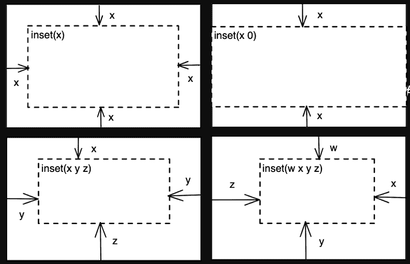
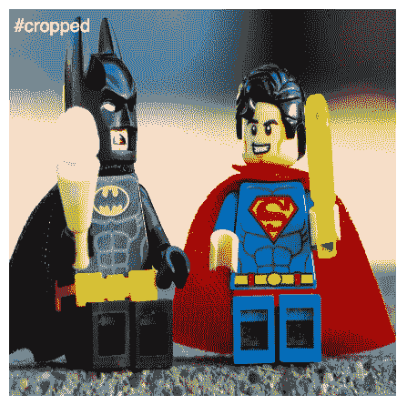
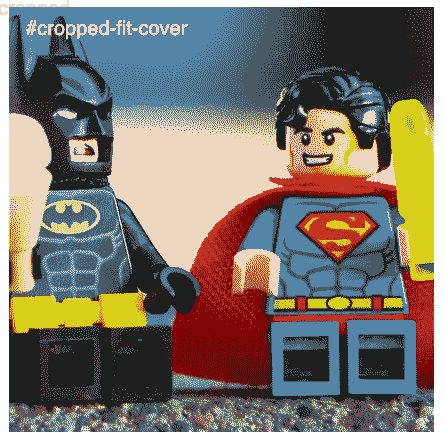

# CSS 对象视图框指南

> 原文：<https://blog.logrocket.com/guide-css-object-view-box/>

作为一名前端开发人员，我经常需要处理图像。有时，当图像在应用程序中缩放和定位不同时，情况会变得很棘手。例如，一个电子商务网站在显示产品列表时，可能需要在产品页面上显示一个更大版本的图像以及同一图像的放大版本。

在 Chrome 104 之前，我裁剪/缩放图像的解决方案是将它作为`background-image`应用于一个 div 中，然后调整`background-position`和`background-size`属性。这里有一个例子:

```
<div id="cropped"></div>
```

```
#cropped {
  width: 500px;
  aspect-ratio: 3/2;
  background-image: url("https://images.unsplash.com/photo-1611604548018-d56bbd85d681?ixlib=rb-4.0.3&ixid=MnwxMjA3fDB8MHxwaG90by1wYWdlfHx8fGVufDB8fHx8&auto=format&fit=crop&w=2070&q=80");
  background-size: 1250px;
  background-position: 66% 67%;
  background-repeat: no-repeat;
}
```


它工作得很好，但我们只能说这种裁剪/缩放图像的解决方案还有待改进。这不是你所说的整洁。此外，这不能只使用一个``标签。还有其他的变通方法，但是没有一个像`object-view-box`这么简单干净。

在本文中，我们将讨论:

## 什么是`object-view-box`属性？

Chrome 104 的发布引入了一种在元素内容中缩放或平移的本地方法。CSS `object-view-box`属性通过在元素上指定一个视图框，使我们能够调整位置和缩放来满足我们的特定需求，从而使这成为可能。

简而言之，就像相机镜头可以被调整以放大或缩小或平移外部视图一样，`object-view-box`属性允许我们放大元素的特定部分或平移以显示元素的不同部分。

### 如何使用`object-view-box`？

要在一个元素上指定一个视图框，`object-view-box``inset()`功能控制四条边。

`inset()`是指定元素的`top`、`right`、`bottom`和`left`属性的值的简写方式。它遵循与[填充和边距属性](https://blog.logrocket.com/css-margin-vs-padding/)相同的语法，这允许它接受一到四个值:

*   **1 值**:适用于所有四条边
*   **2 个值**:第一个值应用于上边缘和下边缘，第二个值应用于左边缘和右边缘
*   **3 个值**:第一个值应用于上边缘，第二个值应用于左、右边缘，第三个值应用于下边缘
*   **4 个值**:分别应用于上、右、下、左边缘



这些值可以使用任何有效的 CSS 长度单位来表示，例如像素(px)、 [ems (em)、rems (rem)](https://blog.logrocket.com/using-em-vs-rem-css/) 和百分比(%)，等等。

让我们将此属性应用到上面的同一张图像，并尝试获得相同的结果:

```

```

```
#cropped {
  width: 500px;
  object-view-box: inset(40% 20% 20% 40%);
}
```


## 可能的失真

如果图像的裁剪版本是正方形，图像将出现扭曲，即被拉伸或挤压:

```
#cropped {
  aspect-ratio: 1;
  width: 500px;
  object-view-box: inset(40% 20% 20% 40%);
}
```



在这里，我们可以使用`object-fit`属性的帮助，该属性定义了元素应该如何调整大小以适合其容器。该属性可以设置为下列值之一:`fill`、`contain`、`cover`、`none`或`scale-down`。

对于我们的场景，我们可以使用`cover`，它调整图像的大小以适合容器的`aspect-ratio`，如果图像的`aspect-ratio`与容器的不匹配，那么它将被裁剪以适合:

```
#cropped-fit-cover {
  aspect-ratio: 1;
  width: 500px;
  object-fit: cover;
  object-view-box: inset(40% 20% 20% 40%);
}
```



这难道不是裁剪/缩放图像的一种便捷方式吗？它只需要一个属性，易于可视化。与变通方法不同，不需要额外的属性或元素。

## 为什么我们应该欢迎这一更新？

使用`object-view-box`属性是一种本地解决方案；浏览器完成了繁重的工作，开发人员得到了一个干净的解决方案。

在开发人员中有一些流行的变通方法，比如使用 HTML 元素——例如`<div/>`——并应用 CSS 属性来实现裁剪后的图像。但这仍然只是一种变通方法，一种克服浏览器局限性的非常规解决方案。

通过此次更新，浏览器已经解决了这一限制，并提供了内置的解决方案。

有一个问题是，要实现这一点，您需要知道原始容器和新容器的确切尺寸。但这难道不是裁剪图像的先决条件吗？为了确定要修剪多少，我们总是需要这些信息。

那么，当容器被重新调整大小时(在视口中改变)，这将如何工作呢？

当`object-view-box`使用`inset()`在图像上绘制`view-box`时，裁剪总是发生在图像的固有大小(原始宽度和高度)上。为了使其具有响应性，我们可以将该属性与媒体查询一起使用，并相应地进行裁剪。

## 什么时候用`object-view-box`？

在许多情况下，裁剪/缩放图像的功能非常有用:

*   当图像需要在整个应用程序中进行不同的缩放和定位时
*   互动功能，用户可以放大和平移图像，常见于电子商务网站
*   在较小的视窗中，图像通常会被裁剪。通过这个属性和媒体查询，我们可以控制图像的哪一部分留在视图中

## 结论

过去有过裁剪和缩放图像的变通方法，但我欢迎这种本地且方便的解决方案。此外，请记住，这是一个实验性的版本，因此，它可能不会得到所有浏览器的广泛支持。请访问[caniuse.com](https://caniuse.com/mdn-css_properties_object-view-box)获取最新的浏览器支持表。

## 你的前端是否占用了用户的 CPU？

随着 web 前端变得越来越复杂，资源贪婪的特性对浏览器的要求越来越高。如果您对监控和跟踪生产环境中所有用户的客户端 CPU 使用、内存使用等感兴趣，

[try LogRocket](https://lp.logrocket.com/blg/css-signup)

.

[](https://lp.logrocket.com/blg/css-signup)[https://logrocket.com/signup/](https://lp.logrocket.com/blg/css-signup)

LogRocket 就像是网络和移动应用的 DVR，记录你的网络应用或网站上发生的一切。您可以汇总和报告关键的前端性能指标，重放用户会话和应用程序状态，记录网络请求，并自动显示所有错误，而不是猜测问题发生的原因。

现代化您调试 web 和移动应用的方式— [开始免费监控](https://lp.logrocket.com/blg/css-signup)。