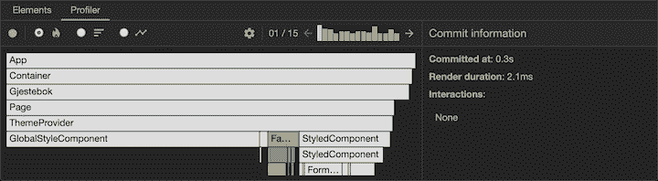
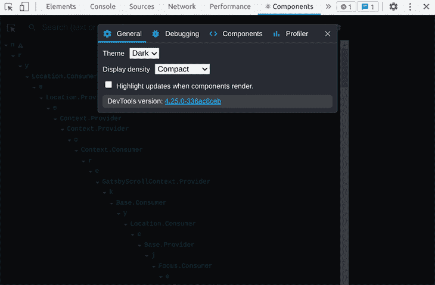
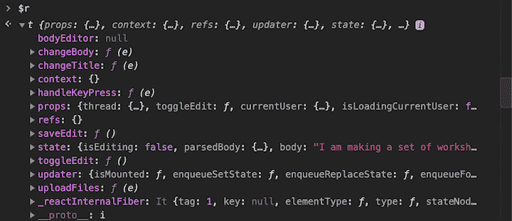
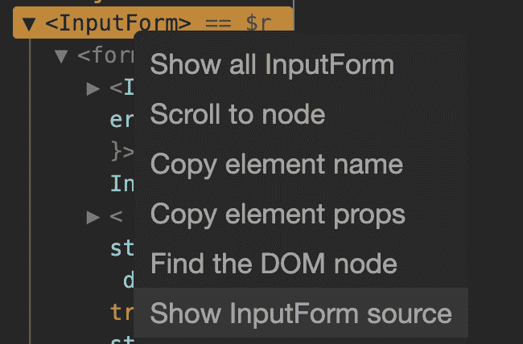

# React DevTools 中的特性和更新指南

> 原文：<https://blog.logrocket.com/guide-features-updates-react-devtools/>

***编者按*** *:* *本 React DevTools 教程最近一次更新是在 2022 年 8 月 5 日，其中包含了关于安装 React DevTools 浏览器扩展的章节，解决了浏览器上显示的扩展的常见问题，以及最近的小更新中附带的新功能。*

当你在做一个 React 项目时，React DevTools 是一个非常有价值的资产。尽管它有自己的标准用例，但是 DevTools 中有很多微妙的特性没有被注意到或者没有被使用。

在本文中，我们将演示如何使用 React DevTools 的各种功能，这些功能您可能还没有尝试过(或者甚至不知道存在)。我们还将介绍如何安装浏览器扩展，并重点介绍 React DevTools v4 和后续次要版本中附带的一些特性。

React DevTools 是一个开源的、MIT 授权的工具，由 Meta 开发和维护。它为浏览器开发工具增加了 React 调试功能。尽管 React DevTools 主要是一个浏览器扩展，但它也是一个独立的包。

虽然浏览器扩展用于调试基于浏览器的 React 应用程序，但是您也可以使用独立包来调试非基于浏览器的应用程序，例如 React 本地和移动浏览器。

用于调试基于 web 的 React 应用程序的 React DevTools 浏览器扩展在一些流行的 web 浏览器上可用。您可以从下面相应的 web 浏览器加载项商店安装它:

也可以直接从源代码构建和安装 React DevTools。[您可以查看文档，了解如何操作的说明](https://github.com/facebook/react/tree/main/packages/react-devtools-extensions#prerequisite-steps)。

要使用独立的 React DevTools 包，您需要从`npm`包注册表安装它，如下所示:

```
yarn global add react-devtools

```

```
npm install -g react-devtools

```

当你指向一个用 React 构建的站点时，React DevTools 应该出现在浏览器的 DevTools 中。然而，在使用扩展时遇到问题是很常见的。

一个常见的问题是 React DevTools 不显示在浏览器 DevTools 中，即使安装后也是如此。

以下是此问题的一些可能原因和解决方案:

*   如果您从文件(`file:`)加载项目，请确保提供对文件 URL 的扩展名访问。给予扩展对项目的访问权是很重要的
*   确保在安装 React DevTools 后重新加载网页，以便开始检测已经打开的页面
*   如果您的项目在 iFrame 中运行或调试 React 本地项目，文档建议使用独立的 React DevTools 包
*   当你正在调试一个浏览器扩展时，不可能使用 React DevTools

React DevTools 文档的 FAQ 部分列出了提到的问题以及如何解决这些问题。

React DevTools 一直在添加新特性。 [React DevTools 4](https://reactjs.org/blog/2019/08/15/new-react-devtools.html) 于 2019 年 8 月正式发布，带来了显著的性能提升、改版的导航体验以及对 React Hooks 的全面支持。从那以后，React 团队通过[定期更新和改进](https://github.com/facebook/react/blob/main/packages/react-devtools/CHANGELOG.md)不断完善 DevTools。

现在，我们将讨论使用 React DevTools 的五种方法。让我们投入进去吧！

### 使用 React 探查器调试性能

2018 年 9 月，React 团队推出了一个令人难以置信的强大功能，用于调试与性能相关的问题，称为 [React Profiler](https://reactjs.org/blog/2018/09/10/introducing-the-react-profiler.html) 。当与 React v16.5 或更高版本一起使用时，React DevTools 为您提供了一个概要分析功能，向您显示应用程序如何重新呈现。

就像您选择的开发工具中的常规 JavaScript 分析器一样，您必须“记录”一组交互。完成后，您将看到应用程序经历的每个重新渲染的可视化效果，以及精确的时间信息和彩色编码的火焰图。截至 2019 年 4 月，它甚至[抓取了每一次 DOM 更新](https://twitter.com/brian_d_vaughn/status/1113200027835310080)的截图。



为了更深入地了解 React Profiler，我推荐观看 Brian Vaughn 录制的现场视频,他在视频中演示了如何使用 Profiler 来定位和消除讨厌的性能错误。

你是那种喜欢花大量时间让你的开发环境看起来恰到好处的人吗？如果是这样，你会很高兴知道 React DevTools 是主题。您可以在 React DevTools 设置的 **General** 选项卡中找到主题选项:



默认情况下，它将使用您的浏览器主题。你也可以随时在亮色和暗色主题之间切换。要开始玩主题，单击主面板右侧的 cog 图标，然后单击**常规**设置选项卡。

### 从控制台访问 React 组件和状态

尽管您可以在 React DevTools 中直接找到并修复大多数问题，但是有一些调试与一个好的旧`console.log`一起工作会更好。我最喜欢的特性之一是 DevTools 实际上给了你通过控制台本身与组件实例交互的选项。

在 React DevTools 中选择一个组件并弹出打开控制台(点击`Esc`键可以让你同时看到这两个组件)。键入`$r`，您将可以从控制台访问该 React 组件的实例。



这给了您很大的调试能力。使用 DevTools，您可以从控制台访问 React 状态，触发回调方法，甚至增加功能。

如果您对某个特定的函数感兴趣，比如点击处理程序或回调函数，React DevTools 还提供了一个很好的便利特性。如果您在 props 或 state overview 中右键单击一个函数，您可以将它作为一个全局变量使用。这样，你可以用不同的参数和上下文随时调用它。

### 像专家一样查看源代码

现代浏览器中的调试工具比大多数人意识到的要强大得多。您可以设置断点，随着应用程序的变化检查状态和属性，并逐行执行代码。然而，用 Babel 编译的[代码往往很难读懂，也很难理解。如果你真的可以像你写的那样查看源代码，那不是很好吗？](https://blog.logrocket.com/why-you-dont-need-babel/)

巴别塔提供了一个插件，为所有 JSX 元素添加一个`__source`道具。这使得 React DevTools 可以直接链接到您正在检查的组件的源代码。它会使您的应用程序变慢一点，但是在开发模式下效果很好。

要使用这个特性，安装`[babel-plugin-transform-react-jsx-source](https://github.com/babel/babel/tree/master/packages/babel-plugin-transform-react-jsx-source)`，将其应用到您的`.babelrc`文件，并重启您的开发服务器。当你右击组件树中的一个组件时，你会看到一个新选项:`“Show <component name> source”:`



这使您能够跳转到浏览器的源代码视图，在那里您可以检查、设置断点并一起修改代码。

如果你使用流行的引导工具 [Create React App](https://blog.logrocket.com/whats-new-in-create-react-app-4-0-0/) ，你会发现它开箱即用。没有配置，没有插件，什么都没有。直接跳到源头就好！

### 访问机密反应 API

你知道吗，React 有一些顶级导出是专门为与 React DevTools 交互而设计的？你可能不会经常需要它们，但是当你需要的时候，它们会非常方便。

#### `useDebugValue`

当你[创建与其他开发者共享的自定义反应钩子](https://blog.logrocket.com/advanced-react-hooks-creating-custom-reusable-hooks/)时，使用`useDebugValue`钩子通常是个好主意。这个钩子向 React DevTools 中显示的钩子添加了一个信息标签。

#### 交互跟踪

在某些情况下，理解为什么特定的提交或重新呈现花费的时间比预期的长可能有点复杂。这就是为什么 React DevTools 支持所谓的[交互跟踪](https://gist.github.com/bvaughn/8de925562903afd2e7a12554adcdda16)的原因。这是一个编程式 API，允许你在应用程序中的不同事件上放置标签，并跟踪它们的性能。

首先，安装`scheduler`包并导入`unstable_trace`方法。该方法接受一个标签(例如，“单击了登录按钮”)、一个时间戳和一个回调。回调中发生的事情可以在比以前更详细的层次上被跟踪。

#### 调试 React 生产版本

如果您遇到了只在应用程序的生产版本中出现的性能退化，您可能想尝试对您的应用程序进行分析。不幸的是，React 不包括对 React 生产版本的[概要分析支持——至少默认情况下没有。](https://gist.github.com/bvaughn/25e6233aeb1b4f0cdb8d8366e54a3977)

幸运的是，您仍然可以选择在您的生产应用程序中提供概要分析。您可能不想将它发送给您的客户，但是在本地或在 QA 环境中测试它会对您有很大帮助。

如前所述，React DevTools 一直在大量开发中。 [React DevTools v4](https://reactjs.org/blog/2019/08/15/new-react-devtools.html) 于 2019 年 8 月发布，随后的小更新引入了许多重大和微小的改进，我们将在下面列出其中的一些。 [React DevTools changelog](https://github.com/facebook/react/blob/main/packages/react-devtools/CHANGELOG.md) 有 React DevTools 最近更新和改进的完整列表，但我们现在只看几个。

### 传统 React 支持

早期版本的 React DevTools 仅支持 React v16 及更高版本。然而，React DevTools v4 也支持 React v0.13、14 和 15。对于那些坚持维护或修复遗留 React 代码库的人来说，这是一个好消息。

> 我想这也值得在线程中明确提及:新的 DevTools 将支持旧的 React 版本(可能是 v13+)
> 
> 坦率地说，我最初希望避免这种情况，但这感觉像是对社区等“正确的事情”。——布莱恩·沃恩(@ briandvaughn)[2019 年 4 月 18 日](https://twitter.com/brian_d_vaughn/status/1118685119336706048?ref_src=twsrc%5Etfw)

### 折叠或展开的树视图

当您打开 React DevTools 时，您现在可以决定默认情况下是希望组件的树视图折叠还是展开。您可以从 cog 图标后面的新的和改进的设置面板中更改您的首选项。

### 简化的树形视图

React DevTools 在 v4 中提供了一个稍微简化的树形视图。不显示任何内联属性(如果适用，除了键)，只显示纯 DOM 节点(如`<div />`)。

这是一个颇具争议的变化，遭到了社区的强烈反对。另一方面，简化的树带来了更好的性能和更易管理的树视图 UI。

> 话虽如此，我预计一些变化将会引起争议。
> 
> 比如:1。新的 DevTools 不显示内联属性，只显示名称和键(如果有的话)。2.新的 DevTools 没有在组件树中显示 DOM 元素。——布莱恩·沃恩(@ briandvaughn)[2019 年 4 月 18 日](https://twitter.com/brian_d_vaughn/status/1118676989303328768?ref_src=twsrc%5Etfw)

你知道 React DevTools 的大多数控件都有解释性工具提示吗？大多数用户也没有。原生工具提示有很长的延迟，导致许多用户认为根本没有任何工具提示。React DevToos v4 中现在有了改进的工具提示，这要感谢 Ryan Florence 和他的 [Reach UI 库](https://ui.reach.tech/)！

### 按组件名称搜索时间线

React DevTools v4.22.0 次要版本增加了按组件名称搜索时间轴的功能。搜索组件名称会缩放组件测量。然后，您可以使用下一个和上一个箭头单步执行。

上面列出的特性只是 React DevTools v4 和后续次要版本附带的许多特性中的一部分。

您可能已经注意到，在谈到 React DevTools 时，Brian Vaughn 的名字经常出现。Brian 是 React DevTools 的主要开发人员，在为普通 React 开发人员创建有用的工具方面做了大量工作。如果你想成为 DevTools 专家，我建议你去看看他关于这个主题的一些演讲。布莱恩还做了[几个播客采访](https://reactpodcast.com/37)，值得一看。

## 结论

React DevTools 使 React 应用程序的构建、发布和调试变得比以往更加容易。多亏了 Profiler API，您甚至可以立即解决大多数性能问题！对于新手和专业人士来说，这是一个非常重要的学习如何使用和掌握的工具。

React DevTools 中你最喜欢的特性是什么？

## [LogRocket](https://lp.logrocket.com/blg/react-signup-general) :全面了解您的生产 React 应用

调试 React 应用程序可能很困难，尤其是当用户遇到难以重现的问题时。如果您对监视和跟踪 Redux 状态、自动显示 JavaScript 错误以及跟踪缓慢的网络请求和组件加载时间感兴趣，

[try LogRocket](https://lp.logrocket.com/blg/react-signup-general)

.

[ ](https://lp.logrocket.com/blg/react-signup-general) [](https://lp.logrocket.com/blg/react-signup-general) 

LogRocket 结合了会话回放、产品分析和错误跟踪，使软件团队能够创建理想的 web 和移动产品体验。这对你来说意味着什么？

LogRocket 不是猜测错误发生的原因，也不是要求用户提供截图和日志转储，而是让您回放问题，就像它们发生在您自己的浏览器中一样，以快速了解哪里出错了。

不再有嘈杂的警报。智能错误跟踪允许您对问题进行分类，然后从中学习。获得有影响的用户问题的通知，而不是误报。警报越少，有用的信号越多。

LogRocket Redux 中间件包为您的用户会话增加了一层额外的可见性。LogRocket 记录 Redux 存储中的所有操作和状态。

现代化您调试 React 应用的方式— [开始免费监控](https://lp.logrocket.com/blg/react-signup-general)。