# CSS 中的图像叠加指南

> 原文：<https://blog.logrocket.com/guide-image-overlays-css/>

叠加是用于在图像上创建附加层的效果。它们的目的可能是为了美观或提高文本可读性，尤其是对于视力受损的人。

我们通常在 CSS 中创建覆盖图来获得文本、图标或其他图像后面的图像。本指南将向你展示如何在 CSS 中的背景图片和常规元素上很好地应用叠加。我们将涵盖:

## CSS 中的定位布局功能

在图像上创建覆盖图的技术包括理解 CSS 布局特性，如定位。当使用常规的``元素时，这个布局特性可以方便地将一个框元素或另一个``元素作为覆盖图放在图像的顶部。

让我们看一个简单的例子。下面的 HTML 有一个图像和一些标题文本，都在容器`li`元素中:

```
<li class="image_wrapper">
  
  <div class="overlay">
    <h3>Position absolute place this heading on top of the image</h3> 
  </div>
</li>

```

自然，每个元素都是一个盒子，按照它们在源代码中出现的顺序排列。例如，上面代码中的``元素将显示在标题文本之前。

现在，在我们希望文本出现在图像顶部的情况下，我们将通过使用 CSS `position`属性覆盖其正常的文档流来改变文本元素或其容器的默认行为，如下所示:

```
.image_wrapper {
  position: relative;
}

.overlay {
  position: absolute; 
  left: 0;
  top: 0;
}

```

通过在文本容器元素的`left`和`top`声明旁边添加`position: absolute;`，我们可以将标题文本从文档流中移到相对于父包装器的位置，如下所示:

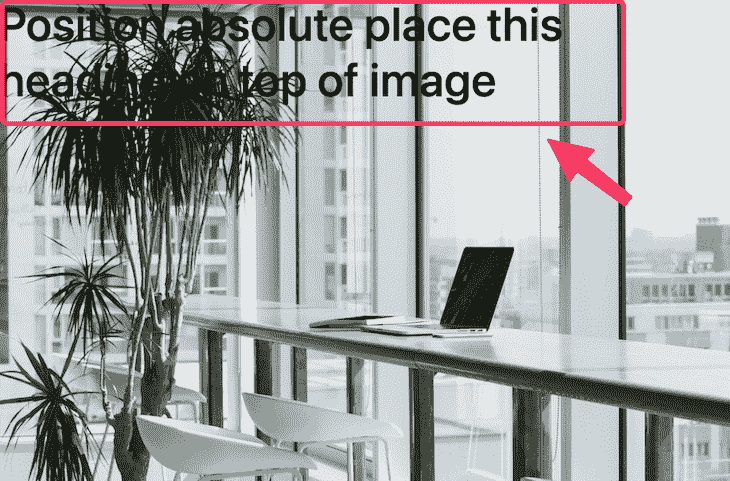

记住这个定位特性，我们就可以开始实现图像叠加了。

## 探索``元素的各种图像叠加 CSS 效果

从上面的图片中我们可以看到，上面的文字不可读，因此对用户体验不好。为了提高用户满意度，我们将添加一个覆盖，以确保文本可读性。

从下一节开始，我们将创建具有不同效果的不同图像叠加。你可以在 Codepen 上看到这个项目:

参见 [CodePen](https://codepen.io) 上 Ibadehin Mojeed([@ ibaslogic](https://codepen.io/ibaslogic))
的 [CSS 图像叠加示例](https://codepen.io/ibaslogic/pen/yLEPeXm)。

### 带有文本背景色的简单 CSS 图像覆盖

文本覆盖可以简单到在文本后面添加背景颜色。让我们看看下面的标记:

```
<li class="image_wrapper">
  
  <div class="overlay overlay_0">
    <h3>10% OFF</h3> 
  </div>
</li>

```

我们可以像第一个例子一样将文本放置在图像上，然后添加背景色:

```
.image_wrapper {
  position: relative;
}

img {
  display: block;
  object-fit: cover;
  width: 100%;
  height: auto;
}

.overlay {
  position: absolute; 
}

.overlay_0 {
  left: 0;
  top: 0;
  padding: .5rem;
  margin: 4px;
  background: #f4208f;
}

```

输出现在看起来像这样:


这种覆盖效果在电子商务网站的促销标签和其他类似用途中很常见。

### 半透明的标题文本覆盖图像的一部分

另一种流行的叠加样式是在半透明背景上添加标题或图像说明。考虑以下标记:

```
<li class="image_wrapper">
  
  <div class="overlay overlay_1">
    <h3>Image title</h3> 
  </div>
</li>

```

通过覆盖图上的`position: absolute;`、`left: 0;`、`bottom: 0;`声明，我们可以将覆盖文本放在图像的底部:

```
.overlay {
  position: absolute; 
  background: rgba(57, 57, 57, 0.5);

  /* center overlay text */
  display: flex;
  align-items: center;
  justify-content: center;
}

.overlay_1 {
  left: 0;
  bottom: 0;
  width: 100%;
  padding: 1rem;
}

```

我们还在叠加层上应用了半透明背景。请参见下面的输出:

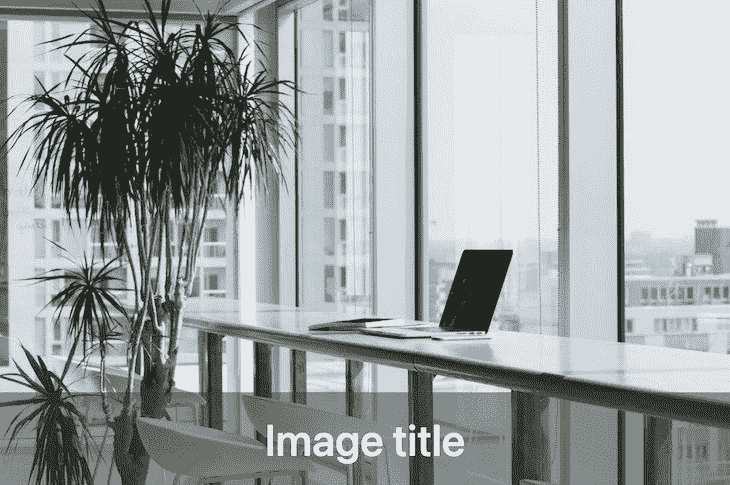

为了美观，我们还[应用了 flexbox 属性](https://blog.logrocket.com/flexbox-vs-css-grid/)将图片标题放在中间。

当同时关注图像和覆盖文本时，上面的例子是理想的。然而，当焦点更多地集中在文本而不是图像上时，我们可以拉伸覆盖以覆盖整个图像。

### 覆盖整个图像的半透明覆盖层

考虑以下标记:

```
<li class="image_wrapper">
  
  <div class="overlay overlay_2">
    <h3>Image title</h3> 
  </div>
</li>

```

在覆盖元素上，我们将使用`top`、`right`、`bottom`和`left`声明来拉伸覆盖，因此它覆盖了整个图像:

```
.overlay_2 {
  top: 0;
  right: 0;
  left: 0;
  bottom: 0;
}

```

我们也可以使用一个声明作为替换上述 CSS 规则的简写:

```
.overlay_2 {
  inset: 0;
}

```

分配给`inset`的值将应用于所有边。输出现在应该是这样的:


记住，在前面的例子中，我们在覆盖层上应用了 flexbox 属性，将文本放置在中心。因为半透明覆盖现在覆盖了整个图像，所以文本也在整个图像上垂直和水平居中。

## 用 CSS 显示悬停时的图像叠加效果

让我们来学习如何仅在用户悬停在图像上时显示覆盖图。我们还将添加幻灯片和缩放效果。

### 悬停时显示文本的图像覆盖，具有缩放效果

对于本例，我们将使用以下 HTML 标记:

```
<li class="image_wrapper">
  
  <div class="overlay overlay_3">
    <h3>Image title</h3> 
  </div>
</li>

```

除了通常的覆盖样式声明，下面的 CSS 规则还包括`transform`、`transition`和`backdrop-filter`属性:

```
.overlay_3 {
  left: 0;
  bottom: 0;
  width: 100%;
  padding: 1rem;
  transform: scale(0);
  transition: all .3s ease-in-out;
  backdrop-filter: blur(8px) brightness(80%);
}

.image_wrapper:hover .overlay_3 {
  transform: scale(1);
}

```

悬停时将`transform: scale()`值从`0`更改为`1`提供了覆盖文本放大视图的视觉效果。与此同时，`backdrop-filter`让我们可以在覆盖图后面应用模糊效果来进一步增加文本的可见性。最后，`transition`提供了平滑的悬停效果。

下面的 GIF 演示了悬停时的缩放效果:

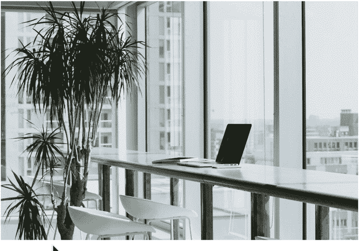

### 悬停时以幻灯片效果显示文本的图像覆盖

我们在这个例子中使用了下面的 HTML 标记:

```
<li class="image_wrapper">
  
  <div class="overlay overlay_4">
    <h3>Image title</h3> 
  </div>
</li>

```

使用下面的 CSS 规则，`bottom`和`height`属性让我们在图像上悬停时实现向下滑动的效果:

```
.overlay_4 {
  left: 0;
  bottom: 100%;
  height: 0;
  width: 100%;
  overflow: hidden;
  backdrop-filter: blur(8px) brightness(80%);
  transition: all .3s ease-in-out;
}

.image_wrapper:hover .overlay_4 {
  bottom: 0;
  height: 100%;
}

```

下面的 GIF 演示了悬停时的滑动效果:


### 图像覆盖在悬停时显示图标，具有缩放效果

类似于文本覆盖，我们也可以让图标出现在我们的图像上。下面，我们将创建一个覆盖图[,上面有一个字体很棒的图标](https://blog.logrocket.com/7-popular-icon-libraries-you-can-use-for-free/),当我们将鼠标悬停在一个图像上时，它就会出现。

在这个例子中，我们将使用下面的 HTML 标记:

```
<li class="image_wrapper">
  
  <div class="overlay overlay_5">
    <a href="#" class="icon">
      <i class="fa-solid fa-camera"></i>
    </a>
  </div>
</li>

```

在 CSS 文件中，我们将导入`font-awesome` CDN，然后像这样应用 CSS 规则:

```
@import url(https://cdnjs.cloudflare.com/ajax/libs/font-awesome/6.2.0/css/all.min.css);

/* ... */

.overlay_5 {
  inset: 0;
  transform: scale(0);
  transition: all .3s ease-in-out;
}

.image_wrapper:hover .overlay_5 {
  transform: scale(1);
}

.icon i {
  border-radius: 50%;
  font-size: 40px;
  color: #8c9e54;
  width: 70px;
  height: 70px;
  background: #fff;
  display: flex;
  justify-content: center;
  align-items: center;
}

```

如您所见，图标覆盖的 CSS 实现类似于具有缩放效果的文本覆盖。下面的 GIF 演示了悬停时的缩放效果:


### 悬停时显示的带有缩放效果的图像上的图像

像图标覆盖一样，我们也可以在悬停时让一个合适的图像出现在另一个图像上。我们可以在电子商务网站上找到这种实现的用例，当我们将鼠标悬停在产品上时，会显示可变的产品图像，如下所示:


我们将在本例中使用以下 HTML 标记:

```
<div class="product-item">
  <div class="product-image">
    <a href="#">
      
      </a>
    <div class="hover-img">
      <a href="#">
        
        </a>
    </div>
  </div>
  <h3>Product title</h3>
  <span>$100</span>
</div>

```

参见 Codepen 上的[完整代码。](https://codepen.io/ibaslogic/pen/KKeEaYq?editors=1100)

不管我们想要文本、图标还是图像覆盖，创建覆盖的方法都是一样的。

在上面的 HTML 标记中，我们在同一个`product-image`元素容器中添加了两幅图像。

我们将给这个容器一个`position: relative;`属性。然后，我们将给予覆盖的图像容器——即`hover-img`——一个`position: absolute;`，同时也使用`inset: 0;`或等效的`top`、`right`、`bottom`和`left`来定位它。

CSS 样式规则将如下所示:

```
.product-item {
  text-align: center;
  width: 350px;
}

.product-image {
  position: relative;
  overflow: hidden;
}

img {
  max-width: 100%;
  height: auto;
  vertical-align: middle;
}

.hover-img {
  position: absolute;
  inset: 0;
  opacity: 0;
  transition: opacity .5s ease, transform 2s cubic-bezier(0,0,.44,1.18);
}

.product-image:hover .hover-img {
  opacity: 1;
  transform: scale(1.12);
}

```

将覆盖图像放置在主图像上后，我们添加了`opacity: 0;`来隐藏它，这样它只在鼠标悬停时显示`opacity: 1;`。在悬停时应用`transform: scale(1.12);`可以提供放大视图的叠加图像的视觉效果。同时，`transition`属性提供了平滑的悬停效果。

## 背景图像覆盖

与``元素不同，作为背景元素包含的图像将自动位于包含的文本或图标之后。这使得应用叠加变得容易，我们马上就会看到。

我们将创建不同的背景图像叠加，使用不同的效果，比如用`linear-gradient()` CSS 函数应用渐变，用 `[mix-blend-mode](https://blog.logrocket.com/creative-text-styling-with-the-css-mix-blend-mode-property/)`和`background-blend-mode`属性应用[混合。我们还将学习如何使用伪元素来创建一个美丽的背景覆盖。](https://blog.logrocket.com/creative-text-styling-with-the-css-mix-blend-mode-property/)

您可以[在 Codepen](https://codepen.io/ibaslogic/pen/MWXryya?editors=1100) 上查看项目:

参见 [CodePen](https://codepen.io) 上 Ibadehin moje ed([@ ibaslogic](https://codepen.io/ibaslogic))
的 [CSS 背景图片叠加示例](https://codepen.io/ibaslogic/pen/MWXryya)。

### 使用 CSS 的简单文本覆盖的背景图像

对于这个例子，我们将从下面的 HTML 标记开始:

```
<section class="bg_image_1">
  <div class="content">
    <h2>Hero title</h2>
    <p>Hero description here</p>
  </div>
</section>

```

在`<section>`容器元素上，我们将使用 CSS 添加一个背景图片:

```
.bg_image_1 {
  background-image: url(https://source.unsplash.com/VWcPlbHglYc);
  background-size: cover;
  background-position: center;
 }

```

结果应该是这样的:

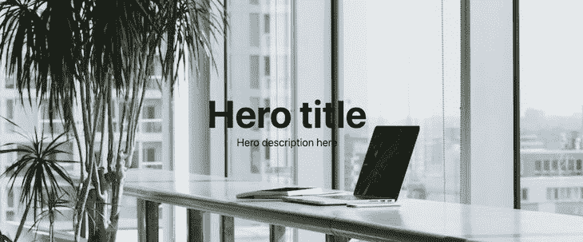

为了美观，我们还应用了 CSS 网格属性，将图像内容放在中央。

正如所料，文本覆盖不是那么可读。

让我们尝试通过在背景元素上应用较低的不透明度来提高文本覆盖的可见性，如下所示:

```
.bg_image_1 {
  /* ... */
  opacity: .3;
}

```

以上添加将影响图像和包含的文本覆盖，这甚至更糟:

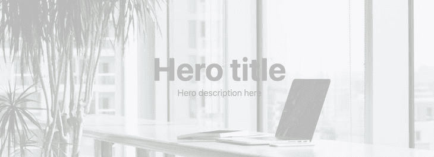

为了在不影响文本的情况下控制图像的不透明度，让我们看看使用伪元素的解决方案。

### 使用伪元素控制背景图像不透明度

使用这种方法，我们将在伪元素上应用背景图像，以分离图像和文本内容:

```
.bg_image_1 {
  position: relative;
 }

.bg_image_1::after {
  content: '';
  position: absolute;
  inset: 0;
  z-index: -1;
  opacity: .4;
  background: pink;
  background-image: url(https://source.unsplash.com/VWcPlbHglYc);
  background-size: cover;
  background-position: center;
}

```

使用`inset`属性，背景相对于父元素放置，并出现在文本内容上。然后我们应用一个负的`[z-index](https://blog.logrocket.com/zindex-react-native-stack-elements-best-practices/)` [来改变堆叠顺序](https://blog.logrocket.com/zindex-react-native-stack-elements-best-practices/)并将背景图像移到文本后面。

然后，使用伪元素上的`opacity`属性，我们可以降低背景图像的对比度:

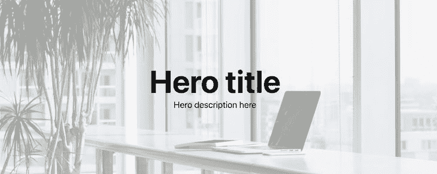

现在，正如我们在图像中看到的，我们已经增加了文本覆盖的可见性。

### 使用`background-blend-mode`属性

上面使用的伪元素方法可能有点复杂。使用`background-blend-mode` CSS 属性，我们可以用一小段代码在背景图像上应用覆盖。该属性将背景图像与元素的背景色混合。

我们将在本例中使用以下 HTML 标记:

```
<section class="bg_image_2">
  <div class="content">
    <h2>Hero title</h2>
    <p>Hero description here</p>
  </div>
</section>

```

然后，指定我们的背景图像的混合模式为`multiply`:

```
.bg_image_2 {
  background-color: steelblue;
  background-image: url(https://source.unsplash.com/VWcPlbHglYc);
  background-size: cover;
  background-position: center;
  background-blend-mode: multiply;
  color: #fff;
}

```

结果应该是这样的:

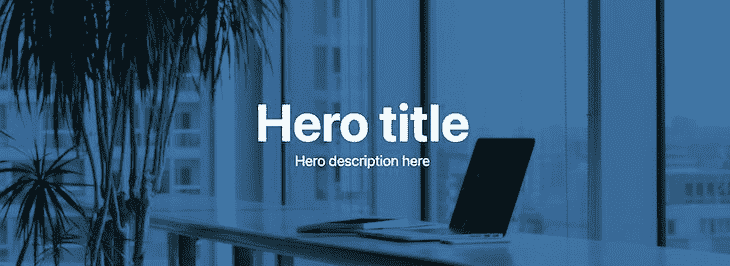

如上所述，叠加效果是由于将背景图像与元素的背景色混合而产生的。

### 使用`linear-gradient()` CSS 功能

使用`linear-gradient()` CSS 函数，我们只用一行代码就可以实现背景叠加。它易于实现，并且像混合模式方法一样，不需要使用伪选择器。

我们将在本例中使用以下 HTML 标记:

```
<section class="bg_image_3">
  <div class="content">
    <h2>Hero title</h2>
    <p>Hero description here</p>
  </div>
</section>

```

然后，我们将在背景 URL 旁边的背景图像上添加一个线性渐变:

```
.bg_image_3 {
  background-image: linear-gradient(rgba(70, 130, 180, .8), rgba(178, 34, 34, .8)), url(https://source.unsplash.com/VWcPlbHglYc);

  background-size: cover;
  background-position: center;
  color: #fff;
}

```

结果应该是这样的:

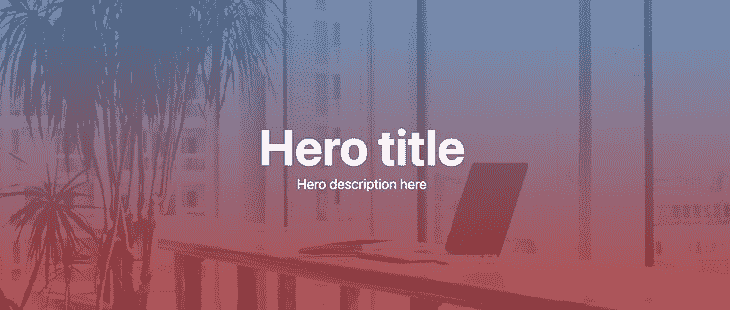

使用线性渐变，我们在两种半透明颜色之间逐渐过渡，以实现渐变叠加效果。

### 使用`mix-blend-mode` CSS 属性

像`background-blend-mode`属性一样，`mix-blend-mode`让我们将元素的内容与其父背景混合。

让我们考虑以下标记:

```
<section class="bg_image_4">
  <div class="content content_4">
    <h2>Hero title</h2>
    <p>Hero description here</p>
  </div>
</section>

```

使用下面的 CSS，我们在 section 容器元素上添加了一个背景图像，并应用了一个伪选择器来覆盖背景颜色:

```
.bg_image_4 {
  background-image: url(https://source.unsplash.com/VWcPlbHglYc);
  background-size: cover;
  background-position: center;
  color: #fff;
}

.content_4 {
  position: relative;
}

.content_4::after {
  content: '';
  position: absolute;
  background: #074f57;
  inset: 0;
  z-index: -1;
}

```

如果我们看一下结果，我们会得到如下结果:

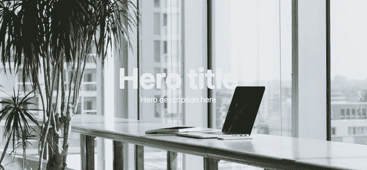

将负片`z-index`应用于覆盖图，我们可能会期望背景色出现在文本后面。然而，它远远落后于背景图像。

如果我们暂时移除背景图像，我们应该会看到背景颜色:

```
.bg_image_4 {
  /* ... */
  background-size: cover;
  background-position: center;
  color: #fff;
}

```

移除背景图像的结果:

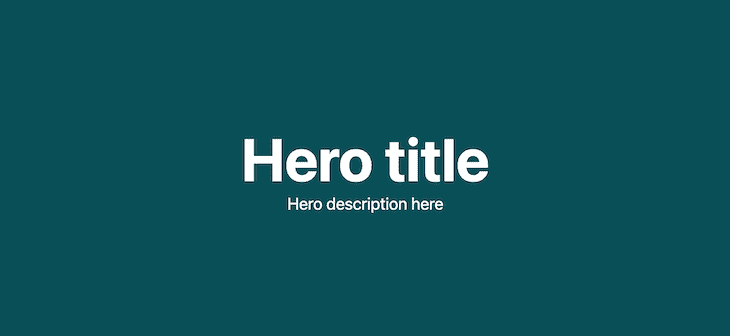

为了确保背景颜色位于文本之后，而不是父背景图像之后，我们将使用背景元素上的 CSS `isolation`属性来创建一个[新的堆栈上下文](https://developer.mozilla.org/en-US/docs/Glossary/Stacking_context)。

让我们返回背景图像并添加`isolation`属性:

```
.bg_image_4 {
  background-image: url(https://source.unsplash.com/VWcPlbHglYc);
  background-size: cover;
  background-position: center;
  color: #fff;
  isolation: isolate;
}

```

此时，背景图像位于背景颜色之后。

现在，我们可以在伪选择器上应用`mix-blend-mode`来混合背景颜色和它的父背景图像:

```
.content_4::after {
  /* ... */
  mix-blend-mode: multiply;
}

```

结果应该是这样的:

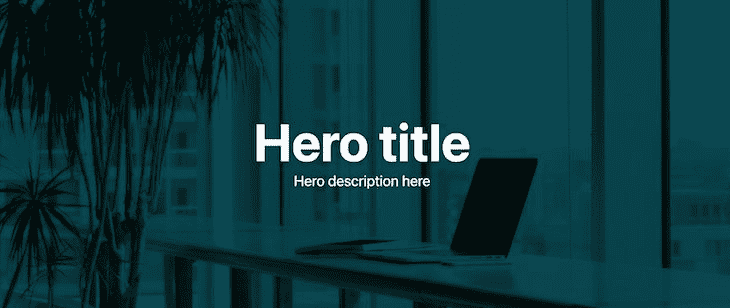

现在我们有了一个很好的背景图像覆盖，文本是可读的。

## 结论

创建图像叠加在各种设计和场景中都很有用。在创建网页英雄部分、[响应图库](https://blog.logrocket.com/responsive-image-gallery-css-flexbox/)和许多其他用例时，这是很方便的。

本指南讨论了如何在 CSS 中的背景图片和常规``元素上创建一个漂亮的覆盖图。如果你喜欢这一课，在网络上分享它。最后，我们想知道您最喜欢哪种叠加解决方案。请在评论区告诉我们。

## 你的前端是否占用了用户的 CPU？

随着 web 前端变得越来越复杂，资源贪婪的特性对浏览器的要求越来越高。如果您对监控和跟踪生产环境中所有用户的客户端 CPU 使用、内存使用等感兴趣，

[try LogRocket](https://lp.logrocket.com/blg/css-signup)

.

[](https://lp.logrocket.com/blg/css-signup)[https://logrocket.com/signup/](https://lp.logrocket.com/blg/css-signup)

LogRocket 就像是网络和移动应用的 DVR，记录你的网络应用或网站上发生的一切。您可以汇总和报告关键的前端性能指标，重放用户会话和应用程序状态，记录网络请求，并自动显示所有错误，而不是猜测问题发生的原因。

现代化您调试 web 和移动应用的方式— [开始免费监控](https://lp.logrocket.com/blg/css-signup)。