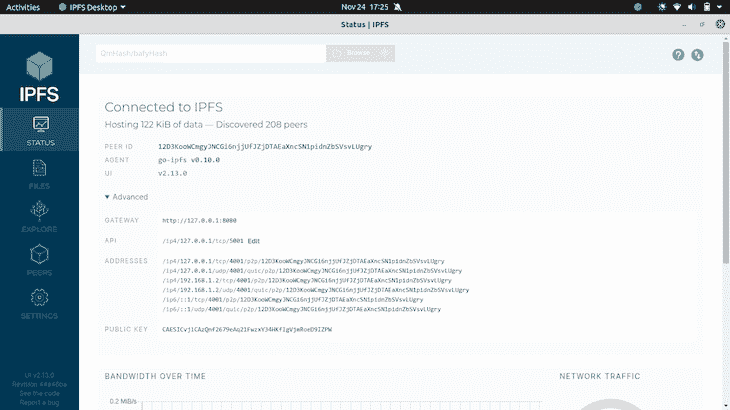
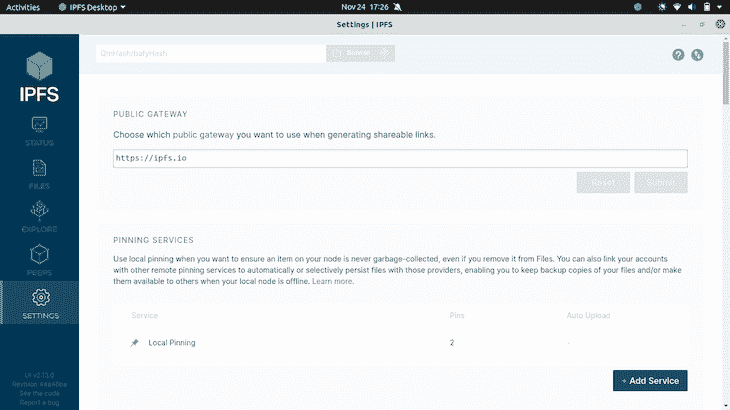
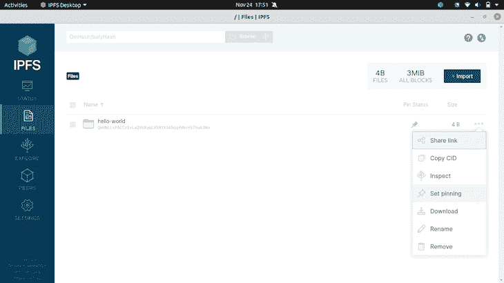
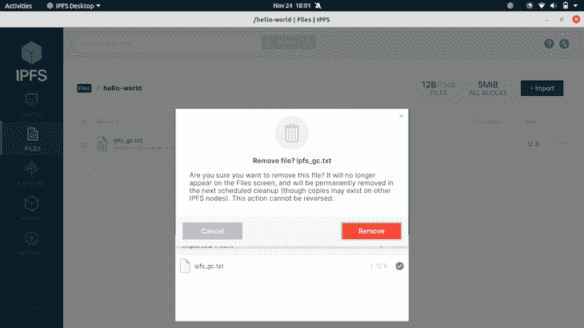
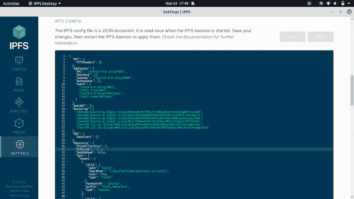
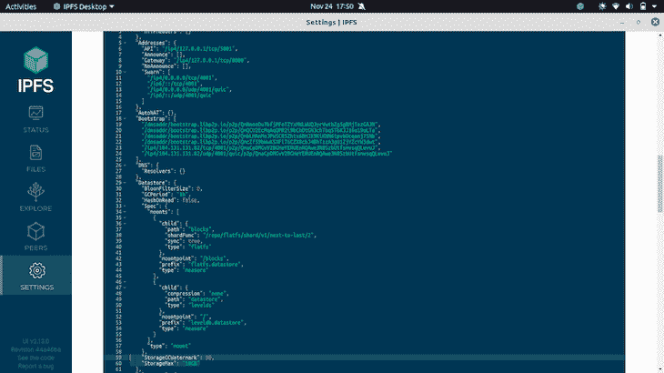
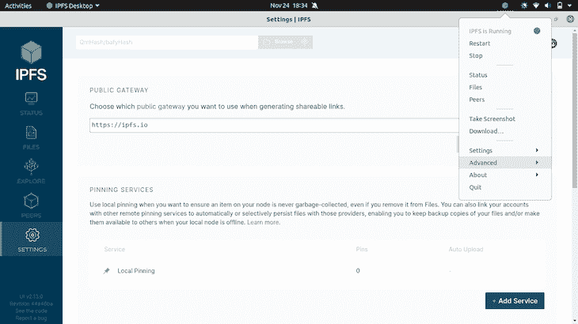
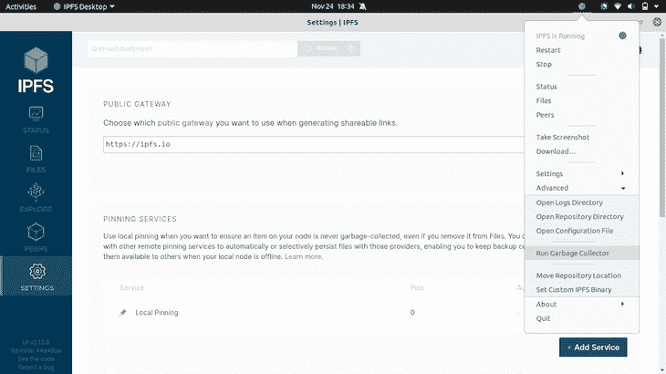
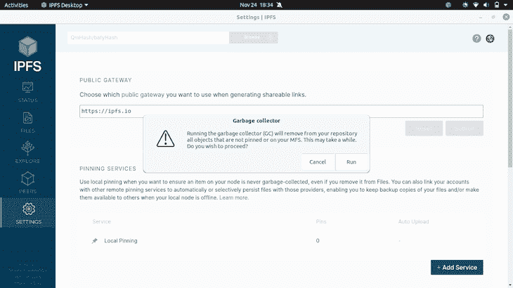
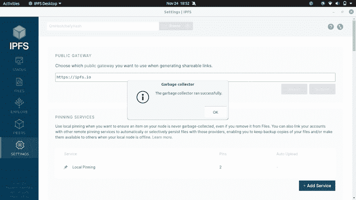

# IPFS 垃圾收集指南

> 原文：<https://blog.logrocket.com/guide-ipfs-garbage-collection/>

星际文件系统(IPFS)是一种分布式系统协议和对等网络，用于存储、共享和访问文件、网站、应用程序和数据。

IPFS 使用内容寻址来唯一地标识分散的全局命名空间中的每个文件，连接网络中存在的每个计算设备。例如，你朋友的计算设备可以给出你的搜索结果，而你的计算设备可以给出附近不同计算设备的搜索结果。

在本教程中，我们将学习如何通过垃圾收集来提高 IPFS 应用程序的速度和效率。首先，我们将介绍一些基础知识，比如垃圾收集是如何工作的以及它的用途。然后，我们将研究自动和手动垃圾收集，以及 IPFS 桌面中的垃圾收集。我们开始吧！



IPFS dashboard

## IPFS 是如何工作的？

[IPFS 网络节点](https://blog.logrocket.com/decentralized-data-storage-using-ipfs-and-react-a-tutorial-with-examples/)是参与分布式、分散式网络的计算设备。

IPFS 通过允许用户存储数据来保存计算设备历史，同时最大限度地减少故障控制，即数据丢失或意外删除的风险。IPFS 保留了用户存储的文件的每个版本，以建立一个用于镜像数据的弹性网络，建立其全球分布式分散节点的目标。

IPFS 网络上的每个节点自动缓存用户下载的资源，并使这些资源可用于其他节点，即分布式分散网络上的计算设备。该系统依赖于这些节点能够在网络内缓存和共享下载的资源。

该分布式分散网络的资源由参与该系统网络的每个计算设备的资源构成。即使是全球性的，资源也是有限的，应该尽可能高效地使用它们来进行高效和快速的交易。

## 什么是 IPFS 垃圾收集？

让我们考虑一种重要的资源，存储。分布式、分散式系统的存储是有限的，受其节点或参与计算设备的限制。为了给更高优先级的资源腾出空间，我们应该清除一些以前缓存的资源，比如下载的文件、网页或查找。清理系统存储中不需要的项目的过程称为垃圾收集。

一般来说，垃圾收集指的是收集、标记和移除散布在网络上的不需要的或空的资源。垃圾收集是一种自动化的资源管理类型，在整个软件开发过程中广泛使用。垃圾收集器，通常称为 gc，回收不再需要或不再使用的已分配对象所占用的资源。IPFS 系统还运行定期垃圾收集。

## 钉在 IPFS

让我们想象一下，一个用户想要在 IPFS 系统上存储一个 [LogRocket 的 Javascript SDK API](https://docs.logrocket.com/reference/javascript-sdk-api) 的镜像，确保所需的数据持久化、永久存储，并且不会在垃圾收集期间被删除。在 IPFS 术语中，这被称为固定到一个或多个 IPFS 节点。

锁定建立了对资源的控制。在我们的例子中，它是存储，更具体地说，是磁盘空间。已建立的控制用于锁定用户或参与节点所需的任何单元或内容，将其永久保存在 IPFS 上。



Pinning services in IPFS Desktop



Pinning a file in IPFS Desktop

每个 IPFS 节点都有自己独立的一组引脚，每个用户都可以决定应该在他们的节点上固定什么。如果用户有多个节点，他们可以使用 IPFS 集群来协调固定。



Scheduled cleanup of deleted files from IPFS

在我们的示例中，IPFS 通过删除不再需要的数据，使用垃圾收集来释放 IPFS 节点上的存储和磁盘空间。

## 查找默认垃圾收集设置

在`/home/username/.config/IPFS Desktop`中，运行下面的代码:

```
cat config.json 
{
        "ipfsConfig": {
                "type": "go",
                "path": "/home/username/.ipfs",
                "flags": [
                        "--agent-version-suffix=desktop",
                        "--migrate",
                        "--enable-gc",
                        "--routing=dhtclient"
                ]
        },

```

你会发现设置了`--enable-gc`标志。

在 IPFS 中有两种类型的垃圾收集支持，自动的和手动的。通过在配置文件中设置一些参数，可以自动启用垃圾收集，我们现在来回顾一下。

## IPFS 自动垃圾收集

IPFS 垃圾收集器配置在`ipfs config`文件的`DATASTORE`部分。与 IPFS 垃圾收集器相关的设置和键如下:

*   `GCPeriod`:定义在启用自动垃圾收集的情况下，垃圾收集运行的频率。默认设置为`1 hour`
*   `StorageGCWatermark`:定义`StorageMax`值的百分比，只要守护程序在启用自动垃圾收集的情况下运行，就会触发自动垃圾收集。默认值是`90`

`ipfs config`存在于`/home/username/.ipfs`内部:

```
{
        "API": {
                "HTTPHeaders": {}
        },
        "Addresses": {
                "API": "/ip4/127.0.0.1/tcp/5001",
                "Announce": [],
                "Gateway": "/ip4/127.0.0.1/tcp/8080",
                "NoAnnounce": [],
                "Swarm": [
                        "/ip4/0.0.0.0/tcp/4001",
                        "/ip6/::/tcp/4001",
                        "/ip4/0.0.0.0/udp/4001/quic",
                        "/ip6/::/udp/4001/quic"
                ]
        },
        "AutoNAT": {},
        "Bootstrap": [
                "/dnsaddr/bootstrap.libp2p.io/p2p/QmNnooDu7bfjPFoTZYxMNLWUQJyrVwtbZg5gBMjTezGAJN",
                "/dnsaddr/bootstrap.libp2p.io/p2p/QmQCU2EcMqAqQPR2i9bChDtGNJchTbq5TbXJJ16u19uLTa",
                "/dnsaddr/bootstrap.libp2p.io/p2p/QmbLHAnMoJPWSCR5Zhtx6BHJX9KiKNN6tpvbUcqanj75Nb",
                "/dnsaddr/bootstrap.libp2p.io/p2p/QmcZf59bWwK5XFi76CZX8cbJ4BhTzzA3gU1ZjYZcYW3dwt",
                "/ip4/104.131.131.82/tcp/4001/p2p/QmaCpDMGvV2BGHeYERUEnRQAwe3N8SzbUtfsmvsqQLuvuJ",
                "/ip4/104.131.131.82/udp/4001/quic/p2p/QmaCpDMGvV2BGHeYERUEnRQAwe3N8SzbUtfsmvsqQLuvuJ"
        ],
        "DNS": {
                "Resolvers": {}
        },
        "Datastore": {
                "BloomFilterSize": 0,
                "GCPeriod": "1h",
                "HashOnRead": false,
                "Spec": {
                        "mounts": [
                                {
                                        "child": {
                                                "path": "blocks",
                                                "shardFunc": "/repo/flatfs/shard/v1/next-to-last/2",
                                                "sync": true,
                                                "type": "flatfs"
                                        },
                                        "mountpoint": "/blocks",
                                        "prefix": "flatfs.datastore",
                                        "type": "measure"
                                },
                                {
                                        "child": {
                                                "compression": "none",
                                                "path": "datastore",
                                                "type": "levelds"
                                        },
                                        "mountpoint": "/",
                                        "prefix": "leveldb.datastore",
                                        "type": "measure"
                                }
                        ],
                        "type": "mount"
                },
                "StorageGCWatermark": 90,
                "StorageMax": "10GB"
        },
        "Discovery": {
                "MDNS": {
                        "Enabled": true,
                        "Interval": 10
                }
        },
.......

```



Setting GCPeriod in IPFS Desktop



Setting StorageGCWatermark and StorageMax in IPFS Desktop

## IPFS 人工垃圾收集

[`ipfs repo gc`](https://docs.ipfs.io/reference/cli/#ipfs-repo-gc) 在存储对象的本地集合上执行垃圾收集清扫，移除那些未被锁定的对象以回收磁盘空间。

若要手动开始垃圾收集，请运行以下代码:

```
ipfs repo gc
removed QmWAtenQY9McR3bE3QCad8tAeCeDqFHzQVtTKZoZC5jwTi
removed QmUB3JuaedWV8MVCfkYo3iUHsBVezD6RKhi4Uh916YEmA4
removed QmPsArmopVpaiMF6MetLP89GfAhCNxGja141f58FPtXWrs
removed QmdDFu5hKF6yRyS8msPKaxYcaUwaoW3RRWV2Nv8ZjGzY5e
removed QmX4vsv8KLGhV2bj873cMZjqGUQqFgWtvsiNVfisrmKjT7

```

要启用自动垃圾收集，请在启动 IPFS 守护进程时使用`--enable-gc`命令标志:

```
ipfs daemon --enable-gc

> Initializing daemon...
> go-ipfs version: 0.10.0
> Repo version: 10
> ...

```

如果`ipfs daemon`已经在运行，它可能会返回以下错误:

```
ipfs daemon --enable-gc

> Error: ipfs daemon is running. please stop it to run this command

```

如果出现错误，运行并重新运行`--enable-gc`命令:

```
ipfs shutdown
ipfs daemon --enable-gc

> Initializing daemon...
> go-ipfs version: 0.10.0
> Repo version: 10
> ...

```

## 使用 IPFS 桌面的垃圾收集

在 IPFS 桌面，垃圾收集可以通过点击 IPFS 桌面应用上的**任务栏**图标来触发。进入**高级→运行垃圾收集器**:



Advanced in IPFS Desktop running instance icon



Run Garbage Collector from IPFS Desktop



Run Garbage Collection from IPFS Desktop



Successfully ran Garbage Collector

## 永久文件删除

如果您向 IPFS 系统添加了一个文件，但想要删除它，您应该确保以下几点:

1.  没有其他节点固定数据
2.  像文件一样，数据或实体是从您自己的节点上解钉的
3.  如果数据或实体是作为固定的一部分添加的，即触发永久存储，则会从 MFS 中删除
4.  垃圾收集是`removed`，你可以使用`ipfs repo gc`来验证

## IPFS 集群中的垃圾收集

垃圾收集也可以[在 IPFS 系统网络](https://cluster.ipfs.io/documentation/reference/api/)的集群中完成:

```
ipfs-cluster-ctl --enc=json --debug ipfs gc
2021-11-19T13:27:06.210+0200    DEBUG   cluster-ctl     ipfs-cluster-ctl/main.go:143    debug level enabled
2021-11-19T13:27:06.211+0200    DEBUG   apiclient       client/request.go:62    POST: http://127.0.0.1:9094/ipfs/gc?local=false

```

端点是`POST /ipfs/gc`，它将顺序触发集群中所有对等体上的垃圾收集。要仅在与接收请求的集群对等体相关联的 IPFS 对等体中触发垃圾收集，您应该添加`?local=true`。

## 结论

现在，您应该能够在自己的 IPFS 应用程序中执行垃圾收集。在上面详述的情况下，您可以为更高优先级的资源释放空间，并提高应用程序的整体速度。

在本教程中，我们讨论了什么是垃圾收集的基础知识，以及它为什么重要。我们还讨论了 IPFS 垃圾收集的可用选项，包括自动、手动、预定和 IPFS 桌面垃圾收集。我希望你喜欢这个教程！

## 加入像 Bitso 和 Coinsquare 这样的组织，他们使用 LogRocket 主动监控他们的 Web3 应用

影响用户在您的应用中激活和交易的能力的客户端问题会极大地影响您的底线。如果您对监控 UX 问题、自动显示 JavaScript 错误、跟踪缓慢的网络请求和组件加载时间感兴趣，

[try LogRocket](https://lp.logrocket.com/blg/web3-signup)

.

[](https://lp.logrocket.com/blg/web3-signup)[https://logrocket.com/signup/](https://lp.logrocket.com/blg/web3-signup)

LogRocket 就像是网络和移动应用的 DVR，记录你的网络应用或网站上发生的一切。您可以汇总和报告关键的前端性能指标，重放用户会话和应用程序状态，记录网络请求，并自动显示所有错误，而不是猜测问题发生的原因。

现代化您调试 web 和移动应用的方式— [开始免费监控](https://lp.logrocket.com/blg/web3-signup)。