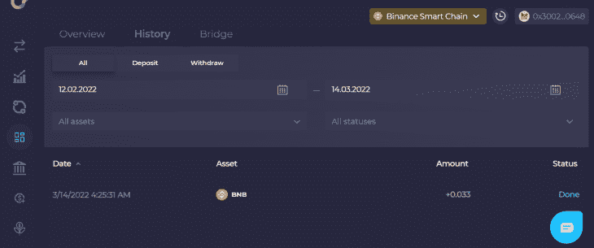
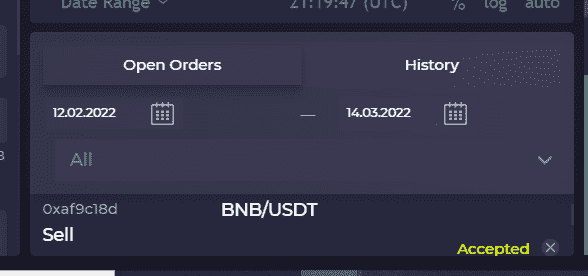

# Orion 协议指南和 Orion Pool 

> 原文：<https://blog.logrocket.com/guide-orion-protocol-orion-pool/>

[Orion Protocol](https://www.orionprotocol.io/) 是一个平台，允许加密投资者在一个地方交换各种代币并管理他们的加密货币投资组合。根据他们的网站，“猎户座试图解决加密市场，NFTs 市场和传统金融资产的碎片化问题，最终将它们聚集到一个地方:猎户座终端。”

对于 Web3 开发人员来说，了解 Orion 协议及其 2021 年发布的 Orion Pool 如何工作对于保持加密和 NFT 交易的领先地位至关重要。

在本教程中，我们将了解猎户座协议和猎户座池。此外，我们还将了解更多关于 Orion 的委托代理证明(DPoB)风险管理模型的信息，并探索 Orion 的使用案例。

## 什么是猎户座协议和猎户座池？

Orion Protocol(或简称“Orion”)是一个 defi 平台，由 Alexey Koloskov 于 2018 年创立，旨在通过将各种加密交换聚合到一个[终端](https://trade.orionprotocol.io/trade/ORN-USDT)中来提供有利可图的交易。这个终端有很多加密货币可以选择。

Orion 终端与包含各种加密货币代币的 Orion 流动性池(“Orion 池”)一起工作。这些令牌被锁定在智能合约中，用于加密交换，并提供市场流动性。与集中式流动性池相比，Orion 池是有效的，因为在执行加密交换时涉及的中介较少。

Orion 终端帮助您在一个地方看到所有分散的交换。在一个平台中分析您的所有加密投资，可以提高您在加密市场中做出数据驱动型决策的能力。不仅如此，它还能给你最好的价格，减少滑点。

当你因为加密货币的价值上升或下降而不得不以不同或意外的价格购买货币时，就会发生滑点。这是由市场波动引起的，可以以好或坏的方式影响你的投资策略，尽管由于其不可预测性，最好避免。

有了滑点，你可能会意外地以更低或更高的价格买到加密令牌。如果你在以太坊价格为 2532 美元时下单，而当以太坊价格在夜间飙升至 3000 美元时订单被执行，那么你损失的钱比你预期的要多。

为了解决滑点问题，Orion 聚集了大量的流动性，以便在执行交易时找到最佳价格。

ORN 令牌用于奖励和促进猎户座分散的经纪网络。以下是 Orion Network 上提供的经纪人列表:

Orion 协议由 [certiK](https://www.certik.com/) 保护和审核，以消除和防止任何可能出现的安全漏洞。它还使用[埃尔隆德智能合约](https://docs.elrond.com/developers/tutorials/crowdfunding-p1/)，执行速度很快。

## Orion 协议的代理证明模型分析

经纪人委托证明(DPoB)模型管理发生在 Orion 平台上的货币兑换。它还允许经纪人和非经纪人对他们的 ORN 进行投资，并对交易所进行验证。这种模式有助于 Orion 网络保持民主化和非垄断化。使用 DPoB，您不必挖掘令牌；你有多少 ORN 决定了你在经纪网络中的排名。

DPoB 由两个利益相关者组成:经纪人和非经纪人。

经纪人负责从 Orion 的流动性聚合器执行交易。一个经纪人拥有多少 Orion 令牌决定了她将被选择执行多少次交易。然而，在经纪人可以执行交易之前，他们必须确定他们的 ORN。经纪人受到激励，以较低的价格向非经纪人收费。

作为 Orion 社区成员的非经纪人必须为他们想要的经纪人投上他们的 ORN。每当非经纪人投票支持经纪人进行交易时，经纪人就会获得更高的声誉和排名。

## Orion 协议的用例

### 贸易交换和流动性聚集

Orion 最好的部分是它有一个加密货币投资组合管理模块。该管理模块使您能够跟踪您的加密货币兑换活动并监控您的指标。它给你交易历史、当前余额和盈亏的信息。

如果你正在投资以太币，你可以设置通知，当以太币市场有交易信号时提醒你。它还提供资产管理自动化。

### 交换加密令牌

Orion 有一个简单漂亮的用户界面，用于交换各种代币。你所需要做的就是连接你的钱包，输入你想要交换的密码数量。

### 提供分散的经纪人服务

Orion 使投资者能够在一个平台上交易各种加密货币，因为它有一个经纪人网络。Orion trade terminal 为您提供了市场表现指标，并为投资者提供了一种简单的存款和存放资金的方式。

## 如何使用猎户座终端

在这一节，你将学习如何交易 BNB 到 USDT，作为学习如何使用猎户座交易终端的一种方式。在您开始交易之前，请确保您有一个至少 0.033BNB 的 [MetaMask](https://metamask.io/) crypto wallet，或任何其他相当于 4.2ORN 的加密货币价值，以便在 Orion trade terminal 上进行交易。

首先点击这个[链接](https://trade.orionprotocol.io/trade/BNB-USDT)进入猎户座交易终端。接下来，点击右上角的**连接钱包**按钮。

接下来，选择你最喜欢的区块链网络和加密钱包。本教程将使用币安智能链网络和元掩码作为钱包。如果您尚未将币安添加到您的加密钱包中，请点击位于 **Binace 智能链**部分下方的**添加网络**按钮。

点击**元掩码**按钮后，浏览器中的元掩码插件将请求您允许 Orion 访问您的元掩码钱包。继续并授予所有权限。

接下来，点击**连接**按钮，完成钱包连接程序。

将 MetaMask 成功连接到 Orion 后，您的钱包地址将显示在右上角。

* * *

### 更多来自 LogRocket 的精彩文章:

* * *

### 在猎户座终端交易

点击[此处](https://trade.orionprotocol.io/trade)进入交易终端的交易段。接下来，点击交易对下拉菜单，获取交易对列表。

使用搜索功能查找 BNB/USDT 组合。选择交易对后，输入你想卖出的 BNB 数量。

交易终端将向您显示出售 BNB 时您将获得多少 USDT，并将向您显示所有交易费用。如果您同意交易费用，请按下**存款 BNB** 按钮存款 BNB。

接下来，您将被要求再次输入您想要卖出的 BNB 数量。

在你点击**存款**按钮后，MetaMask 会询问你是否允许 Orion 从你的钱包中提取 BNB。继续并确认交易。

在您存入 BNB 后，该交易将显示在仪表板上的历史列表中，如下所示。

既然你已经存入 BNB，回到交易终端，点击**卖出**按钮。

接下来，MetaMask 将请求您的签名许可来执行事务。最后，点击**符号**按钮，完成加密货币兑换程序。

### 未结订单

在您签署交易后，货币兑换详细信息将显示在**未结订单**部分。此部分显示交易状态(交易是被接受还是被拒绝)。它还会显示你用 BNB 换来多少 USDT。

等待货币兑换发生。兑换成功后，点击**仪表盘**查看您的余额。

### 退出

仍然在仪表板中，在**概述**页面中导航到**猎户座**部分下方。不幸的是，这一部分不能扩大或调整，以获得一个清晰的全景。因此，滚动该部分，直到您看到您想要提取的加密货币下方的**提取**按钮。

接下来，输入您想要提取的金额，然后点击**提取**按钮。当 MetaMask 请求您的许可时，请务必确认交易。您提取的 USDT 将被存入您连接到 Orion 交易终端的 MetaMask 钱包。

您可以在**历史**页签中查看取款是否成功。

检查您的 MetaMask 钱包余额，以确保从 Orion pool 中提取了正确的金额并成功存入 MetaMask 钱包。

## 结论

在本教程中，我们学习了如何使用 Orion 交易终端销售加密货币。猎户座终端优于其他交易平台，因为它允许您连接各种钱包，以便进行贸易交易。如果你正在寻找一个交换代币和交易加密货币的选择，猎户座终端是一个很好的选择。

## 加入像 Bitso 和 Coinsquare 这样的组织，他们使用 LogRocket 主动监控他们的 Web3 应用

影响用户在您的应用中激活和交易的能力的客户端问题会极大地影响您的底线。如果您对监控 UX 问题、自动显示 JavaScript 错误、跟踪缓慢的网络请求和组件加载时间感兴趣，

[try LogRocket](https://lp.logrocket.com/blg/web3-signup)

.

[https://logrocket.com/signup/](https://lp.logrocket.com/blg/web3-signup)

LogRocket 就像是网络和移动应用的 DVR，记录你的网络应用或网站上发生的一切。您可以汇总和报告关键的前端性能指标，重放用户会话和应用程序状态，记录网络请求，并自动显示所有错误，而不是猜测问题发生的原因。

现代化您调试 web 和移动应用的方式— [开始免费监控](https://lp.logrocket.com/blg/web3-signup)。