# 使用 webpack 进行性能优化的深入指南

> 原文：<https://blog.logrocket.com/guide-performance-optimization-webpack/>

如今，您必须使用像 [webpack](https://webpack.js.org/) 这样的模块捆绑器，才能从利用最先进的性能优化概念的开发工作流中受益。模块捆扎机是由才华横溢的人建造的，只是为了帮助你完成这些困难的任务。

此外，我建议使用一个[初学者工具包](https://webpack.js.org/starter-kits/)或者一个已经有 webpack 配置最佳实践的现代样板项目。在此基础上，您可以进行特定于项目的调整。我喜欢[这个 React + webpack 4 样板项目](https://github.com/esausilva/react-starter-boilerplate-hmr)，这也是这个博客附带演示项目的基础。

webpack 4 带有适当的预设。然而，您必须理解相当多的概念才能获得它们的性能优势。此外，调整 webpack 配置的可能性是无穷无尽的，您需要大量的专业知识来为您的项目找到正确的方法。

你可以跟随我的演示项目的例子。只要切换到上面提到的分支，你就可以亲眼看到调整的效果。`master`分支代表演示应用程序，以及它的初始 webpack 配置。只需执行`npm run dev`来查看项目(应用程序在`[http://localhost:3000](http://localhost:3000)`上打开)。

```
// package.json
"scripts": {
  "dev": "webpack-dev-server --env.env=dev",
  "build": "webpack --env.env=prod"
}
```

## 使用生产模式进行内置优化

webpack 4 引入了[开发和生产模式](https://webpack.js.org/configuration/mode/)。您应该始终向您的用户发布产品版本。我想强调这一点，因为你会自动获得许多内置的优化，比如[树摇动](https://webpack.js.org/guides/tree-shaking/)、[性能提示](https://webpack.js.org/configuration/performance/#performancehints)，或者在生产模式下用`[TerserWebpackPlugin](https://webpack.js.org/plugins/terser-webpack-plugin/)`缩小。

webpack 4 采用了软件工程范式[对配置](https://en.wikipedia.org/wiki/Convention_over_configuration)的约定，这基本上意味着你只需将模式设置为`"production"`就可以获得有意义的配置。但是，您可以通过覆盖默认值来调整配置。在本文中，我们解释了一些与性能相关的配置选项，您可以根据自己的需要为项目定义这些选项。

如果您运行`npm run build`(在`[master](https://github.com/doppelmutzi/react-performance-strategies)`分支上)，您会得到以下输出:

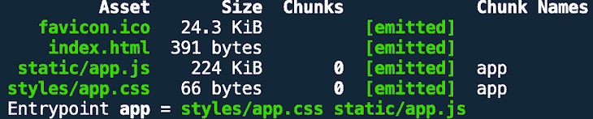

打开`dist/static/app.js`你可以自己看到 webpack 丑化了我们的捆绑包。

如果您检查分支`[use-production-mode](https://github.com/doppelmutzi/react-performance-strategies/tree/use-production-mode)`，您可以看到当您将模式设置为`"development"`时，`app`包的大小是如何增加的，因为没有执行一些优化。

```
// webpack.prod.js
const config = {
+  mode: "development",
-  mode: "production",
  // ...
}
```

结果看起来像这样:

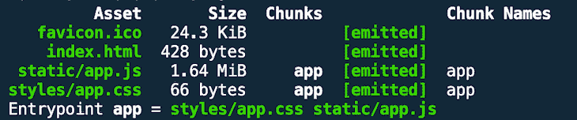

## 定期使用 webpack-bundle-analyzer

你应该定期使用 awesome[web pack-bundle-analyzer](https://github.com/webpack-contrib/webpack-bundle-analyzer)插件来了解你的包由什么组成。在这样做的过程中，您会意识到哪些组件真正驻留在您的包中，并找出哪些组件和依赖项构成了它们的大部分——并且您可能会发现错误到达那里的模块。

以下两个 npm 脚本运行 webpack 构建(开发或生产)并打开 bundle analyzer:

```
// package.json
"scripts": {
  "dev:analyze": "npm run dev -- --env.addons=bundleanalyzer",
  "build:analyze": "npm run build -- --env.addons=bundleanalyzer"
}
```

当您调用`npm run build:analyze`时，会在`[http://localhost:8888](http://localhost:8888)`上打开一个交互式视图。

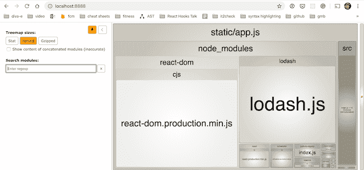

我们演示项目的初始版本只包含一个名为`app.js`的包，因为我们只定义了一个[入口点](https://webpack.js.org/concepts/entry-points/)。

```
// webpack.prod.js
const config = {
  mode: "production",
  entry: {
    app: [`${commonPaths.appEntry}/index.js`]
  },
  output: {
    filename: "static/[name].js",
  },
  // ...
}
```

## 反应生产构建

你应该把[缩小的 React 生产版本](https://reactjs.org/docs/optimizing-performance.html#use-the-production-build)发给你的用户。捆绑的 React 代码要小得多，因为它不包括真正只在开发期间有用的东西，比如警告。

如果您在生产模式下使用 webpack，您会得到一个 React 生产构建，正如您在最后一个截图(`react-dom.production.min.js`)中看到的。

下面的截图显示了更多关于捆绑 React 代码的信息。

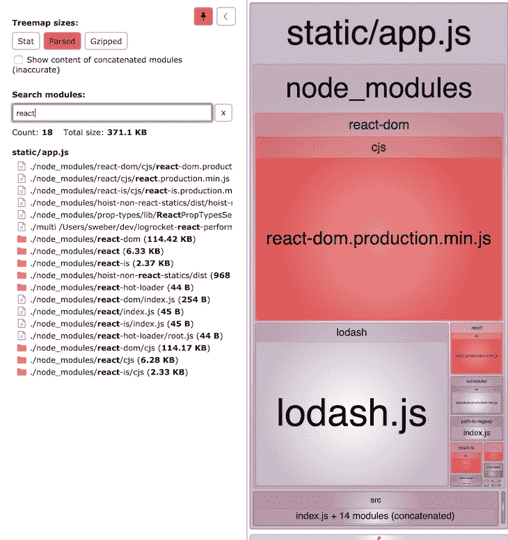

如果您仔细观察，您会发现仍然有一些代码不属于生产版本(例如，react-hot-loader)。这是一个很好的例子，说明为什么频繁分析我们生成的包是寻找进一步优化机会的重要部分。在这种情况下，webpack/React 设置[需要改进以排除 react-hot-loader](https://github.com/gaearon/react-hot-loader/issues/602#issuecomment-575741927) 。

如果您有一个“不足的生产配置”并设置了`mode: "development"`，那么您会得到一个更大的 React 块(切换到分支`[use-production-mode](https://github.com/doppelmutzi/react-performance-strategies/tree/use-production-mode)`并执行`npm run build:analyze`)。

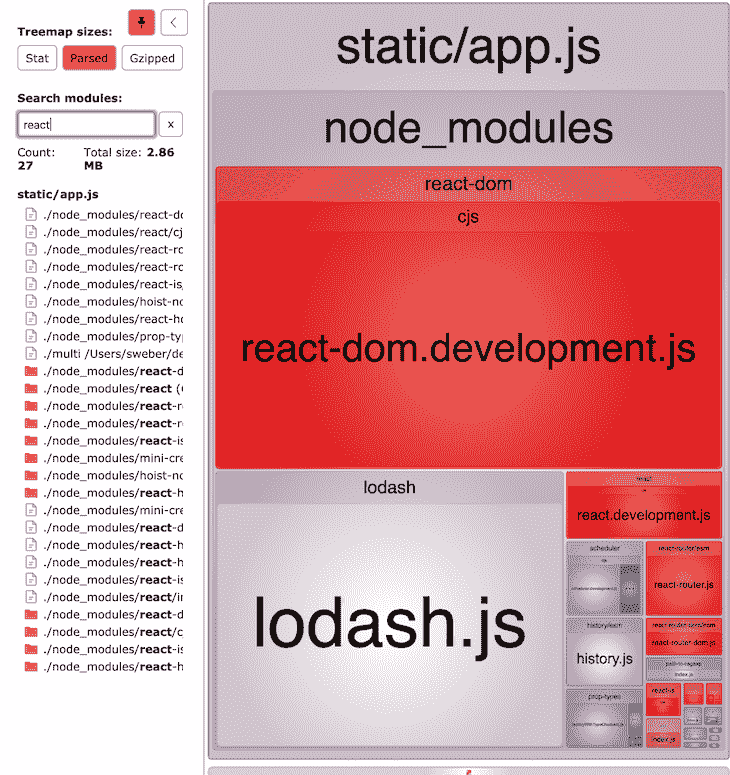

## 为束分裂添加多个入口点

作为前端开发人员，我们的目标应该是提供尽可能少的代码，而不是将我们所有的代码打包发送给我们的用户。这就是代码分割发挥作用的地方。

假设我们的用户通过路线`/profile`直接导航到个人资料页面。我们应该只提供这个概要文件组件的代码。这里，我们将添加另一个入口点，该入口点通向一个新的包(查看`[entry-point-splitting](https://github.com/doppelmutzi/react-performance-strategies/tree/entry-point-splitting)`分支)。

```
// webpack.prod.js
const config = {
  mode: "production",
  entry: {
    app: [`${commonPaths.appEntry}/index.js`],
+   profile: [`${commonPaths.appEntry}/profile/Profile.js`],
  },
  // ...
}
```

当然，其结果是，根据项目的不同，无论是单页应用程序(SPA)还是多页应用程序(MPA)，您都必须确保这些包包含在一个或多个 HTML 页面中。这个演示项目构成了一个 SPA。

好的一面是，您可以在`[HtmlWebpackPlugin](https://github.com/jantimon/html-webpack-plugin)`的帮助下自动完成这一合成步骤。

```
// webpack.prod.js
plugins: [
  // ...
  new HtmlWebpackPlugin({
    template: `public/index.html`,
    favicon: `public/favicon.ico`,
  }),
],
```

运行构建，生成的`index.html`由正确顺序的正确链接和脚本标签组成。

```
<!-- dist/index.html -->
<!DOCTYPE html>
<html lang="en">
  <head>
    <meta charset="UTF-8" />
    <meta name="viewport" content="width=device-width,initial-scale=1" />
    <meta http-equiv="X-UA-Compatible" content="ie=edge" />
    <title>react performance demo</title>
    <link rel="shortcut icon" href="favicon.ico" />
    <link href="styles/app.css" rel="stylesheet" />
    <link href="styles/profile.css" rel="stylesheet" />
  </head>
  <body>
    <div id="root"></div>
    <script src="static/app.js"></script>
    <script src="static/profile.js"></script>
  </body>
</html>
```

为了演示如何生成多个 HTML 文件(对于 MPA 用例)，请查看分支`[entry-point-splitting-multiple-html](https://github.com/doppelmutzi/react-performance-strategies/tree/entry-point-splitting-multiple-html)`。以下设置生成一个`index.html`和一个`profile.html`。

```
// webpack.prod.js
plugins: [
-  new HtmlWebpackPlugin({
-    template: `public/index.html`,
-    favicon: `public/favicon.ico`,
-  }),
+  new HtmlWebpackPlugin({
+    template: `public/index.html`,
+    favicon: `public/favicon.ico`,
+    chunks: ["profile"],
+    filename: `${commonPaths.outputPath}/profile.html`,
+  }),
+  new HtmlWebpackPlugin({
+    template: `public/index.html`,
+    favicon: `public/favicon.ico`,
+    chunks: ["app"],
+  }),
],
```

还有更多[配置选项](https://github.com/jantimon/html-webpack-plugin#options)。例如，您可以用`chunksSortMode`提供一个定制的块排序函数，如这里的中的[所示。](https://medium.com/@jaketripp/cool-things-with-webpack-9a8019bdbd4a)

webpack 只在生成的`dist/profile.html`文件中包含概要包的脚本，以及到相应`profile.css`的链接。`index.html`看起来差不多，只包括 app 捆绑包和`app.css`。

```
<!-- dist/profile.html -->
<!DOCTYPE html>
<html lang="en">
  <head>
    <meta charset="UTF-8" />
    <meta name="viewport" content="width=device-width,initial-scale=1" />
    <meta http-equiv="X-UA-Compatible" content="ie=edge" />
    <title>react performance demo</title>
    <link rel="shortcut icon" href="favicon.ico" />
    <link href="styles/profile.css" rel="stylesheet" />
  </head>
  <body>
    <div id="root"></div>
    <script src="static/profile.js"></script>
  </body>
</html>
```

## 独立的应用程序代码和第三方库

查看`[vendor-splitting](https://github.com/doppelmutzi/react-performance-strategies/tree/vendor-splitting)`分支。让我们分析一下我们产品构建的当前状态。

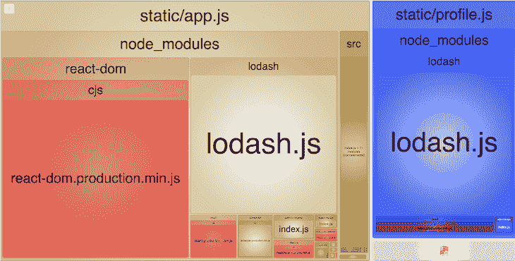

`react.production.min.js`和`lodash.js`在两个束中都是冗余的。

这是个问题吗？是的，因为对于任何类型的应用程序，出于缓存的目的，你都应该将供应商块与你的应用程序块分开。您的应用程序代码只是比供应商代码更改得更频繁，因为您调整依赖项版本的频率更低。

因此，供应商捆绑包可以缓存更长时间，这有利于回访用户。供应商拆分意味着为您的应用程序代码和第三方库创建单独的包。

您可以使用`[SplitChunksPlugin](https://webpack.js.org/plugins/split-chunks-plugin/)`来实现这一点——以及其他代码拆分技术，我们马上就会看到。在我们添加供应商分割之前，让我们先看看当前的生产构建输出。

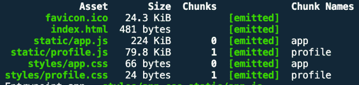

为了使用前述的`SplitChunksPlugin`，我们将`[optimization.splitChunks](https://webpack.js.org/plugins/split-chunks-plugin/#optimizationsplitchunks)`添加到我们的配置中。

```
// webpack.prod.js
const config = {
  // ...
+ optimization: {
+   splitChunks: {
+     chunks: "all",
+   },
+ },
}
```

这一次，我们使用 bundle analyzer 选项(`npm run build:analyze`)运行构建。构建的结果如下所示:

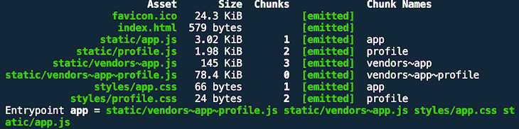

`app.js`和`profile.js`现在小多了。但是等等——两个新的捆绑包，`vendors~app.js`和`vendors~app~profile.js`，已经出现了。正如您所看到的，通过 bundle analyzer，我们成功地将来自`node_modules`(即 React、Lodash)的依赖项提取到单独的 bundle 中。右下角的绿色小盒子是我们的`app`和`profile`包。

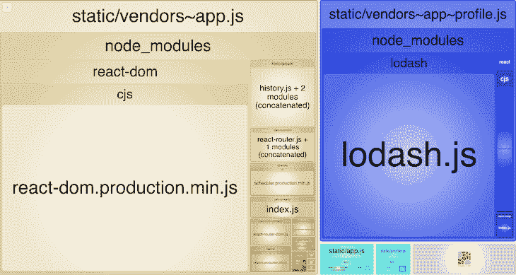

供应商包的名称表明依赖项是从哪个应用程序块中提取的。因为 React DOM 只在`app.js`包的`index.js`文件中使用，所以依赖关系只在`vendors~app.js`内部是有意义的。但是如果 Lodash 只被`profile.js`包使用，为什么它会在`vendors~app~profile.js`包中？

再一次，这是 webpack 的魔法:[约定/默认值](https://webpack.js.org/plugins/split-chunks-plugin/#optimizationsplitchunks)，加上一些巧妙的东西。我非常推荐阅读 webpack 核心成员 Tobias Koppers 关于这个话题的文章[。重要的要点是:](https://medium.com/webpack/webpack-4-code-splitting-chunk-graph-and-the-splitchunks-optimization-be739a861366)

*   代码分割是基于试探法的，试探法根据模块重复计数和模块类别来寻找分割的候选对象
*   默认行为是只挑选≥30KB 的依赖项作为供应商捆绑包的候选项
*   有时，webpack 有意在包中复制代码，以尽量减少对附加包的请求

但是默认行为可以通过`[splitChunks](https://webpack.js.org/plugins/split-chunks-plugin/#optimizationsplitchunks)`选项来改变。我们可以将 [`minSize`选项](https://webpack.js.org/plugins/split-chunks-plugin/#splitchunksminsize)设置为 600KB 的值，从而告诉 webpack，如果它提取的依赖项超过这个值，就先创建一个新的供应商包(查看`[vendor-splitting-tweaking](https://github.com/doppelmutzi/react-performance-strategies/tree/vendor-splitting-tweaking)`分支)。

```
// webpack.prod.js
const config = {
  // ...
  optimization: {
   splitChunks: {
     chunks: "all",
+    minSize: 1000 * 600
   },
 },
}
```

现在，webpack 只推出了一个名为`vendors~app.js`的供应商包。

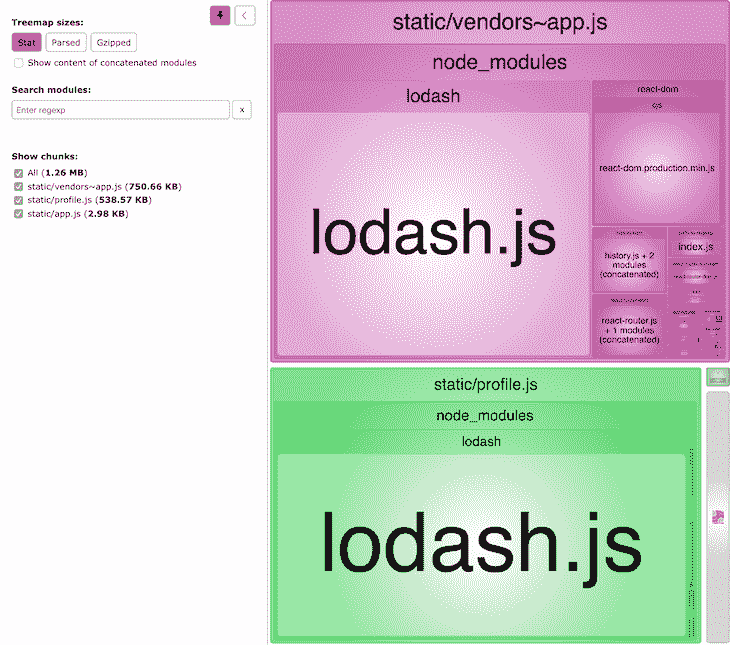

为什么？如果您检查`Stat`的大小，750KB，新的供应商捆绑包大于 600KB 的最小大小。由于我们的新配置，webpack 无法为另一个供应商捆绑包创建另一个候选块。

如您所见，Lodash 在`profile.js`包中也被复制了(记住，webpack 故意复制代码)。如果您将`minSize`的值调整为 800KB，那么 webpack 无法为我们的演示项目提供一个单一的供应商包。我让你来试试这个。

当然，如果你愿意，你可以有更多的控制权。让我们指定一个自定义名称:`node_vendors`。我们为我们的供应商定义了一个`[cacheGroups](https://webpack.js.org/plugins/split-chunks-plugin/#splitchunkscachegroups)`属性，我们从带有`test`属性的`node_modules`文件夹中取出这个属性(查看`[vendor-splitting-cache-groups](https://github.com/doppelmutzi/react-performance-strategies/tree/vendor-splitting-cache-groups)`分支)。在前面的例子中，`splitChunks`的默认值包含开箱即用的`cacheGroups`。

```
// webpack.prod.js
const config = {
  // ...
- optimization: {
-   splitChunks: {
-     chunks: "all",
-    minSize: 1000 * 600
-   },
- },
+ optimization: {
+   splitChunks: {
+     cacheGroups: {
+      vendor: {
+       name: "node_vendors", // part of the bundle name and
+         // can be used in chunks array of HtmlWebpackPlugin
+         test: /[\\/]node_modules[\\/]/,
+         chunks: "all",
+       },
+     },
+   },
+ },
  // ...
}
```

这一次，webpack 向我们展示了一个供应商捆绑包，其中组合了我们的自定义名称和来自`node_modules`的所有依赖项。

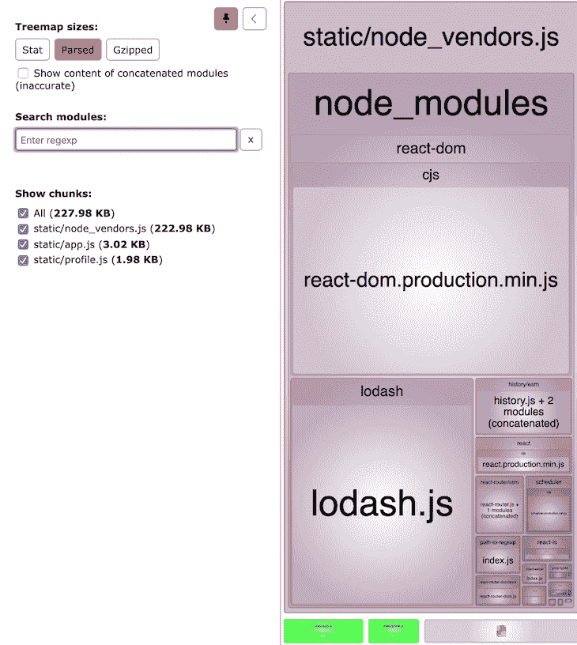

在上面的`splitChunks`属性中，我们添加了一个值为`all`的`[chunks](https://webpack.js.org/plugins/split-chunks-plugin/#splitchunkschunks)`属性。大多数情况下，这个值对于您的项目来说应该是合适的。但是，如果您只想提取惰性或者异步加载的包，那么您可以使用值`async`。当我们在下一节中查看常见的代码分割时，我们将再次讨论这个方面。

## 将共享代码整合到公共包中

通用代码分割旨在将共享代码组合成单独的包，以实现更小的包大小和更高效的缓存。这类似于供应商代码分割，但不同之处在于，您将共享组件和库作为自己代码库中的目标。

在我们的例子中，我们将供应商代码分割与公共代码分割结合起来(查看分支`[common-splitting](https://github.com/doppelmutzi/react-performance-strategies/tree/common-splitting)`)。我们在`Blog`和`Profile`组件中导入并使用`util.js`的`add`函数，它们是两个不同入口点的一部分。

我们用关键字`common`向`cacheGroups`对象添加了一个新对象，用正则表达式仅指向我们的`components`文件夹中的模块。由于这个演示项目的组件非常小，我们需要覆盖 webpack 的默认值`minSize`。以防万一，我们将它设置为 0KB。

```
// webpack.prod.js
const config = {
  // ...
  optimization: {
    splitChunks: {
      cacheGroups: {
        vendor: {
          name: "node_vendors", // part of the bundle name and
          // can be used in chunks array of HtmlWebpackPlugin
          test: /[\\/]node_modules[\\/]/,
          chunks: "all",
        },
+       common: {
+         test: /[\\/]src[\\/]components[\\/]/,
+         chunks: "all",
+         minSize: 0,
+       },
      },
    },
  },
```

运行 webpack 会生成一个新的包`common~app~profile.js`，除了两个入口点包和我们的供应商包。

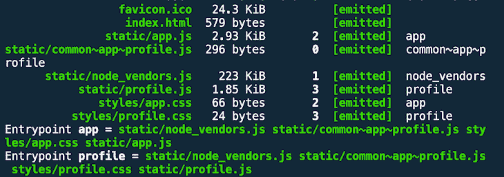

在`dist/static/common~app~profile.js`中搜索`console.log("add")`，你会找到你要找的东西。

## 路由级的延迟加载

我们已经看到了如何在`entry-point-splitting`分支中将 [react-router](https://reacttraining.com/react-router/web) 与入口代码分割结合使用。我们可以通过让用户在浏览我们的应用程序时按需加载不同的组件来进一步推动代码拆分。这个用例可以通过[动态导入](https://webpack.js.org/guides/code-splitting/#dynamic-imports)和路由代码分割来实现。

在我们的演示项目的上下文中，这一点可以从以下事实中得到证明:只有当用户导航到相应的路径(切换到分支`[code-splitting-routes](https://github.com/doppelmutzi/react-performance-strategies/tree/code-splitting-routes)`)时，才会加载`profile.js`包。我们利用了 [@loadable/components](https://github.com/gregberge/loadable-components) 库，它在幕后完成代码拆分和动态加载的艰苦工作。

```
// package.json
{
  // ...
  "dependencies": {
    "@loadable/component": "^5.12.0",
    // ...
  }
  // ...
}
```

为了使用 [ES6 动态导入语法](https://github.com/tc39/proposal-dynamic-import)，我们必须使用一个[巴别塔插件](https://babeljs.io/docs/en/babel-plugin-syntax-dynamic-import)。

```
// .babelrc
{
  // ...
  "plugins": [
    "@babel/plugin-syntax-dynamic-import",
    // ...
  ]
}
```

实现非常简单。首先，我们需要一个微小的包装器来包装我们想要延迟加载的组件。

```
// ProfileLazy.js
import loadable from "@loadable/component";
export default loadable(() =>
  import(/* webpackChunkName: "profile" */ "./Profile")
);
```

我们在`loadable`回调中使用动态导入，并添加一个 webpack 理解的注释(给代码分割块一个自定义名称)。

在我们的`Blog`组件中，我们只需要调整`Router`组件的导入。

```
// Blog.js
import React from "react";
import { BrowserRouter as Router, Switch, Route, Link } from "react-router-dom";
- import Profile from "../profile/Profile";
+ import Profile from "../profile/ProfileLazy";
import "./Blog.css";
import Headline from "../components/Headline";

export default function Blog() {
  return (
    <Router>
      <div>
        <ul>
          <li>
            <Link to="/">Blog</Link>
          </li>
          <li>
            <Link to="/profile">Profile</Link>
          </li>
        </ul>
        <hr />
        <Switch>
          <Route exact path="/">
            <Articles />
          </Route>
          <Route path="/profile">
            <Profile />
          </Route>
        </Switch>
      </div>
    </Router>
  );
}

// ...
```

最后一步是从生产和开发 webpack 配置中删除用于入口点代码分割的`profile`入口点。

```
// webpack.prod.js and webpack.dev.js
const config = {
  // ...
  entry: {
    app: [`${commonPaths.appEntry}/index.js`],
-  profile: [`${commonPaths.appEntry}/profile/Profile.js`],
  },
  // ...
}
```

运行生产构建，您将在输出中看到 webpack 由于动态导入而创建了一个`profile.js`包。

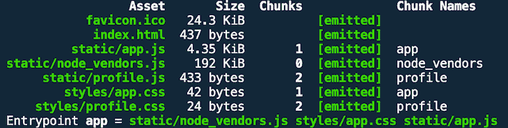

生成的 HTML 文档不包含指向`profile.js`包的脚本。

```
// diest/index.html
<!DOCTYPE html>
<html lang="en">
  <head>
    <meta charset="UTF-8" />
    <meta name="viewport" content="width=device-width,initial-scale=1" />
    <meta http-equiv="X-UA-Compatible" content="ie=edge" />
    <title>react performance demo</title>
    <link rel="shortcut icon" href="favicon.ico" />
    <link href="styles/app.css" rel="stylesheet" />
  </head>
  <body>
    <div id="root"></div>
    <script src="static/node_vendors.js"></script>
    <script src="static/app.js"></script>
  </body>
</html>
```

太棒了——做了正确的工作。

用`development`构建(`npm run dev`)来测试更容易。

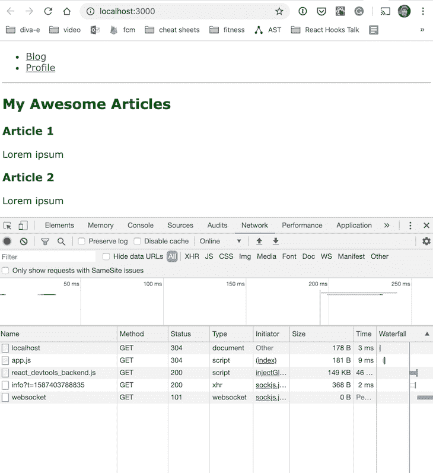

DevTools 显示最初没有加载`profile.js`包。但是，当您导航到`/profile`路径时，这个包会被延迟加载。

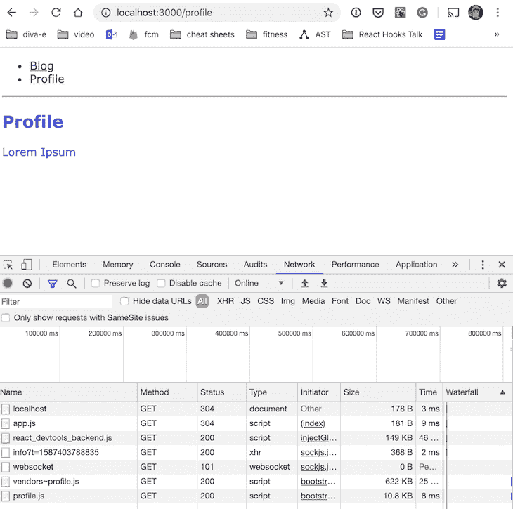

## 组件级的延迟加载

代码拆分也可以在细粒度级别上进行。看看 branch `[code-splitting-component-level](https://github.com/doppelmutzi/react-performance-strategies/tree/code-splitting-component-level)`，你会发现基于路由的延迟加载技术可以用来加载基于事件的更小的组件。

在演示项目中，我们只需在 profile 页面上添加一个按钮，通过单击来加载和呈现一个简单的 React 组件`Paragraph`。

```
// Profile.js
- import React from "react";
+ import React, { useState } from "react";
// some more boring imports
+ import LazyParagraph from "./LazyParagraph";
const Profile = () => {
+ const [showOnDemand, setShowOnDemand] = useState(false);
  const array = [1, 2, 3];
  _.fill(array, "a");
  console.log(array);
  console.log("add", add(2, 2));
  return (
    <div className="profile">
      <Headline>Profile</Headline>
      <p>Lorem Ipsum</p>
+      {showOnDemand && <LazyParagraph />}
+      <button onClick={() => setShowOnDemand(true)}>click me</button>
    </div>
  );
};
export default Profile;
```

`ProfileLazy.js`看着眼熟。我们想将新的包称为`paragraph.js`。

```
// LazyParagraph.js
import loadable from "@loadable/component";
export default loadable(() =>
  import(/* webpackChunkName: "paragraph" */ "./Paragraph")
);
```

我跳过了`Paragraph`,因为它只是一个简单的 React 组件，用于在屏幕上呈现一些东西。

生产构建的输出如下所示。

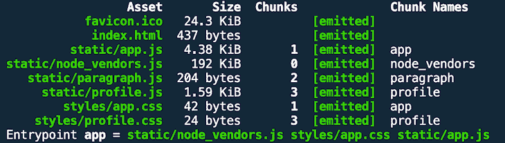

开发构建表明，加载和呈现捆绑到`paragraph.js`中的虚拟组件只发生在单击按钮时。

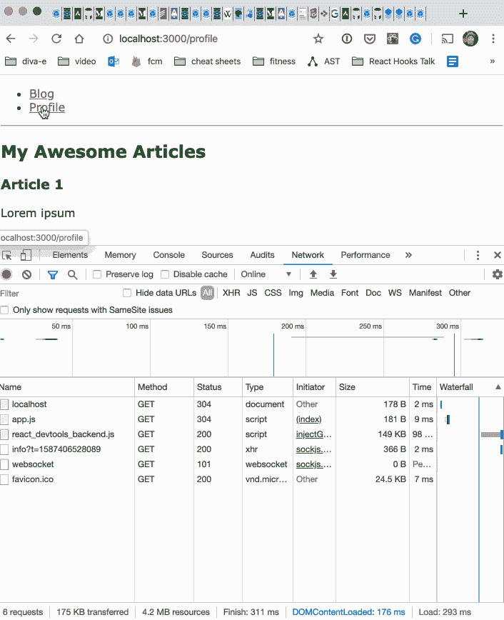

## 将 webpack 的清单提取到一个单独的包中

这到底是什么意思？用 webpack 构建的每个应用程序或站点都包括一个[运行时和清单](https://webpack.js.org/concepts/manifest/)。神奇的是样板代码。清单将我们的代码和供应商的代码连接在一起。它并不是特别大，但是它对于每个入口点都是重复的，除非你对它做些什么。

同样，如果您想要优化浏览器缓存，那么将清单提取到一个单独的包中可能会很有用。这可以让你的用户不必重新下载文件。但是，我不确定清单多久更改一次——在 webpack 版本更新之后？

无论如何，看看这个分支`[manifest-splitting](https://github.com/doppelmutzi/react-performance-strategies/tree/manifest-splitting)`。基础是我们的生产配置，它有两个入口点，现在，供应商/公共代码已经分离。为了提取清单，我们必须添加`[runtimeChunk](https://webpack.js.org/guides/caching/#extracting-boilerplate)`属性。

```
// webpack.prod.js
const config = {
  mode: "production",
  entry: {
    app: [`${commonPaths.appEntry}/index.js`],
    profile: [`${commonPaths.appEntry}/profile/Profile.js`],
  },
  output: {
    filename: "static/[name].js",
  },
+  optimization: {
+    runtimeChunk: {
+      name: "manifest",
+    },    
+  },
  // ...
}
```

一个生产构建展示了一个新的`manifest.js`包。两个入口点包稍微小一点。

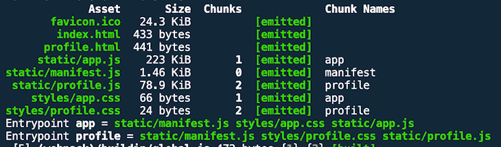

相比之下，这里您可以看到没有经过`runtimeChunk`优化的包的大小。

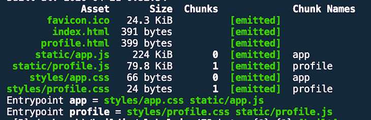

这两个 HTML 文档是用清单的额外脚本标记生成的。作为一个例子，这里你可以看到`profile.html`文件(我跳过了`index.html`)。

```
<!-- dist/profile.html -->
<!DOCTYPE html>
<html lang="en">
  <head>
    <meta charset="UTF-8" />
    <meta name="viewport" content="width=device-width,initial-scale=1" />
    <meta http-equiv="X-UA-Compatible" content="ie=edge" />
    <title>react performance demo</title>
    <link rel="shortcut icon" href="favicon.ico" />
    <link href="styles/profile.css" rel="stylesheet" />
  </head>
  <body>
    <div id="root"></div>
    <script src="static/manifest.js"></script>
    <script src="static/profile.js"></script>
  </body>
</html>
```

## 从捆绑包中排除依赖关系

使用 webpack 的`[externals](https://webpack.js.org/configuration/externals/)`配置选项，可以从捆绑中排除依赖关系。如果环境在其他地方提供了依赖关系，这是很有用的。

例如，如果您在基于 React 的 MPA 上与不同的团队合作，您可以在一个专用的包中提供 React，这个包包含在每个团队包前面的标记中。这允许每个团队将这种依赖性保留在它的包之外。

这是起点(再次在分支`[manifest-splitting](https://github.com/doppelmutzi/react-performance-strategies/tree/manifest-splitting)`)。我们有两个入口点包，一个依赖 React，另一个依赖更大的 react-dom。

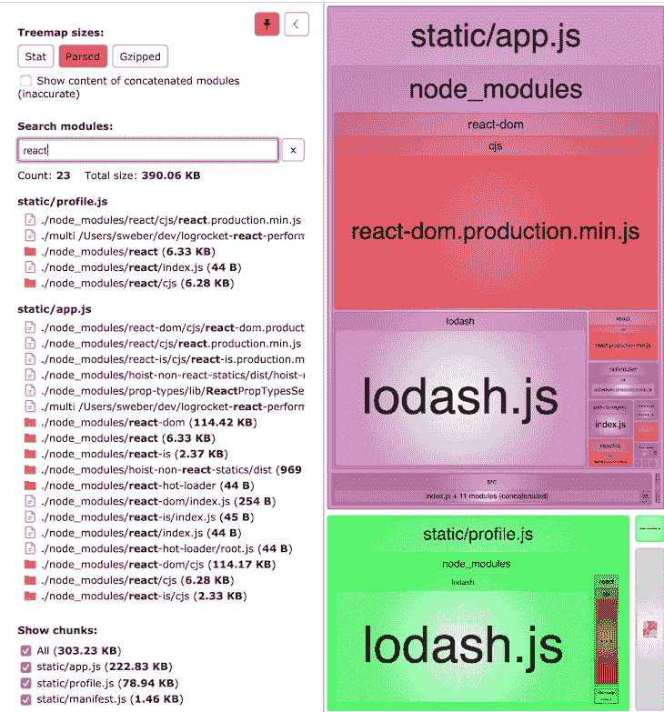

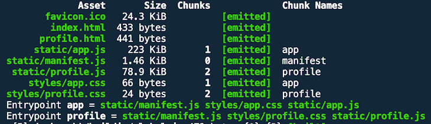

如果我们想将它们从产品包中排除，我们必须将下面的`externals`对象添加到我们的产品配置中(检出分支`externals`)。

```
// webpack.prod.js
const config = {
  // ...  
+  externals: {
+    react: "React",
+    "react-dom": "ReactDOM",
+  },
  // ...
}
```

当您创建一个产品包时，文件大小要小得多。

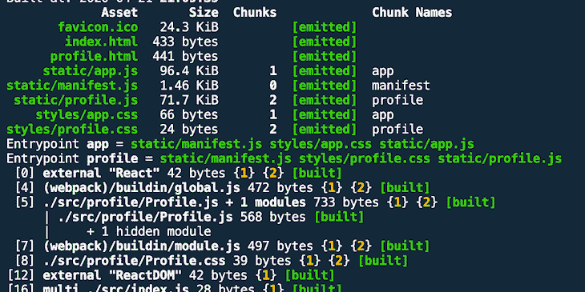

`app.js`的大小从 223KB 缩减到 96.4KB，因为 react-dom 被忽略了。`profile.js`的文件大小从 78.9KB 减少到 71.7KB。

现在我们必须在上下文中提供 React 和 react-dom。在我们的示例中，[我们通过向 HTML 模板文件添加脚本标签来提供 React over CDN](https://reactjs.org/docs/cdn-links.html) 。

```
<!-- public/index.html -->
<body>
  <div id="root"></div>
  <script crossorigin 
    src="https://unpkg.com/[email protected]/umd/react.production.min.js"></script>
  <script crossorigin 
    src="https://unpkg.com/[email protected]/umd/react-dom.production.min.js"></script>
</body>
```

这就是生成的`index.html`的样子(我将跳过`profile.html`文件)。

```
<!-- dist/index.html -->
<!DOCTYPE html>
<html lang="en">
  <head>
    <meta charset="UTF-8" />
    <meta name="viewport" content="width=device-width,initial-scale=1" />
    <meta http-equiv="X-UA-Compatible" content="ie=edge" />
    <title>react performance demo</title>
    <link rel="shortcut icon" href="favicon.ico" />
    <link href="styles/app.css" rel="stylesheet" />
  </head>
  <body>
    <div id="root"></div>
    <script
      crossorigin
      src="https://unpkg.com/[email protected]/umd/react.production.min.js"
    ></script>
    <script
      crossorigin
      src="https://unpkg.com/[email protected]/umd/react-dom.production.min.js"
    ></script>
    <script src="static/manifest.js"></script>
    <script src="static/app.js"></script>
  </body>
</html>
```

## 通过树抖动从包中移除死代码

假设您的代码库中有一个组件，它具有默认和/或命名的导出，但在您的应用程序中任何地方都没有使用。将 JavaScript 包中的代码交付给用户完全是一种浪费。[树抖动](https://webpack.js.org/guides/tree-shaking/)是一种死代码消除技术，它可以从您的包中找到并剥离未使用的代码。

webpack 4 的好处是您很可能不需要做任何事情来执行树抖动。除非您正在使用 CommonJS 模块系统处理遗留项目，否则当您使用生产模式时，您会在 webpack 中自动获得它(尽管您必须使用 ES6 模块语法)。

由于不需要指定模式就可以使用 webpack，或者将其设置为`"development"`，因此必须满足一组附加要求，这里对此进行了详细说明。此外，如 webpack 的树摇动文档中所述，您必须确保没有编译器将 ES6 模块语法转换为 CommonJS 版本。

由于我们在演示项目中使用了 [@babel/preset-env](https://babeljs.io/docs/en/babel-preset-env#modules) ，为了安全起见，我们最好将`modules: false`设置为禁止将 ES6 模块语法转换为另一种模块类型。

```
// .babelrc
{
    "presets": [
      ["@babel/preset-env", { "modules": false }],
      "@babel/preset-react"
    ],
    "plugins": [
      // ...
    ]
  }
```

这是因为 ES6 模块可以由 webpack 进行静态分析，而这在其他变体中是不可能的，比如 CommonJS 的`require`。可以动态改变出口，做各种[猴子打补丁](https://stackoverflow.com/a/42883538)。您还可以在这个项目中看到一个例子，其中`require`语句是在一个循环中动态创建的:

```
// webpack.config.js

// ...
const addons = (/* string | string[] */ addonsArg) => {
  // ...
  return addons.map((addonName) =>
    require(`./build-utils/addons/webpack.${addonName}.js`)
  );
};
// ...
```

如果你想看看没有树晃动时的样子，你可以禁用`[UglifyjsWebpackPlugin](https://webpack.js.org/plugins/uglifyjs-webpack-plugin/)`，它在生产模式下默认使用。

在我们禁用树抖动之前，我首先想证明产品构建确实删除了未使用的代码。切换到`master`分支，看看下面的文件:

```
// util.js
export function add(a, b) { // imported and used in Profile.js
  console.log("add");
  return a + b;
}
export function subtract(a, b) { // nowhere used
  console.log("subtract");
  return a - b;
}
```

在`Profile.js`中只使用第一个函数。再次执行`npm run build`，打开`dist/static/app.js`。您可以搜索并找到两个出现的字符串`console.log("add")`，但没有出现`console.log("subtract")`。这就是它有效的证明。

现在切换到分支`disable-uglify`，这里`minimize: false`被添加到配置中。

```
// webpack.prod.js
const config = {
  mode: "production",  
+ optimization: {
+   minimize: false, // disable uglify + tree shaking
+ },
  entry: {
    app: [`${commonPaths.appEntry}/index.js`],
  },
  // ...
}
```

如果您执行另一个生产构建，您会得到一个警告，提示您的包大小超过了标准阈值。

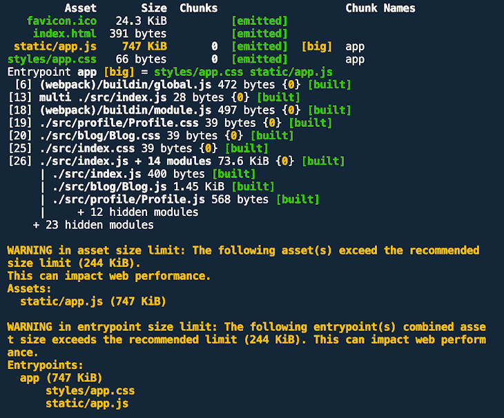

在未损坏的`dist/static/app.js`文件中，您还会发现两次出现`console.log("subtract")`。

但是为什么丑陋插件会被牵扯进来呢？嗯，术语树抖动有点[误导](https://medium.com/@Rich_Harris/tree-shaking-versus-dead-code-elimination-d3765df85c80):在这个步骤中，依赖图的枯叶(例如，未使用的函数)没有被移除。取而代之的是，丑陋插件在第二步中这样做。在第一步中，一个实时代码包含发生，以一种丑陋的插件能够“摇动语法树”的方式标记源代码

## 定义绩效预算

监控项目的包大小至关重要。随着应用程序的不断增长，了解捆绑包何时变得过大并开始影响 UX 非常重要。

正如您在最后一个截图中看到的，webpack 内置了对资产的[性能测量](https://webpack.js.org/configuration/performance/)的支持。在上面的例子中，我们用 747KB 极大地放大了 244KB 的最大阈值。在生产模式下，默认行为是警告您违反阈值。

我们可以为产出资产定义自己的[绩效预算](https://addyosmani.com/blog/performance-budgets/)。我们不关心`development`，但我们希望关注它的生产(检查分支`[performance-budget](https://github.com/doppelmutzi/react-performance-strategies/tree/performance-budget)`)。

```
// webpack.prod.js
const config = {
  mode: "production",
  entry: {
    app: [`${commonPaths.appEntry}/index.js`],
  },
  output: {
    filename: "static/[name].js",
  },
+ performance: {
+   hints: "error",
+   maxAssetSize: 100 * 1024, // 100 KiB 
+   maxEntrypointSize: 100 * 1024, // 100 KiB
+ },
  // ...
}
```

我们将 100KB 定义为资产(例如，CSS 文件)和入口点(例如，生成的 JS 包)的阈值。与前面的截图(`warning`)不同，这里我们将`hints`定义为类型`error`。

正如我们在输出中看到的，这意味着构建将会失败。然而，使用`warning`，构建仍然会成功。

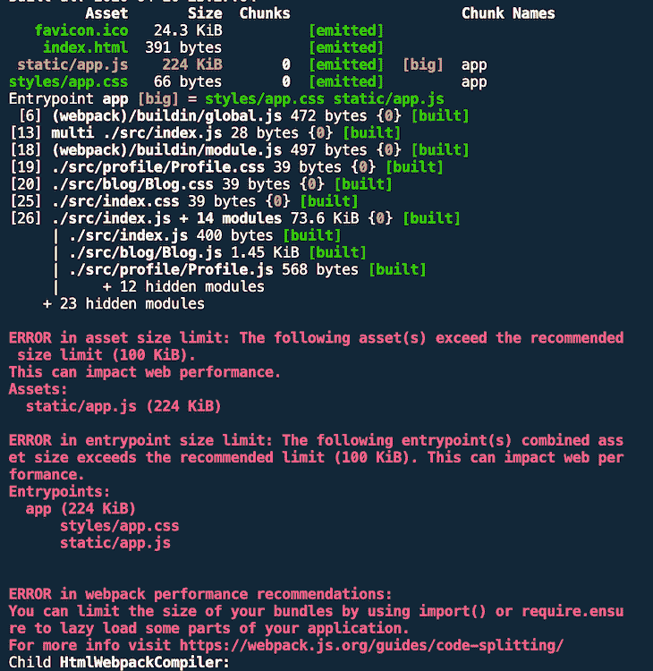

webpack 提供了如何处理这些问题的建议。

我喜欢为构建设置`hints: "error"`。这将导致您的 CI 渠道失败，如果您仍然将其推至 VCS。在我看来，这促进了一种关注捆绑包/资产大小的文化，并最终在早期关注用户体验。

## 使用可树摇动的第三方库

让我们检查一下我们的包，看看与其他组件相比，我们流行的 Lodash 依赖项消耗了多少空间。检查出分支`master`并运行`npm run build:analyze`。

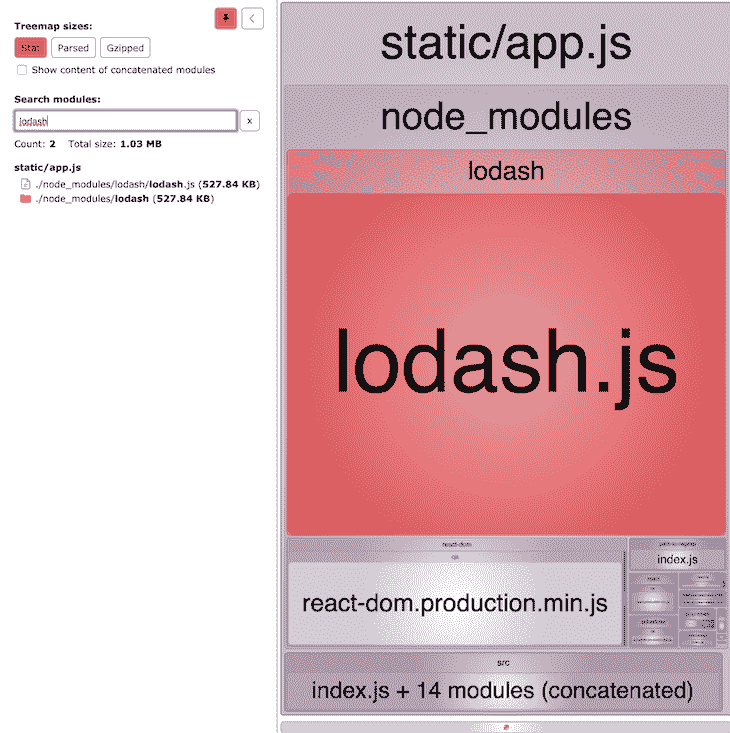

这不仅在绝对意义上，而且相对于其他组成部分来说，都是相当大的一块。这是我们使用它的方式。

```
// Profile.js
import _ from "lodash";
// ...
const Profile = () => {
  const array = [1, 2, 3];
  _.fill(array, "a");
  console.log(array);
  // ...
}
```

问题是，即使我们只使用了`fill`函数，我们也要拉进整个库。幸运的是，Lodash 有一个模块化的架构，也支持树摇动。

我们只需要改变导入，只引入数组函数(检查分支`[lodash-modular](https://github.com/doppelmutzi/react-performance-strategies/tree/lodash-modular)`)。

```
// Profile.js
- import _ from "lodash";
+ import _ from "lodash/array";

// ...
```

构建输出现在看起来好多了。

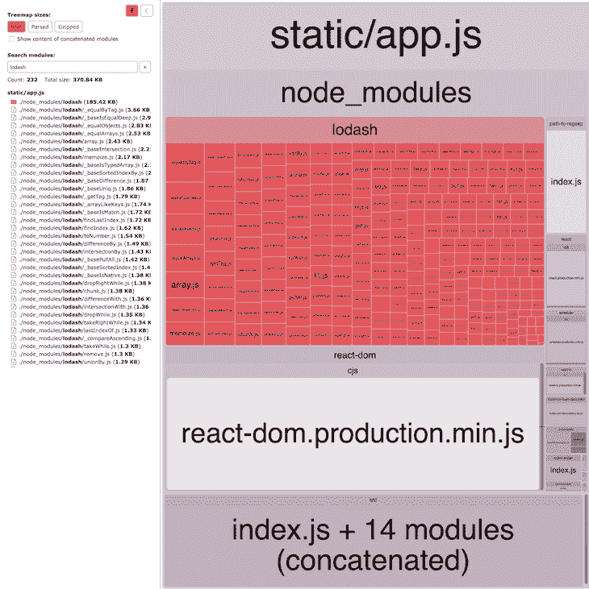

底线是当您检查您的包时，您应该特别注意您的库。如果您只使用了整个库范围的一小部分，那就有问题了。查看库的文档，看是否可以导入单个功能。否则，寻找模块化的替代方案或推出自己的解决方案。

我们现在已经了解了除了一个必须满足的要求之外的所有要求，即外部库需要告诉 webpack 它们没有副作用。

从 webpack 的角度来看，所有的库都有副作用，除非他们另有说明。图书馆所有者必须将他们的项目或部分项目标记为无[副作用的](https://webpack.js.org/guides/tree-shaking/#mark-the-file-as-side-effect-free)。Lodash 也用它的`[package.json](https://github.com/lodash/lodash/blob/master/package.json)`中的`sideEffects: false`属性来做这件事。

## 将正确版本的源地图交付生产

由你和你的团队来决定你是否想要[发布源码图到产品](https://css-tricks.com/should-i-use-source-maps-in-production/)，无论是出于调试的原因还是为了让其他人向你学习。

如果您根本不想要生产包的源映射，您需要确保没有为生产模式设置 [devtool 配置选项](https://webpack.js.org/configuration/devtool/)。但是，如果您确实想拥有用于生产的源地图，请注意使用正确的`devtool`变体，因为它会影响 webpack 的构建速度，最重要的是，会影响包的大小。

对于生产来说，`devtool: "source-map"`是一个很好的选择，因为 JS 包中只生成一个注释。如果您的用户没有打开浏览器的 devtools，他们不会加载由 webpack 生成的相应的源映射文件。

为了添加源地图，我们只需要向产品配置添加一个属性(检查分支`[sourcemaps](https://github.com/doppelmutzi/react-performance-strategies/tree/sourcemaps)`)。

```
// webpack.prod.js
const config = {
  mode: "production",
+ devtool: "source-map",
  // ...
}
```

下面的屏幕截图显示了生产版本的结果。

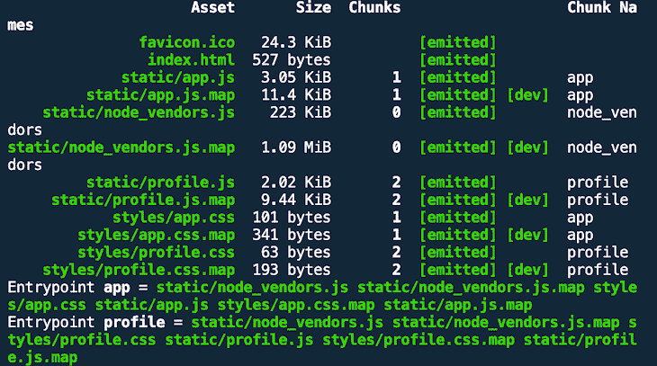

webpack 只在每个资产中添加了一行注释。

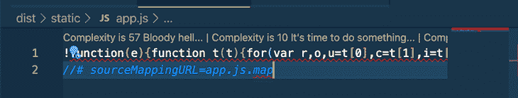

相比之下，当您使用`devtool: "inline-source-map"`运行开发构建时，您可以清楚地看到为什么将这种配置用于生产不是一个好主意。

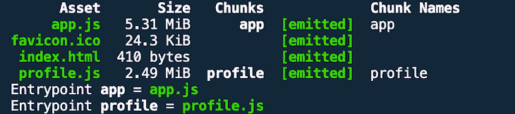

## 准备长期缓存

检查分支`[caching-no-optimization](https://github.com/doppelmutzi/react-performance-strategies/tree/caching-no-optimization)`并运行生产构建来查看起点。

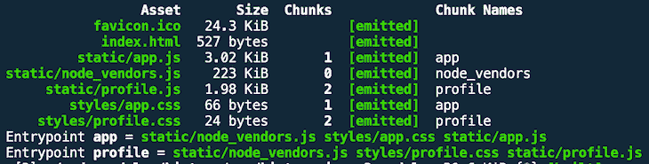

为什么这个结果有问题？从缓存的角度来看，资产名称不是最佳的。我们应该配置我们的 web 服务器来响应设置适当大的`max-age`值的`[Cache-Control](https://developer.mozilla.org/en-US/docs/Web/HTTP/Headers/Cache-Control)`头，以支持长期的浏览器缓存。

然而，使用这些文件名，我们不能在 webpack 由于开发人员的活动(如错误修复、新功能等)而生成新版本后，使浏览器缓存的资产无效。因此，即使我们已经提供了更新的版本，我们的用户也可能最终使用陈旧和有问题的 JavaScript 包。

我们可以做得更好。我们可以在 webpack 配置的不同位置使用占位符字符串——例如在`filename`值中。每当我们对相应的源文件做出改变时，我们使用`[hash]`为资产创建一个唯一的文件名(检查分支`[caching-hash](https://github.com/doppelmutzi/react-performance-strategies/tree/caching-hash)`)。我们也不应该忽视我们的 CSS 资产。

```
// webpack.prod.js
const config = {
  // ...
  output: {
-    filename: "static/[name].js",
+    filename: "static/[name].[hash].js",
  },
  // ...
  plugins: [
    new MiniCssExtractPlugin({
-      filename: "styles/[name].css",
+      filename: "styles/[name].[hash].css",
    }),
    // ...
  ],
}
```

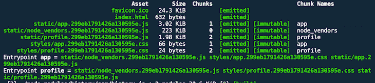

太酷了，我们在文件名中加入了有趣的哈希值。但是不要这么快——我们还没有完成。结果显示所有资产都具有相同的哈希值。这一点帮助都没有，因为每当我们改变一个文件时，所有其他的资产都会收到相同的哈希值。

让我们通过添加一个`console.log`语句来更改`Profile.js`，并再次运行构建。

```
// Profile.js
const Profile = () => {
+ console.log("hello world");
  // ...
};
export default Profile;
```

正如所料，所有资产都获得了相同的新哈希值。

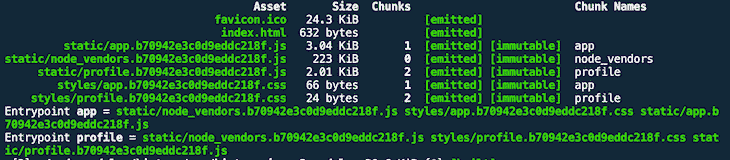

那是因为我们必须使用不同的文件名[替换占位符](https://webpack.js.org/guides/caching/#output-filenames)。除了`[name]`之外，我们还有三个关于缓存的占位符字符串:

*   `[hash]`–如果至少有一个块发生变化，将为整个构建生成一个新的哈希值
*   `[chunkhash]`–对于每个变化的块，都会生成一个新的哈希值
*   `[contenthash]`–对于每个更改的资产，都会生成一个基于资产内容的新散列

起初，不太清楚`[chunkhash]`和`[contenthash]`的区别。让我们试试`[chunkhash]`(检查分支`[caching-chunkhash](https://github.com/doppelmutzi/react-performance-strategies/tree/caching-chunkhash)`)。

```
// webpack.prod.js
const config = {
  // ...
  output: {
-    filename: "static/[name].[hash].js",
+    filename: "static/[name].[chunkhash].js",
  },
  // ...
  plugins: [
    new MiniCssExtractPlugin({
-      filename: "styles/[name].[hash].css",
+      filename: "styles/[name].[chunkhash].css",
    }),
    // ...
  ],
}
```

试一试，然后再次运行生产版本！

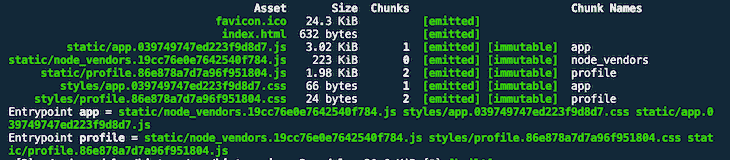

这看起来稍微好一点，但是 CSS 资产的散列与它们对应的 JS 资产匹配。让我们改变`Profile.js`，希望相应的 CSS 文件名不会被更新。

```
// Profile.js
const Profile = () => {
+  console.log("hello world again");
  // ...
};
```

这样的结果更糟糕。正如你在下面的截图中看到的，不仅`Profile.css`文件名包含与新的`Profile.js`相同的新哈希值，而且`App.js`和`App.css`也被更新为另一个新的哈希值。

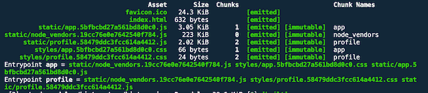

也许`[contenthash]`有帮助？我们来了解一下(检出分支`[caching-contenthash](https://github.com/doppelmutzi/react-performance-strategies/tree/caching-contenthash)`)。

```
// webpack.prod.js
const config = {
  // ...
  output: {
-    filename: "static/[name].[chunkhash].js",
+    filename: "static/[name].[contenthash].js",
  },
  // ...
  plugins: [
    new MiniCssExtractPlugin({
-      filename: "styles/[name].[chunkhash].css",
+      filename: "styles/[name].[contenthash].css",
    }),
    // ...
  ],
}
```

每个资产都被赋予了一个新的但是独立的散列值。


我们成功了吗？我们再换个`Profile.js`里的东西，一探究竟。

```
// Profile.js
const Profile = () => {
+  console.log("Let's go");
  // ...
};
```

CSS 资产名称没有改变，所以我们将它们从关联的 JS 资产中分离出来。

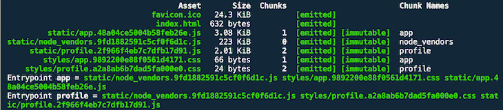

供应商捆绑包仍具有相同的名称。因为`Profile` React 组件被导入到了`Blog` React 组件中，所以两个 JS 包的两个文件名都改变了也没关系。

然而，`Blog.js`中的变化只会导致`app`包名的变化，而不会导致`profile`包名的变化，因为后者不会从前者导入任何东西。

```
// Blog.js
export default function Blog() {
+  console.log("What's up?");
  // ...
}
```

这一次，概要包名称没有改变——太好了！


另外，[官方 webpack doc](https://webpack.js.org/guides/caching/) [s](https://webpack.js.org/guides/caching/) 还推荐你做以下几点:

*   在单独的包中提取清单
*   使用`[moduleIds](https://webpack.js.org/configuration/optimization/#optimizationmoduleids)`

查看分支`[caching-moduleids](https://github.com/doppelmutzi/react-performance-strategies/tree/caching-moduleids)`以获得我们配置的最终版本。

```
// webpack.prod.js
const config = {
  // ...
  optimization: {
+   moduleIds: "hashed",
+   runtimeChunk: {
+     name: "manifest",
+   },
    splitChunks: {
      // ...
    }
  }
  // ...
}
```

现在所有的 JS 包都发生了变化，因为清单被提取到一个单独的包中。结果，它们的尺寸缩小了一点点。

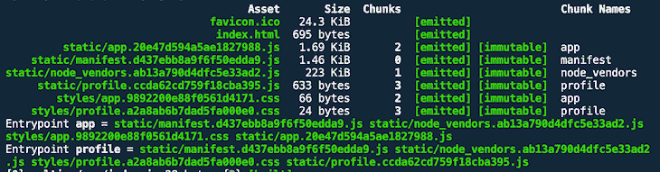

我不确定清单何时会发生变化——可能是在 webpack 版本更新之后？但是我们可以验证最后一步。如果我们更新其中一个供应商依赖项，`node_vendors`包应该得到一个新的散列名称，但是其余的资产应该保持不变。让我们在`package.json`中改变一个随机的依赖关系，然后运行`npm i && npm run build`。

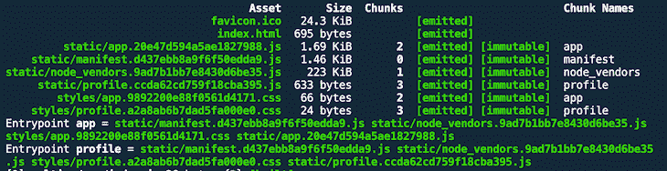

这是艰苦的工作，但是值得的。现在我们对缓存破坏有了更好的准备。

## 结论

性能优化是一件复杂的事情，webpack 让它变得不那么复杂了。

将性能优化集成到您的项目中的关键是理解一些基本概念，例如树抖动、代码分割和缓存破坏。当然，webpack 是一个固执己见的模块捆绑器，但是如果很好地理解了基本原理，使用 webpack 文档并实现您想要的性能目标会更容易。

本指南主要关注 JavaScript 的性能优化技术。一些 HTML 也包含在`HtmlWebpackPlugin`中。还可以涵盖更多领域，例如优化样式(例如，CSS-in-JS、critical CSS)或资产(例如，brotli 压缩)，但这将是另一篇文章的主题。