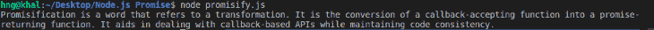

# Node.js 中的承诺指南

> 原文：<https://blog.logrocket.com/guide-promises-node-js/>

在 Node.js 应用程序中，使用大量嵌套回调函数来完成几个活动并不罕见。这通常被称为回调地狱，因为它会使代码变得极其复杂和混乱。

幸运的是，有一个叫做 promises 的 JavaScript 解决方案可以解决回调地狱问题。本文将概述 JavaScript promises，并演示如何在 Node.js 中使用 promises 和`promisfy()`函数。

在本文中，我们将回顾以下内容:

## 先决条件

为了跟进，您应该具备以下条件:

*   已安装 npm 和 Node.js
*   对 JavaScript 的基本理解
*   VS 代码安装，或者您选择的 IDE

## 什么是承诺？

承诺本质上是对管理所有异步数据活动的回调的改进。一个 JavaScript 承诺代表一个要么完成要么拒绝的活动。承诺兑现了，就解决了；否则，它被拒绝。承诺，不像典型的回调，可能是连锁的。

## 承诺是如何起作用的？

JavaScript 承诺有三种状态:待定、已解决和已拒绝。

待定状态是调用承诺时出现的初始状态。当承诺挂起时，调用函数继续运行，直到完成承诺，将请求的任何数据返回给调用函数。

承诺完成后，它会以“已解决”或“已拒绝”状态结束。resolved 状态表示承诺成功，所需的数据被传递给了`.then()`方法。

拒绝状态表示承诺被拒绝，错误被传递给`.catch()`方法。

## 创建自定义承诺

承诺通常通过调用一个`Promise`构造函数来创建，该构造函数接受一个回调函数作为参数。回调函数，也称为 executor 函数，在创建承诺后立即执行。

executor 函数接受两个回调函数作为参数，`resolve`和`reject`，它们被称为函数引用。`resolve()`和`reject()`函数各接受一个参数，可以是字符串、整数、布尔值、对象或数组。

为了更好地理解如何创建定制承诺，让我们来看一下文件，`script.js`:

```
function getSumNum(a, b) {
  const customPromise = new Promise((resolve, reject) => {
    const sum = a + b;

    if(sum <= 5){
      resolve("Let's go!!")
    } else {
      reject(new Error('Oops!.. Number must be less than 5'))
    }
  })

  return customPromise
}

```

这里，我们定义函数`getSumNum()`来计算两个整数`a`和`b`的和。在该函数中，我们使用 promise 构造函数`new Promise()`来生成一个新的 promise。

接下来，我们计算`a`和`b`的`sum`。如果`sum`小于或等于`5`，则执行`resolve`回调。否则，调用`reject`回调。

新的承诺被传递给`customPromise`变量，然后被返回。在上面的例子中，我们返回一个字符串，但它也可以是一个对象或数组。

现在我们已经了解了承诺是如何产生的，让我们回顾一下它是如何被消耗的。

## 履行诺言

在应用程序开发中，消费承诺比创造承诺更常见。

例如，当我们通过返回承诺的 API 从服务器请求数据时，我们利用`then()`和`catch()`方法来消费交付的任何数据。

```
promise.then(data => {
  console.log(data)
})
.catch(err => {
  console.log(err)
})

```

在上面的代码中，当承诺被`resolve()`回调兑现时，`then()`方法被执行。如果承诺失败，调用`catch()`回调，传递`reject()`的错误。
现在，让我们兑现之前许下的承诺:

```
function getSumNum(a, b) {
  const customPromise = new Promise((resolve, reject) => {
    const sum = a + b;

    if(sum <= 5){
      resolve("Let's go!!")
    } else {
      reject(new Error('Oops!.. Number must be less than 5'))
    }
  })

  return customPromise
}

// consuming the promise
getSumNum(1, 3).then(data => {
  console.log(data)
})
.catch(err => {
  console.log(err)
})

```

一和三的和小于五，所以运行`resolve()`回调。这又会执行`then()`方法。如果我们改变参数导致总和大于 5，那么将运行`reject()`回调，并使用`catch()`方法抛出一个错误。

现在，让我们运行以下命令，然后检查控制台:

```
node script.js

```

## 连锁承诺

承诺可用于按顺序执行一系列异步任务。[链接多个`then()` `Promise`结果有助于避免编写复杂的嵌套函数(这可能导致回调地狱)。](https://blog.logrocket.com/understanding-promise-all-in-javascript/)

为了演示链接承诺，让我们利用前面的代码，做一些修改:

```
let value;

function getSumNum(a, b) {
  const customPromise = new Promise((resolve, reject) => {
    const sum = a + b;

    if(sum < 5){
      resolve(sum)
    } else {
      reject(new Error('Oops!.. Number must be less than 5'))
    }
  })

  return customPromise
}

getSumNum(1, 3)
.then(data => {
  console.log("initial data: " + data)
  value = data + 1 // modifying the returned data

  return value
})
.then(newData => {
  console.log("modified data: " + newData)
})
.catch(err => {
  console.log(err)
})

```

在这里，我们看到结果是通过一连串的`then()`方法传递的。我们首先声明一个名为`value`的空变量。这一次，我们没有解析字符串，而是传递了`sum`值。

当初始 promise 对象解析后，调用`then()`函数将初始数据记录到控制台，然后通过添加`1`修改数据，然后将结果总和赋给`value`变量。`value`变量被传递给下一个`then()`方法，数据被记录到控制台。

现在，让我们运行以下命令:

```
node script.js

```

以下是输出结果:

```
initial data: 4
modified data: 5

```

## Node.js `promisfy()`方法

允诺指的是一种转变。它是将接受回调的函数转换成返回承诺的函数。承诺有助于处理基于回调的 API，同时保持代码的一致性。

* * *

### 更多来自 LogRocket 的精彩文章:

* * *

Node.js 有一个内置的实用模块`util.promisify()`，它支持在 JavaScript 中创建灵活的承诺函数。`util.promisify()`接受单个函数参数，其中包含基于回调的函数。

让我们看一个例子来更好地理解如何在 Node.js 中创建一个 promisification 函数。

首先，我们创建两个文件，`promisify.js`和`promise.txt`。

在`promise.txt`文件中，我们添加以下文本:

> 允诺指的是一种转变。它是将接受回调的函数转换成返回承诺的函数。承诺有助于处理基于回调的 API，同时保持代码的一致性。

接下来，我们将以下代码添加到`promisify.js`文件中:

```
// Importing the fs module
const fs = require('fs');
// Importing util module
const util = require('util');
// Use promisify to fs.readFile to promise based method
const readFile = util.promisify(fs.readFile);
readFile('./promise.txt', 'utf8') // Reading the .txt file
.then((text) => {
console.log(text);
})
// Log error if any
.catch((err) => {
console.log('Error', err);
});

```

为了读取上面例子中的文件，我们使用了`fs`模块。然后，我们使用`util.promisify()`技术将`fs.readFile`转换成一个基于承诺的函数。上面的方法现在返回一个承诺，而不是回调。

现在，让我们运行下面的命令:`node promisify.js`

我们看到来自`promise.txt`文件的文本被记录到控制台:



## 承诺 vs. Ajax 请求

客户端请求可以通过 Ajax 请求传输到服务器端。Ajax 是一种特殊类型的异步函数，用于构建动态网站。

当客户端向服务器请求数据时，服务器用所请求的数据进行响应，同时客户端继续执行其当前或后续操作。因此，网站运行不会中断。还可以将 Ajax 与传统的回调接口一起使用:

```
  const XMLHttpRequest = require('xhr2')

  let url = "https://api.github.com/users/kodecheff";
  function makeAJAXCall(methodType, url, callback){
    const xhr = new XMLHttpRequest()
    xhr.open(methodType, url, true);
    xhr.onreadystatechange = function(){
      if (xhr.readyState === 4 && xhr.status === 200){
        callback(xhr.response);
      }
    }

    xhr.send();
    console.log("request sent to the server");
  }

  // callback function
  function logUser(data){
    console.log(data)
  }

  makeAJAXCall("GET", url, logUser);
})

```

相反，承诺是一种用于控制异步活动的技术。这些异步操作可以通过跟踪它们的状态(挂起、已解决、已拒绝)和结果(包括任何错误)来与其他代码或异步函数协调。

Promise 和 Ajax 请求可以互相包装。假设我们想要开始一个异步操作，一旦完成，就开始另一个异步操作(可能使用第一个操作的结果)。

在这种情况下，我们通常将一个嵌套在另一个中。但是与 Ajax 不同，一系列异步任务可以从一个单一的 Promise 结果中执行，消除了回调地狱或嵌套函数。

promises 和 Ajax 请求的另一个区别是 Ajax 可以用于不同的技术，而 promises 需要 JavaScript 才能运行。

## 将现有回调 API 转换为承诺

在基于 Node.js 的环境中，最好对回调使用承诺。不幸的是，回调被用在大多数节点 API 中。调用函数时，Node.js API 回调用作最后一个参数，如下例所示。

### 普通回调 API 代码

```
function perfectSquare (number, callback) {
    const bool = Number.isInteger(Math.sqrt(number))
    if (!bool) {
      return callback(`Number ${number} is NOT a perfect square` )
    }
    callback(`Number ${number} is a perfect square`)
  }

  // callback function
  function callback(data){
    console.log(data)
  }
  perfectSquare(25, callback)

```

这里，`perfectSquare()`方法检查一个数字是否是完美的正方形。`Math.isInteger()`然后在通过`Math.sqrt()`执行的平方根检查的结果后，确定该值是整数还是浮点数。

`bool`变量用于存储`Math.isInteger()`函数的布尔(真或假)结果。调用`callback`函数来解析想要的数据或结果。

### 承诺 API 代码

```
function perfectSquare (number) {
    return new Promise(function (fulfilled, rejected) {
      const bool = Number.isInteger(Math.sqrt(number))
      if (!bool) {
          return rejected( new Error(`Number ${number} is NOT a perfect square`) )
      }
      fulfilled( `Number ${number} is a perfect square` )
    })
  }
  perfectSquare(25).then(res => {
    console.log(res)
  })
})

```

上面的代码返回一个`Promise`而不是一个回调。`rejected()`和`fulfilled()`函数分别返回失败和成功的操作。使用`.then()`方法来利用结果。

### `util.promisfy`方法

下面是同一个例子，但是使用了`util.promisfy`方法，而不是 API 回调或 promise API:

```
const util = require("util")

let promiseCall = util.promisify(perfectSquare)
  promiseCall(5).then(res => {
    console.log(res)
  })
  .catch(err => {
    console.log(err)
  })

```

## 结论

在开发 Node.js 应用程序时，理解如何最佳利用承诺非常重要。与通常的回调函数相比，承诺提供了一种更清晰、更灵活、更有组织的方式来管理异步操作。

在 Node.js 中，我们可以使用`util.promisify()`实用程序模块轻松地将接收回调的标准函数转换为返回承诺的函数。

## 200 只显示器出现故障，生产中网络请求缓慢

部署基于节点的 web 应用程序或网站是容易的部分。确保您的节点实例继续为您的应用程序提供资源是事情变得更加困难的地方。如果您对确保对后端或第三方服务的请求成功感兴趣，

[try LogRocket](https://lp.logrocket.com/blg/node-signup)

.

[](https://lp.logrocket.com/blg/node-signup)[https://logrocket.com/signup/](https://lp.logrocket.com/blg/node-signup)

LogRocket 就像是网络和移动应用程序的 DVR，记录下用户与你的应用程序交互时发生的一切。您可以汇总并报告有问题的网络请求，以快速了解根本原因，而不是猜测问题发生的原因。

LogRocket 检测您的应用程序以记录基线性能计时，如页面加载时间、到达第一个字节的时间、慢速网络请求，还记录 Redux、NgRx 和 Vuex 操作/状态。

[Start monitoring for free](https://lp.logrocket.com/blg/node-signup)

.