# 使用凿子敲击制作原型的指南

> 原文：<https://blog.logrocket.com/guide-prototyping-chiselstrike/>

在产品开发的原型阶段，特别是在高保真原型中，我们通常使用尽可能接近应用程序生产水平的工具。通过 REST 提供的数据尽可能地接近生产环境(至少在前端应用程序上)。

一些流行的点对点 REST 服务器选项有 Express、Fastify、Koa、Nest 和哈比神。我们还有创建定制服务器或使用模拟 API 的选项，这通常是一项耗时且不可靠的任务。

一个新的候选人，也是这篇文章的主题是 ChiselStrike，一个可扩展的后端即服务平台，它简化了后端开发过程，使从原型到生产的过程变得容易。

ChiselStrike 带来了几个有用的特性，可以加快应用程序原型开发，并由一个强大的 API 支持，允许为每个项目进行定制。

当我们在这篇文章中解释凿凿打击提供的原型时，我们将涉及以下内容:

## 什么是凿击？

ChiselStrike 是一个用于创建和托管 web 服务后端的通用平台；它可以用于您可以在云中托管的任何 web 或移动应用程序。

最重要的是，ChiselStrike 是可扩展的，并且在构建应用程序时极大地简化了后端开发过程。您可以在 TypeScript 中开发 ChiselStrike 应用程序，将 JavaScript 超集提供的所有语法优势带入开发过程。

为了演示 chicken strike 如何简化问题，这里有一个 chicken strike 代码的例子，它将实现一个`BlogPost`数据模型的所有 CRUD 操作:

```
import { ChiselEntity } from "@chiselstrike/api"

export class BlogPost extends ChiselEntity {
  title: string
  cover: string
  content: string
  publishedAt: Date = new Date()
  updatedAt?: number 
}

export default BlogPost.crud()

```

上面的代码为我们的数据存储创建了一个`BlogPost`模型，并为我们的 REST API 创建了一个提供所有 HTTP 请求端点的路由。也就是说，我们可以使用路由`/blogpost`来处理对我们的 API 的所有 CRUD 请求，还需要考虑一些额外的问题。

通过使用 SQLite 数据库和类似 Postgres 的数据库，我们可以离线工作(在我们的开发环境中)和在云上工作(生产应用程序)。

## 凿击的优点

凿击有很多明显的优势。但在所有这些问题中，以下问题最为突出:

*   **快速原型制作**:正如我们将在示例中看到的那样，ChiselStrike 作为快速原型制作工具非常好用。它将 API 端点的大量代码简化为数据模型定义和两行代码
*   **无缝数据模型迁移**:由于我们不需要处理或跟踪 SQL 文件，ChiselStrike 使得数据模型的迁移变得很容易。迁移就像添加新的实体类或修改实体类数据属性一样简单
*   **过渡到生产**:由于 chicken strike 拥有 REST API 开发的最佳实践，您可以在 chicken strike 或其他托管平台内迁移到生产，同时保留您的应用的 API 合同，无需担心平台锁定

## 凿子打击的工作原理:将其用于产品原型

为了避免让这篇文章成为一篇按时间顺序排列的关于 chicken strike 特性的文章，我们将通过尝试在一个从 chicken strike 服务器获取数据的真实产品原型上工作来直观地浏览它。并且，在研究这个应用的原型时，我们将了解到 ChiselStrike 的重要概念和 API。

让我们从下面的电子商务应用程序原型中获得灵感。


我们在上面看到的，是我们想象中的电子商务网站 Chisel Store 的产品页面的高保真布局。

我们将根据功能将这个商店的原型分成五个部分，我们将通过提供数据来演示。


为简洁起见，让我们按功能命名编号部分，这样我们就可以很容易地交流我们将从事的工作:

1.  产品列表
2.  产品过滤器
3.  产品搜索
4.  产品分类
5.  页码

### 创建凿击项目

*注意，使用凿击的先决条件是 Node v14.18.0 或更高版本和 npm。打字稿知识是有帮助的，但不是必需的。根据您的工作环境，如果您喜欢快速测试 ChiselStrike 服务器的路由，HTTP 客户端可能也很有用。在使用 REST APIs 时，HTTP 及其方法的知识也是一个额外的收获。*

我们需要创建一个新的 ChiselStrike 项目，它将为我们的前端 web 应用程序 Chisel Store 提供数据。为此，我们需要在目标目录中的终端上运行以下命令:

```
npx [email protected] chisel-store

```

当命令运行完毕后，`cd`进入新创建的目录`chisel-store`。这是您将在其中找到的项目文件的布局:

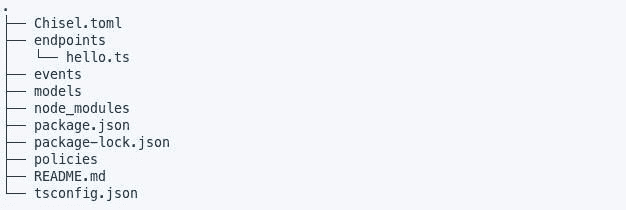

`Chisel.toml`是 ChiselStrike 的配置文件，其中指定了所有必要的顶级目录(`routes`、`models`、`policies`、`events`)，而`tsconfig.json`是项目的 TypeScript 配置。还生成了一个`Dockerfile`,用于构建凿击应用程序的 Docker 映像，然后我们可以使用它将凿击应用程序部署到 Kubernetes、Fly.io 和其他应用程序。随着我们的继续，我们将看到大多数顶级目录的用途。

要在本地运行凿子打击服务器，在项目目录中运行 shell 命令`npm dev`，随后在`package.json`中运行`dev`脚本:

```
npm run dev

```

在`package.json`里面，你会注意到 ChiselStrike 安装了两个依赖项，`@chiselstrike/api`和`@chiselstrike/cli`。`@chiselstrike/api`提供运行时 API，用于以编程方式与凿子打击项目中的`chiseld`(凿子打击服务器)进行交互，而`@chiselstrike/cli`提供开发期间使用的凿子打击 CLI，方便我们运行`chisel dev`脚本来启动我们的本地服务器。

上面的命令启动了服务器，可以通过`8080`端口访问服务器。因此，我们所有的 API 端点都将使用`localhost:8080`作为基本 URL，以`/dev`为前缀(我们稍后将看到为什么路由以`/dev`为前缀)。

注意，从这里开始我们将把`localhost:8080`称为`sBASE_URL`。

试试访问 [localhost:8080/dev/hello](http://localhost:8080/dev/hello) 看看流行的“hello，world！”短语作为结果 JSON 输出。

### 构建路线

为了获取 Chisel Store 项目的数据，我们需要能够构建路径，通过这些路径我们将在应用程序中消费数据。

在 ChiselStrike 中，路径是由分别放在`/routes`中的类型脚本`.ts`文件和在`/entities`顶级目录中找到的实体的组合创建的。

* * *

### 更多来自 LogRocket 的精彩文章:

* * *

#### 凿击路线

通过在`/routes`目录中添加一个 TypeScript 文件来创建路由，该文件的名称成为路由路径名的一部分:`BASE_URL/dev/[TS_FILE_NAME]`。

这些类型脚本文件足以创建 API 路由端点，正如我们在上面的`/dev/hello`路由中所看到的。打开它的`.ts`文件`/routes/hello.ts`，我们发现下面的代码:

```
// hello.ts
// Example ChiselStrike route
//
// To access the route, run:
//
// curl -d '{"hello": "world"}' localhost:8080/dev/hello
import { ChiselRequest, RouteMap } from "@chiselstrike/api";
export default new RouteMap()
    .get("/", function (): string {
        return "hello world";
    })
    .post("/", async function (req: ChiselRequest): Promise {
        return await req.json();
    });

```

这个路由文件实现了一个节点模块，该模块导出一个单独的`RouteMap`对象，该对象分别使用`get()`和`post()`处理函数定义 HTTP `GET`和`POST`请求的行为。

处理函数接受一个描述客户端请求的参数`ChiselRequest`。`ChiselRequest`参数是来自[获取 API](https://developer.mozilla.org/en-US/docs/Web/API/Fetch_API) 的[请求](https://developer.mozilla.org/en-US/docs/Web/API/Request)类的子类。

为了创建 Chisel Store 应用程序的产品列表路径，我们将在`/routes`目录下创建以下`products.ts`文件:

```
// routes/products.ts
import { RouteMap } from "@chiselstrike/api";

export default new RouteMap()
    .get("/", function (): [] {
        return [];
    })

```

当保存这个文件时，`chiseld`会通过在运行终端上记录由`npm run dev`命令启动的消息`Applied:`来给你点头。

#### 凿击实体

访问我们创建的`BASE_URL/dev/products`路由，我们收到一个空的 JSON 输出。我们期望这样，因为我们在`get()`处理函数中返回一个空数组。但是因为我们需要工作数据，所以我们需要某种应用程序数据，在这种情况下，产品数据被返回到我们的 Chisel Store 应用程序。

因此，尽管`/products`路线是在上面创建的，并且被我们的项目所认可，但它对我们来说是不够的。为了使它有用，我们需要将它与相应的数据模型结合起来。

ChiselStrike 为我们提供了一种非常简单的方法来定义项目中的数据模型。我们所需要做的就是从`/models`目录中导出一个扩展了 TypeScript 文件中`@chiselstrike/api`的`ChiselEntity`的模型类。

让我们为应用程序创建一个`Products`模型，如下所示:

```
// models/Product.ts
import { ChiselEntity } from "@chiselstrike/api"
// import { Category } from "./Category"

export class Product extends ChiselEntity {
  name: string
  price: number
  image: string
  details?: string
  soldOut: boolean = false
  // category: Category = new Category()
  createdAt: Date = new Date()
}

```

就像保存`products.ts`文件一样，保存上面的文件会提示`chiseld`在运行的终端上给我们一个`Applied:`消息。

在上面的类中，我们定义了`name`、`price`、`details`、`soldOut`和`createdAt`作为我们的`Product`模型的属性。我们将`details`声明为可选属性，为其添加了一个`?`后缀，就像对[可选类型脚本属性](https://www.typescriptlang.org/docs/handbook/2/objects.html#optional-properties)所做的那样，这意味着在创建新的`Product`实体时，我们不需要为其提供值。

我们已经给了`false`作为`soldOut`的默认值，并将当前日期以毫秒为单位添加到了`createdAt`属性中。

现在，忽略注释的代码，因为我们将在后面详细讨论。

从 chicken strike 的运行时 API 获得的`ChiselEntity`类是我们在 chicken strike 项目中定义的所有实体的基类。该类提供了一些以编程方式处理实体的函数。

当试图填充 Chisel 商店的产品列表部分时，上面声明的`Product`实体为我们提供了一个足够的数据模型。我们所需要的就是找到一种方法使这个数据模型与`/products`路由配对。我们已经在上面的介绍中看到了这一点，当时我们正在展示凿子打击的特性。

为此，用以下代码替换端点文件`routes/products.ts`中的代码:

```
// routes/products.ts
import { Product } from "../models/Product.ts"

export default Product.crud()

```

### 创建和读取数据

再次访问`/dev/products`端点，我们将得到以下输出:

```
{
  "results": []
}

```

正如我们所看到的，在这个实例中已经处理了一个 HTTP `GET`请求。

让我们试着向这个端点提交数据。

使用您选择的 HTTP 客户机，通过 HTTP `POST`请求向`/dev/products`路由提交以下 JSON 数据:

```
{
  "name": "Super Bass Headphones",
  "price": 60,
  "image": "https://asset-train.twic.pics/images/headphone-1.jpg"
}

```

如果一切正常，我们应该会得到下面的 JSON 响应:

```
{
  "id": "f8ab8028-661e-46fd-b926-96f5ec74bcb2",
  "name": "Super Bass Headphones",
  "price": 60,
  "image": "https://asset-train.twic.pics/images/headphone-1.jpg",
  "soldOut": false,
  "createdAt": 1664742791088
}

```

现在，再次尝试访问 [BASE_URL/dev/products](http://localhost:8080/dev/products) 端点。下面是对我们端点的请求的 JSON 响应:

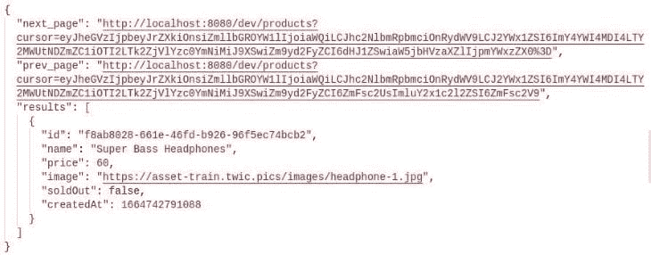

我们将在后面讨论`next_page`和`prev_page`属性。现在把我们的焦点放在`results`属性上，我们可以看到我们在前面的`POST`请求中添加的数据在这个数组中被列为一个条目。

从`ChiselEntity`类传递的`crud()`方法处理我们期望从 API 端点得到的所有 CRUD HTTP 操作——例如，数据的创建、读取、更新和删除。

这是 ChiselStrike 最强大的特性之一，因为有了`products.ts`文件中的两行代码，我们可以处理所有发送到我们的路由的基本 HTTP 操作。这将有助于平稳过渡到生产，因为我们希望 CRUD 操作不仅在原型上工作时得到处理，而且在运行我们的生产应用程序时得到有意义的处理。

### 更新和删除数据

我们已经看到了数据的创建和读取，所以现在我们将讨论更新和删除已创建实体的部分。

要更新添加到数据存储中的数据，我们只需向我们的路由发出一个 HTTP `PATCH`请求，添加我们试图更新的产品的惟一`id`作为端点路径`BASE_URL/dev/products/product_id`的最后一部分。

使用我们最后添加到数据存储中的数据，从`POST`响应中提取获得的`id`,并将其放在上面路由路径的`product_id`部分。使用您的 HTTP 客户端，使用以下 JSON 数据作为有效负载发出一个`PATCH`请求:

```
{
  "price": 72,
  "soldOut": true
}

```

我们应该会收到以下 JSON 响应:

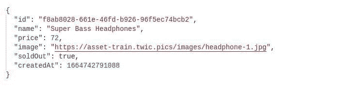

在继续删除请求之前，请再次访问 [BASE_URL/dev/products](http://localhost:8080/dev/products) 以查看我们当前拥有的数据。我们还可以看到我们通过之前的请求所做的更改:

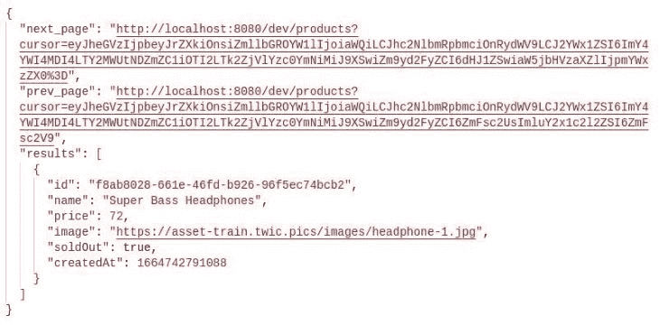

要从我们的数据存储中删除这段数据，我们需要做的就是发出一个 HTTP `DELETE`请求，传递条目`id`，就像我们在`PATCH`请求中所做的那样。

如果我们在发出删除请求后访问`products`端点，我们会看到以下 JSON 输出:

```
"Deleted ID f8ab8028-661e-46fd-b926-96f5ec74bcb2"

```

之后访问`BASE_URL/dev/products`给我们一个空的`results`属性数组，就像我们最初一样:

```
{
  "results": []
}

```

这一部分完成了 Chisel Store 应用程序中关于产品列表的第一部分。一会儿，我们将用通过向我们的 ChiselStrike 服务器发出 HTTP `GET`请求而获得的数据填充该部分；我们只需要先介绍一个概念。

### 实体关系

为了涵盖 Chisel 商店原型的第二部分，产品过滤器，我们需要实现 ChiselStrike 的另一个有用特性:实体关系。由于我们的产品过滤部分需要访问者可以用来过滤的类别列表，我们需要添加一个`Category`实体，用于将产品放入它们的相关组中。

这就是我们注释掉`Product`实体的`category`属性的原因。

在`/models`目录中创建一个`Category.ts`文件，并在其中添加以下代码:

```
// models/Category.ts
import { ChiselEntity } from "@chiselstrike/api"

export class Category extends ChiselEntity {
  name: string
}

```

转到`/endpoints`目录，为这个实体创建一个端点:

```
// models/categories.ts
import { Category } from "../models/Category.ts"

export default Category.crud()

```

上面创建的两个文件创建了一个端点，它处理`/dev/categories`端点的所有 CRUD 操作。

现在，回到我们的`models/Product.ts`实体文件中，注释掉处理`Category`实体导入和`category`属性声明的两行:

```
// models/Product.ts
import { ChiselEntity } from "@chiselstrike/api"
import { Category } from "./Category"

export class Product extends ChiselEntity {
  name: string
  price: number
  image: string
  details?: string
  soldOut: boolean = false
  category: Category = new Category()
  createdAt: number = Date.now()
}

```

在上面的代码中，术语“被引用实体”和“被引用实体”分别用于描述`category`和`Product`，这就是在 ChiselStrike 中创建实体关系的方式。

为了在创建新产品时创建一个被引用的`Category`实体，我们需要在`category`属性上传递它的`details`。

尝试发出一个 HTTP `POST`请求，将下面的`JSON`有效负载传递给`/dev/products`端点，以查看结果:

```
{
  "name": "Baby Shoes",
  "price": 22,
  "image": "https://asset-train.twic.pics/images/shoes-1.jpg",
  "category": {
    "name": "Shoes"
  }
}

```

以下是预期的 JSON 响应:

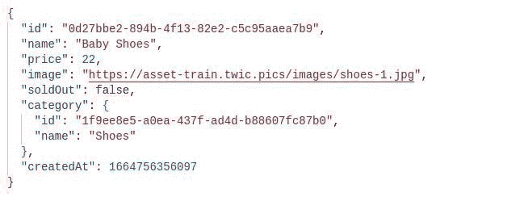

正如我们所看到的，每个结果负载都创建了一个新的类别实体，我们可以通过获取`/dev/categories`端点来检查它的存在，得到如下输出:

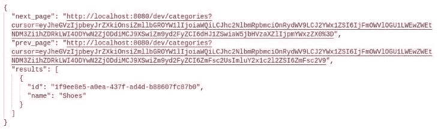

#### 实体迁移

将一个`Category`作为被引用实体添加到现有的引用实体`Product`中，这是对 ChiselStrike 迁移的描述。如果`Product`实体已经有数据，这就不行了。这主要是因为我们添加了一个新的必需数据属性，这是 ChiselStrike 不允许的行为。你可以在的这个页面上阅读更多关于[凿击实体迁移的信息。](https://docs.chiselstrike.com/reference/data-modeling/migration)

现在我们已经建立并运行了`Category`模型，我们可以在应用程序的产品过滤中使用它。我们现在可以将一些数据播种到我们的数据存储中。

为了继续使用 Chisel Store 示例，您可以克隆它的 [GitHub 存储库](https://github.com/xinnks/chisel-store)，并在项目内部运行`npm run dev`来部署本地服务器，然后运行`node utils/seed.js`将一些数据播种到我们的数据存储中。或者，如果您不想克隆这个存储库，请从 repo 的`utils/seed.js`文件中复制代码，该文件包含一些我们可以用来播种本地 ChiselStrike 数据存储的数据。

### 过滤、限制和排序终点结果

让我们看看如何实现对 chickerstreck 端点结果的过滤、限制和排序。我们希望迎合我们的凿子商店应用程序的其余部分需要的功能。

#### 路由过滤器

要添加产品过滤——这是任何电子商务网站的产品列表页面中的一个至关重要的功能——我们需要知道如何在凿击服务器的路由上实现过滤器。

ChiselStrike 允许我们访问几个过滤器，我们可以将它们作为参数传递给我们的路由，最终过滤返回的 JSON 结果。

我们可以向 eroutes 传递尽可能多的过滤参数，以获得我们想要的结果。路由过滤器可以粗略地分为比较过滤器和相等过滤器。

##### 比较过滤器

凿击中支持的比较过滤器如下:

*   `lt`:小于
*   `lte`:小于或等于
*   `gt`:大于
*   `gte`:大于或等于
*   `like`:类似于 SQL `LIKE`，包含通配符`%`和`_`
*   `unlike`:类似于 SQL `NOT LIKE`，包含通配符`%`和`_`

我们通过在有问题的属性前面加一个句点`.property_name`，并在后面加一个波浪号前缀的比较过滤器`~`来应用比较过滤器。然后，我们为这个复杂的查询参数分配一个相关的过滤器值。

观察我们 Chisel Store 应用程序的产品筛选部分，我们需要通过`price`范围和`category`筛选列出的产品。

根据用户提供的数据，我们可以通过三种可能的方式按`price`范围过滤产品:

1.  如果用户只提供下限产品`price`，我们需要通过在`price`属性上只应用`gte`操作符来过滤返回的产品，因此传递带有所提供价格的查询`.price~gte`。要获得`50$`以上的所有产品，我们需要将路线 URL 构建到`BASE_URL/dev/products?.price~gte=50`中
2.  如果用户只提供上限产品`price`，我们需要通过在`price`属性上只应用`lte`操作符来过滤返回的产品。要获得所有低于或等于`120$`的产品，我们需要将路线 URL 构造为`BASE_URL/dev/products?.price~lte=120`
3.  如果用户提供了产品`price`的上限和下限，我们将需要通过两个过滤器，`gte`和`lte`过滤器，分别给它们分配较低和较高的`price`。借用前面的`price`限制，我们最终得到最终的路由 URL: `BASE_URL/dev/products?.price~gte=50&.price~lte=120`

我们可以应用`like`比较过滤器来处理应用程序的产品搜索部分。`like`过滤器适用于处理搜索操作，其行为就像 SQL 过滤器一样。在我们的例子中，我们的搜索结果路由 URL 将被构造为`BASE_URL/dev/products?.name~like=%search_term%`。

*注意，此时(*`@chiselstrike/api - v0.12.1`*),*`like`*过滤器对每个端点调用的一个属性进行操作。*

这涵盖了我们一半的产品过滤器，并最终确定了应用程序的产品搜索功能。

##### 等式过滤器

等式过滤器`=`通过使用作为参数传递的精确值过滤实体属性来运行。像`like`过滤器一样，它只支持过滤每个端点请求的一个属性。

下面是我们如何为 product filters 部分的剩余部分构建一个过滤产品类别的路径:`BASE_URL/dev/products?.category.name=category_name`。

尝试根据上面提供的种子数据只列出属于鞋类的产品，我们可以访问这个端点: [BASEURL/dev/products？. category.name=categoryname](http://localhost:8080/dev/products?.category.name=Shoes) 。我们应该得到以下结果:

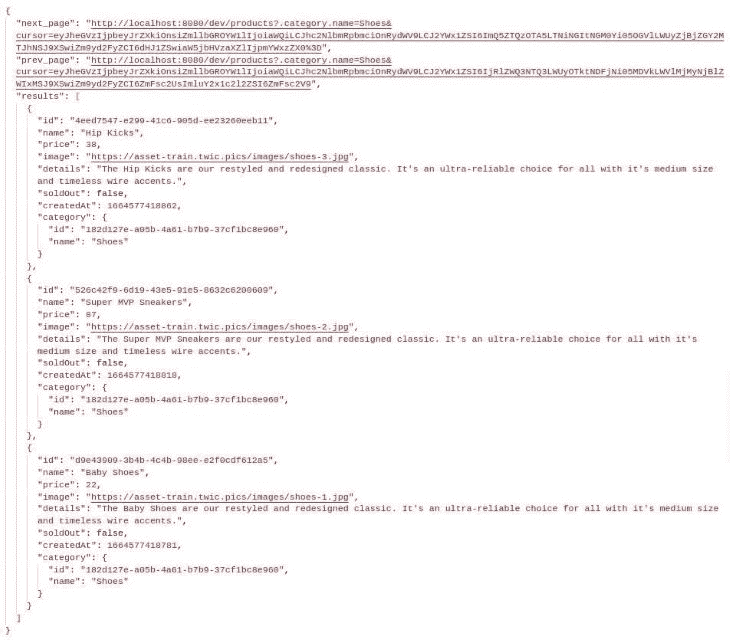

这就完成了我们应用程序的产品过滤器部分。你可以在这里阅读更多关于 ChiselStrike 支持的[端点过滤属性的信息](https://docs.chiselstrike.com/reference/entity-crud-api/filter-order-limit-query)。

#### 对端点结果排序

进入我们应用程序的第四部分，产品分类。我们将通过向我们的`/products`路线传递`sort`参数来对列出的产品进行排序。

为了按照特定属性的顺序对产品进行排序，我们需要将现有实体属性的名称作为参数`sort`的值进行传递。

例如，要在我们的应用程序中按照产品的顺序对返回的产品进行排序，我们需要将路由 URL 构造为 [BASE_URL/dev/products？. category.sort=name](https://file+.vscode-resource.vscode-cdn.net/home/james/Projects/Technical%20Writing/Paid/LogRocketBlog/Misc/A%20guide%20to%20prototyping%20with%20Chiselstrike/(http://localhost:8080/dev/products?sort=name)) 。获取这个端点将会给我们以下 JSON 输出:

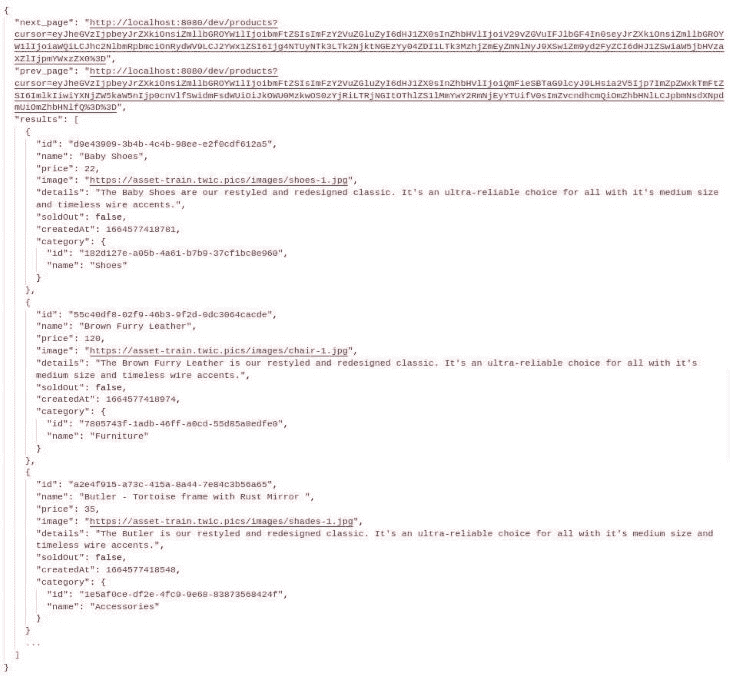

您可能已经注意到，默认情况下，查询结果是按升序排列的。为了以降序排序，要在被传递的属性前面加上一个减号`-`。在这种情况下，我们将把我们的路由 URL 修改为 [BASE_URL/dev/products？. category.sort=name](https://file+.vscode-resource.vscode-cdn.net/home/james/Projects/Technical%20Writing/Paid/LogRocketBlog/Misc/A%20guide%20to%20prototyping%20with%20Chiselstrike/(http://localhost:8080/dev/products?sort=-name)) 。

这涵盖了我们的电子商务原型的产品排序部分。

没有人希望看到一页无休止的结果，我们可以实现延迟加载结果来改善这一点，但有时用户只是向下滚动来访问你的页脚，而不是试图看到更多的项目。因此，如果没有经过深思熟虑地实现，延迟加载可能会造成同样糟糕的用户体验。

分页不仅是一个很好的前端实现，后端数据读取也是如此。您不希望客户机从后端获取一百万行数据，因为这对服务器和客户机双方来说都是一个昂贵的事务。

`ChiselEntity`类的`crud()`方法通过将返回的数据限制在每页一千个元素来对获取的数据进行分页。这就是为什么我们在前面的例子中看到所有对服务器的`GET`请求都附带了`next_page`和`prev_page`属性。

伴随下一页和上一页的光标查询是 ChiselStrike 对[基于光标的分页](https://jsonapi.org/profiles/ethanresnick/cursor-pagination/)的实现。简而言之，光标可以确保您只获得当前页面上最后一个元素之后的实体，并避免在页面之间转换时出现插入或删除时出现重复等缺陷。

为了修改 Chisel Store 的默认分页容量，我们使用了`page_size`查询参数。此参数设置我们希望每个请求返回的项目数。

为了实现 Chisel 存储的分页，我们传递一个合理的数字作为参数`page_size`的值。

将`2`作为`page_size`传递到`products`路径， [BASEURL/dev/products？pagesize=2](http://localhost:8080/dev/products?page_size=2) ，我们得到如下结果:

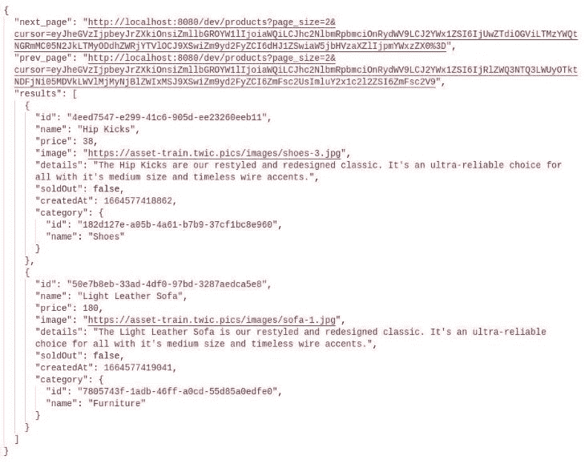

访问结果的`next_page`属性中提供的端点会将我们带到数据分页顺序中的下一页，该页包含以下数据:

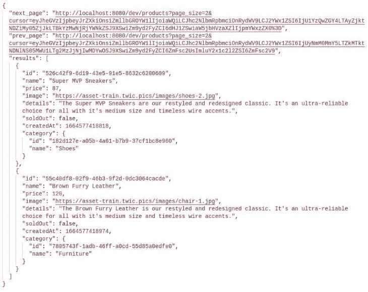

然后，根据第二个结果中的`prev_page`端点 URL，我们将返回到先前响应中的数据页面。

然后，我们可以在应用程序的分页部分实现这一点，使用上一页按钮触发从`prev_page` URL 获取数据，同样地，使用下一页分页按钮触发相应的`next_page` URL。

这最终总结了我们的应用程序的分页部分，以及我们打算在这个原型中实现的功能的最后一部分。

正如我们在这个项目中看到的，一个高保真的电子商务原型，我们能够完成提供数据的任务，使其完全动态和可展示，足以进入其开发生命周期的下一个阶段。我们能够做到这一点，而不必搜索所有的凿击 API。

这个简短的演示展示了使用 ChiselStrike 进行快速原型制作是多么容易。

你可以[点击这里](https://github.com/xinnks/chisel-store-web)访问我们 Chisel Store 应用的 GitHub 知识库。

## 更多关于凿击的能力

ChiselStrike 不仅为我们的原型项目提供了一个极好的起点，而且它还通过促进到生产的平稳过渡而超越了最初的水平。

让我们来看看它的一些特点。

### 自定义 CRUD 端点

除了简单的 CRUD 请求，ChiselStrike 允许我们定制我们的方法来适应独特的用例。

我们可以很容易地定制一个 CRUD 端点来限制某些 HTTP 方法。让我们看看这个例子:

```
// routes/products.ts
import { Product } from "../models/Product";
import { crud, responseFromJson } from "@chiselstrike/api";

export default crud(
  Product,
  {
    deleteAll: false,
    deleteOne: false,
    createResponse: (body: unknown, status: number) => {
      if (status < 400){
        const data = body["results"] || body;
        return responseFromJson({ data }, status);
      }
      return responseFromJson({ error: body }, status);
    }
  }
)

```

我们通过将作为第二个参数传递给顶级`crud()`函数的配置对象的`deleteAll`和`deleteOne`属性设置为`false`，限制了对`/dev/products`路由的`DELETE`请求的访问。

此外，我们修改了通过这个路径获取的数据，将它放在一个`data`属性中，去掉成功请求的分页属性，并返回不成功请求的错误信息。

当我们向`/dev/products`路由发出 HTTP `DELETE`请求时，我们将收到以下响应:

```
Method DELETE is not supported for "/products/<ROUTE_ID>"

```

我们可以更进一步，使用 ChiselStrike 的`RouteMap` API 完全定制我们的路线端点:

```
import { Product } from "../models/Product"
import { RouteMap, ChiselRequest } from "@chiselstrike/api"

async function getAllProducts() : Promise<Product[]>{
  return Product.findAll();
}

async function getOneProduct(req: ChiselRequest) : Promise<Product>{
  const id = req.params.get("id");
  return Product.findOne({id});
}

export default new RouteMap()
  .get("/", getAllProducts)
  .get("/:id", getOneProduct)

```

在上面的代码中，我们使用的是`RouteMap` API，它赋予我们通过 HTTP 方法指定路由的独立性。它还使我们能够观察对产品路线`/dev/products`提出的`GET`请求以及通过实体的`id` : `/dev/products/`的请求。我们使用`getAllProducts()`和`getOneProduct()`函数来处理这些端点请求。

### 秘密

ChiselStrike 支持运行时访问的应用程序添加和热重装秘密。

*注意，在 VCS 环境中使用机密时，务必小心对待，并采取安全措施。*

要向一个凿子打击项目添加秘密，在我们项目的根目录下创建一个`.env`文件，并在 JSON 中添加秘密:

```
{
  "secret": "Not so secretive",
  "vcs": {
    "randomkey": "livingdangerously",
    "githubkey": "stageandcommitmeatyourownperil"
  }
}

```

然后，我们可以通过使用从`@chiselstrike/api`导出的`getSecret`方法来访问密钥，如下所示。在我们的凿击应用程序中创建一条新的`secrets`路线，然后访问它查看返回的秘密信息:

```
// routes/secrets.ts
import { getSecret, RouteMap, responseFromJson } from "@chiselstrike/api";

export default new RouteMap()
  .get("/", async function(){
    const secret = getSecret("vcs");
    return responseFromJson(secret)
  })

```

### API 版本控制

有时，我们需要在项目的不同分支上工作，尝试新的特性，并在更有可能出错的分支中进行试验。

ChiselStrike 使我们能够将我们的 API 版本化，而不仅仅是我们一直在访问的最初的`/dev/`根端点。到目前为止，我们一直在访问的 API 路线的`/dev`部分是 API 的“开发”版本，因为 ChiselStrike 将 API 版本化视为一等公民。

不管 API 版本化是面向生产的工作流，我们可以在我们的本地项目中尝试它；我们只需要对我们一直在做的事情做充分的改变。

向项目的`package.json`文件添加一个新的`start`脚本:

```
{
  "scripts": {
    "dev": "chisel dev",
    "start": "chisel start"
  }
}

```

停止我们最初运行的`npm run dev`命令，使用`start`代替`npm run start`来启动服务器。我们的项目应该照常恢复，可以使用`/dev`路线。

要在我们的项目目录中创建一个新的分支`test`，运行:

```
npx chisel apply --version test

```

Chisel 应该用日志消息`INFO - Version "test" is ready`报告这个新 API 版本的添加。我们现在可以访问所有之前添加的前缀为`/test/`的路由。

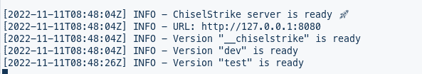

访问`/test/products`端点应该返回一个空响应，而旧的`/dev`前缀路由应该正常工作。

为了填充我们 API 的`test`版本，我们可以发出与对`dev` API 相同的数据填充请求，只需确保我们为新创建的 API 版本端点用`test`替换了`dev`。

我们还可以选择将数据从旧的`dev`数据存储迁移到`test`:

```
npx chisel populate --version test --from dev

```

数据迁移成功后，我们应该会从终端收到一条`OK`消息。

尝试再次访问`test`分支的`/products`路线。它现在应该包含访问`dev` API `/products`端点时返回的数据的副本。

[点击这里](https://docs.chiselstrike.com/reference/versions)阅读更多关于凿凿打击 API 版本的信息。

因为不是所有的东西都适合这篇文章，这里列出了更多的凿击功能。

*   [流媒体](https://docs.chiselstrike.com/reference/streaming)—chicken strike 与 Kafka 流媒体集成
*   [数据策略](https://docs.chiselstrike.com/reference/pol) —设置如何从存储中提供数据的规则
*   [用户登录](https://docs.chiselstrike.com/reference/login) —使用 NextAuth.js 进行用户认证
*   [游标](https://docs.chiselstrike.com/reference/cursors)—chicken strike 的游标 API，用于构建超越`findMany()`和`findOne()`的高级查询

## 结论

ChiselStrike 不仅支持高效的原型开发，还尽可能地减少了源代码的占用。用`ChiselEntity`类的能力和它强大的`crud()`方法覆盖了基本操作。

您已经通过我们的演示获得了一个 chicken strike 可以做什么的示例，但是您可以在其他应用程序中随意尝试 chicken strike，比如那些具有只读界面或表单和投票等动态功能的应用程序。

## 使用 [LogRocket](https://lp.logrocket.com/blg/signup) 消除传统错误报告的干扰

[](https://lp.logrocket.com/blg/signup)

[LogRocket](https://lp.logrocket.com/blg/signup) 是一个数字体验分析解决方案，它可以保护您免受数百个假阳性错误警报的影响，只针对几个真正重要的项目。LogRocket 会告诉您应用程序中实际影响用户的最具影响力的 bug 和 UX 问题。

然后，使用具有深层技术遥测的会话重放来确切地查看用户看到了什么以及是什么导致了问题，就像你在他们身后看一样。

LogRocket 自动聚合客户端错误、JS 异常、前端性能指标和用户交互。然后 LogRocket 使用机器学习来告诉你哪些问题正在影响大多数用户，并提供你需要修复它的上下文。

关注重要的 bug—[今天就试试 LogRocket】。](https://lp.logrocket.com/blg/signup-issue-free)