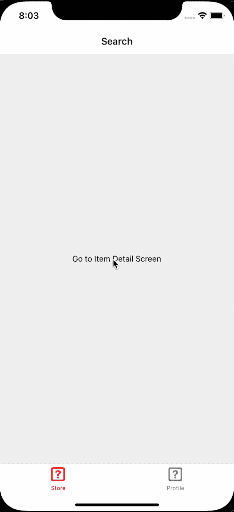
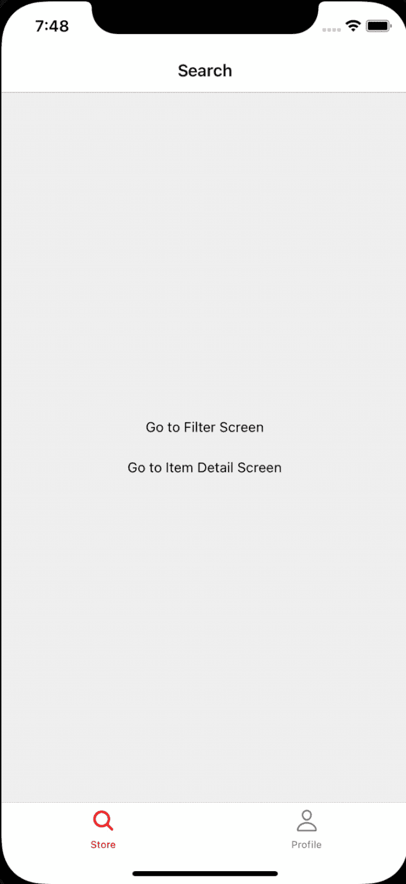
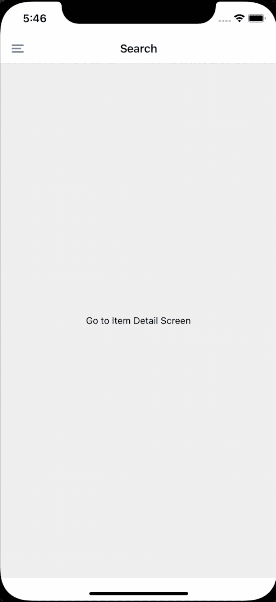
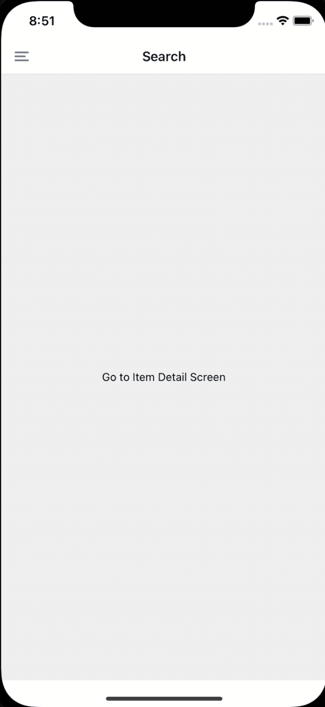

# React 本地导航指南

> 原文：<https://blog.logrocket.com/guide-react-native-navigation/>

移动应用最重要的一个方面是拥有不同的屏幕，并能够在它们之间移动，每个屏幕为用户提供不同的用途。

在本文中，我们将了解如何在 React 本机应用程序中启用导航。我们还将通过构建一个电子商务应用程序来了解 React Native 最常用的导航方法— [堆栈导航器](https://reactnavigation.org/docs/stack-navigator/)、[底部标签导航器](https://reactnavigation.org/docs/bottom-tab-navigator/)和[抽屉导航器](https://reactnavigation.org/docs/drawer-navigator/)。

## React 本机导航库

React Native 本身并没有为你的应用提供任何导航支持。您将需要集成一个第三方库来启用导航。三个最常见的库是:

*   [React 导航](https://reactnavigation.org/):大多数导航都是在 JavaScript 层中执行的，必要时可以使用本地 API
*   [React 本地导航](https://wix.github.io/react-native-navigation/docs/before-you-start/):这使用平台级 API 来执行导航
*   [React Native Router Flux](https://github.com/aksonov/react-native-router-flux) :这个库在内部使用 React 导航，但是公开了一组不同的 API 来启用导航

对于本教程，我们将使用 [React 导航](https://reactnavigation.org/) v6 库创建一个无缝导航体验。

## 安装 React 导航

安装非常简单，但是 React Navigation 需要安装一些对等依赖项:

```
yarn add @react-navigation/native
yarn add @react-navigation/native-stack
yarn add react-native-screens 
yarn add react-native-safe-area-context

```

要安装 iOS 的本机依赖项，请运行:

```
pod install --project-directory=ios

```

### 在 Android 上安装 React 导航

要在 Android 上完成库安装，我们必须完成一个额外的步骤。打开`MainActivity`文件并添加以下代码片段:

```
@Override
protected void onCreate(Bundle savedInstanceState) {
  // Make sure your import android.os.Bundle
  super.onCreate(null);
}

```

此时，您的项目已经准备好使用我们将介绍的第一种导航类型，堆栈导航。

## 在 React Native 中实现堆栈导航



堆栈导航是每个应用程序都有的最基本的导航类型。它用于描述一个逻辑流程，为用户提供执行特定步骤以到达目的地的感觉。

例如，在电子商务应用程序中，常见的导航堆栈类似于:

> 搜索要购买的商品→商品详情→查看购物车→支付→下单

让我们看看如何创建`Search → Item Detail`堆栈。其他屏幕将只是相同过程的复制。

在 React 导航中，所有的屏幕都需要围绕`NavigationContainer`组件，如下所示:

```
import {NavigationContainer} from '@react-navigation/native';
import React from 'react';
import {SafeAreaView} from 'react-native';

export const MyApp = () => {
  return (
    <SafeAreaView>
      <NavigationContainer>
        {/* Rest of my components wrapped inside a NavigationContainer */}
      </NavigationContainer>
    </SafeAreaView>
  );
};

const styles = StyleSheet.create({
  fullScreen: {flex: 1, alignItems: 'center', justifyContent: 'center'},
});

```

要创建用户可以从一个屏幕导航到另一个屏幕的堆栈，需要记住三个方面:

1.  `createNativeStackNavigator`:创建一个堆栈
2.  封装上面创建的堆栈中的所有屏幕(当你看下面的代码时会更清楚)
3.  `Screen`:可以放在`Navigator`里面的每一个单独的屏幕

让我们来扩展一下上面的代码片段。第一步是创建带有两个屏幕的堆栈导航器，`Search`和`ItemDetail`。当你从一个屏幕导航到另一个屏幕时，你可能想要传递一些数据，这就是为什么我定义了`OrderPlacementStackParams`。这是完全可选的。

`OrderPlacementStack`有两个属性:`Navigator`和`Screen`。

```
type OrderPlacementStackParams = {
  Search: undefined;
  ItemDetail: {itemId: string};
};

// create the stack navigator below
const OrderPlacementStack = createNativeStackNavigator<OrderPlacementStackParams>();

// If you are not using typescript or do not want to add the types you can do the following
// const OrderPlacementStack = createNativeStackNavigator(); 

```

在`NavigationContainer`组件中，让我们创建实际的导航器和其中的屏幕。

```
// Add the boilerplate code to create the stack components

export const MyApp = () => {
  return (
    <SafeAreaView style={{flex:1, backgroundColor:'white'}}>
      <NavigationContainer>
        <OrderPlacementStack.Navigator initialRouteName={'Search'}>
          {/* Your screens go here which will be added in the next step */}
        </OrderPlacementStack.Navigator>
      </NavigationContainer>
    </SafeAreaView>
  );
};

```

既然我们已经准备好了样板文件，让我们从搜索屏幕开始。导航器内的每个屏幕都将被赋予两个道具:

我们将为它们创建类型:

```
type SearchNavigationProp = NativeStackNavigationProp<
  OrderPlacementStackParams,
  'Search'
>;

type SearchRouteProp = RouteProp<OrderPlacementStackParams, 'Search'>;

interface ISearchScreenProps {
  navigation: SearchNavigationProp;
  route: SearchRouteProp;
}

const SearchScreen = ({navigation, route}: ISearchScreenProps) => {
  return (
    <SafeAreaView style={styles.fullScreen}>
      <TouchableOpacity>
        <Text>Go to Item Detail Screen</Text>
      </TouchableOpacity>
    </SafeAreaView>
  );
};

```

不要太担心现在什么都不做。我们将对其进行整合，以确保您可以从那里转到`ItemDetail`屏幕。

现在您已经有了`SearchScreen`组件，让我们将它添加到我们的堆栈中。

```
<NavigationContainer>
    <OrderPlacementStack.Navigator initialRouteName={'Search'}>
      <OrderPlacementStack.Screen name="Search" component={SearchScreen} />
    </OrderPlacementStack.Navigator>
</NavigationContainer>

```

在上面的代码片段中，我们将`Screen`包装在`Navigator`属性中。确保`Screen`的`name`属性与我们之前定义的`OrderPlacementStackParams`类型中定义的键相同。

这样，您就完成了创建堆栈导航的整个设置。现在，您所要做的就是对其他屏幕重复相同的步骤。

### 在堆栈中的屏幕之间导航

接下来，让我们尝试添加`ItemDetail`屏幕，看看我们如何从`SearchScreen`导航到`ItemDetail`屏幕。

```
type ItemDetailNavigationProp = NativeStackNavigationProp<
  OrderPlacementStackParams,
  'ItemDetail'
>;

type ItemDetailRouteProp = RouteProp<OrderPlacementStackParams, 'ItemDetail'>;

interface IItemDetailScreenProps {
  navigation: ItemDetailNavigationProp;
  route: ItemDetailRouteProp;
}

const ItemDetailScreen = ({navigation, route}: IItemDetailScreenProps) => {
  return (
    <SafeAreaView style={styles.fullScreen}>
      <TouchableOpacity>
        <Text>
          `This is the Item Detail Screen with Item Id: ${route.params.itemId}`
        </Text>
      </TouchableOpacity>
    </SafeAreaView>
  );
};

```

现在忽略第 18 行的`route.params.itemId`。稍后我会解释的。将该屏幕添加到`OrderPlacementStack.Navigator`中。

```
<NavigationContainer>
  <OrderPlacementStack.Navigator initialRouteName={'Search'}>
    <OrderPlacementStack.Screen name="Search" component={SearchScreen} />
    {/*  Add the item detail screen as shown below */}
    <OrderPlacementStack.Screen
      name="ItemDetail"
      component={ItemDetailScreen}
    />
    {/*  Add the item detail screen as shown above */}
  </OrderPlacementStack.Navigator>
</NavigationContainer>

```

当我点击`Search`屏幕中的**转到项目详情屏幕**按钮时，我们需要一种方法转到该屏幕。为了在屏幕间导航，我们将使用`navigation`道具。您在`navigation`对象中公开了两个 API，可以帮助您转到不同的屏幕。它们是:

1.  `push`:推送屏幕的新实例，即使它已经存在于当前堆栈中
2.  `navigate`:如果组件及其名称存在于当前堆栈中，则进入该屏幕。如果没有，它会创建一个新的屏幕实例，并将其推送到堆栈上

使用这些 API，只要它对您的应用程序有意义。我们将使用`navigate` API，尽管它们有相同的签名。

### 在 React Native 中的屏幕间导航时传递属性

注意在`OrderPlacementStackParams`中,`ItemDetail`屏幕需要一个`itemId`,这是有意义的，因为如果你想显示特定项目的细节，你需要一些标识符。

现在我们将整合`TouchableOpacity`动作和`Search`屏幕。用以下代码替换`TouchableOpacity`:

```
<TouchableOpacity
  onPress={() => {
    // Here you're asking the navigation stack to push the screen with
    // `ItemDetail` as its identifier
    // with data: {itemId: '1'}
    navigation.navigate('ItemDetail', {itemId: '1'});
  }}>
    <Text>Go to Item Detail Screen</Text>
</TouchableOpacity>

```

现在可以使用`route`道具在`ItemDetail`屏幕中访问传递的`{itemId: 1}`数据。

`route`道具有一个`params`对象，它将包含这个对象。因此，您可以使用`route.params.itemId`来访问`itemId`属性。

### 配置标题

默认情况下，React Navigation 为 iOS 和 Android 都设置了一个默认标题，但在大多数情况下，您会想要自定义它。你可以通过使用`navigation`道具上的`setOptions`方法来实现。

在`setOptions`方法中，您返回一个具有某些属性的对象，这些属性将帮助您定制整个标题或标题的某些部分。

* * *

### 更多来自 LogRocket 的精彩文章:

* * *

现在我们来看看如何定制整个标题。你可以通过调用`setOptions`方法并覆盖`header`键，用`useEffect`钩子来实现:

```
useEffect(() => {
    navigation.setOptions({
      // You can get the reference to navigation and route props here as well if you need it.
      header: ({navigation, route}) => (
        <View
          style={{height: 56, justifyContent: 'center', alignItems: 'center'}}>
          <Text>Custom Header on Search Screen</Text>
        </View>
      ),
    });
}, []);

```

您还可以使用其他键来自定义您的标题。一些常见的有:

*   `title`:返回一个你想要作为屏幕标题的字符串
*   `headerLeft`:返回一个组件，该组件将被呈现为标题上的左按钮
*   `headerRight`:返回一个组件，该组件将被呈现为标题上的左按钮
*   `headerStyle`:为整个 header 组件提供样式

如果你想改变标题的默认设置，你可以使用`screenOptions`属性在`Navigator`对象本身中设置标题的公共`options`。

例如，如果您希望标题栏的默认背景颜色为橙色，您可以这样做:

> 调用`navigation.setOptions` API 将覆盖所有这些默认选项。注意，在这里，我们不是在谈论`navigation`道具，而是在谈论`Navigator`对象。

```
<NavigationContainer>
  <OrderPlacementStack.Navigator 
    initialRouteName={'Search'} 
     screenOptions={() => ({
        headerStyle: {backgroundColor: 'orange'},
      })}>
    <OrderPlacementStack.Screen name="Search" component={SearchScreen} />
    {/*  Add the item detail screen as shown below */}
    <OrderPlacementStack.Screen
      name="ItemDetail"
      component={ItemDetailScreen}
    />
    {/*  Add the item detail screen as shown above */}
  </OrderPlacementStack.Navigator>
</NavigationContainer>

```

### 使用 React 导航向后导航

要返回上一屏幕，使用`navigation`道具上的`goBack`方法。

```
navigation.goBack();

```

### 模态导航

模态表示通常表示当前流程中新流程的开始，或者当您希望用户在进入下一步之前采取一些行动时使用。

这些屏幕的动画通常在 iOS 和 Android 上都不同于常规的堆栈导航动画，这使用户感觉他们正在执行一个步骤并进入流程。模态动画告诉用户一个新的流程正在开始。

让我们给我们的`OrderPlacementStack`添加一个新的屏幕，我们将有模式地呈现它。

```
type OrderPlacementStackParams = {
  Search: undefined;
  ItemDetail: {itemId: string};
  Filter: undefined; // added a new screen called Filter
};

type FilterNavigationProp = NativeStackNavigationProp<
  OrderPlacementStackParams,
  'Filter'
>;
type FilterRouteProp = RouteProp<OrderPlacementStackParams, 'Filter'>;
interface IFilterScreenProps {
  navigation: FilterNavigationProp;
  route: FilterRouteProp;
}
const FilterScreen = ({navigation, route}: IFilterScreenProps) => {
  return (
    <SafeAreaView style={styles.fullScreen}>
      <Text>{`Filter Screen`}</Text>
    </SafeAreaView>
  );
};

```

通过添加这个新屏幕来更新`OrderPlacementStack`。

```
<OrderPlacementStack.Navigator
      initialRouteName={'Search'}
      screenOptions={() => ({
        headerStyle: {backgroundColor: 'white'},
      })}>
      <OrderPlacementStack.Screen name="Search" component={SearchScreen} />
      <OrderPlacementStack.Screen
        name="ItemDetail"
        component={ItemDetailScreen}
      />
      {/* Added the new FilterScreen here */}
      <OrderPlacementStack.Screen
        name="Filter"
        component={FilterScreen}
        options={{presentation: 'modal'}}
      />
</OrderPlacementStack.Navigator>

```

您可以通过将`presentation`作为`modal`输入来更新屏幕选项，从而有模式地呈现任何屏幕。

调用下面的方法，`Filter`屏幕应该有模式地出现:

```
navigation.navigate('Filter');

```

现在让我们在`Search`屏幕上添加一个按钮。

```
<TouchableOpacity
        onPress={() => {
          // Here you're asking the navigation stack to push the screen with
          // `ItemDetail` as its identifier
          // with data: {itemId: '1'}
          navigation.push('Filter');
        }}>
        <Text>Go to Filter Screen</Text>
</TouchableOpacity>

```



这就完成了堆栈导航中导航屏幕的所有基础。让我们看看底部的选项卡导航。

### 在 React Native 中创建底部选项卡导航


这一部分将与堆栈导航部分非常相似，因为它使用了非常相似的 API。

让我们以这样的方式重新设计应用程序，有两个底部标签，第一个标签是“商店”，你可以在那里买东西，第二个标签是“个人资料”部分。

让我们首先将整个`Item Search`和`Detail`栈提取到它的组件中，并将其称为`OrderPlacementStackComponent`。现在新建一个`ProfileStackComponent`。

```
const OrderPlacementStackComponent = () => {
  return (
    <OrderPlacementStack.Navigator
      initialRouteName={'Search'}
      screenOptions={() => ({
        header: () => {
          return <View style={{height: 56, backgroundColor: 'red'}} />;
        },
      })}>
      <OrderPlacementStack.Screen name="Search" component={SearchScreen} />
      <OrderPlacementStack.Screen
        name="ItemDetail"
        component={ItemDetailScreen}
      />
    </OrderPlacementStack.Navigator>
  );
};

const ProfileStack = createNativeStackNavigator(); // Defined it without the types here for brevity

const SettingsScreen = ({navigation}) => {
  return (
    <View style={{flex: 1, justifyContent: 'center', alignItems: 'center'}}>
      <TouchableOpacity onPress={() => navigation.navigate('Login')}>
        <Text>Go to Login Screen</Text>
      </TouchableOpacity>
    </View>
  );
};
const LoginScreen = ({navigation}) => {
  return (
    <View style={{flex: 1, justifyContent: 'center', alignItems: 'center'}}>
      <Text>Login screen</Text>
    </View>
  );
};
const ProfileStackComponent = () => {
  return (
    <ProfileStack.Navigator initialRouteName={'Settings'}>
      <ProfileStack.Screen name="Settings" component={SettingsScreen} />
      <ProfileStack.Screen name="Login" component={LoginScreen} />
    </ProfileStack.Navigator>
  );
}

```

### 安装和使用

在使用底部选项卡导航之前，您必须安装以下依赖项:

```
yarn add @react-navigation/bottom-tabs

```

类似于我们如何创建堆栈导航器，我们必须创建一个选项卡导航器。

```
type BottomTabParams = {
  Store: undefined;
  Profile: undefined;
};

const AppBottomTab = createBottomTabNavigator<BottomTabParams>();

```

让我们用选项卡导航器替换`NavigationContainer`中的组件。它的结构类似于堆栈导航器，其中有两个属性，即`Navigator`和`Screen`，用于构成整个选项卡结构。

```
<NavigationContainer>
  <AppBottomTab.Navigator
    screenOptions={() => ({
      headerShown: false,
    })}>
    <AppBottomTab.Screen
      name="Store"
      component={OrderPlacementStackComponent}
    />
    <AppBottomTab.Screen
      name="Profile"
      component={ProfileStackComponent}
    />
    </AppBottomTab.Navigator>
</NavigationContainer>

```

运行应用程序。你会看到一个底部的标签栏，有两个标签，“商店”和“个人资料”

### 配置选项卡栏

通常，您会想要为底部选项卡栏进行自定义:

*   标签图标
*   当标签为活动标签时的标签图标状态，而当标签为非活动标签时的标签图标状态
*   标签上的徽章图标

我们将像在堆栈导航器中一样使用`screenOptions`。您可以使用`tabBarIcon`键返回一个定制的标签栏组件。

```
<NavigationContainer>
    <AppBottomTab.Navigator
      screenOptions={({route}) => ({
        headerShown: false,
        tabBarActiveTintColor: 'red',
        tabBarInactiveTintColor: 'gray',
        tabBarIcon: ({focused, size, color}) => {
          return focused ? (
            <CustomFocusedTabbarIcon size={size} color={color} />
          ) : (
            <CustomUnfocusedTabbarIcon size={size} color={color} />
          );
        },
      })}>
      <AppBottomTab.Screen
        name="StoreTab"
        component={OrderPlacementStackComponent}
      />
      {/* ProfileStack component may be another component */}
      <AppBottomTab.Screen
        name="ProfileTab"
        component={ProfileStackComponent}
      />
    </AppBottomTab.Navigator>
</NavigationContainer>

```

`tabBarIcon`属性提供了三个属性作为函数的输入，该函数需要返回您的定制标签栏图标组件:

*   `focused`:该页签是否为当前活动页签
*   `size`:自定义组件可渲染的大小
*   `color`:你需要用来渲染组件的颜色。这可以通过使用`tabBarActiveTintColor`和`tabBarInactiveTintColor`来覆盖，并且根据选项卡是否为`focused`,`color`的值将成为活动色调颜色或非活动色调颜色。

### 在选项卡间导航

选项卡之间的导航通过使用`navigation`对象上的`navigate` API 来执行:

```
navigation.navigate('ProfileTab') // navigate to the ProfileStackComponent

```

### React Native 中的抽屉导航



现在让我们看看最后一个常见的导航模式:抽屉导航。抽屉导航用于为用户提供一个从抽屉访问应用中所有流程的简单点，以防应用有很多流程(即屏幕)。

### 安装抽屉导航

```
yarn add @react-navigation/drawer
yarn add react-native-gesture-handler 
yarn add react-native-reanimated
pod install --project-directory=ios

```

确保在您的`index.js`中输入以下内容:

```
import 'react-native-gesture-handler';

```

## 抽屉导航的使用

一般来说，应用程序不会在同一个应用程序中同时使用底部标签导航和抽屉导航，所以让我们重新开始。

与前面的章节类似，您首先需要使用`createDrawerNavigation` API 创建您的`DrawerStack`。

```
type DrawerAppStackParams = {
  Search: undefined;
  MyOrders: undefined;
};
// Create the Drawer Stack Navigator
const DrawerStack = createDrawerNavigator<DrawerAppStackParams>();

```

接下来，使用`DrawerStack`对象提供给我们的相同的`Navigator`和`Screen`属性创建整个堆栈。

不要忘记将整个堆栈包装在`NavigationContainer`对象中。

```
export const App = () => {
  return (
    <SafeAreaView style={{flex: 1, backgroundColor: 'white'}}>
      <NavigationContainer>
        <DrawerStack.Navigator
          initialRouteName={'Search'}>
          <DrawerStack.Screen name={'Search'} component={SearchScreen} />
          <DrawerStack.Screen name={'MyOrders'} component={MyOrderScreen} />
        </DrawerStack.Navigator>
      </NavigationContainer>
    </SafeAreaView>
  );
};

```

下面是我如何定义`SearchScreen`和`MyOrderScreen`组件的。

这些组件也可能是堆栈导航组件。为了简单起见，我将返回常规的 React 本机组件。

```
const SearchScreen = ({navigation, route}) => {
  return (
    <SafeAreaView style={styles.fullScreen}>
        <Text>This is the Search Screen</Text>
    </SafeAreaView>
  );
};
const MyOrderScreen = ({navigation, route}) => {
  return (
    <SafeAreaView style={styles.fullScreen}>
      <Text>This is the my orders screen</Text>
    </SafeAreaView>
  );
};

```

一旦你运行这个应用程序，你应该可以在屏幕的左上角看到汉堡图标。这是您访问抽屉菜单的方式。您可以导航到您已经声明为抽屉导航的一部分的屏幕(在我们的例子中，是`SearchScreen`和`MyOrderScreen`)。

## 打开和关闭抽屉

在上面的部分中，我们看到，只要将整个堆栈包装在`DrawerStack`中，就会得到一个汉堡包图标，单击它就会打开抽屉。

但是，如果您希望它也出现在按钮点击或屏幕内的任何其他动作上，该怎么办呢？或者，如果您想要创建一个自定义导航堆栈标题，在其中添加您自己的自定义图标来打开抽屉，该怎么办？

您可以使用`navigation`对象上的`openDrawer`和`closeDrawer`API 来实现这一点，该对象被传递到每个屏幕，并且是`DrawerStack`的一部分。

```
navigation.openDrawer() // opens the drawer
navigation.closeDrawer() // closes the drawer

```

## 定制抽屉

就像前面的部分一样，您可以使用`DrawerStack.Navigator`组件上的`drawerContent` prop 定制抽屉。

下面是一个如何使用`drawerContent`属性返回自定义抽屉组件的例子:

```
const CustomDrawer = ({props, navigation}) => {
  return (
    <View
      style={{
        justifyContent: 'center',
        alignItems: 'center',
        flex: 1,
      }}>
      <Text>This is a custom drawer</Text>
    </View>
  );
};
export const App = () => {
  return (
    <SafeAreaView style={{flex: 1, backgroundColor: 'white'}}>
      <NavigationContainer>
        <DrawerStack.Navigator
          initialRouteName={'Search'}
          drawerContent={({navigation}) => {
            const customProps = {}; // You can pass in any custom props here in case you have to
            return <CustomDrawer props={customProps} navigation={navigation} />;
          }}>
          <DrawerStack.Screen name={'Search'} component={SearchScreen} />
          <DrawerStack.Screen name={'MyOrders'} component={MyOrderScreen} />
        </DrawerStack.Navigator>
      </NavigationContainer>
    </SafeAreaView>
  );
};

```

假设您还可以将`navigation`对象传递给您的定制抽屉组件，那么您也可以使用它在屏幕之间导航。



## 覆盖默认抽屉的自定义样式

如果您不想从头开始创建一个定制的抽屉组件，您可以使用`DrawerStack.Navigator`上的`screenOptions` prop 来覆盖库提供的抽屉组件的一些基本样式和组件。

您可以使用的一些常用键有:

*   `drawerActiveTintColor`:指定抽屉中活动项目的颜色
*   `drawerInactiveTintColor`:指定抽屉中非活动项目的颜色
*   `drawerStyle`:覆盖整个默认抽屉组件的样式
*   `drawerLabelStyle`:覆盖抽屉中项目的文本样式

这里有一个如何使用它的例子:

```
<DrawerStack.Navigator
    initialRouteName={'Search'}
    screenOptions={{
      drawerStyle: {backgroundColor: 'white'},
      drawerActiveTintColor: 'black',
      drawerInactiveTintColor: 'gray',
    }}>
      <DrawerStack.Screen name={'Search'} component={SearchScreen} />
      <DrawerStack.Screen name={'MyOrders'} component={MyOrderScreen} />
</DrawerStack.Navigator>

```

## 结论

在本文中，我们使用 React 导航库介绍了大多数 React 本机应用程序中三种最常见的导航形式。React Navigation 为我们提供了简单的 API，将这些流合并到您的应用程序中。

## [LogRocket](https://lp.logrocket.com/blg/react-native-signup) :即时重现 React 原生应用中的问题。

[](https://lp.logrocket.com/blg/react-native-signup)

[LogRocket](https://lp.logrocket.com/blg/react-native-signup) 是一款 React 原生监控解决方案，可帮助您即时重现问题、确定 bug 的优先级并了解 React 原生应用的性能。

LogRocket 还可以向你展示用户是如何与你的应用程序互动的，从而帮助你提高转化率和产品使用率。LogRocket 的产品分析功能揭示了用户不完成特定流程或不采用新功能的原因。

开始主动监控您的 React 原生应用— [免费试用 LogRocket】。](https://lp.logrocket.com/blg/react-native-signup)