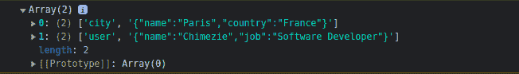

# React Native 的 AsyncStorage - LogRocket 博客指南

> 原文：<https://blog.logrocket.com/guide-react-natives-asyncstorage/>

`AsyncStorage`是 React Native 中的一个数据存储系统，它是不加密的、异步的，允许用户在 React Native 应用程序中离线保存数据。

由于`AsyncStorage`是未加密的，存储的数据不会被转换成代码或加密以防止未经授权的访问，这意味着任何人都可以通过您的设备轻松获取数据。

然而，由于它是未加密的，从`AsyncStorage`获取或检索数据更容易，并且不涉及任何进一步的解密。

`AsyncStorage`也是异步的，这意味着它的方法与你的代码的其余部分同时运行，并且它是持久的，这意味着即使你注销或重启应用程序，存储的数据也总是全局可用的。

这允许您使用和访问来自任何 React 本地组件的数据，并提高应用程序的性能和体验，因为从`AsyncStorage`存储和检索数据不会影响其他代码的运行。

`AsyncStorage`就像 web 中的`localStorage`，像`localStorage`一样使用键值对持久化数据。如果你以前用过`localStorage`和`sessionStorage`，那么`AsyncStorage`会很熟悉，很好用。

在本文中，我们将涵盖`AsyncStorage`如何工作、`AsyncStorage`的重要性、用例，以及如何使用`AsyncStorage`方法与数据存储系统交互，包括:

## `AsyncStorage`如何工作

只接受和存储字符串数据，所以如果数据不是字符串，我们必须在存储之前序列化它。这意味着在存储之前，我们必须先将其转换为字符串数据；这里，键和值都是字符串。

为了将我们想要保存的对象转换成字符串，我们使用`JSON.stringify()`。在我们从存储中取回数据的情况下，我们使用`JSON.parse()`将其转换回 object:

```
// storing data
const storeUser = async (value) => {
  try {
    await AsynStorage.setItem("user", JSON.stringify(value));
  } catch (error) {
    console.log(error);
  }
};

// getting data
const getUser = async () => {
  try {
    const userData = JSON.parse(await AsynStorage.getItem("user"))
  } catch (error) {
   console.log(error); 
  }
};

```

有很多场景可以使用`AsyncStorage`，比如存储主题数据或者存储离线数据。

但是，不建议将敏感信息存储在`AsyncStorage`中，因为这对敏感信息不安全。这是因为任何能接触到你手机的人都可以读取储存在你手机文档文件系统中的数据。

## 如何安装`AsyncStorage`

在使用`AsyncStorage`之前，我们必须先安装`AsyncStorage`包。要安装该软件包，请打开您的终端并运行以下任何命令:

```
#using npm
npm install @react-native-async-storage/async-storage

#using yarn
yarn add @react-native-async-storage/async-storage

```

之后，您可以将它导入到您想要使用的 React Native 的任何组件中。只需从模块中导入它，然后调用任何方法:

```
// React Native component

import AsyncStorage from '@react-native-async-storage/async-storage';

```

## `AsyncStorage`方法

`AsyncStorage`方法有几种与 React Native `async`数据存储系统工作或交互的方式。它们为开发人员提供了在存储系统中执行操作的方法。

我们可以用`AsyncStorage` : `Set`、`Get`和`Delete`执行三个主要动作:

*   `Set`使用键值对在`async`存储器中设置或存储数据
*   `Get`使用密钥从`async`存储器中获取数据值
*   `Delete`使用键删除特定的一段或多段数据

没有这些方法，我们无法用`AsycnStorage`执行这些操作。这些方法包括:

1.  `setItem()`
2.  `getItem()`
3.  `mergeItem()`
4.  `removeItem()`
5.  `multiGet()`
6.  `clear()`

因为`AsyncStorage`使用键和值来存储数据，所以键是我们想要存储数据的名称，而值是我们存储的数据。

### 使用`setItem()`方法

`setItem`方法将数据保存到`AsyncStorage`并允许一个键和值。这里，键是数据或值被分配到的字符串:

```
// React Native component

const value = {
    name: "Chimezie",
    job: "Software Developer"
  };

  const storeUser = async () => {
    try {
      await AsyncStorage.setItem("user", JSON.stringify(value));
    } catch (error) {
      console.log(error);
    }
  };

```

`value`对象是我们想要保存的数据。为了保存它，我们必须首先序列化它，因为`AsyncStorage`只存储字符串，我们可以使用`JSON.stringify()`来序列化它。

### 使用`getItem()`方法

`getItem()`方法允许我们通过使用保存数据的密钥从`AsyncStorage`取回数据。

例如，假设我们使用`setItem`保存了上面的数据，我们使用键`"user"`接收数据:

```
// React Native component

const getUser = async () => {
    try {
      const savedUser = await AsyncStorage.getItem("user");
      const currentUser = JSON.parse(savedUser);
      console.log(currentUser);
    } catch (error) {
      console.log(error);
    }
  };

```

### 使用`mergeItem()`方法

`mergeItem`方法通过用新值替换一个值来修改或合并一个键下的现有值:

```
// React Native component

const value = {
    name: "Innocent"
  };

const mergeUser = async () => {
    try {
      await AsyncStorage.mergeItem("user", JSON.parse(value));
    } catch (error) {
      console.log(error);
    }
  };

```

在上面的场景中，`AsyncStorage`中的`value`将被替换为这个新值`"Innocent"`。

### 使用`removeItem()`方法

`removeItem()`方法通过使用键删除存储的数据来从`AsyncStorage`中删除数据:

```
// React Native component

const removeUser = async () => {
    try {
      await AsyncStorage.removeItem("user");
    } catch (error) {
      console.log(error);
    }
  };

```

### 使用`clear()`方法

`clear`方法从`AsyncStorage`中删除所有数据。它不需要密钥，因为它会删除所有存储的数据:

```
// React Native component

const removeData = async () => {
    try {
      const savedUser = await AsyncStorage.clear();
    } catch (error) {
      console.log(error);
    }
  };

```

### 使用`multiGet()`方法

顾名思义，`multiGet`方法从`AsyncStorage`获取多条数据，并返回一个键值对数组。

如果我们在存储系统中有多条数据，比如存储`city`和`user`数据，我们可以通过使用`multiGet`方法获得这两条数据:

```
 // React Native component

 const getMultipleData = async () => {
    try {
      const savedData = await AsyncStorage.multiGet(["city", "user"]);
      console.log(savedData);
    } catch (error) {
      console.log(error);
    }
  };

```

从这里，它返回两个数据的数组:`city`和`user`以及键和值。



### 使用`multiSet()`方法

这个方法一次存储多个键值对。`multiSet`方法接受并在数组中存储数据。

例如，如果我们想要存储多个不相关的数据，如`places`和`food`，我们可以使用`multiSet`方法来实现:

```
// React Native component

 const places = {
    name: "Abuja",
    country: "Nigeria"
  };

  const food = {
    name: "Spaghetti Pasta"
  };

  const firstData = ["places", JSON.stringify(places)];
  const secondData = ["food", JSON.stringify(food)];

  const storeMultipleData = async () => {
    try {
      await AsyncStorage.multiSet([firstData, secondData]);
    } catch (error) {
      console.log(error);
    }
  };

```

`places`和`food`是我们要存储的两个对象。因此，我们用键值对将它们分配给不同的数组。另外，请注意，在将对象解析到`multiSet`数组之前，我们对其进行了字符串化。这是因为`AsyncStorage`除了字符串不接受任何东西。


### 使用`multiMerge()`方法

`multiMerge`方法将多条现有数据与新数据合并，并以批处理方式完成:

```
// React Native component

 const places = {
    name: "Mumbai",
    country: "India"
  };

  const food = {
    name: "Rice"
  };

  const firstData = ["places", JSON.stringify(places)];
  const secondData = ["food", JSON.stringify(food)];

  const mergeMultiData = async () => {
    try {
      await AsyncStorage.multiMerge([firstData, secondData]);
    } catch (error) {
      console.log(error);
    }
  };

```

### 使用`multiRemove()`方法

此方法通过使用键数组批量删除数据来移除或删除多个键值对。

让我们删除上面创建的两个数组，即`places`和`food`数据:

```
// React Native component

  const multiRemoveData = async () => {
    try {
      await AsyncStorage.multiRemove(["places", "food"]);
    } catch (error) {
      console.log(error);
    }
  };

```

## 结论

如上所述，不建议使用`AsyncStorage`来存储敏感数据，如 API 密钥、令牌、用户详细信息等，因为它们很容易被访问。然而，一个好的主要用例是使用`AsyncStorage`存储主题。

黑暗主题如今在应用程序中非常普遍，并受到用户的广泛赞赏。当用户选择黑暗模式作为首选主题时，保存数据的更好方法是将数据存储在`AsyncStorage`中，这样用户就不需要在登录时持续选择它。

存储并持久化数据，这样即使在用户注销并重新登录后，持久化的数据(在这种情况下，是黑暗主题)仍然可用。

作为开发人员，你需要做的只是检查数据是否存在于数据存储系统中；如果是(意味着黑暗主题存在)，应用程序主题会自动变为黑暗，如果不是，应用程序将使用默认的光明主题打开。

我们现在已经看到了`AsyncStorage`提供给我们的不同方法，包括如何使用不同的`AsyncStorage`方法以及我们可以应用它们的用例。希望这篇文章能帮助简化 React Native 的`AsyncStorage`。感谢您的阅读！

## [LogRocket](https://lp.logrocket.com/blg/react-native-signup) :即时重现 React 原生应用中的问题。

[](https://lp.logrocket.com/blg/react-native-signup)

[LogRocket](https://lp.logrocket.com/blg/react-native-signup) 是一款 React 原生监控解决方案，可帮助您即时重现问题、确定 bug 的优先级并了解 React 原生应用的性能。

LogRocket 还可以向你展示用户是如何与你的应用程序互动的，从而帮助你提高转化率和产品使用率。LogRocket 的产品分析功能揭示了用户不完成特定流程或不采用新功能的原因。

开始主动监控您的 React 原生应用— [免费试用 LogRocket】。](https://lp.logrocket.com/blg/react-native-signup)