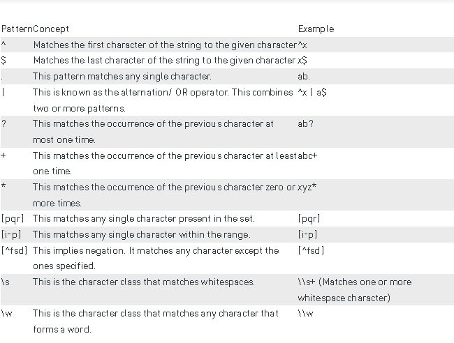
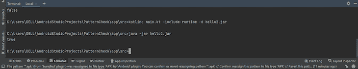
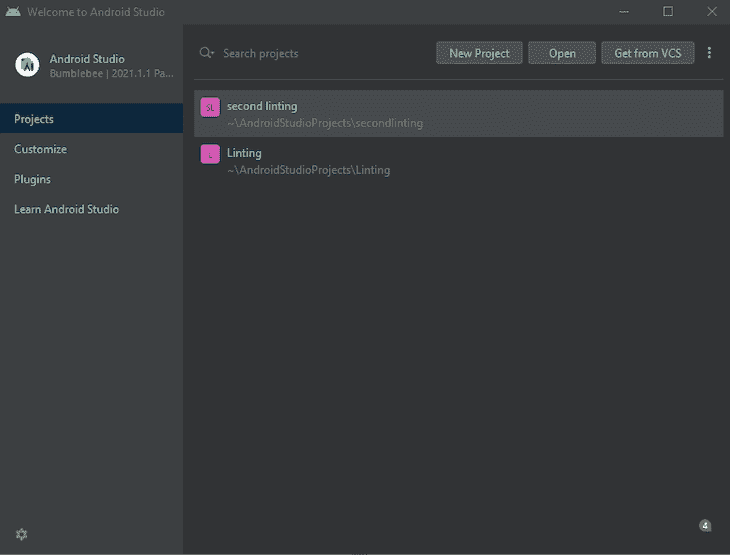
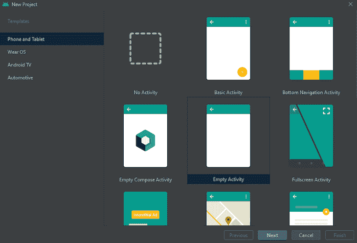
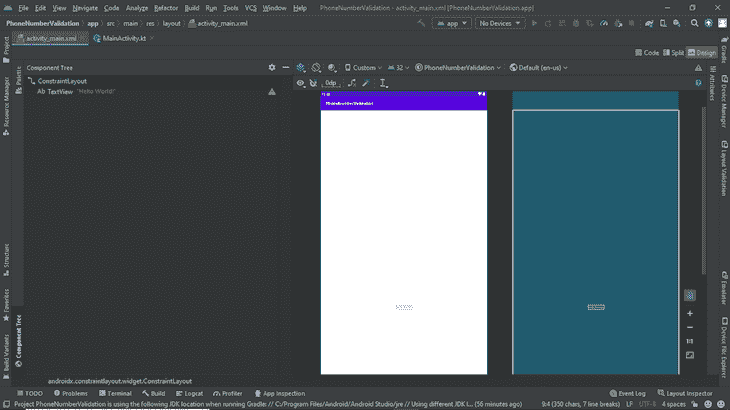
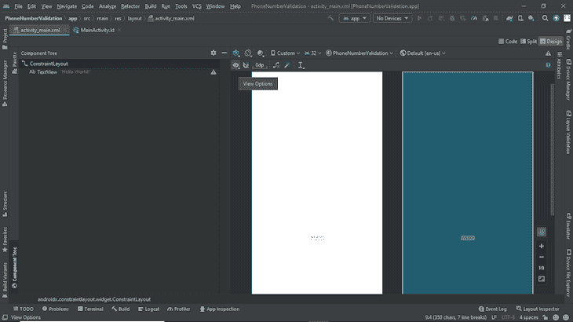

# Kotlin - LogRocket 博客中的正则表达式指南

> 原文：<https://blog.logrocket.com/guide-regular-expression-kotlin/>

在本指南中，我们将讨论正则表达式以及如何在 Kotlin 中使用它。RegEx 代表“正则表达式”。通俗地说，它检查一个字符串是否匹配一个模式。在输入验证的情况下，正则表达式很方便。

为什么这是一件大事？RegEx 一次处理所有这些验证，而不是使用大量的 IF 和 ELSE 操作符。

这就引出了本指南的目的。在本文中，我们将通过构建一个简单的应用程序来验证手机号码，从而指导您如何在 Kotlin 中将正则表达式用作验证手段。

## 先决条件

我建议本指南的读者具备以下条件:

1.  Kotlin 语法的基础知识
2.  设备上的 Kotlin 编译器，用于在终端中运行 Kotlin 代码

(注意:你还需要在你的操作系统上运行 android studio)

## 使用正则表达式检查输入模式

正则表达式模式常常令人困惑，所以我们将学习如何使用 RegEx 来检查字符串中的模式。以下是 Kotlin 中的一些正则表达式模式:



要用正则表达式检查输入模式，创建一个变量名为“pattern”的正则表达式类这个变量将包含我们想要匹配的模式。

类似地，我们将创建另一个名为“result”的变量来指定 RegEx 字符串。下面是这个解释的一个实现:

```
fun main ()
{
  var pattern = Regex("wa");
  var result = pattern.containsMatchIn("Muyiwa");

  println(result);
}

```

输出为真，因为“wa”在正则表达式字符串“Muyiwa”中。

(注意:这是区分大小写的，因此，“wa”不同于“WA”，但是我们可以使用`IGNORE_CASE`忽略这种情况)



### RegexOption (IGNORE_CASE)

本节将向您展示如何检查字符串中的模式，而不管它是否区分大小写。为此，我们将把`RegexOption.IGNORE_CASE`作为参数传递给 RegEx 构造函数。因此，代码如下所示:

```
fun main ()
{
  var pattern = "WA".toRegex(RegexOption.IGNORE_CASE)
  var result = pattern.containsMatchIn("Muyiwa");

  println(result);
}

```

两者之间有相似的过程(上面的模式)，唯一的区别是如果有模式，上面的代码将识别它，而不管它的大小写。

## 手机号码验证

这个项目将向你展示如何使用 RegEx 来验证一个手机号码。为了简化流程，我们将一步一步地介绍这些流程。因此，要开始，请相应地遵循以下步骤:

首先，启动你的 android 工作室，选择“新项目”。



之后，选择“空活动”作为项目模板，然后单击“下一步”。



在这个页面上，使用你选择的任何名字——对于这个项目，我称之为“PhoneNumberValidation”。选择您选择的语言(Kotlin)并点击“完成”。

让我们来简单概述一下我们想要做的事情——我们想要创建一个简单的按钮和“编辑文本”区域。在这个过程中，我们希望一旦用户输入有效的电话号码，按钮就被激活，如果是无效的电话号码，显示的消息应该是“无效的电话号码”

现在，我们可以开始设计了。

首先，在您的新项目中，单击 activity_main.xml 并在 design 部分选择“Show System UI”。点击眼睛图标找到这个。



下一步，点击“分割”并删除默认的文本视图，因为我们不希望它在那个位置。单击调色板，然后选择“Text”并将电话文本拖放到系统 UI 中(单击棒形图标将约束添加到编辑文本中)。



添加一个提示以编辑带有文本“输入电话号码”的文本。出于更直接的原因，我们将把 ID 改为 edit。因此，我们的 EditText 侦听器将如下所示:

(注意:您可以决定是否要在 EditText 中更改默认 ID)

接下来，我们需要一个按钮。为此，我们将遵循与添加文本区域类似的过程，不同之处在于我们添加了一个按钮。在这种情况下，我们需要禁用按钮；因此，我们将 enabled 属性设置为“false”。

```
android:enabled="false"

```

因此，按钮的代码如下所示:

```
<Button
  android:id="@+id/button2"
  android:layout_width="wrap_content"
  android:layout_height="wrap_content"
  android:layout_marginTop="6dp"
  android:text="Button"
  android:enabled="false"
  app:layout_constraintEnd_toEndOf="parent"
  app:layout_constraintStart_toStartOf="parent"
  app:layout_constraintTop_toBottomOf="@+id/edit" />

```

### 将 Kotlin 绑定到 XML

在继续之前，我们需要将我们的 Android 视图与 Kotlin 绑定。在过去，使用 Kotlin 合成材料进行这种手术相当容易。

您所要做的就是将下面的插件添加到 build.gradle(:app)中，并通过它们在 Kotlin 文件中的 ID 调用视图:

```
id 'kotlin-android'
id 'kotlin-android-extensions'

```

但是，这已经被弃用，并且默认情况下不包含在新的 Android Studio 项目中。

科特林合成的问题是，即使我们可以通过它们的 ID 调用这些视图，所有这些都可能是空的；这意味着我们可以访问不属于布局的视图。

* * *

### 更多来自 LogRocket 的精彩文章:

* * *

另一方面，视图绑定打破了这个鸿沟，因为它确保了在活动或片段中访问的视图不为空。因此，不可能出现空指针异常。

(注意:数据绑定是视图绑定的替代方法，但是视图绑定恰好更简单，视图绑定只会绑定您的视图)

以下是如何在视图上使用视图绑定的分步方法:

首先，转到 build.gradle(:app)，因为您必须显式地启用希望在项目中使用视图绑定。

在 Android 块中，添加下面的新块，并同步您的 Gradle 文件:

```
buildFeatures {
  viewBinding true
}

```

转到 MainActivity.kt 文件。在那里，我们想要引用 EditText。

视图绑定生成一个用于访问视图的绑定类。因此，我们将用类型 *ActivityMainBinding* 创建一个名为`binding`的`private lateinit var`(这是为我们生成的类视图绑定)。

基本上，对于我们项目中的每个 XML 文件，视图绑定会做到这一点，并且我们不需要重新构建我们的项目，因为不需要注释处理。

现在我们有了绑定，为了初始化它，我们将使用下面的代码:

```
binding = ActivityMainBinding.inflate(*layoutInflater*)

```

基本上是将一个组的视图添加到另一个组。最后，我们将使用下面的代码将内容视图设置为 binding.root:

```
setContentView(binding.root)

```

现在要访问视图，使用代码`binding.id`(视图的 ID)。现在我们可以走了。

我们希望一旦用户输入一个有效的手机号码，按钮被启用。为此，请转到 MainActivity.kt 文件。我们需要为按下的键编写代码。以下是整个过程所需的 Kotlin 代码:

```
package com.example.phonenumbervalidation

import androidx.appcompat.app.AppCompatActivity
import android.os.Bundle
import android.text.Editable
import android.text.TextWatcher
import com.example.phonenumbervalidation.databinding.ActivityMainBinding
import java.util.regex.Pattern

class MainActivity : AppCompatActivity() {

  private lateinit var binding: ActivityMainBinding

  override fun onCreate(savedInstanceState: Bundle?) {
    super.onCreate(savedInstanceState)
    binding = ActivityMainBinding.inflate(layoutInflater)
    setContentView(binding.root)
// beginning
    binding.edit.addTextChangedListener(object:TextWatcher{
      override fun beforeTextChanged(p0: CharSequence?, p1: Int, p2: Int, p3: Int) {
      }

      override fun onTextChanged(p0: CharSequence?, p1: Int, p2: Int, p3: Int) {
        if (mobileValidate(binding.edit.text.toString()))
          binding.button2.isEnabled=true
        else{
          binding.button2.isEnabled=false
          binding.edit.setError("Invalid Phone number")
        }
      }

      override fun afterTextChanged(p0: Editable?) {
      }
    })
  }

  private fun mobileValidate(text: String?): Boolean {
    val p = Pattern.compile("\[0\][7-9]\[0-1\][0-9]{8}")
    val m = p.matcher(text)
    return m.matches()
  }
}

```

### 解释代码片段

`TextWatcher`使用三种回调方法中的任何一种来监控对 EditText 所做的更改:

*   `beforeTextChanged`
*   `onTextChanged`
*   `afterTextChanged`

如果你想了解这些方法，这里的是一个资源链接。在`onTextChanged`中，我们创建一个 if 语句来检查带有参数 binding.edit. *text* 的 mobileValidate 函数。toString()。

最初，这样做会抛出一个错误，因为我们没有名为 mobileValidate 的函数，所以按 Alt+Enter 在 MainActivity 中自动创建一个函数。将参数从`Editable`改为`String`,因为您希望输入为字符串。

在 mobileValidate 函数中，我们希望我们的文本匹配某个模式:一个标准的尼日利亚电话号码(通常是 070，080，081，090，091，总共 11 个数字)。

因此，我们为四个不同的音程编译一个模式，前三个只有一个组合，最后一个音程分成八个 0-9 音程的组合。因此，基本上，任何超出每个区间的数字都将标记为无效，按钮将保持禁用状态。

接下来，我们将使用 p.matcher()函数声明我们的 matcher 实例。然后，我们将解析 matcher 函数中的输入，并返回 m.matches()。如果我们的输入与模式匹配，并且按钮被启用，则结果返回 true，如果不匹配，则返回 false。

回到 if 语句，如果按钮的条件保持为真，则按钮应该被启用。我们还有一个 else 语句，以防条件变为 false。我们设置了一个错误消息来抛出一个通知“号码无效”

在这之后，你可以在你想要的模拟器中运行应用程序来测试它。

## 结论

RegEx 的多功能性使它成为许多编程语言中的基本工具，它检查模式的能力使它成为有效的验证工具。

它在多功能性方面的优势也伴随着多重劣势:例如，它复杂的语法，这使得 RegEx 对于经验丰富的程序员来说都有些困难。

尽管如此，掌握正则表达式的知识是绝对有利的，因为有一天，只要您在开发领域，它就会派上用场！

## LogRocket :即时重现你的安卓应用中的问题。

[](https://lp.logrocket.com/blg/kotlin-signup)

[LogRocket](https://lp.logrocket.com/blg/kotlin-signup) 是一款 Android 监控解决方案，可以帮助您即时重现问题，确定 bug 的优先级，并了解您的 Android 应用程序的性能。

LogRocket 还可以向你展示用户是如何与你的应用程序互动的，从而帮助你提高转化率和产品使用率。LogRocket 的产品分析功能揭示了用户不完成特定流程或不采用新功能的原因。

开始主动监控您的 Android 应用程序— [免费试用 LogRocket】。](hhttps://lp.logrocket.com/blg/kotlin-signup)