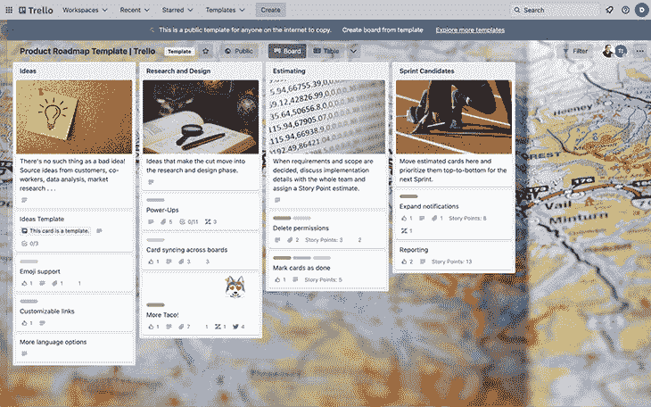
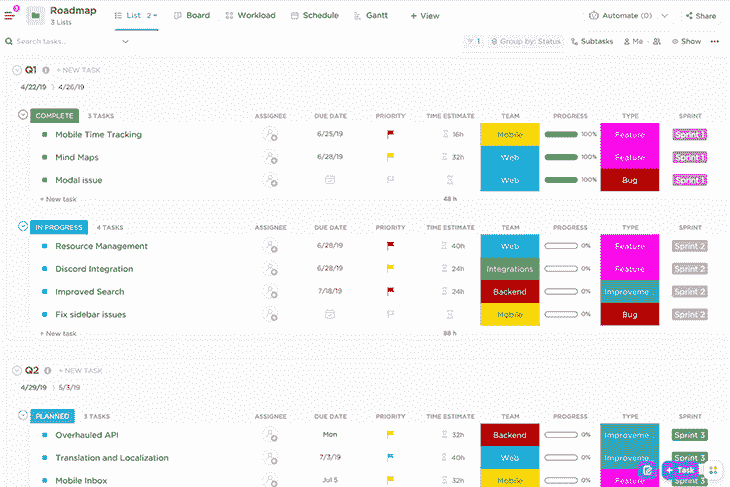
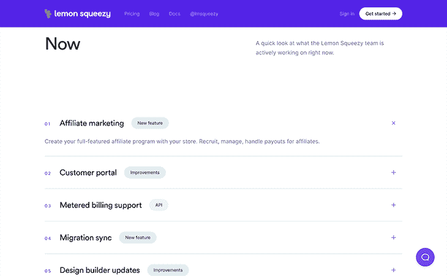

# 创建和共享公共产品路线图指南

> 原文：<https://blog.logrocket.com/product-management/guide-to-creating-sharing-public-product-roadmaps/>

在考虑时间、金钱、资源、用户需求以及可能的一千多种其他因素的情况下，开发一款产品绝非易事。这需要大量的计划，这是肯定的。

在本文中，我们将了解产品路线图，尤其是公共产品路线图，为什么它们非常适合规划和满足用户需求，以及用于创建它们的工具。

* * *

## 目录

* * *

## 什么是产品路线图？

产品路线图是一个时间表，显示产品的功能和重大改进预计何时发布。

在许多产品路线图中，日期不一定是具体的，但它们至少显示了功能/改进可能发布的顺序。但是当然，伟大的产品团队知道他们什么时候需要适应或调整，所以产品路线图很少是一成不变的，总是会发生变化。Harish Natarahjan 提供了更加全面的产品路线图概述。

## 为什么要维护产品路线图？

[拥有产品路线图的目的是为产品团队提供宽松的目标](https://blog.logrocket.com/product-management/what-is-a-product-roadmap-templates/)，反过来，为他们提供他们应该关注什么的鸟瞰图。这有助于团队在朝着更大的目标努力时保持在正确的轨道上，提前计划资源，并建立(或至少保持)势头。

保持正轨在很大程度上是一种心理努力。首先，有一个看得见的目标会给我们的大脑创造一个潜在的回报——这个好处不需要详细说明。对我们自己的责任，尤其是对我们的队友甚至用户的责任，也是一个强大的动力，因为总有人在等着我们采取行动(这会引起焦虑，但不一定是坏的方式)。

撇开大脑迷惑不谈，产品路线图对规划也是有用的。具体来说，知道需要做什么可以帮助产品经理分配时间、预算和人员，收集工具，并根据需要雇佣更多的人。

最后，产品团队经常忘记的一件事是产品更新发布时间过长的风险。当这种情况发生时，随着时间的推移，用户会感到厌烦和沮丧，团队会精疲力竭并失去动力。[利益相关者(包括使用者)需要定期注射多巴胺来保持投入](https://blog.logrocket.com/product-management/what-stakeholder-management-tools-techniques/)。

## 为什么要公开分享产品路线图？

公开分享产品路线图的最大原因是透明和支持。你的产品路线图证明事情正在进展，你作为一个团队和产品是值得继续投资的。作为回报(取决于你管理期望的能力)，支持会从随意的潜伏到大声的欢呼，甚至可能是一些反馈。

第二个原因是验证。验证产品创意是一回事，但如何对它们进行优先排序完全是另一回事。从你的公共产品路线图中获得最大收益的一个很好的口头禅是“让你的用户来构建产品”(或者类似的意思)。如果你的优先顺序全错了(这种事时有发生！)，你的用户会让你知道。

还需要考虑产品留存率。对于订阅产品，包括 SaaS 产品，提供具体功能或改进的大概预计时间可能是客户流失或决定留下来的区别。人们害怕未知，所以他们更有可能退订产品，而不是冒险为他们可能得不到或很快就会得到的东西付费。

当然，公开分享产品路线图也会增加你的责任感。

### 过于隐私的产品以及为什么会伤害它们

产品不一定需要路线图来获得支持，但它们肯定会有帮助——没有路线图往往会造成伤害。

一个总是浮现在脑海中的例子是当 InVision 在构建 InVision Studio 的时候。由于 InVision 的营销努力，设计师们被工作室超级炒作，尽管不知道他们会得到什么。毕竟，人们信任这个品牌，他们的营销是邪恶的迷恋，他们非常公开他们筹集了多少资金。一切似乎都很有希望。

然而，这些东西只能给人留下深刻的印象，我们没有看到他们公开他们的产品路线图。我不能自称知道到底发生了什么(我确信这归结于很多事情)，但有一点是肯定的，那就是延迟和缺乏透明度在人们逐渐放弃它的过程中发挥了作用，尤其是在发布后。它漏洞百出，与同类产品相比并没有真正的竞争优势。

更加开放，特别是通过使用公共产品路线图，可能会改变这一点。

这里的教训是，夸张只能让你到此为止，我们已经在许多其他行业看到这一点，往往在秘密工作。博彩业尤其令人失望。游戏有爆炸性的预告片和大量的宣传，但在发布时没有真正的游戏性。

结果，数量惊人的游戏在第一天就被破坏，以至于一些(如赛博朋克 2077)不得不退款，而另一些(如 Halo Infinite)最终取消了承诺的功能，因为他们的内部路线图太混乱了。《骷髅会》自 2013 年以来一直在旋转和延迟，我们仍然不确定它会是什么样的游戏——因此，人们不再对它感兴趣。

简而言之，产品路线图不仅仅是产品团队的有用工具。在某种程度上，路线图也定义了产品和受众之间的关系。

## 产品路线图中不应该包含什么？

有很多东西可以改进你的产品，但不是所有的都应该在你的产品路线图中。例如，如果你的企业参与了开放运动，你如何经营你的企业和解决有趣的问题，关于你的工具和流程的细节，每月经常性收入(MRR)的更新，以及其他商业指标和见解——独立制造商和创业者非常热衷的东西——最好在博客帖子，社交媒体或其他基于兴趣的社交平台上分享。

* * *

订阅我们的产品管理简讯
将此类文章发送到您的收件箱

* * *

所有这些都非常有用和有趣，但是对于你的用户来说毫无意义。产品路线图可以是你“在公共场合构建”角色的一部分，但不是你做的和构建的所有东西都需要在你的产品路线图中。

你通常也不想在你的产品路线图中提到 bug。这不仅会让你的产品的每一个缺陷都成为关注的焦点，而且大多数缺陷都是微不足道的，不值得去了解。他们中的许多人无论如何都不会被大多数用户发现。您可以为特别有争议的 bug(即任何公众感兴趣的东西)破例。

考虑到所有这些，重要的是*而不是*把你的产品路线图当成一本打开的书或你的待办事项清单。产品路线图应该只包括直接改善用户体验的东西。

Trello 是一个看板风格的项目管理工具，可以用于各种各样的事情。考虑到它有一个相当慷慨的免费计划(以至于你可能甚至没有意识到一个人甚至可以为 Trello 付费)，结合它是多么伟大和受欢迎，你可能已经在使用它了。

也就是说，Trello 不是专门为产品路线图设计的，所以使用它不会像使用其他工具那样简单。优先排序是你需要在 Trello 之外做的事情，除非你愿意让用户对你的 Trello 板拥有编辑权限，否则你需要建立一个 [Google Forms + Trello Zapier 工作流](https://zapier.com/apps/google-forms/integrations/trello)——或者类似的东西——以便收集反馈(尽管用户不能订阅更新)。

这个选项最适合个人和成熟的团队:

### 空中聚焦

[Airfocus](https://airfocus.com/) 是一款专用的产品路线图工具，涵盖整个流程，从收集反馈到跟进(如有必要)，再到根据各种因素评估优先级，再到创建/更新您的产品路线图。

您还可以公开您的路线图，收集反馈，并让用户订阅更新。然而，没有免费计划，甚至基本计划也忽略了一些关键功能，所以准备好打开你的钱包吧。

### 团队甘特图

TeamGantt 具有致力于维护公共产品路线图的功能，以及各种其他项目管理功能，因此如果这些附加功能对您或您的团队有用，您可能需要考虑这个选项。实际上，工具订阅越少，预算越少，工作流程越顺畅。

### Monday.com

Monday.com 就像 team gantt——它通常是为项目管理而设计的，但是它有更多的功能，成本也更高。再次，看看他们提供的是否适合你/你的团队，因为如果你充分利用 Monday.com 的潜力，那么高的成本是值得的。

### 产品板

[Productboard](https://www.productboard.com/) 和 Airfocus 很有可比性。它的价格比 Airfocus 稍高，因此也稍微贵一点。然而，如果你有五个以上的观众/贡献者，那就更划算了。

### 时钟

ClickUp 拥有令人难以置信的大量功能，评级非常好，有一个免费计划，并有一个令人惊讶的负担得起的额外产品路线图功能的付费计划，如反馈收集和时间轴视图。用起来也很惬意。

认为 Trello 更有效率，更有本土特色。其友好的定价结构可根据运营需求进行调整。

### 啊哈！

啊哈！也很不错，但是路线图计划非常昂贵。考虑到这个列表已经包含了一些优秀的产品路线图工具，可能很难证明它的成本是合理的。然而，对于优先考虑组织并拥有大量数据点的团队来说，这看起来和感觉上都像是一个梦想。

最终，Trello 和 ClickUp 可能会让你脱颖而出，所以如果你没有时间全部研究它们，我会研究这两个。

所有这些产品路线图工具在 Capterra 上都至少有 4.5/5 的评分。Sara Nguyen 的 [10 个产品路线图工具和它们的最佳特性](https://blog.logrocket.com/product-management/product-roadmap-tools-best-features-free-paid/)包括更多的工具和更详细的内容。

或者，如果你愿意享受一点乐趣并变得有创造力，你可以像 Lemon Squeezy 所做的那样设计并编写你自己的解决方案:

总的来说，我建议你远离集成——特别是像吉拉和 GitHub 这样会给你的路线图带来错误/问题的集成。如前所述，您不希望您的产品路线图中充斥着数以百计的错误报告。大多数产品路线图工具都提供了这些集成，但是它们对于公共路线图来说并不理想。

## 结论

如果你从这篇文章中学到了什么，那就是产品路线图定义了你的产品和它的受众之间的关系。用户反馈应该为路线图提供动力，作为回报，你的路线图应该是你如何回应这些反馈，告诉他们你将做出哪些改进，何时做出，甚至可能是你做出改进时的通知。

创建产品路线图非常有趣。即使它带来的清晰不是你喜欢的(我发现它有助于我无法集中注意力)，找到正确的工具并整合正确的工作流程也是一个低调的有益挑战。

如果你对产品路线图有什么特别感兴趣的东西，你认为观众和我都想知道，请随时在下面的框中留言。

*精选图片来源:[icon scout](URL%20OF%20IMAGE)*

## [LogRocket](https://lp.logrocket.com/blg/pm-signup) 产生产品见解，从而导致有意义的行动

[LogRocket](https://lp.logrocket.com/blg/pm-signup) 确定用户体验中的摩擦点，以便您能够做出明智的产品和设计变更决策，从而实现您的目标。

使用 LogRocket，您可以[了解影响您产品的问题的范围](https://logrocket.com/for/analytics-for-web-applications)，并优先考虑需要做出的更改。LogRocket 简化了工作流程，允许工程和设计团队使用与您相同的[数据进行工作](https://logrocket.com/for/web-analytics-solutions)，消除了对需要做什么的困惑。

让你的团队步调一致——今天就试试 [LogRocket](https://lp.logrocket.com/blg/pm-signup) 。

[Daniel Schwarz Follow](https://blog.logrocket.com/author/danielschwarz/) Previously, design blog editor at Toptal and SitePoint. Now I advocate for better UX design alongside industry leaders such as Adobe, InVision, Marvel, Wix, Net Magazine, CreativeBloq, CSS-Tricks, and more.