# 使用 clip-path() 的 CSS 动画指南

> 原文：<https://blog.logrocket.com/guide-to-css-animations-using-clip-path/>

这篇文章详细解释了 CSS 动画是如何使用 CSS `clip-path()`属性的。学完之后，你将会对 CSS 动画以及如何操作你可能遇到的任何`clip-path()`代码有一个透彻的理解。

## 什么是 CSS 动画？

CSS 动画允许您使用[关键帧](https://developer.mozilla.org/en-US/docs/Web/CSS/@keyframes)在特定时间段内制作 CSS 属性值的动画。关键帧是理解 CSS 动画的许多构件之一。

两个主要的构造块允许 CSS 动画生效。它们是:

*   `@keyframes`
*   `animation`属性

## 在 CSS 中使用`@keyframes`

`@keyframes`是 CSS 中的 at-rule。它用于定义动画的阶段和风格。它包括动画的名称、关键帧块和动画的阶段。

### 1.动画的名称

您可以在`@keyframes`后指定动画的名称。它也称为关键帧名称。

让我们创建一个允许文本弹出的动画，名为`popIn`。

```
@keyframes popIn {}
```

### 2.关键帧块

这封装了动画的全部代码。

```
@keyframes popIn {
    /* This is the keyframes block */
}
```

### 3.动画的阶段

动画的阶段(也称为关键帧选择器)包含规定动画行为的 CSS 代码。这个 CSS 代码位于一对`from`或`to`块中，以逗号分隔的百分比值，或者两者的组合。

```
@keyframes popIn {
   0% {
       transform: scale(0.1);
       opacity: 0;
  }

   60% {
       transform: scale(1.2);
       opacity: 1;
  }

   100% {
       transform: scale(1);
  }
}
```

您还可以将`from`或`to`块与逗号分隔的百分比值结合起来，这意味着您可以这样编写前面的代码块:

```
@keyframes popIn {
   from {
       transform: scale(0.1);
       opacity: 0;
  }

   60% {
       transform: scale(1.2);
       opacity: 1;
  }

   to {
       transform: scale(1);
  }
}
```

为什么？那是因为`from`相当于`0%`，`to`相当于`100%`。

请注意，如果您在前面的代码块中将`60%`写成`60`，浏览器将忽略该阶段的动画，这可能会导致难以跟踪的错误。

现在，您已经创建了关键帧，您将使用动画属性将关键帧添加到要制作动画的元素中。

## CSS 中的动画属性

这些属性将`@keyframes`分配给你希望动画化的元素，它们也定义了如何动画化元素。它们是动画运行所必需的。

虽然有九个属性，但以下两个属性是动画发生所必需的:

*   `animation-name`:这是在关键帧中定义的动画名称
*   `animation-duration`:这告诉动画它将发生多长时间，以秒或毫秒为单位。

此时，你几乎已经拥有了制作动画所需的一切。请继续阅读。

### 动画示例:`popIn`

现在我们必须确定要制作动画的元素，当然，这是一个 HTML 元素。你可以通过 CSS 中合适的选择器来获取这个 HTML 元素，但是这里我将使用一个类选择器。

继续之前，请创建以下内容:

1.  项目文件夹
2.  样板 HTML 文件
3.  CSS 文件
4.  链接 HTML 文件和 CSS 文件
5.  将`popIn`动画复制并粘贴到你的 CSS 文件中

在 HTML 文件中，在开始和结束标记`body`之间键入下一个代码块。

```
<div>
   <p class="hello-world">Hello World!!!</p>
</div>
```

除了 CSS 文件中的`@keyframes`之外，键入以下内容:

```
.hello-world {
   animation-name: popIn;
   animation-duration: 3s;
}
```

就是这样。保存文件并在浏览器中测试它们。“你好，世界！！!"应该会出现。

此外，您可以像这样编写前面的代码块:

```
.hello-world {
   animation: popIn 3s;
}
```

这是可能的，因为`animation`属性是下一节中列出的所有其他动画属性的简写(不包括`animation`属性本身)。

### 其他 CSS 动画属性

下面列出了其余的动画属性。

1.  `animation`
2.  `animation-delay`
3.  `animation-direction`
4.  `animation-fill-mode`
5.  `animation-iteration-count`
6.  `animation-play-state`
7.  `animation-timing-function`

这些属性的功能从它们的名字就可以看出来，但是我认为当你看到它们的实际作用时，它们会得到最好的解释。稍后，我们将使用`clip-path()`属性来创建一些很酷的效果。

* * *

### 更多来自 LogRocket 的精彩文章:

* * *

不过，在此之前，您需要了解一下`clip-path()`属性。

## CSS `clip-path()`是什么？

CSS `clip-path()`是一个允许你从一个元素中创建一个剪辑区域的属性。显示该被剪切部分内的区域，而隐藏其余部分。

起初，`clip-path()`可能很难理解，但是一旦你理解了它背后的几何学，它就变得容易使用了。

### CSS `clip-path()`坐标系

在 CSS 中，`clip-path()`允许你创建形状的裁剪区域，当你在一个坐标系统上指定它们的形状和位置时。

坐标系使用坐标来确定给定空间中点的位置。这里有一个例子。

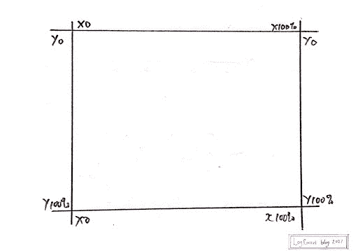

从上图看，坐标的起点是`x0, y0`。当你顺时针移动时，最终位置仍然是`x0, y0`。

有了这些知识，你可以使用`CSS clip-path()`在这个坐标系上创建和定位图形。这是可能的，因为它有一系列被接受的价值观。

## CSS `clip-path()`接受的值

CSS `clip-path()`接受值是接受参数的函数。这些参数决定了裁剪区域的外观和位置。

这些功能如下所列:

*   `inset()`
*   `circle()`
*   `ellipse()`
*   `path()`
*   `polygon()`

### `inset()`

`inset()`功能允许你从坐标系的四个边裁剪一个元素。结果是一个可见的矩形。

给`inset()`赋值的方式类似于给`margin`或`padding`属性赋值的方式。

这意味着:

*   一个值适用于所有四个面
*   两个值应用于顶部和底部、右侧和左侧
*   三个值应用于顶部、右侧和左侧、底部(按此顺序)
*   所有四个值都适用于单个面

例如，下图显示了一个占据了其整个父宽度的蓝色框。


下一个代码块从其父对象的所有四个边剪切该框。

```
.selector {
   clip-path: inset(20px 30px 35px 20px);
}
```

现在，你有这个:


同时，`inset()`还附带了额外的能力！您可以将边界半径指定为其参数之一。您必须使用`round`关键字，后跟`border-radius`值，如下一个代码块所示。

```
.selector {
   clip-path: inset(20px 30px 35px 20px round 20px);
}
```

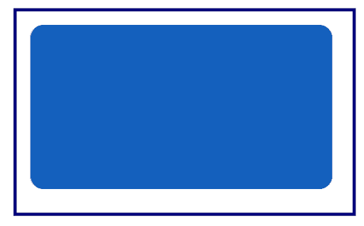

You can also limit the rounded corners to two sides by specifying two values after the `round` keyword.

执行此操作时，第一个值被分配给左上角和右下角，而第二个值被分配给右上角和左下角。

```
.selector {
   clip-path: inset(20px 30px 35px 20px round 20px 50px);
}
```

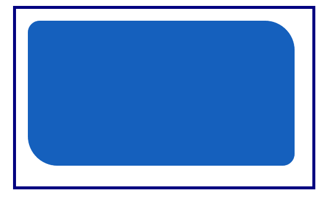

### `circle()`

它的名字说明了一切。它允许你用圆的半径和位置在坐标系上画一个圆。

```
.selector {
   clip-path: circle(100px at 40%)
}
```

从前面的代码块来看，圆的半径为`100px`，在 x 轴和 y 轴上的位置为`40%`。


### `ellipse()`

这允许您创建一个椭圆形的剪辑。它的参数是宽度、高度(后跟`at`关键字)，然后是剪辑位置。

位置可以由关键字值指定，如`center`或`percentage`。在下一个代码块中，`50% 50%`相当于`center`关键字。

```
.selector {
   clip-path: ellipse(80px 60px at 50% 50%);
}
```

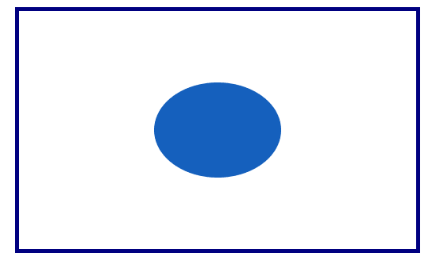

### `path()`

如果您喜欢使用可缩放矢量图形(SVG ),您将需要`path()`函数，它允许您使用 SVG 路径来创建一个裁剪区域。

浏览器支持不一致，如下图[我能用](https://caniuse.com/)吗？

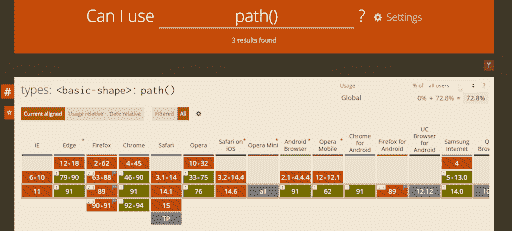

To get around this, you can declare an inline SVG in your HTML file. In your CSS, you’ll use the `url()` function as the value of `clip-path()`.

```
<div class="myClip">
   <svg>
       <clipPath id="clipPath">
           <path d="M10,10 q60,60 100,0 q50,50 50,50 l40,0 l-40,40 l-100,-20"/>
       </clipPath>
   </svg>
</div>
```

然后，在您的 CSS 中:

```
.myClip {
   background-color: #1560bd;
   clip-path: url("#clipPath");
}
```

下一张图片是在现代浏览器中的结果。

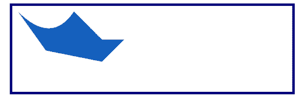

### `polygon()`

使用`polygon()`值，您可以创建复杂的形状。这是我们要做的:我会带你在坐标系上画出一些图形。然后，将这些坐标作为参数传递给 CSS 文件中的`polygon()`函数。

以下是我们将涉及的形状:

1.  平行四边形
2.  向下插入符号
3.  五边形
4.  钻石

#### 平行四边形

如果您想创建一个平行四边形，您将在坐标系中以顺时针方向使用以下近似点:

1.  `x20, y0`
2.  `x80, y0`
3.  `x70, y100`
4.  `x10, y100`
5.  `x20, y0`

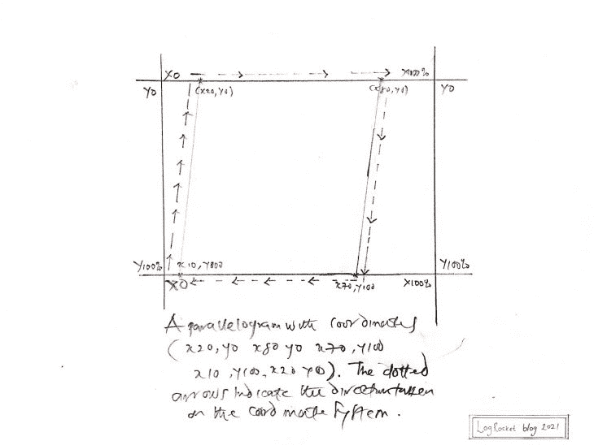

I drew this to show you how to locate the points on the coordinate system.

当您将坐标放入`polygon()`函数时，您可以对其进行定制，只需做一个微小但至关重要的修改:百分号(%)。

```
.selector {
   background-color: #1560bd;
   clip-path: polygon(20% 0%, 80% 0%, 70% 100%, 10% 100%);
}
```

下面是在现代网络浏览器中查看的结果。


#### 向下插入符号

绘制朝下的插入符号没有平行四边形复杂。这是坐标:

1.  `x0, y0`
2.  `x100, y0`
3.  `x50, y100`
4.  `x0, y0`

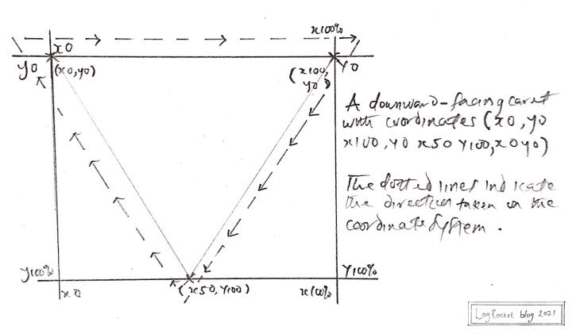

在 CSS 中:

```
.selector {
   background-color: #1560bd;
   clip-path: polygon(0% 0%, 100% 0%, 50% 100%);
}
```

现代浏览器中的结果如下所示。
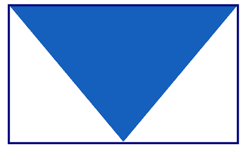

#### 五边形

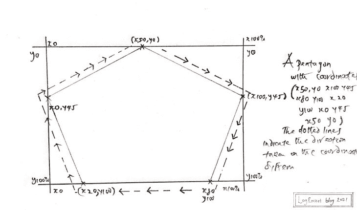

This time, I did not include the coordinates. I’ll leave that to you 😇, or, you can check the previous image or the next CSS code block.

CSS:

```
.selector {
   background-color: #1560bd;
   clip-path: polygon(50% 0%, 100% 45%, 80% 100%, 20% 100%, 0% 45%);
}
```

在您的浏览器中，它应该类似于下图。
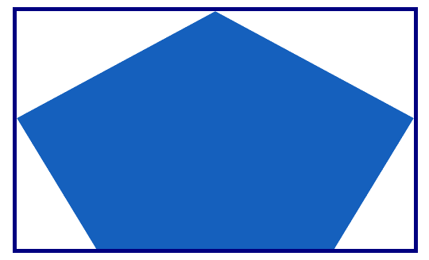

#### 钻石

希望你现在很容易做到这一点。这是它的样子。
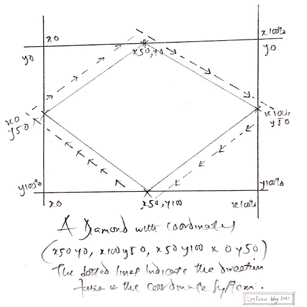

And here’s the CSS.

```
.selector {
   background-color: #1560bd;
   clip-path: polygon(50% 0%, 100% 50%, 50% 100%, 0% 50%);
}
```

如现代浏览器中所见:


Now, you might ask yourself: what more can I do?

嗯，有了`polygon()`功能，你只受你想象力的限制😊。

现在，是时候通过结合动画和 CSS `clip-path()`来创建一些很酷的效果了。

## CSS 动画和 CSS `clip-path()`

当你制作一个元素的动画时，你使用`clip-path()`在动画阶段创建一个剪辑区域，创造一个元素确实在改变它的形状的假象。

您可以在制作动画之前和制作动画时裁剪元素。

让我们看一些例子。在整个过程中，您将编写大量 CSS 代码，但我将专门解释动画和`clip-path()`属性的代码。其余的都算化妆品。

下面列出了您将使用`clip-path()`创建的动画。

1.  无限循环
2.  跳舞的方块
3.  翻转形状
4.  多形状图像动画

### 在 CSS 中创建无限循环

这个无限循环是通过在动画的不同阶段向`circle()`传递不同的值来实现的。当您将它添加到要制作动画的元素时，您可以确保动画一直在运行。

这怎么可能呢？因为您利用了动画属性之一，即`animation-iteration-count`，并将其值指定为`infinite`。

在此之前，使用以下 HTML:

```
<main>
   <div class="circles"></div>
</main>
```

CSS 代码列在下一个代码块中。

```
main {
    display: grid;
    place-items: center;
    padding: 2em;
}
​
.circles {
    background: #1a1a1a;
    clip-path: circle(80px at 50% 50%);
    height: 200px;
    width: 200px;
    border-radius: 50%;
    animation-name: infiniteCircle;
    animation-duration: 3s;
    animation-timing-function: ease-in;
    animation-iteration-count: infinite;
}
​
@keyframes infiniteCircle {
    from {
        background: #f00;
        clip-path: circle(50%);
    }
​
    50% {
        background: #ffd700;
        clip-path: circle(35%);
    }
​
    to {
        background: #f0f;
        clip-path: circle(75%);
    }
}
```

下面的 GIF 描述了现代浏览器的输出。


### 跳舞的方块

这个名字再次说明了一切:真正跳舞的广场。首先用`polygon()`在坐标系上画出初始的正方形，然后在动画的不同阶段画出与正方形密切相关的各种形状。

最后，让动画无限运行。对于 HTML，您可以使用上一节中的 HTML，稍加修改:将`main`中的`div`的类名改为`squares`。

CSS 代码如下:

```
main {
   display: grid;
   place-items: center;
   padding: 2em;
}
​
.squares {
    width: 250px;
    height: 250px;
    background-image: linear-gradient(to right, #000000, #e74c3c);
    clip-path: polygon(20% 0%, 80% 0%, 100% 100%, 0% 100%);
    animation-name: dancingSquares;
    animation-duration: 4s;
    animation-direction: alternate-reverse;
    animation-iteration-count: infinite;
}
​
@keyframes dancingSquares {
    25% {
        background-image: linear-gradient(to right, #f0c27b, #4b1248);
        clip-path: polygon(20% 0%, 100% 40%, 70% 100%, 10% 100%);
    }
    50% {
        background-image: linear-gradient(to right, #c21500, #ffc500);
        clip-path: polygon(0% 45%, 100% 20%, 50% 75%, 0% 100%);
}

    75% {
        background-image: linear-gradient(to right, #00d2ff, #3a7bd5);
        clip-path: polygon(100% 38%, 100% 38%, 66% 100%, 0% 53%);
   }
}
```

这是 GIF 格式的输出。


### 翻转形状

这个动画背后的想法是在一个元素周围创建一个带有`clip-path()`的形状，然后在动画阶段将其翻转成另一个形状。

对于这个例子，元素是一个图像。

以下是 HTML:

```
<main>
   
</main>
```

和 CSS:

```
main {
    display: grid;
    place-items: center;
    padding: 2em;
}
​
img {
    width: 600px;
    clip-path: polygon(50% 0%, 100% 38%, 82% 100%, 18% 100%, 0% 38%);
    animation-name: flippingShapes;
    animation-duration: 3s;
    animation-iteration-count: infinite;
}
​
@keyframes flippingShapes {
    from {
        clip-path: polygon(50% 0%, 100% 38%, 82% 100%, 18% 100%, 0% 38%);
    }
​
    50% {
        clip-path: polygon(50% 50%, 90% 88%, 80% 10%, 20% 10%, 8% 90%);
    }

    to {
        clip-path: polygon(50% 0%, 100% 38%, 82% 100%, 18% 100%, 0% 38%);
   }
}
```

结果如下图 GIF 所示。
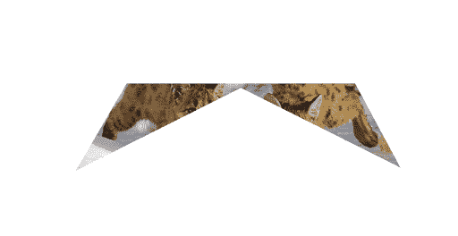

### 多形态图像动画

在这个动画中，您将使用`clip-path()`围绕一个元素创建您想要的形状。在动画阶段，您将创建更多想要的形状。

最后，当您将动画附加到元素时，您将它的`animation-iteration-count`设置为 infinite。

您将使用以下 HTML:

```
<main>
    <div class="container">
        
    </div>
</main>
```

CSS 在下一个代码块中列出。请注意，关键字`from`和`to`混合了逗号分隔的百分比值。

```
main {
    display: grid;
    place-items: center;
    padding: 2em;
}
​
img {
    max-width: 100%;
}
​
.container {
    width: 30em;
    clip-path: polygon(20% 0%, 80% 0%, 100% 100%, 0% 100%);
    animation-name: changeShapes;
    animation-duration: 5s;
    animation-iteration-count: infinite;
}
​
@keyframes changeShapes {
    from {
        clip-path: polygon(25% 0%, 75% 0%, 100% 50%, 75% 100%, 25% 100%, 0% 50%);
    }

   50% {
        clip-path: polygon(25% 0%, 75% 0%, 100% 50%, 75% 100%, 25% 100%, 0% 50%);
   }

   75% {
      clip-path: polygon(0% 15%, 15% 15%, 15% 0%, 85% 0%, 85% 15%, 100% 15%, 100% 85%, 85% 85%, 85% 100%, 15% 100%, 15% 85%, 0% 85%);
  }
​
to {
      clip-path: polygon(25% 0%, 100% 0%, 75% 100%, 0% 100%);
  }
}
```

下一张 GIF 图展示了现代浏览器的效果。
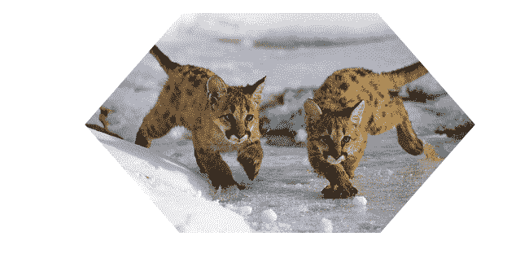

## 在 CSS 中制作动画时需要考虑的重要提示

### 浏览器和 CPU 速度

你可能使用一个 CPU 速度很快的高端系统，所以你可能不会注意到动画的内存消耗。请记住，您的用户可能有一个 CPU 速度较低的系统。

这在下一张 GIF 中有说明。在 GIF 中，动画开始前，Firefox 的 CPU 占用率为`3.3%`，动画运行 10 秒后，CPU 占用率增加到`24.5%`。

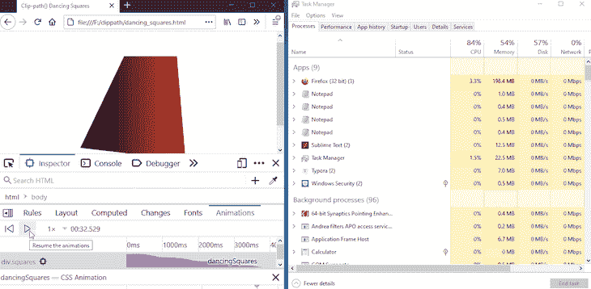

请注意这一点，除非绝对必要，否则不要让你的动画无限运行。

### 易接近

在我们的例子中，我们将`animation-iteration-count`设置为`infinite`，因此动画将一直运行，直到您关闭活动的浏览器窗口。

但是，您应该为您的用户提供一种机制，允许他们随意开始和停止动画，或者通过`animation-iteration-count`限制动画迭代。

### 浏览器支持

不是每个人都能使用现代浏览器。考虑到这一点，在项目中使用 CSS 属性之前，您应该使用类似于[我可以使用…](https://caniuse.com/) 的工具来确认 CSS 属性的浏览器支持。

## 你的前端是否占用了用户的 CPU？

随着 web 前端变得越来越复杂，资源贪婪的特性对浏览器的要求越来越高。如果您对监控和跟踪生产环境中所有用户的客户端 CPU 使用、内存使用等感兴趣，

[try LogRocket](https://lp.logrocket.com/blg/css-signup)

.

[](https://lp.logrocket.com/blg/css-signup)[https://logrocket.com/signup/](https://lp.logrocket.com/blg/css-signup)

LogRocket 就像是网络和移动应用的 DVR，记录你的网络应用或网站上发生的一切。您可以汇总和报告关键的前端性能指标，重放用户会话和应用程序状态，记录网络请求，并自动显示所有错误，而不是猜测问题发生的原因。

现代化您调试 web 和移动应用的方式— [开始免费监控](https://lp.logrocket.com/blg/css-signup)。