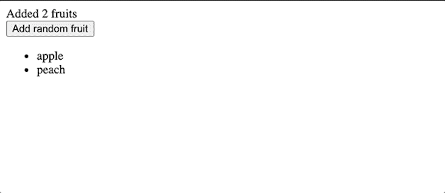

# 使用变异 Observer - LogRocket 博客定制 React 挂钩指南

> 原文：<https://blog.logrocket.com/guide-to-custom-react-hooks-with-mutationobserver/>

随着 React 钩子的引入，React 代码库中可共享的代码数量激增。因为钩子是 React 之上的瘦 API，开发人员可以通过将可重用的行为附加到组件并将这些行为分离到更小的模块中来进行协作。

虽然这类似于 JavaScript 开发人员在普通 JavaScript 模块中抽象业务逻辑的方式，但是钩子提供的不仅仅是纯 JavaScript 函数。开发人员可以扩展一个钩子内部可能发生的事情的范围，而不是将数据放入和取出。

例如，开发人员可以:

*   变异和管理特定组件或整个应用程序的一段状态
*   触发页面上的副作用，如更改浏览器选项卡的标题
*   通过利用钩子进入 React 组件的生命周期来调整外部 API

在本帖中，我们将探讨后一种可能性。作为一个案例研究，我们将在一个定制的 React 钩子中抽象出`MutationObserver` API，演示我们如何在 React 代码库中构建健壮的、可共享的逻辑。

我们将创建一个动态标签，它可以自我更新来指示列表中有多少项。我们将使用 [`MutationObserver` API](https://developer.mozilla.org/en-US/docs/Web/API/MutationObserver) 来检测添加的元素并相应地更新标签，而不是使用提供的元素的 React 状态数组。



Update the dynamic label to count the number of fruits in the list.

## 实施概述

下面的代码是一个呈现我们的列表的简单组件。它还更新一个计数器值，该值表示列表中当前水果的数量:

```
export default function App() {
  const listRef = useRef();
  const [count, setCount] = useState(2);
  const [fruits, setFruits] = useState(["apple", "peach"]);
  const onListMutation = useCallback(
    (mutationList) => {
      setCount(mutationList[0].target.children.length);
    },
    [setCount]
  );

  useMutationObservable(listRef.current, onListMutation);

  return (
    <div>
      <span>{`Added ${count} fruits`}</span>
      <br />
      <button
        onClick={() => setFruits([...fruits, `random fruit ${fruits.length}`])}
      >
        Add random fruit
      </button>
      <ul ref={listRef}>
        {fruits.map((f) => (
          <li key={f}>{f}</li>
        ))}
      </ul>
    </div>
  );
}

```

每当我们的`list`元素发生变化时，我们希望触发一个回调函数。在我们引用的回调中，元素的子元素给我们列表中元素的数量。

## 实现`useMutationObservable`定制钩子

让我们看看集成点:

```
useMutationObservable(listRef.current, onListMutation);

```

上面的`useMutationObservable`定制钩子抽象了必要的操作，以观察作为第一个参数传递的元素的变化。然后，每当目标元素改变时，它运行作为第二个参数传递的回调。

现在，让我们实现我们的`useMutationObservable`定制钩子。

在钩子中，有许多样板操作需要理解。首先，我们必须提供一组符合`MutationObserver` API 的选项。

一旦创建了`MutationObserver`实例，我们必须调用`observe`来监听目标 DOM 元素的变化。

当我们不再需要监听变化时，我们必须调用观察者上的`disconnect`来清理我们的订阅。这必须在`App`组件卸载时发生:

```
const DEFAULT_OPTIONS = {
  config: { attributes: true, childList: true, subtree: true },
};
function useMutationObservable(targetEl, cb, options = DEFAULT_OPTIONS) {
  const [observer, setObserver] = useState(null);

  useEffect(() => {
    const obs = new MutationObserver(cb);
    setObserver(obs);
  }, [cb, options, setObserver]);

  useEffect(() => {
    if (!observer) return;
    const { config } = options;
    observer.observe(targetEl, config);
    return () => {
      if (observer) {
        observer.disconnect();
      }
    };
  }, [observer, targetEl, options]);
}

```

所有上述工作，包括用正确的参数初始化`MutationObserver`，用调用`observer.observe`观察变化，用`observer.disconnect`清理，都从客户端抽象出来。

我们不仅导出功能，还通过挂钩 React 组件的生命周期和利用效果挂钩上的清理回调来拆除`MutationObserver`实例来进行清理。

既然我们已经有了钩子的功能和基本版本，我们可以考虑通过迭代它的 API 来提高它的质量，并围绕这段可共享的代码增强开发人员的体验。

### 输入验证和开发

设计定制 React 挂钩的一个重要方面是输入验证。当事情进展不顺利或者某个用例遇到边缘情况时，我们必须能够与开发人员沟通。

通常，开发日志帮助开发人员理解不熟悉的代码，以调整他们的实现。同样，我们可以通过添加运行时检查和全面的警告日志来验证和向其他开发人员传达问题，从而增强上述实现:

```
function useMutationObservable(targetEl, cb, options = DEFAULT_OPTIONS) {
  const [observer, setObserver] = useState(null);

  useEffect(() => {
    // A)
    if (!cb || typeof cb !== "function") {
      console.warn(
        `You must provide a valid callback function, instead you've provided ${cb}`
      );
      return;
    }
    const { debounceTime } = options;
    const obs = new MutationObserver(cb);
    setObserver(obs);
  }, [cb, options, setObserver]);
  useEffect(() => {
    if (!observer) return;
    if (!targetEl) {
      // B)
      console.warn(
        `You must provide a valid DOM element to observe, instead you've provided ${targetEl}`
      );
    }
    const { config } = options;
    try {
      observer.observe(targetEl, config);
    } catch (e) {
      // C)
      console.error(e);
    }
    return () => {
      if (observer) {
        observer.disconnect();
      }
    };
  }, [observer, targetEl, options]);
}

```

在这个例子中，我们检查回调是否作为第二个参数被传递。运行时的这种 API 检查可以很容易地提醒开发人员调用方出现了问题。

我们还可以看到所提供的 DOM 元素是否无效，在运行时是否向钩子提供了错误的值。这些记录在一起，通知我们快速解决问题。

而且，如果`observe`抛出一个错误，我们可以捕捉并报告它。我们必须尽可能避免破坏 JavaScript 运行时流程，因此通过捕获错误，我们可以根据环境选择记录或报告错误。

### 通过配置实现可扩展性

如果我们想在钩子上添加更多的功能，我们应该以一种复古兼容的方式来实现，比如一种选择加入的功能，这种功能对它的采用几乎没有或没有摩擦。

让我们看看如何选择性地去抖所提供的回调函数，以便调用者可以指定一个时间间隔，当目标元素中没有其他变化触发时。这将运行回调一次，而不是运行元素或其子元素变异的相同次数:

```
import debounce from "lodash.debounce";

const DEFAULT_OPTIONS = {
  config: { attributes: true, childList: true, subtree: true },
  debounceTime: 0
};
function useMutationObservable(targetEl, cb, options = DEFAULT_OPTIONS) {
  const [observer, setObserver] = useState(null);
  useEffect(() => {
    if (!cb || typeof cb !== "function") {
      console.warn(
        `You must provide a valida callback function, instead you've provided ${cb}`
      );
      return;
    }
    const { debounceTime } = options;
    const obs = new MutationObserver(
      debounceTime > 0 ? debounce(cb, debounceTime) : cb
    );
    setObserver(obs);
  }, [cb, options, setObserver]);
  // ...

```

如果我们必须运行一个繁重的操作，比如触发一个 web 请求，确保它运行尽可能少的次数，这是很方便的。

* * *

### 更多来自 LogRocket 的精彩文章:

* * *

我们的`debounceTime`选项现在可以传递到我们的自定义钩子中。如果传递给`MutationObservable`的值大于`0`，回调会相应延迟。

通过在我们的 Hook API 中公开一个简单的配置，我们允许其他开发人员去抖他们的回调，这可以导致更高性能的实现，因为我们可能会大大减少回调代码的执行次数。

当然，我们总是可以在客户端去抖回调，但是这样我们丰富了我们的 API，并使调用端的实现更小和更具声明性。

### 测试

测试是开发任何一种共享能力的基本部分。当它们被大量贡献和共享时，它帮助我们确保通用 API 的一定质量水平。

测试 React 钩子的指南有关于测试的扩展细节，可以在本教程中实现。

### 证明文件

文档可以提高定制挂钩的质量，并使其对开发人员友好。

但是即使是编写普通的 JavaScript， [JSDoc 文档也可以为定制的钩子 API](https://jsdoc.app/)编写，以确保钩子将正确的信息传递给开发人员。

让我们关注一下`useMutationObservable`函数声明以及如何向它添加格式化的 JSDoc 文档:

```
/**
 * This custom hooks abstracts the usage of the Mutation Observer with React components.
 * Watch for changes being made to the DOM tree and trigger a custom callback.
 * @param {Element} targetEl DOM element to be observed
 * @param {Function} cb callback that will run when there's a change in targetEl or any
 * child element (depending on the provided options)
 * @param {Object} options 
 * @param {Object} options.config check \[options\](https://developer.mozilla.org/en-US/docs/Web/API/MutationObserver/observe)
 * @param {number} [options.debounceTime=0] a number that represents the amount of time in ms
 * that you which to debounce the call to the provided callback function
 */
function useMutationObservable(targetEl, cb, options = DEFAULT_OPTIONS) {

```

编写这样的代码不仅对文档有用，而且它还利用了智能感知功能，自动完成钩子的使用并提供钩子参数的位置信息。这为开发人员每次使用节省了几秒钟的时间，潜在地增加了在通读代码和试图理解代码上浪费的时间。

## 结论

通过我们可以实现的不同种类的定制钩子，我们可以看到它们是如何将外部 API 集成到 React 世界中的。很容易将状态管理集成到钩子中，并基于来自使用钩子的组件的输入运行效果。

请记住，要打造高质量的挂钩，重要的是:

*   设计易于使用的声明式 API
*   通过检查正确的用法并记录警告和错误来增强开发体验
*   通过配置公开特性，例如`debounceTime`示例
*   通过编写 JSDoc 文档来简化钩子的使用

你可以在这里查看定制 React 钩子的完整实现。

## 使用 LogRocket 消除传统反应错误报告的噪音

[LogRocket](https://lp.logrocket.com/blg/react-signup-issue-free)

是一款 React analytics 解决方案，可保护您免受数百个误报错误警报的影响，只针对少数真正重要的项目。LogRocket 告诉您 React 应用程序中实际影响用户的最具影响力的 bug 和 UX 问题。

[ ](https://lp.logrocket.com/blg/react-signup-general) [  ](https://lp.logrocket.com/blg/react-signup-general) [LogRocket](https://lp.logrocket.com/blg/react-signup-issue-free)

自动聚合客户端错误、反应错误边界、还原状态、缓慢的组件加载时间、JS 异常、前端性能指标和用户交互。然后，LogRocket 使用机器学习来通知您影响大多数用户的最具影响力的问题，并提供您修复它所需的上下文。

关注重要的 React bug—[今天就试试 LogRocket】。](https://lp.logrocket.com/blg/react-signup-issue-free)