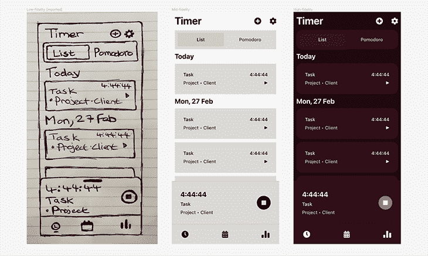
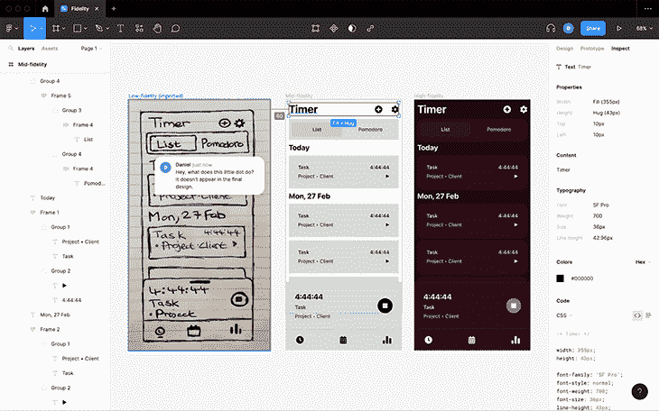
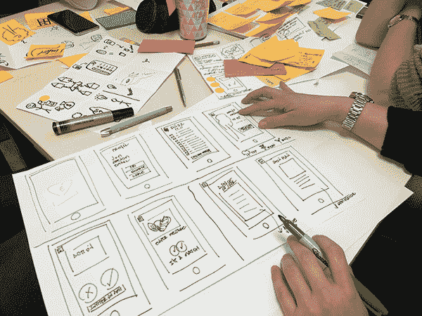

# 设计概念指南:实体模型、线框等

> 原文：<https://blog.logrocket.com/product-management/guide-to-design-concepts/>

设计概念是产品工作流程中极其重要的一部分。它们对于构思、迭代、测试以及在进入开发阶段之前从本质上模拟设计是至关重要的，在开发阶段，修复出现的任何问题都为时已晚或者代价太高。

在本文中，您将了解不同类型的设计概念，以及产品团队如何使用它们来尽早解决问题。

* * *

## 目录

* * *

## 什么是设计概念？

有三种主要类型的设计概念，有时被称为“模型”，即低保真度、中保真度和高保真度。在这种情况下，保真度意味着真实程度:

低保真度设计概念是最简单的，用于可视化早期阶段的想法。通常，这些都是以简单的线框形式出现的(即低细节、低色彩、低交互性的蓝图)。

它们通常是数字化的，但产品团队可能更喜欢通过草图(或“纸上原型”)来开始构思。此时，目标是通过构思、迭代和[用户测试](https://blog.logrocket.com/ux-design/how-usability-testing-can-inform-ux-teams/)来理解核心用户需求。没有想法是太坏或太疯狂的；事实上，团队是被鼓励去狂野的！

中等保真度的设计概念更加详细和现实。在这一点上，你可能已经选择了一个向前推进的概念，现在是时候更多地关注 UX(用户体验)而不是用户需求了。你将在与可用性相关的地方使用颜色，在后面的阶段，你将开始使它具有交互性。在这一点上，你会开始把它作为一个原型。你将是 UX 测试，而不是用户测试。

高保真设计是让原型尽可能真实。这包括首次使用颜色来帮助表达视觉美感，并确保其交互性反映出最终产品应该如何表现。

这里有一个快速的视觉效果，让你了解三种不同类型的设计概念是什么样子的:

设计师通常会使用设计移交工具来注释设计，以弥补 UI 设计工具的局限性。同时，这使得开发人员可以加入聊天，询问他们对如何开发设计的任何关注。当然，这是在做更多的 UX 测试之前:

## 设计概念有什么用？

在产品过程中，障碍和挫折是不可避免的。然而，[在设计后阶段解决问题要贵 2-15 倍](https://www.researchgate.net/figure/IBM-System-Science-Institute-Relative-Cost-of-Fixing-Defects_fig1_255965523)。设计概念是创造伟大产品的第一步，因为它们使产品团队能够在开发阶段之前很久就发现并解决问题。

在低保真度阶段，设计概念对于产生、提炼和用户测试大量的想法是有用的。目标是以一个最能满足用户需求的概念结束。

在中等保真度阶段，设计概念对于打造良好的用户体验以及使用 UX 测试来测试和提炼用户体验非常有用。这包括可用性(用户能多好地使用它)，可访问性(确保每个人都能访问它，不管他们的能力如何)，以及一点点交互性。如果没有很好的可用性和可访问性，用户就不太可能想使用你的产品。

在高保真阶段，它只是更多的可用性、可访问性和交互性，加上视觉美感的添加(有时称为表层)。虽然它在设计和 UX 测试方面大同小异，但它更多的是关于微小的细节，而不是基本的结构。事实上，这是开发人员用来指导实际构建产品的模型。没有高保真的原型(或者实际上没有任何设计概念)，开发人员将几乎一无所获。

## 进行用户和 UX 研究的技巧

在内部使用设计概念是通过应用我们称之为“设计启发法”来设计产品的一个很好的方法，这本质上是可重复的解决方案(或者安全的赌注，如果你愿意的话)。

一般来说，这些安全的赌注很可能或一定会改进设计，而不管上下文如何。例如，额外的颜色对比将在 100%的场景中提高可读性——我们不需要做任何测试来发现这一点。

然而，产品团队必须利用用户和 UX 测试来发现和解决大多数问题，并确认所使用的任何设计启发实际上都是正确的选择。

### 建立研究参与者数据库

你需要建立和维护一个研究参与者的数据库。您将只在中保真度和高保真度阶段重用您在低保真度阶段使用的参与者。此外，在最终开发产品之前，你将多次经历所有这些阶段，然后随着你的产品获得新功能、[瞄准新市场](https://blog.logrocket.com/product-management/4-steps-simplify-go-to-market-strategy/)、重新调整其[商业目标](https://blog.logrocket.com/product-management/work-smarter-not-harder-how-to-write-modern-smart-goals/)或更名，你还会经历更多次。

我们的目标是手头有足够数量的研究参与者，因为有些参与者可能在你需要他们的时候不在。有些可能不符合特定的人口统计(如年龄组)或标准(使用过类似的产品)。因此，仅仅有 5-10 名参与者是不够的。

记录他们的人口统计数据、属性、联系方式、可靠性以及反馈的前瞻性。产品团队应该能够根据这些信息轻松地划分和联系参与者。有一些有用的工具可以帮助我们做到这一点，但是我们一会儿再深入探讨。

### 建立一个研究知识库

产品团队也应该养成为所谓的研究知识库做贡献的习惯。简而言之，每次进行研究或测试时，都会记录目标、设计概念、分步过程、见解和结果，以便产品团队可以轻松重复成功的过程或重用见解，从而节省时间。

利用一个研究仓库也有助于建立一个更加民主、更加基于信息共享的文化，任何人都可以为产品的设计做出贡献。这为团队带来了广泛的视角，通过分散责任减轻了研究的负担，并通过允许更多的创造性自由提高了团队的士气。

记住，实际上任何人都可以使用设计概念——产品经理、开发人员、营销人员等等。至少，一个想法可以通过一些纸上原型和一个研究参与者数据库来探索。

我在这里描述的听起来像是一种[自下而上的产品管理方法](https://blog.logrocket.com/product-management/top-down-vs-bottom-up-approach/)。如果您更愿意采用自顶向下的方法，在这种方法中工作更有条理、更有组织、更同步(尽管可能更有局限性)，那么最好采用产品方法。

## 产品经理如何为设计概念创造良好的实践

有许多不同的产品方法。它们都有自己的流程、优点和缺点，但从根本上说它们是相同的——帮助团队简化流程，并在事情上花费适当的时间。一般来说，它们都涉及构思、迭代、测试和快速增量改进，利用设计概念而不是在开发上浪费大量资源。

Source: [https://unsplash.com/photos/wusOJ-2uY6w](https://unsplash.com/photos/wusOJ-2uY6w).

一些流行的方法包括:

*   敏捷冲刺
*   设计冲刺
*   设计思维

产品经理可以通过选择合适的产品方法来拥有设计概念。Martin Backes 的文章详细介绍了每种产品方法的优缺点。我推荐这本书，因为 Martin 也给出了建议，以确保团队充分利用所选方法(或者如果您更喜欢在不同风格之间切换的方法)实施的技术和时间限制。

记住这一点，利用产品方法并不一定意味着利用自顶向下的方法来进行产品管理。例如，与其进行连续的设计冲刺，不如在冲刺之间休息一会儿，让团队成员进行一些附带的任务，在这些任务中，他们可以利用自己的创造性自由，利用设计概念来探索想法。

* * *

订阅我们的产品管理简讯
将此类文章发送到您的收件箱

* * *

举个例子，开发人员可能想用一个替代方案来测试一个特定的设计模式，知道其实现的性能会很慢——这是设计师通常不知道的。鉴于我们对设计阶段后解决问题的了解，如果忽略这一点，将会是一个代价高昂的错误。

同样，这也是为什么产品团队拥有多样化的专业知识，加上创造性的自由和能力(或协作带宽)来利用设计概念探索想法是如此重要，即使只是在纸上。

## 撰写设计陈述

设计声明本质上是一份记录整个设计过程的文档。举个例子，你放在研究仓库里的那种文章会被归类为设计声明。

但是这些并不是设计陈述的唯一类型。您还需要记录您的用户对某些设计模式的反应——他们觉得哪些容易使用，哪些不容易使用，它是如何测试的，以及任何相关的上下文。

如果在测试过程中使用了任何看起来没有问题的设计试探法，列举出使用了哪种试探法以及为什么。

记录这些事情是很有用的，这样产品团队在未来使用设计概念时就可以获得有价值的见解。此外，这些信息将成为你的产品设计系统。

以下工具非常适合创建任何保真度的线框和原型:

对于素描，您需要了解:

最后，创建一个研究存储库(包括存储研究参与者信息的地方):

## 包扎

设计概念应该伴随产品团队走过产品过程的每一步，帮助他们构思、迭代、测试、解决问题，并最终将它们交给开发人员来构建。

绝对值得学习如何有效地构建和测试它们(也许使用产品方法论)，如何包括参与产品工作的每个人(不仅仅是设计师)，以及如何记录见解以赋予它们可回收的价值。

如果你有什么要分享的，欢迎你的建议和工具。不管怎样，感谢你的阅读！

*精选图片来源:[icon scout](https://iconscout.com/icon/design-2074415)*

## [LogRocket](https://lp.logrocket.com/blg/pm-signup) 产生产品见解，从而导致有意义的行动

[LogRocket](https://lp.logrocket.com/blg/pm-signup) 确定用户体验中的摩擦点，以便您能够做出明智的产品和设计变更决策，从而实现您的目标。

使用 LogRocket，您可以[了解影响您产品的问题的范围](https://logrocket.com/for/analytics-for-web-applications)，并优先考虑需要做出的更改。LogRocket 简化了工作流程，允许工程和设计团队使用与您相同的[数据进行工作](https://logrocket.com/for/web-analytics-solutions)，消除了对需要做什么的困惑。

让你的团队步调一致——今天就试试 [LogRocket](https://lp.logrocket.com/blg/pm-signup) 。

[Daniel Schwarz Follow](https://blog.logrocket.com/author/danielschwarz/) Previously, design blog editor at Toptal and SitePoint. Now I advocate for better UX design alongside industry leaders such as Adobe, InVision, Marvel, Wix, Net Magazine, CreativeBloq, CSS-Tricks, and more.