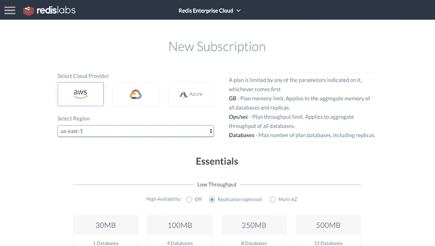
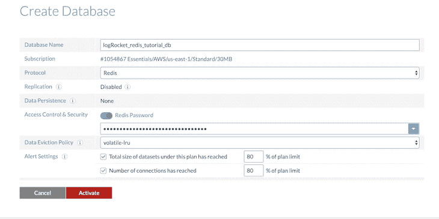
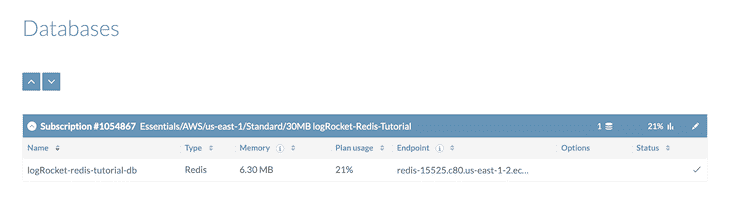
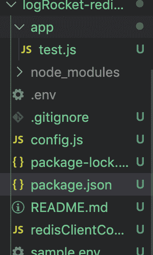
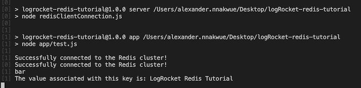

# 完全理解 Redis - LogRocket 博客的指南

> 原文：<https://blog.logrocket.com/guide-to-fully-understanding-redis/>

## 介绍

根据其[G](https://github.com/antirez/redis)[it](https://github.com/antirez/redis)[H](https://github.com/antirez/redis)[ub 库](https://github.com/antirez/redis)，Redis(代表**Re**mote**Di**rectory**S**erver)是一个[内存中](https://en.wikipedia.org/wiki/In-memory_database)数据结构存储。它是一个磁盘持久的键值数据库，支持多种数据结构或数据类型。

这意味着，虽然 Redis 支持基于映射键值的字符串来存储和检索数据(类似于传统数据库中支持的数据模型)，但它也支持其他复杂的数据结构，如列表、集合等。接下来，我们将看看 Redis 支持的数据结构。我们还将了解 Redis 的独特功能。

Redis 是一个开源的、高度复制的、高性能的、非关系型的数据库和缓存服务器。它通过一种预定义的数据模型将键映射到值来工作。它的好处包括:

*   基于映射键值的缓存系统，几乎可以与 [memcached](https://memcached.org/) 相媲美
*   没有关于为数据定义严格模式或表的严格规则(无模式)
*   支持多种数据模型或类型
*   与其他类型的数据库系统相比，提供了更高级的功能
*   通过一种称为[分片](https://en.wikipedia.org/wiki/Shard_(database_architecture))的技术，每秒能够承受多个并发写请求或事务
*   可以与其他数据库一起使用，作为减少负载和提高性能的支持，但也可以用作主数据库。请注意，这通常基于个人需求和用例
*   可以在混合数据的快速数据接收和数据完整性领域派上用场，在这些领域中，诸如高效率和复制之类的特性至关重要

> **注** : Redis 在大型企业应用中有多种用例。除了充当缓存服务器，它还可以充当消息代理或用于发布者/订阅者类型的系统。关于其他用例的详细信息，我们可以查看[文档的这一部分](https://redislabs.com/redis-enterprise/use-cases)。

## 先决条件

在我们继续之前，建议在我们的机器上安装 Node 和 npm。如何操作的说明可在[这里](https://nodejs.org/en/)找到。此外，要在本地安装 Redis，我们可以访问[文档的这一部分](https://redis.io/download#installation)。

虽然我们将使用 Redis 的云托管版本— [Redis Labs](https://redislabs.com/) —但我们也将在我们的机器上进行本地设置。这将使我们能够在使用命令行实用程序时学习。

## 正在安装 Redis

要在本地机器上安装 Redis，我们可以下载最新的可用二进制文件。或者，我们也可以使用以下命令来下载:

```
wget http://download.redis.io/releases/redis-5.0.7.tar.gz
```

下载完二进制文件后，我们可以继续进行解压缩:

```
tar xzf redis-5.0.7.tar.gz
cd redis-5.0.7
make
ls
cd src/
```

如上所述，提取二进制文件后，我们可以导航到`redis`目录并运行`make`命令，该命令编译并构建 Redis 正常运行所需的所有可执行文件。请注意，在撰写本文时，当前的 Redis 版本是 5.0.7。

要在本地启动 Redis，我们只需运行以下命令:

```
./redis-server
```

要测试 Redis 与服务器的连接是否成功，我们可以打开一个新的终端窗口并运行:

```
redis-cli ping
```

输出应该是:

```
PONG
```

最后，要启动 Redis CLI，以便进行实验并开始学习如何使用 Redis 命令，我们可以运行:

```
./redis-cli
```

启动 CLI 后，我们可以继续运行`info`命令来查看当前运行的 Redis 实例的所有参数。输出如下所示。请注意，为了简洁起见，此处将其截断:

```
127.0.0.1:6379> info
# Server
redis_version:5.0.7
redis_git_sha1:00000000
redis_git_dirty:0
redis_build_id:e3be448653a99bb8
redis_mode:standalone
os:Darwin 18.7.0 x86_64
arch_bits:64
multiplexing_api:kqueue
atomicvar_api:atomic-builtin
gcc_version:4.2.1
process_id:98832
run_id:c63164944a269066f81b9bbc553296614fcb3df6
tcp_port:6379
uptime_in_seconds:374
uptime_in_days:0
hz:10
configured_hz:10
lru_clock:443996
executable:/Users/alexander.nnakwue/Downloads/redis-5.0.7/src/./redis-server
config_file:

# Clients
connected_clients:1
client_recent_max_input_buffer:2
client_recent_max_output_buffer:0
blocked_clients:0
```

让我们用最基本的 Redis 命令、`SET`和`GET`在`redis-cli`上进行实验，以确保我们成功连接到服务器:

```
SET mykey "Hello world"
```

这里我们将键`mykey`设置为字符串值`"Hello world"`。该命令的输出如下所示:

```
OK
```

现在，我们可以用这个键运行一个`get`命令来取回这个值:

```
get mykey
```

输出如下所示:

```
"Hello world"
```

关于所有可用 Redis 命令的完整列表，可以在 Redis 文档的[部分](https://redis.io/commands)中找到参考。

> **注意:**要正确安装 Redis，请查看[文档的这一部分](https://redis.io/topics/quickstart#installing-redis-more-properly)。如果我们不想在实际或生产应用程序中使用托管 Redis 服务器/实例，这是绝对必要的。然而，对于黑客和开发目的，我们以前的安装设置工作良好。

### Redis 实验室的云替代方案

首先，我们可以访问 [Redis Labs](https://redislabs.com/) 来设置我们的账户，这是一个完全云管理的 Redis 替代方案。在本教程中，我们将使用免费层，这基本上是一个有限的选项，用于开发和测试目的。



Figure 1: Creating a new subscription for the free-tier option.

完成当前配置后，我们可以继续设置我们的数据库，如下所示:



Figure 2: Interface for database creation.

完成数据库设置后，我们现在应该能够在仪表板上查看我们当前的订阅:



Figure 3: Subscription that contains the endpoint URL for the 30MB free tier.

注意，我们可以使用`redis-cli`或`telnet`连接到 Redis 数据库。通过 CLI 连接到群集的命令如下所示:

```
redis-cli -h <redic-host>  -p <redis-port> -a <password>
```

关于设置的更多信息可在[这里](https://docs.redislabs.com/latest/rc/quick-setup/)找到。

## 使用 cases for redis

Redis 数据保存在内存中，而不是保存在磁盘上的传统数据库。这使 Redis 比其他类型的存储系统更有优势，并使其超快，具有高吞吐量和低延迟。因此，Redis 可以用于实时应用程序和消息队列系统。其他使用案例包括:

### 会话管理

Redis 在应用程序级别管理用户会话时也很方便。典型的 web 应用程序存储有关用户登录、用户 id、最近的用户操作等用户会话信息。在 Redis 中实现会话管理的细节可以在这里找到[。](https://redislabs.com/redis-enterprise/use-cases/session-management/)

### 贮藏

对于应用程序用户经常需要或检索的数据，一个[缓存](https://redislabs.com/redis-enterprise/use-cases/)将作为一个临时数据存储，用于快速检索，而不需要额外的数据库往返。请注意，存储在缓存中的数据通常是来自早期查询的数据或存储在其他地方的数据的副本。这一特性至关重要，因为我们从缓存中获取的数据越多，系统的整体性能就越快、越高效。

Redis 使用案例的更多详细信息，如发布者/订阅者系统、欺诈检测、排行榜和数据接收等。可在 Redis 企业文档的本节中找到。

## Redis 数据结构和相关命令

当谈到我们如何基于特定用例建模数据时，Redis 是非常通用的。如前所述，它允许我们将键映射到字符串和其他可用的受支持的数据类型。其他受支持的数据类型/模型包括列表、集合、散列、排序集合、流等等。

> 与传统数据库相反，Redis 中支持其他数据模型消除了或最大限度地减少了将一种数据类型转换为另一种数据类型所需的时间。

有关每种数据类型的定义和用例的详细信息，您可以查看 Redis 文档的这一[部分](https://redis.io/topics/data-types-intro),其中详细解释了如何以及何时针对 Redis 服务器对这些数据类型发出 Redis 命令。所有 Redis 命令的完整列表也可以在这里找到[这里](https://redis.io/commands)。

在文档/指南中，每个命令都映射到它可以操作的相应数据类型。在下一节中，我们将尝试其中的一些命令。现在让我们学习一些数据结构。

### 线

Redis 提供了对 string 数据类型的某些部分或全部进行操作的命令。字符串数据类型也可以存储整数和浮点数。这里有一个[链接](https://redis.io/commands#string),是关于字符串操作命令的文档。我们之前已经看到了如何使用字符串数据类型的示例。

### 设置

Redis 集合存储唯一的数字集合，几乎类似于大多数编程语言中的集合。我们可以在集合中添加和删除项目，检查项目是否存在，等等。有关使用器械包的详细信息，请参见[这里的](https://redis.io/topics/data-types)。对于集合数据结构上的相关命令，我们可以查看文档的[部分](https://redis.io/commands#set)。

### 排序集合

Redis 中的有序集合类似于常规集合，但是是按分数排序的。除了对集合的常规操作，如添加和删除，我们还可以通过分数在一个排序的集合中获取细节。对于有序集合数据结构的相关命令，我们可以查看文档的[部分](https://redis.io/commands#sorted_set)。

### 列表

Redis 也支持列表数据结构。列表按照插入的顺序保存字符串的集合，即 FIFO(先进先出)。我们可以从两端弹出和推送项目，等等。对于列表数据结构上的相关命令，我们可以查看文档的[部分](https://redis.io/commands#list)。

### 混杂

Redis 散列存储一组字段-值对。我们可以执行像添加、删除和从散列中提取单个项目这样的操作。我们也可以使用散列作为计数器，使用`INCRBY()`命令和其他命令。对于散列数据结构的相关命令，我们可以查看文档的[部分](https://redis.io/commands#hash)。

请注意，该链接可以了解 Redis 中其他可用的数据结构，如位图、流、超对数、位字段等。可以在这里找到[。](https://redislabs.com/redis-enterprise/data-structures/)

> 对于密钥，我们可以检查它们是否存在。此外，我们可以删除或终止密钥，甚至增加/减少密钥。

在 Node.js 的下一节中，我们将学习如何在实际应用程序中使用和应用这些命令。敬请期待！

## Redis and Node.js(重复和节点. js)

首先，我们可以创建一个目录，并随意命名。然后，我们导航到该目录并运行`npm init`命令。完成所有必需的设置后，我们可以通过运行以下命令来安装应用程序的所有依赖项:

```
npm install redis concurrently dotenv --save
```

然后，我们可以继续创建所有必要的文件和文件夹，如下所示:



Figure 4: Folder structure for our project.

从我们的订阅细节中，我们可以获得连接到 Redis 实例所需的参数。下面显示了一个例子，它位于我们的`sample.env`文件中。真实凭证存储在`env`文件中，在`config`文件中被引用。这些文件如下所示:

```
app_port=6006
host=host
port=port
password=password
```

`config`文件的内容如下所示:

```
const path = require('path');
require('dotenv').config();
const config= {
    port: process.env.APP_PORT,
    redis: {
    host: process.env.REDIS_HOST,
    port: process.env.REDIS_PORT,
    password: process.env.REDIS_PASSWORD
    }
}
module.exports = config;
```

正如在上面的文件中看到的，我们有一个`redisClientConfig`文件，在这里我们处理到 Redis 服务器的连接。该文件的内容如下所示:

```
const redis = require('redis');
const config = require('./config');
const client = redis.createClient(config.redis.port, config.redis.host, {no_ready_check: true});
client.auth(config.redis.password);
client.on('error', error => console.error('Error Connecting to the Redis Cluster', error));
client.on('connect', () => {
    console.log('Successfully connected to the Redis cluster!');
  });

module.exports = client;
```

此外，应用 Redis 命令的各种测试用例的示例可以在位于`app`目录下的`test.js`文件中找到。注意，我们也可以选择使用`redis-cli`针对数据结构测试这些命令。

该文件的内容如下所示:

```
const redisConnection = require('../redisClientConnection');

// test redis server
redisConnection.set('foo', 'bar');
    redisConnection.get('foo', function (err, res) {
        console.log(res.toString()); 
    });

// Retrieving a string value from Redis if it already exists for this key - Redis cache example 
redisConnection.get('myStringKey', (err, value) => {
    if (value) {
    console.log(`The value associated with this key is:${value}`)
    }
    else { 
    // Storing a simple string in the Redis store
    redisConnection.set('myStringKey', 'LogRocket Redis Tutorial');
    }
});
```

如上面的片段所示，我们正在将连接导入 Redis 集群。然后，我们根据用例或需求对数据结构使用命令。

在[this Git](https://github.com/NodeRedis/node_redis/tree/master/examples)[H](https://github.com/NodeRedis/node_redis/tree/master/examples)[ub repository](https://github.com/NodeRedis/node_redis/tree/master/examples)中可以找到一堆详尽的 Redis 示例和真实世界的用例。注意，这意味着使用 [Node.js 客户端库](https://github.com/NodeRedis/node_redis)与 Redis 交互。最后，这里是这个项目的[回购。](https://github.com/firebase007/logRocket-redis-tutorial)

注意，我们可以使用`redis-cli`测试我们的代码，或者我们也可以启动我们的 Redis 服务器。我们可以通过运行`npm run dev`命令来做到这一点，我们得到以下输出:



Figure 5: Output from the console when we start the app.

## 结论

总之，Redis 通过本教程中概述的优化提供了高性能和高效的读写。有关学习 Redis 的更多信息，以及列出的可用资源，您可以访问[文档](https://redis.io/)。

在本教程中，我们谈到了基本的 Redis 命令，以及一些更复杂的命令和如何在我们的应用程序中使用它们。前面已经提到了使用 Node.js 实现这一点的说明。如果您有任何问题或反馈，请在下面的评论框中留言或在 [Twitter](https://twitter.com/alex_nnakwue) 上给我发消息。黑进去。

## 200 只显示器出现故障，生产中网络请求缓慢

部署基于节点的 web 应用程序或网站是容易的部分。确保您的节点实例继续为您的应用程序提供资源是事情变得更加困难的地方。如果您对确保对后端或第三方服务的请求成功感兴趣，

[try LogRocket](https://lp.logrocket.com/blg/node-signup)

.

[](https://lp.logrocket.com/blg/node-signup)[https://logrocket.com/signup/](https://lp.logrocket.com/blg/node-signup)

LogRocket 就像是网络和移动应用程序的 DVR，记录下用户与你的应用程序交互时发生的一切。您可以汇总并报告有问题的网络请求，以快速了解根本原因，而不是猜测问题发生的原因。

LogRocket 检测您的应用程序以记录基线性能计时，如页面加载时间、到达第一个字节的时间、慢速网络请求，还记录 Redux、NgRx 和 Vuex 操作/状态。

[Start monitoring for free](https://lp.logrocket.com/blg/node-signup)

.