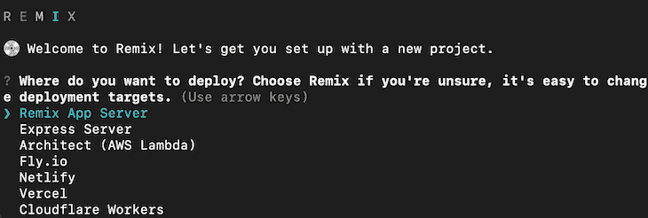
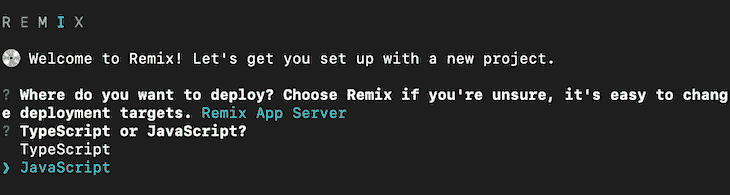
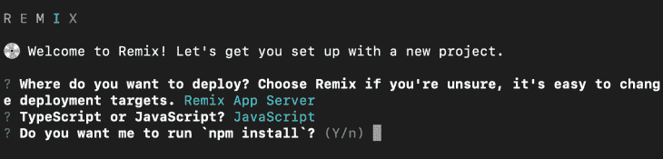
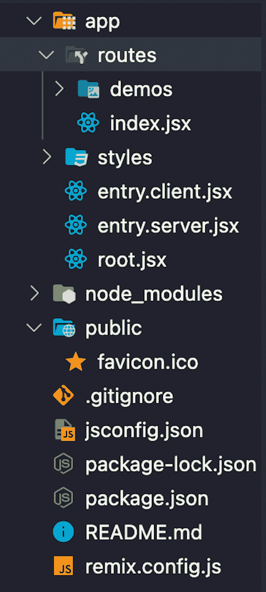
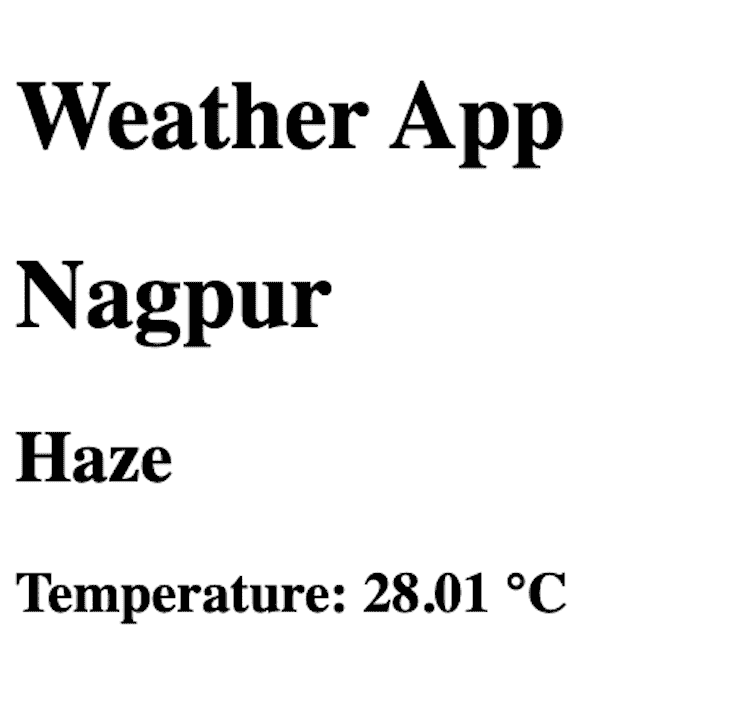

# Remix:关于 Next.js 的 React 框架指南

> 原文：<https://blog.logrocket.com/guide-to-remix-react-framework/>

***编者按:**这篇 Remix 的指南最后一次更新是在 2022 年 11 月 3 日，包括了更多关于 Remix 中状态管理的信息，以及 Remix 的服务器端渲染如何为 React 应用程序工作。此外，本次更新解决了 Remix 是否与 React Native 兼容，以及如何将 Remix 与 Redux 和其他库一起使用的问题。*

如今，似乎每隔一天就有一个 React 框架推出。尽管每个 React 框架都有一些特别的东西可以提供，但 Remix 还是脱颖而出。在最初提供付费订阅后，Remix 的创造者宣布该框架将于 2021 年 10 月开源。

Remix 是一个 React 框架，用于[服务器端渲染(SSR)](https://blog.logrocket.com/improve-app-performance-react-server-side-rendering/) 。这意味着后端和前端都可以使用一个 Remix 应用程序。数据呈现在服务器上，用最少的 JavaScript 提供给客户端。与 vanilla React 不同，在 vanilla React 中，数据在前端获取，然后呈现在屏幕上，Remix 在后端获取数据，并将 HTML 直接提供给用户。

在本文中，我们将讨论一些关于 Remix 的很酷的东西，然后继续使用这个新框架创建一个 SSR 天气应用程序。最后，我分享一下我个人对 Remix 的看法，以及我是否打算在未来的项目中使用 Remix。

### 先决条件

在继续学习本教程之前，我们先来看看需求:

如果你在教程的某个地方卡住了，这里有 [GitHub](https://github.com/atharvadeosthale/remix-weather-app) 库。

*向前跳转:*

## 使用 Remix 的好处

Remix 就像其他框架一样，有一些特殊的内置特性，方便了开发者。以下是我最喜欢的一些:

### 嵌套页面

路由文件夹中的任何页面都嵌套在路由中，而不是独立的。这意味着您可以将这些组件嵌入到您的父页面中，这也意味着更少的加载时间。

这样做的另一个好处是，我们可以对这些嵌入式页面实施错误边界，这将有助于错误处理。

### 误差边界

假设您在重新混合组件或嵌套路由中遇到错误。错误仅限于组件，组件将无法呈现或仅显示错误。在其他框架中，它会破坏整个页面，你会看到一个巨大的错误屏幕。

虽然[错误边界](https://blog.logrocket.com/testing-error-handling-patterns-next-js/)也可以在 Next.js 中实现， [Remix 在](https://remix.run/docs/en/v1/guides/errors)中构建了 [，我认为这是一个很酷的产品构建功能，这样用户就不会因为一个简单的错误而被锁定在整个页面之外。](https://remix.run/docs/en/v1/guides/errors)

### 过渡

Remix 自动为你处理所有加载状态；你所要做的就是告诉 Remix 当应用程序加载时要显示什么。在像 Next.js 这样的其他框架中，你需要使用一些状态管理库来设置加载状态，比如 [Redux](https://blog.logrocket.com/understanding-redux-tutorial-examples/) 或者[反冲](https://recoiljs.org/)。虽然在其他框架中有一些库可以帮助你做完全相同的事情，但是 Remix 已经内置了这一点。

### 传统形式

现在，我们回到开发者使用 [PHP](https://blog.logrocket.com/modern-tools-php-developers/) 的时候。我们曾经用一个有效的 PHP URL 指定一个表单方法和动作；我们将在混音中使用类似的方法。

我知道这听起来不好玩，因为我们习惯了`onClick`、`onSubmit`和 HTTP 调用。但是 Remix 通过提供像`action`和`loader`这样的函数来执行服务器端操作，完全不同地处理了这种情况。在这些函数中很容易获得表单数据。这意味着完全没有必要向前端提供 JavaScript 来提交表单。

假设你有一个相当简单的网站，你真的不需要向前端提供 JavaScript。这种传统的表单方法在这些情况下效果最好。在其他框架中，您可能需要使用 JavaScript 进行`fetch`或`axios`调用，但是在 Remix 中您不需要这样做。它有助于保持事情简单。

## 使用混音的缺点

虽然 Remix 有很多好处，但是使用该框架的某些方面可能会让您犹豫:

Remix 是最近才开源的。正因为如此，目前在制作项目中使用 Remix 的人仍然不多。

如果您在使用 Remix 时遇到了问题，在互联网上找到解决方案可能会很困难，您可能需要在论坛上发布问题，并等待一段时间才能得到回应。

### 潜在混乱的路由系统

当我开始使用 Remix 时，我发现路由系统令人困惑。我无法理解嵌套路由的概念。这是因为我习惯了没有这个特定路由系统的其他框架，这意味着 Remix 有一点学习曲线。

## Remix 和 Next.js 有什么不同？

乍一看，Remix 和 Next.js 似乎没有太大区别，因为[两者都支持 SSR](https://blog.logrocket.com/implementing-ssr-next-js-dynamic-routing-prefetching/) 。然而，虽然 Next.js 支持 SSG 和其他令人敬畏的工具，但 Remix 只专注于 SSR。

## 创建混音应用程序

导航到一个安全的目录，在终端中使用以下命令来初始化我们的 Remix 应用程序的安装:

```
npx [email protected] weather-app

```

当然，你可以把`weather-app`换成任何适合你的项目名称。一旦你点击`Enter`，你会看到一个交互式菜单，帮助你制作一个混音应用程序:



就像上图一样，会问你要部署在哪里。我们只是在试验，不会在本教程中涉及部署，所以我们将使用 Remix 应用服务器:



接下来，会询问你是想使用 [JavaScript](https://logrocket.com/for/javascript-developer-tools/) 还是 [TypeScript](https://blog.logrocket.com/tag/typescript/) 。为了简单起见，我将在本教程中使用 JavaScript:



然后会问你 Remix 要不要用`npm install`。类型`y`。这将安装运行 Remix 所需的依赖项。

现在，导航到项目目录，使用下面的命令安装这个项目需要的一些依赖项:

```
npm install axios dotenv

```

我们正在安装`axios`，这样我们就可以从我们的应用程序向 OpenWeatherMap API 发送 HTTP 请求。我们将使用 dotenv 将我们的 API 密钥存储在一个环境变量中。

现在，让我们编辑`package.json`，以便在 Remix 的开发模式中使用环境变量。将`dev`脚本替换为:

```
"dev": "node -r dotenv/config node_modules/.bin/remix dev"

```

这将为您的项目启用环境变量。现在，为我们的环境变量创建一个新文件`.env`,并以如下格式存储 API 密钥:

```
WEATHER_API_KEY={api key here}

```

现在，让我们看看混音文件夹的结构:



`app`文件夹包含我们的主应用程序逻辑。`routes`文件夹下的所有文件夹和文件都是公开的，可以通过 URL 访问。`styles`文件夹包含了所有的 CSS 文件，它们的存储方式与 routes 相似。

`entry.client.jsx`和`entry.server.jsx`是 Remix 管理的，最好不要碰入口文件。相反，创建新文件并处理它们。`root.jsx`文件包含我们的一般页面布局。

`public`文件夹包含我们的公共资产，如静态图像和收藏夹图标，而`remix.config.js`文件包含我们的 Remix 应用程序的基本配置，如它应该在开发模式下运行的端口。

### 清理混音应用程序

当你第一次设置一个混音 app 时，它不是空白的；Remix 在应用程序中内置了一些教程和演示。让我们首先清理它们，以便我们可以在我们的天气应用程序上工作。

转到`root.jsx`并清空默认的`Layout`组件，使其看起来像这样:

```
function Layout({ children }) {
  return <div>{children}</div>;
}

```

现在，进入`styles`文件夹，移除`demos`文件夹，清空`dark.css`和`global.css`的内容。这将为我们清理所有的造型。

删除`routes`目录中的`demos`文件夹，因为我们不需要它。

然后，转到`index.jsx`并清空所有内容。只需确保它有一个默认的导出组件，如下所示:

```
export default function Index() {
  return <div></div>;
}

```

### 构建表单并获取天气

现在，让我们用下面的布局在`index.jsx`中创建一个表单:

```
export default function Index() {
  return (
    <div>
      <form action="/weather" method="get">
        City: <input type="text" name="city" />
        <input type="submit" value="Fetch weather" />
      </form>
    </div>
  );
}

```

在这里，我们用方法`get`创建了一个表单，我们有一个与输入字段相关联的名称，当表单被提交时，这个名称将被附加到 URL 上。

现在，让我们看看如何使用路由嵌套。在`routes`文件夹中创建一个名为`weather.jsx`的新文件；它将处理`/weather`路线:

```
import { Outlet } from "react-router";
export default function Weather() {
  return (
    <>
      <h1>Weather App</h1>
      <Outlet />
    </>
  );
}

```

`Outlet`组件将在`routes`文件夹中寻找`weather`文件夹，并将页面嵌入到主页中。这应该能让你了解页面嵌套在 Remix 中是如何工作的。

然后，在`routes`中新建一个名为`weather`的文件夹，并在`weather`文件夹中新建一个文件`index.jsx`。让我们创建一个`loader`函数，每当页面被请求时，它都会在服务器端运行:

```
export async function loader({ request }) {
  try {
    const url = new URL(request.url);
    const search = new URLSearchParams(url.search);
    if (!search.get("city")) return redirect("/");
    const city = search.get("city");
    const res = await axios.get(
      `https://api.openweathermap.org/data/2.5/weather?q=${city}&appid=${process.env.WEATHER_API_KEY}&units=metric`
    );
    console.log(res.data);
    return { city, type: res.data.weather[0].main, temp: res.data.main.temp };
  } catch (err) {
    console.error(err);
    redirect("/");
    return {};
  }
}

```

这里，我们从使用`GET`请求发送的 URL 查询中提取城市名称。然后，我们向 OpenWeatherMap API 发出请求，以获取该城市的天气。记住，我们应该在前端返回我们需要的数据，这样数据就可以呈现在屏幕上。

现在，让我们来看看结果屏幕的布局:

```
export default function Index() {
  const data = useLoaderData();
  return (
    <div>
      <h1>{data.city}</h1>
      <h2>{data.type}</h2>
      <h3>Temperature: {data.temp} °C</h3>
    </div>
  );
}

```

`useLoaderData`钩子获得使用`loader`函数返回的数据，这样我们就可以在前端呈现它。如果你做的一切都正确，你应该得到这样的天气渲染:



恭喜你。您已经使用 Remix 制作了您的第一个天气应用程序！

## Remix 的服务器端渲染如何与 React 应用一起工作

Remix 不同于 vanilla React，它在服务器端将 React 代码呈现为普通的 HTML，从而大大减少了 JavaScript 的数量。每当您访问一个页面时，服务器都会执行您提供的任何服务器端操作，然后继续将 React 代码呈现为普通的 HTML，并将其发送回客户端浏览器。

## Remix 可以和 React Native 一起使用吗？

Remix 是一个 web 框架，不能和 [React Native](https://youtu.be/3hLQURJM7ws) 一起使用。与 web 应用不同，移动应用完全是客户端的，不能在服务器端呈现。不同的操作系统有不同的应用母语。比如 Android 用的是 [Kotlin 和 Java](https://blog.logrocket.com/kotlin-vs-java-android-development/) ，而 iOS 用的是 [Swift](https://blog.logrocket.com/mastering-swift-fundamentals/) 和 [Objective C](https://en.wikipedia.org/wiki/Objective-C#:~:text=Objective%2DC%20was%20the%20standard,introduction%20of%20Swift%20in%202014.) 。服务器无法呈现这些代码，并且当前的技术不允许在设备上按需编译代码，因为可能存在攻击者可以用来窃取大量信息的漏洞。

## 状态管理如何与 Remix 一起工作

由于 Remix 是基于 React 的框架，所以所有的 React 库都可以在 Remix 上使用，包括像 Redux 和反冲这样的状态管理库。你可以使用 Create React App 中使用的 [Redux toolkit](https://blog.logrocket.com/smarter-redux-redux-toolkit/) ，在 Remix 中应该也可以。尽管由于 Remix 是服务器端呈现的，您将会经历页面刷新或页面的完全转换，丢失 Redux 存储中的所有状态。最佳实践应该是使用[R](https://blog.logrocket.com/persist-state-redux-persist-redux-toolkit-react/)[edux](https://blog.logrocket.com/persist-state-redux-persist-redux-toolkit-react/)[P](https://blog.logrocket.com/persist-state-redux-persist-redux-toolkit-react/)[ersist](https://blog.logrocket.com/persist-state-redux-persist-redux-toolkit-react/)在本地存储中保存状态。

然而，在服务器端呈现的应用程序中通常避免使用状态管理，因为用户令牌等数据通常保存在 cookies 中，并发送到服务器，服务器通过 props 将用户数据发送回页面。这是因为服务器无法读取浏览器的本地存储。可以用 Redux 搭配 Remix 吗？是的。应该用 Redux 搭配 Remix 吗？没那么快…想想你的用例。使用 cookies 的服务器端呈现解决了状态管理的大部分问题。

## 结论

我认为 Remix 很强大，应该会越来越受欢迎。我会用 Remix 而不是 Next.js 吗？可能不会，因为与 Remix 相比，Next.js 有一个庞大的社区来支持我。虽然，这是可以理解的，因为它只是新开源的。

这并不意味着我不喜欢这个框架。我可能会把它用在我的个人或有趣的项目上。我想对误差边界特性进行更多的实验。在我看来，在撰写本文时，Next.js 将是一个很好的选择，因为当我试图谷歌我在 Remix 中面临的一些问题时，我无法轻松找到解决方案。也许再过几年，事情会有所改变，Remix 会是一个更强大的框架，有一个巨大的社区做后盾。

既然 Remix 是开源的，你对尝试它感到兴奋吗？请在下面的评论中告诉我。

## 使用 LogRocket 消除传统反应错误报告的噪音

[LogRocket](https://lp.logrocket.com/blg/react-signup-issue-free)

是一款 React analytics 解决方案，可保护您免受数百个误报错误警报的影响，只针对少数真正重要的项目。LogRocket 告诉您 React 应用程序中实际影响用户的最具影响力的 bug 和 UX 问题。

[ ](https://lp.logrocket.com/blg/react-signup-general) [  ](https://lp.logrocket.com/blg/react-signup-general) [LogRocket](https://lp.logrocket.com/blg/react-signup-issue-free)

自动聚合客户端错误、反应错误边界、还原状态、缓慢的组件加载时间、JS 异常、前端性能指标和用户交互。然后，LogRocket 使用机器学习来通知您影响大多数用户的最具影响力的问题，并提供您修复它所需的上下文。

关注重要的 React bug—[今天就试试 LogRocket】。](https://lp.logrocket.com/blg/react-signup-issue-free)