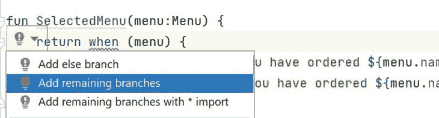

# Kotlin 中密封类的使用指南

> 原文：<https://blog.logrocket.com/guide-using-sealed-classes-kotlin/>

Kotlin 是一种用于开发多平台移动应用程序的现代开源语言。这是一种非常容易学习和友好的语言，维护和调试也很简单。Kotlin 采用了面向对象编程的特性和函数式编程概念，这使得 Kotlin 可以专注于简化代码，同时保持代码安全。

像任何面向对象的编程语言一样，Kotlin 在其代码库中使用了类和对象等特性。将类视为集合设计，将对象视为该设计的实现。简单地说，一个对象实现了实际的类蓝图。一个类定义了一个对象的所有属性和行为。

阶级的概念既广又深。Kotlin 甚至提供了不同的高级概念来编写类。例如，Kotlin 有密封类、数据类、抽象类和枚举类，让您可以更深入地研究和探索该类的选项。

在本指南中，我们将学习密封类的概念以及如何在 Kotlin 中使用它们。

### 内容

## 什么是密封类？

密封类表示受限的类层次结构。这允许您在父函数的范围内定义子类，允许您表示层次结构。在这种情况下，子或子类可以是任何类型，数据类、对象、常规类或另一个密封类。

密封类可以限制哪些其他类能够实现它们。这使您能够通过在项目中使用受限的值来表示应用程序中有限的可能性。

密封类是[枚举类](https://blog.logrocket.com/kotlin-enum-classes-complete-guide/)的扩展。枚举类(也称为枚举类型)只允许每个值有一个实例。我们通常使用枚举来存储相同类型的常量值。

枚举类也是受限的层次结构；然而，每个枚举常量只作为单个实例存在，而密封类的子类可以有多个实例。

枚举和密封类通常用于表示一个类型，该类型具有一组可能值中的几个值。为了理解密封类是如何工作的，让我们快速浏览一下如何使用 enum 类来建模表示有限数量的不同值的类型。

## 枚举类如何工作的一瞥

您可以使用关键字`enum`创建一个枚举类。Enum 是一个类类型，用于存储表示单个对象的一组类型的常数列表。假设你有一家餐馆，菜单上只有三种食物:披萨、汉堡和鸡肉。用户可能点了另一种食物，比如三明治，但是你的餐馆菜单上没有这种食物。

因此，当顾客试图点三明治时，他们应该受到限制，因为菜单上没有。应该添加一个类型安全，以防止客户订购不存在的食品。

您可以使用一个 enum 类来添加类型限制，在您的应用程序中只允许比萨饼、汉堡和鸡肉，没有用户可以点任何像三明治这样的随机项目。例如，我们可以在这个枚举类`Menu`中存储每个菜单类型的常量值:

```
enum class Menu{
   PIZZA,
   BURGER,
   CHICKEN
}

```

`Menu`类包含披萨、汉堡和鸡肉类型。所有这些在`Menu`枚举中的常量都是对象。我们可以使用这个`Menu`枚举获得它们的所有值。这些常量可以打印、初始化和遍历。在这种情况下，该类将添加一个类型安全。不能使用其他常量赋值。

这意味着您的应用程序将拥有从用户那里接受这三项内容的确切输入。如果用户试图输入与您的数据集无关的任何其他项目，这应该是一个错误。

您可以为这些枚举对象分配一些值。每个状态都可以分配给构造函数参数，如下所示:

```
enum class Menu (val quantity: Int){
   PIZZA (6),
   BURGER (4),
   CHICKEN (8)

```

这为这三种状态增加了一个参数。然而，一个特定的常数不可能有不同的状态。例如，如果你必须给`PIZZA`加上一个大小之类的东西，就不可能使用 enums 类。

使用枚举，单个状态适用于每个常数。然而，这个问题可以通过使用密封类来解决。密封类使您可以灵活地拥有不同类型的子类，这些子类可以包含不同常量的不同状态。

## 密封类和枚举类有什么区别？

下面是我们如何使用密封类来保存三种菜单状态:

```
sealed class Menu{
   class PIZZA:Menu()
   class BURGER: Menu()
   class CHICKEN:Menu()
}

```

就像我们之前说的，一个密封的类可以有子类。这些子类可以是任何类型；数据类、对象、常规类或其他密封类。

在这个例子中，状态有构造函数参数。让我们创建这些类型数据的子类，然后根据每个状态添加参数，如下所示:

```
sealed class Menu{
   data class PIZZA(val name: String, val size:String, val quantity:Int):Menu()
   data class BURGER(val quantity:Int, val size:String): Menu()
   data class CHICKEN(val quantity:Int, val pieces:String):Menu()
}

```

每个子类扩展到父类`Menu`。在本例中，每一项都有不同的参数。虽然披萨、汉堡和鸡肉扩展了`Menu`密封类，但是它们的参数不同。正如我们在上一步中看到的，这对于枚举是不可能的。密封类为您提供了拥有不同类型子类的灵活性，并包含状态。这意味着密封类的继承人可以有任意数量的实例，并可以存储状态，但枚举类不能。

密封类还提供有限数量的层次结构。这意味着如果您在项目的另一个文件中定义了不同的类，您就不能扩展类`Menu`。它提供有限数量的层次结构，使其成为私有的。因此，密封类的所有继承都必须在密封类本身所在的包中声明。

在这种情况下，它们必须在`Menu`的范围内定义。但是，您仍然可以在同一个文件中定义这些子类。例如:

```
sealed class Menu{
   data class PIZZA(val name: String, val size:String, val quantity:Int):Menu()
   data class BURGER(val quantity:Int, val size:String): Menu()
}
data class CHICKEN(val quantity:Int, val pieces:String):Menu()

```

## 使用带有`when`表达式的密封类

在我们的餐馆菜单示例中，我们代表了一组有限的可能性。菜单可以是比萨饼、汉堡或鸡肉。否则，它在菜单上不可用。应用程序必须在应用程序中穷尽所有这些可能性。

* * *

### 更多来自 LogRocket 的精彩文章:

* * *

科特林使用`when`表达式替代 Java 中使用的`if`、`else if`和`else`或`switch` case 表达式。这些表达式使用`else`分支来确保所有的可能性都被处理了。

表达式必须总是返回值。因此，所有事例都必须出现在表达式中。通常，您需要包含一个`else`子句来捕捉任何可能被遗漏的内容。`else`子句使表达式变得详尽，确保任何可能的情况都已实现。然而，当使用密封或枚举类时，不需要`else`子句。这是因为它们受限的类层次结构确保了所有可能的情况在编译时都是已知的。

枚举代表一组有限的类型/可能性。在这种情况下，每种类型都必须考虑并彻底执行。这种情况可以使用如下所示的`when`表达式轻松实现:

```
enum class Menu (val quantity: Int) {
   PIZZA(6),
   BURGER(4),
   CHICKEN(8)
}

fun SelectedMenu(menu:Menu) {
    return when (menu) {
      Menu.PIZZA -> println("You have ordered ${menu.name} ${menu.quantity} pieces")
      Menu.BURGER -> println("You have ordered ${menu.name} ${menu.quantity} pieces")
   }
}

```

在上面的例子中，我们没有添加所有的分支。表达式将在何时引发错误。这是因为`when`表达式必须是详尽的。因此，您需要添加必要的`PIZZA`、`BURGER`、`CHICKEN`或`else`分支。

使用受限层次结构时，IDE 已经知道您需要实现的分支。它甚至会突出显示一条错误消息，指出 when 表达式缺少什么:

```
'when' expression must be exhaustive, add the necessary 'CHICKEN' branch or 'else' branch instead.

```

您甚至可以使用快速修复来添加任何剩余的分支。



这确保必须实现枚举和密封类的所有有限可能性。在这种情况下，我们不需要“else”分支。添加`Menu.CHICKEN -> println("You have ordered ${menu.name} ${menu.quantity} pieces")`将使表达式完整。您可以将此记录在`main()`文件夹中:

```
fun main() {
   SelectedMenu(Menu.PIZZA)
   SelectedMenu(Menu.BURGER)
   SelectedMenu(Menu.CHICKEN)
}

```

输出:

```
You have ordered PIZZA: 6 pieces
You have ordered BURGER: 4 pieces
You have ordered CHICKEN: 8 pieces

```

`when`表达式确保您跟踪您的枚举中可能的选项，这很好。然而，正如我们前面讨论的，枚举在表示常数时缺乏多样性。每个枚举常量只作为单个实例存在。在这种情况下，密封类将会派上用场:

```
sealed class Menu{
   data class PIZZA(val quantity:Int, val size:String, val name: String):Menu()
   data class BURGER(val quantity:Int, val size:String): Menu()
   data class CHICKEN(val name:String, val pieces:Int):Menu()
   object NotInTheMunu : Menu()
}

fun SelectMenu(menu: Menu) {
   when (menu) {
      is Menu.BURGER -> println("${menu.quantity} ${menu.size} BURGER")
      is Menu.CHICKEN -> println("${menu.pieces} CHICKEN ${menu.name}")
      is Menu.PIZZA -> println("${menu.quantity} ${menu.size} ${menu.name} PIZZA")
      Menu.NotInTheMunu -> println("Not in the menu")
      // else clause is not required as we've covered all the cases
   }
}

```

上述每个菜单都有与之关联的值，这些值可以在运行时更改。借助 Kotlin 的智能转换系统，我们可以直接从`Menu`参数中提取这些值。只要 when 表达式的返回类型是相同的，我们就可以在不强制转换它们的情况下做到这一点:

```
private fun SelectedMenu(){
   val menuItem = readLine()

   val menu = when {
      menuItem!!.contains("BURGER", true) -> Menu.BURGER(10, "king size")
      menuItem.contains("CHICKEN", true) -> Menu.CHICKEN("wings", 4)
      menuItem.contains("PIZZA", true) -> Menu.PIZZA( 1, "medium","Pepperoni")
      else -> Menu.NotInTheMunu
   }

   SelectMenu(menu as Menu)
   SelectedMenu()
}

```

运行主函数中的`SelectedMenu()`来执行上面的值:

```
fun main() {
   println("Select Menu")
   SelectedMenu()
}

```

然后在交互式 ide 命令行中添加一个菜单项，并观察结果。

## 什么是密封接口？

在 [Kotlin 1.5](https://kotlinlang.org/docs/whatsnew15.html#sealed-interfaces) 中引入了密封接口。具体来说，`sealed`修饰符作用于接口就像它作用于类一样。另外，密封接口也是有效的 Kotlin 接口。这意味着不仅密封接口的所有实现在编译时都是已知的，而且它还具有一个 [Kotlin 接口](https://kotlinlang.org/docs/interfaces.html)的所有典型特征。

您可以在 Kotlin 中定义一个`sealed`接口，如下所示:

```
sealed interface Menu

```

然后，您可以按如下方式使用它:

```
sealed interface Menu {
  data class PIZZA(val name: String, val size: String, val quantity: Int): Menu
  data class BURGER(val quantity: Int, val size: String): Menu
  data class CHICKEN(val quantity: Int, val pieces: String): Menu
}

```

就像密封类一样，您可以依靠密封接口来编写详尽的`when`表达式:

```
fun draw(menu: Menu) = when (menu) {
   is Menu.PIZZA -> // ...
   is Menu.BURGER -> // ...
   is Menu.CHICKEN -> // ...
}

```

注意，else 分支不是必需的，因为所有可能的实现都已经被`when`语句覆盖了。

## 密封类与密封接口

如前所述，`sealed`修饰符以同样的方式作用于类和接口。所以，你可能想知道为什么你应该使用密封接口而不是密封类。至少有两个很好的理由。让我们深入研究一下。

### 1.Kotlin 枚举类可以实现密封接口

密封接口的行为类似于标准 Koltin 接口。考虑到 Kotlin 中的 enum 类可以实现接口，这也意味着 enum 可以实现密封的接口。[点击](https://blog.logrocket.com/kotlin-enum-classes-complete-guide/)了解更多关于科特林枚举的信息。

相反，Kotlin 枚举类不能从类派生。因此，Kotlin 枚举不能从密封类派生。因此，这意味着在 Kotlin 中允许使用以下代码:

```
sealed interface A 

enum class B : A

```

这将编译没有错误。

相反，下面的片段在 Kotlin 中是非法的:

```
sealed class A 

enum class B : A()

```

这将导致以下错误:

```
Enum class cannot inherit from classes

```

### 2.密封接口允许多重继承

就像标准接口一样，Kotlin 类可以实现多个密封接口。这意味着密封接口允许定义更灵活的受限类层次结构。

让我们考虑下面的例子:

```
// to define two new subhierarchies
sealed interface DinnerMenu
sealed interface LunchMenu

sealed class Menu {
    // resticting the Menu hieararchy to LaunchMenu and DinnerMenu
    data class PIZZA(val name: String, val size: String, val quantity: Int): Menu(), DinnerMenu
    data class BURGER(val quantity: Int, val size: String): Menu(), LunchMenu
    data class CHICKEN(val quantity: Int, val pieces: String): Menu(), LunchMenu
}

```

通过添加两个密封接口，您可以将`Menu`层次结构限制为两个新的子层次结构。详细地说，`LunchMenu`层级将包含`Menu.BURGER`和`Menu.CHICKEN`。而`DinnerMenu`层级将只包含`Menu.PIZZA`。

然后，您可以按如下方式使用这些新的子层次结构:

```
fun logMenu(menu: Menu) {
    when (menu) {
        is Menu.PIZZA -> print("pizza")
        is Menu.BURGER -> print("burger")
        is Menu.CHICKEN -> print("chicken")
    }
}

fun logLunchMenu(menu: LunchMenu) {
    when (menu) {
        is Menu.BURGER -> print("burger")
        is Menu.CHICKEN -> print("chicken")
    }
}

fun logDinnerMenu(menu: DinnerMenu) {
    when (menu) {
        is Menu.PIZZA -> print("pizza")
    }
}

```

这个例子表明最初的`Menu`层次结构仍然以同样的方式工作。有所变化的是现在还有了`LunchMenu`和`DinnerMenu`子层次。

## 在科特林管理州

让我们学习如何使用 Kotlin 的密封类来管理状态。这种情况可以使用枚举类或抽象类来实现，但是我们将进一步研究为什么在这种情况下密封类优于枚举和抽象类。

### 使用枚举类

enum 类允许您将对象的值限制为某个特定的值集。这就是我们如何在枚举中表示这些状态:

```
enum class ResultState{
    LOADING,
    SUCCESS,
    ERROR,
}

```

为了遍历这些状态，我们将使用在上一步中描述的`when`表达式。然后，我们添加所有可能的分支/状态:

```
 fun UIResult(resultState: ResultState) = when(resultState){
    ResultState.LOADING -> println("The Data is loading...Please wait")
    ResultState.SUCCESS -> println("Data has been loaded successfully")
    ResultState.ERROR -> println("An Error encountered while loading data")
}

```

现在我们可以在主函数中打印出这些状态:

```
fun main(){
    UIResult(ResultState.LOADING)
    UIResult(ResultState.SUCCESS)
}

```

然而，这种情况最适合用于从互联网动态加载数据。您可以使用不同的架构模式，例如存储库模式、Redux、MVI(模型-视图-意图)和 MVVM(模型-视图-视图-模型)。在这种情况下，让我们尝试创建存储库模式来表示整个应用程序中的单个实例。这将尝试实现和获取数据实例，就像它在典型的数据获取 API/数据库中所表示的那样:

```
object MainRepository{

   private var data:String? = null

   fun loading(): ResultState {
      val loadData = ResultState.LOADING
      data = ""
      return loadData
   }

   fun display (): ResultState {
      val displayData = ResultState.SUCCESS
      data = null
      return displayData
   }

   fun error(): ResultState {
      return ResultState.ERROR
   }
}

```

最后，在主函数中执行上述数据加载状态:

```
fun main(){
   UIResult(MainRepository.loading())
   UIResult(MainRepository.display())
   UIResult(MainRepository.error())
}

```

我们已经使用 enum 限制层次来管理这些状态的执行。但是，加载这些数据需要为每个状态返回不同的常数。在这种情况下，我们需要一个异常，让我们知道我们处于哪种错误状态。一方面，加载这些数据需要成功状态来返回正在获取的数据的类型。这可以是数据数组、字符串或任何其他数据类型。这意味着每个州都是不同的。

这种情况不能用枚举来解决。每个状态都有不同的执行参数。我们可以使用抽象类来表示这些状态，以便展示每个状态执行的参数。

### 使用抽象类

以下代码显示了如何使用 Kotlin 中的抽象类来管理状态:

```
abstract class ResultState{
   object LOADING: ResultState()
   data class SUCCESS(val viewData: Array<Any>): ResultState()
   data class ERROR(val errormessage: Throwable?): ResultState()
}
fun UIResult(resultState: ResultState) = when(resultState){
   is ResultState.LOADING -> println("The Data is loading...Please wait")
   is ResultState.SUCCESS -> println("Data has been loaded successfully")
   is ResultState.ERROR -> println("An Error encountered while loading data")
}

```

注意当使用摘要时，它要求你添加一个`else`分支:

```
fun UIResult(resultState: ResultState) = when(resultState){
   is ResultState.LOADING -> println("The Data is loading...Please wait")
   is ResultState.SUCCESS -> println("Data has been loaded successfully")
   is ResultState.ERROR -> println("An Error encountered while loading data")
   else -> println("Unknown error")
}

```

现在，我们模仿我们想要获取的数据，就像这样:

```
object MainRepository{

   private var data:String? = null

   fun loading(): ResultState {
      val loadData = ResultState.LOADING
      data = ""
      return loadData
   }
   fun display (): ResultState {
      val displayData = ResultState.SUCCESS(arrayOf(String))
      data = null
      return displayData
   }
   fun error(): ResultState {
      return ResultState.ERROR(null)
   }
}

```

这里需要注意的关键点是，您需要在您的`when`表达式中添加一个`else` case。但是，这种情况容易出错。使用抽象类时，IDE 不知道何时所有分支都被彻底利用。

让我们看看如果您决定添加一个额外的状态，例如`object InProgress: ResultState()`，会发生什么，如下所示:

```
abstract class ResultState{
   object LOADING: ResultState()
   data class SUCCESS(val viewData: Array<Any>): ResultState()
   data class ERROR(val errormessage: Throwable?): ResultState()
   object InProgress: ResultState()
}

fun UIResult(resultState: ResultState) = when(resultState){
   is ResultState.LOADING -> println("The Data is loading...Please wait")
   is ResultState.SUCCESS -> println("Data has been loaded successfully")
   is ResultState.ERROR -> println("An Error encountered while loading data")
   else -> println("Unknown error")
}

```

在这种情况下，编译器不会指示您应该将`InProgress`的`ResultState`逻辑添加到我们的`when`语句中。相反，在运行时，它将默认为 else 情况，这可能会导致错误。

另一方面，抽象将丢失枚举试图实现的受限层次结构。

这迫使您使用密封类来确保所有分支都被彻底执行，同时确保受限类的概念贯穿整个应用程序。

### 使用密封类

密封类允许您限制可以创建的对象类型，从而允许您编写更全面和可预测的代码。例如，以错误状态为例。在这种情况下，一个错误可以有很多实例，比如`ServerError`、`InternalError`或`UnknownError`。

下面是我们如何将它们表示为一个密封类:

```
sealed class ResultState{
   object LOADING: ResultState()
   data class SUCCESS(val viewData: Array<Any>): ResultState()
   sealed class ERROR: ResultState() {
      class InternalError(val errormessage: java.lang.InternalError): ERROR()
      class ServerError( val errormessage: java.rmi.ServerError?): ERROR()
      class UnknownError(val errormessage: java.lang.UnknownError): ERROR()
   }
}

```

此外，当使用密封类时，您被迫在编译前添加详尽的实现；否则，您会收到一个错误:

```
fun UIResult(resultState: ResultState) = when(resultState){
   is ResultState.LOADING -> println("The Data is loading...Please wait")
   is ResultState.SUCCESS -> println("Data has been loaded successfully")
   is ResultState.ERROR.InternalError -> println("Internet error occurred")
   is ResultState.ERROR.UnknownError -> println("Query occurred")
   is ResultState.ERROR.ServerError -> println("Server occurred")
 }

```

现在，我们模拟想要获取的数据:

```
object MainRepository{

   private var data:String? = null

   fun loading(): ResultState {
      val loadData = ResultState.LOADING
      data = ""
      return loadData
   }
   fun display (): ResultState {
      val displayData = ResultState.SUCCESS(arrayOf(String))
        data = null
      return displayData
   }
   fun serverError(): ResultState.ERROR.ServerError{
      return ResultState.ERROR.ServerError(null)
    }
   fun internalError(): ResultState.ERROR.InternalError{
      val errormessage = InternalError()
      return ResultState.ERROR.InternalError(errormessage)
   }
   fun unknownError (): ResultState.ERROR.UnknownError {
      val errormessage = UnknownError()
      return ResultState.ERROR.UnknownError(errormessage)
   }
}

```

最后，在主函数中执行上述数据加载状态:

```
fun main(){
   UIResult(MainRepository.loading())
   UIResult(MainRepository.display())
   UIResult(MainRepository.unknownError())
   UIResult(MainRepository.serverError())
   UIResult(MainRepository.internalError())
}

```

## 结论

在本文中，我们了解了 Kotlin 的密封类是如何工作的，以及为什么它们可能是比枚举或抽象类更好的选择。我们还回顾了 Kotlin 中使用密封类的状态管理。希望您有足够的信心在下一个 Kotlin 项目中使用密封类！

如果你有任何问题，请在下面的评论区留言。

## LogRocket :即时重现你的安卓应用中的问题。

[](https://lp.logrocket.com/blg/kotlin-signup)

[LogRocket](https://lp.logrocket.com/blg/kotlin-signup) 是一款 Android 监控解决方案，可以帮助您即时重现问题，确定 bug 的优先级，并了解您的 Android 应用程序的性能。

LogRocket 还可以向你展示用户是如何与你的应用程序互动的，从而帮助你提高转化率和产品使用率。LogRocket 的产品分析功能揭示了用户不完成特定流程或不采用新功能的原因。

开始主动监控您的 Android 应用程序— [免费试用 LogRocket】。](hhttps://lp.logrocket.com/blg/kotlin-signup)